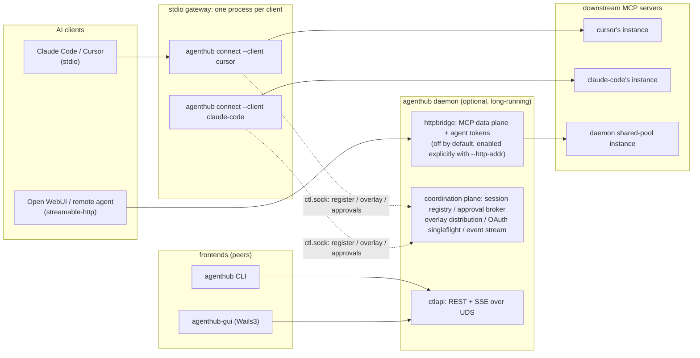
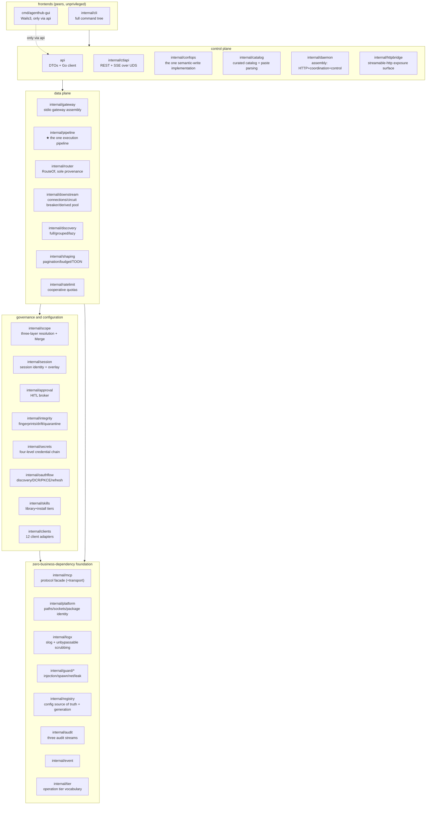
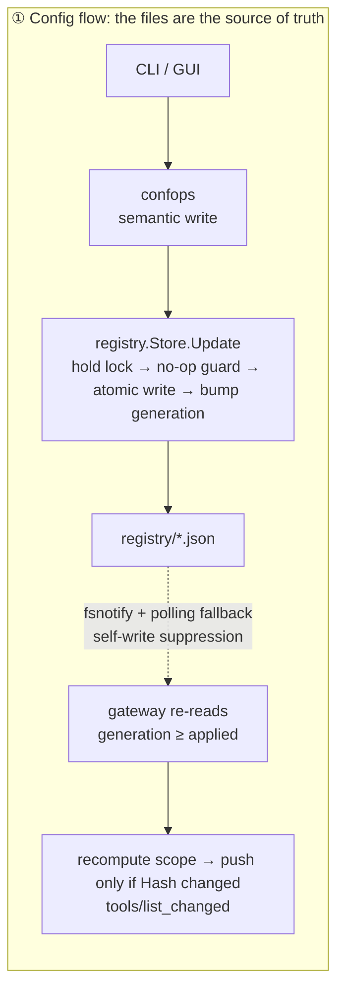
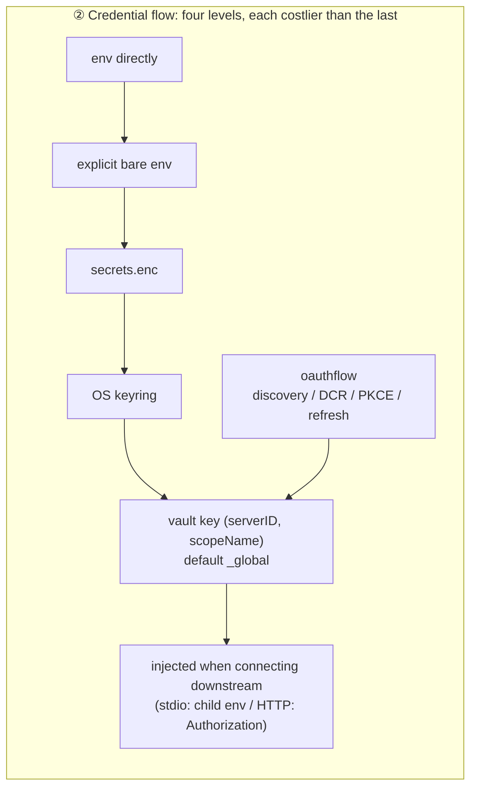
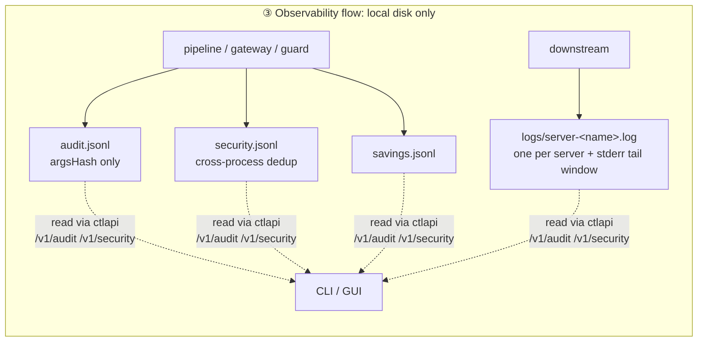
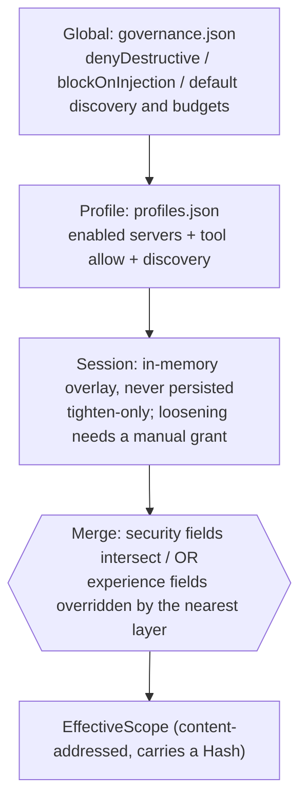
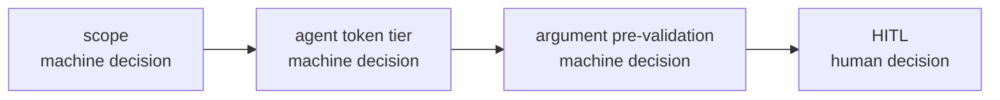

# Architecture overview

AgentHub is a local hub for agent services: one configuration, one set of credentials, one governance
pipeline, shared by every AI client (Claude Code, Cursor, Codex, Open WebUI, and so on). This document
explains **how the system is carved up, how the processes are laid out, and where the data flows**.
Per-package detail lives in [modules/](modules/), the timing of key flows in [flows.md](flows.md), and
the conventions you don't get to change casually in [canonical.md](canonical.md).

---

## 1. The one-sentence model

The client thinks it's connected to a single MCP server; it's actually connected to AgentHub's
gateway. The gateway decides which tools it can see based on the current session's **effective
scope**, every call passes through **the same execution pipeline** (gates → downstream → defenses and
shaping), and the result goes back. Configuration, credentials, auditing, and approvals all converge
at this layer, leaving the client side with a single line of `command`.

---

## 2. Process model: the dual-mode gateway



**stdio access = one independent gateway process per client.** `agenthub connect --client <id>` is not
a forwarding shell; it's a complete gateway: it reads the registry itself, connects downstreams
according to this client's scope itself, injects credentials itself, and runs the security pipeline
itself. That buys four kinds of isolation for free — credentials differentiated per client, connection
parameters (`${ROOT}`/cwd) differentiated per client, one client's slow call never blocking another,
and a downstream crash affecting only one client.

**The daemon is an optional value-add, not a requirement.** It handles three things: the HTTP access
surface (a shared downstream connection pool), the control plane (the management API for CLI and GUI),
and the coordination plane (session registry, approval broker, overlay distribution, OAuth refresh
singleflight). The gateway **never auto-starts the daemon** — the stdio data plane having zero
dependency on the daemon is the core selling point of this model, and auto-starting would turn
"optional" into de facto mandatory. Degradation when the daemon is absent is explicit: calls that need
human approval are rejected outright (fail-closed), session-level dynamic scope is unavailable (the
static three layers work as usual), and OAuth refresh falls back to file locks.

The price is that the discipline of multiple processes writing the same disk has to be right: one
`O_APPEND` write per log line, cross-process file locks for fingerprints and the quarantine set,
cross-process deduplication of security events. These aren't belt-and-braces; they're concurrency
correctness dependencies.

**The HTTP data plane doesn't exist by default.** The MCP exposure surface in `internal/httpbridge` is
enabled explicitly by `agenthub daemon start --http-addr <host:port>`; **no address means no
listener** (not "there's a default port"). A non-loopback address additionally requires
`--http-allow-remote`, or the daemon **fails to start** rather than quietly falling back to loopback —
an exposure surface the configuration claims must either materialize or raise an error. The bind
itself must also pass `AuthorizeBind`: a listener with no admin token, no active agent token, and no
registered clients is refused.

**The HTTP surface reuses the same gateway; it's not a second assembly.** The daemon maps an
authenticated credential to a `gateway.Conn` — the very gateway body behind `agenthub connect`, just
attached to an in-memory pipe instead of stdin/stdout. Requests are written into the same frame reader,
so they pass through the same discovery surface, the same router, and the same `pipeline.Execute` call
site. The credential enters the governance chain through only two existing entry points: `Caller.Tier`
→ `pipeline.CallRequest.CallerTier` (the token tier gate), and `Caller.Servers` / `Caller.Profile` →
an extra layer in `scope.Sources.Extra` (intersected by the same `Merge` used for the persisted
layers, so it can only narrow). Connections are reused **per credential** and reclaimed once idle, so
downstream connections are shared by credential rather than duplicated per HTTP session.

**"What state is this server in right now?" follows the same line.** The daemon doesn't connect
downstreams when the data plane is off, so it also shouldn't reopen a connection just to light up a
status indicator on `/v1/servers` (that would mean one extra resident child process per stdio server,
and doubled OAuth and quota consumption for remote servers). The gateways are the ones actually holding
connections, so the gateways **report** over the control connection —
`POST /v1/gateway/{sid}/servers`, a full snapshot, living and dying with the session. The daemon's only
job is folding N clients' N views of the same server into one: connection state takes the worst, tool
count takes the max, and the detail spells out **who** saw it. When no gateway holds a given server, its
status is `unknown / "not observed"` — a statement about observers, not a certificate of health.

---

## 3. Core module map

Packages belong to layers; per-package detail is in [modules/](modules/). This table answers "which
package holds the thing I want to change."



The nine packages worth knowing first:

| Package | One-line responsibility | Why it matters |
|---|---|---|
| `internal/mcp` | The one MCP protocol facade, stdlib only | The only place in the repo allowed to touch protocol implementation; bounded reads, cancellation forwarding, and reverse RPC all live here |
| `internal/registry` | Config source of truth: multi-document + atomic writes + generation + watch | This is what makes "the source of truth is the files, not the daemon's memory" real |
| `internal/confops` | The **one** semantic-write implementation (add a server, edit a profile, flip a governance switch) | CLI and control plane are two frontends over one rule set; the rules exist once |
| `internal/scope` | Three-layer resolution chain + pure `Merge` + content-addressed `EffectiveScope` | Every "who can see what" decision; security fields can only get tighter |
| `internal/router` | Namespace aggregation and `RouteOf` as sole provenance | The only legal way to recover `(server, tool)` from an exposed name |
| `internal/pipeline` | ★ The one execution pipeline: four gates + defend_and_shape | Every call path converges here, so the gates cannot fork |
| `internal/downstream` | Downstream connection lifecycle, serial queue, circuit breaker, derived instance pool | Downstream instability stops at this layer instead of leaking to callers |
| `internal/gateway` | stdio gateway assembly and lifecycle (the implementation behind `connect`) | The data plane's assembly point; the HTTP surface reuses it too |
| `internal/guard/*` | Injection scanning / spawn anti-smuggling / SSRF / leak detection | Zero business dependencies, safely reusable by any layer |

---

## 4. Layering and dependency direction

Four dependency directions are **CI failure conditions**, not review conventions: `api` and
`cmd/agenthub-gui` import no `internal/*` ("the GUI is optional and unprivileged" is a compile-time
property); `internal/mcp` is stdlib-only and the only package touching protocol implementation;
`internal/pipeline` must not import `internal/ctlapi` (the data plane does not depend on the control
plane); and `internal/mcp`, `internal/platform`, `internal/logx`, `internal/guard/*` carry zero
business dependencies, so any layer can reuse them. The normative wording — and the numbering that
code comments cite as "§2 rule 3" — is [canonical.md §2](canonical.md#hard-dependency-direction-constraints-enforced-at-compile-time-by-depguard).

What belongs here is how they are *held*: `internal/depguardtest` plants violating probes in the
constrained packages — inside a disposable copy of the checkout, never the checkout itself — and
asserts golangci-lint reports each one. A lint rule that is configured but not in effect is more
dangerous than no rule at all, so the implicit fifth constraint is that **every rule must have a
failing case**, and that case must not be able to pass by skipping itself.

The layering is also why `internal/tier` is a standalone leaf rather than a type inside `pipeline`:
five packages need to say the word "read", and none of them should import another to do it. canonical.md
§2 records what the old placement cost — it turned rule 3's failing case into an import cycle rather
than a lint error, which left the rule unprovable.

---

## 5. What a tool call passes through

```mermaid
flowchart LR
    A["client<br/>tools/call"] --> B["gateway<br/>dispatch"]
    B --> C{"what is the name"}
    C -->|"meta-tool"| D["discovery handler"]
    C -->|"regular tool"| E["router.RouteOf<br/>sole provenance"]
    D -->|"call_tool*"| E
    E --> F["pipeline.Execute"]
    F --> G1["scope gate"] --> G2["token tier gate"] --> G3["argument pre-validation"] --> G4["HITL gate"]
    G4 --> H["ratelimit admission<br/>(a quota wrapper, not a fifth gate)"]
    H --> I["downstream.Call<br/>circuit breaker / retries / serial queue"]
    I --> J["defend_and_shape"]
    J --> J1["injection scan"] --> J2["leakguard"] --> J3["shaping pagination"]
    J3 --> K["audit append<br/>argsHash only"]
    K --> A
```



Three unshakeable properties along this chain:

**The gate chain order is frozen** (`scope → token tier → argument pre-validation → HITL`, see
`internal/pipeline`), pinned by tests. All three machine-decidable gates come before human approval —
a call not worth bothering a human about should never produce an approval request, so the approval
queue holds only things a human genuinely has to decide.

**There is only one execution path.** A direct call and lazy mode's `call_tool` go through the same
`pipeline.Execute`. This isn't upheld by convention: tests assert that both paths advance every gate's
counter identically — the gates cannot fork. Any **new** execution path must carry the same counter
assertions; "there are already tests" is not an exemption.

**Success and error branches share the defenses.** A malicious downstream can carry an injection
payload in a JSON-RPC error, so `defend_and_shape` scans both branches, in the order injection →
leakguard → shaping, meaning the shaper always sees already-scrubbed text.

---

## 6. Three data flows

Beyond the call chain, three flows determine the system's behavior. What they have in common: **the
source of truth is always on disk; memory is only a projection.**







Each flow has one property you must not forget:

- **Config flow**: events are notifications and carry no snapshot, so the reader re-reads the file and
  adopts on "generation read ≥ generation applied" — never on equality with the event's `Rev`
  ([canonical.md §5c](canonical.md#5c-the-config-hot-reload-path-two-things-not-to-get-wrong) has both
  rulings, `modules/foundation.md` the mechanism).
- **Credential flow**: the vault key is the composite `(serverID, scopeName)` and has been since day
  one — one of the three things canonical.md §4 says must never be retrofitted.
- **Observability flow**: **the audit never records args** — the field doesn't exist at the type level,
  only `argsHash`. The raw arguments only ever flow through memory and the SSE channel.

---

## 7. Scope: visibility and connection are two separate planes

The three-layer resolution chain (most specific wins):



**`clients.json` is not a layer.** It answers exactly one question — *which* profile this client is on
(`agenthub client bind <client> <profile>`, or nothing, meaning "follow the globally active profile").
It contributes no servers, no tool selectors, no discovery mode of its own. The chain used to have two
more layers here: a client layer that narrowed on top of its profile, and a project layer keyed by
longest-prefix match on the client's reported MCP root. Both are retired, for the same reason — they
made "which profile is this client on" an *incomplete* answer to "what can this client see". An
operator had to read two or three places and intersect them by hand, which is precisely the arithmetic
this model exists to do for them. Narrowing now has one home, the profile; a client that needs a
different surface gets bound to a different profile.

The retirement has a direction, and it is the open one: both retired layers existed to **narrow**, so a
configuration that still carries them now shows that client *more* than it used to. The registry
preserves unknown JSON verbatim, so a legacy `projects` block survives on disk looking exactly as
authoritative as it did while it worked. `agenthub doctor` therefore **warns** (not informs) on
`scope:projects`, naming the clients and saying the block no longer applies — but never deletes it:
doctor reports, the operator decides.

The merge rules follow from the nature of each field, not from case-by-case judgment: **security
fields** (server visibility, tool allow) intersect layer by layer, denies union, approval switches OR
together — everything can only get tighter. **Experience fields** (discovery mode, result budget) are
won by the most specific layer. Two invariants: intersections are always keyed by the **original tool
name** (otherwise renaming or disambiguation suffixes would let you slip past a narrowing), and a
dangling profile reference resolves to the **empty set** rather than allow-all, with doctor raising an
explicit warning rather than staying silent.

**The visibility plane and the connection plane are separate.** The gateway connects at this client's
static high-water mark (global ∩ profile), while what each session sees is a query-time projection. So
narrowing a session's scope doesn't rebuild the router and doesn't restart downstream processes — which
is exactly why per-session granularity is feasible. Overlays are never persisted: a runtime loosening
that comes back from the dead is a security incident. That is also why `session scope` has no way to
write its edits back into configuration; the way to change what a client sees permanently is to edit
its profile or bind it to another one.

The session's root no longer enters resolution at all — with the project layer gone, no persisted layer
reads it — so it is not part of the resolver's cache key either, which is now `(clientID, registry
generation, overlayVersion)`. Keeping the root in the key would have split one client's cache across
every directory it happens to report from, for a value that cannot change the answer. The root still
reaches `internal/downstream`, which derives per-root server instances from it.

---

## 8. Three discovery modes

How the tool catalog is exposed to the agent is decided by `EffectiveScope.Discovery`:

| Mode | What's exposed | Suits |
|---|---|---|
| `full` | Every tool in scope | Few tools, or a client that filters for itself |
| `grouped` | One aggregate tool per server + a generic call entry point | Many tools, but you still want to skip searching |
| `lazy` | The five meta-tools: `status` / `search_tools` / `describe_tool` / `call_tool` / `fetch_result` | Very many tools; trades token budget for coverage. **`discovery.DefaultMode`** — what a scope that sets no mode gets |

In lazy mode `call_tool` can be split by a governance switch into three variants, `call_tool_read` /
`call_tool_write` / `call_tool_destructive`, so an IDE's tool allowlist can permit them separately. The
tier is derived from downstream annotations, and **no annotations at all means destructive**
(fail-closed); a variant that conflicts with the actual tier is rejected with a hint naming the correct
variant.

**The switch is not read yet.** `internal/discovery` implements all of the above and tests it, but the
stdio gateway never sets `discovery.Options.IntentVariants` from `intentVariants`, so setting that field
in governance changes nothing today — see the unwired-faces appendix in
[modules/dataplane.md](modules/dataplane.md). This is written down here rather than only there because
this section is where someone decides to turn it on.

Search results carry a **compact signature** rather than a full schema; the agent calls `describe_tool`
when it needs detail. Every tool id that can't be shown — nonexistent, out of scope, quarantined, or
disabled — returns the same copy, because differentiated errors would turn `describe_tool` into an
enumeration oracle.

---

## 9. How the three lines of defense stack



| Line | Granularity | Decided by | Blocks |
|---|---|---|---|
| scope | server / tool visibility | Machine (three-layer intersection) | Capabilities that shouldn't be visible |
| agent token tier + intent variants | Operation tier | Machine (token × annotations) | A read-only credential initiating a write/destructive operation |
| HITL | A single call | Human (bound by args_hash) | Specific actions that still need a human within their tier |

The content binding of an approval matters: the request carries a canonical hash of the arguments, so
**what's approved is what runs**; it also carries a fingerprint of the live tool definition, so once the
definition drifts, an old approval returns `Stale` instead of being reused. Everything other than
`Approved` — denied, timed out, broker unreachable, stale — refuses to let the call through.

`internal/ratelimit` is **deliberately not in the gate chain**: that chain is frozen and fail-closed,
whereas rate limiting must fail open when its state file is corrupt (rate limiting is not a security
boundary), and putting a fail-open thing inside a fail-closed chain is a bypass shape. It wraps the
call itself instead — after all the gates, immediately before actually hitting the downstream.

---

## 10. On-disk layout

```
<data>/
├── registry/                 # config source of truth: split into documents by change frequency, sharing one monotonic generation
│   ├── meta.json  servers.json  profiles.json  clients.json  governance.json
│   └── *.lock  backups/      # sibling cross-process locks + 5 rolling backups
├── state/                    # tool-pins.json / quarantine.json / approvals-allowlist.json
│                             # ratelimits.json / run markers
├── skills/                   # content-addressed skill library + install index
├── cache/tools/<server>.json # tool catalog snapshots used for "answer from cache first"
├── logs/                     # audit / security / savings JSONL + server-<name>.log + daemon.log
├── tokens.json  .token_key   # agent tokens (HMAC only)
└── run/                      # on Linux, prefers $XDG_RUNTIME_DIR/AgentHub when AGENTHUB_DATA_DIR is unset
    ├── ctl.sock  daemon.json # control socket + readiness handshake (written only after a successful bind)
```

`<data>` splits into two mutually unrelated directories by **build channel**:

| Channel | macOS | Linux |
|---|---|---|
| release | `~/Library/Application Support/AgentHub` | `${XDG_DATA_HOME:-~/.local/share}/AgentHub` |
| dev (default) | `~/Library/Application Support/AgentHubDev` | `${XDG_DATA_HOME:-~/.local/share}/AgentHubDev` |

The two are **siblings, not parent and child**: a dev process can't reach the installed copy's registry
by walking up one level, and `rm -rf` on one won't take the other with it. Which one you get is decided
by the `channel` at the binary's entry point, defaulting to dev — `internal/platform` itself makes no
such choice, it only resolves a path given an environment. `AGENTHUB_DATA_DIR` overrides both, which is
what lets CI, e2e and two concurrent sandboxes coexist. The failure direction and what it costs to get
backwards are in [canonical.md §1](canonical.md#1-frozen-identifiers-abi-unchangeable-as-of-v1).

The config source of truth is always the files, **not the daemon's memory**. When the daemon is offline
the CLI writes files directly (hold lock + atomic write); when it's online it writes via the daemon —
both paths use the same locks and the same no-op guard, so neither loses updates. Change propagation
uses a monotonic generation counter plus event pushes; mtime plays no semantic role.

---

## 11. Platform status

| Platform | Status |
|---|---|
| macOS | Fully supported, covered by CI |
| Linux | Fully supported, covered by CI |
| Windows | **Experimental**: all runtime gaps are filled — file locks (`LockFileEx`), named-pipe listener (SDDL-gated), api dialing, GUI channel wiring, and portable zip packaging — but **nothing has ever run on a real Windows machine**. See [windows.md](windows.md) |

The GUI (`cmd/agenthub-gui`) is **not** part of the default build: linking a webview needs GTK/WebKit
dev packages, which the Linux CI runner lacks. All Wails code sits behind `//go:build wails`; build it
separately with `make gui`.

Its CI coverage comes in two layers, and the split is worth knowing before you move code across it. The
untagged half (the `services` service body, the golden test in `cmd/agenthub-gui/internal/healthgen`) is
already inside `make test`'s `go test ./...` on both matrix legs. The `wails`-tagged shell and the
frontend need a **separate `gui` job** (`make gui-frontend-ci` + `make gui-go` + `make gui-vet`) on a
**macOS** runner: on Linux `-tags wails` dies in the cgo preamble (`pkg-config: gtk4 webkitgtk-6.0`)
before `go vet` can even run, while the macOS runner ships the Cocoa/WebKit SDK and needs nothing
installed. That job stays out of `make ci` on purpose — "the GUI is optional" is a compile-time
property, and it must not become a prerequisite of the default build.

---

## 12. Assembly status: implemented but not yet wired up

Package-level completeness and **whether the runtime actually reaches it** are two different things. The
capabilities below are code-complete with tests of their own, but the assembly layer hasn't connected
them. The docs call them out because "thought it was in effect but it wasn't" is far more dangerous than
"known to be missing."

| Capability | Implementation status | Assembly status |
|---|---|---|
| `integrity` drift grading | Complete (fingerprints, grading) | The gateway uses integrity to compute the live-definition fingerprint for HITL and honors disable and quarantine during aggregation (`internal/gateway/toolpolicy.go`); **automatic drift detection isn't wired into the data plane yet** — the quarantine set has to be written by the CLI/daemon |

This table is a summary, and a summary of an unwired list is exactly the sort of thing that outlives its
subject. The authoritative inventory is the "Still without a non-test caller" sentence in
[modules/security.md](modules/security.md), which `TestSecurityDocsUnwiredListIsStillTrue` checks in the
forward direction: wire one of those symbols up and the test fails until the doc is corrected. Read that
list, not this row, when the question is what is switched on today.

The following are **deliberate** boundaries, not to-dos: Windows is implemented but has never run on
real hardware (see [windows.md](windows.md)), the GUI isn't part of the default build, skills
materialization only reaches client granularity, TOON has no decoder, and teams is unimplemented.
See [canonical.md](canonical.md) §4, "Known capability boundaries."

Gaps that are confirmed and pinned to a line, but not yet fixed, live in the [modules/](modules/) doc of
the package that owns them — next to the code they are about, rather than in a list of their own.

---

## 13. Further reading

- [flows.md](flows.md) — sequence diagrams for the key flows: gateway startup, a lazy call, HITL approval, config hot reload, OAuth, derived instances.
- [modules/](modules/) — per-package docs: responsibilities, key types, invariants and failure directions, file map.
- [canonical.md](canonical.md) — frozen identifiers, dependency constraints, command naming rules, engineering conventions, decision records.
- [windows.md](windows.md) — Windows status and acceptance criteria.
