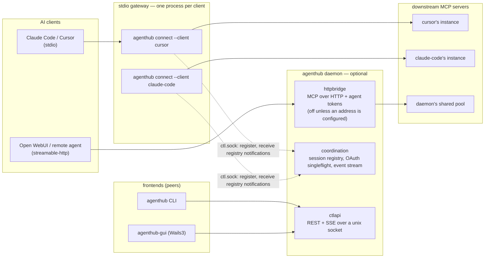
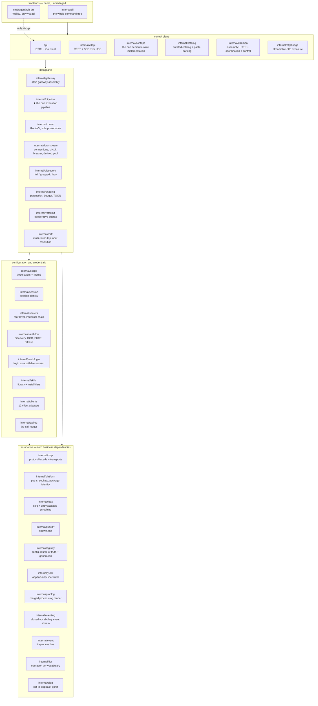
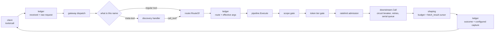
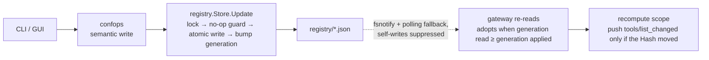
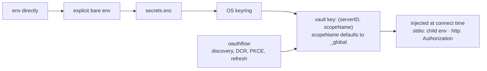
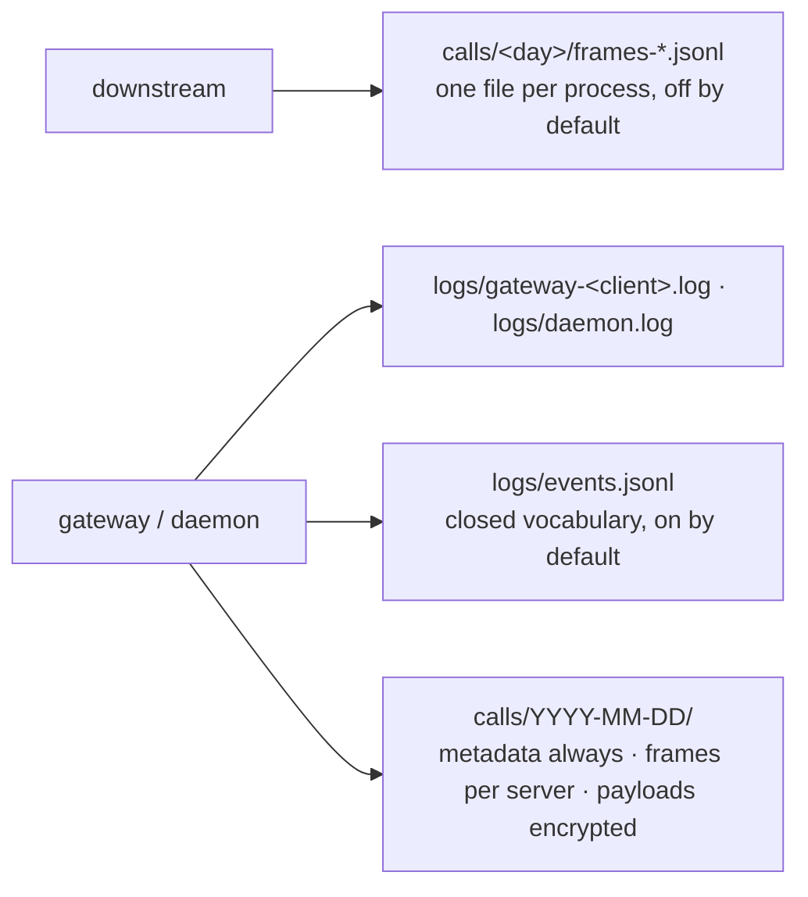

# Architecture

> **Answers** how the system is carved into processes and packages, and what a call passes through.
> **Not here** who may reach what → [model.md](model.md); how a flow behaves step by step → [flows.md](flows.md); what a package must not do → [subsystems/](subsystems/).
> **Kept true by** `internal/depguardtest` (the dependency directions) and `internal/pipeline`'s gate-count tests (the call path).

A client believes it is talking to one MCP server. It is talking to AgentHub's gateway, which holds
the configuration and the credentials for every downstream, decides what this client may see, and runs
every call through one pipeline. The client's own config file keeps a single `command` line.

## The processes



**One gateway process per stdio client.** `agenthub connect --client <id>` is not a forwarding shell:
it reads the registry, connects downstreams at this client's scope, injects credentials and runs the
pipeline itself. Four kinds of isolation come free — per-client credentials, per-client connection
parameters (`${ROOT}`, cwd), one client's slow call never blocking another, and a downstream crash
reaching one client only.

**The daemon is optional, and the gateway never starts one.** It holds the HTTP face, the control
plane and the coordination plane. Kill it and no client sees a different tool set, because scope comes
from the registry files. What is lost: `session ls` / `session kill`, the control-plane event stream,
the shared HTTP pool, and OAuth refresh falls back to file locks.

**A daemon belongs to someone, and there are two answers.** The desktop application owns one as a
supervised child and the daemon watches its owner (a lifeline pipe, with a pid poll as backstop that
reads "cannot tell" as alive). `--headless` is the other, for servers and CI, owned by nobody and
stopped by an operator. A start that names neither is refused with `E_DAEMON_UNOWNED`. The cost of the
first form: an HTTP-connected agent loses its endpoint when the application quits.

**The HTTP face does not exist by default.** It is enabled from one of two sources and never half of
each: `--http-addr` on the command line, or the stored `http.*` keys. No address from either means no
listener — there is no default port. A non-loopback address additionally needs `http.allowRemote` from
that same source, or the daemon fails to start rather than quietly binding loopback; the bind must
then pass `AuthorizeBind`, which refuses when there is no admin token, no active agent token and no
registered client.

**The HTTP face reuses the same gateway.** The daemon maps an authenticated credential to a
`gateway.Conn` — the `connect` gateway body over an in-memory pipe — so it meets the same discovery
surface, router and `pipeline.Execute`. The credential enters governance through exactly two doors:
`Caller.Tier` reaches the tier gate, `Caller.Servers` / `Caller.Profile` become one more layer in
`scope.Sources.Extra`, merged by the same `Merge` that can only narrow.

**Server status is reported by gateways, never probed.** Each gateway pushes a snapshot that lives and
dies with its session; the daemon folds N views into one — connection state takes the worst, tool
count the max, detail names who saw it. Nobody holding a server means `unknown`, which is a statement
about observers rather than a health certificate. Probing instead would cost a resident child process
per stdio server, and doubled OAuth and quota consumption for remote ones.

## The packages



Everything under `internal/` is on that map except the test-only `internal/depguardtest` and
`internal/testutil`. Six packages are chokepoints, where a second implementation would be a second
answer to a question that must have one:

| Package | Holds |
|---|---|
| `internal/mcp` | The only protocol implementation |
| `internal/registry` | The config source of truth — the files, not a daemon's memory |
| `internal/confops` | One semantic-write rule set; CLI and control plane are two frontends over it |
| `internal/scope` | Every "who can see what" decision, through one pure `Merge` |
| `internal/router` | `RouteOf`, the only legal way to recover `(server, tool)` from an exposed name |
| `internal/pipeline` | ★ Every call path, so the gates cannot fork |

## Dependency directions

Four directions are CI failures rather than review conventions:

1. `api` and `cmd/agenthub-gui` import nothing under `internal/*` — "the GUI is optional" is a
   compile-time property.
2. `internal/mcp` is stdlib-only, and no other `internal/*` package may import a third-party MCP
   library.
3. `internal/pipeline` must not import `internal/ctlapi` — the data plane does not depend on the
   control plane.
4. `internal/mcp`, `internal/platform`, `internal/logx` and `internal/guard/*` carry zero business
   dependencies.

The normative wording is [canonical.md §2](canonical.md#hard-dependency-direction-constraints-enforced-at-compile-time-by-depguard).
What lives here is how they are held: `internal/depguardtest` plants a violating probe in each
constrained package — inside a disposable copy of the checkout — and asserts golangci-lint reports it.
Every rule must have a failing case that cannot pass by skipping itself. That is also why
`internal/tier` is a standalone leaf: inside `pipeline` it turned rule 3's failing case into an import
cycle rather than a lint error, which left the rule unprovable.

## What a call passes through



**The gate order is frozen: scope, then token tier.** Both decide from configuration alone, both fail
closed, and neither reads the arguments or the result. Rate limiting is a quota wrapper around them,
not a third gate.

| Gate | Refuses | Error |
|---|---|---|
| scope | a server or tool this session was never shown | `E_SCOPE_DENIED` |
| token tier | a read-only credential initiating a write or destructive operation | `E_TOKEN_TIER_DENIED` |

The two rejections stay individually distinguishable, so a client can tell "you cannot see this" from
"you may not do this".

**There is one execution path.** A direct call and lazy mode's `call_tool` both reach
`pipeline.Execute`, and tests assert they advance every gate's counter identically. A new execution
path must carry the same assertions.

**The ledger is observability, not a gate.** It records the raw parameters before parsing, the routed
identity before the gates, and gives every exit a `finished` event. A failed write costs the record
and never the call. Something that can withhold a call is a gate, whatever it is called.

**Result shaping bounds what a downstream answers, not everything it can make this process forward.**
A tool error is a result (`isError: true`) and is budgeted like a success. A transport or protocol
error is not: the stage returns on a non-nil `callErr` before the budget applies, so a downstream that
answers `tools/call` with a huge JSON-RPC error travels unbounded. Shaping rewrites a result's
content, and there is no result to rewrite.

## Where the data lives

Three flows, one property in common: **the source of truth is on disk, and memory is a projection.**



Config events are notifications and carry no snapshot. The reader re-reads the file and adopts on
"generation read ≥ generation applied", never on equality with the event's `Rev`
([canonical.md §5c](canonical.md#5c-the-config-hot-reload-path-two-things-not-to-get-wrong)).



The vault key is the composite `(serverID, scopeName)` and has been since the first release — one of
the three things [canonical.md §4](canonical.md#4-known-capability-boundaries) says must never be
retrofitted.



Ordinary logs never carry call arguments. The call ledger does, encrypted, with result capture
`none | errors | truncated | full` (default `truncated`) and `--payloads` required for every
decrypting CLI operation. **Both streams fail open**: an event that cannot be written is dropped and
counted, a ledger record that cannot be written is logged at Error and leaves a hole. Neither may cost
a client its call.

## On disk

```
<data>/
├── registry/                 # the config source of truth, split by change frequency,
│   ├── meta.json  servers.json  profiles.json  clients.json  governance.json
│   └── *.lock  backups/      #   sharing one monotonic generation; sibling locks + 5 rolling backups
├── state/                    # ratelimits.json, run markers
├── skills/                   # content-addressed skill library + install index
├── cache/tools/<server>.json # tool catalogue snapshots, so a cold start can answer from cache
├── logs/                     # events.jsonl, gateway-<client>.log, daemon.log — rotated, 3 segments
├── calls/YYYY-MM-DD/         # calls.jsonl (metadata) + frames-*.jsonl (per process) + payload packs
├── tokens.json  .token_key   # agent tokens, HMAC only
└── run/                      # ctl.sock + daemon.json (endpoint, pid, version, owner pid),
                              #   written only after a successful bind
```

`<data>` splits by build channel into two unrelated directories:

| Channel | macOS | Linux |
|---|---|---|
| release | `~/Library/Application Support/AgentHub` | `${XDG_DATA_HOME:-~/.local/share}/AgentHub` |
| dev (default) | `~/Library/Application Support/AgentHubDev` | `${XDG_DATA_HOME:-~/.local/share}/AgentHubDev` |

They are siblings, not parent and child: a dev process cannot reach the installed copy's registry by
walking up, and `rm -rf` on one leaves the other. The binary's entry point picks the channel;
`internal/platform` only resolves a path for a given environment. `AGENTHUB_DATA_DIR` overrides both,
which is what lets CI, the e2e suite and two sandboxes coexist. On Linux, `run/` prefers
`$XDG_RUNTIME_DIR/AgentHub` when `AGENTHUB_DATA_DIR` is unset — and only then.

## Two frontends, two write routes

The files being the source of truth is what lets both frontends write without disagreeing.

| Frontend | Route | Concurrency |
|---|---|---|
| CLI | writes the files directly, through `confops` under the registry's cross-process lock | holds no long-lived view, so it sends no precondition |
| GUI | `api` → `ctlapi` → the same `confops` | its window may hold a minutes-old read, so this route carries the optimistic-concurrency precondition |

One rule set, one lock, two entry points. A running daemon is not bypassed by the CLI's route: its
watcher picks the write up and announces it.

The CLI reaches the daemon only for runtime objects — `session ls/show/kill`, and the live status
section of `server inspect`. Those refuse with exit 4 rather than inventing an offline answer, because
a session is never persisted. Configuration and every observability stream, `events` included, work
with no daemon in the picture.

## Platforms

| Platform | State |
|---|---|
| macOS | Supported, covered by CI |
| Linux | Supported, covered by CI |
| Windows | Complete but unverified: it cross-compiles and is unit-tested through injected seams, and nothing has ever run on a real Windows machine. [windows.md](windows.md) tracks what that leaves open |

The GUI is not in the default build. Linking a webview needs GTK/WebKit packages the Linux CI runner
lacks, so every Wails file sits behind `//go:build wails` and builds with `make gui`. Its untagged half
runs inside `make test` on both matrix legs; the tagged shell and the frontend need a separate `gui`
job on a macOS runner, because on Linux `-tags wails` dies in the cgo preamble before `go vet` runs.
That job stays out of `make ci` deliberately: "the GUI is optional" must not become a prerequisite of
the default build.
