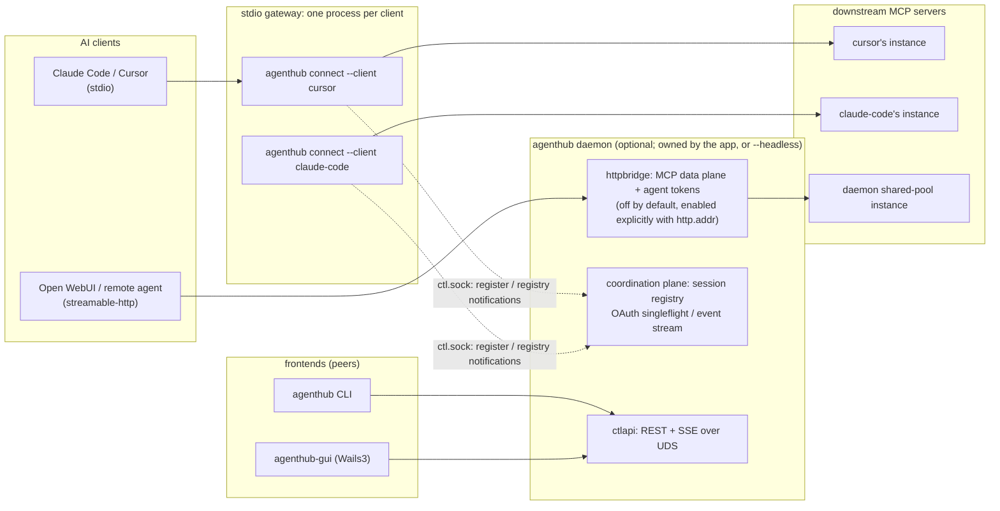
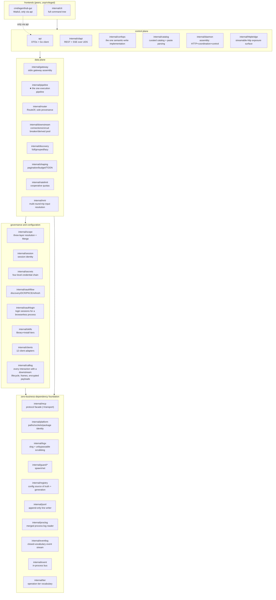
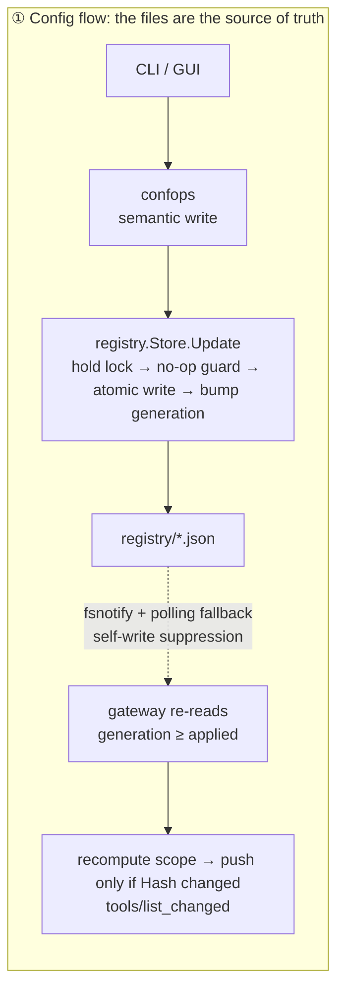
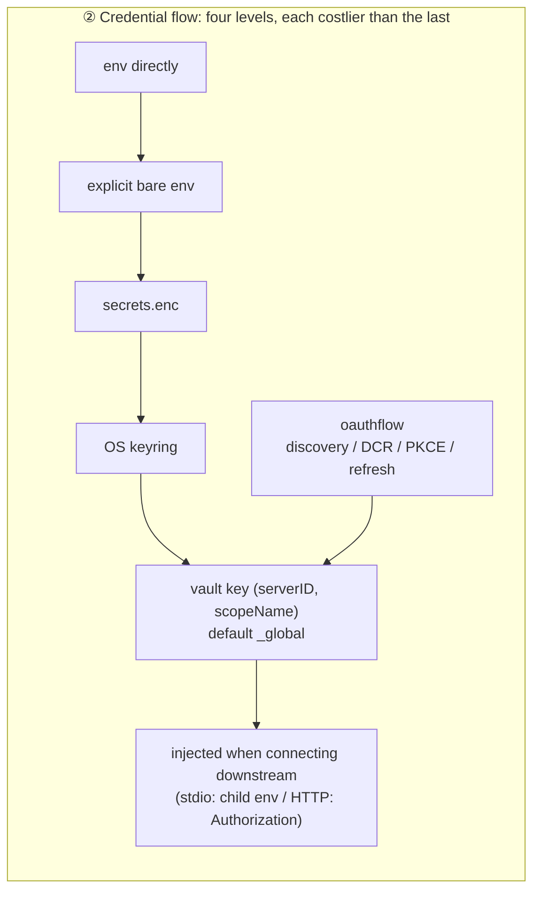
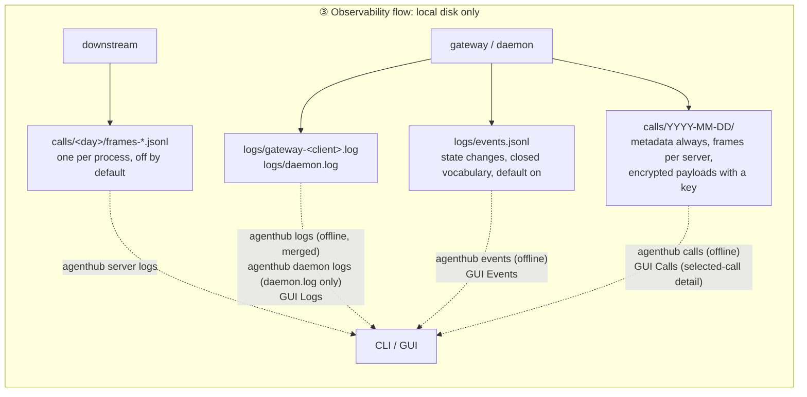
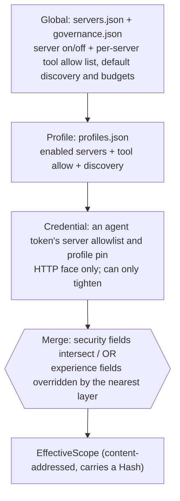
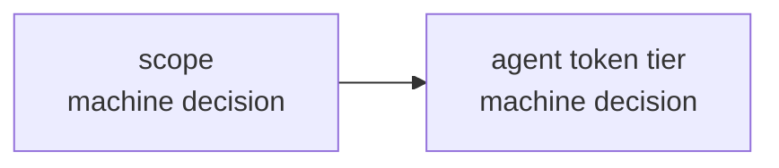

# Architecture overview

AgentHub is a local hub for agent services: one configuration, one set of credentials, one governance
pipeline, shared by every AI client (Claude Code, Cursor, Codex, Open WebUI, and so on). This document
explains **how the system is carved up, how the processes are laid out, and where the data flows**.
Per-package detail lives in [modules/](modules/), the timing of key flows in [flows.md](flows.md), and
the conventions you don't get to change casually in [canonical.md](canonical.md).

---

## 1. The one-sentence model

The client thinks it's connected to a single MCP server; it's actually connected to AgentHub's
gateway. The gateway decides which tools it can see based on the current session's **effective
scope**, every call passes through **the same execution pipeline** (gates → downstream → shaping),
and the result goes back. Configuration and credentials converge at this layer, leaving the client
side with a single line of `command`.

---

## 2. Process model: the dual-mode gateway



**stdio access = one independent gateway process per client.** `agenthub connect --client <id>` is not
a forwarding shell; it reads the registry, connects downstreams at this client's scope, injects
credentials and runs the pipeline, all itself. That buys four kinds of isolation for free: per-client
credentials, per-client connection parameters (`${ROOT}`/cwd), one client's slow call never blocking
another, and a downstream crash reaching only one client.

**The daemon is an optional value-add, and the gateway never auto-starts it** — the stdio data plane's
zero dependency on it is the point, and auto-starting would make "optional" de facto mandatory. It
holds the HTTP access surface, the control plane, and the coordination plane (session registry, OAuth
singleflight). A stdio gateway's scope comes from the registry files, so killing the daemon changes
nothing about what a client sees; what is lost is `session ls` / `session kill`, the control-plane
event stream, and the shared HTTP pool, with OAuth refresh falling back to file locks.

**A daemon belongs to whoever started it, and there are exactly two answers.** The desktop application
owns one as a supervised child, and the daemon watches its owner rather than trusting it to say
goodbye (a lifeline pipe, with a pid poll as backstop that reads "cannot tell" as alive). The other is
`--headless`, for servers, CI and the e2e suite: owned by nobody, stopped by an operator. **A start
that names neither is refused** (`E_DAEMON_UNOWNED`) — a hub nothing is responsible for is one the next
launch finds, cannot claim, and must not kill. The cost is that the value-add keeps the application's
hours: an HTTP-connected agent loses its endpoint when the application quits.

Several processes therefore write one data directory, and that discipline is a correctness dependency
rather than belt-and-braces — `O_APPEND` line writes, cross-process locks around the rate-limit
counters and the access ledger's storage limits, atomic rename for every registry write. `modules/`
carries it per package.

**The HTTP data plane doesn't exist by default.** `internal/httpbridge` is enabled from one of two
sources and never half of each: the command line when a start types `--http-addr`, otherwise the
stored `http.*` keys (`agenthub config set http.addr <host:port>`). The stored form exists because the
desktop application types no flags, so an argv-only opt-in could not be given at all. **No address
from either means no listener** — not "there's a default port". A non-loopback address additionally
requires `http.allowRemote` / `--http-allow-remote` from that same source or the daemon **fails to
start** rather than falling back to loopback, and the bind must then pass `AuthorizeBind`: no admin
token, no active agent token and no registered clients is refused.

**The HTTP surface reuses the same gateway; it's not a second assembly.** The daemon maps an
authenticated credential to a `gateway.Conn` — the `connect` gateway body on an in-memory pipe — so it
passes the same discovery surface, router and `pipeline.Execute` call site. The credential enters
governance through exactly two existing entry points: `Caller.Tier` → the tier gate, and
`Caller.Servers` / `Caller.Profile` → an extra layer in `scope.Sources.Extra`, merged by the same
`Merge` as the persisted layers so it can only narrow.

**Server status is reported by the gateways, not probed by the daemon.** Opening a connection just to
light up an indicator would cost a resident child process per stdio server and doubled OAuth and quota
consumption for remote ones. So each gateway pushes a full snapshot that lives and dies with its
session, and the daemon folds N views into one: connection state takes the worst, tool count the max,
detail says **who** saw it. Nobody holding a server means `unknown / "not observed"` — a statement
about observers, not a certificate of health.

---

## 3. Core module map

Which package holds the thing you want to change. Per-package detail is in [modules/](modules/).



The map is exhaustive: everything under `internal/` is above except the test-only
`internal/depguardtest` (§4's proofs) and `internal/testutil`. Six are chokepoints, where a second
implementation would be a second answer to a question that must have one:

| Package | The chokepoint |
|---|---|
| `internal/mcp` | The only place allowed to touch protocol implementation |
| `internal/registry` | The config source of truth is these files, not the daemon's memory |
| `internal/confops` | One semantic-write rule set; CLI and control plane are two frontends over it |
| `internal/scope` | Every "who can see what" decision, through one pure `Merge` |
| `internal/router` | `RouteOf` is the only legal way to recover `(server, tool)` from an exposed name |
| `internal/pipeline` | ★ Every call path converges here, so the gates cannot fork |

---

## 4. Layering and dependency direction

Four dependency directions are **CI failure conditions**, not review conventions: `api` and
`cmd/agenthub-gui` import no `internal/*`; `internal/mcp` is stdlib-only and the only package touching
protocol implementation; `internal/pipeline` must not import `internal/ctlapi`; and `internal/mcp`,
`internal/platform`, `internal/logx`, `internal/guard/*` carry zero business dependencies. The
normative wording — and the numbering that code comments cite as "§2 rule 3" — is
[canonical.md §2](canonical.md#hard-dependency-direction-constraints-enforced-at-compile-time-by-depguard).

What belongs here is how they are *held*: `internal/depguardtest` plants violating probes in the
constrained packages — inside a disposable copy of the checkout — and asserts golangci-lint reports
each one. A rule configured but not in effect is more dangerous than no rule, so the implicit fifth
constraint is that **every rule must have a failing case that cannot pass by skipping itself**. That
is also why `internal/tier` is a standalone leaf: inside `pipeline` it turned rule 3's failing case
into an import cycle rather than a lint error, leaving the rule unprovable.

---

## 5. What a tool call passes through

```mermaid
flowchart LR
    A["client<br/>tools/call"] --> AU1["audit<br/>received + full request"]
    AU1 --> B["gateway<br/>dispatch"]
    B --> C{"what is the name"}
    C -->|"meta-tool"| D["discovery handler"]
    C -->|"regular tool"| E["router.RouteOf<br/>sole provenance"]
    D -->|"call_tool*"| E
    E --> AU2["audit<br/>route + effective args"] --> F["pipeline.Execute"]
    F --> G1["scope gate"] --> G2["token tier gate"]
    G2 --> H["ratelimit admission<br/>(a quota wrapper, not a third gate)"]
    H --> I["downstream.Call<br/>circuit breaker / retries / serial queue"]
    I --> J["shaping<br/>budget + fetch_result cursor"]
    J --> AU3["audit<br/>outcome + configured result capture"] --> A
```



**The gate chain order is frozen** (`scope → token tier`, `internal/pipeline`), pinned by tests. Both
gates decide from configuration alone and both fail closed, and nothing in the chain inspects or
rewrites a call's arguments: what the caller sent is what the downstream receives, and what the
downstream answered is what the caller reads.

**There is only one execution path.** A direct call and lazy mode's `call_tool` reach the same
`pipeline.Execute`, and tests assert both advance every gate's counter identically. Any **new**
execution path must carry the same assertions; "there are already tests" is not an exemption.

**Success and error branches are shaped alike**: `defend_and_shape` runs once over the outcome
whichever branch it came back on, so a large JSON-RPC error is budgeted like a large result. It kept
its name after the defenses in it were removed, because the stdio/HTTP gate-count parity assertions
compare these stage keys — renaming one would leave those tests passing while comparing nothing.

**The audit wrapper is strict observability, not a gate.** It persists the raw `tools/call` parameters
before parsing and the routed identity before the gate chain, and gives every exit a `finished` event.
A failed write, key lookup or storage-pressure check costs the record and never the call: the wrapper
reports the failure and `pipeline.Execute` runs anyway. It never changes scope, tier, arguments or
results, and it cannot withhold one — an observer that can take the tools away is a gate, whatever it
is called.

---

## 6. Three data flows

Beyond the call chain, three flows determine the system's behavior. What they have in common: **the
source of truth is always on disk; memory is only a projection.**







Each flow has one property you must not forget:

- **Config flow**: events are notifications and carry no snapshot, so the reader re-reads the file and
  adopts on "generation read ≥ generation applied" — never on equality with the event's `Rev`
  ([canonical.md §5c](canonical.md#5c-the-config-hot-reload-path-two-things-not-to-get-wrong) has both
  rulings, `modules/foundation.md` the mechanism).
- **Credential flow**: the vault key is the composite `(serverID, scopeName)` and has been since day
  one — one of the three things canonical.md §4 says must never be retrofitted.
- **Observability flow**: ordinary logs never contain call arguments; the separately enabled access
  ledger does, encrypted, with result capture `none | errors | truncated | full` (default
  `truncated`) and `--payloads` required for every decrypting CLI operation. Both streams fail OPEN:
  an event that cannot be written is dropped and counted, a ledger record that cannot be written is
  logged at Error and leaves a hole in the history. Neither may cost a client its call — the ledger
  records what happened, it never decides whether anything may happen.

---

## 7. Scope: visibility and connection are two separate planes

The three-layer resolution chain (most specific wins):



**`clients.json` is not a layer.** It answers one question — *which* profile this client is on, or
nothing, meaning "follow the globally active profile". A client layer and a project layer keyed by the
client's reported MCP root were both retired: they made "which profile is this client on" an
*incomplete* answer to "what can this client see", leaving an operator to intersect three places by
hand. Narrowing now has one home; a client needing a different surface gets a different profile.

That retirement fails in the **open** direction, which is why it is written here: both layers existed
to narrow, so a configuration still carrying them now shows that client *more* than before, and the
registry preserves unknown JSON verbatim — a legacy `projects` block survives looking as authoritative
as it did while it worked. `agenthub doctor` therefore **warns** on `scope:projects` and never deletes
it: doctor reports, the operator decides.

The merge rules follow from the nature of each field: **security fields** (server visibility, tool
allow) intersect layer by layer, and there is no deny list anywhere, because a deny would answer a
newly-added downstream tool in the opposite direction from an allow. **Experience fields** (discovery
mode, result budget) are won by the most specific layer. Two invariants: intersections are keyed by the
**original tool name**, or a rename or disambiguation suffix would slip past a narrowing; and a
dangling profile reference resolves to the **empty set** rather than allow-all, with a doctor warning.

**The visibility plane and the connection plane are separate.** The gateway connects at this client's
static high-water mark (global ∩ profile); what a session sees is a query-time projection. Narrowing a
session's scope therefore rebuilds no router and restarts no process, which is what makes per-session
granularity feasible. Overlays are never persisted — a runtime loosening that comes back from the dead
is a security incident — which is also why `session scope` cannot write its edits into configuration.
Nothing persisted reads the session root any more either, so the resolver's cache key is `(clientID,
registry generation)`; the root reaches only `internal/downstream`, which derives per-root instances.

---

## 8. Three discovery modes

How the tool catalog is exposed to the agent is decided by `EffectiveScope.Discovery`:

| Mode | What's exposed | Suits |
|---|---|---|
| `full` | Every tool in scope | Few tools, or a client that filters for itself |
| `grouped` | One aggregate tool per server + a generic call entry point | Many tools, but you still want to skip searching |
| `lazy` | The five meta-tools: `status` / `search_tools` / `describe_tool` / `call_tool` / `fetch_result` | Very many tools; trades token budget for coverage. **`discovery.DefaultMode`** — what a scope that sets no mode gets |

In lazy mode a governance switch can split `call_tool` into `call_tool_read` / `call_tool_write` /
`call_tool_destructive`, so an IDE's tool allowlist can permit them separately. The tier comes from
downstream annotations and **no annotations at all means destructive** (fail-closed). **The switch is
not read yet**: the stdio gateway never sets `discovery.Options.IntentVariants` from the registry's
`intentVariants`, so setting it in governance changes nothing today. Noted here rather than only in
[modules/dataplane.md](modules/dataplane.md)'s unwired appendix because this is where someone decides
to turn it on.

Search results carry a **compact signature** rather than a full schema; the agent calls `describe_tool`
for detail. Every tool id that can't be shown — nonexistent, out of scope, or outside its server's
allow list — returns the same copy, or `describe_tool` becomes an enumeration oracle.

---

## 9. How the two lines of defense stack



| Line | Granularity | Decided by | Blocks |
|---|---|---|---|
| scope | server / tool visibility | Machine (layer intersection, from configuration) | Capabilities that should not be visible |
| agent token tier + intent variants | Operation tier | Machine (token × annotations) | A read-only credential initiating a write/destructive operation |

Both decide before the call, from what an operator wrote down, and their rejections stay individually
distinguishable (`E_SCOPE_DENIED`, `E_TOKEN_TIER_DENIED`). Neither reads the arguments or the result:
an earlier design put an argument pre-validator, a human approval queue, a prompt-injection scanner and
a leak redactor between these lines and the downstream, and all four were removed. What survives
refuses a call outright or lets it through untouched.

## 10. On-disk layout

```
<data>/
├── registry/                 # config source of truth: split into documents by change frequency, sharing one monotonic generation
│   ├── meta.json  servers.json  profiles.json  clients.json  governance.json
│   └── *.lock  backups/      # sibling cross-process locks + 5 rolling backups
├── state/                    # ratelimits.json / run markers
├── skills/                   # content-addressed skill library + install index
├── cache/tools/<server>.json # tool catalog snapshots used for "answer from cache first"
├── logs/                     # events.jsonl + gateway-<client>.log + daemon.log (all rotated, 3 segments kept)
├── calls/YYYY-MM-DD/         # the call ledger: calls.jsonl (shared metadata) + frames-*.jsonl (per process) + payload packs
├── tokens.json  .token_key   # agent tokens (HMAC only)
└── run/                      # on Linux, prefers $XDG_RUNTIME_DIR/AgentHub when AGENTHUB_DATA_DIR is unset
    ├── ctl.sock  daemon.json # control socket + readiness handshake (endpoint, pid, version, owner pid;
    │                         # written only after a successful bind)
```

`<data>` splits into two mutually unrelated directories by **build channel**:

| Channel | macOS | Linux |
|---|---|---|
| release | `~/Library/Application Support/AgentHub` | `${XDG_DATA_HOME:-~/.local/share}/AgentHub` |
| dev (default) | `~/Library/Application Support/AgentHubDev` | `${XDG_DATA_HOME:-~/.local/share}/AgentHubDev` |

The two are **siblings, not parent and child**: a dev process can't reach the installed copy's registry
by walking up one level, and `rm -rf` on one won't take the other with it. The `channel` at the
binary's entry point decides, defaulting to dev — `internal/platform` makes no such choice, it only
resolves a path given an environment. `AGENTHUB_DATA_DIR` overrides both, which is what lets CI, e2e
and two sandboxes coexist ([canonical.md §1](canonical.md#1-frozen-identifiers-abi-unchangeable-as-of-v1)
has the failure direction).

The files being the source of truth is what lets the two frontends write by different routes without
disagreeing. The **CLI writes the files directly** — `internal/confops` under the registry's
cross-process lock, daemon or no daemon; holding no long-lived view, it sends no precondition. The
**GUI writes through the daemon** (`api` → `ctlapi` → the same `internal/confops`), and because its
window may hold a minutes-old read, that route carries the optimistic-concurrency precondition. One
rule set, one lock, two entry points; a running daemon is not bypassed either, since its watcher picks
the CLI's write up and announces it. Propagation is the generation counter plus event pushes.

The CLI reaches the daemon **only for runtime objects**: `session ls/show/kill` and the live status
section of `server inspect`. Those refuse with exit 4 rather than inventing an offline answer, because
a session is never persisted. Everything else — configuration and every observability stream, `events`
included — works with no daemon anywhere in the picture.

---

## 11. Platform status

| Platform | Status |
|---|---|
| macOS | Fully supported, covered by CI |
| Linux | Fully supported, covered by CI |
| Windows | **Experimental**: the platform layer is filled in — file locks (`LockFileEx`), named-pipe listener (SDDL-gated), api dialing, GUI channel wiring, and portable zip packaging — but `daemon stop` and `client connect`'s user-level paths are unimplemented above it, and **nothing has ever run on a real Windows machine**. See [windows.md](windows.md) |

The GUI (`cmd/agenthub-gui`) is **not** part of the default build: linking a webview needs GTK/WebKit
dev packages the Linux CI runner lacks, so all Wails code sits behind `//go:build wails` and builds
separately with `make gui`. Its untagged half is inside `make test` on both matrix legs; the tagged
shell and the frontend need a **separate `gui` job on a macOS runner**, because on Linux `-tags wails`
dies in the cgo preamble before `go vet` can run. That job stays out of `make ci` on purpose — "the GUI
is optional" is a compile-time property and must not become a prerequisite of the default build.

---

## 12. Assembly status: implemented but not yet wired up

A package can be code-complete with its own tests and still have nothing calling it, and "thought it
was in effect but it wasn't" is far more dangerous than "known to be missing". **The inventory is not
here**: it is the appendix at the end of [modules/dataplane.md](modules/dataplane.md), beside the code
it describes, and confirmed gaps pinned to a line live in the owning [modules/](modules/) doc. The
summary table this section used to hold is gone rather than emptied, because a summary kept away from
its subject is the copy that rots unnoticed. Everything left unwired is presentational: **every
governance entry that table once carried was removed rather than wired**, which is the right direction
— an unwired governance seam reads to a hurried operator as protection that is already there.

Distinct from all of that are the **deliberate** boundaries, which are not to-dos: the GUI isn't in the
default build, skills materialization only reaches client granularity, TOON has no decoder, teams is
unimplemented ([canonical.md](canonical.md) §4, "Known capability boundaries"). Windows is neither — its
platform layer is implemented, has never run on real hardware, and two things above it do not work at
all; [windows.md](windows.md) tracks which is which.

---

## 13. Further reading

[flows.md](flows.md) for the seven flows as sequence diagrams and their failure branches;
[modules/](modules/) for a package's own invariants before you change it; [canonical.md](canonical.md)
for whether a name, dependency or convention may move at all; [windows.md](windows.md) for that
platform's status. [docs/README.md](README.md) is the index and says which layer answers what.
