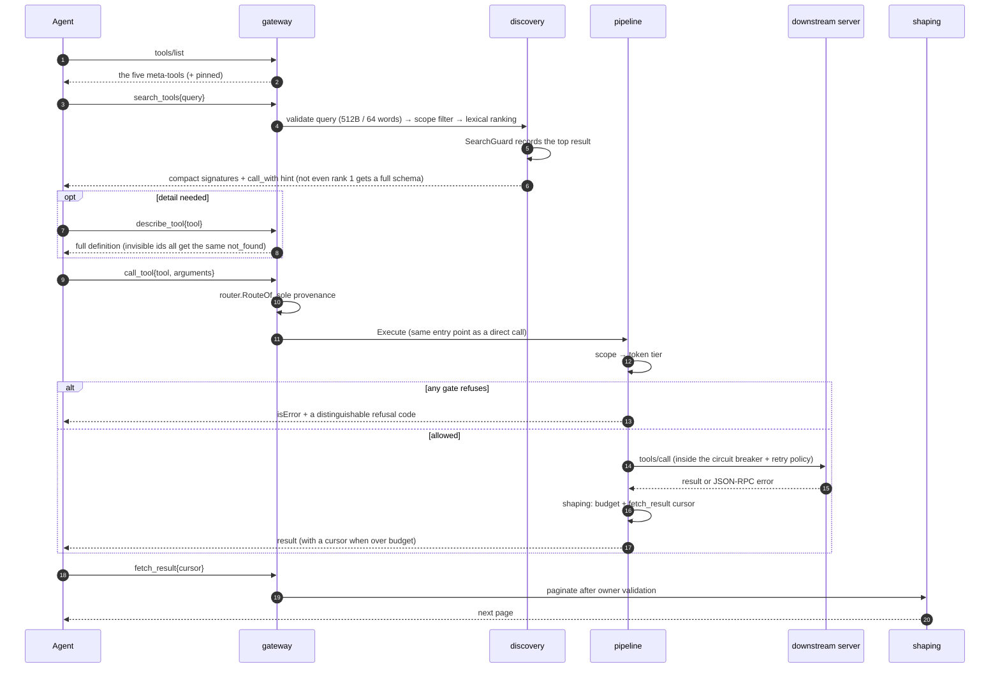
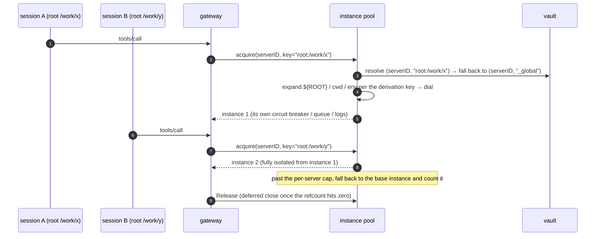
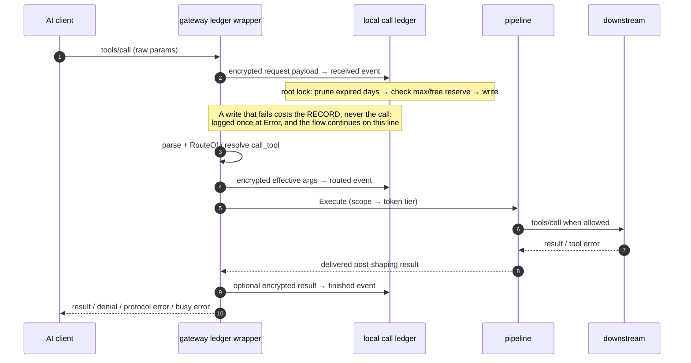

# Key flows

Seven runtime flows, one sequence diagram each. The prose after a diagram covers only the **failure
branches** and **why it is shaped this way** — the happy path is legible from the diagram. For the
static decomposition see [architecture.md](architecture.md); for the three data flows,
[architecture.md §6](architecture.md#6-three-data-flows).

| # | Flow | In one line |
|---|---|---|
| 1 | [Gateway startup](#1-gateway-startup-answer-with-whatever-you-have) | Cache answers first, downstreams arrive later, `list_changed` catches up |
| 2 | [A complete call in lazy mode](#2-a-complete-call-in-lazy-mode) | search → describe → call → paginate |
| 3 | [Config writes](#3-config-writes-five-writers-and-an-optimistic-lock) | Semantic writes have one implementation; conflicts return 409 |
| 4 | [Config hot reload](#4-config-hot-reload-two-things-to-get-right) | Events are only notifications; the generation criterion is `≥` |
| 5 | [Headless OAuth and refresh](#5-headless-oauth-and-refresh) | Three callback modes; write state before token |
| 6 | [Derived downstream instances](#6-derived-downstream-instances) | Touches only the connection plane, never visibility |
| 7 | [Call ledger lifecycle](#7-call-ledger-lifecycle) | Record before execution, finish every outcome, stay inside hard storage bounds — a lost record never costs the call |

---

## 1. Gateway startup: answer with whatever you have

```mermaid
sequenceDiagram
    autonumber
    participant C as AI client
    participant G as gateway<br/>(agenthub connect)
    participant R as registry
    participant D as daemon (optional)
    participant DS as downstream MCP servers

    C->>G: spawn(stdio) + initialize
    G->>G: setsid to leave the client's process group
    G->>R: load config (failure is not fatal)
    G->>G: read cache/tools/*.json
    G-->>C: initialize result (answered immediately)
    par concurrently in the background
        G--)DS: connect downstreams (credential injection / spawn guard / SSRF screening)
        G--)D: best-effort dial ctl.sock
    end
    DS-->>G: first batch of real tools ready
    G->>G: router.Build → recompute EffectiveScope
    G--)C: notifications/tools/list_changed
    alt daemon present
        G->>D: POST /v1/gateway/register
        D-->>G: SessionID
        Note over G,D: long-lived connection: registry change notifications
    else daemon absent
        G->>G: run standalone (scope comes from the registry files); reconnect with backoff
    end
```

**`setsid` to leave the client's process group**, or `SIGTTIN`/`SIGTTOU` from downstream child
processes will interfere with a TUI client's raw mode.

**A config load failure is not fatal.** The gateway falls back to the last persisted tool cache to
serve the handshake and `tools/list`: a hub temporarily running on an old catalog beats one that won't
connect. The same cache covers slow startup, with `tools/list_changed` pushed once the real tools land.

**A `tools/call` before the downstream is connected returns a retryable busy error
(`mcp.CodeBusy`), not
"tool not found."** Falsely claiming it doesn't exist makes the agent give up and route around it when
all it needed was to wait a second.

---

## 2. A complete call in lazy mode



**`RouteOf` is the only legal way to trace an exposed name back to `(server, tool)`; splitting on `__`
is forbidden.** It misjudges whenever a server id or tool name itself contains `__`, and disambiguation
suffixes (`_2`) make string-based recovery hopeless anyway.

**SearchGuard handles an agent going in circles.** Three consecutive searches returning the same top
result truncate the response into one imperative hint ("you already found X, just call it"); any
non-search action resets the counter, and low-confidence hits don't escalate.

**Cursor sequence numbers are guessable, so owner validation is the only isolation.** A miss, an
unauthorized access, an expired cursor and a malformed one therefore all return **byte-for-byte
identical** copy — a differentiated error would leak "this cursor exists but isn't yours."

---

## 3. Config writes: five writers and an optimistic lock

The registry has five writers: N gateways, the daemon, the CLI, the GUI, and eventually third parties.
That's what determines the shape of the write path.

```mermaid
sequenceDiagram
    autonumber
    participant GUI as GUI (long-lived window)
    participant CLI as CLI
    participant CTL as ctlapi
    participant OPS as confops<br/>(the one semantic-write implementation)
    participant R as registry.Store

    Note over GUI,CLI: two frontends, one implementation of the rules
    GUI->>CTL: PATCH /v1/servers/{id}<br/>(carrying the generation it read)
    CTL->>OPS: UpdateServer(..., Precondition{Generation})
    CLI->>OPS: its own operations, in-process (Precondition{} = no check)
    OPS->>OPS: validate arguments (stop right here if invalid; nothing was opened)
    OPS->>R: Update: take the cross-process lock → re-read the document
    R->>R: compare Precondition.Generation while holding the lock
    alt generation mismatch
        R-->>OPS: writes nothing
        OPS-->>CTL: *StaleError (carrying the current generation)
        CTL-->>GUI: 409 Conflict
        GUI->>GUI: refetch and warn "changed elsewhere"; no overwrite
    else match, or Precondition{}
        R->>R: no-op guard → atomic write → bump generation
        R-->>OPS: Result{Generation, Changed, Warnings}
        Note over R: propagation continues as in §4
    end
```

**Semantic writes have exactly one implementation.** `internal/confops` offers **operations**, not
field setters: `RenameProfile` repoints every client binding that references it, because leaving those
dangling would fail-close those clients into an empty scope. A parity test asserts both frontends
produce **byte-for-byte identical** registry documents.

**What the two frontends share is the package, not always the function.** The diagram's
`UpdateServer` — a whole entry at once — is reached only by the control plane, and the per-field
`SetServerEnabled` / `SetServerTools` / `SetServerTrace` only by the CLI, because `agenthub server`
has no whole-entry edit and the HTTP face has no per-field route. The guarantee is that neither
frontend implements the semantics itself; it is not that a given edit takes the same call from both
sides. Stated the stronger way — this diagram said "the same function", naming a `SetServer` that
does not exist — it sends a reader looking for a shared entry point that was never there, and the
three real `SetServer*` functions are close enough in name to be mistaken for it.

`RemoveServer` is that rule at its widest: the whole footprint — credentials, profile membership and
selectors, governance rules naming the server, the cached catalog — with logs the deliberate exception,
since a log that forgot deleted servers would be worthless as evidence. The reason is **not** that
dangling references are dangerous (they resolve to the empty set, fail-closed) but that every one of
those stores is keyed by **server id**, so re-adding the id inherits them: a stale reference is inert, a
stale refresh token is a live entitlement. Rewriting references is legitimate only because all of them
are **narrowing-only** — `Profile.Servers` is a three-state allow list, so an emptied one stays `[]` and
is never collapsed to `nil`, which would flip "none" into "all". A field with exclusion semantics must
never be rewritten here. Failure direction: the registry transaction commits first, then each cleanup
runs independently and reports failure as a **warning** naming what survived, because a locked keychain
must never make a server unremovable.

**Optimistic locking, not last-writer-wins.** The file lock prevents torn writes but not lost ones: two
people editing one profile means the later write wins and the earlier change disappears silently, and
the GUI is a long-lived window whose data may be minutes stale. So every operation carries a
`Precondition`, compared **after taking the lock and before modifying**; a mismatch returns a
`*StaleError` carrying the current generation, which the control plane maps to **409**. `Precondition{}`
(generation 0) means "don't check", which is what the CLI uses.

**Validation rejects rather than normalizes.** An unknown transport, runtime or boolean leaves the
registry untouched instead of landing on a default the operator never asked for.

---

## 4. Config hot reload: two things to get right

```mermaid
sequenceDiagram
    autonumber
    participant U as CLI / GUI
    participant R as registry files
    participant W as watcher (fsnotify + polling fallback)
    participant G as gateway
    participant DS as downstream

    U->>R: Update(): hold lock → no-op guard → atomic write → bump generation
    Note over R: register the payload fingerprint in a bounded TTL set before writing
    R--)W: fsnotify event (200ms debounce)
    W->>W: hit in the self-write set? if so, ignore
    W-->>G: Change{Kind, Rev}
    G->>R: re-read the files (the event is only a notification, it carries no snapshot)
    G->>G: is the generation read ≥ the one applied? otherwise discard
    alt Kind ∈ {servers}
        G->>G: spec diff: reconnect only the servers that changed
        G->>DS: add/remove connections (untouched ones stay connected)
    else Kind ∈ {profiles, governance, clients}
        G->>G: invalidate only the scope cache; don't touch downstreams
    end
    G->>G: did EffectiveScope.Hash change?
    opt it changed
        G--)U: notifications/tools/list_changed
    end
```

**Self-write suppression**: a process that writes config gets its own fsnotify event back and would
otherwise reload for its own write. The payload fingerprint goes into a bounded, 10-second-expiry,
multi-slot set before writing, and a failed write retracts it immediately. The failure direction is
what matters: a missed suppression costs one pointless reload, and can never mask an external change.

**The generation criterion is `≥`, not `==`**: the push is only a notification and carries no snapshot,
so the gateway still re-reads the files itself. Under several rapid successive writes the generation it
reads will **exceed** the event's Rev, and an equality test leaves it stuck on an old version, waiting
for an event that will never come again.

**Only server changes touch downstream connections**, and only those whose spec differs. A purely
visibility-affecting change invalidates the scope cache and nothing else — the precondition for
per-session dynamic scope without restarting processes.

---

## 5. Headless OAuth and refresh

```mermaid
sequenceDiagram
    autonumber
    participant U as User
    participant C as agenthub auth login
    participant AS as authorization server
    participant V as vault (secrets)

    C->>AS: discovery chain (RFC8414 candidate order / resource metadata from a 401)
    C->>AS: DCR (token_endpoint_auth_method: none)
    C->>C: generate PKCE verifier + state (an entropy failure is an error, never a downgrade)
    alt loopback (a browser is available locally)
        C->>C: bind 127.0.0.1:0 for a random port → start the server before opening the browser
        U->>AS: log in and consent
        AS-->>C: 302 callback (verify state before accepting the code; stray requests ignored)
    else --manual (remote / headless)
        C-->>U: print the authorization URL
        U->>AS: complete authorization on any device
        U->>C: paste the full callback URL or the bare code
        C->>C: validate state locally
    else --device (RFC 8628)
        C->>AS: obtain device_code + user_code
        C-->>U: display the verification URL and user code
        loop at the given interval (honoring slow_down)
            C->>AS: poll for the token
        end
    end
    C->>AS: token exchange (PKCE + resource; credentials POSTed, zero redirects)
    C->>V: write __oauth_state__ first (including the rotated refresh_token)
    C->>V: then write __http_auth__ (the access token)
```

**Every authorization binds a fresh random port**, or a leftover listener from a previous incomplete
authorization intercepts this callback and shows up as an inexplicable state mismatch. And **start the
server before opening the browser** — binding without accepting leaves the browser stuck in the
connection queue.

**Write-order invariant: state before access token.** Reversed, a failure on the second write leaves the
unrecoverable state of "new access token + already-invalidated old refresh token"; in the correct order,
the worst case is "new refresh + old access," which heals itself on the next 401.

**Refresh concurrency**: with the daemon online everything goes through its singleflight, so there is
exactly one vault writer; offline it is the `<server>.refresh.lock` file lock, and the state must be
re-read *after* acquiring it — if `expires_at` already moved, abandon this refresh rather than spend a
one-shot refresh token twice.

---

## 6. Derived downstream instances



Derivation happens only on the **connection plane**: exposed names don't change, `RouteOf` is still the
sole provenance, and only the instance a call lands on differs — so visibility is untouched and
`tools/list` never flickers. Acquiring happens inside the call closure, after both gates, because a
call the scope gate is about to deny must not spawn a child or open an authenticated remote connection.

Credentials resolve by `(serverID, derivation key)` and fall back to global, which is why the vault key
was promoted to a composite one back in M1. The per-server cap prevents process explosion, and
exceeding it is not an error but a fallback to the base instance plus a counted warning: a bit less
isolation beats a denial of service.

---

## 7. Call ledger lifecycle



The wrapper records an attempt before it knows whether the parameters are valid, so protocol errors and
unknown names are evidence too. Both direct names and lazy `call_tool` keep two payloads — the exact
incoming wrapper and the effective downstream arguments — and both are complete up to the MCP frame
bound whatever the result capture setting (`none`, `errors`, `truncated`, `full`) is.

**Storage failure costs the record, never the call** (canonical.md §7 #11) — the same direction the
event stream takes. A missing key, an invalid policy, a full ledger, a crossed free-space reserve or a
failed write leaves a hole in the history, and the hole is reported: `ledger record dropped; the call
is unaffected`, at Error, once per record. It is not silent, and it is not a refusal — by the time a
write fails, the record it would have made is already lost, so refusing the call adds a second failure
without preventing the first. **The bounds themselves stay hard**: nothing is written past `maxBytes`
or into the free-space reserve. The capacity decision and the write hold one cross-process lock, so
four stdio gateways cannot each believe they own the same remaining bytes. Retention removes only complete validated UTC day directories, and `minFreeBytes`
protects the filesystem even if another process still holds a just-expired file open.

Metadata is HMAC-authenticated and payloads use XChaCha20-Poly1305 with call/kind binding, which
detects edits, corruption and reference substitution — but cannot prove a whole partition was not
deleted; that needs an immutable anchor outside this directory.

The GUI's **Calls** page consumes metadata only, and selecting one call is the explicit disclosure
boundary: the daemon resolves that call's key ids, decrypts bounded previews, and marks the response
`no-store`. The frontend shows them immediately — no decrypt button — and drops the payload-bearing
drawer from the DOM on close.
