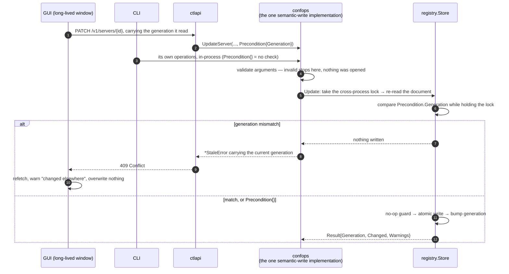
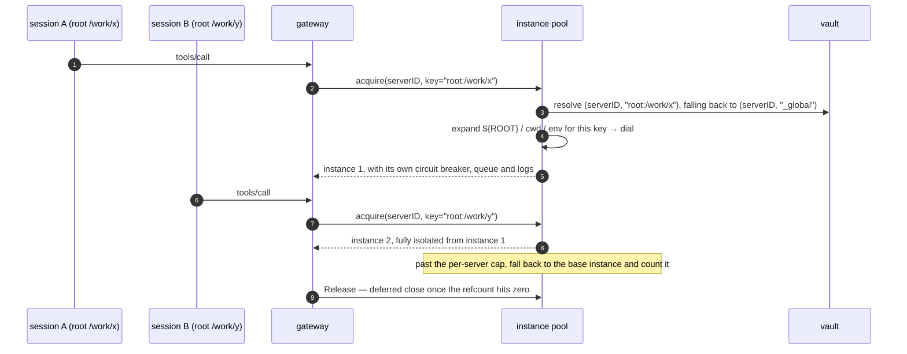
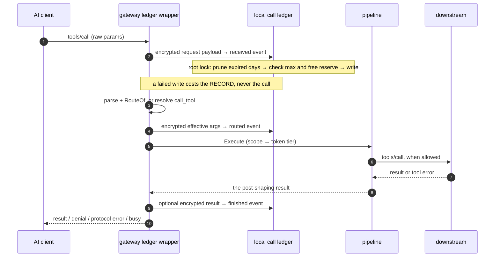

# Flows

> **Answers** how seven runtime flows behave, and which way each one falls when it breaks.
> **Not here** the static decomposition → [architecture.md](architecture.md); a package's own invariants → [subsystems/](subsystems/).
> **Kept true by** the e2e suite: each flow below has at least one test that drives it end to end.

The diagram is the happy path. The prose after it is only the failure branches and the choices that
are easy to get wrong.

| Flow | In one line |
|---|---|
| [Gateway startup](#gateway-startup) | Answer from cache, connect in the background, catch up with `list_changed` |
| [A call in lazy mode](#a-call-in-lazy-mode) | search → describe → call → paginate |
| [Config writes](#config-writes) | One implementation of the rules; a conflict is a 409, never a silent overwrite |
| [Config hot reload](#config-hot-reload) | The event is a notification; the generation test is `≥` |
| [OAuth login and refresh](#oauth-login-and-refresh) | Three callback modes; write state before token |
| [Derived downstream instances](#derived-downstream-instances) | Connection plane only; visibility never moves |
| [The call ledger](#the-call-ledger) | Record before executing; a lost record never costs the call |

## Gateway startup

```mermaid
sequenceDiagram
    autonumber
    participant C as AI client
    participant G as gateway<br/>(agenthub connect)
    participant R as registry
    participant D as daemon (optional)
    participant DS as downstream servers

    C->>G: spawn(stdio) + initialize
    G->>G: setsid, leaving the client's process group
    G->>R: load config (a failure here is not fatal)
    G->>G: read cache/tools/*.json
    G-->>C: initialize result, answered immediately
    par in the background
        G--)DS: connect (credential injection, spawn guard, SSRF screening)
        G--)D: best-effort dial of ctl.sock
    end
    DS-->>G: first real tools arrive
    G->>G: router.Build → recompute EffectiveScope
    G--)C: notifications/tools/list_changed
    alt daemon present
        G->>D: POST /v1/gateway/register
        D-->>G: SessionID
        Note over G,D: long-lived connection: registry change notifications
    else daemon absent
        G->>G: stand alone; scope comes from the registry files, reconnect with backoff
    end
```

**`setsid` first.** Without it, `SIGTTIN`/`SIGTTOU` from downstream child processes interfere with a
TUI client's raw mode.

**A config load failure is not fatal.** The gateway serves the handshake and `tools/list` from the last
persisted tool cache. A hub running briefly on an old catalogue beats one that will not connect. The
same cache covers a slow start, and `tools/list_changed` follows when the real tools land.

**A call that arrives before its downstream is connected gets `mcp.CodeBusy`, not "tool not found".**
Claiming it does not exist makes the agent give up and route around a tool that needed one more second.

## A call in lazy mode

```mermaid
sequenceDiagram
    autonumber
    participant A as Agent
    participant G as gateway
    participant DI as discovery
    participant P as pipeline
    participant DS as downstream server
    participant SH as shaping

    A->>G: tools/list
    G-->>A: the five meta-tools (plus pinned)
    A->>G: search_tools{query}
    G->>DI: validate (512B / 64 words) → scope filter → lexical ranking
    DI->>DI: SearchGuard records the top result
    DI-->>A: compact signatures + call_with hint
    opt detail needed
        A->>G: describe_tool{tool}
        G-->>A: full definition; every invisible id gets the same not_found
    end
    A->>G: call_tool{tool, arguments}
    G->>G: router.RouteOf
    G->>P: Execute — the same entry point a direct call uses
    P->>P: scope → token tier
    alt a gate refuses
        P-->>A: isError + a distinguishable refusal code
    else allowed
        P->>DS: tools/call, inside the circuit breaker and retry policy
        DS-->>P: result or JSON-RPC error
        P->>P: shaping: budget + fetch_result cursor
        P-->>A: result, with a cursor when it was over budget
    end
    A->>G: fetch_result{cursor}
    G->>SH: paginate, after owner validation
    SH-->>A: next page
```

**`RouteOf` is the only legal way back from an exposed name to `(server, tool)`.** Splitting on `__`
misjudges any server id or tool name that contains `__`, and disambiguation suffixes (`_2`) put
string-based recovery out of reach anyway.

**SearchGuard catches an agent going in circles.** Three consecutive searches with the same top result
collapse the response to one imperative hint. Any non-search action resets the counter, and
low-confidence hits do not escalate.

**Cursor sequence numbers are guessable, so owner validation is the whole isolation.** A miss, an
unauthorised access, an expired cursor and a malformed one return byte-for-byte identical copy. A
differentiated error would leak "this cursor exists, but not for you".

## Config writes

Five writers share the registry: N gateways, the daemon, the CLI, the GUI, and eventually a third
party. That is what shapes the write path.



**Semantic writes have one implementation.** `confops` offers operations, not field setters:
`RenameProfile` repoints every client binding that referenced it, because a dangling binding
fail-closes those clients into an empty scope. A parity test asserts both frontends produce
byte-for-byte identical registry documents.

**What the frontends share is the package, not always the function.** `UpdateServer` — a whole entry
at once — is reached only by the control plane; the per-field `SetServerEnabled` / `SetServerTools` /
`SetServerTrace` only by the CLI, because `agenthub server` has no whole-entry edit and the HTTP face
has no per-field route. The guarantee is that neither frontend implements the semantics itself.

**`RemoveServer` removes the whole footprint**: credentials, profile membership and selectors,
governance rules naming the server, the cached catalogue. Logs are the deliberate exception — a log
that forgot deleted servers would be worthless as evidence. The reason is not that dangling references
are dangerous (they fail closed to the empty set) but that every one of those stores is keyed by
**server id**, so re-adding the id inherits them: a stale reference is inert, a stale refresh token is
a live entitlement.

Rewriting references is safe only because all of them are narrowing-only. `Profile.Servers` is a
three-state allow list, so an emptied one stays `[]` and is never collapsed to `nil`. A field with
exclusion semantics must never be rewritten here. The registry transaction commits first and each
cleanup then runs independently, reporting failure as a warning naming what survived: a locked keychain
must not make a server unremovable.

**Optimistic locking, not last-writer-wins.** The file lock prevents torn writes, not lost ones — two
people editing one profile means the later write wins silently, and the GUI's data may be minutes old.
Every operation carries a `Precondition`, compared after taking the lock and before modifying.
`Precondition{}` means "do not check", which is what the CLI uses.

**Validation rejects rather than normalises.** An unknown transport, runtime or boolean leaves the
registry untouched instead of landing on a default nobody asked for.

## Config hot reload

```mermaid
sequenceDiagram
    autonumber
    participant U as CLI / GUI
    participant R as registry files
    participant W as watcher (fsnotify + polling fallback)
    participant G as gateway
    participant DS as downstream

    U->>R: Update(): lock → no-op guard → atomic write → bump generation
    Note over R: the payload fingerprint enters a bounded TTL set before the write
    R--)W: fsnotify event (200ms debounce)
    W->>W: in the self-write set? then ignore it
    W-->>G: Change{Kind, Rev}
    G->>R: re-read the files — the event carries no snapshot
    G->>G: generation read ≥ generation applied? otherwise discard
    alt Kind = servers
        G->>G: spec diff: reconnect only what changed
        G->>DS: add and remove connections; untouched ones stay up
    else Kind ∈ {profiles, governance, clients}
        G->>G: invalidate the scope cache only
    end
    G->>G: did EffectiveScope.Hash change?
    opt it changed
        G--)U: notifications/tools/list_changed
    end
```

**Self-write suppression.** A process that writes config receives its own fsnotify event. The payload
fingerprint goes into a bounded, 10-second, multi-slot set before the write, and a failed write
retracts it at once. Failure direction: a missed suppression costs one pointless reload and can never
mask somebody else's change.

**The generation test is `≥`, not `==`.** Under several rapid writes the generation the gateway reads
exceeds the event's `Rev`; an equality test leaves it stuck on an old version, waiting for an event
that will not come again.

**Only server changes touch connections**, and only those whose spec differs. A purely visibility-
affecting change invalidates the scope cache and nothing else, which is what makes per-session scope
possible without restarting anything.

## OAuth login and refresh

```mermaid
sequenceDiagram
    autonumber
    participant U as User
    participant C as agenthub auth login
    participant AS as authorization server
    participant V as vault (secrets)

    C->>AS: discovery chain (RFC 8414 candidate order, or resource metadata from a 401)
    C->>AS: DCR (token_endpoint_auth_method: none)
    C->>C: PKCE verifier + state — an entropy failure is an error, never a downgrade
    alt loopback (a browser is available here)
        C->>C: bind 127.0.0.1:0, and start the server before opening the browser
        U->>AS: log in and consent
        AS-->>C: 302 callback; state is verified before the code is accepted
    else --manual (remote or headless)
        C-->>U: print the authorization URL
        U->>AS: authorize on any device
        U->>C: paste the callback URL or the bare code
        C->>C: validate state locally
    else --device (RFC 8628)
        C->>AS: obtain device_code + user_code
        C-->>U: show the verification URL and user code
        loop at the given interval, honouring slow_down
            C->>AS: poll for the token
        end
    end
    C->>AS: token exchange (PKCE + resource; credentials POSTed, no redirects)
    C->>V: write __oauth_state__ first, including the rotated refresh_token
    C->>V: then write __http_auth__, the access token
```

**A fresh random port per authorization.** A leftover listener from an abandoned attempt would
intercept this callback and surface as an inexplicable state mismatch. Start the server before opening
the browser, or the browser waits in the connection queue.

**Write order: state before access token.** Reversed, a failure on the second write leaves "new access
token + already-invalidated old refresh token", which nothing can recover. In the correct order the
worst case is "new refresh + old access", which heals on the next 401.

**Refresh concurrency.** With the daemon online, refresh goes through its singleflight and there is one
vault writer. Offline it is the `<server>.refresh.lock` file lock, and the state must be re-read after
acquiring it: if `expires_at` already moved, abandon this refresh rather than spend a one-shot refresh
token twice.

**A refusal ends the loop and is written down.** `400 invalid_grant` (or `invalid_client`) is the
authorization server saying this grant will never work again. It is recorded in `__oauth_state__`
inside the same lock, and every renewer then answers from the vault without a request; only
`auth login` clears it. Only that exact response shape counts, because the direction is asymmetric — a
transient failure misread as terminal parks a working server until a human appears, while the reverse
merely retries. [status/oauth.md](status/oauth.md) has the provider shapes.

## Derived downstream instances



Derivation happens on the connection plane only. Exposed names do not change, `RouteOf` is still the
sole provenance, and only the instance a call lands on differs — so `tools/list` never flickers.

**Acquiring happens inside the call closure, after both gates.** A call the scope gate is about to deny
must not spawn a child process or open an authenticated remote connection.

Credentials resolve by `(serverID, derivation key)` and fall back to global, which is why the vault key
is composite. Exceeding the per-server cap is not an error: it falls back to the base instance and
counts a warning, because slightly less isolation beats a denial of service.

## The call ledger



The wrapper records an attempt before it knows whether the parameters are valid, so protocol errors and
unknown names are evidence too. Direct names and lazy `call_tool` both keep two payloads — the incoming
wrapper and the effective downstream arguments — complete up to the MCP frame bound, whatever the
result capture setting is.

**Storage failure costs the record, never the call** ([decisions/](decisions)
#11). A missing key, an invalid policy, a full ledger, a crossed free-space reserve or a failed write
leaves a hole, and the hole is announced: `ledger record dropped; the call is unaffected`, at Error,
once per record. By the time a write fails the record is already lost, so refusing the call would add
a second failure without preventing the first.

**The bounds stay hard.** Nothing is written past `maxBytes` or into the free-space reserve. The
capacity decision and the write hold one cross-process lock, so four stdio gateways cannot each believe
they own the same remaining bytes. Retention removes only complete, validated UTC day directories.

Metadata is HMAC-authenticated and payloads use XChaCha20-Poly1305 bound to the call and kind, which
detects edits, corruption and reference substitution. It cannot prove a whole partition was not
deleted; that needs an anchor outside this directory.

The GUI's **Calls** page consumes metadata only. Selecting one call is the explicit disclosure
boundary: the daemon resolves that call's key ids, decrypts bounded previews and marks the response
`no-store`. The frontend shows them immediately — there is no decrypt button — and drops the
payload-bearing drawer from the DOM on close.
