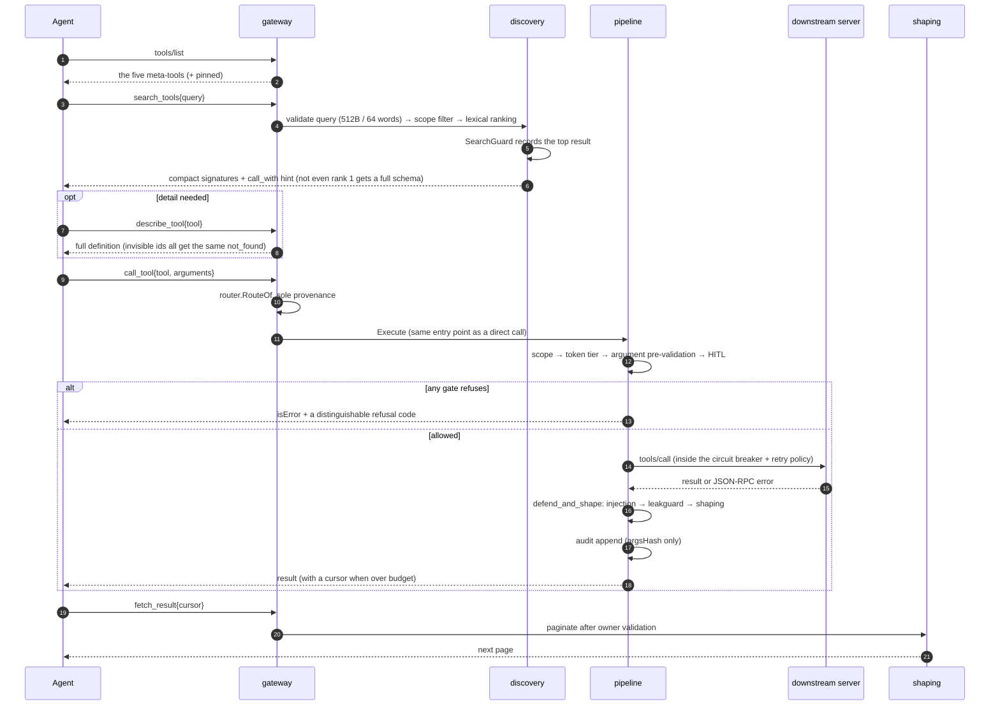
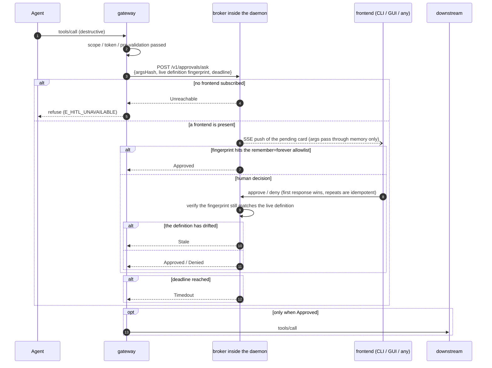
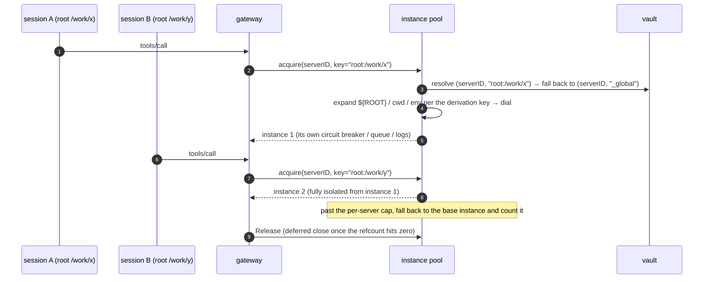

# Key flows

This document uses sequence diagrams to explain the seven runtime flows most worth understanding. The
prose after each diagram covers the **failure branches** and **why it's designed this way** — the happy
path is legible from the diagram; the hard part is always what happens when things go wrong. For the
system's static decomposition see [architecture.md](architecture.md); for an overview of the three data
flows see [architecture.md §6](architecture.md#6-three-data-flows).

| # | Flow | In one line |
|---|---|---|
| 1 | [Gateway startup](#1-gateway-startup-answer-with-whatever-you-have) | Cache answers first, downstreams arrive later, `list_changed` catches up |
| 2 | [A complete call in lazy mode](#2-a-complete-call-in-lazy-mode) | search → describe → call → paginate |
| 3 | [HITL approval](#3-hitl-approval-three-fail-closed-points) | Nothing but `Approved` lets the call through |
| 4 | [Config writes](#4-config-writes-five-writers-and-an-optimistic-lock) | Semantic writes have one implementation; conflicts return 409 |
| 5 | [Config hot reload](#5-config-hot-reload-two-things-to-get-right) | Events are only notifications; the generation criterion is `≥` |
| 6 | [Headless OAuth and refresh](#6-headless-oauth-and-refresh) | Three callback modes; write state before token |
| 7 | [Derived downstream instances](#7-derived-downstream-instances) | Touches only the connection plane, never visibility |

---

## 1. Gateway startup: answer with whatever you have

```mermaid
sequenceDiagram
    autonumber
    participant C as AI client
    participant G as gateway<br/>(agenthub connect)
    participant R as registry
    participant D as daemon (optional)
    participant DS as downstream MCP servers

    C->>G: spawn(stdio) + initialize
    G->>G: setsid to leave the client's process group
    G->>R: load config (failure is not fatal)
    G->>G: read cache/tools/*.json
    G-->>C: initialize result (answered immediately)
    par concurrently in the background
        G--)DS: connect downstreams (credential injection / spawn guard / SSRF screening)
        G--)D: best-effort dial ctl.sock
    end
    DS-->>G: first batch of real tools ready
    G->>G: router.Build → recompute EffectiveScope
    G--)C: notifications/tools/list_changed
    alt daemon present
        G->>D: POST /v1/gateway/register
        D-->>G: SessionID + current overlay
        Note over G,D: long-lived connection: overlay pushes / registry events / approval Asks
    else daemon absent
        G->>G: run standalone; HITL fails closed; reconnect with backoff
    end
```

Three trade-offs that shape the startup experience:

**`setsid` to leave the client's process group**, or `SIGTTIN`/`SIGTTOU` from downstream child processes
will interfere with a TUI client's raw mode.

**A config load failure is not fatal.** The gateway falls back to the last persisted tool cache to serve
the handshake and `tools/list` — users would much rather have a hub that's "temporarily running on an
old catalog" than one that won't connect. The cache is also the answer to slow startup: `tools/list` can
be answered while downstreams are still connecting, and `tools/list_changed` is pushed once the real
tools are ready.

**A `tools/call` before the downstream is connected returns a retryable busy error (`-32000`), not "tool
not found."** Falsely claiming it doesn't exist makes the agent give up and route around it, when all it
needed was to wait a second.

---

## 2. A complete call in lazy mode



**`RouteOf` is the only legal way to trace an exposed name back to the real `(server, tool)`; splitting
on `__` is forbidden in the codebase.** Splitting misjudges whenever a server id or tool name itself
contains `__`, and disambiguation suffixes (`_2`) make string-based recovery hopeless anyway.

**SearchGuard handles an agent going in circles.** Three consecutive searches returning the same top
result truncate the response into a single imperative hint ("you already found X, just call it"); any
non-search action resets the counter; low-confidence hits don't escalate.

**Cursor sequence numbers are guessable, so owner validation is the only isolation.** That's why a
miss, an unauthorized access, an expired cursor, and a malformed one all return **byte-for-byte
identical** copy — a differentiated error would leak "this cursor exists but isn't yours."

---

## 3. HITL approval: three fail-closed points



**Nothing but `Approved` lets the call through**: denied, timed out, broker unreachable, stale — four
results with different meanings and identical consequences. After the daemon is `kill -9`'d, the moment
the gateway's approval-bearing connection drops it cancels in-flight requests and returns Unreachable
immediately — a call that's "waiting for a human to decide" must never hang forever because there's
nobody left to wait for.

**What's approved is what runs.** The request carries a canonical JSON hash of the arguments, binding
approval and execution to the same arguments; it also carries a fingerprint of the live tool definition,
so once a downstream quietly changes a tool's semantics, an earlier approval goes `Stale` rather than
being reused. The raw arguments only ever flow through memory and the SSE channel; they are never
persisted to disk.

---

## 4. Config writes: five writers and an optimistic lock

The registry has five writers: N gateways, the daemon, the CLI, the GUI, and eventually third parties.
That's what determines the shape of the write path.

```mermaid
sequenceDiagram
    autonumber
    participant GUI as GUI (long-lived window)
    participant CLI as CLI
    participant CTL as ctlapi
    participant OPS as confops<br/>(the one semantic-write implementation)
    participant R as registry.Store

    Note over GUI,CLI: two frontends, one rule set
    GUI->>CTL: PATCH /v1/servers/{id}<br/>(carrying the generation it read)
    CTL->>OPS: SetServer(..., Precondition{Generation})
    CLI->>OPS: the same function (Precondition{} = no check)
    OPS->>OPS: validate arguments (stop right here if invalid; nothing was opened)
    OPS->>R: Update: take the cross-process lock → re-read the document
    R->>R: compare Precondition.Generation while holding the lock
    alt generation mismatch
        R-->>OPS: writes nothing
        OPS-->>CTL: *StaleError (carrying the current generation)
        CTL-->>GUI: 409 Conflict
        GUI->>GUI: refetch and warn "changed elsewhere"; no overwrite
    else match, or Precondition{}
        R->>R: no-op guard → atomic write → bump generation
        R-->>OPS: Result{Generation, Changed, Warnings}
        Note over R: propagation continues as in §5
    end
```

**Semantic writes have exactly one implementation.** `internal/confops` offers **operations**, not field
setters: `RenameProfile` also repoints every client binding that references it, because leaving those
references dangling would fail-close those clients into an empty scope — that consequence belongs to the
operation itself, not to the caller. If the control plane wrote its own version of "how to edit a
profile," the CLI and GUI would each have their own validation and side effects, and sooner or later the
two would produce different results for the same operation. There's precedent for this class of
incident: the comment on `SpecFromEntry` claimed it was the sole translation point while the gateway
hand-rolled its own Spec, and container isolation was silently dropped as a result. A parity test asserts
that both paths produce **byte-for-byte identical** registry documents for the same operation.

**Optimistic locking, not last-writer-wins.** The file lock guarantees no torn writes, but **not no
overwrites**: two people editing the same profile at once means the later write wins and the earlier
person's change disappears silently. The GUI is a long-lived window whose page data may be minutes
stale, which would make this happen often. So every operation carries a `Precondition`, compared **after
taking the lock and before modifying**; a mismatch returns a `*StaleError` carrying the current
generation, which the control plane maps to **409**. `Precondition{}` (generation 0) means "don't
check," which is what the CLI's non-interactive path uses, so CLI behavior is unchanged.

**Validation rejects rather than normalizes.** An unknown transport, an unknown runtime, an unparseable
boolean — each leaves the registry untouched instead of landing on a default the operator never asked
for.

---

## 5. Config hot reload: two things to get right

```mermaid
sequenceDiagram
    autonumber
    participant U as CLI / GUI
    participant R as registry files
    participant W as watcher (fsnotify + polling fallback)
    participant G as gateway
    participant DS as downstream

    U->>R: Update(): hold lock → no-op guard → atomic write → bump generation
    Note over R: register the payload fingerprint in a bounded TTL set before writing
    R--)W: fsnotify event (200ms debounce)
    W->>W: hit in the self-write set? if so, ignore
    W-->>G: Change{Kind, Rev}
    G->>R: re-read the files (the event is only a notification, it carries no snapshot)
    G->>G: is the generation read ≥ the one applied? otherwise discard
    alt Kind ∈ {servers}
        G->>G: spec diff: reconnect only the servers that changed
        G->>DS: add/remove connections (untouched ones stay connected)
    else Kind ∈ {profiles, governance, clients}
        G->>G: invalidate only the scope cache; don't touch downstreams
    end
    G->>G: did EffectiveScope.Hash change?
    opt it changed
        G--)U: notifications/tools/list_changed
    end
```

**Self-write suppression**: when the daemon or a gateway writes config itself, fsnotify reports the event
all the same, and without suppression it does a pointless reload cycle for its own write. Register the
payload fingerprint in a bounded, 10-second-expiry, multi-slot set before writing, and the watcher
ignores anything that hits it; a failed write retracts the registration immediately. A missed
suppression costs at most one pointless reload (safe in the fail-open direction), but it can never mask
an external change.

**The generation criterion is `≥`, not `==`**: the push is only a notification and carries no snapshot,
so the gateway still re-reads the files itself. Under several rapid successive writes the generation it
reads will **exceed** the event's Rev, and an equality test leaves it stuck on an old version, waiting
for an event that will never come again.

**Only server changes touch downstream connections**, and even then only the ones whose spec differs get
reconnected. Purely visibility-affecting changes such as narrowing a scope only invalidate the cache —
which is the precondition for per-session dynamic scope without restarting processes.

---

## 6. Headless OAuth and refresh

```mermaid
sequenceDiagram
    autonumber
    participant U as User
    participant C as agenthub auth login
    participant AS as authorization server
    participant V as vault (secrets)

    C->>AS: discovery chain (RFC8414 candidate order / resource metadata from a 401)
    C->>AS: DCR (token_endpoint_auth_method: none)
    C->>C: generate PKCE verifier + state (an entropy failure is an error, never a downgrade)
    alt loopback (a browser is available locally)
        C->>C: bind 127.0.0.1:0 for a random port → start the server before opening the browser
        U->>AS: log in and consent
        AS-->>C: 302 callback (verify state before accepting the code; stray requests ignored)
    else --manual (remote / headless)
        C-->>U: print the authorization URL
        U->>AS: complete authorization on any device
        U->>C: paste the full callback URL or the bare code
        C->>C: validate state locally
    else --device (RFC 8628)
        C->>AS: obtain device_code + user_code
        C-->>U: display the verification URL and user code
        loop at the given interval (honoring slow_down)
            C->>AS: poll for the token
        end
    end
    C->>AS: token exchange (PKCE + resource; credentials POSTed, zero redirects)
    C->>V: write __oauth_state__ first (including the rotated refresh_token)
    C->>V: then write __http_auth__ (the access token)
```

**Every authorization binds a fresh random port.** With a fixed port, a leftover listener from a
previous incomplete authorization intercepts this callback, which shows up as an inexplicable state
mismatch. And you must **start the server before opening the browser** — binding without accepting
leaves the browser stuck in the connection queue.

**Write-order invariant: state before access token.** Reversed, a failure on the second write leaves the
unrecoverable state of "new access token + already-invalidated old refresh token"; in the correct order,
the worst case is "new refresh + old access," which heals itself on the next 401.

**Refresh concurrency**: when the daemon is online, everything goes through its singleflight (there is
exactly one vault writer); only when offline do we take the `<server>.refresh.lock` file lock, and even
then the state must be re-read after acquiring it — if `expires_at` has already been advanced by another
process, abandon this refresh, so a one-shot refresh token isn't spent twice.

---

## 7. Derived downstream instances



Derivation happens only on the **connection plane**: exposed names don't change, `RouteOf` is still the
sole provenance, and the only thing that changes is which instance this call lands on. So it doesn't
affect visibility and never makes `tools/list` flicker.

Credentials are resolved by `(serverID, derivation key)` and fall back to global when not found — which
is exactly why the vault key was promoted to a composite key back in M1: retrofitting it would touch
every singleton in the token store, callback server, and refresh coordinator.

The cap exists to prevent process explosion: exceeding it isn't an error but a fallback to the base
instance plus a counted warning, because "a bit less isolation" is more acceptable than "denial of
service."
