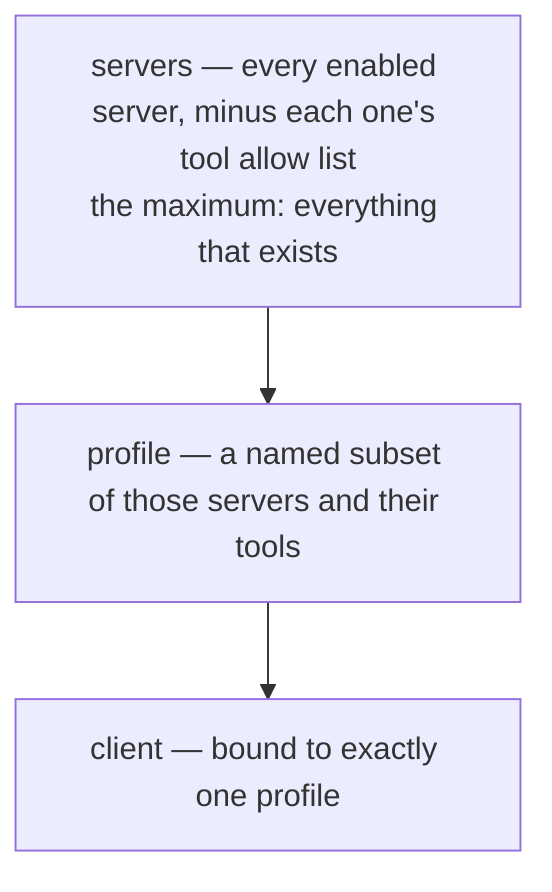
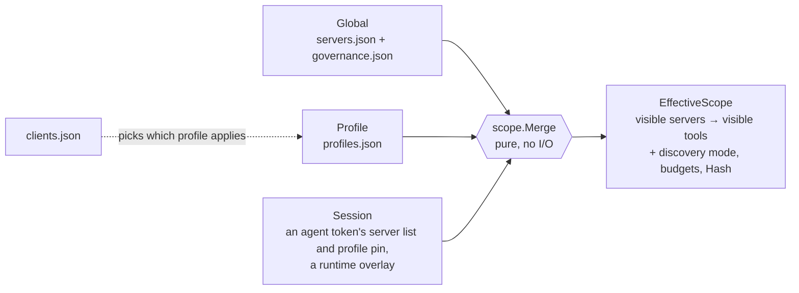
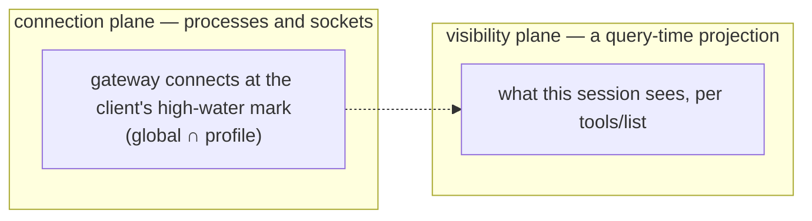

# The access model

> **Answers** what a client is allowed to reach, and who decided it.
> **Not here** the commands that write it → [guide.md](guide.md); how a call is executed → [architecture.md](architecture.md).
> **Kept true by** `internal/scope` (`Merge`, `merge_test.go`, `converge_test.go`) and `internal/discovery`.

What a client may reach is settled before it connects, by files an operator wrote. Nothing is decided
while a call is in flight, and nothing inspects what a call carries.

## Three nouns

| Noun | Is | Written in |
|---|---|---|
| **Server** | A downstream MCP server. Registered and switched on are two steps: `server add` writes it and leaves it off, `server enable` puts it into service. It offers all of its tools unless a subset is named. | `servers.json` |
| **Profile** | A subset: which servers, which of their tools, and how the surface is presented. | `profiles.json` |
| **Client** | An AI application. It *selects* a profile; it never adds rules of its own. | `clients.json` |

A client with no binding follows the globally active profile. With no active profile, it sees every
enabled server.

## Every layer intersects, and none can widen

That is the whole rule. Its consequences are what you actually rely on:

- `server disable` is an unconditional kill switch. No profile can grant back a disabled server, or a
  tool the server's own allow list holds back.
- "Which profile is this client on" is a complete answer to "what can it see". Two clients that need
  different surfaces get two profiles.
- Deleting a profile cannot widen anyone. A binding to a name that does not exist resolves to the
  **empty** scope, with a warning.

**A tool selector is an allow list, never a deny list.** The two differ on the day a downstream adds a
tool: an allow list keeps the new tool out until someone adds it, a deny list would let it in.

## Three states, and the empty one is closed

| Stored | Means |
|---|---|
| no selector for that server | every tool it has |
| `["a","b"]` | exactly those two |
| `[]` | none of them; the server stays listed |

`nil` and `[]` are different values everywhere a selector appears — in JSON, in Go, and in the merge.
Serialization uses `omitzero`, never `omitempty`: dropping an empty list turns block-all into
allow-all.

## How the layers become one answer

Two kinds of field, merged two ways:

| Field kind | Examples | Rule |
|---|---|---|
| **Security** | server visibility, tool selectors | Intersect, layer by layer. Monotonically tighter. |
| **Experience** | discovery mode, result budget | The most specific layer wins. A forced budget takes the minimum instead. |

Three invariants worth knowing before you touch it:

1. Intersections are keyed by the **original** tool name. Keying on the exposed name would let a
   rename or a disambiguation suffix slip past a narrowing.
2. A dangling profile reference resolves to the **empty set**, never to allow-all.
3. `clients.json` is not a layer. It answers *which* profile, and nothing else.

`EffectiveScope` is content-addressed: it carries a `Hash`, and a recomputation that produces the same
hash pushes no `tools/list_changed` to the client.

## Visibility and connection are two planes

Narrowing a session rebuilds no router and restarts no process — it changes a projection. That is what
makes per-session granularity cheap.

**Session overlays are never persisted.** A runtime loosening that survives a restart is a security
incident, so `session scope` cannot write its edits into configuration.

Nothing persisted reads the session's MCP root. The resolver's cache key is
`(clientID, registry generation)`, and the root reaches `internal/downstream` alone, which derives a
per-root instance of a server that asks for one.

## How the surface is presented

`discovery` decides how many tool names the client is shown, not which tools it may call. A tool
hidden from the initial list is still callable if it is in scope; a tool out of scope is not callable
in any mode.

| Mode | `tools/list` returns | Suits |
|---|---|---|
| `full` | every visible tool, one entry each | small surfaces, or a client that filters for itself |
| `grouped` | one aggregate entry per server, plus a call entry point | mid-sized sets |
| `lazy` | five meta-tools — `status`, `search_tools`, `describe_tool`, `call_tool`, `fetch_result` — plus any pinned tools | large surfaces. **The default when nothing sets a mode** |

`lazy` is the default because nobody revisits this setting when the fourth server is added, and `full`
spends context in proportion to how much the gateway is used.

Search results carry a compact signature, not a full schema; the agent calls `describe_tool` for
detail. Every tool id that cannot be shown — nonexistent, out of scope, or held back by an allow list
— returns the same copy, so `describe_tool` cannot be used to enumerate what exists.

Lazy mode can split `call_tool` into `call_tool_read` / `call_tool_write` / `call_tool_destructive`,
so an IDE's own allowlist can permit them separately. The tier comes from the downstream's
annotations, and no annotations at all means destructive. **The switch is not read yet**: the stdio
gateway never sets `discovery.Options.IntentVariants` from the registry, so `intentVariants` in
governance changes nothing today.

## What grades the HTTP face is not permission

Three mechanisms sit outside the scope model and answer different questions:

| Mechanism | Question | Where |
|---|---|---|
| Agent token tier | May this credential initiate a write or a destructive operation? | `internal/pipeline` gate 2 |
| Rate limits | Is one runaway loop burning the budget? | `internal/ratelimit` |
| netguard / spawnguard | Is this destination or this process refused outright, whoever asked? | `internal/guard/*` |

The tier gate sits behind the scope gate in one frozen chain
([architecture.md#what-a-call-passes-through](architecture.md#what-a-call-passes-through)). Both
decide from configuration alone and both fail closed.

## What the model does not have

- **No approval queue.** Nothing pauses a call to ask a human.
- **No runtime scope change.** Nothing widens what a session may reach after it connected.
- **No inspection of content.** No argument validator, no prompt-injection scanner, no result
  redactor. What the caller sent is what the downstream receives; what the downstream answered is what
  the caller reads.

Each of these existed once and was removed rather than left half-wired
([decisions/](decisions)). A governance surface that does not decide
anything still reads as protection.
