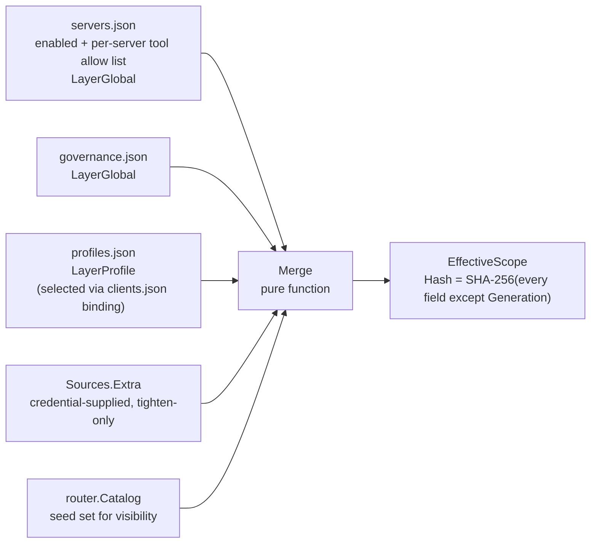
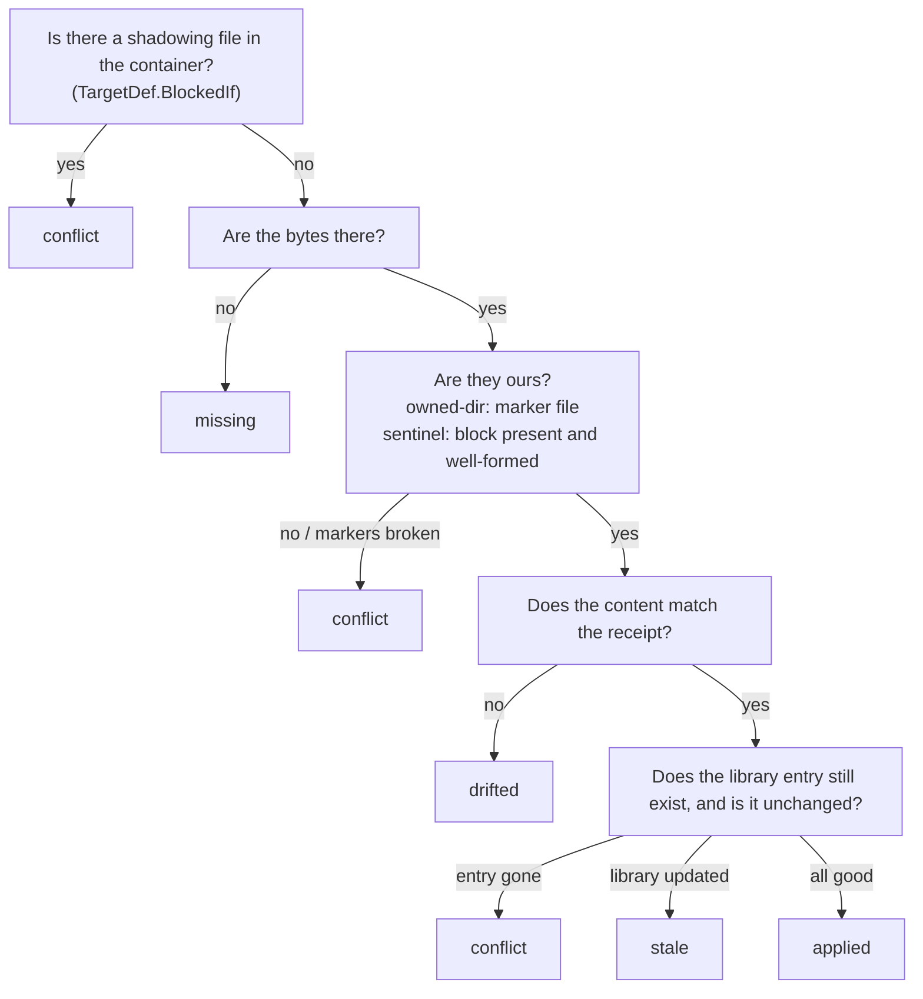

# Configuration and Scope Layer

This layer answers two questions: **what can this session see right now**, and **where do these
configs, credentials, and files come from, and who is responsible for changing them**. Seven packages
divide the work as follows.

`internal/scope` holds this layer's core computation: it takes the persisted configuration layers from
the registry and folds them into a single content-addressed `EffectiveScope`. `internal/session` owns
session identity and lifecycle — and nothing else: a session has no scope of its own, so there is
nothing about it to mutate. `internal/event` is the notification channel across the daemon: a registry
change goes out as an event and scope's cache is invalidated on it. event also provides two mergers
that compress a change storm into a single notification.

The other four packages each guard a class of external state. `internal/secrets` is the credential
vault, a four-level resolution chain stringing together environment variables, an encrypted file, and
the OS keyring; `internal/secrets/secureenv` builds an allowlist-admission clean environment for
downstream processes. `internal/clients` adapts the config file formats of 12 AI clients, writing the
agenthub gateway into them and safely taking it back out. `internal/skills` manages the skill library
and its materialized copies inside client directories.

These four packages do not depend on one another; all they share is one discipline: **if you can't
read it, error; if you can't change it, refuse; if you don't understand it, don't write it**. Each
package's "invariants and failure directions" section is the part of this document most worth reading
closely — those are the real hard constraints in the code, and violating any one of them while making
a change turns fail-closed into fail-open.

---

## internal/scope

### Responsibility in one sentence

Fold the configuration layers (Global, Profile, plus any credential-supplied layer) into one
deterministic, content-addressed `EffectiveScope` that answers "which servers and which tools can this
session see right now, and how big is the result budget".

### Key types and entry points

`Merge` is a **pure function**: the same input always produces the same output, and it never mutates
or aliases its input. The stdio gateway and the daemon call the same implementation — this is where
the design goal "both modes behave identically" lands in code. `MergeWithDiagnostics` folds a
pre-collected `[]Diagnostic` into the result **before hashing**, so diagnostics participate in content
addressing too.

`CachedResolver`'s cache key is the pair `(clientID, registryGeneration)`,
invalidated event-driven through `Invalidate(Event)`, never by polling. The session's **root is
deliberately absent** from it: it was in the key while the project layer matched on it, but with that
layer retired no persisted layer reads the root, so keeping it would have split one client's cache
across every directory it happens to report from — more misses for a value that cannot change the
answer. `EvRootChanged` still drops that one session's entry, not because a root can change a
resolution today but because dropping one entry is cheap and the alternative (letting each caller
decide which notices matter) is how a stale scope gets served the next time something does depend on
the root.

`Sources.Extra` holds extra layers appended after the persisted ones, so that **credentials with no
registry entry** can participate in the same intersection (the daemon's HTTP data plane folds an agent token's
server allowlist and profile pin in here; the profile pin uses `PinnedProfileLayer`, and an
unresolvable name yields a block-all layer plus `ok=false`, matching how `FromRegistry` treats dangling
references). They are ordinary layers and `Merge` treats them no differently — security fields
intersect — so Extra **has no shape that can widen visibility**.
Constraint: its return value must be a pure function of "session id + registry generation", because it
does not enter the cache key.

**`clients.json` contributes no layer.** `FromRegistry` reads a client entry for exactly one purpose:
to learn which profile that client is on (`ClientEntry.Binding()` — named, or followActive when there
is no entry at all). A client **selects** a profile; it never narrows on top of one. The entry type
`registry.ClientEntry` holds `{Profile, ProfileRef}` and nothing else, so "which profile is this client
bound to" is a *complete* answer to "what can it see" — an operator does not have to read a second
place and intersect by hand. `discovery` moved onto `registry.Profile` for the same reason: it
describes *that* tool set, so binding a client settles presentation and content in one act rather than
leaving presentation to be configured a second time.

`SessionKey.Root` survives as a field, but **no persisted layer reads it**. It is still filled in by the
stdio gateway from the first MCP root the client reports (`cachedPrimaryRoot` in `gateway/derive.go`)
because `internal/downstream` derives per-root server instances from it; it no longer selects anything
in the scope chain.

`NormalizePath` is the pure string normalizer that root travels through on its way there.
`PathIsWithin`, the boundary matcher the project layer used to select a binding by longest prefix, was
**deleted with that layer**: an exported, tested helper nothing calls reads as a supported entry point,
and the next caller would inherit a failure direction chosen for a job that no longer exists.

### Invariants and failure directions

**There are two classes of merge semantics, and changes must not confuse them.** Security fields tighten
monotonically: server visibility **intersects** across layers (seeded from the catalog's server set),
and a tool's `Allow` intersects across layers. There is no deny list anywhere and no boolean switch
left to fold: a deny would answer a newly-added downstream tool in the opposite direction from an
allow, and one configuration must not give two answers. Experience fields take the nearest value: `Discovery` is won by the most specific layer
(within the same `LayerKind`, the later layer wins) and `ResultBudget` takes the nearest value per key.
The one exception is `Budget.Forced`: a budget marked forced is capped at the **minimum**, so it can only
push the nearest value down, never raise it.

**The numeric ordering of `LayerKind` is the specificity ordering and must not be rearranged.** `Merge`
does not require the layers passed in to be sorted; specificity comes entirely from comparing
`LayerKind` values, so swapping the enum values silently changes who wins.

**A front end asking "which discovery mode does this profile get" goes through `DiscoveryFor`, never
through its own copy of the rule.** `profile ls` prints the resolved mode per profile — the same
question a session answers — so the pick rule lives in `pickDiscovery` and both callers use it,
`FromRegistry` and `DiscoveryFor` build their layers from the same `globalLayer` / `profileLayer`, and
`TestDiscoveryForMatchesTheResolvedSession` asserts the two answers agree for every combination of
global and per-profile setting. `DiscoveryFor` deliberately does **not** know `discovery.DefaultMode`:
"no layer set one" comes back as `ok=false` and the caller applies the built-in, so the default stays
in the one package that owns it. Note the asymmetry with `PinnedProfileLayer`, which carries a
profile's servers and tools but **not** its discovery — a token-pinned profile is presented in whatever
mode the rest of that session's chain resolves to.

**`nil` and `[]` are different, and the difference is the whole rule.** An absent selector means "no
intervention"; a nil `Allow` means the server's full tool set; an **empty** `Allow` means nothing at
all. That is why the field carries `omitzero` rather than `omitempty` — dropping an empty list on the
way to disk would turn block-all into allow-all, silently and in the fail-open direction.

**The keys of a tool selector are always raw tool names, never exposed names.** `ToolSelector` is a type
alias for `registry.ToolSelector`, and the persisted semantics have exactly one source of truth: an
absent selector means no intervention, `Allow == nil` means everything, `Allow == []` means nothing, and
`Allow == [...]` means narrowed to a subset. `cloneStrings` deliberately preserves the difference between
nil and an empty slice — degrading an empty slice to nil silently flips "block everything" into
"allow everything".

**Dangling profile references fail closed to the empty set, and never silently.** If something references
a profile that doesn't exist (or a named binding with no name), `FromRegistry` appends a profile layer
with `Servers: []` (block everything) and emits a `Diagnostic`. It never falls back to activeProfile —
that would turn deleting a profile into a silent widening. Diagnostics are part of `EffectiveScope`, and
`session show` and `doctor` print them.

**`NormalizePath` never canonicalizes and never touches the disk.** It does exactly four pure-string
things: backslashes to `/`, collapse repeated slashes (a leading `//` for UNC is preserved), strip the
trailing slash (a bare `/` is preserved), and lowercase Windows-shaped paths wholesale. Client-reported
paths may not exist on this machine at all, so symlink resolution or existence probing would both fail
and introduce TOCTOU. This function must be idempotent, because it gets applied repeatedly to output it
has already normalized.

**`EffectiveScope.Hash` covers every field except `Generation` and `Hash` itself.** `Generation` records
"which registry state this value was computed from"; it is not part of content identity and is stamped by
`Resolver` after the merge. The hash uses a length-prefixed canonical encoding with map keys visited in
order, so it is stable across processes and Go versions, and a golden test pins it down — determinism is a
contract. `Changed(prev, next)` compares only the `Hash`: only a content change is worth pushing
`tools/list_changed` to a session, otherwise a single registry rebuild would amplify into a notification
storm.

**Better to over-invalidate the cache than to under-invalidate.** `EvRootChanged` clears only the
corresponding session; `EvRegistryChanged` and `EvCatalogChanged` clear everything, and
**an unknown event type also clears everything**. The catalog is not in the cache key, so
`EvCatalogChanged` is the only channel through which a change in the downstream tool set becomes visible;
lose it and stale scopes get served forever. Over-invalidating costs one recomputation;
under-invalidating costs emitting the wrong visibility.

**Refuse to resolve without a registry snapshot.** `Resolve` errors outright when `src.Registry()` returns
nil, rather than conjuring an "empty but legal" scope. Likewise, a nil `Catalog` function or one that
returns an empty catalog resolves to zero visible servers — also the closed direction.

### followActive is read from the snapshot, not from a state file

`activeProfileName` reads `snap.Governance.V.ActiveProfile`. It **used to be hardcoded to return the
empty string** while `agenthub profile use` wrote the name into a state file — the mark could be set and
listed, but no session would ever apply it. Moving this value into the registry document fixed two things
at once: followActive actually follows, and `FromRegistry` stays a pure function — the value arrives with
the snapshot rather than being read from a file mid-resolution.

When unset it returns `""`, so followActive performs no profile narrowing, equivalent to
`agenthub profile use -` (clear). An unresolvable name is handled by the caller as a **dangling
reference** (fail-closed, block-all) — routing it through the same path as named bindings is precisely how
we get that property.

---

## internal/session

### Responsibility in one sentence

The daemon-side session registry: it mints session identities and tracks liveness. A session carries no
scope of its own — what it may see is resolved from the registry every time it is asked — so there is
nothing here to mutate and no way to change a live session's surface.

### Invariants and failure directions

**There are two identity shapes, each serving a different reader.** The human-facing one is the short ID
`"client:seq"` (e.g. `claude-code:17`), where seq is monotonic per client and **never reused** within the
daemon's lifetime. The protocol-facing one is the HTTP session's 128-bit random token (`Mcp-Session-Id`).
stdio sessions have no token (all zeros); `TokenHex()` returns an empty string for them and `MatchToken`
always returns false.

**Token comparison must be constant-time, and any anomalous input is denied.** `MatchToken` returns false
outright in three cases — not an HTTP session, hex decode failure, wrong length — and only reaches
`subtle.ConstantTimeCompare` at the very end. `FindByToken` does a constant-time comparison against each
candidate and returns `(nil, false)` for unknown or malformed tokens.

**No entropy, no existence.** `OpenHTTP` returns an error outright when `io.ReadFull` fails to read the
token, and never mints a session with an under-filled token.

**A re-registering gateway always gets a new identity.** seq is monotonic and never reused, so a gateway
that drops and reconnects will not silently reuse its old ID: a reference to the old session must break
rather than quietly rebind to a different connection.

**Only HTTP sessions are reaped by TTL.** A stdio session's lifetime is the gateway process's lifetime,
cleaned up when the daemon calls `Close` on link teardown, and the reaper skips them explicitly. Default TTL
is 24 hours with a 5-minute sweep interval.

**Root is a mutable attribute, not part of identity.** `SetRoots` updates it on `roots/list_changed`.
It is **not** in the scope resolver's cache key — no persisted layer reads it any more — and it was
never in the session ID. What still consumes it is `internal/downstream`, which derives per-root
server instances from it.

**Derivation keys and scope live on two different planes.** Nothing in `derive.go` touches a scope type, and
`DeriveKey` enters no scope hash: narrowing a session should not restart a process, and switching to another
instance should not change any visible tool name. `DeriveRoot` **deliberately returns an empty key** when the
session has no root (i.e. use the base instance), rather than degrading to building a key from the session ID
— the latter would hand a rootless session private state the operator intended to be isolated per project,
and would also spin up one process per rootless session. A multi-root session takes the **first** reported
root rather than a digest of the set, because this key is the vault scope name the operator uses when
managing credentials, and it has to be readable.

**Cascading close only takes down instances keyed by session.** Root-keyed instances are by construction
shared by every session with the same root, and tearing one down here would cut a neighbor's connection;
those instances are left to the connection pool's idle TTL. The worst case is an instance living 30 minutes
too long, not a call arriving one instance too late.

---

## internal/event

### Responsibility in one sentence

The daemon's in-process event bus, plus two event mergers: a 50ms-window **coalescer** for change storms,
and a 750ms **settling debouncer** for scan-style event streams.

Both merger modes share one implementation: `NewCoalescer(publish, window)` anchors the window at a
key's **first** `Add` (throttling, with bounded latency); `NewSettler(publish, window)` **resets** the
window on every `Add` (debouncing, collapsing an entire lifecycle into a single terminal event).

### Invariants and failure directions

**`Publish` never blocks — that is the reason this package exists.** A full subscriber buffer means the event
is dropped and counted, never that the publisher stalls. Consumers must therefore treat the bus as a
**change notification channel**, not a **change log**: when `Dropped()` is non-zero (or after a reconnect), the
consumer must re-read the authoritative state. Losing a notification is recoverable; blocking the publisher is
not.

**The ordering of unsubscribe and channel close is an invariant.** `Close` first removes the subscription from
the bus under the write lock, **and only then** closes the channel; `Publish` only sends under the read lock.
This ordering guarantees no send can ever race with the close. `Close` is idempotent.

**The payload is the same value for every subscriber and must be treated as immutable.** The same `Event`
value fans out to every matching subscription, so any party mutating it affects everyone else.

**A merger's payload is built lazily, and built exactly once.** Only the **last** builder passed to `Add` is
invoked, and it is invoked once, at fire time. A burst of K occurrences pays the cost of building an expensive
payload once. The builder runs on the timer goroutine (or on `Flush`'s caller) and holds **none** of the
Merger's locks while running, so it must capture state by reference or be a cheap closure.

**The reset race in settling mode is solved with a `gen` counter.** A timer that has already begun firing
cannot be stopped, so every re-armed timer captures the `gen` at that moment, and `fire` ignores callbacks
whose `gen` is stale.

**`Close` discards pending events; `Flush` fires them.** Dropping one merged notification at shutdown is an
acceptable failure direction — the bus contract already requires consumers to re-read state after a loss. After
`Close`, `Add` is a no-op.

**This package depends only on the standard library.** It sits beneath every business package and must stay
dependency-free.

`internal/ctlapi/sse.go` is the actual consumer of both mergers: server list changes go through the coalescer,
scan-type topics through the settler.

---

## internal/secrets

### Responsibility in one sentence

agenthub's credential vault: a four-level resolution chain stringing together environment variables, an
XChaCha20-Poly1305 encrypted file, and the OS keyring, with every entry addressed by the composite key
`(ServerID, Scope) + Key`.

### Key types and entry points

`Ref{ServerID, Scope, Key}` is a credential's address; when `Scope` is empty it takes `DefaultScope`
(`"_global"`). `Ref.StorageKey()` produces the **frozen** storage encoding
`agenthub/v1/<serverID>/<scope>/<key>`, which is used both as the keyring account name and as the map key in
secrets.enc; `ParseStorageKey` is its inverse.

The `Store` interface is the persistence face (`Get` / `Set` / `Delete`), and `Resolver` is the narrow
interface injected into `internal/downstream` (resolve one ref, nothing else). `Chain` is the only
implementation, constructed by `NewChain(ChainConfig)`; `Chain.Resolver()` yields the narrow interface and
`Chain.List(ctx)` enumerates every stored entry.

`HTTPAuthRef` / `OAuthStateRef` / `UserRef` in `wiring.go` are constructors for three well-known refs. The
reason they exist is practical: the shape of the composite key is spelled out in exactly one place, and a
caller hand-writing a `Ref` literal is one refactor away from forgetting the scope component and silently
reading a different entry.

`Migrate(ctx, from, to, refs)` moves credentials between two stores. `Chain.Backend(ctx, kind)` exposes the two
**persistent backends** (`keyring` / `enc-file`) individually as a `Store` precisely to feed it — see "why it
must be a backend-level store" below. The user-facing entry point is
`agenthub secret migrate --from X --to Y`.

**Why an explicit command rather than automatic migration.** Backend availability changes underneath the
operator (installing a desktop environment makes the keyring probe start passing, setting
`AGENTHUB_SECRET_KEY` activates the enc file), and after such a change the old credentials still sit in the old
backend. Automatic moving means touching credentials the operator did not ask to touch while they weren't
looking. And **not moving them doesn't break anything** — the four-level chain still resolves from the old
backend, right up until that backend becomes unavailable one day and the credentials appear to vanish into thin
air. That "lazy direction" is exactly the value of this command.

The environment variable level has **no** `Store` and is not in `BackendKinds()`: it is a per-process **input**
rather than storage, with nothing to write and nothing to delete, so credentials can neither migrate into nor
out of it.

### Invariants and failure directions

**Four levels, first hit wins, and an empty or whitespace-only value counts as "unset" at every level.**

| Level | Source | Activation condition |
|---|---|---|
| 1 | environment variable `AGENTHUB_SECRET_<KEY>` | always |
| 2 | bare environment variable `<KEY>` | explicit opt-in `AGENTHUB_ALLOW_BARE_SECRET_ENV=1` |
| 3 | `secrets.enc` (XChaCha20-Poly1305) | `AGENTHUB_SECRET_KEY` set, or the dev-fallback pair of files already exists |
| 4 | OS keyring (zalando/go-keyring) | availability probe passes |

**Level 2 being off by default is fail-closed:** no arbitrary environment variable should be treated as a
credential unless the user explicitly asks for it. And even when it is on, `envValue` **never** resolves any
variable starting with `AGENTHUB_` through the bare path — the opt-in must not become a way to read out our own
control variables.

**Reserved-name collision: an entry named `key` would map to `AGENTHUB_SECRET_KEY`, which is the key material
variable for the encrypted file.** `envValue` skips that name explicitly; key material must never be readable
through the credential chain.

**"Couldn't read it" and "read something broken" must be distinguished.** A file that won't decrypt
(`ErrDecrypt`) or a keyring reporting anything other than not-found is raised as an **error**, never treated as a
miss and carried further down the chain. A mistyped `AGENTHUB_SECRET_KEY` or a broken keychain must be visible,
not silently degraded into "that credential isn't set". The **only** exception is a keyring whose availability
probe fails: that machine simply doesn't have that level, so it is skipped without error (writes then land in the
encrypted file per A.6 #5).

**Three keyring hardening measures, none optional.**
First, the availability probe **reads only, never writes**: a `Set` probe would trigger that destructive macOS
confirmation dialog. The probe reads a well-known nonexistent account; both success and `ErrKeyringNotFound` prove
the backend is alive, while a timeout or any other error marks it unavailable.
Second, the probe's conclusion is **cached for the process lifetime**: an unavailable keyring flips the chain over
to the encrypted file fallback, and it must not re-prompt on every call.
Third, **every operation has a hard timeout** (3 seconds by default): after a timeout the worker goroutine is
**deliberately abandoned** — a stuck keychain prompt cannot be canceled, and abandoning it is the only way to
unblock the caller; the result travels over a buffered channel, so an abandoned worker can never collide with the
caller's return value.

**The OS keyring cannot be enumerated, so there is a self-managed key registry.** `keyring-keys.json` mirrors
**key names only** and never stores values. The invariant is: the registry is **only modified in sync with a
successful keyring mutation**, so it neither claims to hold keys the keyring has already lost nor misses keys the
keyring still holds.

**The dev-mode fallback is an explicit ruling (A.6 #5), not laziness.** During development every `go build`
produces a new unsigned binary, and the macOS keychain ACL re-prompts each time. So when the keyring probe fails, or
when `AGENTHUB_DEV_SECRETS=1` is set explicitly, writes land in `secrets.enc` with a key auto-generated and
persisted **right next to it** in `secrets.enc.key` (0600). The docs say the quiet part out loud: putting the key
beside the ciphertext is obfuscation, not encryption at rest, and an attacker who can read both files has the
plaintext. This is acceptable only for the dev fallback; the production path goes through `AGENTHUB_SECRET_KEY` or
the OS keyring.

`encForRead`'s dev-fallback test requires `secrets.enc` and `secrets.enc.key` to **both** exist — data written by
the dev backend must remain readable after the keyring probe starts passing again.

**Persistence discipline for the encrypted file.** The whole map is sealed under a single random nonce; the AAD is
`"agenthub/secrets/v1"`, binding the ciphertext to the format version so a v2 envelope can never be replayed as a
v1; and writes go through the atomic ladder (temp file in the same directory, chmod 0600, write, fsync, rename,
fsync parent directory), never leaving a half-written target file. A missing file is an empty map, not an error.

**`storageKeyPrefix = "agenthub/v1"` is frozen and golden-tested.** Changing it orphans every stored credential.
Within a component only `%` and `/` are percent-escaped (those are the only two bytes that would break the
delimiter structure); everything else passes through verbatim, so `secret ls` output stays readable.
`ParseStorageKey` errors on an unknown prefix or malformed escaping, rather than silently dropping a key we can't
decode from the enumeration.

**`Migrate`'s order is "read old, write new, read back and verify, delete old", and a failure at any step leaves
two copies.** The value read back from the new store must match the original exactly before the old entry is
deleted; a duplicated credential is recoverable, a lost one is not. The docs explicitly require passing
**backend-level** stores: `*Chain`'s `Get` consults environment variables first, so a single environment variable
could fool the read-back verification while the new backend actually stored nothing — and once verification passes,
the old entry gets deleted, which is exactly the outcome the read-back step exists to prevent. `Chain.Backend`
produces precisely this kind of store, and `TestBackendIgnoresEnvironmentLevels` pins it down.

**`Chain.Backend` determines availability eagerly.** An unavailable backend (no OS keyring, or no key to open
`secrets.enc`) returns `ErrBackendUnavailable` on the spot rather than failing on first use: discovering halfway
through a migration that the destination can't be written is exactly how you get a half-migrated vault. So the CLI
resolves both ends before moving anything.

**Concurrency.** `Chain` serializes its own read-modify-write of the encrypted file and registry updates with an
in-process mutex; cross-process write coordination is the caller's business (the vault sibling lock used by OAuth
refresh lives in `oauthflow`).

**Tests never touch the real keychain.** The keyring hides behind the `Backend` interface, and tests inject fakes
everywhere; the smoke test against the real backend only runs under `AGENTHUB_TEST_REAL_KEYRING=1`.

---

## internal/secrets/secureenv

### Responsibility in one sentence

Build a hardened environment for a downstream process about to be spawned: allowlist admission (deny by
default), login-shell PATH capture, and userinfo redaction in proxy variables.

### Key types and entry points

Pure functions only. `Filter(environ []string, cfg Config) []string` filters `KEY=value` entries against the
allowlist while preserving order. `Config` allows extending the allowlist by name (`Allow`) and by prefix
(`AllowPrefixes`), and enables forwarding of proxy variables via `ForwardProxy`. `RedactProxyValue(name, val)
(string, bool)` is separately usable. `CaptureLoginPATH(ctx, shell)` and `LoginPATH()` handle PATH capture.

### Invariants and failure directions

**Deny by default.** Any variable not explicitly allowed is dropped; there is no "everything but a blocklist"
mode.

**The `AGENTHUB_` prefix is a hard deny that `Config` cannot override.** Our own control variables must never leak
downstream. This stacks with the identical stripping in `internal/downstream` — both sides reject `AGENTHUB_*`, so
the composition is idempotent.

**Proxy variables are not forwarded by default.** Proxy endpoints frequently embed credentials, which is not
downstream's business unless asked for. Once `ForwardProxy` is on, values go through `RedactProxyValue`:
`NO_PROXY` is a plain host list and passes through verbatim; a value with no `@` passes through verbatim; and a
value containing `@` that **cannot** be reliably identified and stripped as URL userinfo (for example a
scheme-less `user:pass@host`, which parses into the opaque part) is **dropped outright** — we never forward a
value we cannot prove is credential-free.

**`LoginPATH` is the one place in this layer that is deliberately fail-open.** Processes launched by
launchd/systemd inherit a truncated PATH, and the login shell's PATH is the one an interactive user actually has
(this bit mcpproxy three times). Capture runs `shell -l -c 'echo $PATH'` and takes the **last** non-empty line of
output (a login profile may print a greeting before the echo), with a 3-second hard timeout and
`cmd.WaitDelay = 1s` to force the pipes closed — otherwise the login shell's children inherit the stdout pipe and
`Output` keeps blocking until every descendant exits, even after the context kills the shell. Any failure falls
back to the current process's `PATH`: a broken login shell should not block a spawn, and the worst case is keeping
the truncated PATH we already had, never less. The captured result is cached with `sync.Once`, once per process.

### Current integration status

**Not yet wired.** Nothing outside this package and its tests references `secureenv`;
`internal/downstream/spec.go` still does its own `AGENTHUB_*` stripping (`envPrefix`).

---

## internal/clients

### Responsibility in one sentence

Adapt AI client config file formats: detect where they're installed, write the agenthub gateway entry into them,
safely take it back out, and report what is actually in them.

### Key types and entry points

The `Format` interface is the entire behavior of one client adapter (`Locations` / `DefaultPath` / `PathFor` /
`Connect` / `Disconnect` / `ManualSnippet`). It has exactly two implementations: `jsonFormat` covers the two JSON
shapes, and `probeFormat` covers the shapes we don't rewrite.

`Table` is an adapter table bound to one environment (GOOS, HOME, backup directory), constructed by
`New(Options)` / `Default()`, with `Lookup(id)` / `IDs()` / `Formats()` as the query entry points. The table
itself is the `specs` slice in `table.go`.

Two action methods hang directly off `Table`: `Detect(ctx, baseDir)` enumerates the config files present on this
machine (stat only), and `Inspect(clientID, baseDir)` opens one client's files and lists their server entries.
`Inspection.ConnectState()` reduces the latter to the answer callers actually want.

### A shape-driven adapter table

Behavior is driven by the **shape** of the config rather than by a hand-written branch per product. Five shapes
cover the entire ecosystem:

| Shape | Meaning | Rows | Clients |
|---|---|---|---|
| `ShapeServerMap` | A JSON file with `{"mcpServers": {...}}` at the top level | 7 | claude-code, claude-desktop, cursor, windsurf, cline, roo-code, gemini-cli |
| `ShapeNested` | The same name→entry map, but buried under a key path inside a larger document | 2 | vscode (`servers` / `mcp.servers`), zed (`context_servers`) |
| `ShapeTOML` | A TOML document, **detect only, never rewrite** | 1 | codex |
| `ShapeYAML` | A YAML document, **detect only, never rewrite** | 1 | continue |
| `ShapeRemote` | No config file on this machine at all | 1 | open-webui |

Twelve rows in total. Adding a client is one more row in `table.go`, not one more code path. `Shape.Writable()`
returns true only for the two JSON shapes.

Each row's `locs` is ordered **project first**, but that is **read priority** (when `Import` hits a duplicate name,
the project-level definition wins), **not a write preference** — the default write target is decided by placement,
see below. `locSpec.home` is a GOOS-to-path map, and a missing GOOS makes that location unavailable on that
platform rather than guessed — no build tags involved.

**Every row's `home` map is still darwin and linux only**, so on Windows `resolve` drops every user placement and
`client connect` finds nothing to write for any client whose config is user-level. Unavailable is the right
direction — inventing a `%APPDATA%` path and writing to it unverified is worse than finding nothing — but it is a
gap, not a design boundary, and [windows.md](../windows.md) tracks it.

### Invariants and failure directions

**Default writes go to the user level (`DefaultPlacement = User`).** When nobody specifies a path or a placement,
`DefaultPath` yields the file under `$HOME`. Two reasons: the entry written carries **the absolute path of this
machine's agenthub binary**, and project-level files (`.mcp.json`, `.cursor/mcp.json`) are meant to be committed
and shared — defaulting to project would mean committing a path that only holds on your own machine to your
teammates; and agenthub is by nature "one hub shared by every client on this machine", not something you re-wire
per repository. **Which servers a client can see is decided by `internal/scope`, never by which file the entry was
written into.** When a row has no user location on this platform (or `$HOME` won't resolve), it falls back to the
first location — every Windows row lacks a user location, and the fallback keeps it writable.

**An explicitly specified placement is either honored exactly or refused.** `PathFor` returns `""` for a client
that lacks the location, and callers (the CLI's `--placement`, the control plane's `placement` field) error on
that; they **never** redirect the write to a different location: writing the gateway entry into a file nobody named
is far worse than an up-front refusal. Passing `--path` and `--placement` together is a usage error, not a place to
silently invent a precedence.

**`DisconnectDefault` is the backstop for the default write target having moved.** A disconnect with no target
looks at the default target first, and **only** if there's no agenthub-owned entry there does it check the same
client's other location — because entries written before the default moved to user level are still sitting in
`.mcp.json`, and "the entry is obviously still there but we report not connected" is the least acceptable answer
here. It is not a search: it visits only this one client's own locations, and only after the default target comes
up empty. If the fallback location fails for some other reason (unparseable, oversized, denied), it **returns that
error** rather than skipping — a file agenthub refuses to touch must not be reported as "nothing in there". Calls
that specified a path or placement don't take this route: an explicit target is an instruction, not a starting
point.

**macOS TCC: `Detect` only stats, never reads.** Reading another application's data directory triggers the system
privacy dialog, and a bulk scan that pops a dozen of them is worse than not scanning. Content reading only happens
in `Inspect` and `Import`, which are single-client user actions where the dialog is expected and explicable.

**"There is no such file" and "you're not allowed to look at this file" are never conflated.** A denied access is
classified as a `*PermissionError` carrying actionable remediation text, and its `HTTPStatus()` returns 403, not
404. The two cases call for opposite user actions: the former means "the client isn't installed, nothing to do",
the latter means "the client is installed, go grant permission". `classifyAccess` only classifies something as
denied when `errors.Is(err, fs.ErrPermission)`, so no ambiguous I/O error gets dressed up as a TCC prompt.

**A parse failure must error and must never destroy.** A file that exists but won't parse aborts the entire
operation with a `*ParseError`, leaving the file untouched. JSONC (with comments) counts as unparseable, and the
error carries the specific JSONC diagnostic — that's the single most common reason a real `settings.json` fails to
parse, and just saying "invalid JSON" reads like a bug. Every `*ParseError` comes with a hand-pasteable snippet, so
the user isn't stuck.

**Anything over `MaxConfigSize` (64 MiB) is refused **before any read at all**.** The stat size is checked first;
`readLimited` catches it a second time with an `io.LimitReader` in case the file grows between the stat and the
read. A client config that large is a runaway log, not a config.

**Unknown fields and foreign entries are preserved byte for byte.** Every level from the document root down to the
server map is stored as `map[string]json.RawMessage`, so every sibling key at every level and every unrecognized
field round-trips verbatim.

**Backups are centralized, not in-place.** Before writing, the original content is copied to
`<data>/backups/clients/<client>-<ts>Z.json` (0600, rotated per `DefaultKeepBackups = 10`), never as a sidecar next
to the original: a project-level `.mcp.json` lives in a git working tree, and dropping a
`.mcp.json.agenthub-backup` beside it would dirty `git status` on every connect and risk committing someone else's
credentials. The 0600 reasoning is just as concrete: the env block of a client config frequently holds API tokens,
so its copy is as sensitive as the vault. Backup files are created with `O_EXCL`, with same-microsecond collisions
resolved by a suffix loop; **rotation is best-effort**, since failing to delete an old copy must never fail a
connect that has already landed the new backup safely.

**If the backup can't be written, the whole operation fails and the target file is untouched.** Modifying a user's
config with no recoverable copy is worse than not connecting.

**`Disconnect` identifies by ownership, never by name.** `ownedBy` checks that the entry's args contain both the
`connect` subcommand and a `--client` value equal to this client's ID. An entry that just happens to be named
`agenthub` is **not** ours; an entry the user renamed that still points at our gateway **is**. This is the
"identify by shape, not by name" rule inherited from toolport's repoint.

**Writes are atomic and preserve the original permissions.** New files are created 0644 (a project-level
`.mcp.json` is meant to be committed and shared, unlike registry documents at 0600), and existing files keep their
own mode. When the rendered result is byte-identical to the current content it returns `Changed: false` and does
not write — repeated connects are idempotent. Directory fsync is best-effort, since a project directory may live on
a filesystem that refuses it, and the rename there is still atomic regardless.

**Only rewrite documents that round-trip losslessly — and note that the rule is about RE-ENCODING.** TOML/YAML
re-encoders drop comments, key order, and anchors; that is a config-destruction machine wearing a helpful hat. So those clients get detection plus one precise manual
snippet, and `Connect` **fails loudly** with the snippet rather than half-working. `probeFormat.Disconnect`
refuses in the same way: agenthub never wrote anything here, so there's nothing it can safely remove.

**Delegation: agenthub does not re-encode the document, it asks the tool that owns the format.** A row may
carry a `delegate` (codex does), and `Connect`/`Disconnect` then run `codex mcp add|remove` instead of printing
advice — because a connect that changes nothing is not a connect. Three properties make that delegation rather
than a shrug: the file is **backed up first**, exactly as agenthub's own writes are; the result is **verified by
re-reading it**, so a CLI that exits 0 having written nothing is a failure and never a connect; and a delegate
that is absent, fails, or leaves the wrong state **falls back to the instructions** rather than reporting a
success nobody checked. Execution is refusable per invocation (`--manual`) or per machine
(`AGENTHUB_NO_CLIENT_CLI=1`), and the environment can only ever forbid it — a variable that could switch
execution back on for a caller that passed `NoDelegate` would let a program run other programs behind its
caller's back.

**JSONC is spliced, not re-encoded.** Zed's `settings.json` ships with a comment header and VS Code's is JSONC by
convention, which made the default install of both a client agenthub refused to touch. `jsonc.go` reads them with a
comment-blanking pass — comments and trailing commas become spaces of the SAME LENGTH, so offsets in the blanked
copy are offsets in the original — and writes by replacing the bytes of agenthub's own entry and nothing else. The
user's comments, key order, indentation and trailing commas survive because they are never rewritten.

**The safety does not come from the locator being right; it comes from proving the result.** `verifySplice` runs
before anything reaches the disk: the edit must parse, must differ from the original in exactly the entries
agenthub meant to change (deep-compared with those entries removed from both sides), and must carry byte-identical
comments. Any doubt leaves the file untouched and returns the same `*ParseError`-with-snippet the client used to
get. A shape the locator cannot walk — a section key that is not an object, a root that is not an object — is
refused for the same reason rather than guessed at. Both hand-written passes are fuzzed (`FuzzBlankJSONC`,
`FuzzSpliceEntryKeepsEverythingElse`).

**A duplicated key resolves to the LAST occurrence, because that is the one the file's owner reads.** JSON
leaves duplicate keys to the implementation; `encoding/json` — which this package uses to find the entry, and
uses again inside `verifySplice` — keeps the last, and so do the client applications these files belong to. The
locator has to agree, and once did not: it walked to the first occurrence, so an edit landed in a section
nobody reads. That failure was invisible by construction rather than merely unlucky — the document came back
byte-identical, and `verifySplice` could not object because both of its decodes went through `encoding/json`
and agreed with each other. `Disconnect` then reported an entry removed that the client still spawned. This is
the one case where proving the result cannot save a wrong locator, which is why the rule is written down here
rather than left to the verifier.

**That rule is about writing, and reading is a separate power.** A row may carry `readTable`, and codex does:
`scanTOMLServers` reads `~/.codex/config.toml` well enough to answer "is our entry in here?" while `Connect` still
refuses it. Refusing to read bought nothing — it made `client ls` say "?" for a client that was plainly connected,
and made doctor assert "no agenthub gateway entry" about a file it had never opened.

The scanner models exactly `[mcp_servers.NAME]` tables and the four keys agenthub uses, and **refuses the whole
document** on anything else (array-of-tables, an inline `mcp_servers = {...}`, an unterminated string, an escape
outside TOML's set). `ok=false` is the contract: callers report "unknown", and nothing this scanner cannot read is
ever converted into "the entry is not there". Scanned entries are re-rendered as the JSON shape the package already
speaks and go back through `summarise`/`ownedBy`, so ownership has one implementation for every format. It reads
untrusted bytes by hand and is fuzzed (`FuzzScanTOMLServers`), which caught it accepting `"\0"` and inventing a
`0` that was not in the file.

**`locationFor`'s match order guarantees the section is deterministic.** Exact path equality first, then equal
basename (this is what makes `--path /tmp/x/settings.json` behave like a real settings.json instead of silently
picking a different section), and finally a fallback to this client's primary location. The failure direction is:
a path that doesn't match **never** guesses at another client's shape.

**`ConnectState` fails loud, and that is the whole point of it.** "Is agenthub wired into this client?" has five
answers, not two: `connected` (some location holds an entry agenthub itself wrote — decided by `Owned`, never by
the entry's name), `not_connected` (every location was opened and understood, none had one), `denied`, `unreadable`
(there, but agenthub refuses to interpret it), and `unknown` (nobody looked: a probe-only shape, or a caller that
asked not to read). A positive finding wins outright; after that the loudest doubt wins, so a location agenthub
could not see never degrades into "not connected". It returns the placements holding the entry alongside the state,
because "connected in the user file while the project file still holds one" is exactly what a disconnect has to
know about.

---

## internal/skills

### Responsibility in one sentence

The skills subsystem: an agenthub-owned, content-addressed skill library, plus its materialized copies inside
various AI client directories (and the receipts for those copies), plus a protocol face that serves the library
upstream as read-only MCP tools.

### The two-layer model and "honest granularity"

An MCP server is a runtime intermediary and agenthub sits on the call path, so visibility can change per session.
Skills are the exact opposite: clients read them straight off the filesystem, and agenthub is **not** on the read
path. That difference forces a two-layer structure:

- **The store**: agenthub's own canonical copy, placed content-addressed at
  `<skills>/store/<id>/<contentHash>/` and indexed by `skills.json`. This is the only source of truth.
  **`<id>` is a path segment, so its shape check is a path safety check** (`validID`): 1–64 lowercase ASCII
  letters, digits and single inner dashes — exactly what `slugify` mints — refused rather than sanitized,
  because a sanitizer must be right about every escaping form while a shape check need only be right about
  one. An explicit `--id` used to be stored verbatim, so `../../../some-dir` escaped the store both on the
  copy and on the delete. Three properties are load-bearing rather than tidy: separators and `.`/`..` are
  outside the character set; uppercase is excluded because two IDs differing only in case share one directory
  on a case-insensitive filesystem while the index counts them as two skills; and the empty string is
  excluded because it collapses the join onto the store directory itself, which a removal would then delete
  whole. The two **deleting** paths (`Remove`, `pruneVersions`) re-check rather than trust the index they read
  the ID from — dropping a library entry while leaving its files is recoverable, deleting the wrong tree is not.
- **An install**: a **receipt** in `installs.json` recording that "this skill was materialized once, for this
  client, under this scope". Receipts go stale, so every one of them must be verifiable and repairable and
  **never blindly trusted**.

Which yields this package's single most important sentence, written into the `Granularity` field of every return
value: **file materialization can only achieve client granularity, never session granularity.** Once bytes are on
disk, every session of that client can see them, and agenthub cannot retract a file for one session while keeping
it for another. Per-session skill visibility can only go through the skills-over-MCP path (`mcp.go`), because
there agenthub actually is on the read path. The `GranularityClient` constant is echoed back in every result value
precisely so the CLI and the GUI are forced to state this limitation rather than imply a precision that doesn't
exist.

### Key types and entry points

`Manager` is this package's entire API surface: constructed by `Open(dir, Options)`, with library operations
`Add` / `List` / `Inspect` / `Enable` / `Disable` / `Remove` / `Update` / `Verify` and install operations
`Plan` / `InstallTo` / `Sync`.

`Skill` is a library entry, `InstallState` is a receipt, and `Pin` is a fingerprint baseline. `ApplyState` is the
receipt's five states, and `LibraryState` is a library entry's own health (`ok` / `tampered` / `unpinned` /
`missing`).

`TargetDef` is the definition of a materialization target (`targets.go`); it is the skills-side counterpart of
`internal/clients`' `Format` table — same set of methods, different table. `WriteStrategy` has exactly two values:
`StrategyOwnedDir` and `StrategySentinelBlock`.

`Provider` (`mcp.go`) is the skills-over-MCP supply face: `NewProvider(m)` constructs it, `Refresh(ctx)` rebuilds
the projection, `Tools()` returns a snapshot, and `Call` / `Read` serve a single read.

### The two write strategies

**`StrategyOwnedDir`: agenthub owns the entire directory and can rebuild it from scratch.** Ownership is proven by
the marker file `.agenthub-managed.json` (`MarkerFileName`), **and only by it** — path conventions, naming patterns,
and receipts are all things a user might reproduce by coincidence, whereas an explicit marker file cannot be
produced by accident. A directory without our marker is somebody else's and always reports `StateConflict`, and is
**never absorbed**.

`applyOwnedDir` **rebuilds** rather than merges: the directory is ours end to end, so stray files left by an older
version (or the remains of a half-finished write) must not survive. The ordering is deliberate — the marker is
checked **before** deletion and written only at the end, so a crash mid-write leaves a directory that verifies as
`Drifted` (repairable) rather than one that looks complete.

**`StrategySentinelBlock`: agenthub owns the span between BEGIN/END inside someone else's file.** The marker
strings (`<!-- agenthub:skill:<id>:start -->` / `:end -->`) are **frozen**: changing them orphans every block
agenthub has ever written, and an orphaned block is indistinguishable from user content and would be left there
forever. Bytes outside the sentinels are preserved verbatim, with the **one** exception documented in the comment on
`upsertBlock`: appending to a file that doesn't end in a newline adds one, so the start marker gets a line to
itself.

`findBlock` is the safety valve for the whole strategy: anything other than "exactly zero" or "exactly one
well-formed pair" (unpaired, inverted, duplicated) returns a `*SentinelError`, and the caller **must** refuse to
write. Broken markers mean we can no longer tell which bytes are ours and which are the user's, and the only safe
action is to stop and say so. Overwriting on a guess is exactly how a "managed block" tool eats someone else's
file. `SentinelError` satisfies `errors.Is(err, ErrConflict)`, because the failure direction is identical.

Import also applies a source-side guard: a package whose content contains an agenthub sentinel string (in the name,
the description, or the SKILL.md body) is **rejected at the door**, because an embedded END marker would truncate
its own block and everything after it would silently become "user content" that agenthub will never manage or
remove again.

### ApplyState and decision precedence

Five states: `applied`, `stale`, `drifted`, `missing`, `conflict`. It answers exactly one question —
"are the bytes still where we think they are" — and deliberately not "is this content trustworthy".

`verifyOne`'s decision order is "most actionable first", with each level answering a different question:

Ruling "library entry gone" as `conflict` rather than `missing` is deliberate: something deleted a skill without
deleting its install, and automated writing has to stop and wait for a human to look.

### Invariants and failure directions

**Every read-modify-write goes through `withState`; there is no second path.** N gateways plus the daemon plus the
CLI all mutate this state, so multi-writer discipline is a necessity rather than an optimization. A cross-process
flock on a single `.lock` guards the whole skills directory, and the three state files are loaded and saved as one
unit under that one lock — because every interesting operation touches at least two of them (add writes the index
and a pin; remove writes the index and receipts), and one lock makes cross-file consistency structural rather than
an ordering convention nobody can verify. Read-only callers take the same exclusive lock: operations are all short,
and correctness beats concurrency here.

**A corrupt state file always fails closed, and is never renamed out of the way.** A file that exists but won't
parse is a `*CorruptError`, the operation aborts, and the file **stays in place**. Renaming it to `.corrupt` would
make the next read look like a legitimate brand-new store, which is exactly the silent re-baselining an attacker
wants. A *missing* file is what constitutes a brand-new store (first run has no skills). Unreadable, unparseable,
trailing data, empty file (the atomic writer never produces one), unsupported version — all count as corrupt. There
are 4 read retries to absorb rename transients on the lock-free read path; a parse failure that survives the retries
is real corruption.

**A missing `enabled` field reads as disabled.** The persisted spelling is `Enabled`, not `Disabled`, precisely so
that a hand-written or truncated record omitting the field reads as **disabled** — for the question "should agenthub
push these bytes into a client directory", that is the closed direction. `Add` always writes the field explicitly.

**Fingerprints and pins: a mismatch refuses to propagate.** `Fingerprint` is `"v1:<sha256>"` covering content
**plus** metadata (name, description, kind), making it strictly broader than `ContentHash`. description is included
because it is what the client's model actually reads when deciding whether to invoke a skill — identical files with a
swapped description **is** a meaningful change, and a classic prompt injection vector. `Version` and timestamps are
deliberately excluded: a version bump with unchanged content is not a content change, and folding in timestamps
would make re-importing identical bytes produce an unstable fingerprint.

The `HashSchemaVersion` prefix earns its keep: once the formula changes, pins recorded with the old formula must be
identifiable as "different algorithm" rather than "content changed". Without the prefix, a formula upgrade would
present as a fleet-wide alert, and users would learn to ignore alerts.

`requireTrusted` runs ahead of `InstallTo` and `syncOne`, and it **re-reads the library copy** — the same full
recomputation `Verify` performs, through the same `verifyLibrary`: hash the files on disk, rebuild the fingerprint
from what is actually there, compare both against the recorded values. It used to compare `pins.Pins[id].Fingerprint`
against `sk.Fingerprint`, which is two values out of the same two files, so a stored `SKILL.md` edited after pinning
— leaving `skills.json` and `skill-pins.json` untouched — passed a check documented as fail-closed, and
`applySentinel` then read that same modified file and spliced it into a client's rule file, where the client's model
reads it as its own instructions. The rule this violated is the one stated in the next sentence, and had been for as
long as it has been written down: **an index a tamperer has edited cannot vouch for itself.** The install path was
the one taking it at its word.

Three fail-closed directions, and one honest limit. **Mismatched entries refuse** (`TamperError`, carrying the
fingerprint recomputed from disk rather than the index's). **A copy that cannot be read or hashed refuses** too
(`ErrUnverifiable`) rather than reading as "nothing to compare" — that is the state an attacker can arrange most
cheaply of all. **Unpinned entries are allowed** (they predate the pin mechanism) but have still had their content
hash checked, so "unpinned" means "no baseline", never "unverified". The limit: a tamperer who rewrites the library
copy, the index AND the pin file consistently is not detectable here — all three are files on the same disk, and no
recomputation outranks a baseline the attacker also wrote — as is the window between this check and the read at
materialization.

**Pins are never deleted.** Not even by `Remove`. When the same skill is deleted and added back, it is compared
against the **original baseline** rather than blindly re-pinned: re-pinning on re-add is how a tampered copy
launders itself back into trust.

**Drift refuses to be overwritten unless a human explicitly decides.** A materialized copy modified by something
other than agenthub returns `ErrDrifted`, and the caller must pass `InstallRequest.AllowDrift` to overwrite it.
Drift is the user telling us something, even if what they mean is "I edited the wrong file"; silently rolling it
back is how a sync tool teaches users not to trust its own receipts.

**Owed: two of this package's sentinels reach the CLI with no arm in `classifySkillsError`, so they exit 1 as
`E_GENERAL`.** That function (`internal/cli/skill.go`) is a `switch` over `errors.Is`, and its `default` is to return
the error unclassified — a shape that says nothing when a new sentinel is added beside the ones already handled.

| Sentinel | Today | Should be | Why |
|---|---|---|---|
| `ErrInvalidID` | 1 / `E_GENERAL` | 2 / `E_USAGE` | A rejected `--id` is an argument the user typed. The frozen exit table gives row 2 as "arguments, unknown flag, unknown subcommand", and `agenthub skill add <dir> --id 'Bad..ID' --json` answers `{"code":"E_GENERAL"}` with status 1. |
| `ErrUnverifiable` | 1 / `E_GENERAL` | 6 / `E_GOVERNANCE_DENIED` | It is the second arm of the same fail-closed decision as `ErrTampered`, which maps to 6. A library copy that mismatches its pin and one that cannot be hashed at all are the same refusal — the second is the state an attacker can arrange most cheaply — and they should not be told apart by exit code. |

`ErrGitFetchUnsupported` is also unmapped and is arguably right there: a feature that does not exist is a general
failure, and its message already names the remedy. `ErrSkillUnavailable` is correctly absent — it is raised on the
MCP face (`mcp.go`) and handled there, and never reaches the CLI.

Not fixed here because an exit code is a machine contract and the table is frozen: moving a case from 1 to 2 or 6 is
the table's owner's call, not a tidy-night edit.

**Import is this package's largest attack surface, and every rejection is non-negotiable.** `scanTree` rejects:
symlinks of any kind (following one copies content from outside the package; preserving one makes the installed copy
point at an attacker-chosen path inside the user's home directory), non-regular files (devices, sockets, fifos), a
`MarkerFileName` appearing in the source tree (that is the ownership credential for an install directory, and a
package carrying one could forge ownership), and trees exceeding the size and count limits (a mistyped path — a home
directory, a repo with node_modules — should fail fast rather than copy several GB). Path escapes (`..`, absolute
paths) are structurally impossible (every path is derived by `filepath.Rel` relative to the walk root), but the check
stays, because the entire install layer trusts `FileEntry.Path` to be a package-relative path.

`copyTree` **re-hashes** each file as it copies and compares against the scan result: if the source changed between
scan and copy, the import aborts rather than producing a library copy whose `ContentHash` is lying (TOCTOU).

`Options.ContentScanner` is the seam for injecting a scanner — SKILL.md is a first-class prompt injection carrier. A
hit **rejects the import outright** rather than importing and flagging — an imported skill is one `sync` away from
being materialized into a client directory. This hook lives in Options so that this package depends on no guard
package. **Nothing sets it today**: the scanner it was shaped for went with the removed governance surface, so the
sentence above describes what the seam would do, not a check an import currently passes.

**An unreadable entry inside `hashDir` is an error, never a skipped file.** Silently skipping would let a permissions
trick hide drift. A symlink or device file appearing where a skill file belongs is drift by definition, and gets
assigned a hash that can never match.

**`Sync`'s convergence semantics.** A conflict on one skill **never** aborts the batch: a shadowed file or a
hand-edited copy is recorded as one failed item while the other skills still converge, and only a store-level failure
returns an error. Pruning (removing skills no longer selected) is the default behavior, because "sync" means
converge; but pruning happens **only within the containers this request converged** — a sync of project A must never
de-materialize project B, and a generic target pointing at one directory should not touch another; the `Container`
field in the receipt is what distinguishes them. `Disable` **does not** de-materialize anything by itself: the bytes
stay until a `Sync` (or an explicit `Remove`) converges the target, and until then the receipt honestly reports their
presence.

**The library's `Enabled` and scope's `SkillSelector` only narrow, never widen.** A disabled skill will not be
materialized by `Sync` no matter what the selector says. `SkillSelector`'s tri-state semantics are exactly those of
the scope chain's tool selector.

**The boundary of `Remove` and `Force`.** `Force` means "stop tracking", **never** "delete things we cannot prove are
ours": files on a conflicting target stay in place, and only the receipt is discarded.

**`CharCap` measures the entire rendered file, not just our block.** This is the lesson of Windsurf's 6000-character
limit: what the client truncates is the file, so budgeting per block measures the wrong thing. Exceeding it is ruled
`conflict` — silently writing a file the client will truncate produces a skill that "exists but is broken", which is
worse than one that "doesn't exist and is reported as such".

**`BlockedIf` shadow detection.** This is the lesson of `AGENTS.override.md`: a file the client prefers can make our
write invisible, and an invisible write paired with a healthy receipt is a lie.

**Both `renderSkillBody` and `renderSkillDocument` call out unmaterialized attachments.** A single shared file cannot
hold attachments, and an MCP reply cannot hand over a directory; saying so in the rendered text is the honest
alternative to pretending the install is complete. Both are deterministic renderers pinned by golden tests.

**The SKILL.md frontmatter parser is a deliberately restricted YAML subset, not a YAML implementation.** It
recognizes only single-line `key: value` (quotes allowed). Two reasons: this package cannot take on a dependency; and
a half-finished YAML parser that silently misreads nested structure is worse than one that admits it doesn't
understand a line. Lines it doesn't understand are **never discarded** — they are stored verbatim in `Meta.Extra` and
written back in their original positions, so packages using richer frontmatter round-trip losslessly even though
agenthub only reads four of the keys. A file with no frontmatter is valid (the whole file becomes the Body); an
**unclosed** frontmatter is an error — a file that opens a fence and never closes it is either truncated or broken by
hand, and guessing where the metadata ends is exactly how an entire document ends up inside the description field.
For duplicate keys, **the first occurrence wins**; taking the later one would let an appended line silently override a
value that has already been reviewed.

**Three versions are retained.** `pruneVersions` keeps the current content-addressed version plus the two most recent
older ones. Old versions are what rollback and drift diffs read, and pruning down to one saves space by deleting
evidence.

**Three properties of the skills-over-MCP face.** First, **it is currently shaped as tools rather than resources**:
MCP resources are semantically a better fit, but the gateway's upstream face currently offers only tools, and
inventing a protocol face inside a subsystem package is the wrong place for it. Tools are the honestly available
shape — same content, same governance, no pretending at capabilities. Second, **the host stays on the gate path**:
this type never answers on its own in any privileged way, and the gateway that assembles it routes the call through
exactly the same `pipeline.Execute` as a downstream call, so the scope and tier gates apply to it exactly as they
apply to a downstream tool. Third, **enabled
state is verified live at call time**: `Tools()` serves a snapshot (it is invoked on every catalog build and cannot do
I/O), but `Call` re-reads the library, so a skill disabled or deleted since the last `Refresh` is rejected rather than
served out of a stale snapshot.

`NewProvider`'s snapshot **starts empty**: nothing is exposed until a `Refresh` succeeds, so a broken or unreadable
store broadcasts zero skills rather than a stale set. A failed `Refresh` retains the previous snapshot (serving the
last known-good set beats serving nothing because a lock was busy). Disabled skills are **invisible** rather than
"listed and then refused" — the same anti-probing rule that scope narrowing follows. When two IDs sanitize to the same
tool name, the first in sort order is kept and the rest are skipped: a silently shadowed skill is worse than a
nonexistent one.

`Annotations()` is **payload, not decoration**: the tier ladder treats **missing** annotations as destructive
(fail-closed), so a read-only tool without annotations would be refused to a read-only credential.

**This package never shells out to git and never touches the network.** git sources are imported from a local
checkout the caller already has, and `--pin <rev>` is **recorded** (`Source.GitRef` / `Source.PinnedCommit`) so the
revision that produced this library copy is reproducible. Fetch, clone and ref resolution are **not planned work
that has slipped** — they are a capability boundary canonical.md §4 records deliberately, and until it moves, an
`Update` on a git skill without a new checkout path returns `ErrGitFetchUnsupported` rather than reporting
"already up to date" without having looked.

### Current capability boundaries

`ApplyState` landed at **five** values rather than one per failure: any target we're not allowed to write is
`StateConflict` (being occupied by someone else is only one of its causes), and a removed install has no receipt at
all, so it needs no state value.

The targets table landed at **three rows**: claude-code as the owned-dir reference implementation, cursor as the
sentinel-block reference implementation, and generic to prove the table extends without code changes.

git-sourced skills record and pin a revision but **do not execute git and do not go online**; an update without a
local checkout returns `ErrGitFetchUnsupported` rather than reporting "already up to date" without having looked.

The cross-process lock is implemented for darwin/linux (`flock_unix.go`, `syscall.Flock`) and for Windows
(`flock_windows.go`, `LockFileEx` via `internal/platform`); any other platform gets a compile-time placeholder
(`flock_stub.go`, build tag `!darwin && !linux && !windows`). The Windows half has never run on a real Windows
machine — see [../windows.md](../windows.md).

## Raised by the 2026-07-31 sweep, not fixed on that branch

Recorded beside the code they are about, not in a backlog file. Each survived three-lens adversarial
verification and was re-read against the source; none was in scope for the sweep's branch, which
carried the findings both engines confirmed independently plus the two single-engine highs.

- **`clients/jsonc.go:542` — `dropChanged` unwinds only ONE created section level, which breaks the
  DEFAULT `agenthub client connect vscode`.** VS Code's user placement is the two-level section
  `["mcp","servers"]`. Against a settings.json that has comments (so the splice path is taken) and no
  `mcp` key, `spliceEntry` correctly inserts `"mcp": {"servers": {"agenthub": …}}`; `verifySplice`
  then removes `agenthub` from the leaf and deletes `parent["servers"]`, but the created `"mcp": {}`
  survives in the after-document while `before` has no `mcp` at all, so the deep comparison fails and
  the connect is refused with a message accusing the edit of changing something it did not. The fix is
  to walk the section path back up, dropping every ancestor the deletion left empty. The single-level
  cases (`mcpServers`, `context_servers`) pass, which is why the tests and
  `FuzzSpliceEntryKeepsEverythingElse` — all one-element sections — miss it. Reproduced during the
  sweep with exactly that document.
- **`clients/jsonfile.go:338` — an unchecked read-to-rename window.** The rendered result is renamed
  over the target without confirming the target is still the file that was read. VS Code, Zed and
  Cursor all rewrite their settings on their own schedule, so a concurrent edit between the read into
  `c.orig` and the rename is lost — and lost from the backup too, which preserves the stale `c.orig`
  rather than what was actually on disk. Re-reading and comparing (content hash, or dev/ino+mtime+size)
  immediately before the rename would let it refuse and back up what it observed.
- **`secrets/store.go:190` — a keyring credential is committed before its enumeration record.**
  `Chain.Set` writes the value to the OS keyring and only then calls `registryAdd`. If
  `keyring-keys.json` cannot be created, synced or renamed, the caller gets an error while the
  credential survives in the keyring, unlisted: `List` reads that registry, so exhaustive server
  removal and later migration both miss it, and reusing the same server id can resurrect it. Either
  pre-register the key and keep that conservative record on an ambiguous write, or roll back a
  confirmed keyring write when `registryAdd` fails.
