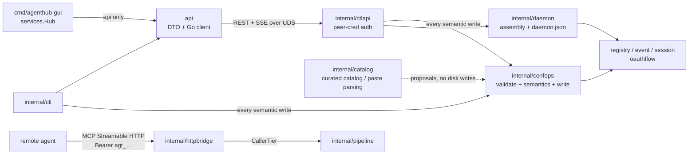

# Control Plane and Frontends

This layer answers "how do people and UIs manage this machine". The data plane (gateway, pipeline,
downstream connections) lives elsewhere; the packages here expose the daemon's state and governance
actions as a stable local API, wrap it in two peer frontends (CLI and GUI), and hold the compile-time
constraint that "the GUI may be entirely absent".

Per-package responsibilities are in [architecture.md §3](../architecture.md#3-core-module-map); what
matters for the shape below is that `internal/confops` is **the only implementation of semantic writes**
and both frontends call it, `internal/catalog` produces **proposals** and never writes to disk, and
`internal/httpbridge` shares a process with the control plane but not its authentication model.



Two things every package below depends on. **SSE events are notifications, not snapshots**: every frame
says only "something changed", and consumers re-read state and adopt it by "the generation I read ≥ the
generation I already applied", never by "equals the Rev in the event" — which is what makes dropped
frames tolerable. **The event log is a different thing wearing a similar name**: `GET /v1/events/log` and
`agenthub events` read a durable record in a closed vocabulary of kinds a consumer may switch on
([foundation.md](foundation.md) owns it). The stream answers "something changed just now", the log
answers "what happened to this server". Do not merge them.

---

## api

**Responsibility**: the control plane's public contract — wire DTOs, error codes, SSE topic names, and a
Go client depending only on the standard library.

`Client` (`New`, `Default`, `DialOrStart`) dials the socket through a `unix` dialer with a fake
`http://agenthub` host, and every capability hangs off a typed resource service. **There is no raw
request escape hatch** — deliberately: anything a frontend can do corresponds to an endpoint, and
therefore to something the CLI can do too, so "the GUI is optional" is structural rather than a promise.
`ComputeHealth`'s input constants are frozen here, and `healthgen` generates the GUI's TypeScript
constants from this package's source.

**Two start paths, differing in ownership rather than mechanism.** `DialOrStart` dials, and on failure
execs `agenthub daemon start` and polls `run/daemon.json`; a child that exits before becoming ready
returns its real error plus a stderr tail rather than a timeout (the `desktop.rs` lesson). It names no
owner, so under the admission rule it starts a daemon only for a caller that asks explicitly through
`DaemonArgs`. `StartSupervised` — the desktop application's path — runs `daemon start --foreground` as a
**direct child**, so death arrives through `cmd.Wait` rather than at the next call and `Stop` signals a
pid from the process handle rather than from a file that outlives an abrupt death, and it appends the
owner handshake (`--owner-pid`, `--owner-lifeline-fd`). A daemon already serving is **refused**
(`ErrDaemonNotOurs`), never adopted: a hub this process did not start is not a hub it may stop. On
Windows there is no lifeline and `Stop` kills rather than asks ([windows.md](../windows.md)).

### Invariants and failure directions

**Never imports `internal/*`, and never `go get`s a third party** (canonical.md §2 rule 1, enforced by
depguard). The cost is that `paths.go` reimplements `internal/platform`'s socket path resolution; the
compensation is a contract test (`internal/ctlapi/paths_contract_test.go`, on the ctlapi side because
only it can import both) asserting the two agree in every environment.

**The decode failure direction is fail-closed.** `decodeEnvelope` succeeds only on a positively
identified success envelope — within the 16 MiB limit, deserializable, `ok:true`, status < 400, `data`
non-empty and decodable — and anything else is an `*Error` with the synthesized code `E_BAD_RESPONSE`, so
a truncated body is never success. Server error bodies pass through verbatim.

**`X-Request-Id` is generated per request**, overridable with `WithRequestID` to propagate across
processes, and carried into error bodies.

**A conflict's recovery is "retry at `CurrentGeneration`", and re-reading first is not interchangeable
with it.** `ConflictError.CurrentGeneration` comes from the write path, which compares inside the
registry lock, so it is authoritative the moment it is handed back. A GET does not have that property:
the daemon answers reads from a snapshot its registry watcher refreshes asynchronously, so for roughly
two hundred milliseconds after an OUTSIDE writer — the CLI, which writes the files directly and sends no
precondition — a re-read still reports the superseded generation, and a retry at it earns a second
conflict. Measured while writing `test/e2e/apiwrite_test.go`; the number is the watcher's latency, not a
constant anything guarantees. A caller that must re-read — a wholesale `Update`, whose body depends on
the entry it read — therefore needs backoff and must not treat one repeat as a failure. A single-key
write such as `SetEnabled` should use the reported generation and not re-read at all.

**SSE consumption is tolerant.** `Subscribe` establishes the first connection synchronously, so the
caller learns immediately whether the daemon is up, then maintains it with backoff and `Last-Event-ID`
resumption; the channel closes only when the ctx ends, so falling out of a `range` means "the
subscription ended", and an unparseable frame is skipped rather than fatal.

**The topic set is closed, and retiring one is a breaking change on both sides.** The daemon answers an
unlisted topic with a **400 on the subscribe request**, not an empty stream, so a constant left standing
after the daemon stopped serving it takes the whole subscription down and every other topic with it —
which is what a retired `TopicApprovals` did to the GUI. `TestAPITopicsMatchTheServedSet`
(`internal/ctlapi`) pins the two lists together.

`sseParser` implements the WHATWG spec, and an incomplete trailing line is discarded rather than
delivered as a truncated event.

---

## internal/ctlapi

**Responsibility**: the control plane server — the daemon's state and the configuration write surface
over REST + SSE on a Unix domain socket only this user can connect to.

`Registry`, `Sessions` and `Bus` are required in `Options`; every other collaborator is optional, and an
absent one disables its routes into the uniform 404 rather than half-serving them. Routing is a
**hand-written switch**, not `http.ServeMux`, because ServeMux's own 405s and 301s leak whether a route
exists while hand-written dispatch makes every miss — unknown path, wrong method, unknown id — land in
the same `writeNotFound`. The table lives in `server.go` and `nonreg.go` (`grep '"/v1/'`).

### Rules the routing surface imposes on both frontends

Paths are `/v1/<resource>` with the id last, and every write accepts a `Precondition` and answers **409 +
the current generation** on conflict.

- **Credentials are never echoed back.** Reading a secret returns `{server, key, backend, set: true}` —
  no value field; it isn't "left blank", it **doesn't exist in the type**.
- **An agent token's plaintext appears exactly once**, in the creation response.
- **No polling after a write.** A write bumps the generation, the watcher publishes on the bus, the
  control plane pushes over SSE — so a frontend's own write and someone else's behave identically.

#### The one long-running exchange: an interactive login

`POST /v1/auth/{server}/login` → `GET /v1/logins/{id}` → `DELETE /v1/logins/{id}` (`nonreglogin.go`,
driven by `internal/oauthlogin`). This **reverses a decision once recorded in `api/auth.go`** ("an
interactive login is NOT on this API"), which had left every graphical frontend answering a server that
needs authorization with a dialog telling the user to go run a terminal command. It is affordable because
it is **not a second code path**: the daemon drives the same `oauthflow.Flow` the CLI drives, and only
the session bookkeeping is new. Four properties it must keep:

- **Start answers 202 before there is anything to show**, because choosing between the device and
  loopback flows needs the authorization server's metadata and waiting for it puts a discovery timeout
  inside a button press. `mode` empty on the first poll is a real state, not a missing field.
- **The CALLER opens the browser, and it must be the host browser.** The daemon returns
  `authorization_url` and never visits it — it may be headless and may not be where the user is — and an
  authorization page inside the application's own webview is agenthub asking for a provider password in
  a window agenthub controls.
- **A failed session is a 200** carrying `phase: "failed"` and `oauthflow`'s own hint: the read
  succeeded, and what failed is the thing it describes. Only an unknown id is a 404, and a finished
  session stays readable for a retention window.
- **The loopback SSRF carve-out follows the stored entry's provenance**, exactly as `auth login` does;
  no request field can ask for it.

A second login for a server that already has one **joins the first**, because two concurrent flows would
each bind a loopback port and race the same vault entry, leaving the loser's consent screen calling back
into nothing. The wire carries `user_code` and never the device code, an authorization code or a token,
and the test asserts on the **key set**, so it fails when a field is added rather than when a particular
string leaks.

### Invariants and failure directions

**Two authentication gates, both mandatory.** The socket's directory is 0700 and the socket is chmod 0600
after bind (the gap between the two is covered by the directory and the second gate); peer credentials
(`SO_PEERCRED` / `LOCAL_PEERCRED`) compare the peer's uid against this process's, with **no privileged
bypass — root is rejected too**. Any failure to obtain credentials is treated as a hostile peer: close
and keep accepting, so one malicious dialer cannot wedge the control plane. **On a platform with no
peer-cred implementation `Listen` fails outright** rather than listening first and worrying later.

**A stale socket is removed only once proven unserved.** `removeStaleSocket` lstats first (a non-socket
is never deleted), then dials; **a successful dial means a live daemon** (`ErrAlreadyRunning`), and only
a failed dial leads to removal.

**`X-Request-Id` is set before the handler runs.** The incoming id is validated
(`^[A-Za-z0-9._-]{1,128}$`, anything else replaced and never echoed back as attacker-controlled text) and
the header set early, because `WriteHeader` snapshots the header map — so the id is present on success,
on failure, and after panic recovery. Panic recovery splits two ways: response not started → a 500
envelope; already started, mid-SSE-stream say → `panic(http.ErrAbortHandler)` and drop the connection,
never garbage after half a body, which would parse as a truncated success.

**There is no control-plane/config-write audit trail**, and it is recorded here because the tree once
read as though there were: six comment sites asserted it while nothing wrote a record and neither cited
route was served. **A governance write leaves no evidence beyond the daemon's own log**, so "who relaxed
this switch, and when" is not answerable after the fact; `internal/calllog` covers data-plane calls
only. `TestNoCodeClaimsAnAuditTrailThatDoesNotExist` (`test/buildrules`) keeps the claim from coming
back, because a reviewer reads the comment and concludes the control is in place.

**The 404 text is unified and frozen byte for byte** (`notFoundMessage = "not found"`): unknown routes,
sessions and tokens share one `(code, message, hint)`, differing only in request id. **Path matching runs
on EscapedPath**, rejects segments containing `/`, and unescapes only the single segment, so an id
containing `%2F` cannot smuggle in extra path segments.

**Health is a seven-rung priority ladder, returning on the first hit**:

```mermaid
flowchart TD
    A["1. AdminState<br/>disabled"] -->|"no hit"| B["2. missing secret"]
    A -->|"hit"| A1["level=healthy<br/>(deliberately off ≠ broken)"]
    B -->|"no hit"| C["3. OAuth misconfiguration"]
    B -->|"hit"| B1["unhealthy + set_secret"]
    C -->|"no hit"| D["4. connection state"]
    C -->|"hit"| C1["unhealthy + login"]
    D -->|"handshake 401 / 403"| D0["unhealthy + login"]
    D -->|"error / disconnected"| D1["unhealthy + restart"]
    D -->|"connecting"| D2["degraded (no action)"]
    D -->|"unrecognized value"| D3["unhealthy + view_logs<br/>(surface it rather than guess green)"]
    D -->|"connected / unknown"| E["5. OAuth failure at call time"]
    E -->|"hit"| E1["degraded + login"]
    E -->|"no hit"| F["6. token state"]
    F -->|"expired"| F1["unhealthy + login"]
    F -->|"expiring"| F2["degraded + login"]
    F -->|"ok"| G["7. healthy"]
    G -->|"conn = connected"| G1["healthy / \"ok\""]
    G -->|"conn = unknown"| G2["healthy / \"not observed\"<br/>(nobody is watching, not nothing is wrong)"]
```

The frontend renders this and must not re-derive it from other fields. Four rungs are placed rather than
convenient: `disabled` **keeps `level=healthy`**, because turning something off on purpose is not a
fault; an unrecognized connection state **fails toward visibility** (unhealthy + view_logs); the
handshake-auth branch is driven only by a **typed** 401/403 the gateway retained from the failed attempt,
never by searching error text and never persisted as `needsAuth`, and it outranks the generic
connection-error branch because restarting cannot repair it; and on rung 7 `unknown` means **no gateway
currently holds a connection** — a fact about the observer, not the server — so `level` stays healthy
while `summary` becomes `"not observed"`. On rung 4 `unknown` falls through with `connected`, because a
server nobody is using whose token has expired must still report `token expired`.

**Push and pull share one payload.** `serverList()` feeds both `GET /v1/servers` and the `servers` SSE
frames, so either is authoritative.

**Three SSE delivery strategies.** `servers` goes through a 50ms coalescer with a **lazily built** payload
(K bus events become one frame, the list marshaled once); scan-type topics (currently only `skills`)
through a 750ms settler that compresses a started/progress/finished lifecycle into one `settled` frame;
everything else passes event by event, because a session opening and a session closing are two distinct
facts. Each connection has a 32-frame queue and **drops frames on overflow**, since consumers already
have to recover by re-reading and blocking the coalescer's timer is never acceptable.

**Last-Event-ID is best-effort, not a replayable log.** An id older than the current global sequence, or
unparseable, gets **no history replay** — the server sends one `sync` frame per subscribed stateful topic
instead. An unknown `?topics=` value is a 400, never a silent empty stream.

**The gateway link is one-way**: it notifies, and the gateway re-reads the registry itself rather than
trusting the frame. There used to be an ack protocol, because the daemon pushed authoritative scope
overlays; with nothing to push there is nothing to correlate, so `GatewayAck`, the pending table and the
ack endpoint went with the overlays. The link is single-use (a second attach is 409), a session that has
not attached within 30s is reaped by a watchdog — stdio sessions are otherwise not TTL-reaped, or a crash
between register and link would leak one forever — and when the link drops the session closes.

### The two faces of the handler set

**The configuration face (`admin*.go`)** is the control plane's half of "one layer of semantics, two
frontends": the CLI calls `internal/confops` in-process, the GUI goes through these routes, both land on
the same implementation. `GET|PUT /v1/scope/{client}` handles the only thing a client entry holds —
which profile it is on — and there is **no session-scope endpoint**, because a live session carries no
scope of its own; `/v1/sessions/` serves listing and `POST /v1/sessions/{id}/kill` and nothing else. The
retired `servers` / `tools` / `discovery` fields are still **declared** on that wire type so a request
carrying one gets a **400 naming the field**: a caller sending `servers` was asking to *narrow*, so
accepting while dropping that half would report success for a **wider** surface than requested.

**The non-registry face (`nonreg*.go`)** is the half that does not land on the config registry:
credentials, skills, agent tokens, client adapters, the OAuth lifecycle, the event log, and live
self-tests. Rules visible only here:

- **Verifying that a credential works is `POST /v1/servers/{id}/test`**, not part of the secrets face. A
  typed downstream 401/403 returns `E_AUTH_REQUIRED` and an unresolved placeholder returns
  `E_SECRET_REQUIRED` plus safe `missingSecrets` key names, so a frontend can offer a login or a
  prefilled write-only form without scraping prose. The probe **runs a docker-runtime entry as a
  container**; it used to refuse such entries fail-closed, back when the dial could not.
- **The rendered call output is bounded, and the bound is the caller's to raise** (`max_text_bytes`,
  default 2 KiB, clamped at 1 MiB). The small default belongs to the question this endpoint is asked
  most often — "does this connect" — which should not carry a tool's whole answer back; a caller
  rendering that answer for a person needs the opposite and has no other way to say so. **This cut is
  final**, unlike the data plane's result budget, which retains the remainder under a `fetch_result`
  cursor — which is the other half of why it must not be tight, and why an over-large ask is *clamped
  to the ceiling* rather than dropped back to the default. It cuts on a **rune boundary**: a byte cut
  through a multi-byte rune renders as U+FFFD, which reads as something the tool emitted. That a cut
  happened is the `truncated` **field**, never the trailer in the text — a frontend explaining why a
  JSON result will not pretty-print must not be deciding that by matching prose a tool could have
  written itself.
- `POST /v1/clients/{id}/connect` may **run that client's own configuration CLI** for a format agenthub
  will not rewrite (codex), backing the file up first and verifying by re-reading it, with
  `AGENTHUB_NO_CLIENT_CLI=1` to forbid it. The target resolves `path` > `placement` > the default
  user-level file, and a client lacking that placement gets a 400 rather than a rewrite elsewhere.
- **`GET /v1/clients` stats and never opens a file** — one macOS privacy prompt per client per page load
  is worse than no listing — so "is agenthub wired into this one?" is `GET /v1/clients/{id}/inspect`, one
  client named by the caller, which makes the prompt belong to a click. One unreadable location does not
  fail that request: it is reported beside the ones that read fine and forces `denied` rather than
  `not_connected`. The listing reports **both** every known client and the subset agenthub will not write
  itself, separately, because the first answers "why is my client missing" and cannot be filtered down.
- `PATCH /v1/skills/{id}` exposes **only** the coarse library-level switch, and
  `POST /v1/parse/client-config` is read-only.
- `GET /v1/events/log` exists **for the GUI**, which may not import `internal/*` and so cannot read the
  file; the CLI reads it directly and works with no daemon. Scope and kind validation comes from
  `internal/eventlog` rather than a local copy — a hand-written list here can be wrong while the CLI's is
  right, which is how this route once hinted a stale set of scopes.

- `GET /v1/logs` serves the PROCESS logs for the same reason, and is the newest of the three: those
  files were terminal-only, so the window could not show the half of the record that explains a
  downstream failure — the daemon never dials one, and the gateway that does writes to its own file.
  The reading is `internal/proclog`, shared with the CLI so the two cannot answer differently.

**All three collections page the same way** (`pagecursor.go`): rows newest first, and a cursor naming
the last row served rather than an offset. With an offset, records arriving between two requests make
page two repeat rows page one already showed — a failure a reader blames on the hub rather than on the
pager. A cursor cannot: a fresh record is newer than every cursor, so it can only appear on page one.

The call ledger enters this face with one deliberate split. `GET /v1/calls` and `/v1/calls/stats` read
metadata only and never return payload references or event error strings. `GET /v1/calls/{id}` is the
explicit single-call disclosure: it resolves key ids in the vault and returns Request, Effective
arguments, Result and the frame bodies with `Cache-Control: no-store`, each capped to a 512 KiB preview
that says when it truncated. Status and metadata need only a ledger root, while detail, verification,
enablement and rotation additionally require the key vault, and a missing collaborator keeps those
routes uniformly unavailable rather than guessing a directory or key source. `PUT /v1/calls/enabled`
and `POST /v1/calls/rotate-key` are ordinary registry writes with the same generation precondition; key
bytes are persisted before the registry points at their public id and never cross the wire.

**What a call REACHED is derived once, in `calllog.TargetServer` / `TargetTool`, and this face is the
only one that publishes it.** `/v1/calls/stats` counts those two, `/v1/calls` filters on them and
every row carries them beside the routed `server` / `tool`, so an option a dropdown offers always
selects the rows a reader sees under that name. Counting the routed fields alone is what this
replaced, and it made every call agenthub answers itself — a meta-tool, a grouped listing, any method
that is not a `tools/call` — visible in the list and unselectable by any filter. Those group under
the `(agenthub)` sentinel; empty stays reserved for a `tools/call` that resolved to no server.

---

## internal/confops

**Responsibility**: the single implementation of **every semantic write** against the config registry.

The CLI and the control plane are two frontends over one configuration, and if each assembled its own
answer to "what does renaming a profile mean" the two would eventually differ. There is precedent:
`SpecFromEntry`'s comment claimed to be the sole translation point while the gateway hand-rolled a second
Spec, and **container isolation was silently dropped as a result**. So frontends own flag parsing,
rendering and transport, and **own no rules**; a parity test asserts both paths produce **byte-identical**
registry documents for the same operation.

**The API's shape is operations, not field setters.** `RenameProfile` also repoints every client binding
referencing it, because leaving them would **fail-close those clients into an empty scope** — a
consequence belonging to the operation rather than to its caller. The governance key table likewise has
exactly one home here, holding everything global that is **not** a scope decision, including the daemon's
own HTTP listener (`http.addr`, `http.allowRemote`, `http.insecureLoopback`), which became storable
because the desktop application that now starts hubs types no flags. **Storing an answer does not lower
the bar for it**: a non-loopback address still needs its own confirmation, the credential-less endpoint
still needs `insecureLoopback`, and the address is validated as a bindable `host:port` at write time. The
command line is the more specific statement and **replaces the stored set as a whole** whenever any of
the three flags is given (`daemon.resolveHTTPFace`) — merging would let a confirmation stored months ago
for one address authorise a different one named today.

Those three keys are the one family a **reduced (release) `config ls` leaves out** (`withheldKeyPrefix`,
`internal/cli/config.go`), in both output modes, for the same reason the Daemon group is withheld: they
configure a face that only exists while a daemon runs, and a page that recommends binding it while
withholding every command that starts, inspects or credentials it names a switch with no path around it.
The decision lives in the CLI rather than in the key table, because it is about what one front end
teaches — the GUI reads the same table through `GET /v1/config` and keeps listing all three, which is how
a hub with no command line gets an address at all. **Withholding is not disabling**, exactly as for a
withheld command: `config get http.addr` and `config set http.addr` answer in a release build, and the
daemon honours whatever is stored.

### Invariants and failure directions

**Every operation is three steps in an order that cannot change**: validate the arguments (rejection
before anything is opened) → mutate inside `registry.Store.Update` (cross-process lock, against a
document just re-read from disk) → return a `Result` carrying the post-commit generation. **The
precondition comparison happens inside that lock and before the mutation**, so there is no window between
comparing and writing; `Precondition{}` means no check, which is what the CLI's non-interactive path uses.

**Operations whose subject isn't the registry can only do weak checks.** Such a store has its own lock and
the registry's generation can advance between comparison and write, so `checkSnapshot` is **advisory**: it
catches "the operator's view is stale", not "nothing moved under my feet".

**Validation rejects rather than normalizes** — an unknown transport or runtime leaves the registry
untouched rather than landing on a default nobody asked for. **`Changed` is derived from the generation**,
not from the operation diffing itself, so writing the same value twice reports `Changed == false`.

**Raised and not reproduced (security sweep) — the legacy active-profile marker, twice.** Both findings
concern `MigrateActiveProfile` (`profile.go`) and the pre-migration `<state>/active-profile.json`: that
the migration runs only from the CLI's write path (`App.opsStore`, `internal/cli/confops.go`), so a daemon
or GUI start on an upgraded installation would read an empty `governance.activeProfile` and hand
follow-active clients the unrestricted server set; and that a truncated marker takes the same branch as a
deliberately cleared one — deleted, no error, scopes resolving as unrestricted. Both are sound and
**neither has a population**: no released build ever wrote that file (the sole writer is the test fixture
`writeActiveProfile`), and every tag carries the read-and-retire form. The CLI-only placement is pinned by
`TestDoctorIsReadOnly`; moving it into daemon startup would add a registry write and a lock acquisition to
every start for zero installations, and erroring on a corrupt marker would make every CLI write fail hard
with no self-healing path. **If a future version ever writes this file again, both findings become live.**

---

## internal/catalog

**Responsibility**: answer the question a config table cannot — "what can I add next, and what does it
cost". Two routes to a proposed server definition, and **neither writes to disk**: the curated catalog
(`catalog.go` + embedded `seed.json`) and paste parsing (`paste.go`). `internal/confops` remains the only
implementation of every registry write, so a catalog entry gets exactly the same scrutiny as a hand-typed
one.

### Invariants and failure directions

**Provenance is a source signal, not a cryptographic proof.** Curated means a maintainer believed that
command line is the one in the publisher's docs; **it does not mean the code that ends up running is the
code they read** — nothing is signed, nothing is verified at add time, and `npx -y <package>` still pulls
whatever the repository serves at that moment. The defenses that make assertions about running code live
elsewhere (`internal/guard/spawnguard` screens what gets spawned).

**`needsConfig` is the test for "can this be one-click"**: declared credentials, declared parameters, or
unsubstituted placeholders anywhere in the command line/URL/environment/headers. **Unsubstituted
placeholders are a refusal, never a literal `{{directory}}` written through** — a server that fails at
connect time because of a path nobody typed is far harder to explain than a refusal at add time.

**The two routes treat an unknown field differently, deliberately**: a **warning** on the paste route, a
**hard error** on `server add --stdin`. The preview shows verbatim what is about to be stored, so "these
keys were ignored" is actionable; a write with no preview can only refuse, or the user never learns that
the `oauth` block they pasted vanished.

**Wrapper key paths come from `internal/clients`**, the same table that decides where each client's
servers live, so adding one client row extends this parser for free.

**Raised and not reproduced (security sweep):** that `decodeAdminBody` uses `json.Unmarshal`, so a
misspelled narrowing key is dropped and the write succeeds at the *wider* setting. The reasoning
generalises from the `nil` vs `[]` rule, but **no route actually permits the widening**:
`scopeBindingWire` declares the retired keys precisely so `retiredField()` can answer 400 by name,
`handleProfilePatch` refuses anything but exactly one op, and `serverSetMode` / `toolSelectMode` map an
unrecognised spelling to UNSET rather than to a permissive default. The one field genuinely ignored in
silence is inside `PATCH /v1/servers/{id}`'s partial entry, where absent already means "keep the stored
value" and the merged entry is echoed back. A blanket `DisallowUnknownFields` was written and
**reverted**: it would 400 bodies that work today (precondition keys ride in the body while belonging to
no handler's wire type) and would replace the specific retired-field hint with a generic decode error.

---

## internal/daemon

**Responsibility**: assemble everything the control plane needs and run it as a process — no business
logic, only assembly order, the readiness handshake and graceful shutdown. `Run(ctx, Config) error` is
the only entry point; every `Config` field has a production default and exists for CLI and test injection.

### Invariants and failure directions

**`daemon.json` is written only after a successful bind**, so a well-formed file always describes an
endpoint that was alive when it was written — replacing the TOCTOU-prone "probe the port then spawn". The
write is temp file + chmod 0600 + rename, so readers see the old file or a complete new one.

**Dependencies, and the failure direction of each.** A registry that won't open is fatal — the daemon *is*
the coordination plane, unlike a gateway which can serve the data plane while impaired — but a document
that was quarantined and self-healed is only a warning, a JSON log file that won't open degrades to plain
text, and a registry watch that can't be established degrades to seeing changes on the next explicit
reload. **The non-registry collaborators are all optional**: credentials, skills, agent tokens, client
adapters, OAuth state, the audit root/key reader and the event log each log and continue.

**Graceful shutdown has three phases, and the first is what makes the second work.** `CloseStreams()` ends
every long-lived SSE handler, then `Shutdown(grace)` drains, and only then does `Close()` force the rest;
internal goroutines run on a **separate background ctx** so they survive the drain. **`CloseStreams` is
not an optimization**: `http.Server.Shutdown` waits for handlers to return and never cancels their request
contexts, while both long-lived handlers — each stdio gateway's `/v1/gateway/{sid}/link` and whoever holds
`/v1/events` — are parked until their client hangs up, so without it every stop spends the whole grace and
then force-closes precisely the connections it spent it waiting for. Two streams need two doors, because
`/v1/events` belongs to no link. `TestGracefulStopDrainsWithAGatewayAttached` pins it at the production
grace.

**The stdio gateway depends on nothing here.** A dead daemon, even `kill -9`, costs only coordination —
session list, event stream, centralized refresh — because a stdio gateway's scope comes entirely from the
registry files; it re-registers with backoff.

**A daemon does not outlive its owner, and does not trust the owner to say so.** `Config.Owner` names the
application process it belongs to, and the zero value is a **headless** daemon that stops only when an
operator stops it. An owned daemon arms two watches before it opens anything (`owner.go`), so an owner
dying during a slow startup is noticed too. The **lifeline** is the read end of a pipe the owner holds and
never writes to: the kernel closes it however the owner dies, the read returns EOF in microseconds, and a
recycled pid cannot fool it; it does not exist on Windows, where `os/exec` cannot hand a child an extra
descriptor. The **poll** (`platform.ProcessAlive`) is the backstop, and its failure direction is
load-bearing: it answers "alive", "not alive" and **"cannot tell"** separately, and only a definitive "not
alive" stops the daemon — a hub that outlives its owner is recovered by the next launch, while a hub that
shuts down under a live owner cuts off every connected client to fix nothing. Either watch routes into
ordinary ctx cancellation, the same path a SIGTERM takes, with `errOwnerGone` as the cause.

**The registry watch's adoption test is monotonic.** A watch event is only a notification; the daemon
re-`Reload`s and uses `registry.Applier` to adopt by "the generation I read ≥ the one I already applied",
and only then publishes `ctlapi.TopicRegistry` (forwarded to every gateway link) and `server.registry`
(driving the frontend's `servers` topic). A failed reload keeps the old snapshot.

**Three decisions about proactive OAuth refresh** (the file comment gives the seemingly-obvious wrong
alternative for each):

1. Use `oauthflow.Coordinator`'s **offline path** (a sibling `<server>.refresh.lock` plus re-reading
   `expires_at` after acquiring it), not the online path with only in-process singleflight, which holds
   only if the daemon is the sole vault writer — and `agenthub auth login/refresh` writes it directly. A
   redundant lock costs one syscall; a missing one spends a one-time refresh token twice.
2. Keep the in-process singleflight on top, so a future control plane `auth refresh` RPC hits the same
   gate instead of racing the timer.
3. **A token with no expiry is never proactively refreshed** — "no `expires_in`" means "never expires",
   and such servers are covered by `internal/downstream`'s passive 401/403 path.

The backoff ladder (`oauthflow.RetryBackoff`, shared with the gateway's refresher so the two cannot drift)
retries flat at 15s for the first `oauthflow.FastRetries` failures, then takes the slow OAuth ladder;
`ErrNoRefreshToken`/`ErrNoState` jump straight to the slowest rung, since only `agenthub auth login` can
fix those. `backoffState` records the `expires_at` observed at failure time, so a newer expiry in the
vault voids the suppression window immediately, and backoff **only queries once the token has actually
expired** — a suppression window can lower the attempt frequency but never mask that renewal is needed.

**The crash marker is armed after a successful bind and resolved only on the graceful shutdown branch**,
so an abrupt death leaves it armed and the next start can tell a crash from a clean exit.

**What the runtime state source is wired to**: one `ctlapi.NewGatewayStates()` injected as both
`Options.States` (read) and `Options.ServerReports` (write). The daemon **connects to no downstream while
the data plane is off** — it has no data plane then — so the stdio gateways that hold the connections
report state over the control connection and the daemon only aggregates. Standing up a second set of
downstream processes just to display a status dot (a resident child per stdio server, doubled OAuth and
quotas for remote ones, secret resolution and netguard reassembled inside the daemon) is not a worthwhile
trade. Those reports keep handshake authentication refusals distinct from generic dial failures, so a
downstream 401/403 produces the `login` action rather than the misleading `restart`. The desktop Servers
page deliberately does not present this aggregate as its own diagnosis — it runs the per-server self-test
and keeps those observations locally — so one client's broken gateway cannot repaint that page's probe.

---

## internal/httpbridge

**Responsibility**: the daemon's **data plane** exposure — the MCP Streamable HTTP entry point, the
ingress hard limits guarding it, and the tiered agent token credential layer.

It is deliberately **not** the control plane: management traffic goes over the UDS socket, where identity
is an OS peer credential and no tokens exist. `Server` answers three verbs on one path — POST for one
JSON-RPC message in and out, DELETE to terminate a session, and **GET for the ≤ 2025-11-25 notification
stream** (a GET that does not ask for `text/event-stream` is still a 405). `Dispatcher` is the only
seam to the MCP logic behind it, so this package owns one thing without growing a second gate chain.

### Invariants and failure directions

**Binding is itself an authorization decision.** A listener with no admin token, no active agent token
and no registered clients would treat every local process as a legitimate agent, so `AuthorizeBind`
**refuses** to create it (inherited from toolport's `http_bind_is_authorized`). `--insecure-loopback` is
the only escape hatch and is narrower than its name: **a non-loopback address always requires a token**,
and the "registered clients" path authorizes a loopback bind only, because entries in `clients.json` are
configuration, not credentials. `AddrIsLoopback` fails toward false — an empty host (`:8080`), a hostname
or an unresolvable address is **not** loopback — because it grants a weaker authorization, so it must be
the predicate that is false when it cannot prove otherwise; it is **exported** so the assembler decides
the same question with the same code.

**The escape hatch is judged before anything can authorize the bind, and refused rather than ignored.** It
used to live only in the last-resort branch of the switch, so a configured token returned first and
`--http-addr 0.0.0.0:7777 --http-allow-remote --insecure-loopback` never looked at the flag — while
passing it to the `Authenticator`, which answered **every unauthenticated LAN request at the destructive
tier**. Refusing to start rather than dropping the flag is the "delivered or refused" rule.

**The channel is not encrypted, and a non-loopback bind is told so.** This package terminates no TLS, so
the credential everything above insists on crosses the network in the clear along with every call and
result. **Terminating TLS is deliberately out of scope** — certificate material, rotation and trust
configuration are a feature with their own argument, and the deployment answer is a terminating proxy —
but silence was not acceptable either, so `BindDecision.Cleartext` is set on every non-loopback bind and
the daemon logs it at WARN. Loopback binds are not warned, because a warning on every ordinary start is
one nobody reads. `TestNonLoopbackBindIsToldItIsUnencrypted` is where this is written down.

**`Authenticate` re-checks the peer, and `peerIsLoopback` fails toward false.** The no-credential path
requires *both* `InsecureLoopback` and a loopback `RemoteAddr`, and the duplication is deliberate:
`InsecureLoopback` arrives as a bare bool carrying no evidence of the address the listener actually got,
which is exactly how the bug above stayed invisible from inside this package. `RemoteAddr` is the kernel's
view, never a header — **no `X-Forwarded-For` handling belongs here**, since this package binds TCP itself
and is never fronted by a proxy.

**A browser Origin must be a provably loopback authority, not merely equal to `Host`.** **Equality is the
one relation DNS rebinding preserves**: a rebound page sends both headers as `evil.example:7777`, they
compare equal, and `Sec-Fetch-Site` reads `same-origin`. Both authorities now have to pass
`AddrIsLoopback`, false for anything it cannot prove (`127.0.0.1.nip.io`, `localhost.evil.example`, an
unparsable authority), and the check runs before authentication. `Sec-Fetch-Site` is the second
browser-facing gate — set by the browser, unforgeable by page scripts, absent on non-browser clients.
**The CORS invariant: this server never echoes an Origin and never emits `Access-Control-Allow-*`**,
because no browser client needs enabling and the only effect would be to let a page read tool results.

**The per-request ordering invariant: ingress limits → authentication → session binding → dispatch.**
Every level is fail-closed and every rejection distinguishable (413/401/403/404/503/500), so an operator
reading access logs can tell "body too large" from "token revoked" from "someone else's session".
**Rate limiting happens before authentication**, because the point of an in-flight cap is to limit the
work an unauthenticated caller can induce, and over the limit is a 503 shed rather than queuing — queuing
behind a saturated downstream pool turns a slow server into an unbounded memory sink.

**A notification stream holds a SECOND quota, and giving it one did not loosen the first.** `MaxInFlight`
bounds *work an unauthenticated caller can induce*, and every request it covers is short by construction.
An open stream is the opposite on both counts: it is reachable only *after* authentication, it performs no
work once open, and it stays open for hours. Counted against `MaxInFlight`, idle streams would eat that
ceiling while doing nothing with it — 64 would hold a quarter of it and 256 would close the data plane to
everyone — so it would be enforcing the wrong thing, loudly. A stream therefore takes `MaxStreams` (64,
below `MaxSessions` because an open response costs more than a table entry, and a client needs at most one
stream per session) and **hands its in-flight slot back** before parking; the handback is a `slot` whose
release is idempotent, so the handler's `defer` is correct either way. What must never be done is let a
stream park while still holding an in-flight slot.

Both quotas shed with 503 rather than queue, for the reason above — but **a stream that could not be
opened at all is 500 `internal`, not 503.** A gateway that would not assemble and an exhausted quota send
an operator to different places (the logs, versus back in a minute), and the ordering invariant above
requires every rejection on this path to be distinguishable; reporting a broken assembly as `overloaded`
was the one reading that sends nobody to look at it.

**Ingress hard limits** (header size, header read deadline, body size, body read deadline, concurrency)
are constants in `ingress.go`. The two header limits **cannot be enforced inside the handler**, since by
then the headers are read, so they are `http.Server` fields reachable only through `Server.HTTPServer()`;
an assembly that mounts `Handler()` bare is choosing to serve without a header-size limit or a head read
deadline, and that comment now says so instead of inviting it. The body read deadline is per request via
`ResponseController`, because a server-level `ReadTimeout` would also limit long-lived connections.

**Only Streamable HTTP is exposed, and its GET stream is part of it.** canonical.md §5b freezes one
asymmetry and no longer freezes another. Still frozen (ruling #29): legacy HTTP+SSE — the 2024-11-05
two-endpoint binding with its `endpoint` event — is a **read-side transport only**, and this face never
offers it. No longer frozen: the stance that neither generation would get an out-of-band notification
stream here. `GET` now opens streamable HTTP's own server→client channel (`stream.go`), because nothing
else can tell a client over this face that its tool set moved — catalog refresh is driven entirely by
`tools/list_changed`, and the capability declaration this face makes has always promised one.

**The stream's lifetime crosses three owners, and each had to be taught about it.** The session TTL
advances in `sessions.get`, on the way past an incoming request — and a client being *pushed* to sends
none, so `sessions.touch` refreshes it from the stream itself. The daemon's per-credential gateway is
reaped after `httpConnIdle` on the same "no requests" evidence, so `httpPlane` counts open streams
(`httpConn.subs`) and the sweep skips a pinned connection. And the SSE keep-alive is not decoration:
it is what stops an idle NAT or proxy from reaping the connection, and it is the only way this side
**learns** the peer is gone, since without traffic there is no write to fail.

**Token shape and storage.** `agt_` plus 64 hex characters, and **dispatch is by prefix and mutually
exclusive in both directions**: `agt_` is only ever looked up in the store, everything else only ever
compared against the admin token — without that, a caller could probe the store with admin-shaped
candidates, and an admin token beginning with the agent prefix would become unusable. Stored is only
`hex(HMAC-SHA256(key, plaintext))`, HMAC rather than bare SHA-256 to defeat offline cracking, and the key
file is a dotfile **beside rather than inside** the token list, so copying `tokens.json` into a bug report
does not hand over verification capability. **A corrupt key file is a hard error**: regenerating it would
silently invalidate every issued token. First creation uses `O_EXCL`, and the loser of a race reads the
winner's key.

**Lookup is an authentication face that is not an oracle.** Unknown, revoked and expired return the same
`ok=false` and the same 401, and comparison walks the whole table with `hmac.Equal` **without
short-circuiting**. `Token.Active` folds tier legality into "active": a tier this binary does not
recognize (hand-edited file, downgrade after a new tier landed) is rejected rather than defaulted.

**The nil/empty tri-state.** A nil `Token.Servers` means "no restriction, allow all"; a non-nil empty
slice means "allow nothing". Hence serialization **without `omitempty`** — the same tri-state as the
registry's `ToolSelector`.

**The store's concurrency discipline.** Uniqueness and the `MaxTokens` cap are checked **inside** the flock
transaction, against the list it is about to write back, since checking a snapshot read outside would let
two concurrent `token create` calls both win. Write-back is temp file → chmod 0600 → write → fsync →
rename → fsync parent. A missing file is an empty store, but **a malformed file is an error**: treating a
corrupt credential store as "no tokens" would make bind authorization fail open. `MaxTokens = 64` is
governance protection, not resource protection — an unbounded credential list is a list nobody reads — and
records are **retained** after revocation, so a name always resolves to exactly one credential.

**Session binding is fail-closed and validates the whole identity.** `Caller.Identity()` composes kind,
token name, tier, allowlist and profile into a fingerprint that a session freezes at creation and
**compares in full on every request**, so a token narrowed later cannot keep riding an old session.
**The allowlist enters that fingerprint as a tri-state, never as a joined list**: nil, `[]` and a list of
names are pairwise distinct, with a length prefix separating `[]` from `[""]`. A join renders the first
two identically, which made the single most consequential edit to `<data>/tokens.json` — `"servers": null`
to `"servers": []` — invisible to both this check and the per-credential gateway cache, so a token cut
down to nothing kept reaching every server until its gateway went 30 minutes idle;
`TestIdentitySeparatesEveryAllowlistState` pins it. Not found, expired and owned by someone else all
return the same false and the same frozen 404 (anti-probing), and **a session owned by someone else is
deliberately not deleted**: a prober must not be able to destroy other people's sessions by guessing ids.
When the table is full, **creation fails rather than evicting**.

**That unification covers ids that were presented, and only those.** A request bringing NO
`Mcp-Session-Id` at all is answered **400**, on POST and DELETE alike — it names no session, so it
cannot be an enumeration probe, and every ≤ 2025-11-25 revision asks for that status by name. The
split is load-bearing rather than pedantic, because the client rule attached to 404 is *start a new
session*: a caller that omitted the header re-initialized, omitted it again, and looped. With
`DefaultMaxSessions` at 256 and creation failing rather than evicting, that loop filled the table in
256 rounds, after which `initialize` answered `503 overloaded` to **every** caller until the TTL
swept it — one broken client denying the HTTP face to all of them, under a message naming the wrong
cause.

**Dual-stack loopback in Listen.** "localhost" may resolve to 127.0.0.1 or ::1, and binding one family
produces the worst failure shape — works on the developer's machine, connection refused on the user's —
so it **binds both**, reading back the first listener's port when the port is 0. A second family that
fails to bind is a warning; only both failing is a hard error.

**Tiers are minted here, not enforced here.** `Caller.Tier` flows into `pipeline.CallRequest.CallerTier`,
and the comparison against the tier derived from tool annotations happens in the token tier gate in
`internal/pipeline`. `Profile` joins the scope intersection as an ordinary layer and can only tighten.

### Who assembles it

`internal/daemon` (`httpserve.go` + `httpdata.go`). Assembly is **explicit opt-in**, from one of two
sources and never half of each (`resolveHTTPFace`): the command line when any of the three flags is given,
otherwise the stored `http.*` governance keys. When neither names an address — the default — **no listener
is created at all**, and a non-loopback address additionally requires the matching confirmation from that
same source, whose absence fails startup rather than quietly downgrading to loopback.

`httpPlane` is deliberately thin: it maps an authenticated credential to a `gateway.Conn` — the same
gateway body as `agenthub connect`, attached to an in-memory pipe. **There is no second assembly, and
therefore no second execution path**: an HTTP request traverses the same discovery surface, the same
router and the same `pipeline.Execute` call site. Credentials enter the governance chain through two
existing entry points only: `Caller.Tier` → `gateway.Config.CallerTier` → `pipeline.CallRequest`, and
`Caller.Servers` / `Caller.Profile` as extra layers in `scope.Sources.Extra`, intersected by the same
`Merge` as the persisted ones. Connections are keyed and reused by the **whole credential**, so a token
narrowed after issuance gets a new gateway rather than the old privileges; reclaimed after 30 minutes
idle. `TestInProcGateCountParity` (`internal/gateway/inproc_test.go`) proves there is no fork: a
`tools/call` through `Conn` and one through the stdio pipe advance exactly the same gate counts.

**The plane passes its gateways no credential collaborators, and that is wiring rather than an
omission.** `gateway.newGateway` builds its own vault chain **exactly when both `Config.Secrets` and
`Config.Auth` arrive nil**, and only that chain wraps the bearer in the two optional faces
`internal/downstream`'s round tripper looks for: the **credential epoch**, which a `CredWatcher` bumps
whenever any process rewrites the vault — the path by which the daemon's own proactive refresher
reaches a connection that is already up — and the **refresh deadline**, the one of the round tripper's
four invalidation rules that fires against a downstream answering an expired token with `200` and an
error result rather than `401`. The plane used to assemble both faces out of the daemon's vault and
hand them in; each gateway then held a bare vault read that carried neither, recoverable only by being
rejected, which made the HTTP face **strictly weaker than the stdio gateway it is otherwise identical
to** while looking correct from every angle — the bearer was attached and the vault was read.
`TestDataPlaneLeavesCredentialsToTheGateway` pins the daemon half (a negative, so nothing in the
production code points at it) and `TestUninjectedAssemblyCarriesBothCredentialFaces` the gateway half.
The daemon's refresher and this chain hold **two coordinators over one vault**, which is safe for the
reason daemon-plus-stdio-gateway already is: both take `oauthflow`'s offline path, serialising on the
`<server>.refresh.lock` sibling file, with `ErrRefreshSuperseded` as the loser's success.

---

## internal/cli

**Responsibility**: the entire `agenthub` command tree — offline registry editing, online control plane
operations, and one set of exit codes and `--json` envelope over both. Command naming rules (singular
name + plural alias, `ls`, the `tool` group at two altitudes, `add`/`enable` as separate primitives, no
`scope` group, the three non-overlapping log readers) are **canonical.md §3's**, enforced by
`tree_test.go`, and are not restated here.

`Main(Options) int` is the **only** place that classifies errors (`ExitCodeFor`) and reports them
(`Printer.Fail`); every `RunE` returns typed errors and never prints. `ctlClient` is raw control plane
access for faces the typed `api` client does not cover: same envelope and socket, but its wire DTOs come
straight from `internal/ctlapi`, since the CLI is inside the module.

### Invariants and failure directions

**The exit code table is frozen**, and the mapping lives in exactly one place, `ExitCodeFor`:

| Code | Meaning | Triggered by |
|---|---|---|
| 0 | Success | — |
| 1 | Generic error | Downstream/network/internal |
| 2 | Usage error | Arguments, unknown flag, unknown subcommand |
| 3 | Resource not found | server/profile/secret/skill/session/tool |
| 4 | Daemon offline but the command requires it | `DaemonDownf` |
| 5 | Authentication/authorization failure | the OAuth flows; a downstream answering 401/403 to `server test`; a secret file that will not decrypt |
| 6 | Refused by a guard | a skill's integrity pin, and the spawn guard screening a generated `docker run` |
| 7 | Lock contention timeout, or a state file corrupt and **unable to self-heal** | the locks with a timeout ladder (registry, skills, token store), plus `registry.UnreadableError`, the skills corrupt-state path, `confops.KindState` |

**"A cobra parse error = exit 2" is guaranteed by construction**: `SetFlagErrorFunc` funnels flag errors
into `Usagef`, typed `exactArgs`/`noArgs`/`rangeArgs` replace cobra's validators, and every group uses
`cobra.ArbitraryArgs` + `groupRunE` so an unmatched subcommand becomes a typed usage error rather than
cobra's untyped "unknown command".

**The help-flag hole has two doors, and closing one is not closing it.** cobra answers a help flag
*before* RunE, so `agenthub secret get --help` printed the group's page and exited 0 — the answer a real
subcommand gives, making a nonexistent command look like one that exists — and `agenthub help secret get`
is the same question spelled differently. `helpRequest` (run before `Execute`) reduces both to one path,
scoped to that hole alone since a leaf command is entitled to positional args, and
`TestHelpForEveryRealCommandStillExits0` walks the tree from the other side in all three spellings,
because a check running before cobra could break `--help` everywhere.

**"Already-healed quarantine" degrades to a warning and doesn't consume exit 7.** `splitQuarantine`
separates `registry.UnreadableError` — unreadable, but quarantined and reset with the store still usable
— from the fatal errors; exit 7 means "corrupt and unable to self-heal".

**Error text is frozen by golden tests** (`errorgolden_test.go`), one of canonical.md §6's three golden
families: machine code, exit code, message and hint, because agents and scripts use all four. Regenerate
with `go test ./internal/cli -update`, **and review the diff**.

**The online/offline matrix is explicit.** Every `session` command requires the daemon (a session is a
runtime object, never persisted) and offline is exit 4, never an invented answer. `audit`, `events` and
`logs` **work offline**, because those records describe what already happened — sharpest for `logs`,
since a stdio gateway writes its log with no daemon in the picture and requiring one would refuse exactly
the installation with the most to explain. `server tool` is offline-capable too: choosing what a server
offers must not require starting it.

**Credentials are never printed, guaranteed at the type level**: the `secret` group's result types have
**no value field at all**, `auth status` reports only issuer/expiry/mode/refresh-token-present, and there
is no `--show`; `token create` is the one exception, since its plaintext must leave the process once.
`readNoEcho` **errors rather than reading from a non-terminal fd**, and **a defer alone did not restore
the terminal**: `ISIG` stays enabled so Ctrl-C works at a hidden prompt, and Go's default SIGINT
disposition terminates without running deferred functions, so `restoreOnSignal` restores **before**
re-raising the signal.

**`server ls` can display header values verbatim**, because a registry entry never holds a credential —
values are `${SECRET_X}` placeholders resolved at connect time in `internal/downstream`. Which vault keys
an entry needs comes from `downstream.SecretKeysIn`, not a local `${...}` scan, whose private list failed
the very cross-check against `secret ls` it existed for. **One exception**: a *literal* `Authorization`
value is a pasted token, so the human view refuses to read it back to a terminal — a deliberately narrow
test, since guessing which other header authenticates would start hiding ordinary configuration.

**`server inspect`'s `spawns` line is the exact `docker run` argv the spawner would execute**, rendered
by `confops.DockerRunLine` — the same translator the spawn guard screens, so "isolation a config claims
must be delivered" is checkable by reading, and a test compares the printed line against the dialed one.
Two neighbours exist for the same reason: the tool allow list prints on **every** report including "all",
since the absence of a rule is what a missing line cannot express, and the cache line distinguishes **"no
catalog stored" from "0 tools"**.

**`visibility` is the arithmetic behind "everything is healthy and my client still sees no tools".**
Three states stay distinct because they need different repairs: a **disabled** server reaches nobody
whatever the profiles say, a profile that **excludes** it is named, and a binding naming a **missing**
profile fail-closes to an empty scope, which from outside looks exactly like deliberate exclusion. It is
computed from the **registry alone**, so the answer survives on the broken machine, and it is an upper
bound: an agent token's own allowlist can take more away on the HTTP face.

**The `AUTH` column reports what is STORED, never whether it works** — the line the ban on a persisted
`needsAuth` draws. On its first-match-wins ladder a missing secret outranks everything, so the CLI and
`ComputeHealth` cannot disagree about one server; a literal `Authorization` header outranks the stored
credential, because `attachBearer` leaves it alone and the token behind it is never sent; and the last
rung does **not** guess (`-`, never "probably needs a login"). Reading it is **index-first**, a cost rule
rather than an optimization: a command that pops a keychain dialog is one people stop running. Failure
direction is **fail-open for the listing, fail-visible for the cells** — an unreadable vault still prints
every registry fact, but its cells read `error`, never `-`.

**A rule is reported by the resource that stores it; a listing reports its effect** (canonical.md §3), so
`server tool ls --rules` is hidden and going. `TestBothToolListingsTakeTheSameFlags` compares the two
listings' flag sets directly: a flag added to one and forgotten on the other is how one mechanism quietly
becomes two.

**`(default)` is a display row, not an object.** `confops.validateProfileName` refuses a name starting
with `(` so the token cannot be shadowed, and the `default` object stays **out of** `profiles[]` in the
JSON so a script walking that array keeps getting names it can pass back to `profile rm`.

**The two dangling directions are reported in different places, and both must stay reported**: a client
bound to a missing profile is flagged per row (`dangling`), while a missing *active* profile fail-closes
every client that follows it and no row can carry that, so it lives on the listing (`active_dangling`)
and on the single client `client inspect` is about.

**`auth login` enables the server it just authorized**, which is what makes an already-running gateway
pick the credential up: the vault is not a registry document, so storing a token fires no hot-reload
event, and `syncServers` would keep the connection anyway because `specEqual` ignores credentials —
flipping `enabled` is a spec change the differ acts on. It fails open: a failed enable is a warning,
never a failed login.

**OAuth login hints are configuration, not runtime state.** `server add --oauth-*` writes
`registry.OAuthHint` through the same `confops.ValidateOAuthHint` as `--stdin`'s `oauth` block (https,
http only with `--local`, no private addresses, no query/fragment on the issuer per RFC 8414 §2, one
scope per value per RFC 6749 §3.3), and all three fields are transport-independent, since a stdio
subprocess may proxy to a remote authorization server. No flags means `nil`, not an empty `"oauth": {}`.

**`server test --tools/--schema` reads the live handshake and never touches the cache** — a different
source from `server inspect --schema`, which reads the gateway's persisted tool cache, written only by an
actual gateway session and therefore absent under `server add` + `auth login` + `server test`.

**`daemon status` reports the owner** — `owned by pid N` or `headless` — taken from the ping rather than
`run/daemon.json`, which names a process an abrupt death may have outlived. Omitting the field for a
headless hub would read as "this build does not know", which is the state an operator wants to tell apart.

**An ownerless start is refused.** `daemon start` requires either the owner handshake (`--owner-pid`,
plus `--owner-lifeline-fd` on a `--foreground` start, both hidden and never typed) or an explicit
`--headless`; anything else is `E_DAEMON_UNOWNED` (exit 2). The check cannot be deferred to the daemon:
"nobody owns me" and "my owner has not claimed me yet" are the same state at different moments, and a
daemon that guesses is either unstoppable or shuts itself down during an ordinary launch. `daemon
restart` checks admission **before** it stops anything, and a backgrounded start refuses
`--owner-lifeline-fd` rather than dropping it, since the launcher execs again and the descriptor would
never arrive.

**A backgrounded start writes the child's stderr to a file rather than a pipe** (the parent exits once
the child is ready, and a pipe with no reader would SIGPIPE the daemon), and reports a child that died
before readiness with its real failure rather than a timeout. `daemonAlive` probes with signal 0 where
**any error reads as false**: stop and status must never signal a pid whose ownership they cannot
confirm.

**The pid `stop` signals comes from the ping, never from `run/daemon.json`.** That file names a process
but does not identify one, and the OS may reuse the number — which is how `daemon stop` came to SIGTERM
an unrelated process and, with `--force`, its whole group. A successful ping proves both that a daemon is
there and that `Hello.Pid` is that daemon naming itself over a 0600 peer-credentialed socket, and it
settles the race where a replacement has bound the socket but not yet rewritten `daemon.json`. **Nothing
answering means nothing can be verified, so nothing is signalled**, even with `--force`: the deliberate
cost is that a badly wedged daemon can no longer be stopped from the CLI.

**Shutdown deletes the run directory's shared paths only while they are still this daemon's.** `Shutdown`
closes the listener *before* draining and Go unlinks the socket on close, so for up to `ShutdownGrace` the
run directory looks free: a replacement can bind and write its own `daemon.json`, and the departing
daemon's cleanup would then unlink a **live** socket, leaving the replacement unreachable and invisible.
`ownsRunFiles` gates both removes on `daemon.json` still naming this pid, and every doubt answers false,
because deleting a live socket cannot be undone while a stale file costs one `removeStaleSocket` pass.
**Every exit goes through that one `cleanup`**, including a data plane that refused to come up;
`TestHTTPDataPlaneFailureLeavesNoRunFiles` pins it.

**`doctor` only reads, never writes**, and deliberately **does not call `registry.Open`**: opening the
store would create the directory, its documents and a lock file, turning a diagnostic into a writer that
incidentally "fixes" what it reports on. `--fix` does only safe self-healing; destructive repairs are
**suggested, never executed**. A launcher cold cache gets a "still installing" note rather than being
misreported as broken — the report's most common false positive. Only `fail` sets the exit code.

**`registry:quarantined` is the only check reporting "data was set aside", and it has to exist
separately**, because quarantine writes an **empty new document** after which `registry:servers` reports
"readable" — true, and at the moment of "all my servers are gone" the worst thing to read. The
quarantine-time warning is printed once by the command that triggered it; the person running doctor
afterward is why this check exists.

**`session ls -f` polls rather than using SSE**: the list is small, and polling won't quietly hang on a
half-open stream.

**Registry writes go direct and offline** through `registry.Store.Update`. `server tool ls` reads the
catalog through `internal/router` + `internal/discovery` **with the gateway's own `search_tools` ranker**
and merges `scope.ServerToolsLayer`, so the listing screens through `pipeline.ScopeAllows` exactly as a
live call does rather than re-deciding visibility. `profile tool ls` stacks `scope.PinnedProfileLayer` on
top (fail-closed on a name that does not resolve) and **attributes the difference between the two merges**
to the layer that closed it, so the blame comes from the same merge as the verdict; only one distinction
is read off the profile document — server-not-included versus selector-excludes — because those two need
different repair commands. `inspect` is the cross-layer exception: one implementation, narrowed
afterwards for the profile altitude.

**`ConnectSnippet` is the single seam between preview and write**, so `client connect` cannot show one
thing and write another. A profile is **never** written into the client's own MCP config file: that would
be a second source of truth agenthub cannot edit, and switching profiles would mean rewriting a file the
client owns and restarting it. The binding lives in `clients.json`, so `client bind` takes effect on
running sessions. `setsid_unix.go` detaches the gateway from the caller's process group to prevent
SIGTTIN/SIGTTOU.

**The help page is grouped by task phase** — Setup, Wire up, Configure, Daemon, Manage, Diagnose,
Observe, plus the machine entry point `connect` — and `Options.ReducedHelp` (release builds only)
withholds **Daemon and Manage**, narrowing what the binary *teaches* while every withheld command stays
registered and runnable. Two rules decide membership: **the withheld half is split on one testable
question, does this command need a running daemon** (which is why `events` left Daemon when it stopped
subscribing to SSE, and why the fallback group is named for being the remainder rather than given a theme
its members break); and **a command a shipped page recommends must be a command that page teaches**,
learned four times over from `secret`, `doctor`, the three record readers and `config`, each once withheld
from a page that recommended or presupposed it — `config` because it is the only setter for the discovery
mode `profile discovery` names as its origin and for the retention and capture policy of the visible
`calls` ledger. **That second rule is now a check rather than an argument**
(`TestAShippedPageNeverRecommendsWhatItWithholds`): it walks the release page's visible commands and
fails on a help text quoting `agenthub <withheld>`. None of the four was a mistake in the withheld
list — each was a `Short`, a `Long` or an `Example` written elsewhere by someone not thinking about
the release page at all, which is precisely what an argument in a comment cannot catch. Runtime error
hints stay out of scope: "run `agenthub session ls`" inside a `session` error is read by someone who
already found `session`. Its own group, at the global altitude, rather than a line in Wire up: those are
per-server and per-client steps, and a fourth entry beside them would read as a fourth step of a path
that has three. Manage is what is left after it, one command, and its title dropped "governance" with it.

**`logs`'s filters are the mandatory `logx` field names (`--client`, `--server`) rather than free text**,
which is what makes a merged stream joinable at all, and they are **fail-closed** like
`--since`/`--level`: a daemon record carries no `server`, so `--server x` excludes it rather than
admitting a record it cannot classify. Unparseable lines are dropped rather than counted — with no
timestamp there is no truthful position for one in a time-ordered stream. The merge is the point: the
daemon never dials a downstream, so every circuit transition, health flip, respawn and connection close
is observed by a **gateway**, and before this reader existed that half was written to files nothing in
the tree could open.

**`events` validates its selectors against `internal/eventlog`**, and an unknown scope or kind is a
**usage error, not an empty result**: the vocabulary is closed precisely so a caller can be told it got a
name wrong. `--follow` tails the file rather than holding a subscription, so it survives a daemon restart.

**Current assembly status — the `events` table hides one of two identities.** `eventSubject`
(`internal/cli/events.go`) fills a single SUBJECT column from the first non-empty of server, client,
session, so a record carrying a server AND the client whose gateway observed it shows only the server —
and every server-scope event is such a record. The reader also cannot tell which of the three kinds a
name is. `5df8822` fixed exactly this in the GUI, whose Events table now gives Server, Client and the
session-as-client their own columns, and its reasoning transfers word for word: a name under no header
of its own is a name a reader has to guess the type of. Nothing is lost from `--json` — `EventRow`
carries both fields — so this is a rendering gap rather than a recording one. It is recorded rather
than fixed because adding a column changes the shape of a command's output, which is a feature branch
and not a tidy pass; the GUI change is the precedent for what it should look like.

**Current assembly status — `logs -f` can re-print a record.** `readLogBatch` (`internal/cli/logs.go`)
takes the file size from a `stat` *before* reading, then reads from the old offset to EOF and stores that
pre-read size as the new offset. Anything a writer appends between the `stat` and the reader reaching EOF
is printed on this tick and again on the next, because the stored offset sits behind what was actually
consumed. The window is one poll's read of a file several processes append to, so it is narrow rather than
theoretical. The fix is to advance the offset by what the read consumed. Established by reading, not by a
test: reproducing it needs a write interleaved inside the read, which nothing in the suite can currently
schedule. `followServerLogs` used to share this defect and no longer exists — `e1fbe29` moved the wire
trace into the call ledger, and its replacement tracks a timestamp instead.

**All three timestamp followers carry the RECORD's `time.Time`, never the stamp they printed** —
`followEvents` (`events.go`), `followServerFrames` (`serverlogs.go`) and `followCalls`
(`calls_read.go`); the remaining two, `logs -f` and `daemon logs -f`, track a byte offset instead.
`followServerFrames` reads and cursors on `calllog.Event`, projecting to
rows only to emit them; `collectServerFrames` exists for that reason alone. Taking the cursor back out of
the row is a real defect, not a style point: `serverLogRow` renders `TS` with `time.RFC3339`, so the
cursor would advance a whole second and `framesAfter` would then discard every frame of that second not
yet printed. `events -f` lost records that way until `83bb725` and `server logs -f` until `2eca8b4`, and
it costs more here — a traced call
records two frames, so a second holding a burst is the ordinary case rather than the unlucky one.
`ScanFramesSince` is deliberately left inclusive of its bound (that bound is what lets it skip whole day
partitions), so the tie is dropped by `framesAfter` in the reader, where nanoseconds are in scope.

**The browser is launched with detached streams AND a detached environment** (`browser.go`): streams
because a chatty handler on stdout would corrupt the NDJSON progress stream, environment because
`auth login` runs holding `AGENTHUB_SECRET_KEY`, every `AGENTHUB_SECRET_*` value and any bare secret the
operator opted in — and the browser is the one child whose descendants this process does not control.
`browserEnvNames` is an **allow list** for the reason AGENTS.md gives for tool selectors, and
`browserEnv` never returns nil, because os/exec reads a nil `Env` as "inherit everything" — the exact
failure being closed. A non-`http(s)` URL is refused outright, since it came from an authorization-server
metadata document.

---

## internal/cli/output

**Responsibility**: the CLI's only rendering layer — human output and the `--json` envelope are fed by
**the same data value**, so the two cannot drift semantically. `Data` has one method,
`Human(w io.Writer) error`, and `Printer.Emit` marshals that same value into the envelope's `data` field
in JSON mode: **there is no second code path** by which the two modes could render different content.

**In JSON mode the whole envelope is one line on stdout**, so scripts parse line by line; in human mode
warnings and errors go to stderr, leaving stdout for tables and snippets. **The envelope shape is
frozen**: success always has `data` and `warnings` (**never null**), failure always has `error` with at
least `code` and `message`.

**Four commands stream progress**, and the list decides how a script must parse them: `auth login`,
`server test`, `server enable` (the post-enable probe, unless `--no-probe`) and `doctor`. A consumer that
treats any of these as a single JSON object instead of NDJSON fails on the first progress line. In JSON
mode each step is a compact object on its own stdout line and **the final envelope is always last**; in
human mode progress goes to **stderr**, because progress is not a result and leaving stdout for the result
is what makes `agenthub auth status | jq` behave the same in both modes. `ProgressEvent.MarshalJSON` drops
any Fields key named `event`: the event name has one source.

**Neither `Progress` nor `Fail` returns an error.** A progress line that cannot be written must not stop
the command from reporting its real result, and when reporting a failure itself fails there is no better
remedy than best-effort.

---

## cmd/agenthub

**Responsibility**: the one required binary — the CLI, the stdio gateway (`connect`) and the daemon are
all subcommands of it. `main.go` is deliberately thin, so **everything testable lives in `internal/cli`**
and the command tree can be driven hermetically.

---

## cmd/agenthub-gui

**Responsibility**: the optional Wails3 desktop GUI — it must exist in a way that guarantees **its absence
doesn't matter**. `services.Hub` is the bound service body plus the SSE→Wails event bridge, and
`services/window.go` holds window-local preferences in memory here and durably in the frontend's
`localStorage`, because this package cannot touch the data directory and the registry has no opinion about
one window on one machine ([gui.md](gui.md) §1.2).

### Invariants and failure directions

**Compile-time constraint: nothing under `cmd/agenthub-gui` ever imports the top-level `internal/*`**, and
it may only reach the daemon through the public `api` package, exactly like any third-party integration;
it also never touches the data directory and never speaks MCP. The corollary is that **everything the GUI
can do has a control plane endpoint, and is therefore something the CLI can do too** — "the GUI is
optional" as a compile-time property rather than a verbal promise. Enforced by depguard, proven by two
failing cases in `internal/depguardtest`.

**Five bound methods have no control-plane call behind them**: `TrayAvailable`, `OwnsDaemon`,
`SetWindowPreferences`, `HideWindow`, `QuitApplication`. They are not a hole in "the GUI is optional" — a
CLI is not missing anything by being unable to hide a window — and none reaches configuration. Tray
availability is display state on purpose: a webview that could set it could hide the window into a status
area that is not there, leaving a process with no reachable surface.

**Build tag isolation.** The default build gets the placeholder `main.go`; the real application sits behind
`//go:build wails`, because a webview build needs GTK/WebKit packages CI runners lack. The same cut is made
inside services — **the whole service body is in `hub.go` with no build tag**, so it compiles, vets and
unit-tests without graphics libraries — and a third time for the tray, so the day Wails3 alpha stops
building only the tagged files break. Those files still have CI coverage in the separate `gui` job, which
runs on macOS because on Linux `-tags wails` fails at the cgo preamble at **type-check time**, not link
time, so a bare ubuntu runner cannot even get through `go vet`. That job is independent of `make ci`: the
GUI must not become a prerequisite of the default build.

**The GUI must be able to open when the daemon is down.** `ServiceStartup` returns nil even when it cannot
reach the daemon, because returning non-nil aborts application startup and a GUI that refuses to open when
the daemon died deprives the user of the interface for diagnosing it. Every data call then fails with
`ErrOffline` until `Connect` succeeds, and **offline must fail loudly**: an empty server list and an
unreachable daemon must never look the same.

**Only `Connect` starts the daemon.** Every other method goes through `use()`, which **dials without
starting**, so a repeatedly crashing daemon is not resurrected on every click. **Only transport failures
discard the connection**: `dropClient` leaves the client alone for an `*api.Error`, which means the daemon
answered and merely said no.

**The ownership claim is a process handle, never a memory of having started something.** `stop` ends the
hub only when `h.proc` — the `api.Supervised` this process is running — is non-nil; a hub that merely
answers the socket is used and never signalled, because taking it down would end somebody else's session.
It replaced a bool written from "did my dial start one", a fact about a past call rather than about the hub
in front of us: it outlived the daemon it described and could not tell "I started this" from "somebody
else did, concurrently". A **transport failure no longer disowns anything** either — the connection is
gone, the process is not — and what ends the claim is the process ending, which `watchProcess` observes
directly and which carries the exit status into the offline banner.

**Health is rendered, never derived.** `ServerHealth` filters `ListServers` rather than calling a
per-server endpoint: the list payload and the `servers` SSE payload are the same bytes, so Health has one
source. **The event bridge doesn't retry the inner layer**, since the api client brings its own
`Last-Event-ID` reconnection, and `EventPrefix = "agenthub:"` namespaces every event sent to the webview.

**healthgen reads the `api` package's source with go/ast rather than importing it**, so a new Go constant
shows up automatically and a golden test fails when the checked-in TypeScript
(`frontend/src/generated/health.ts`) goes stale; importing could only prove the generator parrots itself.
Fail-closed: a group with zero constants, a non-string constant, or a file that won't parse are all errors,
because silently generating a smaller set produces a frontend that renders unknown states as blanks.

---

## internal/testutil/fakemcp

**Responsibility**: a programmable fake downstream MCP server — every concurrency and security invariant in
downstream / router / pipeline / gateway was tested against it.

`Script` is **pure data** (`json.Marshal`/`Unmarshal` round-trip exactly), so the same fault script can
reach a subprocess through one environment variable. Inbound messages match an ordered set of `Rule`s by
method name, optionally by Nth invocation, **first match wins**, and a matched rule's `Actions` replace the
default handling. Three drivers: `Serve` (the interpreter), `Connect` (in-process, using OS pipes rather
than `io.Pipe`, because kernel buffering preserves the non-blocking best-effort writes of a real
transport), and `MaybeServe()` + `StdioConfig()` (subprocess, re-execing the test binary); plus a
standalone `internal/testutil/fakemcp/cmd/fakemcp` binary for spawn tests wanting a dedicated executable.

### Invariants and failure directions

**Fault injection primitives** (`ActionKind`): slow responses, never responding, half frames, malformed
frames, frames beyond 16 MiB, crashing mid-handshake, `list_changed` storms, protocol violations, stderr
noise; version mismatch comes from `Script.ProtocolVersion`. `ActHalfFrame` **suppresses all subsequent
scripted writes**, because the stream is already poisoned mid-frame.

**The interpreter executes strictly in order**: one message is fully handled, sleeps and storms included,
before the next frame is read, so scripted writes never interleave inside a frame.

**It never panics on hostile input**: malformed inbound frames are ignored, `Serve` returns nil on client
EOF or a scripted crash, `ctx.Err()` when cancelled mid-sleep, and a non-nil error only for interpreter
misuse or an unreadable input stream.

**The same script means the same thing under both drivers.** `Connect`'s transport deliberately mirrors the
internal stdio transport (which has no exported in-memory constructor) down to dispatch by id,
`ClassUnavailable` on stream failure while preserving the mcp sentinel for `errors.Is`, `ClassFatal` for
JSON-RPC errors and oversized outbound frames, best-effort cancellation forwarding, inline peer request
replies, a 4 KiB stderr tail and an idempotent Close. `test/e2e/httpserver_test.go` wraps the same
interpreter in a Streamable HTTP frontend, so a stdio fault script means the same thing there and there is
no second fake server to maintain.

**Like all non-`internal/mcp` code that speaks MCP, this package uses only the `internal/mcp` facade (plus
its transport subpackage) and the standard library.**

---

## internal/depguardtest

**Responsibility**: prove canonical.md §2's four dependency constraints **really do block**, rather than
merely being documented. `TestDepguardRulesActuallyFire` injects a violating probe into each constrained
package, runs `golangci-lint` on that package alone, and asserts depguard reported a violation; each rule
also gets a control, the same package without the probe, which must lint clean. Six cases: `api` and
`cmd/agenthub-gui` must not import `internal/*`, `internal/mcp` may use only the standard library,
`internal/pipeline` must not import `internal/ctlapi`, and `internal/platform` and `internal/logx` are
dependency-free — separate cases because each has its own rule, and testing one would let the other rot.

### Invariants and failure directions

**Probes are written into a disposable copy of the checkout, never into the checkout itself.** The real
tree is being *built* while this test runs — `go test ./...` runs package binaries in parallel and
`test/e2e`'s `TestMain` shells out to `go build ./cmd/agenthub` — so a build that lists a constrained
package between a probe's creation and its removal dies with `no such file or directory`. Not
hypothetical: it is how this proof turned the Linux CI job red, and hammering `go build` alongside the old
in-tree version fails 6 builds out of 25. The copy's path is derived from the real root rather than
random, because golangci-lint caches by absolute path.

**Inside the copy each probe is still removed by `t.Cleanup`** even when the test fails, which is what lets
each control case lint clean immediately afterwards. **The real tree being read-only is asserted, not
merely intended**: `assertNoProbesIn` walks the checkout afterwards and fails on any leftover, naming the
cause instead of resurfacing as an unrelated flake in `test/e2e`.

**Every package a probe imports is in `go.mod` and type-checks**, so a lint failure **can only come from
depguard and never from the compiler**; `assertBlocked` also requires the word "depguard" in the output.

**If `golangci-lint` can't be found it skips with an actionable hint** rather than failing, and CI installs
it before `make test` so the proof really runs there. The `AGENTHUB_GOLANGCI_LINT` override is
authoritative — a nonexistent path skips rather than falling back — which makes the skip branch itself
testable. **A second line of defense**: `TestProbeNamingConventionIsIgnoredByGit` requires the probe
pattern in `.gitignore`, so a crashed run's leftover is never committed.

---

## test/e2e

**Responsibility**: pin the full chain with real processes — TestMain compiles the real `agenthub` and
`fakemcp` binaries, then drives them from the directions a user does.

**Four axes, and a file belongs to one of them.** The *client* axis spawns a gateway and speaks MCP to it;
the *operator* axis runs CLI verbs against a registry, and where the verb's contract is about a running
gateway it keeps one alive and asserts on the exposed surface rather than on the file the CLI wrote — a
registry edit that nothing propagates is precisely the failure worth catching, and only a live client can
see it. `gatewayClient` (`mcpclient_test.go`) is a **hand-written MCP stdio client** that spawns a real
`agenthub connect --client <id>` and talks newline-delimited JSON-RPC to it, **deliberately using only
`encoding/json`**, so the suite verifies the wire format from the outside.

The third is the *agent* axis (`httpplane_test.go`, `httpplanegates_test.go`): a real
`daemon start --http-addr` and a bearer token, reached by `httpPlaneClient` — the same hand-written
approach one transport over, on `net/http` and `encoding/json` alone. It exists because it is the only
axis on which a credential exists at all, so it is the only one where the tier gate can fire: the gate
returns nil outright for the empty tier a stdio session carries (`internal/pipeline`'s `tokenTierGate`).
The port is reserved and released before the start rather than discovered afterwards, because **the
daemon reports its bound data-plane address nowhere a caller can read it** — neither `run/daemon.json`
nor `daemon status` carries it, which is a real gap for an operator and not only for this suite.

The fourth is the *frontend* axis (`apiwrite_test.go`): a real `api.Client` over the real control socket,
which is the route the GUI writes by and the only one carrying the optimistic-concurrency precondition.
**This suite may import `api`** — it is the published surface and imports nothing under `internal/`, so
the client here is the one a third-party embedder gets. It exists because `api`'s own tests dial a fake
daemon and `internal/ctlapi`'s run in process, leaving a Unix socket, an envelope encoding and a
generation counter that has to mean the same thing on both sides with nothing spanning them. Its
assertions land on the OTHER routes on purpose: a live gateway must follow the write, and the CLI must
read the same entry back out of the files with no daemon in the path.

**The observability streams are read back by a process that did not write them**, which is the only
way any of their claims can be checked: `calls_test.go` and `callskeys_test.go` for the ledger,
`observability_test.go` for `events` and `logs`. Two conventions there are worth copying. A
disclosure assertion is made against the RAW command output rather than a decoded struct — a payload
leaking through a field the test does not model would be invisible otherwise — and a selector is
asserted to EXCLUDE the other side's marker as well as to include its own, because a selector that
was never applied satisfies a presence check just as well as a working one.

**Credential paths are pinned to the encrypted file, never the OS keyring.** `vaultEnv` sets
`AGENTHUB_SECRET_KEY`, which makes `Chain.encForRead`/`encForWrite` resolve to `secrets.enc`
unconditionally. Without it, `secret set` on a developer's macOS would write the real login keychain and
prompt for it; the suite has no way to answer that dialog and no business creating the entry.

### Invariants and failure directions

**No test can touch a real user's registry.** `testEnv` strips every `AGENTHUB_*` variable and points
`AGENTHUB_DATA_DIR` at the test's own directory. `XDG_RUNTIME_DIR` is **deliberately inherited rather than
stripped**: it used to have to be stripped, because on Linux it alone determined the run directory and all
concurrent e2e daemons shared one `$XDG_RUNTIME_DIR/AgentHub/ctl.sock`, but `AGENTHUB_DATA_DIR` now moves
the run directory too (see `RunDir` in [foundation.md](foundation.md)), so passing the variable through is
how that rule gets proven end to end on a CI runner. Stripping it would hide the one environment shape
where the rule bites.

**"The daemon really is dead" must be proven, not assumed.** `killDaemonStrict` requires `daemon.json` to
be readable and fails loudly otherwise — that ambiguity cost three rounds of CI — and `assertSocketRefuses`
further proves nothing is still serving the control socket, because a gated call may only be counted as
failing closed once that holds; otherwise it would legitimately wait for a decision and the timeout would
be charged to the wrong component.

**Lazy mode's readiness signal is different**: tools never appear in `tools/list`, so `waitForSearchHit`
polls `search_tools` rather than using `waitForTool`. **Frozen ABI is written out here rather than
imported**: lazy mode's meta-tool list and order live directly in `lazy_test.go`, because this suite drives
the gateway from the **outside** and that surface is exactly the kind of ABI an external client depends on.

**The enable probe has no coverage here**: every fixture but `serverlifecycle_test.go` passes `--no-probe`,
so the probe is exercised only in `internal/cli`, where "connect" is an in-process fake rather than a
spawned child.

**Three cases self-skip, and they are the ones that need something this machine may not have**: the
real-npx case (`npx` absent, or `AGENTHUB_E2E_SKIP_NPX=1`), the docker-runtime case (no `docker`, a
daemon that does not answer, or `AGENTHUB_E2E_SKIP_DOCKER=1`) and the daemon-restart case, which skips
under `-short` because it waits out a 30s re-register ladder. Everything else always runs under
`go test ./...`. This paragraph used to name only the first; it is the kind of claim that goes stale
silently, since a skip nothing asserts on reads exactly like a pass.

**An absence is asserted only after the same thing has been seen to arrive.** A test that expects a tool
NOT to be exposed — a selector that narrowed, a token restricted to one server — polls for the positive
case first and only then holds the negative for a fixed budget. Asserting straight away would pass
identically against a scope that was never applied, which is the failure being looked for.
