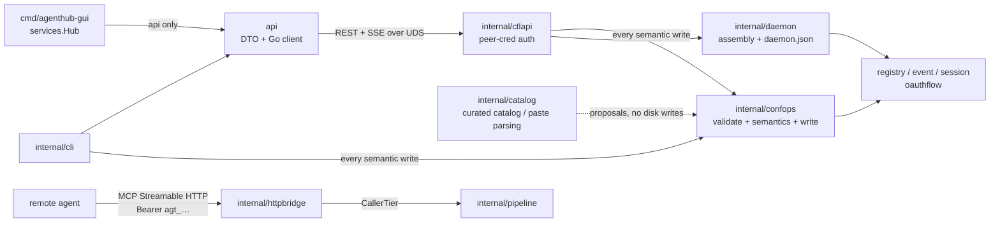

# Control Plane and Frontends

This layer answers "how do people and UIs manage this machine". The data plane (gateway, pipeline,
downstream connections) lives elsewhere; the packages here do only three things: expose the daemon's
state and governance actions as a stable local API, wrap that API in two peer frontends (CLI and GUI),
and hold the compile-time constraint that "the GUI may be entirely absent".

The division of labor between packages goes like this. `api` is the public contract: the control
plane's DTOs and Go client, depending only on the standard library and importing no `internal/*` —
the GUI and third-party integrations may only go through it. `internal/ctlapi` is the server side of
that same contract: REST + SSE over one Unix domain socket, authenticated by directory permissions
plus peer credentials, with no tokens. `internal/confops` is **the only implementation of semantic
writes**: the CLI and the control plane both call it, so there is exactly one copy of the rules.
`internal/catalog` answers "what should I add next" — a curated catalog and paste parsing, both of
which produce only **proposals** and never write to disk. `internal/daemon` does assembly only: it
wires the registry, the event bus, the session manager and the OAuth refresh coordinator into `ctlapi`, then writes the readiness handshake file `run/daemon.json`.
`internal/httpbridge` is the other face — the data plane's MCP Streamable HTTP entry point plus the
tiered agent token credential layer; it shares a process with the control plane but not its
authentication model. `internal/cli` is the command tree and `internal/cli/output` is its only
rendering layer. `cmd/agenthub` and `cmd/agenthub-gui` are the two entry points, the latter using a
build tag to keep the Wails dependency out of CI. The remaining three packages are foundation and
proof: `internal/testutil/fakemcp` is the programmable fake downstream used by every test,
`internal/depguardtest` proves with failing cases that the four dependency constraints really do
block, and `test/e2e` runs end to end against real
processes.



One thing needs saying up front, because every package below repeats it: **events are notifications,
not snapshots**. Every frame on SSE says only "something changed", and consumers must go back and
re-read state, then decide whether to adopt it by "the generation I read ≥ the generation I already
applied", not by "equals the Rev in the event". The same sentence is written across the whole chain
(`api.Event`, `ctlapi`'s coalescer, the GUI's `TopicEvent`), because it is the precondition that makes
dropped frames tolerable.

---

## api

**Responsibility in one sentence**: the control plane's public contract — the wire DTOs, error codes,
SSE topic names, and a Go client depending only on the standard library; the GUI and third-party
integrations talk to the daemon through it.

### Key types and entry points

`Client` is the only entry point, constructed with `New(socketPath)`, `Default()`, or
`DialOrStart(ctx)`. It swaps `http.Client`'s `DialContext` for a `unix` dialer and uses a fake host
`http://agenthub` in URLs, since the hostname is never resolved. All capabilities hang off six typed
services: `Servers`, `Sessions`, `Events`, `Skills`. **There is no raw request
escape hatch** — deliberately: anything a frontend can do necessarily corresponds to an endpoint, and
therefore is necessarily something the CLI can do too, so "the GUI is optional" is structural rather
than a promise.

`DialOrStart` is the "start it if you can't connect" path. It dials once; on failure it runs
`exec agenthub daemon start`, then polls `run/daemon.json` within a deadline and re-dials. If the child
process exits before becoming ready, what is returned is its real error plus a tail of stderr, not a
"timeout" — a lesson taken from the reference implementation `desktop.rs`.

`Health`, `Server`, `SessionInfo` and `Event` are DTOs; `Error`/`ErrorBody` are errors;
`ComputeHealth`'s input constants (`HealthLevel*`, `AdminState*`, `Action*`) are frozen here, and the
GUI's TypeScript constants are generated from this package's source by `healthgen`.

### Invariants and failure directions

**Never imports `internal/*`, and never `go get`s a third party.** This is canonical.md §2 rule 1,
enforced by depguard and proven by the failing cases in `internal/depguardtest`. The cost is that
`paths.go` must reimplement `internal/platform`'s control socket path resolution logic; the
compensation is a cross-package contract test (`internal/ctlapi/paths_contract_test.go`, living on the
ctlapi side because only it can import both) asserting the two implementations are byte-identical in
each environment.

**The decode failure direction is fail-closed.** `decodeEnvelope` succeeds only when it can positively
identify a well-formed success envelope: read within the 16 MiB limit, deserializable, `ok:true`,
status code < 400, `data` non-empty and decodable into the target. Failing any one of those returns an
`*Error` with the client-synthesized `Code` `E_BAD_RESPONSE` — a truncated body is never treated as a
success. Server error bodies are passed through verbatim, never rewritten.

**`X-Request-Id` is generated per request** (overridable with `WithRequestID` to propagate across
processes), echoed on the response and carried into error bodies, so one id follows a failure across
every surface that reports it.


**Only `DecisionApproved` permits execution.** Empty, unknown, and any other decision are all
rejections.

**SSE consumption is tolerant and reconnection is automatic.** `EventsService.Subscribe` establishes
the first connection synchronously (so the caller immediately knows whether the daemon is up), after
which a goroutine maintains it: any stream error triggers exponential-backoff reconnection with
`Last-Event-ID` resumption; the channel closes only when the ctx ends, so falling out of a `range`
means "the subscription ended". A single frame that fails JSON parsing is skipped rather than fatal —
the stream is still usable, and consumers were always going to realign by re-reading state.

**The forward contract.** `SkillsService.List`'s
`/v1/skills` **still does not exist** (there is no such entry in `ctlapi`'s route table). Calls get
`E_NOT_FOUND`, and frontends should render that as "unavailable on this daemon" rather than an error.
The Activity view's live data comes from the `activity` SSE topic; tail is only backfill.

`sseParser` implements the WHATWG spec: arbitrary read boundaries, CRLF/LF, comment lines (keep-alive),
multi-line data concatenation, and `id` tracking (ids containing NUL are ignored). An incomplete line at
the end of the stream is discarded and never delivered as a truncated event.

---

## internal/ctlapi

**Responsibility in one sentence**: the control plane server — expose the daemon's state and the
configuration write surface over REST + SSE on a Unix domain socket only this user can connect to.

### Key types and entry points

`Listen(socketPath)` handles binding and authentication, `NewServer(Options)` handles assembly, and
`Serve/Shutdown/Close` handle the lifecycle. In `Options`, `Registry`, `Sessions`, and `Bus` are
required and the rest have defaults.

Routing is a **hand-written switch**, not `http.ServeMux`. The reason is in the comment on `route`:
ServeMux emits its own 405s and 301s, and the shape of those responses leaks whether a route exists;
hand-written dispatch makes every miss — unknown path, wrong method, unknown resource id — land in the
same `writeNotFound`.

`ComputeHealth(HealthInput) api.Health` is the pure function behind the Health display contract.
`gatewayLink` implements `session.ControlLink` and is the notification channel to stdio gateways.

### The routing surface

The naming convention is `/v1/<resource>`, with the last path segment being the id; everything passes
through the X-Request-Id middleware and the unified 404. Write endpoints
all accept a `Precondition` and return **409 + the current generation** on conflict. The route table
itself is in `server.go` (`grep '"/v1/'` is authoritative).

Four rules written down only here that both frontends must nonetheless uphold:

**Credentials are never echoed back.** Reading a secret returns `{server, key, backend, set: true}` —
there is no value field; it isn't "left blank", it **doesn't exist in the type**.

**An agent token's plaintext appears exactly once** (in the creation response); every read thereafter
gives only the prefix and metadata.

**Dangerous operations must be distinguishable.** Deleting a server or clearing a client's binding are
recoverable routine operations and need only a confirmation.

**No polling after a write.** A write bumps the generation, the watcher publishes an event on the bus,
and the control plane pushes it to the frontend over SSE. A frontend's own writes travel the same loop,
so "someone else's change" and "my change" behave identically in the UI.

#### The one long-running exchange: an interactive login

`POST /v1/auth/{server}/login` → `GET /v1/logins/{id}` → `DELETE /v1/logins/{id}`
(`internal/ctlapi/nonreglogin.go`, driven by `internal/oauthlogin`).

This **reverses a decision that used to be recorded in `api/auth.go`**: "an interactive login is NOT on
this API", because a loopback callback needs a local browser and a random port and would be "a second,
easily-broken code path". Half of that held. The half that did not is the expensive half — with no login
here, every graphical frontend's answer to a server needing authorization was a dialog telling the user to
go and run a terminal command, inside a product whose premise is that clients never handle credentials.

What makes it affordable is that it is **not a second code path**: the daemon drives the same
`oauthflow.Flow` the CLI drives, and what is new is only the session bookkeeping a flow too long for one
request needs. The protocol keeps exactly one implementation, the rule `internal/mcp` follows.

Four properties this exchange must keep:

- **Start answers 202 before there is anything to show.** Choosing between the device and loopback flows
  needs the authorization server's metadata; holding the response until then puts a discovery timeout
  inside a button press. `mode` is empty on the first poll, and that is a real state, not a missing field.
- **The CALLER opens the browser.** The daemon returns `authorization_url` and never visits it: it may be
  headless, may have been started by a service manager with no session to draw into, and may not be where
  the user is. A frontend must open it in the **host** browser — an authorization page inside the
  application's own webview is agenthub asking for a provider password in a window agenthub controls,
  which is the shape of a phishing screen and removes every check the user has.
- **A failed session is a 200** carrying `phase: "failed"` and the reason: the read succeeded, and what
  failed is the thing it describes. The hint is `oauthflow`'s own suggestion, so this surface and the CLI
  answer one failure with one sentence. Only an id naming no session is a 404, and a finished session
  stays readable for a retention window, so a poller one moment late is not told it never existed.
- **The loopback SSRF carve-out follows the stored entry's provenance**, exactly as `auth login` does.
  There is deliberately no request field that can ask for it, so no caller can exempt itself.

A second login for a server that already has one running **joins the first**. Two concurrent flows would
each bind a loopback port and race the same vault entry, leaving the loser's consent screen calling back
into nothing — which is what a double-clicked button would otherwise arrange.

The wire carries `user_code` (the string a human types into the provider's site) and never the device code
polled with, never an authorization code and never a token. The test asserts on the **key set**, so it
fails the day someone adds a field rather than the day someone leaks a particular string.

### Invariants and failure directions

**Two authentication gates, both mandatory.** The first is file permissions: the socket's directory is
0700, and the socket itself is chmod 0600 after bind (the instant between bind and chmod is covered by
the 0700 directory and the second gate). The second is peer credentials: `SO_PEERCRED` on Linux,
`LOCAL_PEERCRED` on macOS, comparing the peer's uid against this process's uid. There is no privileged
bypass inside `sameUser` — **root (uid 0) is rejected too**. Any failure to obtain credentials is treated
as a hostile peer: close the connection and keep accepting (one malicious dialer must not be able to wedge
the control plane). **On platforms with no peer-cred implementation, `Listen` fails outright**
(`peerCredSupported = false`); it never "listens first and worries later".

**A stale socket is removed only once it is proven unserved.** `removeStaleSocket` lstats first: a file
that isn't a socket is never deleted; if it is a socket, it dials to test for life, and **a successful dial
means a live daemon, returning `ErrAlreadyRunning`** — only a failed dial leads to removal. It can never
delete a live endpoint.

**`X-Request-Id` is written into the response headers before the handler runs.** `withMiddleware` validates
first (`^[A-Za-z0-9._-]{1,128}$`, anything non-conforming is replaced with a freshly generated one and never
echoed back as an attacker-controlled string), then calls `rw.Header().Set`. Because `WriteHeader` snapshots
the header map, setting it early guarantees the id is present on success, on failure, and even on a response
after panic recovery. Panic recovery splits two ways: if the response hasn't started, write a 500 envelope; if
it has (mid-SSE-stream, say), `panic(http.ErrAbortHandler)` and drop the connection — never append garbage after
half a body, which would parse as a truncated success.

**The 404 text is unified and frozen byte for byte.** `notFoundMessage = "not found"`, and unknown routes,
unknown sessions and unknown tokens all share one `(code, message, hint)`, differing only in
request id. Tests assert it byte for byte.

**Path matching runs on EscapedPath.** `sessionPathID` and `gatewayPath` both
do prefix/suffix matching on the escaped path first, reject segments containing `/`, and only then
`PathUnescape` the single segment — so an id containing `%2F` cannot smuggle in extra path segments.

**Health is a seven-rung priority ladder, returning on the first hit**:

```mermaid
flowchart TD
    A["1. AdminState<br/>disabled"] -->|"no hit"| B["2. missing secret"]
    A -->|"hit"| A1["level=healthy<br/>(deliberately off ≠ broken)"]
    B -->|"no hit"| C["3. OAuth misconfiguration"]
    B -->|"hit"| B1["unhealthy + set_secret"]
    C -->|"no hit"| D["4. connection state"]
    C -->|"hit"| C1["unhealthy + login"]
    D -->|"error / disconnected"| D1["unhealthy + restart"]
    D -->|"connecting"| D2["degraded (no action)"]
    D -->|"unrecognized value"| D3["unhealthy + view_logs<br/>(surface it rather than guess green)"]
    D -->|"connected / unknown"| E["5. OAuth failure at call time"]
    E -->|"hit"| E1["degraded + login"]
    E -->|"no hit"| F["6. token state"]
    F -->|"expired"| F1["unhealthy + login"]
    F -->|"expiring"| F2["degraded + login"]
    F -->|"ok"| G["7. healthy"]
    G -->|"conn = connected"| G1["healthy / \"ok\""]
    G -->|"conn = unknown"| G2["healthy / \"not observed\"<br/>(nobody is watching, not nothing is wrong)"]
```

Two points worth recording separately: `disabled` **deliberately keeps `level=healthy`** (turning something off on
purpose is not a fault), and an unrecognized connection state **fails toward visibility** (report unhealthy +
view_logs) rather than defaulting to healthy. The frontend only renders, and must not re-derive the state from other fields.

The fourth is **the fork between `unknown` and `connected` on rung 7**. Once the state source was wired up,
`unknown` acquired a precise meaning: **no gateway currently holds a connection to this server** (nobody is using
it, or whoever is hasn't sent its first report yet). That is a statement about the **observer**, not about the
server. So `level` stays healthy — painting every idle server yellow just swaps one misleading signal for a field
of noise — but `summary` changes from `"ok"` to `"not observed"`: `ok` is a conclusion, and nobody has drawn it.
On rung 4, `unknown` still falls through on the same branch as `connected`, because the secret/OAuth/token facts
read by rungs 5 and 6 have nothing to do with whether anyone is connected: a server nobody is using whose token
has already expired must still report `token expired`.

**Push and pull share one payload.** `serverList()` feeds both `GET /v1/servers` and the `servers` SSE topic's
frames, so both paths are byte-identical and the frontend can take either as authoritative.

**Three SSE delivery strategies.** The `servers` topic goes through a 50ms coalescer with a **lazily built**
payload: K bus events become one frame, and the full server list is marshaled once. Scan-type topics (currently
only `skills`) go through a 750ms settler, compressing an entire "started / progress / … / finished" lifecycle into
a single `settled` terminal frame whose payload is the burst's last event carrying the kind it settled at. All
other topics pass through event by event — a session opening and a session closing are two distinct facts and must
not be merged. Each connection has a 32-frame buffer queue and **drops frames on overflow** (the bus contract
already requires consumers to recover by re-reading state, and blocking the coalescer's timer goroutine is never
acceptable).

**Last-Event-ID is best-effort, not a replayable log.** Frame ids are assigned globally and monotonically by
`Server.eventSeq` (comparable across connections). A client returning with an id older than the current sequence,
or with an unparseable id, gets **no history replay**; instead the server sends one `sync` frame per subscribed
stateful topic (servers, sessions), forcing the client to re-read. An unknown `?topics=` value is a client error
and returns 400 outright — it never silently pushes nothing.

**The gateway link is one-way.** It carries registry-change notifications to the gateway, which re-reads the
registry itself rather than trusting the frame. There used to be an ack protocol here, because the daemon pushed
authoritative scope overlays and could not record one the gateway had not applied; with nothing to push there is
nothing to correlate, and `GatewayAck`, the pending table and the ack endpoint went with the overlays.

The link is single-use: a second attach returns 409, and re-registering yields a brand-new session. A session that
hasn't attached a link within 30s of registering is declared dead by a watchdog and closed (stdio sessions are not
TTL-reaped, otherwise a crash between register and link would leak a session forever). When the link drops, the
session closes.

### The two faces of the handler set

**The configuration face (`admin*.go`)** — the control plane's half of "one layer of semantics, two frontends":
the CLI calls `internal/confops` in-process, the GUI goes through these routes, and both land on the same
implementation. `GET|PUT /v1/scope/{client}` handles a client's static binding — *which profile it is on*,
the only thing a client entry holds — and **must not be confused with `POST /v1/sessions/{id}/scope`**,
which is read-only.

`PUT /v1/scope/{client}` accepts a `profile` and nothing else, but the retired `servers` / `tools` /
`discovery` fields are still **declared** on the wire type so that a request carrying one gets a **400
naming the offending field** instead of a 200. That choice has a direction: a caller sending `servers`
was asking to *narrow*, so accepting the request while silently dropping that half would report success
for a **wider** surface than it requested. The error names the field and points at the replacement
(`agenthub profile server` / `profile tools` / `profile discovery`, then bind the client to that
profile).

**The non-registry face (`nonreg*.go`)** — the half of the control plane that **doesn't land on the config
registry**: credentials, skills, agent tokens, client adapters, the OAuth lifecycle, and live connection
self-tests. A few rules only visible here: **verifying that a credential works is `POST /v1/servers/{id}/test`,
not part of the secrets face**; `POST /v1/servers/{id}/test` **probes a docker-runtime entry as a container**,
because the dial carries `Spec.Docker` into the spawner instead of running the command on the host (this
endpoint used to refuse such entries fail-closed, back when the dial could not);
`POST /v1/clients/{id}/connect` may RUN that client's own configuration CLI for a format agenthub will not
rewrite (codex), backing the file up first and verifying the result by re-reading it — set
`AGENTHUB_NO_CLIENT_CLI=1` on the daemon to forbid that;
client wiring resolves its write target as `path` > `placement` > the default
user-level file, and a client lacking that placement gets a 400 refusal rather than a rewrite to a different
location; **`GET /v1/clients` stats and never opens a file** (one macOS privacy prompt per client on every page
load is worse than no listing), so "is agenthub actually wired into this one?" lives at
`GET /v1/clients/{id}/inspect` — one client, named by the caller, which is what makes the prompt belong to a
click rather than to opening a page. One unreadable location there does not fail the request: it is reported with
its error next to the locations that read fine, and forces the state to `denied` rather than `not_connected`.
That listing also reports **both** every client agenthub knows about and the subset it will not write itself, and
it reports them separately on purpose: the first is what answers "why is my client missing", so it cannot be
filtered down — and a frontend given only that list labels it "writable", which is what the GUI did, above rows
carrying their own read-only badge. `PATCH /v1/skills/{id}` exposes **only** the coarse library-level switch.
`POST /v1/parse/client-config` is read-only: it produces an entry **preview** and writes nothing.

---

## internal/confops

**Responsibility in one sentence**: the single implementation of **every semantic write** against the config
registry — adding a server, renaming a profile, binding a client, flipping a governance value, setting a
server's tool allow list.

### Why it exists

The CLI and the control plane are two frontends over the same configuration. If each assembles its own answer to
"what does renaming a profile mean", the two will eventually produce different results for the same operation.
There is precedent for that class of accident: `SpecFromEntry`'s comment claimed to be the sole translation point
while the gateway hand-rolled a second Spec, and **container isolation was silently dropped as a result**.

So the division here is rigid: frontends own flag parsing, rendering, and transport, and **own no rules**. A parity
test asserts that the CLI path and the control plane path produce **byte-identical** registry documents for the same
operation — they cannot drift, because they are the same code.

### Operations, not setters

The API's shape is **operations, not field setters**. `RenameProfile` also repoints every client binding
referencing it — leaving the references in place would **fail-close those clients into an empty scope**, and that
consequence belongs to this operation, not to its caller. That is what "operations, not setters" means. The
governance key table (`GovernanceKey` / `GovernanceKeys()`) likewise lives only here: get/set/ls semantics have
exactly one home.

### Invariants and failure directions

**Every operation is three steps, in an order that cannot change**: validate the arguments first (rejection happens
before anything is opened) → mutate inside `registry.Store.Update` (holding the cross-process lock, against a
document just re-read from disk) → return a `Result` carrying the post-commit generation.

**The precondition comparison happens inside the lock and before the mutation**, so there is no window between
comparing and writing. `Precondition{}` (generation 0) means no check, which is what the CLI's non-interactive path
uses, so CLI behavior is unchanged.

**Operations whose subject isn't the registry can only do weak checks.** Such a store has its own lock, and the
registry's generation can advance between comparison and write. `checkSnapshot` is therefore **advisory**: it catches "the operator's view is stale", not
"nothing moved under my feet". The difference is expressed in the types; don't treat them as the same guarantee.

**Validation rejects rather than normalizes.** An unknown transport, an unknown runtime, an unparseable boolean —
each leaves the registry untouched rather than landing on a default the operator never asked for.

**`Changed` is derived from the generation, not from the operation diffing itself.** The registry bumps only on an
actual state change (its no-op guard compares parsed JSON values), so writing the same value twice naturally reports
`Changed == false`.

---

## internal/catalog

**Responsibility in one sentence**: answer the question a config table cannot — "what can I add next, and what does
it cost". It has two routes to "a proposed server definition", and **neither writes to disk**.

### The two routes

| Route | Contents |
|---|---|
| Curated catalog (`catalog.go` + embedded `seed.json`) | A small set of well-known MCP servers and the invocation their publishers' docs specify, so "add one" means picking from a list rather than recalling `npx -y @modelcontextprotocol/server-…` |
| Paste parsing (`paste.go`) | A README snippet or another client's config already in the user's clipboard, converted into the same proposal shape for preview |

Both produce **proposals**. `internal/confops` remains the only implementation of every registry write and the only
place entries get validated — this package never opens the registry, so a catalog entry gets **exactly the same**
scrutiny as a hand-typed one.

### Invariants and failure directions

**Provenance is a source signal, not a cryptographic proof.** `Entry.Provenance` grades "where the definition came
from" — curated (a maintainer reviewed it when writing it), registry (a remote index, not implemented), user (typed
or pasted by the person at the keyboard). Together with `Publisher` and `Homepage` it is a **source signal**: nothing
here is signed, nothing is verified at add time, and `npx -y <package>` will still pull whatever the repository serves
at that moment. Curated means a maintainer believes that command line is the one in the publisher's docs; **it does
not mean the code that ends up running is the code they read**. The defenses that actually make assertions about
running code live elsewhere, and
`internal/guard/spawnguard` screens what gets spawned. This package only feeds them a definition; it does not vouch
for it.

**`needsConfig` is the test for "can this be one-click".** An entry that declares credentials, declares parameters, or
still has unsubstituted placeholders in its command line/URL/environment/headers — any of the three means configuration
is needed; everything else can be added as-is.

**Unsubstituted placeholders are a refusal, never a literal `{{directory}}` written through.** A server that fails at
connect time because of a path nobody ever typed is far harder to explain than a refusal at add time.

**The paste route only parses and never writes.** It doesn't open the registry, doesn't resolve secrets, and doesn't
touch any client's files on disk. The result is a **preview**, which the caller renders and the user confirms, after
which the normal add path has `confops` validate it exactly as it validates any entry.

**The same thing is handled differently on the two routes, deliberately**: an unknown field is a **warning** on the
paste route and a **hard error** on the CLI's `server add --stdin`. The preview shows the user verbatim what is about
to be stored, so "these keys were ignored" is information they can act on; whereas a write with no preview can only
refuse, or the user will never learn that the `oauth` block they pasted vanished.

**Wrapper key paths come from `internal/clients`** — the same table that decides where on disk each client's servers
live. So adding one client row extends this parser for free, instead of requiring a second inventory that would drift.

---

## internal/daemon

**Responsibility in one sentence**: assemble everything the control plane needs and run it as a process — it has no
business logic of its own, only assembly order, the readiness handshake, and graceful shutdown.

### Key types and entry points

`Run(ctx, Config) error` is the only entry point. Every `Config` field has a production default and exists only for
CLI and test injection (`Resolver`, `Log`, `OnReady`, various TTLs/windows, `Secrets`). `Info` mirrors
`run/daemon.json`; `ReadInfo(runDir)` is the reader side (`api.DialOrStart` holds a copy of it). `refresher` is the
proactive OAuth refresh loop.

### Invariants and failure directions

**`daemon.json` is written only after a successful bind**, so a well-formed `daemon.json` always describes an endpoint
that was alive at the moment of writing — this replaces the TOCTOU-prone "probe the port then spawn" approach. The
write goes through a temp file in the same directory + chmod 0600 + rename, so readers only ever see the old file or
a complete new one.

**Dependencies, and the failure direction of each.** A registry that won't open is fatal (the daemon *is* the
coordination plane, unlike a gateway which can serve the data plane while impaired), but a document that was
quarantined and self-healed is only a warning. A JSON log file that won't open degrades to plain text — a daemon
that can't write logs should still coordinate. A registry watch that can't be established also only degrades: external changes are seen
on the next explicit reload.

**Graceful shutdown has two phases.** After the ctx ends, first `srv.Shutdown(grace)` (stop accepting, drain in-flight
requests), and once grace is spent, `srv.Close()` forcibly closes the rest — long-lived SSE links never drain on their
own. Then cleanup: close the watcher, stop the background ctx, best-effort remove the socket, remove `daemon.json`.
Internal goroutines (session reaper, watch pump, refresher) run on a **separate background ctx** so they
survive the drain phase and stop only at cleanup.

**The stdio gateway depends on nothing here.** The package comment states it outright: a dead daemon (even `kill -9`)
costs only coordination — the session list, the event stream, centralized refresh. A stdio gateway's scope comes
entirely from the registry files, so a dead daemon changes nothing about what a client sees; the gateway simply
re-registers with backoff.

**The registry watch's adoption test is monotonic.** A watch event is only a notification; on receipt it re-`Reload`s
and uses `registry.Applier` to decide adoption by "the generation I read ≥ the one I already applied", and only on
adoption does it publish two things on the bus: `ctlapi.TopicRegistry` (forwarded to every gateway link) and
`server.registry` (driving the frontend's `servers` topic, with the payload lazily rebuilt on the ctlapi side). A
failed reload keeps the old snapshot.

**Three decisions about proactive OAuth refresh** (the file comment gives the "seemingly more obvious wrong
alternative" for each):

1. Use `oauthflow.Coordinator`'s **offline path** (a `<server>.refresh.lock` sibling file lock plus re-reading
   `expires_at` after acquiring it), not the online path with only in-process singleflight. The online path holds only
   if the daemon is the sole vault writer, and `agenthub auth login/refresh` writes the vault directly today. The cost
   of a redundant lock is one syscall; the cost of a missing one is a one-time refresh token being spent twice, locking
   the user out until they manually re-authorize.
2. Keep the in-process singleflight on top of that, so that a future control plane `auth refresh` RPC hits the same gate
   instead of racing the timer.
3. **A token with no expiry is never proactively refreshed.** "No `expires_in`" means "never expires", not "already
   expired", and such servers are covered by `internal/downstream`'s passive 401/403 path.

The backoff ladder: the first 3 consecutive failures retry flat at 15s, then it switches to the slow OAuth ladder
(5m/15m/1h/4h/24h). `ErrNoRefreshToken`/`ErrNoState` jump straight to the slowest rung — only `agenthub auth login` can
fix those, and retrying is pointless. `backoffState` records the `expires_at` observed at failure time: a newer expiry
appearing in the vault means someone logged in again, and the suppression window earned by the old credential is voided
immediately. Backoff **only queries when the token has actually expired**, so a suppression window can only lower the
attempt frequency and never mask the fact that this token needs renewal.

**The crash marker is armed after a successful bind and resolved only on the graceful shutdown branch**, so an
abrupt death leaves it armed and the next start can tell a crash from a clean exit.

**The non-registry collaborators are all optional.** Credentials, skills, agent tokens, client adapters, and OAuth
state each log and continue on failure rather than refusing to start: a vault that won't open costs only the
secrets endpoints while everything else keeps coordinating.

**What the runtime state source is wired to**: a single `ctlapi.NewGatewayStates()` object is injected as both
`Options.States` (read) and `Options.ServerReports` (write). The daemon **connects to no downstream while the data plane
is off** — it has no data plane then (with the data plane disabled the daemon holds no downstreams), so state is reported
over the control connection by the stdio gateways that actually hold the connections, and the daemon only aggregates.
Standing up a second set of downstream processes just to display a status dot (one resident child process per stdio
server, doubled OAuth and quotas for remote servers, plus reassembling secret resolution and netguard inside the daemon)
is not a worthwhile trade. The aggregation rules are in the file comment of `internal/ctlapi/gatewaystate.go`.

---

## internal/httpbridge

**Responsibility in one sentence**: the daemon's **data plane** exposure — the MCP Streamable HTTP entry point, the
ingress hard limits guarding it, and the tiered agent token credential layer for callers.

It is deliberately **not** the control plane. Management traffic goes over the UDS control socket, where identity is an
operating system peer credential and no tokens exist; this package speaks only MCP.

### Key types and entry points

`Server` (constructed by `New(Options)`) answers exactly three verbs on one path: POST for one JSON-RPC message in and
out, DELETE to terminate a session, and **GET returns 405**. `Dispatcher` is the only seam between this transport face
and the MCP logic behind it, existing so that this package owns exactly one thing — a hardened HTTP entry point and
credential layer — without growing a second gate chain. `Authenticator.Authenticate` produces a `*Caller`; `Store` is
agent token persistence; `AuthorizeBind(BindConfig)` decides whether this listener **may be bound at all**; and
`Listen`/`Serve` handle listening and lifecycle.

### Invariants and failure directions

**Binding is itself an authorization decision.** A listener with no admin token, no active agent token, and no registered
clients would treat every local process as a legitimate agent, so `AuthorizeBind` **refuses** to create it (inherited from
toolport's `http_bind_is_authorized`). `--insecure-loopback` is the only escape hatch, and it is narrower than its name:
**a non-loopback address always requires a token** — neither registered clients nor the escape hatch suffice to authorize
exposing tool execution to the network; the "registered clients" path likewise only authorizes a loopback bind, because
entries in `clients.json` are configuration, not credentials. `AddrIsLoopback` fails toward false: an empty host
(`:8080`, i.e. all interfaces), a hostname, or an unresolvable address is **not** loopback — this predicate is used to
grant a weaker authorization, so it must be the one in the pair that is false when it cannot prove otherwise.

**The per-request ordering invariant: ingress limits → authentication → session binding → dispatch.** Every level is
fail-closed, and every rejection is distinguishable (413/401/403/404/503), so operations reading access logs can tell
"body too large" from "token revoked" from "someone else's session". **Rate limiting happens before authentication** —
the whole point of an in-flight cap is to limit the work an unauthenticated caller can induce; over the limit means a 503
shed rather than queuing (queuing behind a saturated downstream connection pool turns a slow server into an unbounded
memory sink).

**Ingress hard limits** (header size, header read deadline, body size, body read deadline, concurrency) are constants
in `ingress.go`. The two header limits **cannot be enforced inside the handler** (by the time the handler runs, the
headers are already read), so the assembler must use `Server.HTTPServer()` rather than building its own `http.Server`. The body
read deadline is set per request via `ResponseController` — a server-level `ReadTimeout` would also limit long-lived
connections.

**Only Streamable HTTP is exposed.** canonical.md §5b freezes the transport asymmetry: agenthub **reads** legacy HTTP+SSE
downstreams but **never grows a new SSE exposure surface**, so GET returns 405 rather than upgrading to a stream.

**Two gates facing the browser.** `Sec-Fetch-Site` is set by the browser and cannot be forged by page scripts: non-browser
clients don't send it (unaffected), and a malicious cross-origin page cannot hide that it is a page. The `Origin` check
also blocks DNS rebinding — an attack page resolving its own domain to 127.0.0.1 still sends its own Origin. **The CORS
invariant: this server never echoes an Origin and never emits `Access-Control-Allow-*`**, because no browser client needs
to be enabled, and the only effect of permissive CORS headers would be to let a page read tool results.

**Token shape and storage.** The prefix `agt_` plus 64 hex characters. **Dispatch is by prefix and mutually exclusive in
both directions**: anything starting with `agt_` is only ever looked up in the store, and everything else is only ever
compared against the admin token. Without that exclusivity a caller could probe the store with admin-shaped candidates,
and an admin token that happened to start with the agent prefix would become unusable. What is stored is only
`hex(HMAC-SHA256(key, plaintext))`: HMAC rather than bare SHA-256 defends against offline cracking — an attacker who
steals `tokens.json` without `.token_key` cannot verify candidate tokens offline. The key file is a dotfile and sits
**beside rather than inside** the token list, so copying `tokens.json` into a bug report doesn't hand over verification
capability too. **A corrupt key file is a hard error**: regenerating it would silently invalidate every issued token,
looking like everything is fine to operations and like an outage to every agent. First creation uses `O_EXCL`, and the
loser of an initialization race reads the winner's key.

**Lookup is an authentication face that is not an oracle.** Unknown, revoked, and expired all return the same `ok=false`,
and the layer above always returns 401. Comparison walks the entire table using `hmac.Equal` **without short-circuiting** —
loop duration must not depend on where the match sits in the table. `Token.Active` folds tier legality into "active": a
tier this binary doesn't recognize (hand-edited file, downgrade after a new tier was added) must be rejected rather than
defaulted.

**The nil/empty tri-state.** A nil `Token.Servers` means "no restriction configured, allow all", and a non-nil empty slice
means "allow nothing". That is why the field is serialized **without `omitempty`**, and it is the same tri-state as the
registry's `ToolSelector`.

**The store's concurrency discipline.** Uniqueness and the `MaxTokens` cap are checked **inside** the flock transaction,
against the very list that transaction is about to write back — checking against a snapshot read outside the transaction
would let two concurrent `token create` calls both win. Write-back uses the full hardened ladder: temp file in the same
directory → chmod 0600 → write → fsync → rename → fsync parent directory. A missing file is an empty store (first run),
but **a malformed file is an error**: silently treating a corrupt credential store as "no tokens" would make bind
authorization fail open. `MaxTokens = 64` is not resource protection but governance protection — an unbounded credential
list is a list nobody reads. Records are **retained** after revocation (the name stays taken and the row keeps
appearing in `token ls`), so a name always resolves back to exactly one credential.

**Session binding is fail-closed and validates the whole identity.** `Caller.Identity()` composes kind, token name, tier,
allowlist, and profile into a fingerprint; a session freezes the fingerprint at creation and **compares the whole thing on
every request** — a token whose tier or allowlist was later narrowed cannot keep riding an old session with old
privileges. Not found, expired, and owned by someone else all return the same false, and the handler answers the same
frozen 404 text (anti-probing). **A session owned by someone else is deliberately not deleted**: an outside prober must not
be able to destroy other people's sessions by guessing ids. When the table is full, **creation fails rather than evicting**
— quietly discarding someone else's live session to make room for a new connection would turn a load spike into a data
plane error aimed at the wrong caller.

**Dual-stack loopback in Listen.** A client told to connect to "localhost" might resolve to 127.0.0.1 or to ::1, and which
one is not ours to decide; binding only one address family produces the worst failure shape — works on the developer's
machine, connection refused on the user's. So "localhost" **binds both**, and with port 0 the actual port of the first
listener is read back and used for the second (otherwise the two halves would land on different ports). A second family
that fails to bind returns only a warning rather than failing (a machine without IPv6 should not be refused startup); only
both failing is a hard error.

**Tiers are only minted here, not enforced here.** `Caller.Tier` flows into `pipeline.CallRequest.CallerTier`, and the
actual comparison (against the tier derived from tool annotations) happens in the token tier gate in `internal/pipeline` —
the second of the two defence lines (scope → token tier). `Profile` joins the scope intersection as an ordinary
layer, and like every other layer it can only tighten.

`AddrIsLoopback` is **exported** because the assembler needs the very same predicate to decide whether explicit
remote confirmation is required — two implementations of "is this loopback" would eventually disagree, and the
disagreement would land on the permissive side.

### Who assembles it

`internal/daemon` (`httpserve.go` + `httpdata.go`). Assembly is **explicit opt-in**: when `daemon.Config.HTTPAddr` is
empty — that is, no `agenthub daemon start --http-addr` was passed — **no listener is created at all**. A non-loopback
address additionally requires `--http-allow-remote`, and its absence fails daemon startup rather than quietly downgrading
to loopback ("what the configuration claims must be honored or error out", the same discipline as `runtime: docker`).
`AuthorizeBind`'s credential check comes after all that and is still the final fail-closed gate.

`Dispatcher`'s implementation `httpPlane` is deliberately thin: it maps an authenticated credential to a `gateway.Conn` —
the very same gateway body as `agenthub connect`, attached to an in-memory pipe — and writes request frames into it.
**There is no second assembly, and therefore no second execution path**: an HTTP request traverses the same discovery
surface, the same router, and the same `pipeline.Execute` call site. Credentials enter the governance chain through only
two existing entry points: `Caller.Tier` becomes `gateway.Config.CallerTier` → `pipeline.CallRequest.CallerTier`; and
`Caller.Servers` and `Caller.Profile` become extra layers in `scope.Sources.Extra`, intersected by the same `Merge` as the
five persisted layers (they are security fields and can only narrow). Connections are keyed and reused by the **whole
credential** (kind/name/tier/allowlist/profile), so a token narrowed after issuance gets a new gateway rather than the old
privileges — the same rule as the session's `Caller.Identity()`; reclaimed after 30 minutes idle.

The test proving "there is no fork" is `TestInProcGateCountParity` in `internal/gateway/inproc_test.go`: a `tools/call`
through `Conn` and one through the stdio pipe advance **exactly the same** gate counts — the same test as the one used for
the "direct call / `call_tool`" pair.

---

## internal/cli

**Responsibility in one sentence**: the entire `agenthub` command tree — offline registry editing, online control plane
operations, and unifying both under one set of exit codes and one `--json` envelope.

### Key types and entry points

`Main(Options) int` is the only entry point and returns the process exit code. It is the **only** place that classifies
errors (`ExitCodeFor`) and reports them (`Printer.Fail`); every `RunE` returns only typed errors and never prints its own.
`App` holds all the injectable state for one invocation (version, the three streams, `platform.Resolver`, lock timeout,
the `--json` switch), so tests can run commands fully hermetically.

`Error` is the typed CLI error, carrying a stable machine code (`Code*`), a process exit code (`Exit*`), and a
human-facing hint all at once. The four constructors `Usagef`/`NotFoundf`/`DaemonDownf`/`AuthFailedf`/`Deniedf` cover the
categories in the frozen table. `silentExitError` is for commands that already rendered their result through the output
layer (doctor's per-item status), preventing Main from printing a second error.

`ctlClient` is raw control plane access, for the faces the typed `api` client does not cover. It
speaks the same envelope over the same UDS, but its wire DTOs come straight from `internal/ctlapi` — the CLI is inside the
module and isn't constrained the way the public `api` package is.

### Invariants and failure directions

**The exit code table is frozen**, and the mapping exists in exactly one place, `ExitCodeFor`:

| Code | Meaning | Triggered by |
|---|---|---|
| 0 | Success | — |
| 1 | Generic error | Downstream/network/internal |
| 2 | Usage error | Arguments, unknown flag, unknown subcommand |
| 3 | Resource not found | server/profile/secret/skill/session/tool |
| 4 | Daemon offline but the command requires it | `DaemonDownf` |
| 5 | Authentication/authorization failure | OAuth flows |
| 6 | Rejected by configuration | a call the effective scope does not permit, a credential tier that does not cover the tool |
| 7 | Lock contention timeout, or a state file corrupt and **unable to self-heal** | The locks with a timeout ladder — registry, skills, the HTTP-bridge token store; plus `registry.UnreadableError`, the skills corrupt-state path, and `confops.KindState` |

**"A cobra parse error = exit 2" is guaranteed by construction, not by convention.** The root sets
`SetFlagErrorFunc`, funneling every flag parse error into `Usagef`; `exactArgs`/`noArgs`/`rangeArgs` are typed replacements
for cobra's same-named validators; and every group uses `Args: cobra.ArbitraryArgs` + `groupRunE`, so an unmatched
subcommand name lands in a typed usage error rather than cobra's own untyped "unknown command". `SilenceUsage` and
`SilenceErrors` are both on, because Main owns error reporting exclusively.

`groupRunE` had one hole, and Main closes it before `Execute`. cobra answers a help flag *before* RunE, so
`agenthub secret get --help` printed the `secret` group's page and exited 0 — the same answer a real subcommand
gives, which is what made a nonexistent `secret get` look like one that exists (stored credential values have no
read path at all, so that page contradicted a design rule rather than merely a fact).
`helpForUnknownSubcommand` resolves the args with `root.Find` and refuses a leftover non-flag token on a command
that HAS subcommands. **That hole has two doors, and closing one is not closing it**: the help flag, and cobra's
help *command* — `agenthub help secret get`, whose own implementation resolves the deepest match and drops
whatever is left over, producing the same page with the same zero status. One question spelled two ways, so
`helpRequest` reduces both to one path rather than checking twice. It is scoped to exactly that hole — without a
request for help RunE already answers, and a leaf command is entitled to positional args — and
`TestHelpForEveryRealCommandStillExits0` walks the whole tree in the other direction, in all three spellings,
because a check running before cobra is one that could break `--help` everywhere.

**"Already-healed quarantine" degrades to a warning and doesn't consume exit 7.** `splitQuarantine` separates
`registry.UnreadableError` (a document that couldn't be read but was quarantined and reset to defaults, with the store still
fully usable) out of the fatal errors and turns it into warnings on the success envelope. Exit 7 is reserved for "corrupt
and unable to self-heal".

**The command tree's shape is pinned by tests** (`tree_test.go`) rather than by review: every command in the tree must exist
and be spelled consistently; resource groups must be **singular canonical name + plural cobra alias** (server/servers,
profile/profiles, client/clients, session/sessions, tool/tools, skill/skills, secret/secrets) and the alias must
actually resolve; list subcommands are always called `ls` (`list`/`dump`/`ls-all` are all
violations); and **every command must be able to take `--json`** (it is a persistent flag on the root, and what this test
really asserts is that no command shadows or removes it). Action/streaming groups (daemon, auth, audit, activity,
events, config, doctor, connect) keep their names and get no plural alias. There is no `scope` group: binding a
client to a profile is `client bind` / `client unbind` / `client ls`, and the narrowing itself is `profile server`
/ `profile tools` / `profile discovery`. Every group invoked bare prints help and exits 0,
and an unknown subcommand exits 2.

**`(default)` is one token across every listing that renders a binding.** The fallback an unbound client
follows is a *display* row, not an object: `profile ls` heads its table with it (always, and carrying
the `*` whenever it is the row in force — including when the active profile is missing, since the row
that would have carried it is the one that does not exist), `client ls` prints it in the PROFILE column,
and `client inspect` plus the bind/unbind echo go through the same two helpers,
`describeDefaultProfile` / `describeActiveProfile`. It replaced a per-table `(active)` that named
nothing the user could look up. `confops.validateProfileName` refuses a name starting with `(` so the
token cannot be shadowed, and the `default` object is kept **out of** `profiles[]` in the JSON so a
script walking that array keeps getting names it can pass back to `profile rm`.

**The two dangling directions are reported in different places, and both must stay reported.** A client
bound to a missing profile is flagged per row (`dangling`); a missing *active* profile fail-closes every
client that follows it, which no row can carry — those rows have no binding of their own — so it lives on
the listing (`active_dangling`) and, in `client inspect`, on the one client the command is about.

**Error text is frozen by golden tests** (`errorgolden_test.go`). canonical.md §6 requires three families of golden test to
run in CI from day one, and this is the third (the other two are signature grammar and search ranking, in
`internal/discovery`). What is frozen is the entire failure contract: the machine code, exit code, message, and hint of every
classifiable error — agents and scripts use all four, so silently rewording is a contract break. Regenerate with
`go test ./internal/cli -update`, **and the diff must be reviewed**.

**The online/offline matrix is explicit.** Every command in the `session` group requires the daemon (a session is a runtime
object that is never persisted), and offline is exit 4 rather **than** an invented offline answer. `events` is inherently
online (the stream *is* the daemon), and offline is exit 4 rather than printing an empty stream that looks like "nothing
happened". `audit tail -f` likewise: with no daemon no new records are being appended, and following would pretend to work
forever. Conversely, `activity` is a pure read of an append-only file and **works offline** — the numbers describe things that
already happened, and whether the daemon is up cannot change history; `tool allow` is offline-capable too, because
choosing what a server offers must not require starting it first.

**Credentials are never printed, and that is guaranteed at the type level.** The `secret` group's result types **have no value
field at all**, `ls` renders only key names and backends, and `auth status` reports only issuer/expiry/mode/whether a refresh
token exists; there is no `--show` escape hatch. The one exception is `token create`: the plaintext must leave the process
once or the token could never be handed to an agent — so it prints once with a "this is the only time" warning, and the store
keeps only the HMAC. Reading a password from a terminal goes through `readNoEcho`, which **returns an error rather than reading
from a non-terminal fd** (redirected stdin must not silently echo credentials into a log), and terminal state restoration is on
a defer (an interrupted read never leaves the user's shell with echo off).

**`server ls` can safely display header values verbatim**, because a registry entry never contains a credential — the values are
`${SECRET_X}` placeholders, and resolution happens at connect time inside `internal/downstream`. The **vault keys** an entry needs
come from `downstream.SecretKeysIn`, not from a local `${...}` scan: only `${SECRET_<KEY>}` is a credential and the entry it names
is `<KEY>` without the prefix, so a private scan produced a list that failed at the very cross-check against `secret ls` it exists
for. `server inspect` prints them under `configuration` for the same reason and with **one exception**: a *literal* `Authorization`
value is the case where that assumption is already broken — it is a pasted token, not a placeholder — and the human view refuses to
read it back out to a terminal. The test is the narrow one `hasLiteralAuthorization` makes, because guessing which other header
authenticates something would start hiding ordinary configuration; the `--json` envelope is unchanged, for programs that already
hold the file.

**`server inspect` is the one view of a WHOLE server, and it is laid out as four sections** (`internal/cli/serverinspect.go`):
`configuration` (target, cwd, container run line, derive policy, a declared-local endpoint, the trace file, env and headers),
`credentials` (the classification below, the login hints, the per-key vault state), `visibility` (below), and `status` (the
daemon's live view, then the dated tool cache). A section prints only when it has something to say, so a plain local subprocess
still fits in a few lines. Two of its lines exist because nothing else prints them: **`spawns` is the exact `docker run` argv the
spawner would execute** — rendered by `confops.DockerRunLine`, the same translator the spawn guard screens, so "isolation a config
claims must be delivered" is checkable by reading, and a test compares the printed line against the dialed one — and the cache line
distinguishes **"no catalog stored" from "0 tools"**, which the old wording could not: only one of the two is a fact about the
server. Labels sit in a fixed column rather than a `tabwriter`'s, because a detail view breaks its column blocks at every section
heading and the computed width then drifts between them.

**`visibility` joins the profile and client bindings for one server** (`internal/cli/servervisibility.go`), which is the arithmetic
behind "everything is healthy and my client still sees no tools". Three states stay distinct because they need different repairs: a
**disabled** server reaches nobody whatever the profiles say (the global switch outranks them, so that sentence *replaces* the
client lists), a profile that **excludes** the server is named (a list of the others cannot answer "which profile forgot it"), and a
binding naming a profile that **does not exist** fail-closes to an empty scope — which from outside looks exactly like deliberate
exclusion. What an *unbound* client gets is stated on every report rather than only when it changes the answer, because "which of my
clients is bound" is what the reader does not know. It is computed from the **registry alone**: no client configuration file is
opened (that is `client inspect`'s deliberate per-client act, with its macOS privacy prompt) and no daemon is required, so the
answer survives on the machine that is broken. Since the scope chain only ever narrows, what it reports is an upper bound — a
session scope can still take tools away below it.

**The `AUTH` column reports what is STORED, never whether it works** (`internal/cli/serverauth.go`). This is the line the ban on a
persisted `needsAuth` draws: "this machine holds an OAuth token for notion" is a local fact readable with every downstream
unreachable, while "notion will accept it" is a live 401 and belongs to the enable probe and the Health contract. The column says
`oauth`, `oauth:expiring`, `oauth:expired`, `oauth:login`, `token`, `secret`, `secret:missing`, `header`, `error` or `-`, and no
value of it may be read as health. It is classified by a **first-match-wins ladder** whose first two rungs are placed rather than
convenient: a missing secret outranks everything so that the CLI and `ComputeHealth` cannot disagree about the same server, and a
literal `Authorization` header outranks the stored credential because `attachBearer` leaves an explicit header alone — reporting
the token behind one would name a credential that is never sent. The last rung does **not** guess: an HTTP endpoint with no
credential and no hints is `-`, not "probably needs a login". `server inspect` renders the same classification unabbreviated, and
the footer hints prefer `auth refresh` over `auth login` whenever a refresh token exists — both repair an expiry, only one needs a
browser.

**Reading it is index-first, and that is a cost rule, not an optimization.** One `Chain.List` — the enc-file map plus the keyring
key registry, both plain files — answers *which* entries exist without touching the OS keychain; only a server that actually has
`__oauth_state__` costs a value read, and `__http_auth__` is never read at all (its value is the token, and presence is the whole
question). `server ls` is where every error hint sends people, and doctor's `checkVault` already states the consequence: a command
that pops a keychain dialog is a command people stop running. Failure direction: **fail-open for the listing, fail-visible for the
cells** — an unreadable vault still prints every registry fact, but its cells read `error`, never `-`, because "no credential
needed" is the one answer it must not invent. The column appears only when at least one server has a credential, for the same
reason `TRACE` appears only when something is being traced.

**`server add` writes configuration only; `server enable` puts the server into service** (CANONICAL §3). `add` makes no
connection and leaves the entry **disabled**, so it stays deterministic and safe to run against a downstream that is
unreachable right now. The connection probe lives in `enable`, where the operator has said they want to use the server — and
it **reports without vetoing**: the enable always happens, and a server needing a login is enabled and says so (`--no-probe`
skips the dial). Two callers compose the pair rather than duplicating it: `catalog add` runs both so a curated entry stays one
command, and `auth login` enables the server it just authorized. That last one is not mere convenience — it is what makes an
already-running gateway pick the credential up. The vault is not a registry document, so storing a token fires no hot-reload
event, and `syncServers` would keep the existing connection anyway because `specEqual` does not compare credentials; flipping
`enabled` is a spec change the differ does act on. It fails open: the credential is already stored, so a failed enable is a
warning, never a failed login.

**OAuth login hints are configuration, not runtime state.** `server add --oauth-issuer/--oauth-scope/--oauth-resource-metadata`
writes all three fields of `registry.OAuthHint`, the same target and the same validation as `--stdin`'s `oauth` block
(`confops.ValidateOAuthHint`: https (http only with `--local`), no private addresses, an issuer with no query/fragment
(RFC 8414 §2), and no stuffing two scopes into one scope value (RFC 6749 §3.3)). All three fields are transport-independent (a
stdio subprocess may also proxy to a remote authorization server), so validation doesn't hang off either transport branch.
Passing no flags means `nil`, not writing an empty `"oauth": {}`. `needsAuth` never lives here: it is runtime state discovered by
a live 401.

**`server test --tools/--schema` renders the definitions from this handshake and never touches the cache.** The `mcp.ToolDef`
the handshake returns already carries the full `InputSchema`/`Description`, and `--tools` prints it using the compact signature
from `internal/discovery/toolsig` — the same string the agent sees in `search_tools`, with no second format invented;
`--schema <tool>` gives the downstream's raw bytes. This reads from a **different source** than `server inspect --schema`: the
latter reads the gateway's persisted tool cache, and that cache is only written by an actual gateway session, so under a
`server add` + `auth login` + `server test` workflow it doesn't exist at all. `server test` still doesn't write the cache — it is
a direct-connection diagnostic with no persistent side effects.

**How `daemon start` backgrounds itself.** It forks `<self> daemon start --foreground` into its own session (`setsid`), then polls
`run/daemon.json` plus ping until ready. The child's raw stderr goes to **a file rather than a pipe**: the parent exits once the
child is ready, and writing into a pipe with no reader would SIGPIPE the daemon. If the child exits before becoming ready, what is
reported is its real failure plus a 4 KiB stderr tail rather than a bare timeout. With a live daemon already running it returns
`AlreadyRunning` idempotently. `daemon stop --force` kills the process group (the daemon is the session leader), with a plain pid
kill as the fallback for foreground starts. `daemonAlive` probes with signal 0, and **any error (ESRCH, EPERM, …) reads as
false** — stop/status must never signal a pid whose ownership it cannot confirm.

**`doctor` only reads, never writes.** It deliberately **does not call `registry.Open`**: opening the store would create the
directory, five documents, and a lock file, which would turn a diagnostic tool into a writer and incidentally "fix" the state it is
reporting on. All checks read raw files. `--fix` performs only safe self-healing (recreating missing directories, repointing stale
client entries), and destructive repairs are **suggested, never executed**. A launcher cold cache (npx/uvx downloading a package
for the first time) gets its own "still installing" note rather than being misreported as a broken server — the most common false
positive in the whole report. Only `fail` affects the exit code; `warn` is informational.

**`registry:quarantined` is the only check reporting "data was set aside", and it has to exist separately.** When the registry
quarantines an unreadable document, it renames the corrupt file and writes an **empty new document** in its place — after which
`registry:servers` reports "readable". That statement is entirely true, and at the moment of "all my servers are gone" it is
precisely the worst thing to read. The warning at quarantine time is printed once by the command that triggered it; the person
running doctor **afterward** to figure out where their config went is the reason this check exists. It looks for `*.unreadable-*`
files and points at `backups/` — reporting bad news without a next step is the same as not reporting it. It is completely silent
when nothing has been set aside; the warning persists until the operator deals with the file, which is exactly what makes it
actionable rather than long-term noise.

**`session ls -f` polls rather than using SSE**: the list is small, and polling won't quietly hang on a half-open stream the way a
subscription can.

**Registry writes go direct and offline.** `registry.Store.Update` brings its own cross-process `.lock` plus atomic writes, so the
offline path and a future daemon-mediated path won't lose each other's updates. `tool ls` reads the catalog through
`internal/router` + `internal/discovery`, **using the same ranker as the gateway's `search_tools`**, avoiding two rankings.

**`confops.go` is the bridge to `internal/confops`**: it translates confops' Kind + stable machine code into the
CLI's own `*Error`, which is how the frozen exit code table and `--json` failure envelope stayed **word for word
identical** after the rules moved out of this package. The CLI handles only flag parsing, rendering, and exit
codes, and owns no rules.

**`ConnectSnippet` is the single seam between preview and write** in the `client` group, so `client connect`
cannot show the user one thing and write another. The entry it produces carries the client identity and
nothing else — `connect --client <id>`. A profile is **never** written into the client's own MCP config
file: that would be a second source of truth agenthub cannot edit, and switching profiles would then mean
rewriting a file the client owns and restarting it, which is exactly the hot reload this design refuses to
give up. The binding lives in `clients.json`, so `client bind` takes effect on sessions that are already
running. `setsid_unix.go` detaches the gateway from the caller's process group specifically to prevent
SIGTTIN/SIGTTOU.

**The help page is grouped by task phase, and a release build shows a subset.** The groups are Setup
(`server`, `auth`, `secret`, `catalog` — `server add --url ...` is the general answer, so it leads, and the
curated catalog trails because leading with it teaches a path that ends in "not listed" for most servers), Wire up
(`profile`, `client` — a profile says what a surface *contains*, `client bind` says who gets it,
so the two halves of one question sit together), Daemon (`daemon`, `session`, `events`, `token`), Manage
(everything else), Diagnose (`doctor`, alone), and the machine entry point `connect`.

**The back half is split on one testable question — does this command need a running daemon?** Every
member of Daemon is inert without one: `session` and `events` say so in their own help text, and `token`
mints credentials for the daemon's HTTP data plane, so with no daemon it has no subject. Grouping by that
shared prerequisite answers "is the daemon up?" once for the section instead of once per command, and
`daemon` leads so the answer is the first thing on offer. Manage is named for what it honestly is — the
remainder, usable against local state with nothing started. This replaced a thematic Govern/Operate split
whose themes did not survive contact with their own membership: `token` is setup rather than
governance, and `skill` and `activity` are not operations. A heading that mis-sorts its own members
teaches the wrong model of the tool, which is why the fallback group is not given a theme it would then
break. `audit` and `activity` are projections of `audit.jsonl` and `savings.jsonl` — files on disk, which
is why neither sits under Daemon.

`skill` is deliberately not in Wire up: materializing skill packages is a separate job from giving a
client MCP tools, and a shipped build's help page is a route recommendation — a third entry beside
`profile` and `client` reads as a third required step. `secret`, by contrast, **is** in Setup, directly
after `auth`: the two answer one question — how this server proves who we are — for the servers that hand
out their own credential and the ones that take a key you already hold. It was withheld once, on the
reasoning that credentials are handled for the operator anyway; they are not. `secret set` is the only
command that ever reads a credential, and `catalog show` already prints "store it with 'agenthub secret
set …'" for every entry needing one, so a release was recommending a command its own help page withheld.
The path left when it is hidden is `--env KEY=<literal>`, which writes the key into the registry — the one
thing the registry must never hold.
`Options.ReducedHelp` (set for release builds only) withholds **Daemon and Manage**. Every withheld
command stays registered and stays runnable: this narrows what the binary *teaches*, never what it can do.
Withholding `profile` — which the retired Scope group used to do — left a shipped build able to connect a
client while giving it no vocabulary for what that client would then see.

**Diagnose exists so a shipped build can name the user's next move when a step fails.** `doctor` was in
Manage, which meant a release taught a linear path — register a server, authorize it, build a profile,
bind a client — and withheld the one command that says which step of it broke. That is the `secret` fault
read from the other end, and worse than a dangling recommendation: the everyday path has failure modes
(no handshake, a client config pointing at a stale binary, a cold launcher cache) and hiding `doctor`
left the response to all of them unspoken. It is a group of one rather than a line in Wire up because it
answers a different kind of question from everything around it — Setup and Wire up are steps to take,
Diagnose is what to run when a step did not take, and filing it under either would read as a third
required step in a path that has two. A second diagnostic belongs here only if it clears the same bar:
a user following the everyday path is stuck without it.

---

## internal/cli/output

**Responsibility in one sentence**: the CLI's only rendering layer — human-readable output and the `--json` envelope are
fed by **the same data value**, so the two representations cannot drift semantically.

### Key types and entry points

The `Data` interface has one method, `Human(w io.Writer) error`. `Printer.Emit(data, warnings...)` is the whole thing: in
JSON mode it marshals that value verbatim into the envelope's `data` field, and in human mode it calls its `Human`.
**There is no second code path** by which the two modes could render different content — that is how "human output and
machine output share one source" is implemented.

`ProgressEvent` + `Printer.Progress` handle intermediate steps for long commands. **Four of them stream**, and the
list is worth keeping current because it decides how a script must parse the output: `auth login`, `server test`,
`server enable` (the post-enable probe, unless `--no-probe`), and `doctor`. A consumer that treats any of these
as a single JSON object instead of NDJSON fails on the first progress line.
`Fail(ErrorDetail)` renders the failure envelope.

### Invariants and failure directions

**In JSON mode the whole envelope is written as one line to primary output (stdout)**, so scripts can parse line by line.
In human mode, warnings and errors go to secondary output (stderr), leaving stdout for tables and code snippets only.

**The envelope shape is frozen**: a success envelope always has the two keys `data` and `warnings` (the warnings array is
**never null**), and a failure envelope always has `error`, which always has at least `code` and `message`.

**Both progress rendering rules are deliberate**: in JSON mode each step is a compact object on its own line
(`{"event":"awaiting_browser",…}`) written to stdout, so scripts see progress before the final envelope, and **the final
envelope is always the last line**; in human mode progress goes to **stderr** — progress is not a result, and leaving stdout
for the result itself is what makes `agenthub auth status | jq` and shell pipelines behave the same across both modes.
`ProgressEvent.MarshalJSON` drops any Fields key named `event`: the event name has exactly one source.

**Neither `Progress` nor `Fail` returns an error.** A progress line that can't be written must not stop the command from
finishing and reporting its real result; and when reporting a failure itself fails, there is no better remedy than
best-effort.

---

## cmd/agenthub

**Responsibility in one sentence**: the one required binary — the CLI management commands, the stdio gateway (`connect`),
and the daemon are all subcommands of it.

`main.go` is deliberately thin — it hands `os.Args[1:]` and the three standard streams to `cli.Main`. **Everything
testable lives in `internal/cli`**, so the command tree can be driven hermetically in tests.

---

## cmd/agenthub-gui

**Responsibility in one sentence**: the optional Wails3 desktop GUI — it must exist in a way that guarantees **its absence
doesn't matter**.

### Key types and entry points

`services.Hub` is the bound service body: every method the frontend can call, plus the SSE→Wails event bridge.
`services.HubService` is a thin shell around Hub (Wails binding promotes its methods), and `MarshalError` converts Go errors
into the rejection cause the frontend receives. `healthgen` generates the frontend's TypeScript constants from the `api`
package's source.

### Invariants and failure directions

**Compile-time constraint: nothing under `cmd/agenthub-gui` — including `cmd/agenthub-gui/services` and
`cmd/agenthub-gui/internal/healthgen` — ever imports the top-level `internal/*`**,
and may only talk to the daemon through the public `api` package, exactly like any third-party integration. It also never
reads or writes the data directory and never speaks MCP. The corollary is that **every single thing the GUI can do has a
control plane endpoint, and is therefore something the CLI can do too** — so "the GUI is optional" is a compile-time property
rather than a verbal promise. This is enforced by depguard and proven by two failing cases in `internal/depguardtest` (one
for api, one for gui).

**Build tag isolation.** The default build (`go build ./...`, `golangci-lint run`) gets the placeholder program in `main.go`,
which prints "this binary has no GUI, build with `make gui`" and exits 1. The real application sits behind
`//go:build wails` in `gui_main.go`, because a webview build needs GTK/WebKit dev packages that CI runners don't have. The
same cut is made inside the services package: **the entire service body lives in `hub.go` with no build tag**, so it still
compiles, vets, and unit-tests on CI machines with no graphics libraries; only about 50 lines of Wails wiring sit behind the
tag in `service_wails.go`. The day Wails3 alpha stops building, only those two files break, leaving the page logic and the
api layer untouched.

**Those two tagged files do have CI coverage, just in a different job.** The `gui` job in `.github/workflows/ci.yml` (a macOS
runner) runs `make gui-frontend-ci` (`npm ci` + `tsc --noEmit` + vite), `make gui-go` (a real `-tags wails` compile), and
`go vet -tags wails ./cmd/agenthub-gui/...`. It lives on macOS because on Linux `-tags wails` fails at the cgo preamble
(`#cgo pkg-config: gtk4 webkitgtk-6.0`) — that is **type-check time**, not link time, so a bare ubuntu runner can't even get
through `go vet`; the signal you'd buy by installing GTK/WebKit on every CI run, the macOS runner gives for free with its
bundled SDK. This job is independent of `make ci`: the GUI must not become a prerequisite of the default build.

**The GUI must be able to open when the daemon is down.** `ServiceStartup` returns nil even when it can't reach the daemon —
returning non-nil would abort application startup, and a GUI that refuses to open because the daemon died deprives the user of
the interface for diagnosing it. Failures are reported through daemon status events, and every data call fails with
`ErrOffline` until `Connect` succeeds.

**Offline must fail loudly and never quietly return empty.** `ErrOffline` is its own outcome: an empty server list and an
unreachable daemon must never look the same in the UI.

**Only `Connect` starts the daemon.** Every other method goes through `use()`, which **dials without starting**, so a
repeatedly crashing daemon doesn't get resurrected on every click.

**Only transport failures discard the connection.** `dropClient` first checks whether the error is an `*api.Error`: a control
plane error (a well-formed error envelope) means the daemon answered and merely said no — the connection is left alone; only a
transport-level failure clears the client and makes the next call re-dial.

**Health is rendered, never derived.** `ServerHealth` is a filter over the result of `ListServers` rather than a call to a
per-server endpoint: the list payload and the `servers` SSE payload are the same bytes, so Health has exactly one source and
no second endpoint that could drift.

**The event bridge doesn't retry the inner layer.** The api client brings its own `Last-Event-ID` reconnection, so `pump`
only needs to retry the initial `Subscribe`. `EventPrefix = "agenthub:"` namespaces every event sent to the webview, so page
code cannot collide with Wails' own event names.

**healthgen reads the `api` package's source with go/ast rather than importing it**: a new constant on the Go side shows up here
automatically, and a golden test fails when the checked-in TypeScript goes stale. Importing could only prove the generator is
parroting itself. The failure direction is fail-closed: a group receiving zero constants, encountering a non-string constant, or
a file that won't parse are all errors — silently generating a smaller set would produce a frontend that renders unknown states
as blanks. File order is by name and declarations follow source order, because "determinism is a contract". File writing is
atomic (temp file in the same directory + rename).

`frontend/src/generated/health.ts` is **checked into the repository** and guarded by a golden test, so a drifted
generator fails CI rather than shipping a frontend that silently renders unknown states as blanks.

---

## internal/testutil/fakemcp

**Responsibility in one sentence**: a programmable fake downstream MCP server — every concurrency and security invariant in
downstream / router / pipeline / gateway was tested against it, which makes it the foundation of the whole test suite.

### Key types and entry points

`Script` is a complete behavior specification and is **pure data**: `json.Marshal`/`Unmarshal` round-trip exactly, so the same
fault script can be passed to a subprocess through one environment variable. It has three layers: handshake configuration
(`ServerInfo`/`ProtocolVersion`/`Capabilities`), the tool set served by the default `tools/list`+`tools/call`, and an ordered
set of `Rule`s. Each inbound message is matched against the rules by method name (optionally further by Nth invocation), **the
first match wins**, and a matched rule's `Actions` replace the default handling.

Three ways to drive it: `Serve(ctx, in, out, errOut, script)` is the interpreter itself; `Connect(script)` is the in-process
driver (a pair of OS pipes rather than `io.Pipe` — kernel buffering preserves the non-blocking best-effort writes of a real
transport, such as a `notifications/cancelled` the server deliberately emits while sleeping); and `MaybeServe()` +
`(*Script).StdioConfig()` is the subprocess driver, re-execing the current test binary. There is also a standalone
`internal/testutil/fakemcp/cmd/fakemcp` binary for spawn tests that want a dedicated executable rather than the
TestMain re-entry pattern.

### Invariants and failure directions

**Fault injection primitives** (`ActionKind`): slow responses, never responding, writing half a frame, malformed frames, giant
frames beyond 16 MiB, crashing mid-handshake, `list_changed` storms, protocol violations (mismatched response ids, a notification
in place of a response), and stderr noise. Version mismatch is scripted through `Script.ProtocolVersion`. `ActHalfFrame`
**suppresses all subsequent scripted writes** after writing the first half of a frame (the stream is already poisoned mid-frame).

**The interpreter executes strictly in order**: one message is fully handled (including its sleeps and storms) before the next
frame is read, so scripted writes never interleave inside a frame.

**It never panics on hostile input**: malformed inbound frames are ignored. `Serve` returns nil on client EOF or a scripted crash,
returns `ctx.Err()` when the ctx is cancelled during a sleep/storm, and returns a non-nil error only for interpreter misuse
(unknown action kind, an oversized scripted result) and an unreadable input stream.

**The same script means the same thing under both drivers.** The transport returned by `Connect` deliberately mirrors the semantics
of the internal stdio transport (which has no exported in-memory constructor): dispatching pending calls by id, `ClassUnavailable`
on stream failure while preserving the mcp sentinel for `errors.Is`, `ClassFatal` for JSON-RPC error responses and oversized
outbound frames, best-effort cancellation forwarding, inline peer request replies, `list_changed` callbacks, a 4 KiB stderr tail,
and an idempotent Close. `test/e2e/httpserver_test.go` even wraps the same interpreter in an MCP Streamable HTTP frontend — fault
scripts written for stdio mean exactly the same thing there, and there is no second fake server to maintain.

**Like all non-`internal/mcp` code that speaks MCP, this package uses only the `internal/mcp` facade (plus its transport subpackage)
and the standard library.**

---

## internal/depguardtest

**Responsibility in one sentence**: prove that canonical.md §2's four dependency-direction constraints **really do block**,
rather than merely being documented. "A lint rule that is configured but silently ineffective is worse than no rule at all."

### Key types and entry points

There is one test, `TestDepguardRulesActuallyFire`, plus `TestProbeNamingConventionIsIgnoredByGit` guarding `.gitignore`. The
method: for each rule, inject a deliberately violating probe file (`zz_depguard_probe_*.go`) into the constrained package, run
`golangci-lint` on that package alone, and assert depguard reported a violation; each rule also gets a control — linting the same
package without the probe must yield zero issues.

Six cases are covered: `api` must not import `internal/*`, `cmd/agenthub-gui` must not import `internal/*`, `internal/mcp` may only
use the standard library, `internal/pipeline` must not import `internal/ctlapi`, `internal/platform` is dependency-free, and
`internal/logx` is dependency-free (the last is listed separately because it has its own depguard rule, and testing only platform
would let it quietly rot).

### Invariants and failure directions

**Probes are written into a disposable copy of the checkout, never into the checkout itself.** `probeTree` copies the module
(sources and configuration; `.git`, `node_modules` and build output are skipped) to a `$TMPDIR` path derived from the real root, and
every probe path is rooted there. The reason is that the real tree is being *built* while this test runs: `go test ./...` runs
package test binaries in parallel, `test/e2e`'s `TestMain` shells out to `go build ./cmd/agenthub`, and a build that lists a
constrained package between a probe's creation and its removal dies with `open internal/platform/zz_depguard_probe_rule4.go: no
such file or directory`. That is not hypothetical — it is how this proof turned the Linux CI job red, and hammering `go build`
alongside the old in-tree version fails 6 builds out of 25. The copy's path is derived from the root rather than random because
golangci-lint caches by absolute path: a fresh directory per run would mean a cold lint of every probe, every time.

**Inside the copy each probe is still removed by `t.Cleanup`**, even when the test fails — that is what lets each rule's control
case lint the same package clean immediately afterwards. Rule 3's test creates the whole directory when `internal/pipeline` doesn't
exist in the copy, and only `RemoveAll`s when it created it itself.

**The real tree being read-only is asserted, not merely intended**: when the proof is over, `assertNoProbesIn` walks the real
checkout and fails on any `zz_depguard_probe_*` file. A change that moves a probe back into the tree fails here, in a message that
names the cause, instead of resurfacing as an unrelated flake in `test/e2e`.

**Every package a probe imports is in `go.mod` and type-checks** (cobra, for instance), so a lint failure **can only come from
depguard and never from the compiler**. Besides asserting failure, `assertBlocked` also asserts that the word "depguard" appears in
the output, keeping the proof honest.

**If `golangci-lint` can't be found it skips with an actionable hint** rather than failing; CI installs the binary before
`make test`, so the proof really runs there. The `AGENTHUB_GOLANGCI_LINT` override is authoritative (pointing it at a nonexistent
path skips rather than falling back), which makes the skip branch itself deterministically testable.

**A second line of defense**: the probe naming pattern must appear in `.gitignore` — so that if a test ever crashes and leaves a
probe file behind, git won't pick it up. This check is plain text comparison and does not depend on a git binary being present.

---

## test/e2e

**Responsibility in one sentence**: pin the full chain with real processes — TestMain compiles the real `agenthub` and `fakemcp`
binaries, then drives them from the two directions a user does: as an AI client, and as the operator at a terminal.

### What it covers

**Two axes, and a file belongs to one of them.** The *client* axis spawns a gateway and speaks MCP to it; the *operator* axis
runs CLI verbs against a registry, and where the verb's contract is about a running gateway it keeps one alive and asserts on
the exposed surface rather than on the file the CLI wrote. A registry edit that nothing propagates is precisely the failure
worth catching, and only a live client can see it.

`gatewayClient` in `mcpclient_test.go` is a **hand-written MCP stdio client**: it spawns a real
`agenthub connect --client <id>` process and talks to it with newline-delimited JSON-RPC, exactly as Claude Code does. It
**deliberately uses only `encoding/json`** (never importing `internal/mcp`), so the whole suite verifies the wire format from
the outside.

| File | Coverage |
|---|---|
| `main_test.go` | Compiling the two binaries, constructing an isolated subprocess environment, CLI invocation helpers |
| `e2e_test.go` | The full chain against the fake downstream (register → initialize → tools/list → tools/call → clean EOF); the real npx filesystem server (the acceptance criterion case) |
| `mcpclient_test.go` | The hand-written stdio client, reverse RPC replies, retry semantics, stderr tail and SIGQUIT stack dumps |
| `daemonrestart_test.go` | A `kill -9`ed daemon leaves the data plane untouched; after a restart the gateway re-registers on the 30s ladder, and `session kill` proves the new registration is a live handle rather than a remembered row; self-skips under `-short` |
| `serverlifecycle_test.go` | add → ls → inspect → enable (with the probe) → disable → rm, and an unreachable probe that reports rather than vetoes |
| `serverlive_test.go` | `server trace` engaging and releasing under a client that is never restarted, frames carrying the call argument verbatim, and `server disable` withdrawing a tool from a live session |
| `profile_test.go` | Membership edits moving a live surface in both directions, a rename repointing bindings, and a deleted profile failing closed to an empty scope rather than widening |
| `clientwiring_test.go` | `client detect` stats while `client inspect` reads, connect/disconnect leaving a foreign MCP entry untouched, and `client unbind` widening what a live session sees |
| `httpserver_test.go` | The full chain against a streamable-http downstream, the downstream seeing a bearer resolved from the vault, and **a loopback URL being rejected at add time without `--local` provenance** (the fail-closed half) |
| `lazy_test.go` | The lazy mode acceptance path: the frozen meta-tool `tools/list`, a `search_tools` hit, the truncation trailer, savings.jsonl landing on disk |
| `profilehotreload_test.go` | Switching the active profile under a live gateway: registry watch → snapshot swap → scope invalidation → `notifications/tools/list_changed`, with no restart |
| `serverlifecycle_test.go` | The `server` verbs the rest of the suite only ever used as scaffolding — `ls` / `inspect` / `disable` / `rm`, and `enable` run the way an operator runs it. Every other fixture passes `--no-probe`, so the enable **probe** has no coverage outside `internal/cli`, where "connect" is an in-process fake rather than a spawned child |
| `profile_test.go` | The verbs that EDIT a profile in place — `server add`/`rm`, rename, `rm`, `discovery` — three of which change what a running client may see. Each case holds a live gateway and asserts on its exposed surface |
| `clientwiring_test.go` | `client detect` / `inspect` / `unbind`, the three verbs that touch somebody else's files. Discovery goes through `HOME`, so each case plants one — nothing here can read or write the real one |
| `serverlive_test.go` | The two `server` verbs whose contract is about a RUNNING gateway: `trace`/`logs` (wire capture switched on under a live client) and `disable` (taking a server away from one). Both are claims the CLI's help makes that a registry-only test cannot check |

### Invariants and failure directions

**No test can touch a real user's registry.** `testEnv` strips every `AGENTHUB_*` variable out of the environment and adds an
`AGENTHUB_DATA_DIR` pointing at the test's own directory.

`XDG_RUNTIME_DIR` is now **deliberately inherited rather than stripped**. It used to have to be stripped: on Linux it alone
determined the run directory, so no matter how cleanly the data directories were separated, all concurrent e2e daemons still shared
one `$XDG_RUNTIME_DIR/AgentHub/ctl.sock`. That has since become a property of the product itself — `AGENTHUB_DATA_DIR` moves the
run directory along with it (see `RunDir` in [foundation.md](foundation.md)) — so passing the variable through is precisely how that
rule gets proven end to end on a CI runner (which always sets it). Continuing to strip it would hide the one environment shape where
the rule actually bites.

**"The daemon really is dead" must be proven, not assumed.** When a test depends on the daemon actually being dead (fail-closed
assertions do), `killDaemonStrict` requires `daemon.json` to be readable and fails loudly if it is missing or unreadable — that
ambiguity cost three rounds of CI. `assertSocketRefuses` further proves nothing is still serving that control socket: a gated call is
only allowed to fail closed once that holds, or it would legitimately wait for a decision and the eventual timeout would be charged
to the wrong component.

**Lazy mode's readiness signal is different.** Under lazy, tools never appear in `tools/list`, so `waitForSearchHit` polls
`search_tools` rather than using `waitForTool`.

**Frozen ABI is written out here rather than imported.** Lazy mode's meta-tool list and order are written directly into
`lazy_test.go`, because this suite drives the gateway from the **outside** and the meta-tool surface is exactly the kind of ABI an
external client depends on; the truncation trailer's wording is frozen by `internal/shaping`, and this is the reader side of that
contract, written the way an agent would read it.

**Only the real-npx case self-skips** (when `npx` is absent or `AGENTHUB_E2E_SKIP_NPX=1`); everything else always runs under
`go test ./...`.

---
