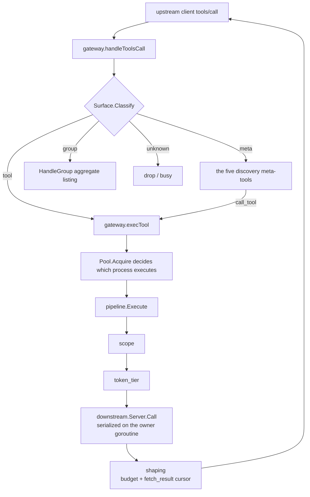

# Data Plane

The data plane is all the code on the path from "a `tools/call` arrives from an upstream client" to
"a result comes back from a downstream MCP server". It is made of nine packages, each responsible for
exactly one layer, with the boundaries between layers enforced by **types and dependency direction**
rather than by convention:

- `internal/downstream` owns **connections**: the lifecycle of a process/HTTP connection, the serialized
  call queue, the circuit breaker, retries, health probing, and the derived instance pool. It knows
  nothing about "what name a tool is exposed to clients under".
- `internal/router` owns **naming**: it aggregates the tools of multiple servers into one namespaced
  catalog and provides the single reverse-provenance lookup `RouteOf`. It knows nothing about who can
  see what.
- `internal/pipeline` owns **the execute path**: two gates in frozen order + the call + the shaping
  post hook. There is exactly one execution path in the whole repository, and the gate chain cannot
  fork.
- `internal/gateway` does only **assembly**: it wires the three layers above together with visibility
  (`internal/scope`), the discovery face, and the budget face, and handles the upstream MCP protocol,
  startup ordering, hot reload, and the control link. It implements no governance decision of its own.
- `internal/discovery` (including `toolsig`) owns **exposure**: what names the same visible tool set is
  presented under across the full / grouped / lazy modes, and the five meta-tools of lazy mode. It only
  computes and formats; it never executes.
- `internal/shaping` (including `toonenc`) owns **budget**: it trims a result down to a byte budget and
  hands the remainder back through a `fetch_result` cursor. It is a cost-saving mechanism, not a
  security boundary.
- `internal/ratelimit` is M2's optional face: quotas on calls. It deliberately adds **no** governance
  interface — it receives `*pipeline.Pipeline` itself, and what ratelimit wraps is the
  `CallRequest.Call` closure. ratelimit is already wired into the stdio gateway (see "current wiring
  status" for that package at the end of this document).

Two disciplines run through the whole collaboration and must be kept in mind before reading any of the
packages:

1. **An exposed name is an opaque handle.** Exposed names are generated as
   `sanitize(serverID) + "__" + sanitize(rawTool)`, but serverID and the tool name may themselves contain
   `__`, so splitting on `__` is ambiguous and is banned repository-wide. Any "get back from an exposed
   name to (server, tool)" must go through `router.RouteOf`'s map lookup.
2. **Failure directions are layered.** The gate chain (scope / token tier) is always fail-closed; the budget and cost-saving mechanisms (shaping, toonenc, ratelimit) are always fail-open
   and must be loud (log it, set the `Degraded` flag). Stuffing a fail-open thing into a fail-closed chain
   is exactly how a rate limiter becomes a bypass — which is why `ratelimit` is not a fifth gate.

The actual data flow of one direct call:



There is exactly one `execTool` in that diagram and exactly one `pipeline.Execute` — a direct
`tools/call`, lazy mode's `call_tool`, and the host-side skills provider all converge here. That is not a
style preference; it is the hard constraint in canonical.md §2.

---

## internal/downstream

**Responsibility in one sentence**: own the entire lifecycle of one downstream MCP server connection —
spawn/dial, handshake, serialized call queue, circuit breaker, retries, tool table cache, health probing,
and the derived instance pool that runs "one server as several instances".

### Key types and entry points

`Spec` is the runtime description of a downstream connection, translated uniquely from a
`registry.ServerEntry` by `SpecFromEntry` (gateway, daemon, and CLI all go through this one function, so
it is impossible for a new transport to land in one caller and be silently dropped in another). `Deps` is
the injected set of collaborators: logging, `secrets.Resolver`, `TokenSource`, dial override, circuit
breaker / retry / reconnect parameters, ping interval, and frame-level trace logging.

`Connect(ctx, spec, deps) (*Server, error)` performs "dial + `initialize` + first `tools/list`" and starts
the owner goroutine; the whole first connection is bounded by `Deps.ConnectTimeout` (default
`DefaultConnectTimeout` = 120s), a value deliberately set generously because a cold-cache npx/uvx startup
can take minutes.

`*Server`'s public surface is narrow: `Call` (issue a `tools/call`), `RefreshTools`, `Reconnect`, `Ping`,
`Health`, `Tools`, `OnListChanged`, `OnPeerRequest`, `Close`. `Pool` and `Lease` are the lifecycle
managers for derived instances. `ServerLog` is the per-server JSON-RPC frame log (off by default).

### Invariants and failure directions

**The owner goroutine plus the `calls` channel is the entire concurrency model.** Each `Server` has
exactly one owner goroutine consuming a capacity-1 `calls chan callReq` — serialization by communication,
not by mutex. The caller blocks inside `Server.Call` waiting on the `reply` channel (buffered(1), so the
owner never blocks writing a reply). This way a sleeping retry or a slow downstream consumes the owner's
time, not the caller goroutine's. Three `callKind`s run on the queue: `kindCall` (subject to the circuit
breaker), `kindRefresh` (`tools/list` re-query), and `kindPing` (health probe, exempt from the breaker).

**The circuit breaker decision happens before enqueueing.** `enqueue` calls `br.allow()` before pushing
into `calls`. That ordering is hard: during cooldown the caller fails immediately (`ErrCircuitOpen`) and
never occupies a queue slot. Breaker parameters: `FailureThreshold` (default 3) consecutive health
failures opens the circuit, and after `Cooldown` (default 20s) one half-open probe is allowed. Only one
probe may be in flight at a time during half-open. Receiving a straggler's failure while already open does
not refresh `openedAt` — otherwise a string of stragglers could extend the outage window indefinitely.

**Only `transport.ClassUnavailable` counts as a health failure.** An ordinary error response
(`ClassFatal`) proves the connection works and in fact **resets** the failure streak; context cancellation
is neutral (a half-open probe calls `releaseProbe`, so the next caller can probe immediately).

**Retry semantics cover exactly two classes.** `execute` retries only on `transport.ClassRetry`, i.e.
errors that prove the request never reached the server, plus JSON-RPC code 429 (`codeRateLimited` in
`retry.go`, an M0 judgment call: the stdio transport itself never produces `ClassRetry`, but some stdio
servers wrap an HTTP-style 429 into a JSON-RPC error). I/O errors after the send, and ordinary error
responses, are **never retried** — `tools/call` is not idempotent. A `RetryAfter` hint is honored and
jittered upward (only added to, never reduced); with no hint it is exponential backoff plus 50–100% jitter,
defaulting to 3 attempts / 25ms base / 1s cap.

**A failed half-open probe rebuilds the connection once.** If this call is the half-open probe and it ends
in a health failure, `execute` rebuilds the connection through the dial factory and retries the probe once
on the new connection. This acknowledges a residual window: a process that dies mid-call may lead to double
execution; that is the accepted price of probe semantics.

**The reconnect counter survives successful reconnects.** `Server.reconnects` is the exponent for reconnect
backoff, and `respawn` **does not reset it** on success — a repeatedly crashing server must climb the whole
backoff ladder rather than hammering the launcher at base delay forever. Only `Reconnect()` (an explicit
human action) resets it, and it resets both before and after: once so this attempt doesn't wait out the
backoff, and once afterward so a manual reconnect isn't counted as an automatic one. The reconnect ladder
and in-call retries use **two separate parameter sets**: `withReconnectDefaults` gives 250ms base / 30s cap,
because the cost of a reconnect is a process start. The first reconnect (`n == 1`) does not wait, and the
exponent is capped by `min(n-1, 16)`.

**HTTP 410 Gone is terminal.** `ErrEndpointMoved` is neither retried nor reconnected (a reconnect would only
reproduce the 410), and it carries the frozen remediation text `movedHint` ("update the configured URL: …")
— the error text itself is a contract, with tests asserting it.

**Ping probing and the circuit breaker are two different things.** The breaker governs tool calls; the probe
observes the connection. A probe that the breaker could reject would never see recovery, so `kindPing` is
exempt from the breaker. The decision rule: **a JSON-RPC error response from the server counts as alive**
(old servers answer `ping` with method-not-found; the round trip completed, which is the only conclusion a
liveness probe is entitled to draw). Three consecutive transient failures flip to `ConnError`; the
`hardConnError` set (ECONNREFUSED / EHOSTUNREACH / ENETUNREACH / ENETDOWN / `ErrEndpointMoved` /
`transport.ErrClosed` / `os.ErrProcessDone` / `io.ErrClosedPipe`) flips on the first occurrence. Background
probing is opt-in: with `Deps.PingInterval == 0` there is no prober, and a single short-lived stdio gateway
should not pay that cost. A single ping has a 10s timeout so it can't pile up behind a wedged server's queue.

**`tools/list` does leader/waiter coalescing; `tools/call` never coalesces.** `listMerge` makes concurrent
refreshes do a single round trip, with waiters inheriting the leader's result — correct for a refresh (both
would have hit the same connection anyway) and wrong for a non-idempotent `tools/call`, so the merger is used
for this one method only. One detail: if a waiter inherits **the leader's own context error** (the leader's
caller hit Ctrl-C) while its own context is still alive, it promotes itself to leader and retries once, and
only once.

**Secret resolution is fail-closed.** `${SECRET_X}` is expanded against the vault **at dial time** (so a
rotated key takes effect on the next reconnect, and resolved credentials don't linger inside config values).
An unresolved placeholder is an **error**, never passed through verbatim: sending the literal
`${SECRET_GITHUB_TOKEN}` upstream produces a 401 indistinguishable from "token expired", and operations will
go debug the wrong thing; expanding to an empty string is worse still, turning an authenticated endpoint into
an anonymous one. Errors mention only the KEY name, never the value.

**Vault composite keys and the `_global` fallback.** `resolveScoped` first looks up
`(serverID, spec.ScopeName, key)` and on a miss falls back to `(serverID, "_global", key)`. That fallback is
what makes derived instances usable: operations store `GITHUB_TOKEN` once and every root-derived instance
inherits it; storing a value under a specific scope **overrides** just that derivation. A vault **error** at
either level aborts outright — a broken keychain must never quietly downgrade a scoped credential to a shared
one.

**Derived instances: `Spec.ID` never changes.** Derivation specializes only the connection parameters
(`${ROOT}` expansion in `Args` / `Env` values / `Cwd`, plus explicit `Env` overrides); `Spec.ID` stays the
baseline server id, so `router.RouteOf` remains the sole provenance for the call, scope intersection still
matches on `(serverID, rawTool)`, and the operator's config keeps the name. The only thing
that changes is `Spec.ScopeName` (= derive key), which lets a derivation hold its own vault entries. `URL` and
`Headers` are **deliberately not derived** — changing a header does not need a new connection, and per-call
RoundTripper injection is enough (the "headers-only fast path"). `expandRoot` leaves the placeholder verbatim
when the root is empty rather than expanding to an empty string: `--project ` or a `""` cwd would silently run
in the wrong directory, while an unexpanded placeholder fails loudly at spawn.

**Four properties of `Pool`**: LAZY (dial only on first `Acquire`, using the caller's context and the same
`Deps`), reference counting plus **deferred close** (`Release` only starts the idle clock, and `Sweep` does the
actual closing, with `IdleTTL` defaulting to 30 minutes and a 5-minute sweep interval; an agent flipping between
two roots should not restart a process on every switch), a **cap** (4 derivations per server by default; over
the limit it returns the baseline instance with `Lease.Fallback` set and a warning logged), and **cascading**
(`CloseKey` takes down every instance for one derive key across all servers, including those still referenced —
the session is already dead, and waiting on it would only keep processes hanging for a client that will never
receive a reply). The failure direction is explicit: **a derivation that cannot connect is an error and never
silently falls back to the baseline instance**, because that would execute the call with the wrong cwd/env/
credentials, defeating precisely the isolation operations asked for; only the "cap", an operator's self-imposed
limit, falls back.

**That carve-out is contested, and the argument for it is weaker than the sentence above admits.** A security sweep
found the fallback and read it as exactly the harm the rule forbids. Two corrections to the framing here: the cap is
driven by **client-supplied roots**, not by operator configuration, so "an operator's self-imposed limit" understates
who can reach it — any client rotating through more than `MaxPerServer` roots for one server inside the `IdleTTL`
window gets there. And the degradation is not only cwd/env: the baseline instance resolves secrets under the **base
`ScopeName`** rather than the derive key, so a scoped vault lookup silently returns another scope's answer. That is a
credential crossing a boundary, which is a different class of harm from a shared working directory.

Kept as-is for now because reversing it is a decision with a cost, not a bug fix: `pool.go:219-231` erroring at the cap
turns a degraded call into a hard failure on **every tool of that server** until the sweeper reclaims, breaking
configurations that work today, and `TestDerivedInstanceCapFallsBackToBase` pins the current behaviour with its
rationale ("degraded sharing beats an unbounded process fan-out"). **The middle option, which needs no reversal of the
rule above: keep the fallback, but refuse it when the baseline would resolve secrets under a different vault scope than
the derivation asked for.** That closes the credential half and leaves the process-count argument intact. Whichever way
it goes, this paragraph and that test move together.

**A startup crash must leave evidence.** The handshake failure error embeds the last 20 **lines** of the child
process's stderr (each line truncated to 400 bytes, joined with ` | `). This is a **projection** of
`transport`'s 4KiB byte window rather than a second capture; when the window fills, the first line is dropped,
because a 4KiB cut lands mid-line and half a line is worse than no line.

**Where frame logging lives.** `ServerLog` sits in this layer rather than in `internal/mcp/transport`, because
transport depends only on the standard library and knows neither server identity nor the data directory,
whereas here we have both and the frames are still complete (params going in, raw result coming out).
`callTransport` is the **only** place where frames cross the downstream boundary, so it is also the only place
feeding the trace log. Log writes go through `jsonl.Writer`, dropping rather than blocking under backpressure —
a trace log must not slow down a tool call. Methods on a nil `*ServerLog` are no-ops, so callers need no nil
checks.

**Who supplies the log, and why it is a function.** `Deps.TraceFor func(Spec) *ServerLog`, not a `*ServerLog`
field — the same shape as `AuthFor` beside `Auth`, for the same reason. One `Deps` is shared by every server and
every derived instance of a gateway, while a `ServerLog` is bound to the server id it was opened with, both in
its file name and in every frame's `server` field. A single shared log would therefore file every server's
frames under whichever server opened it. There is no assembly for which that is correct, so no plain field is
kept as a fallback. `internal/gateway`'s `traceLogs` is the mapping's owner (`trace.go`).

**One file per server, several instances inside it.** Derived instances of one server share that server's single
log, because the file is named for the server rather than for a connection. Each frame therefore carries the
instance's `DeriveKey` as `inst`, last in the struct and `omitempty`, so a base connection's line stays
byte-identical to one written before the field existed.

**The switch is `ServerEntry.Trace`, applied as the log's enabled state**, and a log is opened for **every**
server rather than only for traced ones. That is load-bearing: `Server.trace` is captured once at `Connect`, so
a nil handed out there could never be filled in later, whereas a disabled log can be enabled in place. It is
what lets `agenthub server trace <id> on` reach a client that is already running without reconnecting the very
server being debugged (`TestHotReloadServerTraceFlip` pins both halves: frames appear, dial count stays at one).

**Failure direction: fail-open, deliberately.** Every failure here — unresolvable logs directory, unwritable
path, a dropped line under backpressure — degrades to less tracing and never to a failed call. A trace is a
debugging aid; the one thing it must not do is take the data plane down with it. The opposite direction applies
to the switch itself: it is off unless the registry says otherwise, because frames are captured at the
connection, before anything else touches the bytes, so the file holds raw downstream results.

**Three HTTP-side concerns live in this layer**, because the transport facade is pure standard library and is
not allowed to know about them: SSRF blocking (`netguard.DialControl` acts on the **resolved address** and opens
a hole only for `ProvenanceLocal` plus a **literal** loopback — RFC1918/CGNAT/link-local are blocked even for
local servers, because cloud metadata services and intranet hosts live in those ranges; hostnames are never
resolved, since a DNS answer may deny trust but must never grant it); `${SECRET_X}` expansion; and bearer
credential injection with **one** refresh and **one** replay after a 401/403. This is the only place in the whole
repository that repeats a non-idempotent call, and the justification is: the 401/403 is decided by the server
**before** dispatching the call, so the rejection itself is proof that the request had no side effects; and the
request is only rebuilt when `GetBody` makes it replayable. An explicitly configured `Authorization` header
always beats a vault credential.

**The token cache is per connection, and it must never outlive the vault's version of the truth.** The
credential is read once and held for the life of the round tripper — the alternative is a keychain round trip
on macOS for every single request. But the writers of that vault are *other processes*: `agenthub auth login`,
and the daemon's proactive refresher, neither of which holds a handle on a live round tripper. Nor can the
registry hot-reload plane help, because `specEqual` compares URL/args/env/headers and credentials are invisible
to it — a vault write produces no diff and no reconnect, and that is deliberate: putting credentials into the
registry's comparison surface would mean the registry holds secrets. So the cache has three rules, each pinned
by its own test:

- **A miss is never cached.** Only a hit sets `loaded`. A server enabled before its credential existed
  (`server add` → `server enable` → `auth login`) would otherwise hold the empty string forever, and on a
  server that answers anonymously no 401 would ever arrive to correct it.
- **A 401/403 re-reads the vault before renewing.** The rejected credential is often just this connection's
  stale copy. A read burns no refresh token and prompts nobody, so it is tried first; the `tok != stale` guard
  is what keeps it from swallowing the genuine renewal path, since re-reading the same rejected value proves
  the vault holds nothing newer and the OAuth grant still runs.
- **A moved credential epoch drops the cache.** The first two rules are both *reactive* — they need a request
  to have been rejected. A credential **rotated** while the one in hand is still accepted produces no
  rejection at all, so the daemon's refresher could never deliver its work to a live connection. The
  announcement plane below supplies the missing signal, and `WithEpoch` is how a source opts into it; a source
  without one keeps the reactive contract exactly.

**The announcement plane** (`internal/secrets/announce.go`) is what the vault has instead of the registry's
revision counter. `<data>/secrets/credentials.rev` records server ids and a monotonic counter and **nothing
else** — that is what lets it sit unencrypted beside `secrets.enc`, and a test asserts a stored credential
never appears in it. It is a file of its own rather than a watch over the vault's storage because a credential
may live in the OS keyring, where replacing a value in place changes no file at all — precisely the most
common case, a refreshed token.

`Chain.Set` / `Chain.Delete` announce, because they are the one choke point every credential travels through:
`auth login`, `secret set` and the daemon's refresher all land there, so no caller can forget. The failure
direction is fail-soft in both halves — an announcement that cannot be written, or a `credentials.rev` that
cannot be parsed, degrades to exactly the behaviour of the release before it, because every consumer still has
the reactive path it always had.

What a gateway does with one depends on the server's state (`internal/gateway/credwatch.go`): **connected** →
bump the epoch, so the next request re-reads the vault and *nothing reconnects* (the daemon rewrites the vault
every 60s; reconnecting per refresh would be a storm, not a fix); **not connected** → wake its re-dial rung, so
a login that repairs a rejected handshake is not made to wait out a backoff earned before the credential
existed. Epochs are keyed by server and not by scope, because a derived instance inherits its base server's
login and one counter has to invalidate every instance.

The failure all of this prevents is the expensive kind to diagnose: the gateway lists the server, and every
call to it 401s until the client is restarted. Note what does **not** close that on its own — the 401 retry
hangs off a live connection's round tripper, so it repairs a credential that expired under a working
connection and can do nothing for a handshake that never completed. That case needs the re-dial ladder
(`internal/gateway`, below), and the announcement plane is what makes it prompt instead of eventual.

### Current wiring status

`internal/gateway` uses only three `Deps` fields — `Log` / `Dial` / `ConnectTimeout` — and `specsFromSnapshot`
accepts only the stdio transport. So HTTP transport, secret resolution, OAuth refresh, background ping, and
frame tracing are all **unwired** on the gateway path; they are used by `internal/cli` (`server test`, `doctor`,
`vault`) and each has unit test coverage.

---

## internal/router

**Responsibility in one sentence**: aggregate the tools of several downstream servers (plus host-supplied
`Provider`s) into one namespaced, deterministic catalog, and provide the only legal reverse provenance lookup.

### The aggregation contract

Live aggregation and cache aggregation run through the **same** `build` core, so a cache-served `tools/list` cannot
drift from the live catalog. `*Router` is an immutable snapshot, rebuilt and atomically pointer-swapped on change.

`RouteOf(exposed) (Route, bool)` is the only legal reverse mapping: a pure map lookup with zero string parsing.
`Lookup` yields a nil `*downstream.Server` for cache-built entries — listable and routable, but **not callable**.
`LookupProvider` returns true only for host-supplied entries, so a caller cannot mistake a real server's tool for
one the host serves.

`Provider` is a tool source the host can serve itself (the skills pseudo-server is its first implementation). It
aggregates under **exactly the same** rules — same exposed name rules, same collision suffixes, same `RouteOf`
provenance, same scope intersection, same `pipeline.Execute`. The only difference is where the bytes come from.
`BuildWith` appends providers **after** servers, so a provider id colliding with a server id reports a duplicate
error and **the configured server wins** — the thing the operator can see and edit takes priority.

`Catalog` (`catalog.go`) is the tool catalog snapshot consumed by `internal/scope`: server → **raw** tool names,
sorted and deduplicated. Exposed names never appear here — scope intersection is keyed by raw names only (one of
the scope chain's invariants). Note that this and `internal/catalog` (the curated server catalog) are two different
things; A.4 has the ruling.

### Invariants and failure directions

**Exposed name generation is a deterministic three-part rule.** The base name is
`sanitize(serverID) + "__" + sanitize(rawTool)`, where `sanitize` replaces every rune outside `[a-zA-Z0-9_-]` with
`_`. Collisions are assigned `_2` / `_3` … ordered by ascending raw tool name with serverID as the secondary key;
if a generated suffixed name is itself already taken (say group `x` produced `x_2` and a base name `x_2` also
exists), the scan continues upward. Base name iteration proceeds in sorted order. The result: the same
servers/tools/policy always produce the same exposed names and the same `List` order, locked down by golden tests.

**Splitting on `__` is banned.** This is written in the package comment and is a repository-wide rule: serverID and
tool names may themselves contain `__`, so splitting is ambiguous. This package never does it, and every reverse
lookup goes through the map built at `build` time. Even the gateway's "does this name have a route" check calls
`routable()` → `RouteOf` rather than parsing the name; `discovery.IsBareName` is the only place in the repository
that inspects `__`, and its result is **used only for logging**, never for routing.

**Aggregation applies no policy.** The catalog built here is the full surface every configured server offers, and
narrowing happens once, above it, in `internal/scope`. There used to be a `Policy` here carrying two deny sets, and
removing it fixed a real defect as well as a duplicated mechanism: filtering at aggregation renumbered the collision
suffixes of a dropped tool's neighbours, so switching one tool off could silently change another tool's exposed name.

**`CatalogOf` skips nil servers.** A server that has vanished simply contributes no tools, and the scope layer
treats "does not exist" as "not visible" — the closed direction.

---

## internal/pipeline

**Responsibility in one sentence**: the repository's only `execute_call` pipeline — two gates in frozen order,
the downstream call, and the shaping post hook that spans both the success and error branches.

### The request contract

`CallRequest`'s `ServerID`/`RawTool` **must** come from `RouteOf`. Its `Annotations` field is the one where
**absence is itself information**: no annotations = destructive, fail-closed, which is what the token tier gate
reads.

**Every `Options` field may be zero**, and a zero-value `Options` assembles the M0 baseline (count + allow + pass
through), which is a documented "unauthorized assembly", not an error state.

`BlockedError` / `ErrBlocked` are the typed carriers of a gate rejection, and `Code` is a stable machine-readable
rejection code (`E_SCOPE_DENIED`, `E_TOKEN_TIER_DENIED`) — ABI the moment it ships.

### Invariants and failure directions

**The gate chain order is frozen: `scope → token_tier`.** A test pins it down. The first error short-circuits, and
the call never reaches downstream at all. Both gates decide from configuration alone — what an operator wrote down
before the client connected — and neither reads the call's arguments. An earlier chain had two more stages, an
argument pre-validator and a human approval gate; both were removed, and nothing replaced them.

**The concrete behavior and failure direction of the two gates:**

- `scopeGate`: `ScopeAllows(es, serverID, rawTool)` — this function is **shared** by the gateway's `tools/list`
  projection and by this gate, so "can be listed" and "can be called" cannot disagree. A `nil es`, an invisible
  server, and an invisible tool all return false (fail-closed). But "there is no scope authority at all"
  (`Options.Scope == nil`, or it returning nil, i.e. the cache-serving mode when the registry is unavailable) is
  decided **before** the call, and it allows — in that state there is no governance configuration to enforce.
- `tokenTierGate`: `TierCovers(req.CallerTier, ToolTier(req.Annotations))`. Coverage is decided by **level** (write
  can call read, destructive can call anything). Two closed directions: a tool with missing or unparseable
  annotations counts as destructive, and an unrecognized `CallerTier` string covers nothing. An empty `CallerTier`
  is the only allow case, and it is not a hole: it means "this assembly has no tier authority" — the stdio gateway
  serves a human's own session and the pipe carries no credential. Only the HTTP face (`internal/httpbridge`) mints
  tiers.
**Shaping runs exactly once, over the outcome.** Shaping a result twice would consume the cursor twice and could
leave a truncation banner pointing at bytes nobody receives. There used to be more in this hook — an injection scan
and a leak scan ran ahead of the budget, and their relative order was load-bearing — and the ordering rules went with
them. What is left bounds how much of the answer travels and retains the rest for `fetch_result`.

**The stage key is still `defend_and_shape`, and that is deliberate.** It names a stage that no longer defends
anything, which normally argues for a rename — but the gate-count parity assertions between the stdio face and
`inproc.go`'s HTTP face compare exactly these keys. Renaming one side leaves those tests green while comparing
nothing, which is a worse failure than an inherited name.

**A tool with missing or unparseable annotations is destructive.** The reasoning belongs to the tier vocabulary —
see [foundation.md](foundation.md).

**Dependency constraint**: this package may not import `internal/ctlapi` (canonical.md §2 rule 3, enforced by
depguard) — the data plane does not depend on the control plane.

### File map

| File | Contents |
|---|---|
| `pipeline.go` | The package contract, `CallRequest` / `Gate` / `Shaper` / `Options`, `New`, and `Execute`'s ordering invariants |
| `gates.go` | Frozen stage names and rejection codes, `ScopeAllows`, the scope and token_tier gates |
| `tier.go` | The operation tier ladder: `tierRank` / `TierCovers` / `ToolTier` |
| `shape.go` | `shapeStage`: the budget hook that runs once over the outcome |

---

## internal/gateway

**Responsibility in one sentence**: assemble and run the per-client stdio gateway (the implementation behind
`agenthub connect --client <id>`) — it speaks the upstream MCP protocol, brings up downstreams, and maintains the
catalog and visibility, but **implements no governance decision**.

### Key types and entry points

`Run(ctx, Config) error` is the only exported run entry point; `Config` requires `ClientID` / `In` / `Out`, and
everything else has production defaults. Two readers are additionally exported so the offline CLI reads the same
cache format the gateway writes: `LoadToolCache` for `agenthub server tool ls`, and `LoadToolCacheEntries` for
`agenthub server inspect`, which reports a cached catalog beside a live one and so must also say how old the
cached answer is. **One writer, and one decode** — the first is a projection of the second, dropping each entry's
`SavedAt`, which is what keeps two readers from disagreeing about the same files. `RootSource` is the migration seam frozen by A.5
#30: M0 wires in the roots protocol implementation `clientRoots`, and a future explicit-roots implementation from
clients.json will drop straight in, with scope resolution consuming the interface itself.

The internal core is the `gateway` struct: `rt` (current catalog), `cat` (raw-name projection), `catGen`
(incremented on every router swap, the key for the surface cache), `surface`, `lastScope`, `servers`, `pool`, `pipe`,
`cursors`, `guard`, `ctl`.

### Invariants and failure directions

**Startup ordering: answer first, connect after.** `initialize` is answered before any downstream is dialed, and
the downstreams connect concurrently in the background (the sequence is in [flows.md](../flows.md) §1). **A registry
load failure does not abort**: start with empty config, log a warning, and answer from cache. While the live router
isn't ready, `tools/list` is answered from cache (`router.BuildFromCache*`, the same exposed name rules) and
`tools/call` answers a **retryable** busy error (`-32000`).

**The cache directory trade-off branches**: when the registry is healthy, only the cached tools of "currently enabled
servers" are served; when the registry is broken, **all cached tools** are served — in that state we have no way of
knowing who is enabled, so "answer what we can".

**Not writing to disk after shutdown is achieved by sealing the resource, not by waiting on goroutines.**
`connectAll` starts one goroutine per downstream and **nothing joins them**: `shutdown()` waits on `handlers` / the
watcher / the credential watcher / the ctl link / the pool, but not on those. A connect that happened to win the race
against `lifeCtx` cancellation will go on to `persistTools`, so "the gateway has stopped" and "the gateway is still
writing to disk" can both be true at once. For a product that treats disk state as the source of governance truth,
this is more serious than the symptom it usually shows (a `<cache>/tools` growing back and breaking TempDir cleanup):
after a shutdown **triggered by a configuration change**, it may leave behind a catalog collected under the
configuration that was just replaced.

The fix is `toolCache.seal()`: `shutdown()` seals the cache as its very first act, after which `write` always returns
`errCacheSealed` and never touches disk. `mu` covers the **entire** `write`, not just the flag check, so `seal()` waits
for an in-flight write to finish — the guarantee is "the directory is quiescent once `seal()` returns", not "probably
quiescent".

**Why not just add a WaitGroup and wait for the connect goroutines.** `downstream.Connect` is bounded by
`ConnectTimeout` (default 120s, sized for cold launcher caches). Waiting on them inside `shutdown()` would promote "one
downstream that ignores cancellation" into "something that can stall shutdown for two minutes". That trades a bounded
small race for an unbounded stall — the worse direction. On the sealing path, the wait is at most a single file write,
and the invariant holds no matter how long the connect goroutines live.

**Scope is a query-time projection and never touches connections.** The entire reason `scope.go` exists is this
invariant: narrowing scope (a profile edit, a rebind) never disturbs a downstream connection; only a spec
change in `servers.json` triggers a reconnect. `currentScope()`'s failure direction: no registry store = no scope
authority, return nil (the pipeline's scope gate treats nil as no-authority mode); a store that **exists** but fails to
resolve returns an **empty** scope (zero visible servers) — an error must never widen visibility. `catalogFromRouter`
projects the router back into a raw-name catalog through `RouteOf`, likewise never splitting exposed names.

**`refreshScopeAndNotify` pushes only when the content hash changed.** Only a content change is worth a push; a rebuild
is not amplified. A content change may also have changed the discovery **mode**, meaning the client is looking at a
different surface: the cached surface needs no explicit invalidation (its key contains the scope hash), but `SearchGuard`
does — its streak describes a tool surface that no longer exists, so it gets `Reset()`.

**The surface cache key is `discovery.Key{Generation, ScopeHash}`**, with `catGen` incremented on every router swap and
the scope hash covering every visibility-relevant field. So "a stale surface" is structurally unservable — there is no
explicit invalidation logic, and therefore no possibility of missing an invalidation. Two concurrent requests each
building a surface for the same key is harmless (`discovery.New` is a pure function); the one built on an
already-replaced catalog is discarded.

**Hot reload: two channels, one funnel.** Both the local registry watcher (fsnotify + polling) and the daemon control
link (`LinkEventRegistry`) feed into `onRegistryChange`. A change notification **is only a notification, not a
snapshot** — the handler re-reads the registry itself and then adopts it through `Applier` under the
`generation >= applied` test. Blast radius is routed by document kind: `servers` goes to `syncServers` (diff the enabled
spec set, and only new/removed/changed servers get reconnected or closed, with all other connections retained — no
restart storms), `governance` triggers the skills face's switch sync (flipping the switch changes the **catalog**, so a
rebuild is mandatory), while `profiles` / `clients` / `governance` are all scope inputs and only invalidate, recompute,
and push if the hash changed, **never touching any downstream connection**. On a load failure the old config is retained
and the applied state **is not advanced**.

**`connectOne` has a stale-definition check.** After connecting it re-confirms that "this spec still exists and hasn't
changed", and otherwise closes the freshly built connection — an expired definition is never wired into the catalog.
`specEqual` compares only connection-relevant fields.

**`execTool` is the gateway's only execution path.** Host-supplied providers (skills) are resolved **before** the
readiness check: they have no downstream to wait for, and calling them busy while other servers connect would be a lie.
Derived instance selection (`acquire`) happens **after routing and before the gate chain** — "which process executes" is
a per-call connection-plane decision, while routing — and therefore visibility, scope, and the quota key — is always
the baseline server. A routed tool's `inputSchema` / `annotations` are read from the **baseline** server's tool table, since a derived
instance by construction serves the same catalog.

**Unknown names are dropped fail-closed and never reinterpreted as meta-tools.** The one exception is carefully drawn: if
the name **has a route** in the catalog but isn't on the surface, then what's hiding it is **scope** — so the call
**still enters the pipeline** and is rejected by the scope gate with its stable rejection code, because 7.3 says the
enforcement point is at the gate. Only a name that resolves to nothing at all is dropped; and if downstreams are still
connecting at that moment, the answer is a **retryable busy** rather than "no such tool" — telling an agent that a tool
doesn't exist teaches it to stop asking.

**Cancellation semantics.** `tools/call` gets its own goroutine and its own cancel, so `notifications/cancelled` can reach
it. A cancelled request **sends no reply** (MCP contract: the receiver of a cancellation should not expect a reply).

**RootSource is a singleflight cache with generation checking.** Concurrent misses coalesce into one `roots/list` reverse
RPC (the prefetch and downstream peer requests race after every invalidation, and the client must see only one query).
`invalidate` increments `gen`, so an in-flight fetch discards its own (possibly stale) result. A client that declares no
roots capability gets an empty root set, and that **is cached too** — asking it would violate the capability contract. The
whole roots protocol is annotated `DEPRECATED-UPSTREAM`, and removing it will change only the `RootSource`
implementation, leaving callers untouched.

**`shapeResult` is the pipeline's `ResultShaper` seam, not a layer outside the pipeline.** That is why every execution
path is budgeted by the same rule — because it is applied in exactly one place. The cursor id is minted **before** shaping
(`Shape` needs to embed it in the truncation trailer); an unused id merely leaves a hole in an already-guessable sequence
and costs nothing. When the remainder can't be stored, the **complete result is delivered** rather than a page whose
continuation is already lost.

**Every logging/metrics face degrades on failure without affecting service.** If the JSON log file won't open, it degrades
to plain text; if the savings stream won't open, it becomes `nil`; if the tool cache directory is unavailable, caching is
skipped. If the control socket path won't resolve, only coordination functionality is lost.

**`inproc.go` is why the HTTP face has no second execution path.** `Conn`/`Open` attach the same gateway body to an
in-memory pipe, and requests are written into the **same frame reader** the stdio face uses. `Counters()` is the seam
that proves it: gate counts on the in-process path must match stdio exactly.

**`statereport.go` is where downstream runtime state comes from.** The gateway is the only process holding the
connections, so it is the only thing that can answer "how is this server doing right now" — it snapshots
`serverStates()` and reports through `POST /v1/gateway/{sid}/servers`, and the daemon only aggregates.

**How credentials enter this assembly.** `Config.CallerTier` is the operation tier of the **credential** this gateway
serves (minted from the agent token on the HTTP face, always empty for stdio — a terminal pipe carries no credential, so
there is no tier to enforce); it flows verbatim into `pipeline.CallRequest.CallerTier` and is compared by the token tier
gate, with no re-implementation of the decision in this package. `Config.ScopeLayers` is the entry point for a
credential's server allowlist and profile pin, wired to `scope.Sources.Extra` — the same `Merge` as the five persisted
layers, security fields intersecting, **narrowing only**. Neither field is used by `agenthub connect`, and their zero
values are exactly the stdio behavior.

### The re-dial ladder

A dial that fails records **why** (`connErr`) so the server reports as errored rather than as perpetually
connecting — and, until this plane existed, that was the end of it: the connection was never attempted again,
so every recovery cost a client restart whatever the cause. The server came up slower than the gateway, the
network blinked, a stdio child crashed on its first launch, or a credential arrived after a 401 had already
been answered.

`redial.go` gives each failed server a ladder: **5s, 15s, 45s, 135s, then 5 minutes forever**, armed by the
recorded failure and cleared by a success, so `connErr` and the ladder can never disagree about whether a
server is broken. Only the base is configurable (`Config.RedialBase`); the tick and the ceiling derive from it,
because two independent knobs would let a caller set a base above its own cap.

Three properties are load-bearing:

- **The cap is not decoration.** Without it a permanently dead server is dialed at the base delay for the life
  of the process, and for a stdio entry each rung is a process spawn.
- **The ladder is driven by a recorded failure, never by the tick.** A connected server is never re-dialed;
  a gateway that respawned healthy stdio children on a timer would be worse than the bug it fixes.
- **Dials are claimed per server** (`beginDial` / `finishDial`) across all three paths — startup, hot reload,
  re-dial — so a reload landing next to a due rung cannot produce two connections for one server. A reload
  that cannot claim a slot hands the server to the ladder instead of dropping it; otherwise a redefinition
  arriving while the previous definition's dial is still in flight ends up dialed by nobody, since that dial
  drops itself as stale when it lands.

Discovery mode rules out the cheaper design. In lazy mode a failed server's tools are absent from the catalog,
so no call can ever arrive to trigger a dial on demand: recovery has to come off a timer, not off traffic.

### Current wiring status

In `pipeline.Options` the gateway sets only `Scope` and `ResultShaper` — that is now the whole surface. TOON output
format, intent variants and pin sets remain **unwired** in the stdio gateway, even though each of those packages is
fully implemented and tested.

Rate limiting is the exception: it **is wired**, but not through `pipeline.Options` — quotas are an admission wrapper
around `CallRequest.Call` (`ratelimit.go` + `runCall`), not a pipeline stage.

---

## internal/discovery

**Responsibility in one sentence**: decide which names a session is shown and what an incoming name means — the three
exposure modes (full / grouped / lazy), lazy mode's five meta-tools, the lexical ranker, the search loop guard, and search
audit records.

### Key types and entry points

`Visible(rt, es) []Tool` projects the router catalog through the session's effective scope — using
`pipeline.ScopeAllows`, **exactly the same predicate as the pipeline's scope gate**. `New(Options) *Surface` freezes that
visible set into an immutable snapshot. `Surface`'s public face: `List()` (what `tools/list` answers), `Classify(name)`
(what an incoming name is), `Search` / `HandleSearch`, `Describe` / `HandleDescribe`, `HandleStatus`, `HandleGroup`,
`ResolveCall` / `ResolveCallVariant`.

`SearchGuard` **deliberately does not belong to** `Surface`: guard state is per-session, must outlive catalog rebuilds,
and yet must be reset on a scope change. Its lifecycle is the caller's (the gateway's) responsibility.

`PinSet` / `StaticPins` are the seam for configured pinning; `Trace` is the search audit record; `Error` is a typed
meta-tool failure with a stable code.

### Invariants and failure directions

**One scope, three enforcement points.** `tools/list`, `search_tools`'s candidate filtering, and `call_tool`'s route
validation all read the **same** `*scope.EffectiveScope`, and this package never re-derives visibility itself — `Visible`
projects once and `Surface` is the immutable snapshot of that projection. A tool not on the Surface cannot be listed,
found, or recommended. `describe_tool` also goes through the same `Surface.byExposed` map, so it is **structurally**
incapable of revealing a tool that search hid — a property of the code, not a rule anyone has to remember.

**Determinism is a contract.** The exposure set, the ordering, summary truncation, and every user-visible string are frozen
by golden tests. Ties always break on ascending exposed name and never rely on map iteration order. Scores are integers
precisely so "a tie" is exactly decidable.

**Unknown names fail closed.** `Classify`'s resolution order is fixed: meta names (where the mode allows them) → grouped
aggregate names → the visible tool set → Unknown. An unknown **bare name** (containing no `__`, superficially meta-tool
shaped) is treated exactly like any other unknown name. Under a cold catalog every name is unknown — that is the closed
direction, and it is deliberate. `exposesMeta` is narrower than `IsMetaName`: `call_tool` while variants are on, and the
three variants while variants are off, are merely **reserved** and were never **listed** to this session, so classifying
them as meta would open a door the client cannot see; they fall to Unknown.

**The trade-offs of the three modes**:

- **full**: every visible tool listed as-is.
- **grouped**: one `<server>_tools` aggregate entry per visible server plus one `call_tool`, servers+1 entries in total.
  The tool **count** collapses (the expensive part of full is schemas, and grouped ships not a single schema), yet the agent
  still **does not need to search**: each aggregate entry's description **names** that server's tools (up to
  `groupNameListLimit` = 40, with an overflow note stating how many more there are and how to get them). So discovery
  remains **exact** (a name is either printed or invisible), and only the schema is deferred by one round trip. `call_tool`
  is placed **last**, so the aggregate entries the agent should read first lead the way.
- **lazy**: the five meta-tools (frozen order) plus pinned tools. A pinned tool whose exposed name collides with a meta name
  is dropped — the meta face must never be shadowed (today every router-generated exposed name contains `__` and cannot
  collide, but the rule is **enforced**, not assumed).

**The five meta-tools' names and schemas are both ABI**: `status`, `search_tools`, `describe_tool`, `call_tool`,
`fetch_result`. The schemas are written as literals rather than marshaled from structs precisely so those exact bytes are
reviewable and golden-testable (agents are sensitive to wording). All meta-tool arguments are decoded with
`DisallowUnknownFields`: a misspelled argument must be a loud, recoverable error and never a silently ignored field — that
would let the agent believe it got something it did not.

**`call_tool` and `fetch_result` have no handler in this package, by design.** Execution must go through
`internal/pipeline` and pagination must go through `internal/shaping`, so this package stops at `Resolve` / `Parse`.

**Intent variants (ruling #18).** Lazy mode's single `call_tool` can be split into three independent meta-tools:
`call_tool_read` / `call_tool_write` / `call_tool_destructive`. It buys exactly one thing, and that thing is worth the extra
names: clients whose permission UI can only allow or deny a whole "tool" (Claude Code's allowlist and the like) can allow
`call_tool_read` while still requiring confirmation for writes. Validation uses **equality** rather than coverage
(`TierCovers`): if the destructive variant also accepted read tools, each variant would be a superset of the ones below, and
allowing the top one would silently grant everything — which is exactly the property the split is supposed to make visible.
So each tool has **exactly one correct door**, and the rejection text names which door to use, so the agent's next attempt
needs no second search. `callWithFor` is the **only** place that makes this choice, and `ResolveCallVariant` enforces the
same derivation at the entry point, so the pointer given to the agent and the check it must pass cannot disagree. Tools with
no annotations fall to the destructive variant (fail-closed). The variants switch goes into `Key.Variants`, because it
changes `tools/list` output and where `call_with` points while touching neither the generation nor the scope hash — without
it in the key, a governance flip would keep serving the old doors.

**`SearchGuard`'s state machine and its two deliberate asymmetries.** A new top name → streak = 1; the same top → streak++;
no results → reset; any **non-search** action (`ObserveOther`) → reset; a scope change (`Reset`) → reset. Escalation to an
imperative message requires streak ≥ `EscalateAfter` (3) **and** score ≥ `ConfidenceThreshold` (30). Asymmetry one: a
low-confidence top **still advances the streak but never escalates** — forcing an agent to call a tool the ranker itself
doesn't much believe in turns a weak guess into an instruction; if a later identical search scores above the line, the
accumulated streak escalates immediately. Asymmetry two: **escalation does not clear the streak** — an agent told to call
something and then searching again gets told again; only doing something else clears it. The guard tracks a loop, and it
isn't over until the loop is over.

**The lexical ranker's weights and calibration.** `weightName` 10 / `weightServer` 4 / `weightDesc` 2, multiplied by
`exactFactor` 3 or `prefixFactor` 1, plus a `coverageBonus` of 5 (rewarding coverage of more **distinct** query terms, so a
tool hit once each by "read" and "file" beats one hit twice by "read"). Each query term contributes at most once per field
and occurrence counts are ignored — stuffing repeated words into a description buys nothing. `minPrefixLen` 2 prevents
single-letter query terms from matching everything. The calibration of `ConfidenceThreshold` = 30: an exact tool-name term
match scores `10*3 + 5 = 35`, a description-only exact match scores 11, and a name-prefix-only match scores 15 — so
"confident" means "the query literally names this tool". Zero-scoring candidates are discarded: search should not recommend
what it has no reason to believe in.

**Query validation and privacy.** `MaxQueryBytes` 512, `MaxQueryWords` 64, and `MaxDescriptionTokens` 256 on the index side
(a malicious server must not be able to make every search expensive with a megabyte-long description). The check order is
fixed (empty → bytes → words), guaranteeing a query violating two limits at once always reports the same code. `Query`
**deliberately does not retain the original text**. `Trace` records only the query's **metrics** (byte count, word count) and
not one byte of content — a search query is free text the agent composed and may carry secrets, paths, or an injected
payload. Tool names and scores are safe (they come from the catalog, not the caller). Adding a field to this struct is a
privacy decision, and the golden test fails the moment someone adds a content field.

**describe_tool's "one error, no oracle".** Of the conceivable per-id errors (not_found / invisible / not offered by
this server), the implementation emits only **one**: `not_found`. Nonexistent, hidden by scope, and left out of a
server's allow list are indistinguishable in the reply — distinguishing them would turn describe_tool into an oracle
enumerating "the part of the catalog deliberately not shown to this session". This is the same rule `fetch_result` follows
for cursors and `ResolveCall` for names. `MaxDescribeTools` = 5, and exceeding it is **an error rather than a silent
truncation** — truncation would let the agent believe it saw everything it asked for. A call where none of the ids resolve
still returns a **non-error** reply (the call itself was well-formed, and turning it into a protocol error would deny the
agent the remediation text).

**Budget projection of search results (reshaped in M1.5).** **No** hit carries a schema anymore: each hit carries a
one-line compact signature (`toolsig`), and an agent that needs a schema goes and asks `describe_tool`. Rank 1 additionally
carries the full description; the remaining ranks carry a `SummaryMaxBytes` = 140-byte summary (a byte bound rather than a
rune count, because what we're defending is a token budget, and a byte bound is the only one that also holds for CJK;
truncation lands on a rune boundary). The `hit.lossy` flag is the pointer to "a describe round trip will tell you something
new".

---

## internal/discovery/toolsig

**Responsibility in one sentence**: render a downstream tool's JSON Schema into a **one-line** compact signature, dropping
the cost of one search result from "a whole schema" to "one line of text".

### Key types and entry points

`Signature` is the rendered result (`Text` plus lossiness information); `Options.MaxBytes` is the length budget. `Cache`
memoizes by input fingerprint, and `Shared()` is the process-level instance — catalog indexing (`Surface.buildIndex`)
`Warm`s the entire catalog into it, so a session's first search pays a map lookup instead of N schema walks. A second
instance is legal but silently wastes that warming, so unless a test needs isolation, use `Shared()`.

A signature looks like this:

```
read_file(path:str, encoding?:str="utf8", limit?:int) -> str
```

### Invariants and failure directions

**The grammar is frozen** (locked by `testdata/signatures.golden`):

```
signature := name "(" [param {", " param}] ")" " -> " type
param     := pname ["?"] ["~"] ":" type ["=" default]
type      := str | int | num | bool | null | any | obj | obj{k,k} | arr | arr<type> | enum{a|b}
```

**`?` marks optional parameters, not required ones.** The inverse (marking required parameters) would work too;
the ruling marks optional with `?` because in practice optional parameters are the minority, so the marker is rarer
and the line is shorter.

**`~` is an honesty marker.** It means the signature **cannot fully state** this parameter: a collapsed nested object, a
truncated enum, an oversized default, a union type, a surviving `$ref`, or a name listed in `required` with no schema at
all. It is the pointer to "describe_tool will tell you more".

**Parameter order is the only deterministic choice available.** First the required parameters in the **verbatim order** of
the `required` array, then the optional ones sorted by ascending bytes. JSON object member order does not survive decoding
into a Go map, and `required` is the only ordering signal the schema actually carries; everything else must be sorted, or it
isn't deterministic.

**Nesting expands exactly one level.** A top-level object parameter renders as `obj{key,key}` (the keys directly, sorted,
capped by `MaxObjectKeys`), and anything deeper is just `obj`; an array of objects is `arr<obj>`. Both collapses set `~`.

**`$ref` is not resolved.** `internal/router` inlines refs before definitions reach this package; anything that survives is
rendered as `any~` rather than chased — chasing it would mean this package holding a schema store.

**Failure direction: better to say less than to say more.** Every construct that isn't understood or supported becomes
`TypeAny` + `lossy=true`. A signature that says less than it knows is recoverable through `describe_tool`; one that says
more than it knows is not. An unparseable schema, or a schema that isn't an object schema, renders uniformly as
`name(~) -> type` — one shape, no guessing.

**The length budget truncates required-first.** Over `MaxBytes` the parameter list is cut and closed with `…+N more`.
Since optional parameters sort last, dropping from the tail drops the optional ones first; when required parameters really
must be dropped, that is declared the same way. Postcondition: as long as the skeleton (`name + "(…+N more) -> type"`) fits,
`len(Signature.Text) <= MaxBytes`. **The tool name is never truncated** — it is the key the agent calls with, and a truncated
key is worse than a long line.

**The cache eviction policy is clear-everything-when-full, not LRU.** The access pattern is "the same few hundred fingerprints
hit repeatedly until the catalog changes": LRU's bookkeeping costs more than an occasional clear-and-re-render, and a clear
cannot leak stale entries the way a mis-ordered LRU can. Fingerprints are hashed over length-prefixed
`(name, inputSchema, outputSchema, MaxBytes)`, so different input tuples cannot collide into the same byte stream.

---

## internal/shaping

**Responsibility in one sentence**: trim a tool result down to a byte budget and hand the remainder back through a
`fetch_result` cursor — a token-saving mechanism, not a security boundary.

### The two Store implementations

`Store` has two implementations: `MemStore` (used by the stdio gateway — **the process is the session**, so cursor lifetime is
by construction aligned with the client connection and nothing needs to outlive a restart) and `FileStore` (used by the
daemon's HTTP face — cursors must survive a daemon restart within the session TTL).

`Savings` / `EstimateSavings` provide token savings estimates, with fields corresponding one-to-one to
`savings.Record`, but this package **deliberately does not import** `internal/savings` (shaping is on the data path and
must not drag a file writer in with it); the caller copies the fields across.

### Invariants and failure directions

**Three design rulings fix the shape of the feature:**

1. Truncation cuts at a character (rune) offset within a **text** content block. Structured blocks are **never split** and are
   deferred whole. Page 1 preserves the original block structure; page 2 onward is a plain-text slice of the retained payload.
2. The recovery trailer is appended as the **last** content block and is **exempt from the budget** — it is neither truncated
   nor wrapped: a recovery hint the agent can't read isn't a recovery hint. So a
   page may exceed `Budget.Bytes` by exactly one trailer block.
3. `fetch_result`'s cursor id is an ordinary, **guessable by design** sequence (`rc-%06d`, process-global, not per-owner).
   **Owner (session) validation is the only isolation**, and unknown ids, expired ids, and other people's ids all return the
   **one** message `notFoundText` — distinguishable answers would turn a guessable id into a probing oracle.

**Owner comparison is constant-time** (`subtle.ConstantTimeCompare`), because this is an isolation boundary and must not
short-circuit at the first differing byte. And `Fetch` checks the owner **again** after `Store.Get`: the interface contract
requires implementations to validate, but this is an isolation boundary, so both sides check.

**The budget is an economic mechanism and is fail-open throughout.** Every unexpected input — an unparseable content array, a
missing cursor id, an absent owner, a remainder that can't be stored — delivers the **untruncated** result rather than destroying
it. The closed direction belongs to `internal/pipeline`'s gates; losing a caller's data to save tokens is a worse failure than
spending more tokens.

**The never-larger guarantee.** The trailer isn't free, so for a result that only barely exceeds the budget, the trimmed page can
be **more expensive** than the original. `shape` does one final comparison: if `actualBytes >= baselineBytes` it reverts to the
original result — every dimension must improve (fewer bytes **and** no data withheld).

**Pagination walking rules.** `paginate` fills the budget in order, stops at the **first segment that doesn't fit**, and defers
everything after it. Preserving order is precisely what makes "rune offsets after linearization" meaningful. Structured segments
are all-or-nothing; text segments are splittable, but if the slice would be smaller than `minPartialBytes` (16 bytes) the whole
block is deferred — a two-character page plus a trailer costs more than it delivers.

**The byte accounting is exact.** `escapedRuneLen` precisely reproduces `encoding/json`'s string escaping overhead (including the
HTML escaping that is on by default), with invariant tests aligning it to the standard library, so emitted block sizes are
**predictable** rather than estimated. All slicing lands on rune boundaries, so no page can ever split a UTF-8 sequence.

**`Fetch`'s boundary behavior.** A negative offset clamps to 0; an offset at or past the end serves an **empty page** (a success,
not a miss) — offering a recovery hint when there is nothing left would be a lie. `page` has an "always deliver at least one rune"
backstop to prevent a livelock that can never advance.

**Durable caching uses ordinary files, not an embedded database (the ruling in appendix A.6 #2).** The path is
`<data>/cache/shaping/<sha256(owner)>/<cursor>.json`, written atomically (temp file in the same directory → chmod 0600 → fsync →
rename), with a TTL sweep at construction and on demand. The reasoning: M0–M1 is under a house rule of zero new third-party
dependencies; the access pattern is a single-key point lookup with no queries, no transactions, and no cross-key consistency
requirement; and a corrupt entry must degrade to "lose one cursor", which per-file storage gives for free (skip that file), while a
single-file database would need a whole recovery mechanism to achieve it. The owner-hashed directory merely moves one session's
cursors out of another session's path; it is **not** isolation — `Entry.Owner` is verified on every read.

**`validID` is both a shape check and a path safety check**: `FileStore` turns an id into a filename, so anything with a separator,
a dot segment, or an unexpected byte must be rejected before it reaches the filesystem.

**The ordering invariant for format re-encoding.** `Reformat` sits at the very end of the delivery path, **after**
the budget has been applied, so nothing downstream of it can invalidate the byte counts the truncation trailer
describes. Its rewrite scope is also fixed: it touches only `text`
blocks, and only those whose payload is a single JSON document; `structuredContent` is **never** re-encoded (that is the
machine-readable channel, clients may parse it, and TOON does not round-trip); and the contract marker `toonenc.HeaderLine` is
emitted at most once per result, on the first block actually re-encoded.

---

## internal/shaping/toonenc

**Responsibility in one sentence**: project JSON into TOON (Token-Oriented Object Notation), a compact **display** encoding, and
hand it over only when it actually saved bytes.

### Invariants and failure directions

**The primary ruling (canonical.md §7 #4): TOON is a one-way projection.** The encoded document is a display projection for a
language model to **read**; it **does not round-trip and no decoder is provided**. Round-tripping would require a type tag on every
scalar (a bare `1` is indistinguishable from `"1"`, and a bare `true` from `"true"`), and those tags are exactly the tokens this
encoding exists to save. So the encoder quotes only where a reader might be misled, and the caller uses `HeaderLine` to state the
contract in place: the result is TOON, the arguments are **still** JSON. Anything that needs to round-trip —
`structuredContent`, tool arguments, cursors — stays JSON and never enters this package.

**Two constructive guarantees:**

1. **Never larger.** `Consider` re-encodes and compares, and a document that didn't beat the JSON form by `MinSavingsPct` (10% by
   default) is returned verbatim with a `Decision` explaining why. So the caller can always use the return value directly without
   doing its own size check. The reasoning behind the 10% line: winning 1% isn't worth teaching a model a second notation mid-
   conversation, and 10% is. All comparisons use integer arithmetic — floating-point comparison would make the accept/reject
   boundary depend on rounding, and that boundary is what golden tests assert.
2. **Numeric fidelity.** Decoding uses `json.Decoder.UseNumber`, so integers beyond 2^53 travel as literal text and are emitted
   byte for byte. No value ever passes through a `float64`.

**The table form is the point of the whole encoding.** A list qualifies for a table when: it has at least `MinTableRows` (2)
elements, every element is a non-empty object, all elements have **exactly the same key set**, every value is a scalar, and the
column count doesn't exceed `MaxTableCols` (32). The columns are the sorted key set, and the header states the row count, so a
truncated table is still self-describing. Rows are values joined by `,` in column order — the delimiter is **fixed and never
inferred**. Lists that don't qualify use `- ` per element; non-scalar elements are written as a block one level deeper whose first
line's indentation is overwritten by the `- `, giving the YAML shape readers already know.

**Object keys are sorted by ascending bytes.** No Go decoder preserves JSON object order, sorting is the only deterministic choice,
and determinism is a contract.

**Quoting rules.** Strings are written bare by default and quoted (`strconv.Quote`) only when they could be misread: empty, leading
or trailing whitespace, containing `, : " \ #` or a control character, starting with `[` or `{` or a list dash, or parseable back as
a number/true/false/null. Keys and column names are additionally quoted when they contain internal whitespace. Everything else —
ordinary prose, paths, URLs — is bare, and that is where the byte savings come from.

**Budget truncation lands on line boundaries** and appends the frozen `TruncationMarker`
(`…truncated by agenthub: %d of %d lines`). Truncation is honest and visible and never cuts mid-line, so a truncated table is still
parseable by eye.

**Values beyond `MaxDepth` (12) render as one line of compact JSON**: malicious input must not be able to drive unbounded recursion,
and nobody was going to read a pathologically deep document anyway.

**Failure directions are all open.** Not a single JSON document, an encoder error, blank input — all return the input verbatim.
Re-encoding is a cost-saving mechanism, and mangling a tool result to save tokens is far worse than spending more tokens.

**This package depends only on the standard library**, reports only byte counts, and leaves the bytes→tokens conversion to
`internal/shaping` — the parent imports this package, so the estimator cannot come back down (it would be a cycle).

---

## internal/ratelimit

**Responsibility in one sentence**: cooperative call quotas sharing one counter file across processes — this is **resource
governance**, not a security control.

### The quota dimension

`Key{Client, Server, Tool}` uses the **post-routing** values (`RouteOf` provenance) and never the exposed name — a
rename should not change which quota a call spends.

### Invariants and failure directions

**Why it is not a third gate.** The frozen gate chain (scope → token tier) decides whether a call is **allowed at all**, and both
gates are fail-closed. Quotas decide whether an already-allowed call happens **now or a few seconds from now**, and they are
fail-open. Mixing the two would stuff a fail-open stage into a fail-closed chain — which is exactly how a rate limiter becomes a
bypass. So `StageName` is deliberately **not** any of the `pipeline.Gate*` values.

**Its position is achieved structurally, not by adding a stage.** By wrapping `CallRequest.Call` it lands "after **every** gate,
immediately before the downstream call", so a call a gate rejected never consumes a token.

**`ExceededError` unwraps into two errors at once** (Go 1.20 multiple unwrap): `*pipeline.BlockedError` (so
`errors.Is(err, pipeline.ErrBlocked)` still holds for any caller classifying gate rejections) and `*mcp.Error` (so the gateway's
existing `errors.As(*mcp.Error)` path answers the client a JSON-RPC error with `data.retryAfterMs` directly, without a single line
of gateway change). The JSON-RPC code is `-32001` (`-32000` is already the gateway's busy).

**Multi-process correctness is the entire reason this package exists.** N gateway processes (one per client) plus the daemon share
`<data>/state/ratelimits.json`. The reference implementation (toolport's `rate_limits.rs`) reads the file, decides, and writes its own
in-memory copy back — when two processes race, each writes a state that never saw the other's increment, and the quota silently
doubles. The fix here is three things:

1. **A dedicated lock file** `<data>/state/ratelimits.lock`, holding an exclusive flock across the entire read-decide-write cycle.
   The reason it is **a different file**: the data file is replaced by rename, and locking an inode a concurrent writer is about to
   swap out protects nothing.
2. State is **re-read from disk every time** inside the lock. No decision is ever made against a cached copy, so merging is
   read-modify-write, never last-writer-wins.
3. The data file is written atomically (temp file in the same directory, fsync, rename, fsync parent directory), so a reader outside
   the lock — or a crash mid-write — can never see half a file.

Counters are integer **millitokens** (`tokenScale` = 1000), never floating point: this keeps the on-disk bytes identical on every
platform, makes the file golden-testable, and keeps the multi-process read-modify-write merge from drifting on floating-point
rounding.

**Rule evaluation is all-or-nothing.** `Allow` does two passes: the first evaluates every matching rule against the state just read
from disk, and if any one of them is out of tokens it returns immediately and **writes nothing**; only the second pass deducts.
Reasoning: if rule A has tokens and B does not, spending A's token bills a call that never happened, and a long enough stream of
rejections would starve A permanently.

**All matching rules are enforced (logical AND); there is no "most specific wins".** Quota sets merge in the same direction as every
other governance field in this repository: monotonically tightening. A narrow rule may only restrict further and can never unlock what
a broad rule forbids. Dimension matching supports only "exact" and `Wildcard` — no prefixes and no globs, because a half-understood
pattern language is precisely how a quota ends up governing nothing.

**Buckets are token buckets, not fixed windows.** Capacity is `Limit`, refilled at a rate of `Limit` per `Window`, so a burst of
`Limit` is allowed followed by smooth rate limiting; a fixed window would let `2*Limit` through at a window boundary. `retryAfter` is
rounded up to milliseconds and is **never 0** — telling an agent to retry in 0 milliseconds means it retries immediately, gets
rejected again, and that is a hot loop.

**`Duration` accepts strings only.** A bare number `60` in config is ambiguous between seconds/milliseconds/nanoseconds, and that
ambiguity gets discovered in production in the form of a quota that is off by 1000x.

**The failure direction splits in two by timing.**

*Fail-closed at assembly* — when rules **are configured**, `New` rejects three cases: an invalid rule set (`Validate`); a build
without a cross-process file lock (`flock_stub.go` — no longer darwin/linux/windows, all three of which set
`crossProcessLockSupported = true`; on a build that lacks it, counts would silently multiply by the number of gateway processes); and a
counter file that can't be locked/read/replaced right now (`probe` tests once rather than leaving it for each call to discover). All
three are the same rule: **if you claim a quota you must honor it or error**, never silently ignore it. With no rules, none of the
three trigger — an empty rule set is a no-op that doesn't even touch the filesystem.

*Fail-open at call time, but loud* — a counter file that becomes corrupt/unreadable/unwritable at runtime lets the call through, sets
`Decision.Degraded`, logs a warning, emits an `Event`, and (when corrupt) quarantines the bad file once. Reasoning: a rate limiter is
not a security boundary, and a counter that breaks at 3am must not become an outage for every agent on the machine. A counter file
with an unknown version is treated identically to a corrupt one: quarantine, restart from empty, never half-interpret.

**"Loud" is not rhetoric; it is the entire precondition for fail-open being acceptable.** What an attacker wants out of a rate limiter
is exactly a **silent pass**: the counter file can't be read, the call runs anyway, and nothing anywhere records that the quota stopped
applying. So every uncounted pass **both logs and emits an `Event`**, and the assembler must wire up both `Logger` and `OnEvent` —
"the quota didn't fire" and "the quota isn't running" must never look alike.

**`Event` is only reported on DENIED or DEGRADED.** A quota that emits an event on every call would drown its own
signal in non-events. Events carry identifiers only — no arguments, no payloads.

**File size is self-limiting**: buckets idle beyond `idleTTL` (1 hour) are dropped (a bucket untouched that long has already refilled,
so dropping it is equivalent to keeping it), and when the total exceeds `maxBuckets` (4096) the **least recently updated** are dropped
— dropping a stale bucket is safe (it reappears as a full bucket), while dropping a hot one would pardon an active abuser.

**`ConfigFromGovernance` is the single translation from governance.json to a rule set, and one bad rule vetoes the
whole document** — a partially applied quota set is a quota set nobody can reason about.

### Current wiring status

**Wired** (stdio gateway), in three places:

1. `internal/gateway/ratelimit.go` — builds the limiter from `governance.json`'s `rateLimits` via `ConfigFromGovernance` (with the
   `<data>/state` `Store` reused across rebuilds) and hot-reloads on governance document changes.
2. `runCall` in `internal/gateway/upstream.go` — the single `CallRequest` construction point, where `Guard` wraps the call closure.
   Both a direct `tools/call` and lazy mode's `call_tool` land here, so there is only one enforcement point.
3. `Event` is wired to the gateway logger: rejections log a warning, and **degraded (uncounted pass) logs an error** — letting a call
   through when the limiter can't read the counter file is intentional (it is not a security boundary), but that pass must leave
   evidence, or "the quota isn't being enforced" looks exactly like "the quota didn't fire".

The failure direction splits in two by timing: **fail-closed at assembly** (unparseable rule set, a build without a cross-process
lock, a counter file unusable right now → `New` errors → the gateway refuses to start), and **fail-open but loud at call time** (the
file breaks at runtime → allow + `Degraded` + log + `Event`). A governance edit that fails at runtime retains the last usable rule set:
refusing service would turn an unrelated config typo into an outage for running agents, while degrading to "no quota" is precisely the
silent widening this package refuses.

Rule sets live at the **global layer only** and do not enter the three-layer scope chain — the reasoning is in the comment on
`registry.GovernanceDoc.RateLimits` (the rule patterns already carry client/server/tool dimensions; counter buckets are keyed by rule
pattern, and the same pattern appearing at multiple layers would split one quota into one per layer).

---

## Appendix: faces implemented in this layer but not yet wired

Package-level completeness and whether the runtime actually reaches it are two different things. Everything below is
**code-complete with its own tests**, but the assembly layer hasn't connected it. It is listed here because "thinking something is in
effect when it isn't" is far more dangerous than "knowing it isn't done".

1. **`fetch_result`'s `limit` parameter is accepted but has no effect.** The field is in the frozen schema, and
   `gateway/handleFetchResult` explicitly doesn't honor it — page size is determined by the shaping budget of page 1, and that budget
   is stored alongside the entry. The field is retained so that the wire shape doesn't change when it eventually lands.

2. **A batch of switches not yet wired.** `internal/shaping`'s `FileStore` and `Reformat` (TOON output) have no callers, and
   `discovery.Options.IntentVariants` and `Pins` are likewise unwired (the registry already has an `intentVariants` field and
   `IntentVariantsEnabled()`; the gateway just doesn't read it).

This list used to be longer, and it is also now the only one: `architecture.md` §12 carried a summary table of the
same subject and the table was deleted rather than emptied, because a copy kept away from the code it describes is
the one that rots unnoticed.

Several entries described governance faces — a router policy with Allow/DenyDestructive seams, a fail-closed HITL
default, leak and self-heal hooks on `pipeline.Options` — and every one of them was removed rather than wired. An
unwired governance seam is the most dangerous thing this appendix can hold: it looks like a feature waiting to be
switched on, and it reads to a hurried operator as protection that is already there. What is left is presentational,
which is why it is allowed to wait.
