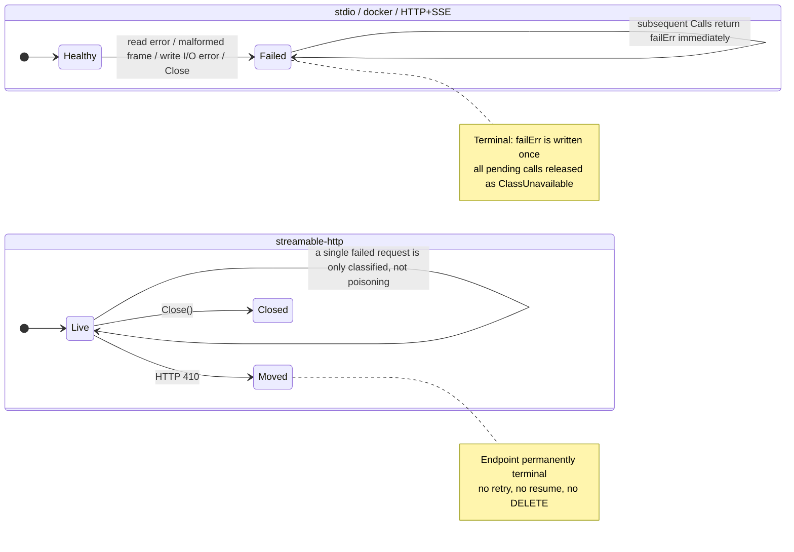
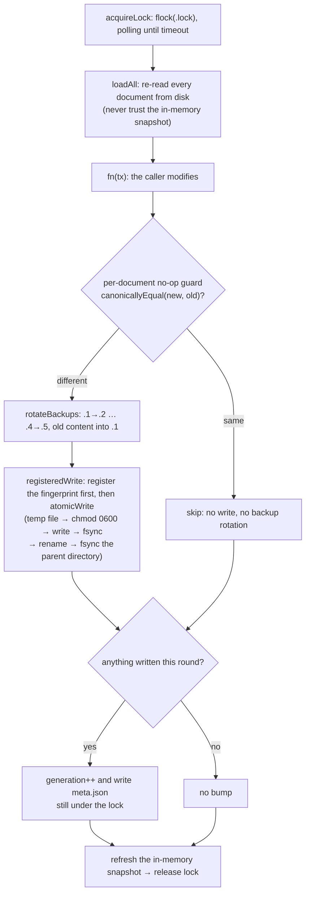

# Foundation and protocol layer

This layer is the part of AgentHub that everything depends on and that depends on nothing: eight
packages that together answer six questions — **where do files go** (`internal/platform`),
**what was said and how is it recorded** (`internal/logx`),
**how does an append-only stream survive N processes writing it** (`internal/jsonl`, and
`internal/savings`, its one first-party record type),
**who defines the words "read / write / destructive"** (`internal/tier`),
**how do we talk to downstreams** (`internal/mcp` and `internal/mcp/transport`), and
**in what form does configuration live on disk and get shared across processes**
(`internal/registry`).

Their collaboration is one-directional and flat:

- `platform` resolves the registry directory, logs directory, run directory, and control endpoint
  path; `registry` takes a directory and opens a store; `logx` takes the logs directory and opens the
  JSON log file;
- `registry`'s `ServerEntry` describes what a downstream server looks like, `mcp/transport` turns
  that description into a live connection (spawning a child process / opening an HTTP session), and
  `mcp` provides the protocol grammar spoken over that connection;
- the three business-agnostic packages (`platform`, `logx`, `mcp`) are locked by depguard to
  **`$gostd` only** — nobody may sneak a third-party dependency in. `registry` is the sole exception:
  it pulls in `fsnotify` for watching.

The dependency-direction constraints aren't a matter of style, they're CI failure conditions (the
`depguard` section of `.golangci.yml`, with every rule backed by a test in `internal/depguardtest`
proving it actually fires).

---

## internal/platform

### One-line responsibility

Answer, in one place, the question "which path on this machine holds agenthub's data / registry /
logs / cache / state / runtime directory and control endpoint", and along the way funnel every
Windows-specific oddity (MSIX container redirection, named pipes, SDDL) into the same seam.

### Key types and entry points

The core is `Resolver`: a struct that makes `runtime.GOOS`, `os.LookupEnv`, `os.UserHomeDir`, and
three Windows-specific hooks (`PackageIdentity`, `ProbePath`, `UserSID`) all injectable fields. Its
zero value is equivalent to `Default()`, i.e. reading the real process environment, while tests can
resolve a complete Windows path on macOS without needing Windows at all. The package-level functions
`DataDir()` / `RegistryDir()` / `LogsDir()` / `CacheDir()` / `StateDir()` / `RunDir()` /
`CtlSocketPath()` are thin wrappers over `Default()`; code that needs testability should hold its own
`*Resolver`.

The directory resolution chain is itself layered: `DataDir` is the only function that branches on
platform, every other directory is a subdirectory of it, and only `RegistryDir` and `CtlSocketPath`
each have one additional environment-variable escape hatch.

| Function | Resolution order |
|---|---|
| `DataDir` | `AGENTHUB_DATA_DIR` (any platform, non-empty wins) → darwin `~/Library/Application Support/AgentHub` → linux `${XDG_DATA_HOME}/AgentHub` (only when XDG_DATA_HOME is an absolute path), otherwise `~/.local/share/AgentHub` → windows `%APPDATA%\AgentHub` (plus the MSIX escape on top) → any other platform `ErrUnsupportedPlatform` |
| `RegistryDir` | `AGENTHUB_REGISTRY` → `<data>/registry` |
| `LogsDir` / `CacheDir` / `StateDir` | `<data>/logs`, `<data>/cache`, `<data>/state` |
| `RunDir` | linux `${XDG_RUNTIME_DIR}/AgentHub` (only when it's an absolute path **and `AGENTHUB_DATA_DIR` is unset**; tmpfs, per-user 0700), otherwise `<data>/run`; darwin/windows always `<data>/run` |
| `CtlSocketPath` | `AGENTHUB_SOCKET` → the Windows named pipe `\\.\pipe\agenthub-ctl-<sha8(SID)>` → `<run>/ctl.sock` |

`EnsureDir` / `EnsureDirs` create directories with `MkdirAll(0700)`, and when a leaf directory
already exists with looser permissions they actively `chmod` it back down to 0700 — the run and state
directories hold sockets and credentials and must not be group- or world-readable.

### Invariants and failure directions

**Frozen identifiers.** The directory name `AgentHub` and the three `AGENTHUB_*` environment variable
names (`AGENTHUB_DATA_DIR`, `AGENTHUB_REGISTRY`, `AGENTHUB_SOCKET`) have been ABI since v1. Even
renaming the product can't change them, because users' existing configuration and other clients'
launch scripts have those names hardcoded.

**An explicit override always wins.** `AGENTHUB_DATA_DIR` is taken verbatim on every platform,
including inside an MSIX container, on the grounds that "the user explicitly named a path" needs no
platform knowledge to interpret.

**Move the data directory and the socket must move with it.** `XDG_RUNTIME_DIR` is a **per-user**
directory, so pinning the run directory underneath it makes every agenthub on the machine share one
`ctl.sock` — no matter which data directory each was pointed at. A dev build and an installed release,
or two concurrent sandboxed tests, would all resolve to the same endpoint: whichever binds first
takes it, and the rest end up talking to a daemon that isn't theirs and reading a registry that isn't
theirs. So `RunDir` only takes the `XDG_RUNTIME_DIR` branch while the data directory is still at its
platform default location (`dataDirRelocated()`).

This rule is a **property of the environment, not of the binary**: an agenthub from the release
channel spawned by a dev build (the two share a PATH) computes the same run directory as its parent,
because both read the same relocated data directory. Deciding by build channel instead would make
them diverge in precisely the case where one execs the other.

`DevResolver` extends channel isolation to the run directory by **answering the `AGENTHUB_DATA_DIR`
lookup** (rather than storing a separate field) — the two things share one determination.

**An unsupported platform is a hard failure, not a guess.** Anything outside darwin/linux/windows
returns `ErrUnsupportedPlatform`, and callers must test it with `errors.Is`, never by string
matching.

**MSIX detection fails toward "assume packaged".** This is the one item in this package most worth
remembering. An agenthub gateway spawned by an MSIX-packaged client inherits that client's app
container, after which every write to `%APPDATA%` is silently redirected into that package's private
shadow directory — the user's configuration quietly forks per client with no indication whatsoever.
Detection uses `kernel32!GetCurrentPackageFamilyName`, and **only the return code
`APPMODEL_ERROR_NO_PACKAGE`(15700) means "no package identity"**; any other outcome (including
unexpected error codes beyond the export simply not existing on older systems, or an anomalous
length) is treated as "packaged". The two ways of guessing wrong have asymmetric costs: guessing
"not packaged" inside a container is a silent data fork, whereas guessing "packaged" outside one only
costs an extra UNC probe, which succeeds and whose twin path points at the same directory — no loss.
The one exception is `proc.Find()` failing (there was no app model at all before Windows 8), which
returns "not packaged".

**The escape path is probed before it's adopted, and a failed probe must be loud.**
The redirection filter only applies to local paths, so reaching the same directory through a loopback
UNC path (`\\127.0.0.1\C$\Users\...`) reaches the real one. But administrative shares can be turned
off, so the twin path is `Stat`ed before adoption (`defaultProbePath` walks up to 8 parent directories,
because on first run the data directory usually doesn't exist yet and what's being tested is "does
this UNC route work" rather than "does this directory exist"). On a failed probe we
**fall back to the local path and print a warning** — never a silent fallback — and the warning goes
to **stderr, not stdout**, because the stdio gateway's stdout is a stream of JSON-RPC frames and one
extra line breaks the protocol. `defaultWarn` dedups by message so the same one prints only once.

**Windows paths are joined with explicit backslashes, not `filepath.Join`.**
The only reason `winJoin` exists is cross-platform testing: resolving a Windows path on macOS,
`filepath.Join` would join with `/`, so the same configuration would compute different strings on
different hosts. A path spelling that varies with the host isn't a path spelling.

**The control endpoint isn't a file on Windows.** `CtlSocketPath` returns a named pipe name on
Windows, and callers must check `IsPipePath` before creating a parent directory or changing
permissions. The `sha8(SID)` in the pipe name isn't obfuscation: pipe names live in a machine-global
namespace, so two users would otherwise contend for the same name and the loser would connect to the
winner's daemon. The actual access control is the `D:P(A;;GA;;;<SID>)` returned by `CtlPipeSDDL` —
**owner only, not Administrators, not SYSTEM** — stricter than Windows convention, because the
control plane hands out every downstream credential and can rewrite what every client sees, and
"admins can connect too" is not a property worth having.

**`EnsureDir` doesn't tighten permissions on Windows.** Go's 0700 and Windows ACLs are not the same
thing (`os.Chmod` there only toggles the read-only attribute), so that branch simply returns.
`%APPDATA%` is already a per-user directory, and the control endpoint's protection comes from the
pipe SDDL rather than a directory mode. Explicitly tightening the data directory's ACL is a TODO in
`docs/windows.md`.

**The entire Windows branch has never been verified on real hardware.** It cross-compiles and is
covered by unit tests on macOS/Linux through injected hooks, but not one line has ever run on
Windows, let alone inside an MSIX container. This is stated in the package comment, in the file
header of `windows.go`, and in `docs/windows.md`: behavior that doesn't match the description should
be treated as an expected unknown, not a regression.

---

## internal/logx

### One-line responsibility

On top of `log/slog`, provide repo-wide uniform logging initialization (a stderr text handler plus a
file JSON handler), enforce field conventions, and apply secret redaction that **cannot be bypassed**.

When both handlers exist, an internal `multiHandler` fans out, joining each handler's `Handle` errors
with `errors.Join` — **one sink failing never silences the other**. `Setup` wraps `ScrubHandler`
**outermost**, so a single redaction pass covers every sink and every attribute bound through
`WithAttrs`.

Any log touching a downstream server, a tool call, a client, or a session must use the field
constants in `fields.go`, because that's what lets the gateway's, daemon's, and CLI's log streams be
joined together. **Don't invent synonyms** (`srv`, `toolName`, …) — and the synonym is not
hypothetical: the derive key was spelled `derive_key` in four places and `inst` in the frame log, so
joining the two streams meant knowing both names. Both are now `FieldInstance`.

**A key bound on the logger must never be passed again per record.** `slog`'s JSON handler does not
deduplicate, so a record repeating a bound key emits the field twice on one line, and a reader taking
the last of the two — `encoding/json` included — silently reads the second value. That happened to
`client`: the gateway binds the configured client id, and both handshake lines passed the peer's
self-reported name under the same key, so the mandatory join key read as a display name. The peer's
name is now `client_name`. Note what this costs to test: an assertion on a **decoded** record cannot
see this class of bug at all, because the decode is what discards the duplicate — the regression test
greps the serialized line.

**A field nothing sets is a convention that has already failed.** `FieldSession` had no users at all
while the two call sites that hold a session id spelled `"session"` by hand. Where an assembly
genuinely has none — a stdio gateway serves one terminal pipe with no id anywhere in it, and is keyed
by client and pid instead — the constant now says so, so that the absence reads as the answer rather
than as an omission someone should fix.

**And the convention is now enforced, because writing it down twice was not enough.**
`TestMandatoryLogFieldsUseTheirConstants` (`test/buildrules`) walks every production file's AST and
fails on a mandatory key spelled as a string literal inside a `slog` call — it found eight, in five
files, including the second of the two `FieldSession` sites the paragraph above describes in the past
tense. Being an AST walk and not a grep is what makes it usable: a cobra flag named `--client` and a
table column named `server` are not log records. What it cannot see is a key assembled at runtime or
routed through a caller's own helper; those stay a review question, and the cheap version of the
mistake — the one that actually happens — is now impossible.

**`pid` is mandatory on every gateway record, and is attached once at logger construction** rather
than per call site — every line of a process carries the same value, and stamping it at each call is
how one line ends up without it. It exists because the log FILE is named after the CLIENT, not the
process: every `agenthub connect --client claude-code` appends to `gateway-claude-code.log`, and a
user normally has several running at once, one per editor window. Without it the interleaved lines of
two gateways read as one gateway doing impossible things — a server that connects and fails in the
same instant, a backoff ladder that appears to skip rungs. The value is what `ps` prints, so a line
joins directly to a process on the machine.

**A record that does not fit its line bound becomes an `OversizeMarker`, and every reader must know
that shape.** The bound is 4096 = PIPE_BUF, which is what makes one appender's line atomic against
the other N; a record over it is replaced rather than written, because a bounded marker beats a torn
line that corrupts the stream for every consumer. The marker shares its `ts` field with a real
record, so a reader that does not check `oversize` first unmarshals it into its own type without
error and gets a zero value — a blank row asserting nothing happened, in place of the one record big
enough to have been dropped. `jsonl.DecodeOversize` is the check; `server logs` runs it before
decoding a frame and renders "frame dropped", the size, and the method recovered from the prefix.

**A writer must fit the SERIALIZED line, not its raw payload.** Truncating a body to N raw bytes says
nothing about the line: the body goes into a JSON string where quotes and backslashes double and
control bytes sextuple. `internal/downstream`'s trace log had both numbers set to 4096 and therefore
dropped every frame with a payload over roughly 2 KB of quote-heavy JSON — a large `tools/list`, a
big `tools/call` result, which is to say precisely what a trace is opened to see. It now marshals,
measures, and re-cuts until the line fits, which yields the largest body that can actually be written
and produces no marker at all. Raising the bound instead would have traded dropped frames for torn
ones.

The per-server trace log (`internal/downstream`, `TraceFrame`) carries the same field for the same
reason one level down, alongside `inst`: that file is named after the SERVER, so every gateway
process tracing it writes there, and inside one process every derived instance does too. `server
logs` renders `pid` as a column and carries both in `--json`; a frame written before the field
existed shows `-` rather than a zero that would read like a process id.

### Invariants and failure directions

**Redaction cannot be turned off.** This is the hardest rule in the package: there is no
configuration switch and no environment variable that bypasses it. `AGENTHUB_DEBUG=1` (`EnvDebug`)
only lowers the level to Debug and has no effect on redaction; `ScrubString` itself reads no
environment. Secrets, tokens, and credentials must not reach any sink at any level.

**Redaction fails closed.** Over-masking (turning a harmless long random string into `[REDACTED]`) is
acceptable; leaking one credential is not. Five pattern classes apply in order: `key=value`/
`key: value` where the key contains a sensitive word **and the value opens with a known auth scheme**,
consumed to end of line; the same key with a scheme-less value, kept whitespace-bounded; bare bearer
tokens loose in the body,
known-shaped credentials (`sk-`, `ghp_`/`gho_`/`github_pat_`, `xox[baprs]-`, `AKIA`, `ya29.`, JWTs),
and generic `key=value` pairs whose value looks like a long random string (≥32 characters from a
base64-ish alphabet, with `looksRandom` requiring both letters and digits so a long all-letter
identifier isn't caught in the crossfire). **Don't narrow these patterns to make logs look nicer.**

**The scheme half of that first class exists because recognising only `Bearer` produced the worst
possible output.** Every other RFC 7235 scheme had its NAME consumed and its credential left in
place, so `Authorization: Basic dXNlcjpwYXNz` was logged as `Authorization: [REDACTED] dXNlcjpwYXNz`
— a line that reads as though the secret had been removed, which is worse than an obvious leak
because nobody goes looking. `Digest`, `Negotiate`, `NTLM` and `DPoP` all landed the same way, and
none of the later classes caught them: `bearerRe` wants a `bearer` prefix, `tokenShapeRe` wants a
known vendor shape, and `genericKVRe` wants a literal `key=`. The scheme list is **closed** on
purpose. Matching any leading word instead would let `SECRET_GITHUB=<value> loaded` swallow the rest
of the message, and losing diagnostics is not the same trade as the harmless over-masking above.
Running to end of line once a scheme is present is what covers `Digest`, whose credential is spread
across comma-separated parameters. Note the division of labour: `ScrubString` works on message TEXT
and never matched a quoted JSON key (`"authorization":`) — structured attrs are `SensitiveKey`'s job,
below.

**Sensitive key names are masked wholesale, regardless of value type.** `SensitiveKey` lowercases the
key, strips `-`/`_`, and does substring matching
(`secret`/`token`/`password`/`passwd`/`authorization`/`apikey`/`credential`/`accesskey`/`bearer`);
a matching attribute is replaced with the string `[REDACTED]` whether it was a string, a number, or a
struct.

**`LogValuer` is resolved before redaction.** `scrubAttr`'s first step is `a.Value.Resolve()`,
guaranteeing that redaction sees the final value rather than a lazy wrapper; groups recurse; and
`string` and `error` inside a `KindAny` are redacted too (errors frequently wrap request or header
dumps).

**`WithAttrs` redacts eagerly.** Bound attributes are scrubbed at bind time, so they're already clean
whatever record they later attach to, with no need to rescrub per record.

**Log files are 0600, opened for append.** One JSON object per line.

---

## internal/jsonl

### One-line responsibility

The append-only JSONL writer every on-disk stream in the product goes through: the per-server wire
trace (`internal/downstream`) and the token-savings ledger (`internal/savings`).

It was **extracted from `internal/audit`**, which owned it while the governance streams existed. The
streams were removed and the write discipline was not, because the discipline was never about audit
— it is what any JSONL file written by N processes at once needs, and two of those files remain.
Keeping the primitive inside the package that was being deleted would have meant either re-deriving
it in `downstream` or keeping a governance package alive for one type.

### Invariants and failure directions

- **One record is one `write(2)` of one line, on a file opened `O_APPEND`.** That, plus a line bound
  (`DefaultMaxLineBytes`), is the entire multi-writer story: N gateway processes and the daemon
  append to the same file and cannot tear each other's lines. `main_test.go` proves it by
  re-executing the test binary as several appending children and checking every line arrived whole —
  a single-process test cannot observe this property at all.
- **Rotation renames the active file; it never reads it back and truncates.** Truncation is what
  breaks the guarantee above across processes that did not agree to rotate at the same instant.
- **Backpressure drops, and never blocks.** Appends funnel through one writer goroutine behind a
  buffered channel; overflow is counted (`Dropped`) and discarded. Fail-open, deliberately: a record
  on its way to disk must never be able to slow down or fail the call that produced it.
- **An oversized line becomes an `OversizeMarker`, never a truncated one.** A reader can then tell
  "this record was too big" from "this file is corrupt"; half a JSON object cannot say either. The
  marker shares its `ts` field with a real record, so a reader that does not check `oversize` first
  decodes it into a zero value — a blank row asserting nothing happened, in place of the one record
  large enough to have been dropped. `DecodeOversize` is the check, and `server logs` runs it before
  decoding a frame.
- **A writer must fit the SERIALIZED line, not the raw payload.** See `internal/logx` above for what
  getting this wrong cost the trace log.
- **Dependency budget**: standard library only.

---

## internal/savings

### One-line responsibility

The token-savings ledger — one JSONL line per shaped or discovery-assisted interaction, aggregated
by `agenthub activity`.

**It is accounting, not governance.** Nothing here decides anything about a call; it records what a
call cost against what it would have cost. That is why it outlived the streams it used to sit beside:
those existed to be read by a decision, and the decision went.

### Invariants and failure directions

- **`Record`'s field order is frozen** and golden-tested, for the reason every wire shape here is:
  the file is parsed by things that are not this build.
- **`SavedTokens` is recorded, not derived.** It is `BaselineTokens - ActualTokens`, written out
  explicitly so two consumers cannot re-derive it inconsistently.
- **`Mode` names the mechanism that produced the saving** (`lazy-discovery`, `grouped`, `shaping`,
  `toon`), which is what makes the aggregate answerable — "how much did lazy mode buy me" is the
  question, and it cannot be reconstructed from totals.
- Everything else is `internal/jsonl`'s: same append discipline, same fail-open drop. A failure to
  open the stream leaves it `nil`, and appending to a nil stream is a no-op — the ledger degrades to
  nothing recorded, never to a failed call.

---

## internal/tier

### One-line responsibility

The vocabulary of the three operation tiers `read | write | destructive` — the one ladder in the
whole repo. Standard library only.

### Why it's a standalone leaf package

Five packages need to say these three words and none of them owns them: `pipeline` gates on it,
`httpbridge` stores it on an agent token, `ctlapi` mints those tokens, `discovery` uses it to name
intent variants, and `cli` parses it from user input.

It used to live in `internal/pipeline`, with the consequence that the control plane had to import the
data plane's execution package just to say the word "read". Beyond violating the layering, that
import made the rule "pipeline must not import ctlapi" **unprovable** — depguard's violation probe
produced an import cycle rather than a lint error, so the rule lost its failing test case. Extracting
the vocabulary into a leaf package fixed the layering and the proof at once.

"A vocabulary that drags in dependencies isn't a vocabulary" — hence the standard-library-only rule,
which is constructive.

### Invariants and failure directions

**`Covers(caller, tool)` decides by rank, not equality**: a write credential can call read tools, and
destructive can call anything.

**The empty string means "no tier privilege", not "the lowest tier".** stdio callers are the human's
own session and carry no agent token, so the tier gate has nothing to enforce against them. That's a
different thing from "an unrecognized tier" — the latter has rank 0 and `Covers` **covers nothing**
(fail-closed: a typo in a stored token should be refused, not escalated).

**The first and last rows of `ToolTier` are different cases; don't merge them.**

| annotations | Tier | Why |
|---|---|---|
| Absent entirely / null / unparseable | `destructive` | The server **said nothing at all**. Fail-closed: an unannotated tool must never be reachable by a read-only credential |
| `readOnlyHint == true` | `read` | |
| `destructiveHint == true` | `destructive` | |
| `destructiveHint == false` | `write` | |
| An annotations object exists, but neither hint is set | `write` | The server **did describe itself**, it just stayed silent on this one item |

**An annotated but silent tool is `write`, not `destructive`.** The MCP spec's default for a missing
`destructiveHint` is destructive, and this ladder deliberately does not follow it for an annotations
object that exists: `ToolTier` feeds coarse-grained credential separation and intent variants, and
treating every "annotated but silent" tool as destructive would collapse the whole ladder into one
rung. A **missing or unparseable** annotations value is still destructive — that is the fail-closed
case, and it is the one the tier gate relies on.

**Intent variants use equality, not coverage.** `call_tool_read` accepts only read tools, not lower
tiers — because a variant expresses "what I intend to do", while a credential expresses "how far I'm
permitted to go".

---

## internal/mcp

### One-line responsibility

The **only** place in the repo that touches the MCP/JSON-RPC protocol implementation: wire format,
framing, domain types, version negotiation — all written in-house, standard library only.

### Why standard library only

`.golangci.yml`'s `mcp-stdlib-only` rule restricts `internal/mcp/**`'s import allowlist to `$gostd`
plus itself, and a second rule, `no-third-party-mcp-libs`, bans `modelcontextprotocol/go-sdk`,
`mark3labs/mcp-go`, and `metoro-io/mcp-golang` **repo-wide**.

The reason isn't "we don't trust third parties", it's that a handful of invariants at this layer need
precise control: 16 MiB bounded reads, `notifications/cancelled` forwarding, inline replies to
reverse RPC, and the stdio stderr tail window. JSON-RPC encoding and decoding isn't much work on its
own, and tying it to an external project's evolution schedule isn't a good trade. The whole point of
the façade is to keep that choice **reversible later** — if we ever do swap implementations, the
change is sealed inside one package. One direct consequence of this constraint: the SSRF screen can't
import `internal/guard/netguard` here, so the caller has to inject a dialer instead (see the
transport section).

`MaxFrameSize = 16 << 20` is a hard cap on both the read and write sides. Framing is
newline-delimited JSON — LSP-style `Content-Length` headers are deliberately unsupported.
`ProtocolVersion = "2025-11-25"` is the version this client advertises, with `SupportedVersions`
(`2025-11-25`, `2025-06-18`, `2025-03-26`) as the acceptable downgrade set.

### Invariants and failure directions

**Reads are bounded, and exceeding the bound poisons the reader.** `readLine` checks the cap while
accumulating, so an oversized frame fails before it's fully buffered rather than after being eaten
into memory. Once `ErrFrameTooLarge` is hit, the stream position sits mid-frame and the semantics are
undefined, so **the error is sticky** — a `FrameReader` remembers any error and every subsequent
`Next` returns the same one. The connection must be considered unusable.

**Exceeding the bound on the write side, by contrast, is recoverable.** `WriteFrame` rejects an
oversized frame **before** writing any bytes, so the stream itself isn't contaminated and the
connection stays healthy — this asymmetry is why the transport layer classifies an outbound
over-limit as `ClassFatal` rather than `ClassUnavailable`.

**Frame writes are atomic.** One `Write` call per frame plus `FrameWriter`'s mutex guarantee that
frames don't interleave when the Call/Notify goroutines and the read loop (replying to peer requests)
share a writer. `json.Marshal` escapes control characters inside strings, so a payload can't contain
a bare newline, which makes appending `'\n'` safe.

**A blocked `WriteFrame` does not honour its call's context, and that is deliberate.** A security
sweep raised it as a shutdown deadlock: `Call` performs the write before selecting on `ctx.Done`, and
`Notify` ignores its context entirely, so a stdio downstream that stops reading mid-frame was said to
hang shutdown. **Not reproduced.** Handler goroutines never wait on the stuck write —
`downstream/server.go:420-442` selects on the reply, the call context and the server lifetime, and
shutdown cancels the gateway lifetime before joining handlers — while `Server.Close` closes the
transport *before* joining the owner goroutine, and closing the child's stdin unwinds a blocked
`Write` with an error. There is also no reachable trigger for the `Notify` half: it is used only
during the handshake, against a fresh 64 KiB pipe, with a frame far below that. What remains true is
the narrow statement that a blocked write outlives its per-call context, bounded to that server being
unavailable until redial. **Making `WriteFrame` context-aware would be worse than the finding**: a
write abandoned partway leaves a half-frame in the stream, and the atomicity guarantee above is what
lets every other reader on that connection trust it.

**Blank lines are skipped, and a final frame without a newline is still delivered.** The reader skips
blank lines (including CRLF remnants), and at EOF, if there is non-empty unterminated content, it's
delivered as the final frame with EOF returned on the next call.

**Malformed input yields decidable typed errors and never panics.** Any shape violation in
`ParseMessage` (bad JSON, wrong `jsonrpc` version, invalid id type, none of the three shapes) returns
an error satisfying `errors.Is(err, ErrMalformedFrame)`. **Whether to close the connection over it is
the caller's decision**; this layer only makes the error decidable — one garbage frame must not crash
the process.

**`ID` preserves the original JSON text.** `ID` stores a raw string internally rather than an
`int64`/`string`, so an id sent by a peer is echoed back byte for byte, including numeric spellings
beyond float64 precision. `Key()` uses the raw text directly as a map key, and since string ids carry
their quotes they can never collide with numeric ids; an unset ID serializes as `null`, used only for
protocol-level error responses where the request can't be identified.

**A message with a method but a null id is handled as a notification**, which is an explicit
trade-off in `ParseMessage`.

**Downstream JSON is always passed through raw.** `ToolDef.InputSchema`/`OutputSchema`/`Annotations`,
`InitializeResult.Capabilities`, `CallToolParams.Arguments`, and `CallResult.Content` are all
`json.RawMessage`. This layer **never reshapes downstream JSON** — it doesn't re-encode JSON Schema
and it doesn't drop any capability the server declared.

**Cancellation is racy and receivers must tolerate late replies.** `CancelledParams`'s comment says
so explicitly, and the transport layer's implementation matches: an unmatched response is simply
discarded.

**The `roots`-related types carry a `DEPRECATED-UPSTREAM` marker** (`roots`, earliest removal date
2027-07-28), retained per canonical.md §5b; when upstream eventually removes it, the gateway's
`RootSource` seam absorbs the change.

---

## internal/mcp/transport

### One-line responsibility

Turn "a description of a downstream MCP server" into a live connection that can send and receive
JSON-RPC, and **classify** every failure into one of the three categories the upstream circuit
breaker can use.

### Key types and entry points

The `Transport` interface is the common denominator of every implementation: `Call` / `Notify` /
`OnPeerRequest` / `OnListChanged` / `Stderr` / `Close`. Four entry points construct one:

| Entry point | What you get |
|---|---|
| `SpawnStdio(StdioConfig)` | A child-process stdio connection; hands off to `SpawnDocker` automatically when `cfg.Docker != nil` |
| `SpawnDocker(StdioConfig)` | The same, but the host process is `docker run -i --rm ...` |
| `DialStreamableHTTP(HTTPConfig)` | MCP 2025-11-25 Streamable HTTP (no connection made here; the first `Call` makes it) |
| `DialHTTPSSE(ctx, HTTPConfig)` | Legacy HTTP+SSE (blocks until the endpoint event arrives or ctx times out) |

Once you have a `Transport`, `Initialize(ctx, t, clientInfo)` performs the handshake: send
`initialize` (advertising `mcp.ProtocolVersion` and `roots.listChanged`), validate the version the
server returns, and on success send `notifications/initialized`.
**A failed handshake is always `ClassFatal`** — retrying the same handshake won't succeed, so it
shouldn't consume circuit-breaker budget.

The error model is `*Error{Class, StatusCode, RetryAfter, Err}`, with `Unwrap` exposing the cause so
`errors.Is` works against `mcp`'s sentinels. The criterion behind the three classes is that
"`tools/call` is not idempotent":

- `ClassFatal`: an ordinary error response, or a verdict on the configuration itself (a bad URL, a
  spawn guard rejection, an over-limit outbound frame, a missing docker CLI). **Not counted by the
  circuit breaker**, because it says nothing about downstream health.
- `ClassUnavailable`: a connection-level failure. **Counted by the circuit breaker.**
- `ClassRetry`: the request **provably never reached the server** (DNS resolution failure, dial
  failure), or the server explicitly answered 429. Only these two categories may replay a
  non-idempotent call.

`StatusCode` is the HTTP status that produced the error (0 for non-HTTP sources), accompanied by
`StatusOf(err)` and `IsAuthStatus(err)`, two predicates that unwrap. **The reason it exists is to keep
callers from grepping error text**: the message includes a snippet of the response body, so a check
like "look for `http 401` in `Error()`" would classify a proxy error meaning "502, whose body says the
upstream returned http 401" as "your credentials were rejected" — sending the operator off to re-run
`auth login` for a failure credentials can't fix. `internal/cli` and `internal/ctlapi` had each
independently written such a substring match; both now decide by status code.

`ChangeMask` (`ChangeTools|ChangeResources|ChangePrompts`) is the bitmask for list_changed
notifications, delivered via `OnListChanged`; `PeerHandler` handles server-initiated reverse RPC
(roots/sampling/elicitation).

### How the four implementations differ

Of the four implementations, only the first two share a code base (`conn`), and docker is a variant of
stdio rather than a fourth `Kind` — `Kind` has only the three values `stdio`/`http`/`sse`, and
containerization is expressed by the registry's `runtime` field.

| Dimension | stdio / docker | streamable-http | Legacy HTTP+SSE |
|---|---|---|---|
| Underlying | Child process stdin/stdout, newline-delimited frames | One POST per message, the response being JSON or an SSE stream | A long-lived GET to receive, POSTs to send — two channels |
| Failure model | **Terminal**: any read-side error or write-side I/O error sets `failErr` (written once), releases all pending calls, and every subsequent call returns it immediately | **Non-terminal**: one bad request doesn't poison the transport, each call is classified on its own; only `Close` and 410 are terminal | **Terminal**, isomorphic to stdio: there's only one long-lived stream, and if it breaks everything breaks |
| Reverse RPC | **Answered inline on the read loop**, so a handler must not call back into the same transport and must return promptly | Handled on a separate goroutine, with the reply POSTed back to the endpoint; a handler **may** call back into this transport | Separate goroutine + POST (the reply goes over the other channel), with the same `maxPeerWorkers`(8) concurrency cap |
| Session | None | `Mcp-Session-Id` (echoed on every request after initialization, DELETEd on `Close`) | None |
| Resumption | N/A | `Last-Event-ID` best-effort resume once (disable with `DisableResume`; never resumes after a 410) | **None**: the legacy binding never defined resumption, and silently replaying non-idempotent calls is worse than letting `internal/downstream` reconnect cleanly |
| `Stderr()` | The child process's last 4 KiB of stderr (docker also appends diagnostic lines) | `""` | `""` |

### Invariants and failure directions

**Bounded reads run through both wire formats.** stdio uses `mcp.FrameReader`; SSE uses `sseScanner`,
its analogue: a single event whose accumulated data exceeds the cap yields `mcp.ErrFrameTooLarge`
(rather than buffering first), the error is sticky, an unfinished event at EOF is discarded per the
SSE dispatch rules, and comment lines (`:` heartbeats) and unknown fields are ignored rather than
fatal. `readBounded` / `encodeMessage` apply the same cap to HTTP bodies.

**A reverse-RPC reply's id is forcibly overwritten by the transport with the request id**, whatever
the handler set. With no handler registered we answer method-not-found; when the handler errors or
returns nil we answer internal-error; and when the reply itself exceeds the frame limit we substitute
an in-band internal-error (the stream stays intact and the server isn't left waiting).

**Cancellation is always forwarded, best-effort.** All three implementations' `Call` send
`notifications/cancelled` before returning the ctx error when the ctx ends. It is **best-effort**: a
failed write is swallowed (if the pipe is already dead the read loop will report it momentarily), and
on the HTTP side it runs on the **transport lifetime ctx** rather than the already-dead call ctx, with
a 5s timeout (`cancelForwardTimeout`).

**Unmatched responses are discarded and unknown notifications are ignored.** Neither is fatal — the
first is a cancelled call colliding with a late reply, the second is the server sending a notification
we don't recognize.

**A malformed frame closes the connection, but the process never crashes.** The stdio and HTTP+SSE
read loops call `fail(ClassUnavailable)` when `ParseMessage` fails: a peer emitting garbage can't be
trusted to still be maintaining frame boundaries. The streamable-http GET notification stream, faced
with the same situation, merely ends that stream (and reconnects next time).

**The HTTP status classification is deliberate** (`httpError`):

```
410 Gone         → ErrEndpointMoved, ClassUnavailable, never retried, never resumed, the endpoint is permanently poisoned
404 Not Found    → ErrSessionExpired, ClassUnavailable, clears the session id (whether to re-initialize is decided upstream)
429 Too Many     → ClassRetry + a Retry-After hint (delta-seconds or HTTP-date; unparseable means 0 = use the caller's own backoff)
5xx              → ClassUnavailable: the request did reach the server, non-idempotent calls must not be replayed, counted by the breaker
other 4xx        → ClassFatal: our request was rejected on its own merits, which says nothing about server health and shouldn't trip the breaker
```

**410 is terminal for the transport.** Once `noteTerminalStatus` sets `moved`, `stateErr()` makes
every subsequent `Call`/`Notify` fail immediately, the notification stream loop exits, and `Close`
doesn't even send the DELETE. The meaning is "a human has to change the URL in the configuration".

**A cross-origin endpoint event fails closed.** Legacy HTTP+SSE gets its POST address from an endpoint
event sent by the server, while the caller's headers (`Authorization`) ride along with every POST. So
`setPostURL` validates with `sameOrigin` (scheme + host including port, all equal) and fails the
transport outright on a different origin — an endpoint event pointing elsewhere is credential
exfiltration dressed up as a protocol event. Likewise, the notification stream's GET permanently gives
up when it receives a non-SSE content type.

**A cross-origin redirect fails closed too, for the same reason and by the same predicate.** An
endpoint event is not the only way a server can name a destination — a `3xx` is the other one, and
`HTTPConfig.Header` rides every request including a redirected one. `newHTTPClient` therefore installs
a `CheckRedirect` that refuses any hop `sameOrigin` rejects. Relying on net/http's own stripping is not
enough: it drops `Authorization` only when the redirect leaves the *domain*, so a subdomain or an
`https`→`http` downgrade keeps the header. A caller-supplied `HTTPConfig.Client` is left alone — that
caller owns its redirect policy, as the field says — which is why `internal/downstream` sets the same
policy on the client it builds.

**The SSRF screen is injected, and if it isn't injected it isn't there.** `HTTPConfig.DialContext` and
`HTTPConfig.Client` are **mutually exclusive** (supplying both is rejected as `ClassFatal` in
`newHTTPBase`), so a protective dialer can't be silently dropped. Supplying neither means
**no address screening at all** — that combination is reserved for tests and explicitly trusted
loopback endpoints. When the injected dialer refuses, it manifests as a dial failure and is therefore
classified `ClassRetry`; that's honest (nothing was ever sent) and harmless (the guard fails closed,
so every bounded retry is rejected the same way).

**Protocol headers always override the caller's.** `newRequest` lays down the caller's headers first,
after which each call site sets `Accept`/`Content-Type`/`Mcp-Session-Id`/`MCP-Protocol-Version`. Note
that `net/http` canonicalizes header names, so what actually goes out is `Mcp-Protocol-Version`
(header names are case-insensitive per RFC 9110 §5.1, and the golden files pin the canonical form).

**Body snippets in error messages are bounded and flattened to one line.** `drainSnippet` reads only
1 KiB, replaces `\n\r\t` with spaces, and strips other control characters — error strings end up in
JSON log lines and trace frames, and embedded newlines would amount to permitting a forged record.

**Concurrent reverse RPC has backpressure rather than unbounded fan-out.** The `maxPeerWorkers = 8`
semaphore **blocks stream reading** when full, making a flooding peer slow itself down. `wg.Add` always
happens under the same lock that publishes `closed`, so `Close`'s `Wait` can't end up waiting on a
counter that's about to be incremented.

**stdio's process reaping follows a strict order.** `os/exec`'s pipe contract requires that `cmd.Wait`
not precede stdout being fully read, so reaping hangs off the end of the read loop (once the process
dies stdout hits EOF and the read loop necessarily ends). `Close` first fails all pending calls, then
closes stdin (which is an EOF to a well-behaved child), waits `killGrace = 3s`, `Kill`s on timeout,
and finally runs cleanup. **The process is always reaped.**

### The docker spawner's additional rules

The positioning is explicit: the spawn guard is **anti-smuggling**, not a sandbox; this docker half is
where resource and namespace isolation lives. It drives the docker CLI with `os/exec` rather than
pulling in the SDK — partly because `internal/mcp` may only use the standard library, and partly
because shelling out makes `DOCKER_HOST`, docker contexts, and credential helpers all work
automatically.

- **Everything off by default**: `--network none`, mounting only explicitly declared directories and
  read-only by default (`:rw` only when `Mount.Write` is set), and never generating `--privileged`,
  host namespaces, or capability grants.
- **`ExtraRunArgs` must not restate a flag this file emits itself** (`ownedRunFlags`). Docker's
  last-wins semantics would let a stray `--network host` quietly erase the isolation defaults; a
  self-contradictory configuration is a bug, not an override. **The comparison is over every spelling
  docker accepts, not over the token.** `ownsRunFlag` canonicalizes first, because docker's parser
  takes a shorthand's value attached to the letter: `--user 0:0`, `--user=0:0`, `-u 0:0` and `-u0:0`
  are one flag, and only the first three begin with a token equal to `-u`. Comparing the text up to
  `=` refused three of them and let `-u0:0` run the container as root under a config that said
  `user: 1000:1000` — the isolation silently degrading rather than being refused, which is the
  highest-severity shape in this tree. Fail-closed for every flag it recognises; fail-open past an
  unrecognised shorthand, since guessing whether an unknown letter takes a value would refuse working
  configurations as docker grows. `spawnguard` inspects the assembled command line without consulting
  that table, so the residue is not the only gate.
- **Secrets never go in argv**: container environment variables are passed as `-e NAME` (no value),
  with values inherited from the docker CLI's own environment. `ps(1)` can see argv; it can't see the
  CLI's environment.
- **`StdioConfig.Cwd` becomes `--workdir`, not the CLI process's directory.** "The directory the
  server runs in" is a path inside the image, so applying it to the docker CLI (`cmd.Dir`) would be a
  silent no-op for the workload — the entry asks for a working directory and the container gets none,
  with nothing to notice. An explicit `DockerConfig.Workdir` is the more specific statement and wins.
  The docker CLI is a control-plane client here; where it runs from does not affect the workload, so
  it just inherits the gateway's directory.
- **`BuildDockerRunArgs` is a pure function with total ordering**: mounts sorted by (target, source)
  and env sorted by name, so the same configuration always produces the same argv — pinned by the
  `testdata/docker_run_args.txt` golden file.
- **Configuration is validated before any process is started**: the image must not start with `-` or
  contain whitespace, the container name must start with `agenthub-` and conform to docker naming,
  mount paths must be absolute and free of `:` (otherwise a second flag is smuggled out of the value
  position), and memory/CPU/network names each have their own regexes.
- **Container names are unique per spawn**: agenthub runs one gateway process per client, multiple
  processes legitimately run the same server at once, and a fixed name would collide. This is one
  place where mcpproxy's "idempotent pre-cleanup by fixed name" recipe **does not apply**, and the
  comment says why.
- **Cleanup is belt and braces**: `--rm` covers normal exit, while `removeContainer` (reading the
  cidfile for the id, falling back to the name) covers "the CLI died first"; failures are always
  ignored — the container may already be gone, and shutdown must not fail over it.
- **Failure diagnostics are folded into the stderr tail window**: `diagnoseDocker` appends an
  `agenthub: ...` line after the stderr tail, rescuing "image doesn't exist" and "daemon isn't running"
  from a bare deadline-exceeded. In match order, daemon cases come before image cases, because a dead
  daemon also emits wording that looks like an image problem.
- **`DockerBinary` has a fallback path table**: a gateway launched by launchd/systemd has a truncated
  PATH, and Docker Desktop's CLI hides inside an app bundle; once found we take its absolute path and
  prepend its directory to the child process's PATH (the credential helpers sit right next to it).
- `DockerVersion` and `StrayContainers` are doctor-facing probes: the first proves the daemon
  responds, the second lists any leftover containers by the `agenthub.managed=true` label (there
  shouldn't be any on the normal path — if there are, a gateway was `kill -9`ed).
- **The unit tests here drive a shell stand-in for the docker CLI**, which pins the argv exactly but
  can never prove a container ran. The one test that does is `TestDockerRuntimeDownstream` in
  `test/e2e/`: it mounts the downstream binary at a path that exists ONLY inside the container, so a
  regression that loses the runtime dimension and spawns on the host cannot answer at all. Verified
  falsifiable — stubbing out the `spec.Docker != nil` branch in `dialStdio` fails it with
  `fork/exec /opt/fakemcp: no such file or directory`. It skips itself when docker is absent or the
  daemon does not answer, so it stays green on a machine without Docker.

### One diagram: two failure models



### File map

| File | Contents |
|---|---|
| `transport.go` | The `Transport` interface, `Kind`, `ChangeMask`, `PeerHandler`, the three `Class` values and `*Error`, `ErrClosed` |
| `conn.go` | The generic byte-stream implementation: single read loop, pending table, terminal `fail`, inline reverse RPC, cancellation forwarding, `Close` |
| `stdio.go` | `StdioConfig`, `SpawnStdio`, the injected spawn screen `screen`, `launch` (pipe wiring, stderr ring, process reaping and kill escalation) |
| `docker.go` | `DockerConfig`/`Mount`, `SpawnDocker`, `BuildDockerRunArgs`, configuration validation, `DockerBinary`/`DockerVersion`/`StrayContainers`, stderr diagnostics |
| `httpcommon.go` | Everything the two HTTP transports share: header constants, `HTTPConfig`, `DialContextFunc`, `httpError`/`requestError` classification, `readBounded`/`encodeMessage`/`decodeMessages`, `sameOrigin`, backoff |
| `streamablehttp.go` | Streamable HTTP: the POST main path, JSON and SSE responses, session headers, `Last-Event-ID` resumption, the optional GET notification stream and reconnect loop, DELETE on `Close` |
| `httpsse.go` | Legacy HTTP+SSE: the long-lived GET plus endpoint event parsing (cross-origin fails closed), POST sending, the terminal failure model |
| `ssescan.go` | `sseScanner`: bounded, sticky, dispatching events per the SSE spec, ignoring comments and unknown fields |
| `initialize.go` | `Initialize`: handshake + version negotiation + `notifications/initialized`, always `ClassFatal` on failure |
| `tailbuf.go` | `tailBuffer`: a concurrency-safe ring writer holding the last N bytes, backing `Stderr()` |
| `testdata/*.txt,*.json` | Goldens: docker argv and the on-the-wire bytes of both HTTP transports. `wiregolden_test.go -update` rewrites them; **fix the code, don't edit the goldens** |

---

## internal/registry

### One-line responsibility

The **on-disk source of truth for configuration** shared by the CLI, each gateway process, and the
daemon: multi-document, unknown-field-preserving, cross-process atomic writes, a monotonic
generation, change awareness, and self-write suppression.

### Directory layout

```
meta.json          monotonic generation (incremented only under the lock, and only when something was actually written)
servers.json       downstream MCP servers
profiles.json      profiles: the enabled-server set, per-server tool selectors, and discovery mode
clients.json       which profile each client is bound to (and nothing else)
governance.json    global governance policy
.lock              sibling lock file, flock, protecting all of the above
.runstate.json     crash marker (not a document; the dot prefix deliberately keeps it out of the <kind>.json namespace)
backups/           5 rolling generations per document, <name>.json.1 .. .5
```

### Key types and entry points

**The `Doc[T]` envelope** is the package's foundation: a typed view `V T` plus an
`extra map[string]json.RawMessage`. `UnmarshalJSON` first collects every top-level field into extra,
then decodes `V`, then removes the field names T knows about from extra; `MarshalJSON` merges back in
the other direction, with **known fields winning on key conflicts**. The effect is that fields written
by a newer agenthub (or by hand) survive an older version's load-modify-save. The preservation is
**per level** — `ServersDoc.Servers`'s value type is `Doc[ServerEntry]` rather than `ServerEntry`, so
unknown fields inside an individual server entry survive too. The set of known field names is cached
by `reflect.Type`, and correctly handles json tags and field promotion from anonymous embedding.

**Passthrough is exactly what makes a RETIRED field dangerous, which is why `HasUnknownField(name)`
exists.** A field the type system dropped keeps round-tripping verbatim, so a rule an operator wrote
while it worked still *looks* applied long after it stopped applying — and when the retired rule was a
narrowing one, "stopped applying" means widening. `HasUnknownField` lets a diagnostic notice that a
name survived on disk (`agenthub doctor`'s `scope:projects` check uses it for the retired `projects`
block in `clients.json`). Reading the key is deliberately **all** it exposes: a caller may ask whether
a name is present, never reach into the passthrough and act on its contents.

**`Store`** is a handle on one registry directory. Three entry points:

- `Open(dir)` / `OpenOptions(dir, opts)`: create the directory, load every document under the lock,
  and produce a snapshot. **It still returns a usable `*Store` when a document has been quarantined**,
  alongside a non-nil error joining an `*UnreadableError` — whether that's fatal is the caller's call.
- `Reload(ctx)`: re-read every document under the lock and replace the in-memory snapshot. Watch
  consumers call it on receiving a `Change` — the event is only a notification, the state comes from
  this re-read.
- `Update(ctx, fn)`: the full `lock → load → modify → commit → bump` transaction, described below.

**`Tx`** is the mutable view the `Update` callback sees (four `*Doc[T]`s —
`Servers`/`Profiles`/`Clients`/`Governance` — plus a read-only `Generation()`). The pointers are valid
only for the duration of the callback. **`meta.json` is not exposed** — the generation is the store's
business.

**`Snapshot`** is the immutable view (`Generation` plus deep copies of the four `Doc[T]`s, made via a
JSON round-trip to guarantee independence from maps the callback may still hold).

**`Watcher`** (`Store.Watch()` / `WatchWith(opts)`) produces a stream of `Change{Kind, Rev}` events.
**`Applier`** implements the adoption criterion.

**The crash marker** is three functions, and **the writer is the daemon**: `daemon.Run` calls
`ArmRunMarker` **after** `ctlapi.Listen` succeeds (arming only on a successful bind, so a second daemon
that lost the socket race doesn't overwrite the winner's marker), and calls `RunMarker.Resolve` only on
the **graceful stop** branch; a process that gets `kill -9`ed, panics, or loses power never resolves,
and **that failure to resolve is itself the signal**. `agenthub doctor` reports the result via the
read-only `PreviousShutdown`.

Failure direction: failing to write the marker only costs the **next** startup its diagnostic
capability, so it degrades to a warning rather than refusing service — refusing to serve for the sake
of a diagnostic feature is the worse trade.

That "writer" didn't used to exist: the reader half (doctor → `PreviousShutdown`) always worked, but
nothing in the product ever armed the marker (`daemon.go` had a `TODO(M1-H)` sitting there), so doctor
would only ever answer "unknown (no marker yet)" — **including in the moment right after a crash**,
which is the one reason the feature exists at all.

The domain types live in `types.go`: `ServerEntry` (with fields like
`Transport`/`Runtime`/`Docker`/`Provenance`/`Derive` and `ValidateRuntime`), `Profile`,
`ToolSelector`, `ClientEntry`, `GovernanceDoc` (including the `RateLimitRule` rule
set), and the `Binding()` method that hardcodes the priority "explicit `ProfileRef` > the `profile`
shorthand > the layer default".

`ClientEntry` holds `{Profile, ProfileRef}` and **nothing else**: a client selects a profile and never
narrows on top of one. It used to also carry `Discovery`, `Servers`, `Tools`, `ResultBudget`,
`Approval` and a `Projects` map of per-root `ProjectBinding` overrides; all of those are gone, along
with the `BindingInherit` kind that only existed so a project could inherit its client's binding. The
kinds a `ProfileBinding` can take are now exactly `named` and `followActive`. `Profile` gained the
`Discovery` field the client entry lost, because discovery describes the tool set it is attached to.

`GovernanceDoc.RateLimits` (`rateLimits`) is the call-quota rule set, existing **only at the global
layer** and never entering the three-layer scope chain: the rule patterns already carry the (client,
server, tool) dimensions, and cross-process counting buckets are keyed by rule pattern — so the same
pattern appearing at several layers would either split one quota into one bucket per layer (a
multiplied limit, the opposite of "only tighten, never loosen") or require a per-pattern min-merge
semantics that exists nowhere else in this repo. The registry only stores it **verbatim** (`window` is
a duration string and isn't parsed); parsing, validation, and enforcement live in
`internal/ratelimit`, which would rather error on the whole rule set than silently drop one rule it
can't understand.

### The hardening ladder on the write path



### Invariants and failure directions

**One directory lock, not one per document.** Because `meta.json`'s generation has to be written
atomically together with the batch of documents it covers. The lock is a flock on `<dir>/.lock`, a
non-blocking attempt plus 5ms polling until timeout; on timeout it returns a `*LockTimeoutError`
satisfying `errors.Is(err, ErrLockTimeout)` (which the CLI maps to exit code 7); and the polling gaps
respect ctx cancellation.

**`Update` never trusts the in-memory snapshot.** It reloads from disk under the lock every time, so a
stale `Snapshot` can never overwrite what another process just wrote.

**The generation is incremented only when something was actually written, and only under the lock.**
The no-op guard compares **parsed JSON values** (`canonicalize` preserves numbers verbatim via
`json.Number`, sorts object keys, and strips whitespace), so key-order jitter or formatting differences
don't trigger a false update and there are no phantom bumps. Conversely, input that `canonicalize`
fails on is judged "not equal" — forcing a rewrite, which is the safe direction for a persistence
layer.

**An unparseable file is never destroyed by reading it.** On a parse failure we first re-read
`readRetries = 4` times with `readRetryDelay = 75ms` to ride over a non-atomic external writer; only if
it still fails do we rename the file to `<name>.json.unreadable-<timestamp>` (**quarantine, never
destroy**), write a default document, and report an `*UnreadableError`. **One quarantined document
doesn't block updates to the others** — the error is joined into the return value and the transaction
commits as usual.

**A missing file gets a default written, but that isn't a change.** First contact persists it, so the
file exists from the first moment on, but it doesn't trigger a bump.

**Rolling backups rotate only on a real write**, so the five slots always hold five **distinct**
generations.

**`atomicWrite` never leaves half a target file behind**: temp file in the same directory →
`chmod 0600` → write → `fsync` → `rename` over the target → `fsync` the parent directory. The parent
fsync is tolerated to fail (EINVAL/ENOTSUP) on filesystems that don't support it — rename is still
atomic there.

**Registry documents never store credentials.** The `${SECRET_X}` placeholders in `ServerEntry.Env` /
`Headers` are **persisted verbatim**, and resolution against the vault happens at connect time in
`internal/downstream`. In the same spirit, `OAuthHint` deliberately **lacks** a `needsAuth` field:
whether a server currently needs authorization is runtime state, and persisting it would create a
second source of truth — a stale `"needsAuth": false` would keep a Ready badge on a server that 401s
on every call.

**`omitzero` on tri-state fields is load-bearing.** For `ToolSelector.Allow` and `Profile.Servers`, nil
(don't intervene) and `[]` (block everything) mean different things, and `omitempty` would erase an
empty list from disk, silently turning "block everything" into "allow everything" — fail-open.
`omitzero` lets an empty list round-trip, so "block everything" stays closed.

**An unknown runtime name is rejected, not treated as host.** A typo like `"dcoker"` must error out in
`ValidateRuntime` rather than quietly discarding the isolation the operator asked for. Likewise, the
docker runtime applies only to the stdio transport and must have an image.

### The generation criterion, self-write suppression, and the two watch channels

These three come up together often because they answer three different questions: the generation
answers "**did anything change**", self-write suppression answers "**did I write this myself**", and
the Applier answers "**should this state I just read be adopted**".

**The Applier's criterion is "the generation read ≥ the generation applied", not "equal to the event's
Rev".** This is the ruling in canonical.md §5c #2, with the reasoning in `applier.go`'s comments: a
push is only a notification and carries no snapshot, so the consumer still has to re-read the files
itself; under several writes in quick succession the generation read will **exceed** the Rev of the
event in hand, an equality test would reject it, and the consumer would then wait forever for an event
that will never come whose value happens to equal what was read — stuck on an old version.
`>=` instead adopts any state that isn't older than the current one, and re-applying the same
generation is idempotent by construction. `MarkApplied` only ever increases, so a late out-of-order
apply can't push the criterion backwards; `Apply(gen, fn)` puts the criterion check and the state
update under the same lock, avoiding two concurrent reloads interleaving and finishing on the older
state; and **a failed apply isn't recorded**, so the next trigger retries.

**Self-write suppression fails open (toward reloading).** `selfWriteSet` is a bounded TTL set: 64
slots, 10s expiry, registered before the write, withdrawn if the write fails, and cleared wholesale
when an external change is observed. The cost of a TTL expiring, a slot being evicted, or a
fingerprint not matching is at worst **one redundant empty reload** (what you read is what you just
wrote). It **cannot mask an external change**: content whose fingerprint isn't in the set is always
treated as external. The withdrawal step is necessary — the fingerprint of content that never reached
disk shouldn't suppress a future **external write that happens to have identical content**. The
clearing step follows the same logic: after someone else has touched the registry, the pending
fingerprints in hand no longer describe the lineage of what's on disk. The fingerprint is a SHA-256
taken after canonicalization, so formatting differences between "the bytes written out" and "the bytes
read back" don't affect matching; if canonicalization fails, it degrades to hashing the raw bytes
(again costing at most one empty reload).

**Watching runs on two channels, both always on.** `fsnotify` events plus a 200ms debounce are the
primary signal, and 2s polling is the safety net — fsnotify is unreliable on SMB and network mounts,
and may not even initialize. Any fsnotify initialization failure in `WatchWith` **merely degrades to
pure polling** rather than failing `Watch` (fail-open: a slightly laggy watcher is strictly better than
no watcher); the fsnotify channel closing at runtime is handled the same way (set it to nil and keep
polling); and fsnotify's error channel is non-fatal.

`scan()` is where all the decisions happen, and it **holds no cross-process lock**: our own writes are
atomic renames, and the torn state produced by a non-atomic external writer fails canonicalization, so
the next trigger retries. Invariant by invariant:

- read `meta.json` for the generation first, and **abandon the whole round if it can't be read**
  (something is probably being written), advancing nothing;
- compare each of the four content documents' canonical content against **this Watcher's last applied
  baseline** — which is why events carry a precise `DocKind` rather than a vague "something changed";
- a failed read or failed canonicalization always `continue`s: **a failed load never advances the
  baseline**, the state of a half-written file is never mistaken for new state, and the old baseline
  stays authoritative until a readable state appears;
- a self-write fingerprint hit: **advance the baseline silently, emit no event**;
- judged an external change: `selfWrites.clear()` first, then advance the baseline and emit the event;
- event delivery **never blocks the scan loop**: when the channel is full the event is parked by kind
  (keeping the latest Rev) and redelivered by `flushPending` on the next trigger. Merging by kind is
  safe because consumers were always going to re-read and don't trust the Rev.

A Watcher **seeds its baseline** from the Store's current snapshot at creation, so state this process
has already applied isn't reported again. `meta.json` only supplies `Change.Rev`; it is not itself a
`Kind`.

### The crash marker

`ArmRunMarker(dir)` atomically does two things early in process startup: read out and return the
outcome of the **previous** run, and arm a new marker for this one; `Resolve()` marks it clean as the
last step of a graceful shutdown. A process that is SIGKILLed, panics, or loses power never reaches
resolve, and that is precisely the signal.

Two design trade-offs are worth remembering. **Resolve rewrites rather than deletes** — "no marker"
must be distinguishable from "a resolved marker", and deleting would make "first run" and "clean
shutdown" the same observation, so a first run would be reported as clean with no evidence.
**Every ambiguity falls toward `ShutdownUnknown`**: a marker that can't be read, can't be parsed, or
carries an unrecognized version is unknown, because diagnostics must not issue a clean bill of health
out of thin air. The pid and timestamp in the marker are purely diagnostic, and the crash
determination **does not depend on whether that pid still exists** (pids are reused, and the check is
meaningless across machines or after a reboot).

### File map

| File | Contents |
|---|---|
| `store.go` | Package docs, `Store`/`Tx`, `Open`/`OpenOptions`/`Reload`/`Update`, `loadAll`/`loadDocFile` (retry + quarantine), `commitDoc` (the no-op guard), `registeredWrite`, snapshot deep copying |
| `envelope.go` | `Doc[T]` with its Marshal/Unmarshal, known-field-name reflection and caching, and `HasUnknownField` (retired-field detection for diagnostics) |
| `types.go` | The five `DocKind` documents, `MetaDoc`, `ServerEntry` (transport/runtime/docker/provenance/derive), `DockerRuntime`/`DockerMount`, `OAuthHint`, `ToolSelector`, `Profile`, `ClientEntry`/`ProfileBinding`, `GovernanceDoc`, `Snapshot`, the default documents |
| `fileio.go` | The `atomicWrite` ladder, `syncDir`, `rotateBackups`, `quarantine`, `canonicalize`/`canonicallyEqual`, `encodeDoc` |
| `lock.go` | The sibling lock file path, `acquireLock` polling and timeout, `release` |
| `flock_unix.go` / `flock_windows.go` / `flock_stub.go` | `syscall.Flock` on darwin/linux; `LockFileEx` on Windows (delegating to `internal/platform`); a compile-time placeholder returning `errors.ErrUnsupported` on any other platform |
| `errors.go` | `ErrLockTimeout`/`LockTimeoutError`, `UnreadableError` |
| `watch.go` | `Change`, `WatchOptions`, `Watcher` with its single-goroutine scan loop, the debounce/poll dual channels, park/flush delivery |
| `selfwrite.go` | `selfWriteSet` (register/withdraw/consume/clear) and `fingerprint` |
| `applier.go` | `Applier`: `ShouldApply`/`MarkApplied`/`Applied`/`Apply` and the derivation of the `>=` criterion |
| `runmarker.go` | The three `ShutdownState` values, `ArmRunMarker`/`Resolve`/`PreviousShutdown` |

---

## Appendix: a quantity that is easy to confuse

**There is one stderr tail window at each of two layers, with different sizes.** This layer's
`transport` keeps a **4 KiB byte** tail (`stderrTailSize`), while the layer above,
`internal/downstream`, has its own **line-based** ring buffer. They serve different presentation
scenarios and are not the same thing — when you find one, don't assume you've changed the other.

On Windows the registry's cross-process lock is now implemented via `LockFileEx`/`UnlockFileEx`
(`flock_windows.go`, delegating to `internal/platform`). The stub build tag was narrowed from
`!darwin && !linux` to `!darwin && !linux && !windows`, and `internal/ratelimit` now sets
`crossProcessLockSupported = true`. Nothing has run on a real Windows machine yet — see
[../windows.md](../windows.md).

## Raised by the 2026-07-31 sweep, not fixed on that branch

- **`ScrubString` never matched a quoted JSON key.** The key half of the sensitive-key patterns is
  `key`, separator, optional opening quote — but in `"authorization":"Basic …"` the key's own CLOSING
  quote sits between the name and the separator, so no pattern matches at all. This is not a
  regression and, on today's assembly, not a leak: structured logs go through `SensitiveKey`, which
  masks by key name regardless of value kind, and `ScrubString` works on message TEXT. It is recorded
  because it looks like a gap every time someone reads these patterns, and because it would become one
  the day a JSON document is interpolated into a message string.
