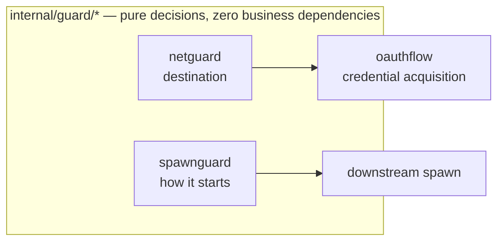

# Security and governance layer

This layer answers two questions, and deliberately no longer answers a third.

It answers **how a process is started** (command smuggling) and **where an outbound connection may
go** (SSRF). Both are decided from the request itself, before anything is contacted, and both refuse
regardless of who asked — they are not permissions, and no configuration grants an exemption from
them. `internal/oauthflow` belongs here because it is the only component that deliberately sends
credentials to the public internet, and every one of its constraints is a security constraint rather
than a protocol one.

It no longer inspects **what a downstream returned**. Earlier versions scanned results for prompt
injection and for leaked credentials, fingerprinted tool definitions to grade drift, and queued calls
for a human decision. All of it was removed: what a client may reach is decided in advance by
configuration, and a stage that reads a result in order to relabel or withhold it is the opposite of
that model. The history is worth keeping in mind when reading old commits, but nothing in the tree
does it today.

The packages collaborate in layers rather than as peers:

- `internal/guard/*` is the zero-business-dependency base (canonical.md §2 rule 4: standard library
  plus `internal/guard` itself only, enforced by depguard). These packages know nothing about
  servers, sessions, or the pipeline; they make purely functional determinations and hand the result
  up for someone else to act on.
- `internal/oauthflow` is the only credential-acquisition path, and it in turn consumes
  `internal/guard/netguard`'s predicates.



Documenting the failure direction is a uniform convention in this layer: every exported symbol's doc
comment spells out "Failure direction:", and when reading the code you should treat it as part of
the signature.

| Direction | Meaning | Typical examples |
|---|---|---|
| fail-open | If we can't decide, let it through | spawnguard's shape checks |
| fail-closed | If we can't decide, refuse | `netguard.HostIsPrivate` |
| fail-to-false | If we can't decide, don't grant trust | `netguard.HostIsDefinitelyPrivate` |

The distinction between the three is not a matter of style: the same "I'm not sure" has to produce
opposite answers depending on whether it's used to refuse or to grant trust, and netguard's paired
predicates encode exactly that into the shape of the API, outside the type system.

---

## internal/guard

**One-line responsibility**: provide the single decidable rejection sentinel for the whole guard
layer, so callers can recognize "was this a guard rejection?" without importing every subpackage.

The package is 25 lines and exports one `var ErrBlocked = errors.New("guard: blocked")`. The
convention is that every typed rejection error in the subpackages — currently `*spawnguard.Blocked`
and `*netguard.BlockedError` — implements `Unwrap() error { return guard.ErrBlocked }`, so
`errors.Is(err, guard.ErrBlocked)` holds everywhere. The machine-readable code and the
human-readable reason stay on the subpackages' concrete types; the sentinel only answers "was this
blocked by a guard".

Note that not every subpackage produces errors: some are detectors that never
return an error while scanning — they return an `Action` — so they're outside the `ErrBlocked`
system. `guard.ErrBlocked` covers "refusing an action" (starting a process, dialing a connection),
not "labeling a piece of content".

---

## internal/guard/spawnguard

**One-line responsibility**: scan the command line and environment before starting a downstream
process, and block the "smuggling shapes" that disguise arbitrary code execution as an ordinary
server entry point.

### Positioning: anti-smuggling, not a sandbox

The package comment is blunt about this, and you have to accept the framing before reading the code:
`spawnguard` does pattern matching on command lines, not execution boundaries. A server the user
configured themselves, that was always going to run code, still runs; `npx`, `uvx`, and `docker run`
with ordinary project mounts all pass through untouched. What it blocks is the shape "an
innocuous-looking entry point with `sh -c`, `LD_PRELOAD`, or `--privileged` hiding inside it". The
real isolation story lives elsewhere, and it is shipped rather than pending: the Docker spawner
(`internal/mcp/transport/docker.go`), reached by `runtime: docker`, which fails closed rather than
degrading to host execution when the isolation an entry claims cannot be delivered.

### Where it is attached

**Every spawn is screened, and the default is the guard rather than nil.** `downstream.Deps.Spawn`
resolves to the shared `spawnguard.Guard.Check` unless an assembly overrides it or sets
`SpawnUnscreened`, and `dialStdio` hands that to `transport.StdioConfig.Screen`, which both spawn
paths — plain stdio and the rewritten `docker run` line — consult on the **final** host command, after
secret expansion and after any docker rewriting.

It did not always work that way, and the shape of the omission is worth keeping: `Screen` was
implemented and called, `spawnguard` was implemented and exhaustively tested, `Deps.Spawn` existed as
`any` with the comment *"reserved for M1 spawnguard wiring; nil today"* — and nothing joined them.
The guard's only production caller was `confops`, which sees **docker** entries at `server add` time
and nothing else, so a host-runtime entry written straight into the registry was never screened at
all, by anything, and every test on both sides stayed green. That is why the default here is the
guard and the opt-out is an explicit field: a screen each assembly must remember to attach is one
that will be missing from the next assembly.

### Invariants and failure directions

- **The check order is fixed**: environment variables (a deterministic check, always first and always
  applicable) → denylist → allowlist → wrapper unwrapping → inline eval → container escape.
- **The allowlist bypasses shape checks only, never the env check.** The distinction is deliberate:
  dangerous environment variables subvert precisely that trusted binary, so putting `LD_PRELOAD` on
  an allowlisted command is the most valuable attack, not the safest one.
- **Deterministic checks always block; shape checks fail open.** A denylist hit or a dangerous env
  name is always rejected, whereas a command line `Check` cannot parse is allowed through — turning
  every uncommon but legitimate launcher into a failure costs more than a missed detection.
- **Details of the dangerous-env decision**: an empty value is treated as inert (an explicit unset)
  and allowed; `AllowEnv` matches exactly and takes precedence over both the built-in table and the
  prefix table.
- **Wrapper unwrapping goes at most 4 levels deep** (`maxWrapperDepth`); beyond that it stops and the
  remaining outer wrapper is passed through the subsequent checks as-is (fail-open). The supported
  wrappers are `env`, `busybox`, `nohup`, `setsid`, `nice`, `stdbuf`, `timeout`, `sudo`, `doas`.
- **Every wrapper registers two tables: flags that take a value and flags that don't; a flag in
  neither table causes unwrapping to be refused outright.** Registering only value-taking flags isn't
  enough — miss one and its value is taken for the command, and **the real command is never checked
  at all**:

  ```
  sudo --prompt x sh -c 'evil'     was once allowed
  timeout -d x 10 sh -c 'evil'     was once allowed
  stdbuf --input L sh -c 'evil'    was once allowed
  ```

  The handling here is deliberately different from `docker run`: the option sets of coreutils and
  sudo are **closed and documented**, so both tables can be complete, and whatever isn't listed is
  treated as "a shape this build doesn't understand" and rejected. We don't "assume it takes a value"
  the way the container side does, because at this layer **guessing wrong in either direction moves
  where the command is**, so there is no safe default to pick. The cost of forgetting to register a
  flag is loudly rejecting an uncommon but legitimate command line — the operator sees it and can fix
  it; a silent bypass is neither.
- **`env -S` is rejected outright rather than guessed at.** Split-string re-splits an opaque string
  into a command line, which is the very reason this package exists, so `-S`, `-S…`,
  `--split-string`, and `--split-string=…` all yield `CodeEnvSmuggling`. `NAME=VALUE` assignments
  inside `env` go through the same `checkEnvEntry` as a direct env slice. `env`'s own options are
  likewise registered in "takes a value / doesn't" tables, and anything unrecognized is rejected —
  GNU env and BSD env simply have different option sets (BSD has `-P`, GNU has that group of signal
  options), so no single table can be complete for both, which makes **rejection** the only answer
  that doesn't depend on which `env` is installed.
- **Docker's global flags (the ones before the subcommand) need two tables as well**, for a reason
  even harder than the run flags: misreading a global flag shifts the position of the **subcommand**,
  and when `sub` isn't `run|create|exec` the entire container check is skipped —
  `docker --tlscacert /tmp/ca run -v /:/host img` went completely unchecked for exactly this reason.
- **Inline-eval scanning stops at the first operand.** Flags after the script path belong to the
  script, and blocking them would be a false positive. `python -m` likewise terminates the scan
  (running by module name is not inline text). In the node family, besides `-e/--eval/-p/--print`,
  preload flags like `-r/--require/--import/--experimental-loader` also count as inline eval, because
  they load arbitrary modules before the script.
- **Every interpreter family has a table of "the value is the next argument" flags**, for **exactly
  the same** reason as the container case: a flag's value doesn't look like a flag either, and
  without skipping it the scan stops there treating it as an operand, so **the eval flag that follows
  is never seen**. This had only been reasoned through on the container branch, not the interpreter
  branch, so all of the following sailed right past:

  ```
  bash --rcfile /tmp/x -c 'evil'     perl -I /tmp -e 'evil'
  node --title svc -e 'evil'         php  -d k=v  -r 'evil'
  ```

  Each is just the classic `sh -c` with one harmless flag in front. The value-taking flags of
  shell / perl / ruby / php / python are a **closed set** and are now listed in full;
  **node is not** — it adds new options every release, so `node --somenewflag value -e ...` remains
  a residual possibility. Sealing it completely would require the scan to continue past the operand,
  at the cost of false positives when a script carries its own `-e`/`-c`, which is a **policy change**
  rather than a bug fix and was not done in this round.
- **The container check covers only `run|create|exec`** (including the second-level subcommand in
  `docker container run`), and the scan likewise stops at the first operand — the image name — to
  avoid false positives from the in-container command's arguments.
- **On the container side the value table is inverted: `containerBoolFlags` lists the flags that do
  NOT take a value.** This isn't a style choice. `docker run` has hundreds of flags and gains more
  every release, so a positive list of value-taking flags can never be complete, and
  **a single omission is a silent container escape** — the omitted flag's value is taken for the image
  name, the scan stops there, and none of the policy-bearing flags after it are ever judged:

  ```
  docker run --sysctl net.ipv4.ip_forward=1 -v /:/host img   was once allowed
  docker run --storage-opt size=1G --privileged img          was once allowed
  ```

  With the list inverted, **an unrecognized flag is assumed to take a value**: skip one argument and
  keep scanning, so the `-v` further along is still judged. The cost of guessing wrong is at worst
  walking into the container's own command line and raising one false positive on an argument that
  never belonged to docker — **a false positive is loud and fixable; a bypass is neither**. That's
  what moving the incompleteness to the safe side means.
- **Bind mounts are blocked only for whole trees**: any subpath of `/`, `/etc`, `/root`, `/boot`,
  `/dev`, `/var`, `/usr`, `/home`, `/proc`, and `/sys`, plus any path ending in
  `docker.sock`/`podman.sock`/`containerd.sock`. Subdirectories of `/etc` are allowed — the target is
  whole-tree exposure, not an enumeration of every possible secret. Named and anonymous volumes are
  not host binds.
- **`--privileged` is judged by its value, not by its spelling, and the failure direction is ON.**
  docker parses the attached form with `strconv.ParseBool`, so `--privileged=true`, `=1` and `=T` all
  enable it; only an explicit parseable false is treated as off, and a value neither docker nor this
  build can parse (`--privileged=yes`) is not evidence that isolation is intact. Matching the bare
  token alone was a bypass — `containerBoolFlags` had carried a `--privileged=false` entry since the
  beginning, so the attached form had been anticipated and only its harmless half was ever wired up.
  The `=false` branch is also the one place in the flag loop that continues **without** consuming a
  value, which is the shape `containerBoolFlags` was inverted to prevent; `TestPrivilegedFalseDoesNotBlindTheScan`
  is the regression for it.
- **`--cap-add` and `--security-opt` are matched by meaning, not by spelling** — the same lesson as
  `--privileged` above, in two more places. `--cap-add` stripped `CAP_` **case-sensitively and only
  then** upper-cased, so `cap_sys_admin` survived both steps as `CAP_SYS_ADMIN`, which is not a key in
  `dangerousCaps` (it holds `SYS_ADMIN`) — the lower-cased spelling was allowed and the upper-cased one
  refused, while docker grants the identical capability for both. It now folds case **before**
  stripping, the order docker normalizes in. `--security-opt` matched only the `=` separator and the
  exact string `label=disable`, but moby's `parseSecurityOpt` still falls back to `:` (the deprecation
  was never carried through to a removal) and reads a bare `disable` as SELinux label-disable, so
  `seccomp:unconfined`, `apparmor:unconfined` and `disable` each switched off a confinement layer this
  guard's own error message claims to protect. The separator is now normalized before matching, and
  both shorthands are covered. Adding confinement or naming a profile
  (`seccomp=/path/profile.json`, `apparmor=docker-default`, `no-new-privileges`, `--cap-drop`) still
  passes: a guard that refused those would push operators away from using them.
- **`--device` is a DENY list of block and memory devices**, matched on the cleaned host source — the
  first colon-separated field of `host-src[:container-dest[:permissions]]`. Refusing only the exact
  path `/dev` blocked the one form docker itself rejects, while `--device=/dev/sda` handed over the
  host filesystem and `/dev/mem` handed over its RAM. What is denied now: the `/dev` tree, `/dev/mem`,
  `/dev/kmem`, `/dev/kcore`, `/dev/port`, and the block-device families (`sd`, `hd`, `vd`, `xvd`,
  `nvme`, `dm-`, `md`, `loop`, plus the `mapper/` and `disk/` symlink trees).

  **This is the deliberate exception to "never a deny list", and the exception is what the rule is
  actually about.** That rule governs *tool selectors*, where the question is "what may this client
  reach" and an unknown answer must be no. Here the layer's own stated direction is the opposite —
  *deterministic checks always block; shape checks fail open* — because spawnguard judges a command
  line the **operator wrote**, and it is anti-smuggling rather than a sandbox. An allow list of device
  nodes cannot be completed: `/dev/dri`, `/dev/kvm`, `/dev/fuse`, `/dev/net/tun`, `/dev/snd`,
  `/dev/ttyUSB0` are all ordinary requests from a real server, and each new driver adds more. The
  denied set is the opposite shape — enumerable, stable across machines, and with no use inside an
  MCP server.

  **The cost of a false positive changed when the guard moved onto the spawn path**, which is why the
  width matters more than it used to: a refused device is now a server that dies at connect with
  `ClassFatal`, not a configuration rejected at `server add`. A narrow allow list shipped after that
  move would have taken working GPU, VM, FUSE and serial-device servers down at their next connect.
- **The runtime never generates `--privileged` or `--device` itself** — both can only arrive through
  an operator's `extraArgs` — so neither rule can invalidate a configuration AgentHub produced.

| File | Contents |
|---|---|
| `spawnguard.go` | `Guard`/`Config`/`Blocked`, check ordering, the dangerous-env table and `checkEnvEntry`, basename extraction |
| `shapes.go` | Wrapper unwrapping (including `env -S`), inline-eval shapes per interpreter family, container-escape shapes and sensitive-path determination |

---

## internal/guard/netguard

**One-line responsibility**: answer "is this destination private / not publicly routable", and screen
again at dial time against the IP actually resolved, closing the DNS-rebinding TOCTOU window.

### Key types and entry points: why there are two predicates

This is the one design point to remember about the package: "is this host private?" is **two
questions with opposite failure directions** depending on the use, so there are two exported
predicates and they must never be substituted for each other.

- `HostIsPrivate(host) bool` is for **refusing** (refusing an OAuth redirect target, a remote server
  URL). **fail-closed**: an empty host, a DNS failure or timeout (5s), and an empty answer all return
  `true`; if any record a hostname resolves to is a private address it returns `true` — one
  attacker-controlled A record has to be enough to trigger refusal.
- `HostIsDefinitelyPrivate(host) bool` is for **granting trust** (treating a target as local,
  relaxing localhost-only rules). **fail-to-false**: only a literal IP or a localhost name returns
  `true`, and it **never resolves DNS** — a DNS answer is a claim the zone owner can change at any
  time, so it can negate trust but must never grant it. Its scope is also narrower than
  `AddrIsPrivate`: only loopback, RFC1918, link-local unicast, and unspecified count, excluding
  CGNAT, the documentation ranges, and the benchmark range — those addresses aren't routable, but
  they aren't "locally private" either and shouldn't unlock local trust.

`AddrIsPrivate(netip.Addr) bool` is the address classifier both share. It returns `true` for an
invalid zero-value `Addr` (fail-closed) and calls `Unmap()` before deciding, so `::ffff:10.0.0.1` is
classified as `10.0.0.1`. Beyond the standard library's own classifications it additionally covers
`0.0.0.0/8`, CGNAT `100.64.0.0/10`, the three TEST-NET ranges, benchmark `198.18.0.0/15`,
`240.0.0.0/4`, the v6 documentation range, and **deprecated IPv6 site-local `fec0::/10`**.

That last one is the shape to watch for in this list: `netip.Addr.IsPrivate` covers the ULA range
`fc00::/7` that *replaced* site-local, and stops there, so `fec0::1` was not private to
`AddrIsPrivate` at all. Because the hostname-time screen and the dial-time `DialControl` both consult
that single function, one missing prefix opened both doors at once — a range being deprecated
(RFC 3879) makes it *less* likely to be filtered elsewhere on the host, not more.

**Three "v4 wrapped in v6" prefixes need their own coverage**: `64:ff9b::/96` (NAT64), `::/96`
(IPv4-compatible, deprecated by RFC 4291), and `2002::/16` (6to4, deprecated by RFC 7526). All three
are ways of writing an IPv4 address as IPv6, so **judging them by their v6 form answers the wrong
question** — `::127.0.0.1`, `2002:7f00:1::`, and `64:ff9b::7f00:1` all mean 127.0.0.1, and none of
them looks like loopback to `IsLoopback()`. (At one point only the NAT64 range was covered; the
other two got past even `DialControl`.)

We reject the whole range rather than extracting and reclassifying the embedded v4: the only purpose
the two deprecated forms have **is spelling an IPv4 address**, there's no use worth preserving,
rejecting the range costs nothing, and it doesn't depend on a decoder being correct.

`DialControl(network, address string, _ syscall.RawConn) error` is the package's real line of
defense; install it on `net.Dialer.Control`:

```go
d := &net.Dialer{Control: netguard.DialControl}
```

The address it sees is the **already-resolved** address the socket is about to connect to, so
whatever rebind window a hostname-level pre-check leaves open is closed here. It is fail-closed too:
if it can't parse an IP literal it refuses rather than guesses, and refusals return a
`*BlockedError` satisfying `errors.Is(err, guard.ErrBlocked)`.

### Invariants and failure directions

- "Private" in this package means uniformly "not publicly routable", not "RFC1918". When changing
  that table, think through the fact that it affects the refusal direction and the trust-granting
  direction at the same time.
- `lookupNetIP` is a package-level variable for test substitution only; the production path always
  goes through `net.DefaultResolver`.
- Hostname pre-checks are **necessarily insufficient**, and the docs state plainly that they must be
  paired with `DialControl`. `oauthflow.Client` uses them exactly that way: `checkURL` screens the
  URL's host before the request, and `dialControl` on the transport screens the actual IP at dial
  time.
- `HostIsDefinitelyPrivate` has **no caller in the tree today**. Its only consumer was the retired
  leak scanner, which used it to pick between two rules of equal severity — the one place where
  uncertainty carried no security cost. It is kept because the pairing is the point: a predicate that
  refuses on doubt and one that withholds trust on doubt are different functions, and collapsing them
  is the mistake the pair exists to prevent.

| File | Contents |
|---|---|
| `netguard.go` | `AddrIsPrivate`/`HostIsPrivate`/`HostIsDefinitelyPrivate`/`DialControl`, the non-public prefix table, `BlockedError` |

---

## internal/oauthflow

**One-line responsibility**: implement a headless OAuth 2.1 client — the discovery chain, dynamic
registration, PKCE, three interaction modes, token exchange, writing into the credential vault, and
refresh coordination — while holding the line at every step on "credentials don't escape, don't get
downgraded, and don't get double-spent".

> This section covers **the package's internal structure**. For "which spec revision we wrote
> against / which provider deployment shapes work / known gaps", see [oauth.md](oauth.md). Read that
> one first when you can't connect to some downstream OAuth server.

### Key types and entry points

A login is a pipeline, and each stage is a value usable on its own, so the CLI can emit NDJSON
progress events between stages and the daemon can re-enter at the "token exchange" stage to refresh:

```
discovery ──► registration ──► authorization ──► token exchange ──► persist
(RFC 8414/9728)  (RFC 7591)   (loopback|manual|device)   (PKCE)      (vault)
```

- `Client` (`NewClient(Config)`) is the HTTP surface, holding **two** `http.Client`s internally (see
  below).
- `Discoverer` (`DiscoverFromIssuer` / `DiscoverFromResource`) walks the RFC 9728 → RFC 8414 chain;
  `MetadataCandidates`/`ProtectedResourceCandidates` are candidate-URL generators whose order is the
  contract, `DefaultEndpoints` is the final synthesized fallback, and `ResourceMetadataURL` is the
  dedicated scanner for `WWW-Authenticate`. When every RFC 9728 candidate comes up empty,
  `fetchResourceOriginMetadata` makes a final attempt to find the RFC 8414 document on the
  **resource server's own origin** (such deployments really exist: the per-resource
  `authorization_endpoint` is published only on the RS domain, while the copy on the issuer domain is
  a generic default). That hop deliberately steps outside the spec, so it is narrowed three ways: it
  runs only after the PRM chain is entirely empty, it **does not synthesize endpoints** (it doesn't
  call `DefaultEndpoints`, which would otherwise send the browser to a URL nobody declared), and its
  result is recorded as `DiscoveryResourceOrigin` rather than `DiscoveryOK` — the document comes from
  a publisher the spec never designated, its `issuer` was not validated against where it came from,
  and that is exactly the shape of a mix-up attack.
- `ClientRegistrar` is the migration seam for registration mechanisms, with three implementations:
  `NewDCRRegistrar` (RFC 7591, marked deprecated upstream), `NewClientIDMetadataRegistrar` (the
  successor mechanism; in M1 it's a seam only and `Register` returns `ErrNotImplemented`), and
  `NewStaticRegistrar` (an operator-provisioned client_id).
- `PKCE`/`NewPKCE`/`NewState`/`SupportsS256` are the proof-key layer; `BuildAuthorizeURL`,
  `Client.Exchange`, `Client.Refresh`, and `TokenResponse` are the protocol layer.
- Three modes: `LoopbackListener`/`LoopbackFlow` (bind → register → serve → open browser → wait),
  `ParseManualCallback`/`NewManualInstructions` (pasted callback), and
  `Client.StartDevice`/`DevicePoller` (RFC 8628). `SelectMode` picks automatically.
- `Store` (`Load`/`LoadState`/`LoadAccessToken`/`Save`/`SaveFromToken`/`Clear`/
  `ClearClientRegistration`) is the vault surface, and `State` is the structure of the
  `__oauth_state__` entry.
- `Coordinator` (implementing `Refresher`) plus the generic single-flight `Group[T]` is the refresh
  coordination layer, and `Flow.Login` is the top level that strings all of the above together.
- `FlowError` is the structured error running through logs, ctlapi, and the CLI, carrying
  `Type`/`Discovery`/`Registration`/`Suggestion`/`CorrelationID`, and it always wraps a sentinel so
  `errors.Is` always works.

### Invariants and failure directions

- **Credentials are never sent to a private address; every outbound request is screened twice**: the
  URL's host is screened with `netguard.HostIsPrivate` before the request (fail-closed — unresolvable
  counts as private), and the actually-resolved IP is screened with `netguard.DialControl` at dial
  time (closing the DNS-rebind TOCTOU window). `AllowLoopback` is an explicit per-call switch, and
  even when on it allows **only** literal loopback addresses and RFC 6761's `localhost` name tree —
  `isLiteralLoopbackHost` is narrower than `netguard.HostIsDefinitelyPrivate`, RFC1918 and link-local
  are not exempt, and no hostname's DNS answer can unlock this exception. The connection pool's
  `IdleConnTimeout` is dropped to 30s to avoid reusing a connection that was still a public address
  when it was screened.
- **PKCE is never downgraded.** `ChallengeMethodS256` is the only method ever sent, and there is no
  `plain` code path in the package. `randRead` is a package-level variable rather than a config
  option — making the entropy source configurable would be manufacturing exactly that downgrade path.
  `newRandomToken` uses `io.ReadFull` so a short read can't silently shorten the verifier, and on
  failure returns `ErrEntropy` instead of falling back to `math/rand`. `BuildAuthorizeURL` errors
  outright when `PKCE` is nil, the challenge is empty, or the method isn't S256; `Client.Exchange`
  refuses to exchange without a verifier. The one random value allowed to degrade is
  `correlationID()` — if the diagnostic ID can't be generated we use a fixed placeholder rather than
  letting it turn an otherwise successful login into a failure.
- **POSTs carrying credentials follow zero redirects.** The `credential` client's `CheckRedirect`
  returns `http.ErrUseLastResponse`, and `postForm`/`postJSON` then treat any 3xx as an `ErrRedirect`.
  A 302 on a request carrying a code_verifier, a refresh token, or a client secret is an exfiltration
  primitive, not a routing detail. Logged `Location` values keep only scheme+host+path
  (`redactLocation`). By contrast the `discovery` client allows up to 3 hops, **re-screening every hop
  through `checkURL`** — metadata documents are public, and providers really do move them.
- **Persistence write order: state first, then the access token.** `Store.Save` writes
  `__oauth_state__` (which carries the **already-rotated** refresh token) before `__http_auth__`. The
  two crash windows are asymmetric: in this order a crash leaves "new refresh token + old access
  token", which self-heals on the next refresh; the reverse leaves "new access token + invalidated
  refresh token", which is unrecoverable short of a manual `auth login`. So `Save` never parallelizes
  the two writes and never proceeds past a failed first write. `Clear` mirrors the order (delete the
  token, then the state).
- **Two inherited rules in `SaveFromToken`**: a response without a refresh_token **does not clear** a
  stored one (non-rotating providers omit it on every refresh, and clearing it would turn the second
  refresh into a fresh login); and an omitted scope means "unchanged" per RFC 6749 §5.1.
- **Expiry semantics**: `ExpiresAt == 0` means **never expires**, not "already expired" (providers
  like Atlassian genuinely don't send `expires_in`). The 60s `RefreshGrace` is subtracted only from
  tokens with a lifetime over 5 minutes — subtracting it from a 60s token would make every token
  expire at birth and trap the gateway in an infinite refresh loop. `lenientNumber` never fails,
  returning 0 for anything unparseable, and negatives are zeroed in `parseTokenResponse` too —
  because an unparseable field shouldn't throw away a perfectly usable access token.
- **Refresh has a single writer, in two tiers.** Online (with the daemon present), all refreshes go
  through the in-process `Group` single-flight, because the daemon is the vault's sole writer.
  Offline, we take a `<server>.refresh.lock` sibling file lock, **and re-read the state after
  acquiring it**: the lock only serializes, it doesn't tell the second acquirer the work is already
  done. If the re-read shows `expires_at` has moved past the value observed before queueing, we
  abandon our own refresh and return `ErrRefreshSuperseded` along with the fresh credentials —
  continuing would burn the one-time refresh token the other party just stored.
  `CoordinatorConfig.Online` being nil defaults to **offline**: an extra lock acquisition costs one
  syscall, while failing to take one that was needed costs the user's refresh token.
- **`ErrNoToken` must be distinguished from `ErrNoState` and from an empty token.** A record with DCR
  credentials but no access token returns `ErrNoToken` and never `(state, "", nil)` — a caller handed
  an empty token would attach an empty Authorization header, get a 401, go "refresh", and loop
  forever. `EnsureFresh` relies on exactly this distinction to decide which errors are refreshable.
- **`ShouldRefreshOnStatus` treats 403 the same as 401**: several providers answer an expired token
  with 403. Treating 403 as "insufficient permission, don't refresh" would leave those servers
  permanently broken while still showing a Ready badge.
- **Scopes are sent verbatim, and `offline_access` is never added unilaterally.** Adding it looks like
  a convenience but is actually an escalation of consent scope: on some providers it turns a
  session-level grant into a long-lived one, and on others it makes the whole authorization fail
  outright.
- **Registration hardcodes `token_endpoint_auth_method: "none"`** and never negotiates it from
  metadata: agenthub is a public client running on the user's machine, any "client secret" it holds
  is readable by anyone who can read the vault, and what actually protects the code exchange is PKCE.
- **The order in loopback mode cannot be rearranged**: bind → build (register) → **Serve** → open
  browser → wait. Binding comes first because the port in the redirect_uri has to exist before it can
  go into the authorization request or the registration; serving comes before opening the browser
  because a socket merely sitting in the accept backlog makes a very fast redirect hang instead of
  being answered. **Every attempt uses a fresh random port** (`127.0.0.1:0`): the classic fixed-port
  bug is that a previous abandoned authorization leaves its listener running and it, not the new
  flow, catches the new callback, so the new flow times out, the old one reports a state mismatch,
  and the thing that gets blamed and turned off is the state validation that was working correctly.
  Only providers requiring an exactly pre-registered redirect_uri use `State.CallbackPort` +
  `ListenOnPort` to reuse a port, and when that port is taken the caller should discard the DCR
  credentials and re-register rather than silently switching ports. `Wait` always shuts down the
  server and releases the port before returning.
- **Callback acceptance rules**: a request with `error` fails with the AS's own error code; one with
  `code` and a matching `state` succeeds; one with `code` but a missing or mismatched `state`
  **fails loudly** (`ErrStateMismatch`) — under random ports there's no benign explanation; everything
  else (favicons, probes, a bare `GET /`) answers 204 and is ignored without ending the flow. The
  callback page is static and echoes nothing from the query string, so it can't become reflected XSS
  or a token display surface.
- **`ParseManualCallback`'s state rules branch on input shape**: any input containing a query string
  **must** carry a state and it must match, with a missing state treated as a mismatch (every AS
  echoes state back when it receives one, so its absence means this isn't this flow's callback); a
  bare code can't be validated and is still accepted — a user pasting a bare code has usually trimmed
  the URL themselves, and PKCE still stands: an intercepted code is useless without the verifier that
  never left this process. Manual mode's redirect_uri points at the **user's** machine's loopback,
  and a headless host never binds it.
- **Device flow loop rules**: `authorization_pending` keeps polling at the current interval;
  `slow_down` **permanently** increases the interval by `SlowDownIncrement` (5s, capped at 60s) rather
  than delaying once; `access_denied`/`expired_token` terminate; and any other error, transport errors
  included, terminates rather than retrying — a polling loop that swallows transport errors turns a
  network outage into a silent 15-minute hang. The device code's own expiry caps the whole loop
  independently of the interval, so a hostile `interval` can't extend it.
- **Abort conditions in the discovery chain**: a candidate returning non-2xx or unparseable JSON moves
  on to the next (providers 404 the forms they don't implement); but a candidate blocked by the SSRF
  screen or served over non-HTTPS **aborts the entire chain immediately** — that's a security
  decision, not a "try the next one" condition, and continuing would only probe more private URLs. A
  document that parses but lacks `token_endpoint`, or lacks both authorization endpoints, likewise
  errors outright rather than silently trying the next candidate: that's a broken provider and the
  operator needs to see it. The `resource_metadata` in `WWW-Authenticate` is a **hint, not an
  instruction**: it comes from an unauthenticated 401 response, so it goes through `checkURL` all the
  same, and when it can't be fetched we still fall back to the candidates derived from the resource
  URL.
- **OAuth uses its own slow backoff ladder, `SlowBackoffLadder`** (5min/15min/1h/4h/24h): an OAuth
  failure during connection is waiting on a **human**, and ordinary exponential backoff retrying every
  few seconds would just keep popping browser windows or hammering the provider's authorization
  endpoint.
- **Dependency budget**: standard library + `internal/secrets` + `internal/guard/netguard`. It imports
  no control plane, no pipeline, and no logging package — it returns a structured `*FlowError` and
  lets the caller decide how to render it.
- The file lock is real on darwin/linux (`syscall.Flock`) and on Windows (`LockFileEx`, via
  `internal/platform`); anywhere else it is an `errors.ErrUnsupported` stub, so **the offline refresh
  path would rather refuse to run than run unordered**: two processes racing for one single-use
  refresh token is worse than one "unsupported" refresh failure.


## Raised by the 2026-07-31 sweep, not fixed on that branch

Each of these survived three-lens adversarial verification and was re-read against the code. They are
recorded beside the invariant they bend rather than in a backlog file, because that is who needs to
see them. None was fixed on the sweep's branch, whose scope was the findings both engines confirmed
independently plus the two single-engine highs.

- **`oauthflow/client.go:131` — the `AllowLoopback` carve-out is decided from the RESOLVED address, so
  a DNS rebind reopens it.** With the opt-in on, `dialControl` returns nil for any dial whose resolved
  address is a loopback literal, without consulting `netguard.DialControl`. So a hostname that passed
  `checkURL` as public and then resolves to `127.0.0.1` is dialed — the discovery GET, or a `postForm`
  carrying `code_verifier`/`refresh_token`, delivered to a service on the agenthub host's loopback
  interface. This contradicts the invariant stated above for that switch: "even when on it allows only
  literal loopback addresses and RFC 6761's `localhost` name tree … and no hostname's DNS answer can
  unlock this exception." `isLiteralLoopbackHost`, the DNS-free predicate written for exactly this, is
  never consulted on the dial path. The fix has a shape: carry the already-screened hostname into the
  dialer (a per-request `DialContext` closure, or a context value set by `checkURL`) and allow the
  carve-out only when `isLiteralLoopbackHost` held for that host. The existing regressions cover the
  URL layer and bare literals passed straight to `dialControl`, which is why neither caught it.
- **`oauthflow/token.go:77` — a DISCOVERED `authorization_endpoint` is never SSRF-screened before the
  browser opens it.** Only an operator-PINNED endpoint goes through `Client.checkURL`; `BuildAuthorizeURL`
  merely `url.Parse`s what the metadata document said, and `LoopbackFlow.Run` hands the result to
  `Flow.Open`. A public AS advertising `authorization_endpoint: http://10.0.0.5:8080/authorize` thus
  drives the user's browser, with its ambient intranet cookies, at an internal destination.
  `validateMetadata` checks presence, not scheme or destination. `internal/cli/browser.go` refuses
  non-`http(s)` schemes, which closes the `file://` half but not the private-address half — and
  `Flow.Open` is injectable, so other openers get no backstop. The pinned path is screened and says
  why, in as many words: "this destination receives the user's authorization code, so it is exactly as
  sensitive". The discovered path is the same destination.
- **`netguard.go:103` — the non-public prefix table omits RFC 8215's local-use NAT64 prefix
  `64:ff9b:1::/48`.** The v4-embedding group lists `64:ff9b::/96`, `::/96` and `2002::/16` and nothing
  else, so on a network routing the local-use prefix through a NAT64 translator, a literal from it
  encodes an RFC1918 destination that `AddrIsPrivate` answers false for — passing both the hostname
  screen and the dial-time hook. The reasoning already written down for the v4-embedding block
  ("classifying the v6 form on its own merits answers the wrong question") applies identically. The
  paragraph above records that this set was widened once before, which makes this an incomplete
  enumeration rather than a decision.
