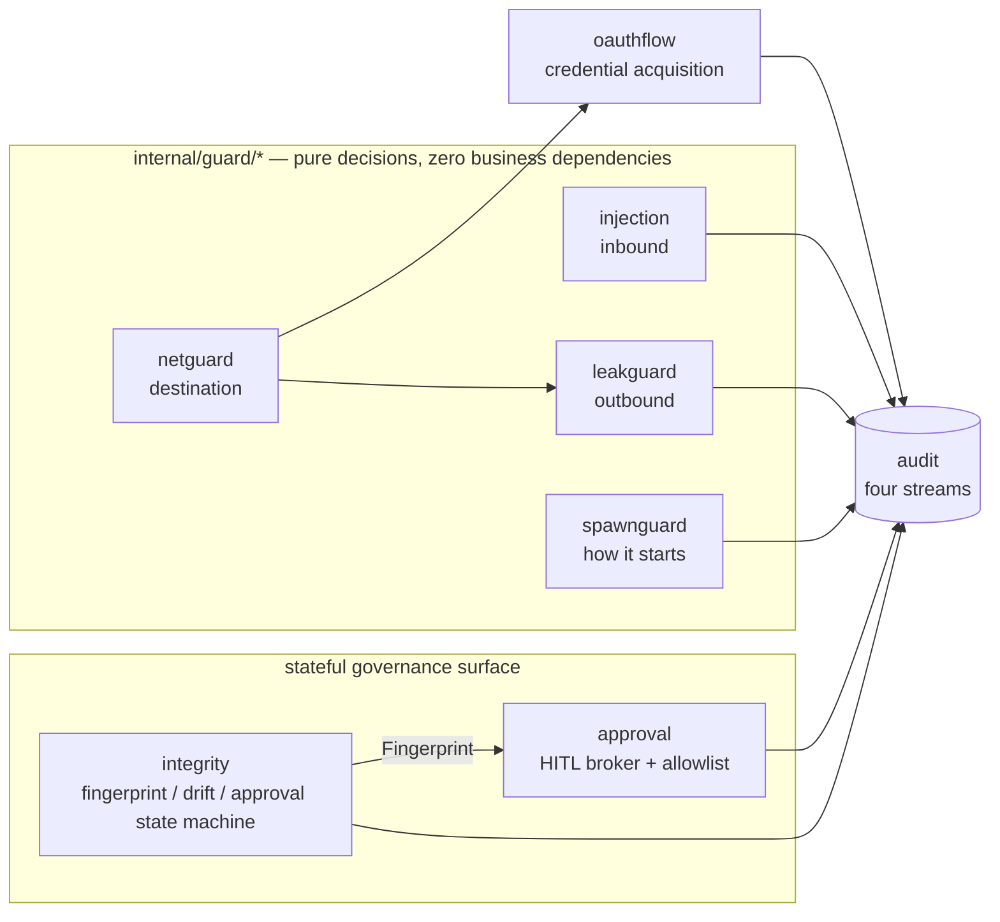
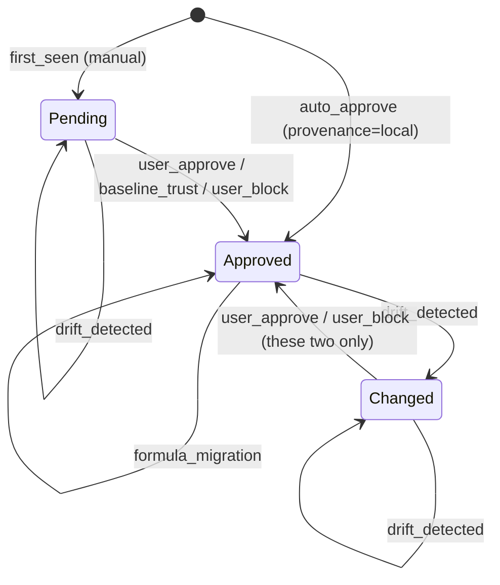

# Security and governance layer

This layer is AgentHub's "don't trust the downstream" implementation. It assumes a downstream MCP
server may be hostile, compromised, or simply sloppy, and therefore places an independent check in
every direction of the data plane: content coming in (prompt injection), content going out
(credential leaks), how processes are started (command smuggling), where outbound connections go
(SSRF), changes to tool definitions (rug-pull), calls that need a human nod (HITL approval), and a
trail of all of it (the four audit streams). `internal/oauthflow` belongs to this layer because it's
the only component that deliberately sends credentials out to the public internet, and every one of
its constraints is a security constraint rather than a protocol one.

The packages collaborate in layers rather than as peers:

- `internal/guard/*` is the zero-business-dependency base (canonical.md §2 rule 4: standard library
  plus `internal/guard` itself only, enforced by depguard). These packages know nothing about
  servers, sessions, or the pipeline; they make purely functional determinations and hand the result
  up for someone else to act on.
- `internal/integrity` and `internal/approval` are the stateful governance surface: the former
  answers "is this tool definition still the one I recognize", the latter "does a human consent to
  this particular call". The two are deliberately orthogonal and never write to each other's
  storage.
- `internal/audit` is everyone's exit. The write discipline of the four streams (single-line
  `O_APPEND` writes, a cross-process dedup window) is a concurrency-correctness dependency, not a
  belt-and-braces measure.
- `internal/oauthflow` is the only credential-acquisition path, and it in turn consumes
  `internal/guard/netguard`'s predicates.



Documenting the failure direction is a uniform convention in this layer: every exported symbol's doc
comment spells out "Failure direction:", and when reading the code you should treat it as part of
the signature.

| Direction | Meaning | Typical examples |
|---|---|---|
| fail-open | If we can't decide, let it through | All detectors (injection / leakguard / spawnguard shape checks), audit dedup |
| fail-closed | If we can't decide, refuse | `netguard.HostIsPrivate`, integrity storage corruption, everything non-Approved in approval |
| fail-to-false | If we can't decide, don't grant trust | `netguard.HostIsDefinitelyPrivate`, leakguard's validators |

The distinction between the three is not a matter of style: the same "I'm not sure" has to produce
opposite answers depending on whether it's used to refuse or to grant trust, and netguard's paired
predicates encode exactly that into the shape of the API, outside the type system.

---

## internal/guard

**One-line responsibility**: provide the single decidable rejection sentinel for the whole guard
layer, so callers can recognize "was this a guard rejection?" without importing every subpackage.

The package is 25 lines and exports one `var ErrBlocked = errors.New("guard: blocked")`. The
convention is that every typed rejection error in the subpackages — currently `*spawnguard.Blocked`
and `*netguard.BlockedError` — implements `Unwrap() error { return guard.ErrBlocked }`, so
`errors.Is(err, guard.ErrBlocked)` holds everywhere. The machine-readable code and the
human-readable reason stay on the subpackages' concrete types; the sentinel only answers "was this
blocked by a guard".

Note that not every subpackage produces errors: `injection` and `leakguard` are detectors that never
return an error while scanning — they return an `Action` — so they're outside the `ErrBlocked`
system. `guard.ErrBlocked` covers "refusing an action" (starting a process, dialing a connection),
not "labeling a piece of content".

---

## internal/guard/injection

**One-line responsibility**: detect prompt-injection payloads in downstream tool results with a rule
table before they enter the agent context, and decide per policy whether to label or reject.

### Invariants and failure directions

- **Both the success and error branches must go through `ScanResult` (#421).** The reason the API
  takes a flat `[]string` rather than an `mcp.CallResult` is precisely so "text a tool returned
  successfully" and "the JSON-RPC error message a tool returned" share one shape, closing the
  "hostile server smuggles injection through the error branch" path.
- **Failing open is an explicit trade-off.** Scanning never fails: base64 we can't decode, phrasings
  that dodge the rule table, and content past the window all pass through unchanged. When content
  exceeds `2*WindowBytes` (32 KiB by default) only the head and tail windows are scanned; the middle
  is explicitly given up in exchange for bounded work.
- **The zero-value policy never blocks.** `ModeLabel` is `Mode`'s zero value, so a `Policy` nobody
  configured only labels. Exemptions have to be an explicitly configured list of server IDs; the
  scanner never infers them. `Severity`'s zero value is invalid, so an uninitialized `Rule` errors
  during `compileRules` rather than being silently scanned as low.
- **Rules match against normalized text; base64 is discovered in the original.** `normalizeContent`
  is the NFKC approximation the standard library can reach: strip zero-width/bidi-control/variation
  selectors/soft hyphens, strip combining marks (Mn), fold full-width ASCII,
  **fold Cyrillic/Greek homoglyphs back to ASCII**, collapse whitespace runs to a single space, and
  lowercase everything. Custom rules therefore have to be written in lowercase, single-space form.
  Base64 scanning has to run before normalization because base64 is case-sensitive — the ordering in
  `scanChunk` must not be swapped.
- **Homoglyph folding closes the last "ASCII payload in disguise" technique.** Zero-width
  interleaving, diacritic disguises, and full-width variants were already blocked, but swapping a
  Latin `o` for Cyrillic `U+043E` bypassed entire segments — **one keystroke from the attacker and
  every phrase rule goes blind at once**. That's the same class as the techniques already covered;
  it doesn't belong in the documented fail-open bucket of "phrasings the rule table doesn't know".
  Folding happens **after** lowercasing, so lowercase entries in the table cover both cases (Cyrillic
  `В` is lowercased to `в` first, then folded) — which is also where the awkward-looking `в→b` and
  `н→h` entries come from: they resemble the **uppercase** forms (В/B, Н/H), and that's exactly the
  pair an attacker would use. This is not the full Unicode confusables set (TR39 is a large table and
  `x/text` is out of reach for a zero-dependency base); we take only the subset that maps to ASCII
  letters, which is all English phrase rules need. False positives aren't merely "unlikely", they're
  **impossible to construct**: the rules are multi-word English phrases, so foreign-language text
  would have to be deliberately assembled into one to match, and CJK has no ASCII homoglyphs at all.
- **`normText`'s offset mapping has hard invariants**: `len(offs) == len(text)+1` and
  `offs[len(text)] == len(original)`. Mapping a match `[s,e)` back to the original as
  `[offs[s], offs[e])` is approximate (stripped characters get absorbed into the span), and that's
  explicitly accepted: spans locate a payload, they aren't used to cut an exact quotation.
- **Nested base64 has a depth cap** (3 by default, negative disables it); a decode result must be
  valid UTF-8 and ≥90% printable before scanning continues, and spans from deep hits are always
  anchored to the outermost blob's range in the original text.
- **Deterministic output is a contract**: `dedupSort` sorts and dedups by
  `(segment, start, end, depth, rule)`, golden tests depend on that ordering, and a rule ID is
  treated as ABI once it lands in an audit record.

| File | Contents |
|---|---|
| `injection.go` | `Scanner`/`Finding`/`Config`, window splitting, rule matching, nested base64 scanning, dedup and sorting |
| `policy.go` | `Mode`/`Action`/`Policy`/`Result` and the sole entry point `ScanResult` |
| `rules.go` | `Severity`, `Rule` compilation, the built-in rule table `DefaultRules` |
| `normalize.go` | Normalization and offset mapping via `normText`, the invisible-character table, rune boundary helpers |

---

## internal/guard/spawnguard

**One-line responsibility**: scan the command line and environment before starting a downstream
process, and block the "smuggling shapes" that disguise arbitrary code execution as an ordinary
server entry point.

### Positioning: anti-smuggling, not a sandbox

The package comment is blunt about this, and you have to accept the framing before reading the code:
`spawnguard` does pattern matching on command lines, not execution boundaries. A server the user
configured themselves, that was always going to run code, still runs; `npx`, `uvx`, and `docker run`
with ordinary project mounts all pass through untouched. What it blocks is the shape "an
innocuous-looking entry point with `sh -c`, `LD_PRELOAD`, or `--privileged` hiding inside it". The
real isolation story lives elsewhere (M2's Docker Spawner).

### Invariants and failure directions

- **The check order is fixed**: environment variables (a deterministic check, always first and always
  applicable) → denylist → allowlist → wrapper unwrapping → inline eval → container escape.
- **The allowlist bypasses shape checks only, never the env check.** The distinction is deliberate:
  dangerous environment variables subvert precisely that trusted binary, so putting `LD_PRELOAD` on
  an allowlisted command is the most valuable attack, not the safest one.
- **Deterministic checks always block; shape checks fail open.** A denylist hit or a dangerous env
  name is always rejected, whereas a command line `Check` cannot parse is allowed through — turning
  every uncommon but legitimate launcher into a failure costs more than a missed detection.
- **Details of the dangerous-env decision**: an empty value is treated as inert (an explicit unset)
  and allowed; `AllowEnv` matches exactly and takes precedence over both the built-in table and the
  prefix table.
- **Wrapper unwrapping goes at most 4 levels deep** (`maxWrapperDepth`); beyond that it stops and the
  remaining outer wrapper is passed through the subsequent checks as-is (fail-open). The supported
  wrappers are `env`, `busybox`, `nohup`, `setsid`, `nice`, `stdbuf`, `timeout`, `sudo`, `doas`.
- **Every wrapper registers two tables: flags that take a value and flags that don't; a flag in
  neither table causes unwrapping to be refused outright.** Registering only value-taking flags isn't
  enough — miss one and its value is taken for the command, and **the real command is never checked
  at all**:

  ```
  sudo --prompt x sh -c 'evil'     was once allowed
  timeout -d x 10 sh -c 'evil'     was once allowed
  stdbuf --input L sh -c 'evil'    was once allowed
  ```

  The handling here is deliberately different from `docker run`: the option sets of coreutils and
  sudo are **closed and documented**, so both tables can be complete, and whatever isn't listed is
  treated as "a shape this build doesn't understand" and rejected. We don't "assume it takes a value"
  the way the container side does, because at this layer **guessing wrong in either direction moves
  where the command is**, so there is no safe default to pick. The cost of forgetting to register a
  flag is loudly rejecting an uncommon but legitimate command line — the operator sees it and can fix
  it; a silent bypass is neither.
- **`env -S` is rejected outright rather than guessed at.** Split-string re-splits an opaque string
  into a command line, which is the very reason this package exists, so `-S`, `-S…`,
  `--split-string`, and `--split-string=…` all yield `CodeEnvSmuggling`. `NAME=VALUE` assignments
  inside `env` go through the same `checkEnvEntry` as a direct env slice. `env`'s own options are
  likewise registered in "takes a value / doesn't" tables, and anything unrecognized is rejected —
  GNU env and BSD env simply have different option sets (BSD has `-P`, GNU has that group of signal
  options), so no single table can be complete for both, which makes **rejection** the only answer
  that doesn't depend on which `env` is installed.
- **Docker's global flags (the ones before the subcommand) need two tables as well**, for a reason
  even harder than the run flags: misreading a global flag shifts the position of the **subcommand**,
  and when `sub` isn't `run|create|exec` the entire container check is skipped —
  `docker --tlscacert /tmp/ca run -v /:/host img` went completely unchecked for exactly this reason.
- **Inline-eval scanning stops at the first operand.** Flags after the script path belong to the
  script, and blocking them would be a false positive. `python -m` likewise terminates the scan
  (running by module name is not inline text). In the node family, besides `-e/--eval/-p/--print`,
  preload flags like `-r/--require/--import/--experimental-loader` also count as inline eval, because
  they load arbitrary modules before the script.
- **Every interpreter family has a table of "the value is the next argument" flags**, for **exactly
  the same** reason as the container case: a flag's value doesn't look like a flag either, and
  without skipping it the scan stops there treating it as an operand, so **the eval flag that follows
  is never seen**. This had only been reasoned through on the container branch, not the interpreter
  branch, so all of the following sailed right past:

  ```
  bash --rcfile /tmp/x -c 'evil'     perl -I /tmp -e 'evil'
  node --title svc -e 'evil'         php  -d k=v  -r 'evil'
  ```

  Each is just the classic `sh -c` with one harmless flag in front. The value-taking flags of
  shell / perl / ruby / php / python are a **closed set** and are now listed in full;
  **node is not** — it adds new options every release, so `node --somenewflag value -e ...` remains
  a residual possibility. Sealing it completely would require the scan to continue past the operand,
  at the cost of false positives when a script carries its own `-e`/`-c`, which is a **policy change**
  rather than a bug fix and was not done in this round.
- **The container check covers only `run|create|exec`** (including the second-level subcommand in
  `docker container run`), and the scan likewise stops at the first operand — the image name — to
  avoid false positives from the in-container command's arguments.
- **On the container side the value table is inverted: `containerBoolFlags` lists the flags that do
  NOT take a value.** This isn't a style choice. `docker run` has hundreds of flags and gains more
  every release, so a positive list of value-taking flags can never be complete, and
  **a single omission is a silent container escape** — the omitted flag's value is taken for the image
  name, the scan stops there, and none of the policy-bearing flags after it are ever judged:

  ```
  docker run --sysctl net.ipv4.ip_forward=1 -v /:/host img   was once allowed
  docker run --storage-opt size=1G --privileged img          was once allowed
  ```

  With the list inverted, **an unrecognized flag is assumed to take a value**: skip one argument and
  keep scanning, so the `-v` further along is still judged. The cost of guessing wrong is at worst
  walking into the container's own command line and raising one false positive on an argument that
  never belonged to docker — **a false positive is loud and fixable; a bypass is neither**. That's
  what moving the incompleteness to the safe side means.
- **Bind mounts are blocked only for whole trees**: any subpath of `/`, `/etc`, `/root`, `/boot`,
  `/dev`, `/var`, `/usr`, `/home`, `/proc`, and `/sys`, plus any path ending in
  `docker.sock`/`podman.sock`/`containerd.sock`. Subdirectories of `/etc` are allowed — the target is
  whole-tree exposure, not an enumeration of every possible secret. Named and anonymous volumes are
  not host binds.

| File | Contents |
|---|---|
| `spawnguard.go` | `Guard`/`Config`/`Blocked`, check ordering, the dangerous-env table and `checkEnvEntry`, basename extraction |
| `shapes.go` | Wrapper unwrapping (including `env -S`), inline-eval shapes per interpreter family, container-escape shapes and sensitive-path determination |

---

## internal/guard/netguard

**One-line responsibility**: answer "is this destination private / not publicly routable", and screen
again at dial time against the IP actually resolved, closing the DNS-rebinding TOCTOU window.

### Key types and entry points: why there are two predicates

This is the one design point to remember about the package: "is this host private?" is **two
questions with opposite failure directions** depending on the use, so there are two exported
predicates and they must never be substituted for each other.

- `HostIsPrivate(host) bool` is for **refusing** (refusing an OAuth redirect target, a remote server
  URL). **fail-closed**: an empty host, a DNS failure or timeout (5s), and an empty answer all return
  `true`; if any record a hostname resolves to is a private address it returns `true` — one
  attacker-controlled A record has to be enough to trigger refusal.
- `HostIsDefinitelyPrivate(host) bool` is for **granting trust** (treating a target as local,
  relaxing localhost-only rules). **fail-to-false**: only a literal IP or a localhost name returns
  `true`, and it **never resolves DNS** — a DNS answer is a claim the zone owner can change at any
  time, so it can negate trust but must never grant it. Its scope is also narrower than
  `AddrIsPrivate`: only loopback, RFC1918, link-local unicast, and unspecified count, excluding
  CGNAT, the documentation ranges, and the benchmark range — those addresses aren't routable, but
  they aren't "locally private" either and shouldn't unlock local trust.

`AddrIsPrivate(netip.Addr) bool` is the address classifier both share. It returns `true` for an
invalid zero-value `Addr` (fail-closed) and calls `Unmap()` before deciding, so `::ffff:10.0.0.1` is
classified as `10.0.0.1`. Beyond the standard library's own classifications it additionally covers
`0.0.0.0/8`, CGNAT `100.64.0.0/10`, the three TEST-NET ranges, benchmark `198.18.0.0/15`,
`240.0.0.0/4`, and the v6 documentation range.

**Three "v4 wrapped in v6" prefixes need their own coverage**: `64:ff9b::/96` (NAT64), `::/96`
(IPv4-compatible, deprecated by RFC 4291), and `2002::/16` (6to4, deprecated by RFC 7526). All three
are ways of writing an IPv4 address as IPv6, so **judging them by their v6 form answers the wrong
question** — `::127.0.0.1`, `2002:7f00:1::`, and `64:ff9b::7f00:1` all mean 127.0.0.1, and none of
them looks like loopback to `IsLoopback()`. (At one point only the NAT64 range was covered; the
other two got past even `DialControl`.)

We reject the whole range rather than extracting and reclassifying the embedded v4: the only purpose
the two deprecated forms have **is spelling an IPv4 address**, there's no use worth preserving,
rejecting the range costs nothing, and it doesn't depend on a decoder being correct.

`DialControl(network, address string, _ syscall.RawConn) error` is the package's real line of
defense; install it on `net.Dialer.Control`:

```go
d := &net.Dialer{Control: netguard.DialControl}
```

The address it sees is the **already-resolved** address the socket is about to connect to, so
whatever rebind window a hostname-level pre-check leaves open is closed here. It is fail-closed too:
if it can't parse an IP literal it refuses rather than guesses, and refusals return a
`*BlockedError` satisfying `errors.Is(err, guard.ErrBlocked)`.

### Invariants and failure directions

- "Private" in this package means uniformly "not publicly routable", not "RFC1918". When changing
  that table, think through the fact that it affects the refusal direction and the trust-granting
  direction at the same time.
- `lookupNetIP` is a package-level variable for test substitution only; the production path always
  goes through `net.DefaultResolver`.
- Hostname pre-checks are **necessarily insufficient**, and the docs state plainly that they must be
  paired with `DialControl`. `oauthflow.Client` uses them exactly that way: `checkURL` screens the
  URL's host before the request, and `dialControl` on the transport screens the actual IP at dial
  time.
- `HostIsDefinitelyPrivate`'s only caller today is `leakguard.isInternalHost`, choosing between the
  `credential-url` and `internal-credential-url` rules at the same severity — the one place in the
  package where uncertainty carries no security cost.

| File | Contents |
|---|---|
| `netguard.go` | `AddrIsPrivate`/`HostIsPrivate`/`HostIsDefinitelyPrivate`/`DialControl`, the non-public prefix table, `BlockedError` |

---

## internal/guard/leakguard

**One-line responsibility**: detect sensitive data flowing outward in downstream tool results
(credentials, private keys, personal information), and decide per governance tier whether to only
record an audit entry or to redact in place on the call path.

### Two dispositions and a confidence hierarchy

`injection` guards the inbound direction; `leakguard` guards the outbound one. Per ruling #17 there
are only two dispositions:

- **AUDIT (on by default)**: the scan runs off the call path, and only a sanitized record — rule ID,
  severity, position, length — enters the audit stream; **matched content never does**. Zero added
  call latency.
- **INLINE (off by default, must be configured explicitly)**: the scan runs on the call path, and
  every qualifying span is replaced with `[REDACTED:<ruleID>]` before the result reaches the agent.
  Rewriting results carries semantic risk, so it must be chosen and can never be inherited.

The rule table is organized by confidence: high-confidence rules key off a credential's own structure
(PEM headers, the `ghp_` prefix, a JWT header that decodes to an `alg`, a card number that passes
Luhn) and may redact in place; entropy heuristics are a low-confidence signal, carry `SeverityLow`,
and have `Redaction` permanently set to `RedactNone`, so no policy configuration can make them
rewrite a result.

**agenthub's own agent token needs a named rule (`agenthub-agent-token`), because the entropy
heuristic is structurally blind to it**: the token body is 64 hex characters, and hex tops out at
4.0 bits/char of information — below the 4.5 threshold. That exclusion is itself correct (a digest
isn't a secret, and reporting every SHA would drown the signal), but it is blind to
**hex-encoded credentials** — and agenthub's token happens to be exactly that.

The leak path isn't agenthub printing the token itself, it's **a downstream tool handing it back**: a
tool that reads a file, greps a repo, or dumps environment variables will emit verbatim whatever the
operator left in `.env` or a shell profile.

The `agt_` prefix is a **second copy** inside leakguard (`internal/guard/*` is a zero-business-
dependency base and cannot import `internal/httpbridge`). The two copies are pinned together by
`TestMintedTokenIsDetectedAsALeak`: it **actually mints a token** on the httpbridge side and hands it
to leakguard to scan, so changing `mint()` and forgetting the rule fails immediately, rather than
letting the guard keep passing its own tests while failing to recognize the very thing it exists for.
This is the same arrangement as `api.DefaultSocketPath` ≡ `platform.CtlSocketPath`.

### Invariants and failure directions

- **`Preview` is computed from `(rule, length)` alone; this is the package's central red line.**
  Evidence fields get rendered into terminals, the GUI, logs, and audit records, so the moment one
  might carry matched bytes, all of those surfaces become places where secrets land. `newFinding` is
  the only `Finding` constructor, so no new rule, validator, or caller can route around it to leak
  content; the format is pinned by golden tests and the invariant by property tests.
- **`AuditRecord` contains no content, no preview, and no excerpt** — only rule, severity, segment
  index, start/end, and length. The whole point of the async audit hook is to make leaks
  investigable without the audit chain becoming a second copy of the leak.
- **`Mode`'s zero value is `ModeAudit`**, and `ParseMode("")` also returns audit rather than off; an
  unrecognized value returns an **error** while still returning `ModeAudit` — a typo in the config
  must never silently disable the guard, and a caller that ignored the error is still auditing.
- **Two independent reasons keep entropy heuristics from rewriting results**: the `RedactNone` policy,
  and `MinRedactSeverity` defaulting to medium, which keeps `SeverityLow` off the rewrite path. The
  redundancy is intentional — either one failing alone still can't turn a heuristic into a mutation.
- **Matching runs on the raw text, with no normalization.** The opposite of injection: secrets are
  case- and alphabet-sensitive, and normalization would destroy the structure high-confidence rules
  depend on.
- **Overlap resolution runs on the full match range (`fullStart`/`fullEnd`), not the redaction
  range.** Two distinct secrets don't overlap in the text, so an overlap can only mean two rules
  describe the same bytes (`authorization-header` vs `bearer-token`, an entropy signal vs a vendor
  rule, the tail of a connection string vs the email/password rules). The retention rule is "higher
  severity wins, then longer, then earlier, then rule ID lexicographically", and output is ordered by
  `(segment, start, end, rule)` — the order is a contract, and because full ranges are mutually
  non-overlapping, redaction ranges necessarily are too, which is exactly `Redact`'s precondition.
- **`Redact` does not trust the spans it's handed**: a start that goes backwards, an out-of-range
  span, or an empty span is skipped rather than believed. A guard that panics on a hostile payload is
  a denial-of-service entry point.
- **Validators always fail to false**: input that can't be decoded, computed, or classified isn't
  reported. The one exception is `isInternalHost`, which merely picks between two rules of identical
  severity and redaction for the audit label, where uncertainty costs nothing.
- **`compileRules` fails at construction time, not in production**: empty ID, duplicate ID, an ID
  occupying the reserved `EntropyRuleID`, out-of-range severity/redaction, a missing Regex, and
  `RedactSecret` without a `(?P<secret>…)` capture group — that last one, if let through, would make
  a rule silently redact the whole match instead of just the secret.
- **Work is bounded**: 32 KiB head and tail windows by default (giving up the middle is an explicit
  fail-open, and also why "inline is a mitigation, not a guarantee"), at most 50 findings per `Scan`,
  a per-rule raw match cap of `4 × MaxFindings`, and a maximum entropy candidate length of 512 bytes.
  `Result.Truncated` only means the report was truncated; **rewriting is never truncated** — every
  segment is still rewritten in full.
- **All three gates on the entropy heuristic are required**: length ≥ `EntropyMinLen` (32 by
  default), Shannon entropy ≥ the threshold (4.5 bits/char by default — a hex digest tops out at 4.0
  and is therefore structurally excluded, because a digest isn't a secret), and ≥ 3 character
  classes.

| File | Contents |
|---|---|
| `leakguard.go` | `Scanner`/`Finding`/`Config`, window splitting, match evaluation, overlap resolution and output ordering |
| `policy.go` | `Mode`/`ParseMode`/`Policy`/`Action`/`Result`, the `ScanResult` entry point, `AuditRecord` and `Records` |
| `rules.go` | `Severity`/`Redaction`/`Match`/`Rule` compilation, the built-in high-confidence rule table `DefaultRules` |
| `validate.go` | False-positive gates: placeholder recognition, password shapes, JWT header decoding, Luhn and issuer prefixes, internal-host classification |
| `entropy.go` | The reserved rule ID `EntropyRuleID`, candidate splitting, Shannon entropy and character-class counting |
| `redact.go` | `Label`, the pure `preview` function, `Redact` and its precondition checks |

---

## internal/integrity

**One-line responsibility**: fingerprint each downstream tool definition and pin it as a baseline,
grade subsequent changes as drift, manage visibility through quarantine and call permission through
an approval state machine — the two being orthogonal.

### Invariants and failure directions

Every item in this section is an incident-driven inheritance (toolport's `integrity.rs` / mcpproxy),
and the comments say plainly "do not simplify away".

- **Corrupt ≠ fresh.** File absent = brand new (no pins on first run, which is legitimate); file
  present but unreadable = `CorruptError`, and every operation fails loudly (fail-closed) and
  **never renames, never truncates**. Renaming to `.corrupt` would make the next read look like a
  legitimate empty set, and a silent re-baseline is exactly what a tamperer wants. `ErrStoreCorrupt`
  and `ErrNotFound` have to be strictly distinguished: treating a transient decode error as "no such
  record" lets the auto-approve path overwrite a Pending record.
- **Reads get a short retry**: `loadStore` retries up to `readRetries` (4) times with
  `readRetryDelay` (75ms) in between to absorb rename transients before declaring corruption. A file
  with a future version number also counts as corrupt — speculative interpretation would silently
  drop fields carrying security state.
- **New tools are never quarantined.** Catalog growth isn't a rug-pull, and HITL/confirmation at call
  time already covers first use.
- **Merges never delete.** A tool that disappears from the catalog keeps its pin and is reported as
  `DriftRemoved`, so when it reappears it's checked against the **original baseline** rather than
  blindly re-pinned.
- **A formula migration must never look like a fake rug-pull.** A pin records the
  `HashSchemaVersion` that produced it; on a version mismatch we first recompute **the pinned
  snapshot** with the current formula, and if the content matches we migrate the hash in place and
  report `DriftUnchanged`. Roughly half of mcpproxy's quarantine code exists to clean up after this
  one mistake.
- **Quarantine is keyed by the client-visible exposed name, and it must be the name after per-scope
  overrides have been applied (#423).** Keying by the original name once let a rename move a tool
  entirely outside integrity's jurisdiction. `QuarantineEntry` also retains the original
  `Server`/`Tool` route, which is what makes re-baselining onto the right pin possible after release.
  Computing the exposed name is the caller's responsibility; this package only stores and retrieves
  by it.
- **`IsQuarantined`'s error matters more than its bool**: on error the bool is `false` but the error
  is non-nil, and callers must treat any error as "quarantined / blocked" rather than looking only at
  the boolean.
- **The approval state machine has exactly one safety property, but it's written twice.** The
  `allowedTransitions` table specifies that `Changed → Approved` is permitted only via
  `ReasonUserApprove` / `ReasonUserBlock`; `assertTransition` hardcodes a re-check of the same
  property before consulting the table, so that a future bad edit to the table cannot quietly weaken
  it. Any forbidden transition returns a `*TransitionError`, the record is left untouched, and the
  tool stays blocked.
- **`Block` is an atomic blacklisting done in one write**: the same record write sets both
  `Status=Approved` (pinned to the current hash) and `Disabled=true`, so there is no crash window
  containing an "approved and enabled rug-pulled tool".
- **`BaselineTrust` only promotes Pending**; `Changed` records are deliberately skipped — re-trusting
  a server must not clear rug-pull markers, which can only be resolved by per-tool
  `Approve`/`Block`.
- **Auto mode in `Observe` does not exempt drift**: any drift after approval goes to `Changed`
  regardless of provenance. `DefaultModeFor` returns `ModeAuto` only for `ProvenanceLocal`, with
  everything else (including unknown values) getting `ModeManual` (fail-closed), and in `newRecord`
  only an explicit `ModeAuto` self-approves.
- **`CallAllowed()` is the sole call gate**: only `StateApproved && !Disabled` passes; zero-value
  records, Pending, Changed, and Disabled are all blocked. The index/search surface and the call
  surface must read the same stored state ("both gates agree", docs/modules/dataplane.md).
- **Quarantine and approval are orthogonal**: releasing from quarantine isn't approval, approval
  doesn't release from quarantine, and neither store writes the other's.
- **Cross-process discipline**: N gateways plus the daemon run integrity checks on the same set of
  files, so every read-modify-write cycle holds a sibling flock (`<file>.lock`, 10s timeout by
  default, 5ms polling, ctx-cancellable) for its entire duration, and nothing anywhere in the code
  assumes a single writer. Writes follow the `atomicWrite` ladder: temp file in the same directory →
  chmod 0600 → write → fsync → rename → fsync the parent directory. The directory is guaranteed 0700
  by `platform.EnsureDir`.
- **Dependency budget**: standard library plus `internal/platform`. The file lock and atomic write
  ladder are a **deliberate independent reimplementation** of the equivalent code in
  `internal/registry`, not a reuse — integrity must not drag registry's document model into the data
  plane.
- **The three filenames are frozen** (`tool-pins.json` / `quarantine.json` / `tool-approvals.json`);
  renaming them would orphan every existing baseline. `storeVersion` is currently 1.



`Disabled` is not a state but a boolean orthogonal to `Status`, set by `SetDisabled` or `Block`.

### Current assembly status

The gateway consumes two stores through `internal/gateway/toolpolicy.go`:
`ApprovalStore.DisabledTools` and `QuarantineStore.Snapshot` are projected into a `router.Policy`
that removes disabled/quarantined tools from the catalog entirely **during aggregation** (not listed,
not routable), with hot reload driven by fsnotify plus polling. **The failure direction is refusal**:
if a read has never succeeded the catalog is empty, and on a failed reload the currently effective
deny set is retained — never relaxed because a read failed. The gateway also uses
`integrity.Fingerprint` to bind HITL approvals to live definitions
(`internal/gateway/asker.go`).

`DisabledTools` **projects only the `Disabled` flag, not `Status`** — moving `CallAllowed()` wholesale
into the data plane would make every unapproved tool vanish from the catalog under ModeManual, which
is a change to default product behavior, not a storage detail.

Still without a non-test caller: `CheckServer`, `IsQuarantined`, `BaselineTrust`,
`QuarantineStore.Add`, `Block`, and `DefaultModeFor`. An inventory of what is NOT wired is exactly
the kind nothing forces anyone to revisit, and the last two entries were missing from it while this
paragraph described both as though they were in service — so `test/buildrules` now fails if any
listed symbol acquires a caller. It checks five of the six: `QuarantineStore.Add` shares a method
name with `sync.WaitGroup`, `time.Time` and the fsnotify watcher, and attributing it by name alone
reports unrelated calls as evidence. The reverse direction — that a newly-unwired export gets added
here — needs call-graph analysis and remains a review question, not a guarantee.

- **`Block` has no command.** There is no `agenthub tool block`. The atomic approve-and-disable
  write described above exists at the storage layer and nothing reaches it; blocking a tool today
  means `agenthub tool disable`, which sets `Disabled` without pinning the hash.
- **`DefaultModeFor` decides nothing.** The one non-test `Observe` call
  (`internal/confops/toolgov.go`) passes `ModeManual` outright, so provenance selects an approval
  mode nowhere and no tool ever self-approves. The `[*] --> Approved: auto_approve
  (provenance=local)` edge in the diagram above is a property of the state machine, not a path the
  assembled product can take.

`internal/cli/toolgov.go` drives `Approve`/`Rebaseline`/`Pins`/`quarantine ls|release`, and
`Observe` reaches the store through `internal/confops`. The drift column of
`agenthub tool pins` is computed by the CLI itself comparing `Fingerprint` against pins entry by
entry, without going through `CheckServer`. In other words, the **automatic** drift-grading and
auto-quarantine chain is fully implemented at the storage layer with cross-process tests, but is not
yet wired into the gateway's catalog refresh path; today the quarantine set can only be written by
the CLI/daemon, and once written the gateway honors it immediately.

---

## internal/approval

**One-line responsibility**: implement HITL approval — a resident `Broker` in the daemon queues
intercepted calls for a human to decide, the gateway side reaches it through the `Asker` façade, and
a fingerprint-keyed allowlist remembers "approve permanently".

`Asker` has only `Ask`, which is everything the data plane needs; `MemBroker` implements the full
`Broker` in-process inside the daemon, while `RemoteAsker` is the stdio-gateway implementation over
the UDS control connection.

### Invariants and failure directions: fail-closed all the way down

- **Only `Approved` permits execution.** `Denied`, `Timedout`, `Unreachable`, and `Stale` are all
  terminal refusals, and a caller that can't tell them apart still has to block. `Decision`'s zero
  value is `Denied`, `ParseDecision` returns `(Unreachable, false)` for unknown strings, and
  `RemoteAsker` returns `Unreachable` for an out-of-range `Decision` value too — no path turns
  corrupt data into an approval.
- **No subscribers means an immediate `Unreachable`** (inherited from toolport's headless semantics).
  We can't leave the agent waiting until the deadline for a human who can't even see the request.
- **The deadline is stamped by the broker** (default `DefaultTTL` 120s), so the UI countdown and the
  automatic refusal land at the same instant. An answer arriving after expiry gets `ErrExpired`, and
  `AnswerAs` adds one more case: if the deadline has passed but `Ask`'s timer hasn't fired yet, it's
  recorded as `Timedout` on the spot — a late approval never executes.
- **`RemoteAsker` folds every failure into `Unreachable`**: nil receiver, an unwired `Send`, a
  transport error, an out-of-range decision. A gateway that can't reach the daemon must refuse the
  intercepted call, not allow it.
- **The first answer wins.** `finish`/`setTerminalLocked` guarantee `terminal` is written exactly once
  under `MemBroker.mu`, and `done` is buffered(1) so sends never block; later answers get
  `ErrAlreadyDecided` (with the first decider's identity in the message, which ctlapi maps to a 409),
  or `ErrExpired` when the terminal state is `Timedout`/`Unreachable`.
- **`LiveCheck` turns drift into `Stale`.** The approval path first runs the injected `LiveCheck`
  outside the lock (it may need to consult the router), then re-confirms on return that nobody got
  ahead of it; if the definition changed, waiters are set to `Stale` and `ErrStale` is returned, and
  **no remember grant is recorded**. A nil `LiveCheck` only disables the re-check at answer time; the
  pipeline's independent recomputation of args_hash before execution still stands.
- **`ArgsJSON` exists only in memory and on the authenticated control channel.** The allowlist doesn't
  store it, audit records don't store it, and `Entry` holds only the hash. Argument binding relies on
  `ArgsHash` (`audit.ArgsHash`'s canonical-JSON SHA-256) — "what was approved is what runs". The
  `Request` embedded in `RequestStatus` still carries `ArgsJSON`, so consumers (ctlapi) must strip it
  themselves from responses on non-SSE/control channels.
- **The allowlist is keyed by fingerprint, and callers pass the live definition's fingerprint.** A
  drifted tool definition produces a different fingerprint, so it misses the allowlist and goes back
  to a human. An empty fingerprint **never matches any entry** (blocked once in `Entry.matches` and
  again in `allowHit`), so tools that can't be fingerprinted always go through a human.
  `Server`/`Tool`/`ArgsHash` are optional additional bindings: if set, they must match too.
- **Watch the granularity of remember**: `grantEntry` writes only
  `Fingerprint`+`Server`+`Tool`+`GateReason` and **not `ArgsHash`** — the semantics of "remember" are
  "this exact tool definition, any subsequent arguments". `Entry` supporting an `ArgsHash` binding
  exists so that narrower grants can be written from elsewhere, not as the broker's default behavior.
- **A failed remember does not revoke this approval**: `ErrRememberFailed` (missing fingerprint,
  missing session, no allowlist configured, write failure) is returned to the caller, but the
  one-time approval still stands.
- **Allowlist read/write discipline**: the daemon is the sole writer, so there's only an in-process
  mutex plus the atomic write ladder and **no cross-process lock** (unlike integrity — confirm this
  premise still holds before changing anything). A missing file = an empty table; corruption or a
  future version = an error and **no overwrite** of the file, after which the caller runs without an
  allowlist, meaning a human is asked every single time — that's the safe direction. `Add`/`Remove`
  roll back the in-memory state on a save failure, so the disk can't report failure while memory
  quietly keeps an entry.
- **Broadcasting is non-blocking**: `Ask` does a select-default send to each subscriber channel while
  holding the lock, skipping full ones. A dropped notification degrades to `Timedout`, and never to
  blocking the data plane or approving anything. `Subscribe` replays all currently pending requests to
  a newly attached frontend, and the returned cancel is idempotent.

Every terminal state except `Approved` forbids execution.

---

## internal/audit

**One-line responsibility**: implement the four governance streams (audit / security / savings /
inspect) and carry the write discipline required when multiple processes append to the same set of
JSONL files concurrently.

`ArgsHash(raw)`/`CanonicalJSON(raw)` are the argument-binding primitives shared by approval and
audit.

### Invariants and failure directions

- **An audit record cannot carry arguments or results, at the type level.** `Record` simply has no
  such field, only `ArgsHash`; `SecurityEvent.Detail` is a short reason code or summary, not content.
  This is a type-level guarantee, not a runtime filter. `Record`'s field order is frozen: golden
  tests assert the serialized byte layout, the columns of `agenthub audit export --csv` derive from
  it, and no field carries `omitempty`, guaranteeing every line has the same shape.
- **Multi-writer discipline (a concurrency-correctness dependency, not insurance)**: files are opened
  `O_APPEND|O_CREATE|O_WRONLY` 0600; one record is exactly one `write(2)`, one whole line, terminated
  by `\n`; line length is bounded by `MaxLineBytes` (4096 by default = Linux's `PIPE_BUF`), and within
  that bound concurrent appends can interleave lines but never tear one.
- **An oversized record becomes a bounded oversize marker** rather than being written and tearing the
  whole stream: `{"ts":…,"oversize":true,"origBytes":N,"prefix":"…"}`, with a prefix budget of
  `maxLine/8` raw bytes (JSON escaping can inflate by up to 6×); the original record is not written.
- **Rotation is by rename, never read-back-and-truncate.** `maybeRotate` renames the active file to a
  segment file carrying a timestamp and pid (the pid suffix keeps two processes rotating in the same
  instant from colliding), and losing the rename race (ENOENT) is acceptable; another process holding
  the renamed segment keeps appending without data loss, and on its next write `ensureCurrent` notices
  via `os.SameFile` that the inode changed and re-attaches to the new active file. On a write failure
  it reopens and retries **once**; a second failure increments a counter and drops the line.
- **`AppendLine` never blocks.** All in-process appends go through one writer goroutine behind a
  buffered channel (1024 by default); overflow is dropped and counted (`Dropped()`) — audit pressure
  must never stall the data plane. `Sync` is a barrier used only by tests and shutdown. Appends after
  `Close` also count as drops, and `Close` is idempotent.
- **Security dedup fails open.** Each dedup key has a marker file under `security-dedup/` whose mtime
  is the last emission time, and the check-and-refresh happens as a unit under an exclusive flock on
  `security-dedup/lock`. **Any** lock or filesystem error returns "emit", so we may duplicate but
  never swallow — dedup is a noise reducer, not a gate. **Severity is part of the dedup key**: the
  same event escalating to a higher severity is a new signal and must not be suppressed by an earlier
  lower-severity record. A marker whose mtime is in the future (clock rollback, restored backup) is
  refreshed and emitted as normal, avoiding indefinite suppression. Markers older than twice the
  window are cleaned up inside the lock.
- **CSV export fails closed.** Any cell starting with `=`, `+`, `-`, `@`, a tab, or a carriage return
  is prefixed with a single quote (`SanitizeCSVCell`), headers included. The cost of an unnecessary
  quote is a negative number displaying as `'-5` (cosmetic); the cost of missing one is code
  execution in the user's spreadsheet software.
- **The inspect ring fails closed with respect to data retention**: disabled by default, `Add` is a
  no-op while disabled, and **the buffer is cleared immediately on disable**, so no payload survives
  an inspect session. Capacity is 50, and anything over 4096 bytes is byte-truncated, repaired into
  valid UTF-8 with `strings.ToValidUTF8`, and marked. `Seq` increases monotonically and is preserved
  across ring eviction so ctlapi's polling can detect gaps. It's the only type in this package that
  carries a body, and that is precisely why it never persists to disk.
- **`CanonicalJSON` canonicalizes layout, not values**: object keys sorted bytewise, no extraneous
  whitespace, numbers preserved verbatim via `json.Number` (`1`, `1.0`, `1e0` stay distinct), strings
  re-escaped by `encoding/json`. Empty input canonicalizes to `null`, giving "call with no arguments"
  a deterministic hash constant; non-whitespace content after the document is an error.
- **Dependency budget**: standard library plus the zero-dependency bases `internal/platform` and
  `internal/logx`.
- On non-darwin/linux platforms `flock` is a no-op and dedup degrades to best-effort — it can only
  duplicate, never wrongly suppress, which matches `shouldEmit`'s direction.

---

## internal/oauthflow

**One-line responsibility**: implement a headless OAuth 2.1 client — the discovery chain, dynamic
registration, PKCE, three interaction modes, token exchange, writing into the credential vault, and
refresh coordination — while holding the line at every step on "credentials don't escape, don't get
downgraded, and don't get double-spent".

> This section covers **the package's internal structure**. For "which spec revision we wrote
> against / which provider deployment shapes work / known gaps", see [oauth.md](oauth.md). Read that
> one first when you can't connect to some downstream OAuth server.

### Key types and entry points

A login is a pipeline, and each stage is a value usable on its own, so the CLI can emit NDJSON
progress events between stages and the daemon can re-enter at the "token exchange" stage to refresh:

```
discovery ──► registration ──► authorization ──► token exchange ──► persist
(RFC 8414/9728)  (RFC 7591)   (loopback|manual|device)   (PKCE)      (vault)
```

- `Client` (`NewClient(Config)`) is the HTTP surface, holding **two** `http.Client`s internally (see
  below).
- `Discoverer` (`DiscoverFromIssuer` / `DiscoverFromResource`) walks the RFC 9728 → RFC 8414 chain;
  `MetadataCandidates`/`ProtectedResourceCandidates` are candidate-URL generators whose order is the
  contract, `DefaultEndpoints` is the final synthesized fallback, and `ResourceMetadataURL` is the
  dedicated scanner for `WWW-Authenticate`. When every RFC 9728 candidate comes up empty,
  `fetchResourceOriginMetadata` makes a final attempt to find the RFC 8414 document on the
  **resource server's own origin** (such deployments really exist: the per-resource
  `authorization_endpoint` is published only on the RS domain, while the copy on the issuer domain is
  a generic default). That hop deliberately steps outside the spec, so it is narrowed three ways: it
  runs only after the PRM chain is entirely empty, it **does not synthesize endpoints** (it doesn't
  call `DefaultEndpoints`, which would otherwise send the browser to a URL nobody declared), and its
  result is recorded as `DiscoveryResourceOrigin` rather than `DiscoveryOK` — the document comes from
  a publisher the spec never designated, its `issuer` was not validated against where it came from,
  and that is exactly the shape of a mix-up attack.
- `ClientRegistrar` is the migration seam for registration mechanisms, with three implementations:
  `NewDCRRegistrar` (RFC 7591, marked deprecated upstream), `NewClientIDMetadataRegistrar` (the
  successor mechanism; in M1 it's a seam only and `Register` returns `ErrNotImplemented`), and
  `NewStaticRegistrar` (an operator-provisioned client_id).
- `PKCE`/`NewPKCE`/`NewState`/`SupportsS256` are the proof-key layer; `BuildAuthorizeURL`,
  `Client.Exchange`, `Client.Refresh`, and `TokenResponse` are the protocol layer.
- Three modes: `LoopbackListener`/`LoopbackFlow` (bind → register → serve → open browser → wait),
  `ParseManualCallback`/`NewManualInstructions` (pasted callback), and
  `Client.StartDevice`/`DevicePoller` (RFC 8628). `SelectMode` picks automatically.
- `Store` (`Load`/`LoadState`/`LoadAccessToken`/`Save`/`SaveFromToken`/`Clear`/
  `ClearClientRegistration`) is the vault surface, and `State` is the structure of the
  `__oauth_state__` entry.
- `Coordinator` (implementing `Refresher`) plus the generic single-flight `Group[T]` is the refresh
  coordination layer, and `Flow.Login` is the top level that strings all of the above together.
- `FlowError` is the structured error running through logs, ctlapi, and the CLI, carrying
  `Type`/`Discovery`/`Registration`/`Suggestion`/`CorrelationID`, and it always wraps a sentinel so
  `errors.Is` always works.

### Invariants and failure directions

- **Credentials are never sent to a private address; every outbound request is screened twice**: the
  URL's host is screened with `netguard.HostIsPrivate` before the request (fail-closed — unresolvable
  counts as private), and the actually-resolved IP is screened with `netguard.DialControl` at dial
  time (closing the DNS-rebind TOCTOU window). `AllowLoopback` is an explicit per-call switch, and
  even when on it allows **only** literal loopback addresses and RFC 6761's `localhost` name tree —
  `isLiteralLoopbackHost` is narrower than `netguard.HostIsDefinitelyPrivate`, RFC1918 and link-local
  are not exempt, and no hostname's DNS answer can unlock this exception. The connection pool's
  `IdleConnTimeout` is dropped to 30s to avoid reusing a connection that was still a public address
  when it was screened.
- **PKCE is never downgraded.** `ChallengeMethodS256` is the only method ever sent, and there is no
  `plain` code path in the package. `randRead` is a package-level variable rather than a config
  option — making the entropy source configurable would be manufacturing exactly that downgrade path.
  `newRandomToken` uses `io.ReadFull` so a short read can't silently shorten the verifier, and on
  failure returns `ErrEntropy` instead of falling back to `math/rand`. `BuildAuthorizeURL` errors
  outright when `PKCE` is nil, the challenge is empty, or the method isn't S256; `Client.Exchange`
  refuses to exchange without a verifier. The one random value allowed to degrade is
  `correlationID()` — if the diagnostic ID can't be generated we use a fixed placeholder rather than
  letting it turn an otherwise successful login into a failure.
- **POSTs carrying credentials follow zero redirects.** The `credential` client's `CheckRedirect`
  returns `http.ErrUseLastResponse`, and `postForm`/`postJSON` then treat any 3xx as an `ErrRedirect`.
  A 302 on a request carrying a code_verifier, a refresh token, or a client secret is an exfiltration
  primitive, not a routing detail. Logged `Location` values keep only scheme+host+path
  (`redactLocation`). By contrast the `discovery` client allows up to 3 hops, **re-screening every hop
  through `checkURL`** — metadata documents are public, and providers really do move them.
- **Persistence write order: state first, then the access token.** `Store.Save` writes
  `__oauth_state__` (which carries the **already-rotated** refresh token) before `__http_auth__`. The
  two crash windows are asymmetric: in this order a crash leaves "new refresh token + old access
  token", which self-heals on the next refresh; the reverse leaves "new access token + invalidated
  refresh token", which is unrecoverable short of a manual `auth login`. So `Save` never parallelizes
  the two writes and never proceeds past a failed first write. `Clear` mirrors the order (delete the
  token, then the state).
- **Two inherited rules in `SaveFromToken`**: a response without a refresh_token **does not clear** a
  stored one (non-rotating providers omit it on every refresh, and clearing it would turn the second
  refresh into a fresh login); and an omitted scope means "unchanged" per RFC 6749 §5.1.
- **Expiry semantics**: `ExpiresAt == 0` means **never expires**, not "already expired" (providers
  like Atlassian genuinely don't send `expires_in`). The 60s `RefreshGrace` is subtracted only from
  tokens with a lifetime over 5 minutes — subtracting it from a 60s token would make every token
  expire at birth and trap the gateway in an infinite refresh loop. `lenientNumber` never fails,
  returning 0 for anything unparseable, and negatives are zeroed in `parseTokenResponse` too —
  because an unparseable field shouldn't throw away a perfectly usable access token.
- **Refresh has a single writer, in two tiers.** Online (with the daemon present), all refreshes go
  through the in-process `Group` single-flight, because the daemon is the vault's sole writer.
  Offline, we take a `<server>.refresh.lock` sibling file lock, **and re-read the state after
  acquiring it**: the lock only serializes, it doesn't tell the second acquirer the work is already
  done. If the re-read shows `expires_at` has moved past the value observed before queueing, we
  abandon our own refresh and return `ErrRefreshSuperseded` along with the fresh credentials —
  continuing would burn the one-time refresh token the other party just stored.
  `CoordinatorConfig.Online` being nil defaults to **offline**: an extra lock acquisition costs one
  syscall, while failing to take one that was needed costs the user's refresh token.
- **`ErrNoToken` must be distinguished from `ErrNoState` and from an empty token.** A record with DCR
  credentials but no access token returns `ErrNoToken` and never `(state, "", nil)` — a caller handed
  an empty token would attach an empty Authorization header, get a 401, go "refresh", and loop
  forever. `EnsureFresh` relies on exactly this distinction to decide which errors are refreshable.
- **`ShouldRefreshOnStatus` treats 403 the same as 401**: several providers answer an expired token
  with 403. Treating 403 as "insufficient permission, don't refresh" would leave those servers
  permanently broken while still showing a Ready badge.
- **Scopes are sent verbatim, and `offline_access` is never added unilaterally.** Adding it looks like
  a convenience but is actually an escalation of consent scope: on some providers it turns a
  session-level grant into a long-lived one, and on others it makes the whole authorization fail
  outright.
- **Registration hardcodes `token_endpoint_auth_method: "none"`** and never negotiates it from
  metadata: agenthub is a public client running on the user's machine, any "client secret" it holds
  is readable by anyone who can read the vault, and what actually protects the code exchange is PKCE.
- **The order in loopback mode cannot be rearranged**: bind → build (register) → **Serve** → open
  browser → wait. Binding comes first because the port in the redirect_uri has to exist before it can
  go into the authorization request or the registration; serving comes before opening the browser
  because a socket merely sitting in the accept backlog makes a very fast redirect hang instead of
  being answered. **Every attempt uses a fresh random port** (`127.0.0.1:0`): the classic fixed-port
  bug is that a previous abandoned authorization leaves its listener running and it, not the new
  flow, catches the new callback, so the new flow times out, the old one reports a state mismatch,
  and the thing that gets blamed and turned off is the state validation that was working correctly.
  Only providers requiring an exactly pre-registered redirect_uri use `State.CallbackPort` +
  `ListenOnPort` to reuse a port, and when that port is taken the caller should discard the DCR
  credentials and re-register rather than silently switching ports. `Wait` always shuts down the
  server and releases the port before returning.
- **Callback acceptance rules**: a request with `error` fails with the AS's own error code; one with
  `code` and a matching `state` succeeds; one with `code` but a missing or mismatched `state`
  **fails loudly** (`ErrStateMismatch`) — under random ports there's no benign explanation; everything
  else (favicons, probes, a bare `GET /`) answers 204 and is ignored without ending the flow. The
  callback page is static and echoes nothing from the query string, so it can't become reflected XSS
  or a token display surface.
- **`ParseManualCallback`'s state rules branch on input shape**: any input containing a query string
  **must** carry a state and it must match, with a missing state treated as a mismatch (every AS
  echoes state back when it receives one, so its absence means this isn't this flow's callback); a
  bare code can't be validated and is still accepted — a user pasting a bare code has usually trimmed
  the URL themselves, and PKCE still stands: an intercepted code is useless without the verifier that
  never left this process. Manual mode's redirect_uri points at the **user's** machine's loopback,
  and a headless host never binds it.
- **Device flow loop rules**: `authorization_pending` keeps polling at the current interval;
  `slow_down` **permanently** increases the interval by `SlowDownIncrement` (5s, capped at 60s) rather
  than delaying once; `access_denied`/`expired_token` terminate; and any other error, transport errors
  included, terminates rather than retrying — a polling loop that swallows transport errors turns a
  network outage into a silent 15-minute hang. The device code's own expiry caps the whole loop
  independently of the interval, so a hostile `interval` can't extend it.
- **Abort conditions in the discovery chain**: a candidate returning non-2xx or unparseable JSON moves
  on to the next (providers 404 the forms they don't implement); but a candidate blocked by the SSRF
  screen or served over non-HTTPS **aborts the entire chain immediately** — that's a security
  decision, not a "try the next one" condition, and continuing would only probe more private URLs. A
  document that parses but lacks `token_endpoint`, or lacks both authorization endpoints, likewise
  errors outright rather than silently trying the next candidate: that's a broken provider and the
  operator needs to see it. The `resource_metadata` in `WWW-Authenticate` is a **hint, not an
  instruction**: it comes from an unauthenticated 401 response, so it goes through `checkURL` all the
  same, and when it can't be fetched we still fall back to the candidates derived from the resource
  URL.
- **OAuth uses its own slow backoff ladder, `SlowBackoffLadder`** (5min/15min/1h/4h/24h): an OAuth
  failure during connection is waiting on a **human**, and ordinary exponential backoff retrying every
  few seconds would just keep popping browser windows or hammering the provider's authorization
  endpoint.
- **Dependency budget**: standard library + `internal/secrets` + `internal/guard/netguard`. It imports
  no control plane, no pipeline, and no logging package — it returns a structured `*FlowError` and
  lets the caller decide how to render it.
- The file lock is real on darwin/linux (`syscall.Flock`) and on Windows (`LockFileEx`, via
  `internal/platform`); anywhere else it is an `errors.ErrUnsupported` stub, so **the offline refresh
  path would rather refuse to run than run unordered**: two processes racing for one single-use
  refresh token is worse than one "unsupported" refresh failure.

