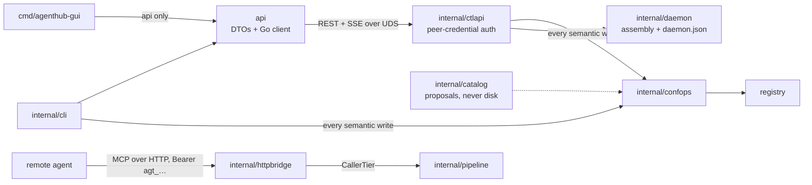
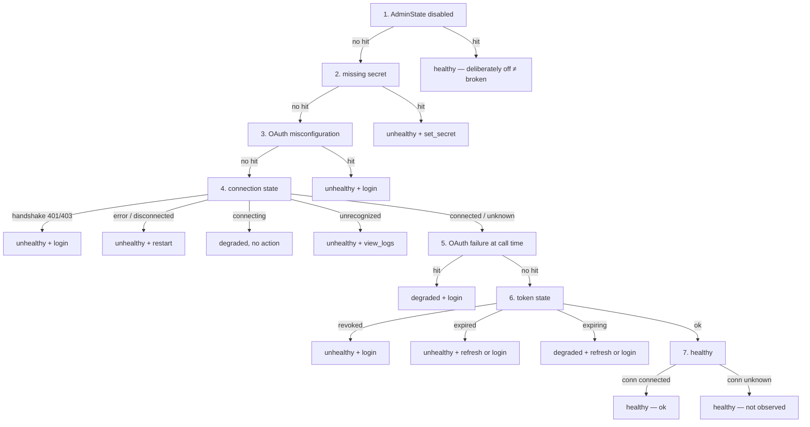

# The control plane

> **Answers** how the daemon exposes state and configuration, how the HTTP data plane is guarded, and how both frontends write through one implementation.
> **Not here** the CLI's own rules → [cli.md](cli.md); what a call does once dispatched → [execution.md](execution.md).
> **Kept true by** `test/e2e/apiwrite_test.go`, `TestAPITopicsMatchTheServedSet`, `TestInProcGateCountParity`.

Two things every package here depends on.

**SSE events are notifications, not snapshots.** Every frame says only "something changed", and consumers
re-read state and adopt by "the generation I read ≥ the generation I applied", never by equality with the
event's `Rev`. That is what makes dropped frames tolerable.

**The event log is a different thing wearing a similar name.** `GET /v1/events/log` and `agenthub events`
read a durable record in a closed vocabulary ([records.md](records.md)). The stream answers "something
changed just now", the log answers "what happened to this server". Do not merge them.

## api

The control plane's public contract: wire DTOs, error codes, SSE topic names, and a Go client depending
only on the standard library.

**There is no raw request escape hatch**, deliberately: anything a frontend can do corresponds to an
endpoint, and therefore to something the CLI can do too, so "the GUI is optional" is structural rather
than a promise.

**Never imports `internal/*` and never takes a third-party dependency**
([canonical.md §2](../canonical.md#hard-dependency-direction-constraints-enforced-at-compile-time-by-depguard)
rule 1). The cost is that `paths.go` reimplements the socket path resolution; the compensation is a
contract test on the `ctlapi` side — the only place that can import both — asserting the two agree in
every environment.

**Two start paths, differing in ownership rather than mechanism.** `DialOrStart` dials and, on failure,
execs `agenthub daemon start` and polls `run/daemon.json`; a child that exits before becoming ready
returns its real error plus a stderr tail rather than a timeout. It names no owner, so it starts a daemon
only for a caller that asks explicitly. `StartSupervised` — the desktop application's path — runs
`daemon start --foreground` as a **direct child**, so death arrives through `cmd.Wait` rather than at the
next call, and `Stop` signals a pid from the process handle rather than from a file that outlives an
abrupt death. A daemon already serving is **refused**, never adopted: a hub this process did not start is
not a hub it may stop.

**The decode failure direction is fail-closed.** `decodeEnvelope` succeeds only on a positively identified
success envelope — inside the 16 MiB limit, deserializable, `ok:true`, status < 400, `data` non-empty and
decodable — and anything else becomes `E_BAD_RESPONSE`, so a truncated body is never success.

**A conflict's recovery is "retry at `CurrentGeneration`", and re-reading first is not interchangeable
with it.** That generation comes from the write path, which compares inside the registry lock, so it is
authoritative the moment it is handed back. A GET does not have that property: the daemon answers reads
from a snapshot its watcher refreshes asynchronously, so for roughly two hundred milliseconds after an
outside writer — the CLI, which writes the files directly and sends no precondition — a re-read still
reports the superseded generation and a retry at it earns a second conflict. A caller that must re-read
needs backoff; a single-key write should use the reported generation and not re-read at all.

**SSE consumption is tolerant.** `Subscribe` establishes the first connection synchronously, so the caller
learns immediately whether the daemon is up, then maintains it with backoff and `Last-Event-ID`
resumption. The channel closes only when the ctx ends, and an unparseable frame is skipped rather than
fatal.

**The topic set is closed, and retiring one is a breaking change on both sides.** The daemon answers an
unlisted topic with a **400 on the subscribe request**, not an empty stream, so a constant left standing
after the daemon stopped serving it takes the whole subscription down and every other topic with it.
`TestAPITopicsMatchTheServedSet` pins the two lists together.

## internal/ctlapi

The daemon's state and the configuration write surface, over REST and SSE on a unix socket only this user
can connect to.

Routing is a **hand-written switch**, not `http.ServeMux`, because ServeMux's own 405s and 301s leak
whether a route exists while hand-written dispatch makes every miss — unknown path, wrong method, unknown
id — land in the same `writeNotFound`. `Registry`, `Sessions` and `Bus` are required; every other
collaborator is optional, and an absent one disables its routes into the uniform 404 rather than
half-serving them.

### Rules the routing surface imposes on both frontends

Paths are `/v1/<resource>` with the id last, and every write accepts a precondition and answers **409 plus
the current generation** on conflict.

- **Credentials are never echoed back.** Reading a secret returns `{server, key, backend, set: true}` —
  there is no value field; it is not left blank, it does not exist in the type.
- **An agent token's plaintext appears exactly once**, in the creation response.
- **No polling after a write.** A write bumps the generation, the watcher publishes on the bus, the
  control plane pushes over SSE — so a frontend's own write and someone else's behave identically.

### Two authentication gates, both mandatory

The socket's directory is 0700 and the socket is chmod 0600 after bind; peer credentials compare the
peer's uid against this process's, with **no privileged bypass — root is rejected too**. Any failure to
obtain credentials is treated as a hostile peer: close and keep accepting, so one malicious dialer cannot
wedge the control plane. **On a platform with no peer-cred implementation `Listen` fails outright.**

**A stale socket is removed only once proven unserved.** `removeStaleSocket` lstats first — a non-socket
is never deleted — then dials; a successful dial means a live daemon, and only a failed dial leads to
removal.

**`X-Request-Id` is set before the handler runs.** The incoming id is validated and never echoed back as
attacker-controlled text, and the header is set early because `WriteHeader` snapshots the header map — so
the id is present on success, on failure, and after panic recovery. Panic recovery splits two ways:
response not started → a 500 envelope; already started, mid-stream → drop the connection, never garbage
after half a body, which would parse as a truncated success.

**Path matching runs on `EscapedPath`**, rejects segments containing `/`, and unescapes only the single
segment, so an id containing `%2F` cannot smuggle in extra path segments. The 404 text is unified and
frozen byte for byte: unknown routes, sessions and tokens share one code, message and hint.

**There is no control-plane audit trail**, and it is recorded here because the tree once read as though
there were: six comment sites asserted it while nothing wrote a record. A governance write leaves no
evidence beyond the daemon's own log, so "who relaxed this switch, and when" is not answerable after the
fact; `internal/calllog` covers data-plane calls only.
`TestNoCodeClaimsAnAuditTrailThatDoesNotExist` keeps the claim from coming back.

### Health is a seven-rung ladder, first hit wins

The frontend renders this and must not re-derive it. Four rungs are placed rather than convenient:
`disabled` keeps `level=healthy`, because turning something off on purpose is not a fault; an unrecognized
connection state fails toward visibility; the handshake-auth branch is driven only by a **typed** 401/403
the gateway retained, never by searching error text, and it outranks the generic connection-error branch
because restarting cannot repair it; and on rung 7 `unknown` means no gateway currently holds a
connection — a fact about the observer — so the level stays healthy while the summary becomes "not
observed". On rung 4 `unknown` falls through with `connected`, because a server nobody is using whose
token has expired must still report `token expired`.

**Rung 6 is the only rung whose action is chosen rather than fixed**, and `HasRefreshToken` chooses it: a
stored refresh token makes the repair unattended, its absence makes a browser and a human necessary. False
is the safe default, because `login` repairs both cases while `refresh` repairs one. The aggregator folds
that flag with **AND** — the one field not folded with OR — because it announces that a repair is
*available* rather than that something is wrong, so a reporter that stays silent must drag the answer back
to `login`. `TokenRevoked` is the exception: its action is fixed at `login`, because a grant the
authorization server refused makes `refresh` a command that can only fail.

**Rung 6 has a producer, and it is not a gateway.** `GatewayStates` folds what connected gateways report,
and nothing in a gateway looks at token lifetimes — nor could it, since a gateway answers `ok=false` when
it holds no server, which is the steady state of a daemon nobody is connected to. `Options.TokenStates` is
therefore a **second source**, read whether or not a gateway reported anything. Its producer is the
daemon's proactive refresher, which already reads that state on a timer: a vault read per `/v1/servers`
request could pop an OS keychain dialog. Each scan publishes a **whole snapshot**, so a server deleted or
logged out of disappears without anyone remembering to retract it.

**Rung 5 still has no producer**: nothing observes 401s at call time, so it stays live code reached only by
tests.

### SSE delivery

**Push and pull share one payload.** `serverList()` feeds both `GET /v1/servers` and the `servers` frames,
so either is authoritative.

Three strategies: `servers` goes through a 50ms coalescer with a lazily built payload, so K bus events
become one frame marshaled once; scan-type topics through a 750ms settler that compresses a lifecycle into
one frame; everything else passes event by event, because a session opening and a session closing are two
distinct facts. Each connection has a 32-frame queue and **drops on overflow**, since consumers already
have to recover by re-reading.

**Last-Event-ID is best-effort, not a replayable log.** An id older than the current sequence, or
unparseable, gets no history replay — the server sends one `sync` frame per subscribed stateful topic
instead. An unknown `?topics=` value is a 400, never a silent empty stream.

**The gateway link is one-way**: it notifies, and the gateway re-reads the registry itself rather than
trusting the frame. The link is single-use, a session that has not attached within 30s is reaped by a
watchdog — stdio sessions are otherwise not TTL-reaped, so a crash between register and link would leak
one forever — and when the link drops the session closes.

### The one long-running exchange: an interactive login

`POST /v1/auth/{server}/login` → `GET /v1/logins/{id}` → `DELETE /v1/logins/{id}`, driven by
`internal/oauthlogin`. It is affordable because it is **not a second code path**: the daemon drives the
same flow the CLI drives, and only the session bookkeeping is new. Four properties it must keep:

- **Start answers 202 before there is anything to show**, because choosing between the device and loopback
  flows needs the authorization server's metadata, and waiting for it puts a discovery timeout inside a
  button press. An empty `mode` on the first poll is a real state, not a missing field.
- **The caller opens the browser, and it must be the host browser.** The daemon returns the URL and never
  visits it — it may be headless and may not be where the user is — and an authorization page inside the
  application's own webview is agenthub asking for a provider password in a window agenthub controls.
- **A failed session is a 200** carrying `phase: "failed"` and the flow's own hint: the read succeeded, and
  what failed is the thing it describes. Only an unknown id is a 404.
- **The loopback SSRF carve-out follows the stored entry's provenance**; no request field can ask for it.

A second login for a server that already has one **joins the first**, because two concurrent flows would
each bind a loopback port and race the same vault entry. The wire carries `user_code` and never the device
code, an authorization code or a token, and the test asserts on the **key set**, so it fails when a field
is added rather than when a particular string leaks.

### The non-registry face

- **Verifying that a credential works is `POST /v1/servers/{id}/test`**, not part of the secrets face. A
  typed downstream 401/403 returns `E_AUTH_REQUIRED` and an unresolved placeholder returns
  `E_SECRET_REQUIRED` plus safe key names, so a frontend can offer a login or a prefilled write-only form
  without scraping prose. The probe runs a docker-runtime entry as a container.
- **The rendered call output is bounded, and the bound is the caller's to raise** — default 2 KiB, clamped
  at 1 MiB. The small default belongs to the question this endpoint is asked most often, "does this
  connect". **This cut is final**, unlike the data plane's budget, which retains the remainder under a
  cursor — which is why an over-large ask is clamped to the ceiling rather than dropped to the default. It
  cuts on a rune boundary, and that a cut happened is a **field**, never a trailer in the text.
- **`GET /v1/clients` stats and never opens a file** — one macOS privacy prompt per client per page load is
  worse than no listing — so "is agenthub wired into this one?" is `GET /v1/clients/{id}/inspect`, which
  makes the prompt belong to a click. One unreadable location does not fail that request: it is reported
  beside the ones that read fine and forces `denied` rather than `not_connected`.
- **`GET /v1/events/log` and `GET /v1/logs` exist for the GUI**, which may not import `internal/*` and so
  cannot read the files; the CLI reads them directly and works with no daemon. Scope and kind validation
  comes from `internal/eventlog` rather than a local copy, and the log reading is `internal/proclog`,
  shared with the CLI so the two cannot answer differently.
- **All three collections page by cursor, not offset.** Rows are newest first and the cursor names the last
  row served. With an offset, records arriving between two requests make page two repeat rows page one
  already showed; a fresh record is newer than every cursor, so it can only appear on page one.

The call ledger enters with one deliberate split. `GET /v1/calls` and `/v1/calls/stats` read metadata only.
`GET /v1/calls/{id}` is the explicit single-call disclosure: it resolves key ids in the vault and returns
request, effective arguments, result and frame bodies with `Cache-Control: no-store`, each capped to a
512 KiB preview that says when it truncated. Key bytes are persisted before the registry points at their
public id and never cross the wire.

**What a call REACHED is derived once, in `calllog.TargetServer`/`TargetTool`, and this face is the only
one that publishes it**, so an option a dropdown offers always selects the rows a reader sees under that
name.

## internal/confops

The single implementation of every semantic write against the registry. Frontends own flag parsing,
rendering and transport, and **own no rules**; a parity test asserts both paths produce byte-identical
registry documents for the same operation.

**The API's shape is operations, not field setters.** `RenameProfile` also repoints every client binding
referencing it, because leaving them would fail-close those clients into an empty scope — a consequence
belonging to the operation rather than to its caller.

**Every operation is three steps in an order that cannot change**: validate the arguments, so a rejection
happens before anything is opened → mutate inside `registry.Store.Update`, against a document just re-read
under the cross-process lock → return the post-commit generation. The precondition comparison happens
inside that lock and before the mutation, so there is no window between comparing and writing.

**Every precondition in the tree is that strong one.** A weaker form compared against a snapshot outside
any lock, and it went with the surface it served. The writes whose subject is genuinely elsewhere —
secrets, skills, tokens — take no precondition at all rather than an advisory one: a guard that catches
"your view is stale" but not "something moved under me" is the shape a reader trusts for the second thing.

**Validation rejects rather than normalizes**, and **`Changed` is derived from the generation** rather than
from the operation diffing itself, so writing the same value twice reports `Changed == false`.

The governance key table has exactly one home here, including the daemon's own HTTP listener keys.
**Storing an answer does not lower the bar for it**: a non-loopback address still needs its own
confirmation, the credential-less endpoint still needs `insecureLoopback`, and the address is validated as
a bindable `host:port` at write time. The command line is the more specific statement and **replaces the
stored set as a whole** whenever any of the three flags is given — merging would let a confirmation stored
months ago for one address authorise a different one named today.

## internal/catalog

Two routes to a proposed server definition — the curated catalogue and paste parsing — and **neither writes
to disk**. `confops` remains the only implementation of every registry write, so a catalogue entry gets the
same scrutiny as a hand-typed one.

**Provenance is a source signal, not a cryptographic proof.** Curated means a maintainer believed that
command line is the one in the publisher's docs; it does not mean the code that ends up running is the code
they read. Nothing is signed and `npx -y <package>` still pulls whatever the repository serves at that
moment.

**`needsConfig` is the test for "can this be one-click"**: declared credentials, declared parameters, or
unsubstituted placeholders anywhere in the command line, URL, environment or headers. An unsubstituted
placeholder is a **refusal**, never a literal `{{directory}}` written through — a server that fails at
connect time because of a path nobody typed is far harder to explain than a refusal at add time.

**There is one reader of a pasted client configuration.** Both the GUI's preview and `server add --stdin`
get the document shape from `Recognize` and each entry from `MapEntry`: which wrapper keys name a servers
section, which shapes count as a document, which keys an entry may carry and what each means — one answer,
in one file. Wrapper key paths come from `internal/clients`, the same table that decides where each
client's servers live, so adding one client row extends this parser for free.

**The two routes treat an unknown field differently, deliberately**: a warning on the paste route, a hard
error on `--stdin`. The preview shows verbatim what is about to be stored, so "these keys were ignored" is
actionable; a write with no preview can only refuse, or the user never learns that the `oauth` block they
pasted vanished.

**What each route decides for itself is policy, never reading.** `MapEntry` returns what the snippet says
and nothing about who is asking, so three fields stay with the caller and the parity test exempts exactly
those three: `Source`, `Enabled` (`server add` lands every server switched off whatever the configuration
claims) and `Provenance`. Endpoint screening and the treatment of agenthub's own gateway entry are policy
too: the preview **skips** that entry and shows the skip, `--stdin` **refuses** the paste, because a write
has nowhere to report a skip.

## internal/daemon

Assembly and nothing else: assembly order, the readiness handshake and graceful shutdown. Every `Config`
field has a production default and exists for CLI and test injection.

**`daemon.json` is written only after a successful bind**, so a well-formed file always describes an
endpoint that was alive when it was written — replacing the TOCTOU-prone "probe the port then spawn".

**Dependencies, and the failure direction of each.** A registry that will not open is fatal — the daemon
*is* the coordination plane, unlike a gateway which can serve the data plane while impaired — but a
document that was quarantined and self-healed is only a warning, a JSON log file that will not open
degrades to plain text, and a registry watch that cannot be established degrades to seeing changes on the
next explicit reload. The non-registry collaborators are all optional.

**Graceful shutdown has three phases, and the first is what makes the second work.** `CloseStreams()` ends
every long-lived SSE handler, then `Shutdown(grace)` drains, and only then does `Close()` force the rest.
`CloseStreams` is not an optimization: `http.Server.Shutdown` waits for handlers to return and never
cancels their request contexts, while both long-lived handlers are parked until their client hangs up — so
without it every stop spends the whole grace and then force-closes precisely the connections it spent it
waiting for. Two streams need two doors.

**A daemon does not outlive its owner, and does not trust the owner to say so.** An owned daemon arms two
watches before it opens anything, so an owner dying during a slow startup is noticed too. The **lifeline**
is the read end of a pipe the owner holds and never writes to: the kernel closes it however the owner dies,
the read returns EOF in microseconds, and a recycled pid cannot fool it. It does not exist on Windows,
where `os/exec` cannot hand a child an extra descriptor. The **poll** is the backstop, and its failure
direction is load-bearing: it answers alive, not alive and **cannot tell** separately, and only a definitive
"not alive" stops the daemon — a hub that outlives its owner is recovered by the next launch, while a hub
that shuts down under a live owner cuts off every connected client to fix nothing.

**Three decisions about proactive OAuth refresh:**

1. Use the coordinator's **offline path** — a sibling lock file plus re-reading `expires_at` after
   acquiring it — not the online path with only in-process singleflight, which holds only if the daemon is
   the sole vault writer, and `agenthub auth login` writes it directly. A redundant lock costs one syscall;
   a missing one spends a one-time refresh token twice.
2. Keep the in-process singleflight on top, so a future control-plane refresh RPC hits the same gate
   instead of racing the timer.
3. **A token with no expiry is never proactively refreshed** — no `expires_in` means never expires, and
   such servers are covered by the passive 401/403 path.

`backoffState` records the `expires_at` observed at failure time, so a newer expiry in the vault voids the
suppression window immediately, and backoff only queries once the token has actually expired: a
suppression window can lower the attempt frequency but never mask that renewal is needed.

**The runtime state source is one `NewGatewayStates()` injected as both reader and writer.** The daemon
connects to no downstream while the data plane is off, so the stdio gateways that hold the connections
report state over the control connection and the daemon only aggregates. Standing up a second set of
downstream processes just to display a status dot is not a worthwhile trade.

## internal/httpbridge

The daemon's **data plane** exposure: the MCP Streamable HTTP entry point, the ingress hard limits, and the
tiered agent token layer. It is deliberately not the control plane — management traffic goes over the UDS
socket, where identity is an OS peer credential and no tokens exist.

**Binding is itself an authorization decision.** A listener with no admin token, no active agent token and
no registered clients would treat every local process as a legitimate agent, so `AuthorizeBind` **refuses**
to create it. `--insecure-loopback` is the only escape hatch and is narrower than its name: a non-loopback
address always requires a token, and the "registered clients" path authorizes a loopback bind only, because
entries in `clients.json` are configuration, not credentials.

**The escape hatch is judged before anything can authorize the bind, and refused rather than ignored.** It
used to live only in the last-resort branch of the switch, so a configured token returned first and
`--http-addr 0.0.0.0:7777 --http-allow-remote --insecure-loopback` never looked at the flag — while passing
it to the authenticator, which answered **every unauthenticated LAN request at the destructive tier**.

**The channel is not encrypted, and a non-loopback bind is told so.** This package terminates no TLS, so
the credential everything above insists on crosses the network in the clear. Terminating TLS is
deliberately out of scope — certificate material, rotation and trust configuration are a feature with their
own argument, and the deployment answer is a terminating proxy — but silence was not acceptable either, so
`BindDecision.Cleartext` is set on every non-loopback bind and the daemon logs it at Warn. Loopback binds
are not warned: a warning on every ordinary start is one nobody reads.

**`Authenticate` re-checks the peer, and `peerIsLoopback` fails toward false.** The no-credential path
requires **both** `InsecureLoopback` and a loopback `RemoteAddr`, and the duplication is deliberate:
`InsecureLoopback` arrives as a bare bool carrying no evidence of the address the listener actually got.
`RemoteAddr` is the kernel's view, never a header — no `X-Forwarded-For` handling belongs here, since this
package binds TCP itself.

**A browser Origin must be a provably loopback authority, not merely equal to `Host`.** Equality is the one
relation DNS rebinding preserves: a rebound page sends both headers as `evil.example:7777`, they compare
equal, and `Sec-Fetch-Site` reads `same-origin`. Both authorities have to pass `AddrIsLoopback`, and the
check runs before authentication. **This server never echoes an Origin and never emits
`Access-Control-Allow-*`**, because no browser client needs enabling and the only effect would be to let a
page read tool results.

**The per-request ordering invariant: ingress limits → authentication → session binding → dispatch.** Every
level is fail-closed and every rejection distinguishable (413/401/403/404/503/500). **Rate limiting happens
before authentication**, because the point of an in-flight cap is to limit the work an unauthenticated
caller can induce, and over the limit is a 503 shed rather than queuing.

**A notification stream holds a SECOND quota, and giving it one did not loosen the first.** `MaxInFlight`
bounds work an unauthenticated caller can induce, and every request it covers is short by construction. An
open stream is the opposite on both counts: reachable only after authentication, performing no work once
open, and staying open for hours. Counted against `MaxInFlight`, idle streams would eat that ceiling while
doing nothing with it. A stream therefore takes `MaxStreams` (64) and **hands its in-flight slot back**
before parking. A stream that could not be opened at all is 500, not 503: a broken assembly and an
exhausted quota send an operator to different places.

**The stream's lifetime crosses three owners.** The session TTL advances on the way past an incoming
request — and a client being *pushed* to sends none, so `sessions.touch` refreshes it from the stream
itself. The daemon's per-credential gateway is reaped on the same "no requests" evidence, so the plane
counts open streams and the sweep skips a pinned connection. And the SSE keep-alive is not decoration: it
stops an idle NAT from reaping the connection, and it is the only way this side **learns** the peer is
gone, since without traffic there is no write to fail.

**Ingress hard limits are constants**, and the two header limits cannot be enforced inside the handler,
since by then the headers are read. They are `http.Server` fields reachable only through `HTTPServer()`; an
assembly that mounts `Handler()` bare is choosing to serve without a header-size limit.

**Token shape and storage.** `agt_` plus 64 hex characters, and **dispatch is by prefix and mutually
exclusive in both directions**: without that, a caller could probe the store with admin-shaped candidates,
and an admin token beginning with the agent prefix would become unusable. Stored is only
`hex(HMAC-SHA256(key, plaintext))` — HMAC rather than bare SHA-256 to defeat offline cracking — and the key
file is a dotfile **beside rather than inside** the token list, so copying `tokens.json` into a bug report
does not hand over verification capability. **A corrupt key file is a hard error**: regenerating it would
silently invalidate every issued token.

**Lookup is an authentication face that is not an oracle.** Unknown, revoked and expired return the same
`ok=false` and the same 401, and comparison walks the whole table with `hmac.Equal` without
short-circuiting. A tier this binary does not recognize is rejected rather than defaulted. A nil
`Token.Servers` means "no restriction"; a non-nil empty slice means "allow nothing" — hence serialization
without `omitempty`.

**The store's concurrency discipline.** Uniqueness and the cap are checked **inside** the flock transaction,
against the list about to be written back. A missing file is an empty store, but **a malformed file is an
error**: treating a corrupt credential store as "no tokens" would make bind authorization fail open.
Records are retained after revocation, so a name always resolves to exactly one credential.

**Session binding is fail-closed and validates the whole identity.** `Caller.Identity()` composes kind,
token name, tier, allowlist and profile into a fingerprint that a session freezes at creation and compares
in full on every request, so a token narrowed later cannot keep riding an old session. **The allowlist
enters that fingerprint as a tri-state, never as a joined list**: nil, `[]` and a list of names are
pairwise distinct, with a length prefix separating `[]` from `[""]`. A join renders the first two
identically, which made the single most consequential edit to `tokens.json` — `"servers": null` to
`"servers": []` — invisible, so a token cut down to nothing kept reaching every server until its gateway
went idle.

Not found, expired and owned by someone else all return the same frozen 404, and **a session owned by
someone else is deliberately not deleted**: a prober must not be able to destroy other people's sessions by
guessing ids. When the table is full, creation fails rather than evicting.

**A request bringing NO session id at all is answered 400**, on POST and DELETE alike — it names no session,
so it cannot be an enumeration probe. The split is load-bearing rather than pedantic, because the client
rule attached to 404 is *start a new session*: a caller that omitted the header re-initialized, omitted it
again, and looped, filling the 256-entry table and answering `503 overloaded` to every caller until the TTL
swept it.

**Dual-stack loopback in `Listen`.** "localhost" may resolve to 127.0.0.1 or ::1, and binding one family
produces the worst failure shape — works on the developer's machine, connection refused on the user's — so
it binds both. A second family that fails to bind is a warning; only both failing is a hard error.

**Tiers are minted here, not enforced here.** `Caller.Tier` flows into `pipeline.CallRequest.CallerTier`,
and the comparison happens in the tier gate. `Profile` joins the scope intersection as an ordinary layer
and can only tighten.

### How the daemon assembles it

Assembly is explicit opt-in, from one of two sources and never half of each: the command line when any of
the three flags is given, otherwise the stored `http.*` keys.

**The resolved face is what BOTH halves of that decision read.** `AuthorizeBind` and the authenticator built
beside it are one decision in two places — the bind is authorized *because* unauthenticated loopback callers
are to be accepted, and the authenticator is what accepts them. Built from the command-line field alone,
the two agreed whenever a flag was typed and split from the stored source, so `http.insecureLoopback true`
authorized a credential-less bind and then served it with an authenticator refusing every unauthenticated
caller. The direction was safe, but the running system stopped matching its configuration and nobody was
told. The test that pins it **sends a request**: an older test connects a TCP socket and stops there, which
is how the divergence survived having a test on this path at all.

`httpPlane` is deliberately thin: it maps an authenticated credential to a `gateway.Conn` — the same gateway
body as `agenthub connect`, attached to an in-memory pipe. **There is no second assembly and therefore no
second execution path.** Connections are keyed and reused by the **whole credential**, so a token narrowed
after issuance gets a new gateway rather than the old privileges.

**The plane passes its gateways no credential collaborators, and that is wiring rather than an omission.**
`gateway.newGateway` builds its own vault chain exactly when both credential fields arrive nil, and only
that chain wraps the bearer in the two optional faces the downstream round tripper looks for: the credential
epoch and the refresh deadline. Assembling them in the daemon and handing them in left each gateway with a
bare vault read carrying neither, which made the HTTP face **strictly weaker than the stdio gateway it is
otherwise identical to** while looking correct from every angle.
