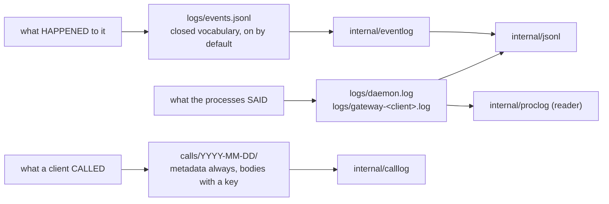

# The three records

> **Answers** what the hub writes down about itself, which stream answers which question, and which way each one fails.
> **Not here** the ledger's place in a call → [flows.md#the-call-ledger](../flows.md#the-call-ledger).
> **Kept true by** `test/buildrules` (the event vocabulary is checked against the code in both directions) and `internal/jsonl`'s multi-process append test.

Three streams answer three different questions, and reaching for the wrong one is what makes an
incident take an hour.

`internal/jsonl` is the write discipline underneath the first two. The ledger has its own writer,
because capacity arbitration and encryption are not that package's business.

## internal/jsonl

- **One record is one `write(2)` of one line, on a file opened `O_APPEND`.** That plus a line bound
  (`DefaultMaxLineBytes` = 4096 = PIPE_BUF) is the entire multi-writer story: N gateway processes and
  the daemon append to one file and cannot tear each other's lines. `main_test.go` proves it by
  re-executing the test binary as several appending children — a single-process test cannot observe
  the property at all, because the in-process writer mutex hides its absence.
- **Rotation renames the active file.** It never reads it back and truncates; truncation is what breaks
  the guarantee across processes that did not agree to rotate at the same instant.
- **Backpressure drops and never blocks.** Appends funnel through one writer goroutine behind a
  buffered channel; overflow is counted (`Dropped`) and discarded. Fail-open, deliberately: a record on
  its way to disk must never slow down the call that produced it.
- **An oversized line becomes an `OversizeMarker`, never a truncated one.** A reader can then tell "this
  record was too big" from "this file is corrupt". The marker shares its `ts` field with a real record,
  so a reader that does not check `oversize` first decodes it into a zero value — a blank row asserting
  nothing happened, in place of the one record big enough to have been dropped. `DecodeOversize` is the
  check.
- **A writer must fit the SERIALIZED line, not its raw payload.** A body entering a JSON string doubles
  quotes and backslashes and sextuples control bytes, so a 4096-byte raw bound drops every record over
  roughly 2 KB of quote-heavy JSON — precisely the large results a trace is opened to see.
- **A stream's segment list stops at that stream, and the filter compares the STEM.** The glob
  `<base>-*<ext>` is necessary and not sufficient: the pattern for `gateway-claude-code.log` also
  matches `gateway-claude-code-dev.log`, a second client's ACTIVE log. `Segments` keeps only files
  whose `-<stamp>.p<pid>` suffix was appended to this stream's own base. `IsSegment` alone is not that
  test. Unfiltered, a reader merges a sibling's records into this stream — and since `Prune` walks the
  same list and `NewWriter` prunes on every open, starting one client's gateway could delete another
  client's live log. `TestPruneNeverRemovesASiblingStream` is that case.
- **Retention is opt-in (`KeepSegments`) and the sweep runs in `NewWriter`.** A stream that is
  somebody's archive must not lose history to a default. `DefaultKeepSegments` = 3 is the number every
  stream here uses, in one place.
- **`LineWriter` reports every write as accepted.** It is the `io.Writer` face for `log/slog`, which
  discards whatever `Handle` returns; an error would reach no one while tempting a caller to treat a
  lost log line as a failed operation. Over-long records become oversize markers here too, which is the
  intended pressure: full arguments belong in the ledger, never in `slog`.
- **Dependency budget**: standard library only.

## internal/proclog

The reader for the process logs — `daemon.log` and every `gateway-<client>.log` — merged into one
time-ordered stream. Two callers need that answer: `agenthub logs` reads the files directly and
offline, and the control plane serves them to the GUI, which cannot read a file at all.

The merge is the reason it exists. The daemon never dials a downstream, so every connection failure,
circuit transition, health flip and respawn is observed and written by a gateway; a daemon restart and
the six gateways that lost their connections two seconds later is one story told in seven files.

- **Read-only by construction.** Nothing here opens a file for writing, so serving a page cannot disturb
  the multi-writer discipline.
- **`Files` walks the rotated segments, not just the active file.** A reader that opened one file would
  answer "nothing happened" for everything rotation moved aside.
- **A selector that is active and a field that is absent means DROPPED.** A daemon record carries no
  client, so `client=x` showing daemon lines would be a filtered view smuggling in records it cannot
  classify.
- **An unparseable line is dropped, not counted** — unlike the frame reader, which counts them. A line
  that does not parse has no timestamp, so there is no position in a merged stream where showing it
  would be truthful.
- **The gateway file name has one speller.** `internal/gateway` is the writer and its `LogPath`
  delegates here; a reader that sanitised a client id differently would report "no records" for a
  client that has been logging all day.
- **Following is the caller's business.** A request/response API has nowhere to keep per-file offsets,
  so this package answers whole-window reads and the CLI keeps the offsets for `-f`.

## internal/eventlog

One JSONL line per state change of a downstream server, a gateway or the daemon, in a closed
vocabulary. Everything here is also logged as prose — right for a human reading `agenthub logs`, wrong
for a UI timeline, a `--json` consumer or an alert, which need values they can switch on. `Emit` writes
both halves in one call, so the two cannot disagree about a level, a count noun or whether an event
happened at all.

- **Failure direction is OPEN.** A record that cannot be written is dropped and counted; nothing is
  refused. Refusing to serve because a note about the service could not be filed is worse than the gap
  it prevents — and the gap happens anyway, since by the time the write fails what it would have
  recorded is already lost.
- **A nil `*Stream` is usable and does nothing**, which makes "the switch is off" and "the file would
  not open" one code path at every call site.
- **`PID` is stamped by the stream, never by the caller**, and carries no `omitempty`: N gateways plus
  the daemon share one file, and a record attributed to no process cannot be placed at all.
- **One file, three scopes.** The question is a timeline, and splitting the file makes re-assembling it
  the reader's job.
- **`Detail` is fitted to the serialized line**, for the reason above: a record replaced by an oversize
  marker reads back as a row claiming nothing happened.
- **Retention runs on `Open`**, keeping the newest three segments. Rotation at 32 MiB of state-change
  records is rare while gateway processes open this file constantly, so the check is frequent in
  practice and costs one directory listing. A removal that fails is ignored: a retention sweep able to
  fail an `Open` would turn "the disk is briefly busy" into "this gateway does not start".

### The closed vocabulary

Adding a kind means editing three places — the constant, `allKinds`, and the table below — and then
**writing it somewhere**. `test/buildrules` fails until all four are true, and each direction hides a
different way of being wrong. A kind missing from the table is still written and the consumer meant to
recognise it silently does not. A kind nothing emits is still offered as a `--kind` selector and
answers "no events", which is the same answer as "this has not happened" — the one confusion a closed
set exists to prevent. A kind missing from `allKinds` fails hardest: it is declared, documented and
written, so records carrying it accumulate while `KnownKind` answers false at every scope.

Kinds are checked as a **(scope, kind) pair**, never a bare kind: a gateway and the daemon both
`started`, and that spelling is meaningless at server scope. Giving an existing kind a second scope is
a shorter edit list — `allKinds`, a row here, the emit site, and `eventlog`'s own
`TestEveryKindIsClassifiedDeliberately` — and `test/buildrules` cannot help, because the spelling was
already declared, documented and written by the scope that had it first.

<!-- event-kinds -->

| Scope | Kinds | Class |
|---|---|---|
| `server` | `connected`, `tools_changed`, `oauth_login_started`, `oauth_login_waiting`, `oauth_login_completed` | routine |
| `server` | `connect_failed`, `disconnected`, `respawned`, `respawn_failed`, `circuit_open`, `circuit_half_open`, `circuit_closed`, `health_down`, `health_up`, `oauth_refresh_failed`, `oauth_grant_revoked`, `secrets_missing`, `oauth_login_failed` | disruption |
| `gateway` | `started`, `stopped`, `client_attached`, `session_opened`, `session_closed` | routine |
| `gateway` | `registry_reload_failed` | disruption |
| `daemon` | `started`, `stopping`, `listener_bound`, `config_reloaded` | routine |
| `daemon` | `registry_reload_failed` | disruption |

### Class, and why it is not the log level

`ClassOf(kind)` splits the hub running as intended from the hub reacting to something that went wrong.
It is derived from the kind, never stored, so an old file is classified by whatever build reads it and
no writer can disagree with a reader about what its own kind means.

**The recovery kinds are in `disruption`.** `circuit_closed` and `health_up` are the last act of the
same episode, and a filter that dropped them would show every outage beginning and none of them
ending — which reads as an outage still in progress.

**The list is written as the exception**: unknown and unlisted kinds are routine. A new fault nobody
classified fails to show up under `--class disruption`, and the test walking every kind catches that;
the opposite default would fill the filter with noise and nothing would flag it.

**A level is one-dimensional.** `health_down` is `WARN` and `health_up` is not, so `logs --level warn`
shows a server going down and never coming back. A class asks which story a record belongs to, and a
story includes its ending.

**Every failure kind is `WARN`, everything else `INFO`.** Nothing here is `ERROR` — that level is
reserved for a protective capability failing, such as the ledger being unavailable — and nothing is
`DEBUG`, since a kind worth a closed vocabulary is worth being visible at the default level. A test
walks `allKinds`, so a new kind cannot inherit a level by falling through.

**`Emit` stamps no identity.** The logger a call site holds is already bound to its server, instance,
client and pid, and passing them again emits each field twice on one line. It renders only the half of
the record whose meaning is fixed for every kind — `from`, `to`, `rev`, and the count under its
`CountNoun`. `Detail` and `DurMs` are polymorphic and stay with the call site.

### What `count` counts

A record carries one number and the kind decides what it is a number of. `CountNoun` holds the whole
mapping in code, because a meaning stated only in a doc comment let three writers disagree — the field
was called `attempt` while one writer put a respawn number in it, one a tool count and one a failure
streak, so a connect that listed thirteen tools rendered as a thirteenth try.

| Kinds | `count` is |
|---|---|
| `connected`, `tools_changed` | tools the server listed |
| `respawned`, `respawn_failed` | which respawn this was |
| `disconnected` | reconnects the connection had survived |
| `circuit_open`, `health_down`, `health_up` | consecutive failures behind the flip |

Every other kind leaves it zero, and `rev` is a separate field: a generation identifies a revision
rather than tallying anything. A renderer meeting a kind absent from this table prints the bare number
rather than hiding it — a frontend older than its daemon must not drop a value.

## internal/calllog

Everything the hub records about an interaction with a downstream: the lifecycle of every `tools/call`
at the client boundary, the frames at the downstream one, and — with a key — the bodies of both, in
encrypted packs.

One call reads as `received` → `routed` → `sent`/`recv` per attempt → `finished`, all under one
`callId`. That join is why the frames live here: as a per-server file with no call id in it, a call
that retried twice appeared as three exchanges belonging to nobody.

**Every upstream request is recorded, not only the ones that route.** `initialize`, `tools/list`,
`ping` and `server/discover` each leave a `received`/`finished` pair with no `routed` between them. The
first question anybody brings to the ledger is whether a client reached the hub at all, and a session
that connected and then went quiet used to leave exactly the trace of one that never connected. A
`tools/list` result is worth having for its own sake: it is the catalogue the hub showed that client,
which nothing else can reconstruct once the configuration moves.

**The record is written on the read loop, before dispatch** — earlier than the handler goroutine and
therefore earlier than any decision about the request. It cannot change that decision: `ledgerBegin`
and `ledgerRoute` return nothing.

**Nothing here may refuse a call**, and the finish is the sharp case: it is written after the
downstream has run, so its side effect has already happened. Replacing the response with an error there
reports a failure that did not occur, and a client that retries makes the side effect happen twice.

A history with holes says so, at Error, in two shapes for two conditions: `ledger record dropped; the
call is unaffected`, once per record, when a store that opened cannot complete a write; and `ledger
unavailable; calls run unrecorded`, once at gateway start, when it could not open at all. Once is right
for the second — the condition cannot change while the process runs — and the gateway's own log is the
only witness either way, since the ledger cannot record its own failure to record.

### Two tiers, and what each costs

| | **metadata** | **evidence** |
|---|---|---|
| Switch | always on | `calls.enabled`, default off |
| Holds | one bounded line per lifecycle point and per frame: method, server, tool, outcome, gate, duration, size | the bodies — request, effective arguments, result, frame — gzipped and sealed with XChaCha20-Poly1305 |
| Needs a key | no | yes; `Open` without one refuses `PutPayload` and writes no MAC |
| Durability | `write` | `sync` |
| Failure direction | open — a call that cannot be described still runs | open, and reported at Error |

The metadata tier exists because the ordinary installation had none: with the ledger off, a hub
recorded nothing about what its clients called, and the cost of the evidence tier — a key and an fsync
per write — is not one an ordinary installation should pay to know what happened.

### Three files, one schema

Every UTC day holds `calls.jsonl` (shared, every process appends), `frames-<bootid>-p<pid>.jsonl` (one
per process) and the payload packs (one writer each).

**Frames are not in the shared file**, and that is the same reason the shared file has a 4096-byte line
bound: PIPE_BUF is what makes one line atomic across processes, and it is needed only because that file
is shared. Frames outnumber lifecycle records by one to two orders of magnitude and are process-local
by nature, so putting them there would make a debugging switch the hot path of the file that records
whether a call ran.

### Invariants

- **Complete means every byte of an accepted request.** `MaxPayloadBytes` equals the MCP facade's
  accepted frame bound; it is not a second, narrower truncation policy.
- **A frame never blocks its caller.** `AppendFrame` queues and returns; an overflow is counted and
  dropped. A trace is an instrument, and an instrument must never take down the thing it measures. The
  tallies are atomics and `frames.mu` guards the file alone — anything a caller touches belongs off
  that mutex, which `writerFor` holds across `EnsureDir` and `OpenFile`.
- **A frame's SIZE is recorded even when its body is not.** A line omitting the size too would make a
  large frame and a missing one read the same.
- **Metadata is bounded; payload is encrypted.** Full arguments never enter `slog`, a support bundle or
  a shared JSONL line. An oversized metadata event is an error, never an oversize marker claiming the
  lifecycle was recorded.
- **Payload first, reference second.** A crash may leave an orphan pack entry, which verification can
  reclaim; it must never leave a committed event pointing at bytes that were never written.
- **Storage pressure is a serialized decision.** Every process holds the same root lock across pruning,
  directory-size inspection, free-space inspection and the write. Complete UTC partitions older than
  the retention cutoff are the only automatic deletion targets. `maxBytes` is a hard limit and
  `minFreeBytes` reserves room on the filesystem; crossing either is an error, never an unbounded queue
  or a silent drop. A platform with no cross-process lock refuses the bounded configuration outright
  rather than serving it unbounded.
- **Durability is explicit.** `sync` acknowledges after the file has been synced, `write` after the
  kernel write. Neither queues without bound — deliberately unlike `internal/jsonl`, whose streams must
  never slow the data plane.
- **The package decides no permission.** A wrapper may record before execution, but it does not enter
  or reorder the pipeline gates and it never inspects or modifies arguments.
- **An unkeyed record carries no MAC and says so.** Both `mac` and `keyId` are empty rather than filled
  with something unverifiable, so `calls verify` reports "unauthenticated" — a different answer from
  "authentication failed". `Unauthenticated` requires **both** fields empty: the writer sets them
  together, so one without the other is corruption or a keyed record stripped to look unkeyed, and both
  stay on the failure side.
- **`ok` is not a clean bill of health on its own.** With `Unauthenticated` non-zero it means "nothing
  was checkable", so every renderer must show the count beside it.
- **Integrity has a stated boundary.** HMAC-SHA256 per metadata event and AEAD binding per payload
  entry detect edits, corruption and reference substitution. They cannot prove an attacker deleted a
  whole day; that needs an immutable anchor outside this directory.
- **Key rotation never orphans retained history.** The current key id is public governance metadata,
  each 32-byte key is stored under an immutable key-id vault ref, and rotation writes the new ref
  before switching governance.

`Method` says what was asked and `Surface` which of agenthub's own faces answered — `meta` for one of
the hub's own tools, `group` for a grouped listing, `tool` for a name that routes straight through. The
surface is not derivable from the exposed name afterwards, because the same name means different things
under different discovery modes. `TargetServer` and `TargetTool` are the one reading of that evidence:
the routed pair where routing happened, the `(agenthub)` sentinel where the hub answered the call
itself, and empty only for a `tools/call` that resolved to no server. One function computes it, because
a label computed twice becomes a filter option that selects rows rendered under a different name.
