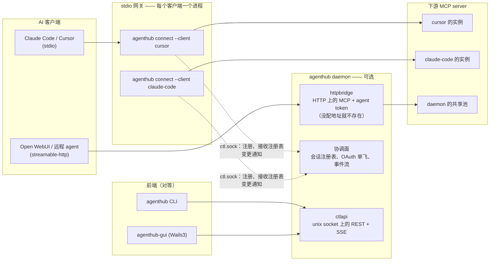
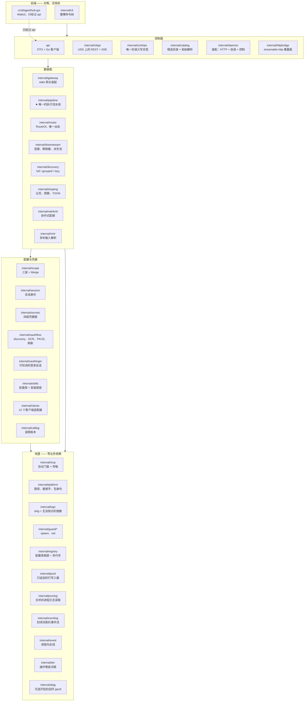
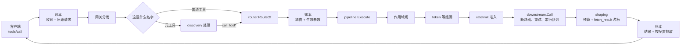
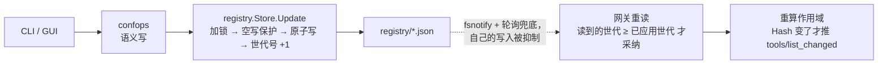
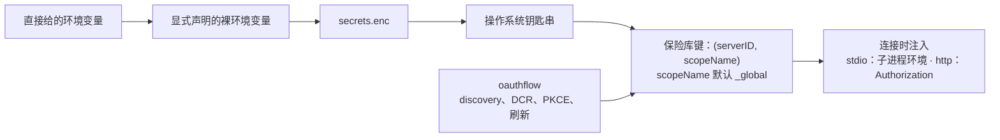
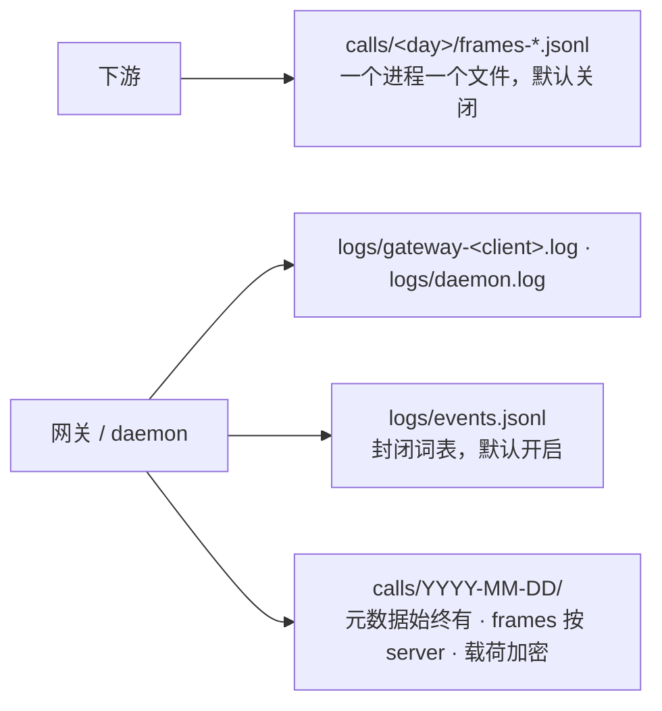

# 架构

> **回答** 系统怎么切成进程和包，以及一次调用会穿过什么。
> **不在这里** 谁能到什么 → [model.md](model.md)；一条流程逐步怎么走 → [flows.md](../flows.md)；某个包不能碰什么 → [modules/](../modules/)。
> **由什么保证为真** `internal/depguardtest`（依赖方向）与 `internal/pipeline` 的闸计数测试（调用路径）。

客户端以为自己连着一个 MCP server，实际上连着 AgentHub 的网关。网关持有所有下游的配置与凭据，决定这个
客户端能看到什么，并把每次调用送进同一条流水线。客户端自己的配置文件里只留一行 `command`。

## 进程



**一个 stdio 客户端一个网关进程。** `agenthub connect --client <id>` 不是转发壳：它自己读注册表、按这个
客户端的作用域连下游、注入凭据、跑流水线。四种隔离因此白拿——每客户端独立的凭据、每客户端独立的连接参数
（`${ROOT}`、cwd）、一个客户端的慢调用不会卡住另一个、一个下游崩溃只波及一个客户端。

**daemon 是可选的，而且网关绝不会去启动它。** 它持有 HTTP 面、控制面和协调面。把它杀掉，没有任何客户端
看到的工具集会变，因为作用域来自注册表文件。丢掉的是：`session ls` / `session kill`、控制面事件流、共享
HTTP 池，以及 OAuth 刷新退回到文件锁。

**daemon 必须属于某个人，答案只有两个。** 桌面应用把它作为受监督的子进程持有，而 daemon 反过来盯着自己的
属主（一条 lifeline 管道，外加 pid 轮询兜底，"判断不出"一律按活着处理）。另一个是 `--headless`，给服务器和
CI 用，不属于任何人，由运维停止。两者都没说明的启动会被拒绝，错误码 `E_DAEMON_UNOWNED`。第一种形态的代价是：
应用退出时，一个通过 HTTP 连上来的 agent 会失去它的端点。

**HTTP 面默认不存在。** 它只从两个来源之一开启，不会各取一半：命令行的 `--http-addr`，或存储的 `http.*` 键。
两边都没有地址就没有监听——不存在"默认端口"。非回环地址还需要同一个来源给出 `http.allowRemote`，否则 daemon
直接启动失败，而不是悄悄退回回环；随后这次绑定还要通过 `AuthorizeBind`：没有 admin token、没有活跃的 agent
token、也没有已登记的客户端时，拒绝。

**HTTP 面复用同一个网关。** daemon 把一个通过认证的凭据映射到 `gateway.Conn`——跑在内存管道上的 `connect`
网关本体——因此它遇到的是同一套 discovery、同一个 router、同一个 `pipeline.Execute`。凭据只从两个门进入治理：
`Caller.Tier` 到达等级闸，`Caller.Servers` / `Caller.Profile` 变成 `scope.Sources.Extra` 里多出来的一层，
由同一个只会收紧的 `Merge` 合并。

**server 状态由网关上报，不靠探测。** 每个网关推一份与自己会话同生共死的快照，daemon 把 N 份视图折成一份：
连接状态取最差，工具数取最大，明细写清是谁看到的。没有任何人持有这个 server 时结果是 `unknown`——那是关于
观察者的陈述，不是健康证明。改成主动探测的代价是：每个 stdio server 多一个常驻子进程，远程 server 的 OAuth
与配额消耗翻倍。

## 包



`internal/` 下的每个包都在这张图上，只有测试专用的 `internal/depguardtest` 和 `internal/testutil` 不在。
其中六个是收口点——在那里出现第二份实现，就等于给一个只能有一个答案的问题给出第二个答案：

| 包 | 收的是什么 |
|---|---|
| `internal/mcp` | 唯一的协议实现 |
| `internal/registry` | 配置真相源——是那些文件，不是某个 daemon 的内存 |
| `internal/confops` | 唯一一套语义写规则；CLI 和控制面是它的两个前端 |
| `internal/scope` | 每一个"谁能看到什么"的判断，都经过同一个纯函数 `Merge` |
| `internal/router` | `RouteOf`，从暴露名还原 `(server, tool)` 的唯一合法途径 |
| `internal/pipeline` | ★ 所有调用路径，所以闸链不会分叉 |

## 依赖方向

有四条方向是 CI 的失败条件，而不是评审习惯：

1. `api` 与 `cmd/agenthub-gui` 不导入任何 `internal/*`——"GUI 是可选的"是一条编译期性质。
2. `internal/mcp` 只依赖标准库，其它 `internal/*` 包一律不得引入第三方 MCP 库。
3. `internal/pipeline` 不得导入 `internal/ctlapi`——数据面不依赖控制面。
4. `internal/mcp`、`internal/platform`、`internal/logx`、`internal/guard/*` 零业务依赖。

规范措辞在 [canonical.md §2](../canonical.md#hard-dependency-direction-constraints-enforced-at-compile-time-by-depguard)。
这里写的是它们**怎么被守住**：`internal/depguardtest` 在每个受约束的包里种一个违规探针——种在检出的一次性
副本里——然后断言 golangci-lint 报出它。每条规则都必须有一个不能靠跳过自己而通过的失败用例。这也是
`internal/tier` 独立成叶子包的原因：它待在 `pipeline` 里时，规则 3 的失败用例会变成导入环而不是 lint 错误，
规则就无法被证明。

## 一次调用穿过什么



**闸的顺序是冻结的：先作用域，后 token 等级。** 两者都只依据配置判断，都向关闭方向失败，都不读参数和结果。
限流是套在它们外面的配额包装，不是第三道闸。

| 闸 | 拒绝什么 | 错误码 |
|---|---|---|
| 作用域 | 这个会话从未被展示过的 server 或工具 | `E_SCOPE_DENIED` |
| token 等级 | 只读凭据发起写操作或破坏性操作 | `E_TOKEN_TIER_DENIED` |

两种拒绝各自可区分，客户端因此能分清"你看不到它"和"你不许这么做"。

**执行路径只有一条。** 直接调用和 lazy 模式的 `call_tool` 都到达 `pipeline.Execute`，测试断言两者让每一道
闸的计数器走得完全一样。新增的执行路径必须带上同样的断言。

**账本是可观测性，不是闸。** 它在解析之前记下原始参数，在闸链之前记下路由身份，并给每一个出口一个
`finished` 事件。写失败损失的是记录，绝不是调用。能扣下一次调用的东西就是闸，不管它叫什么。

**结果整形约束的是"下游答了什么"，不是"下游能让这个进程转发什么"。** 工具错误是一种结果
（`isError: true`），像成功一样计入预算；传输或协议错误不是：`callErr` 非空时该阶段直接返回，预算还没生效，
所以一个用巨大 JSON-RPC 错误回应 `tools/call` 的下游是不受约束的。整形改写的是结果的内容，而这里没有结果
可改写。

## 数据在哪

三条流，共同点是：**真相源在磁盘上，内存只是投影。**



配置事件是通知，不带快照。读者重读文件，按"读到的世代 ≥ 已应用的世代"采纳，绝不按与事件 `Rev` 相等来判断
（见 [canonical.md §5c](../canonical.md#5c-the-config-hot-reload-path-two-things-not-to-get-wrong)）。



保险库的键从第一个版本起就是复合的 `(serverID, scopeName)`——
[canonical.md §4](../canonical.md#4-known-capability-boundaries) 列出的三件"永远不要事后改造"之一。



普通日志里从不出现调用参数。调用账本里有，加密存放，结果抓取分 `none | errors | truncated | full`
（默认 `truncated`），任何需要解密的 CLI 操作都必须显式加 `--payloads`。**两条流都向打开方向失败**：写不进去
的事件被丢弃并计数，写不进去的账本记录以 Error 记日志并在历史里留一个洞。两者都不许让客户端赔上一次调用。

## 磁盘布局

```
<data>/
├── registry/                 # 配置真相源，按变更频率拆成多份文档，
│   ├── meta.json  servers.json  profiles.json  clients.json  governance.json
│   └── *.lock  backups/      #   共用一个单调递增的世代号；同级锁文件 + 5 份滚动备份
├── state/                    # ratelimits.json、运行标记
├── skills/                   # 内容寻址的技能库 + 安装索引
├── cache/tools/<server>.json # 工具目录快照，冷启动可以先用缓存作答
├── logs/                     # events.jsonl、gateway-<client>.log、daemon.log —— 轮转，保留 3 段
├── calls/YYYY-MM-DD/         # calls.jsonl（元数据）+ frames-*.jsonl（按进程）+ 载荷包
├── tokens.json  .token_key   # agent token，只存 HMAC
└── run/                      # ctl.sock + daemon.json（端点、pid、版本、属主 pid），
                              #   只在绑定成功之后写
```

`<data>` 按构建通道分成两个互不相关的目录：

| 通道 | macOS | Linux |
|---|---|---|
| release | `~/Library/Application Support/AgentHub` | `${XDG_DATA_HOME:-~/.local/share}/AgentHub` |
| dev（默认） | `~/Library/Application Support/AgentHubDev` | `${XDG_DATA_HOME:-~/.local/share}/AgentHubDev` |

两者是兄弟而不是父子：dev 进程没法往上走一层够到已安装副本的注册表，对其中一个 `rm -rf` 也带不走另一个。
通道由二进制的入口点决定，`internal/platform` 只负责在给定环境下解析路径。`AGENTHUB_DATA_DIR` 覆盖两者，
这正是 CI、e2e 套件和两个沙箱能共存的原因。在 Linux 上，只有 `AGENTHUB_DATA_DIR` 未设置时，`run/` 才优先
用 `$XDG_RUNTIME_DIR/AgentHub`。

## 两个前端，两条写入路径

正因为真相源是文件，两个前端才能各写各的而不打架。

| 前端 | 路径 | 并发 |
|---|---|---|
| CLI | 经 `confops`、在注册表的跨进程锁下直接写文件 | 不持有长期视图，因此不带前置条件 |
| GUI | `api` → `ctlapi` → 同一个 `confops` | 窗口里可能是几分钟前读到的内容，因此这条路带乐观并发前置条件 |

一套规则、一把锁、两个入口。CLI 这条路也不会绕过正在运行的 daemon：daemon 的 watcher 会捡起这次写入并广播。

CLI 只为运行期对象去找 daemon——`session ls/show/kill`，以及 `server inspect` 的实时状态段。这些命令在
daemon 不在时以退出码 4 拒绝，而不是编一个离线答案，因为会话从不持久化。配置和每一条可观测性流（包括
`events`）在完全没有 daemon 的情况下照常工作。

## 平台

| 平台 | 状态 |
|---|---|
| macOS | 支持，CI 覆盖 |
| Linux | 支持，CI 覆盖 |
| Windows | 完整但未验证：可以交叉编译，也通过注入的接缝做了单元测试，但从未在真实 Windows 机器上跑过。还留着哪些口子见 [windows.md](../windows.md) |

GUI 不在默认构建里。链接 webview 需要 Linux CI runner 上没有的 GTK/WebKit 包，所以所有 Wails 文件都在
`//go:build wails` 后面，由 `make gui` 单独构建。它不带 tag 的那一半在两条矩阵腿的 `make test` 里都会跑；
带 tag 的外壳和前端需要一个跑在 macOS runner 上的独立 `gui` 作业，因为在 Linux 上 `-tags wails` 会在 cgo
前导阶段就挂掉，`go vet` 根本轮不到。这个作业被刻意留在 `make ci` 之外："GUI 是可选的"不能变成默认构建的
前置条件。
