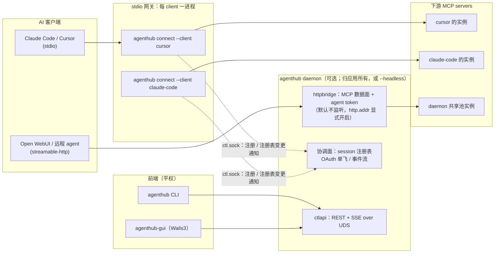
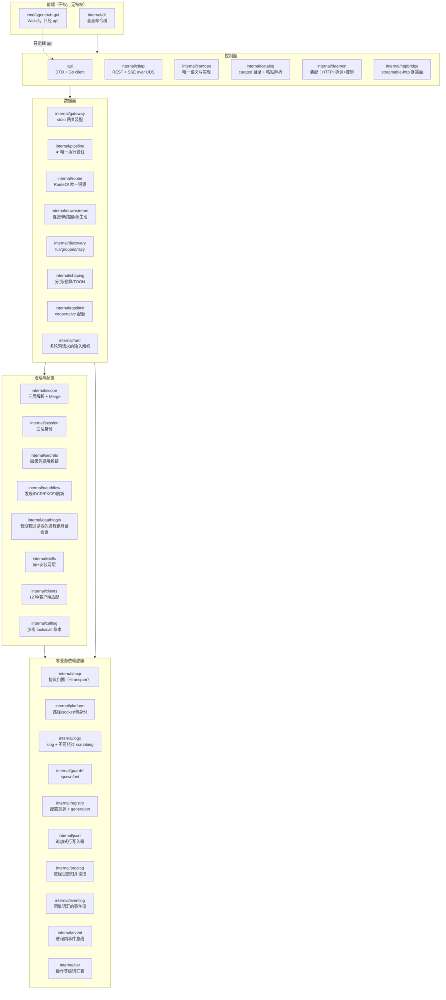
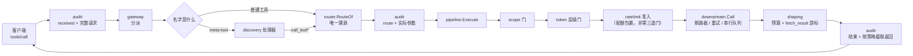
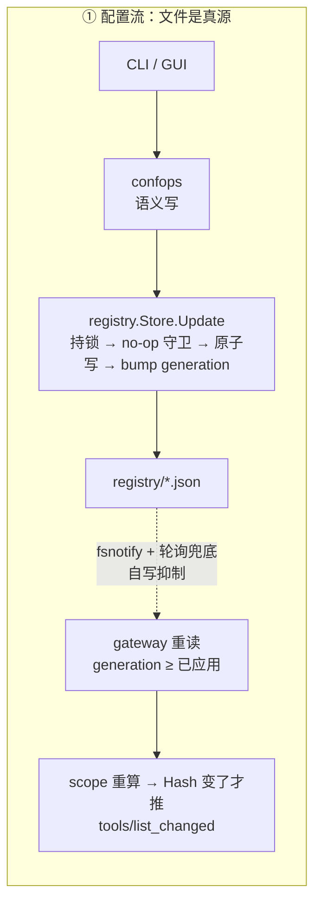
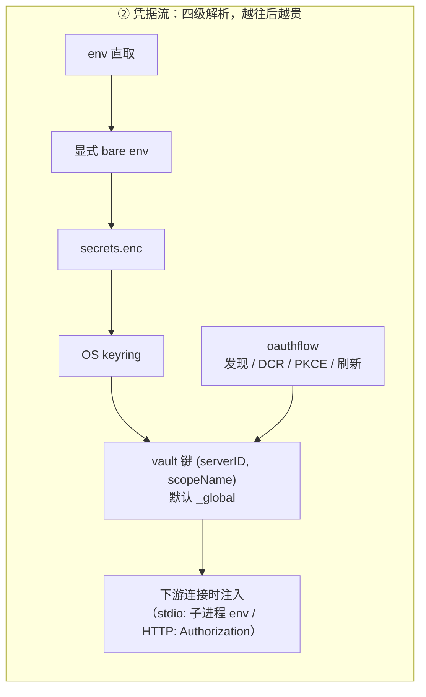
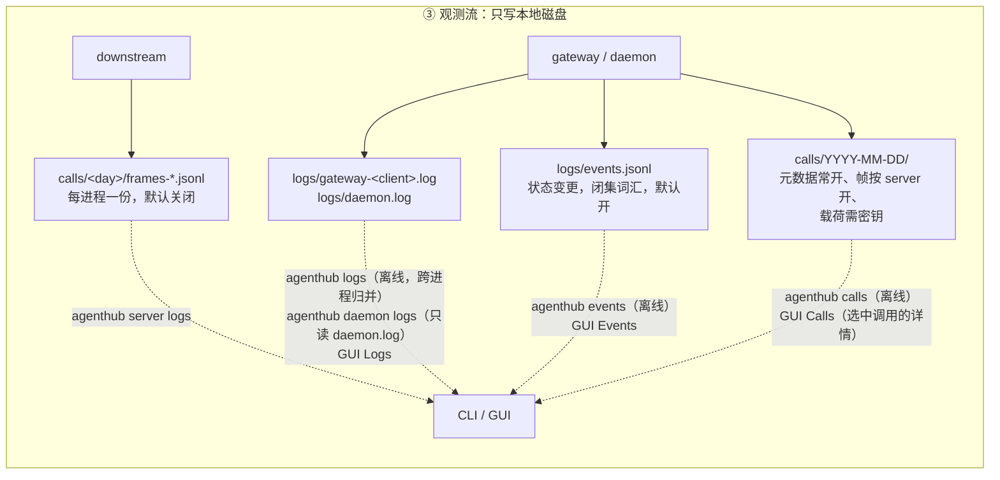
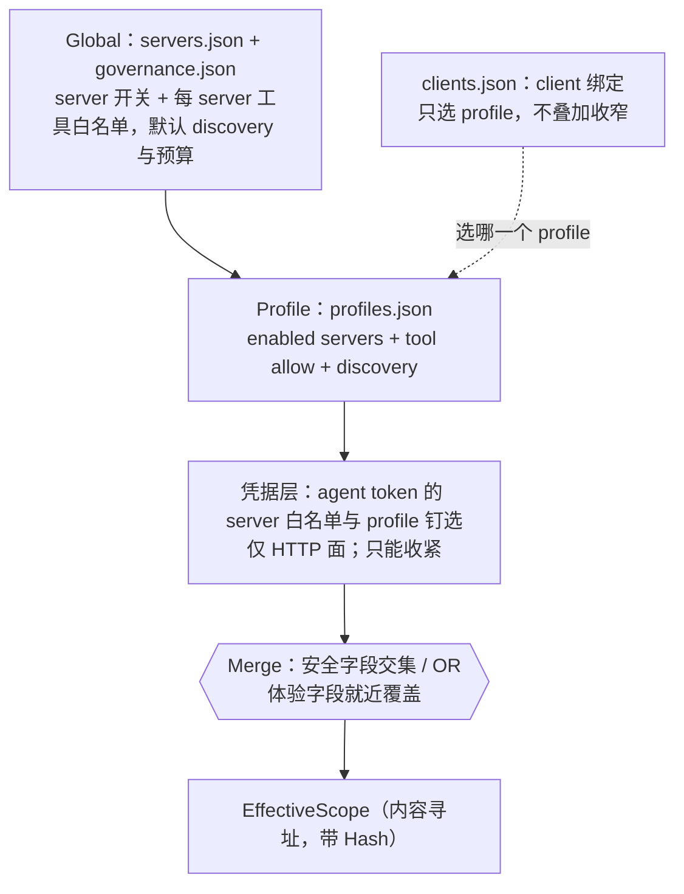

# 架构总览

AgentHub 是本地的 Agent 服务枢纽：一份配置、一套凭据、一条治理管线，供全部 AI 客户端
（Claude Code、Cursor、Codex、Open WebUI 等）共享。本文说明**系统怎么切分、进程怎么摆、
数据往哪流**；每个包的细节在 [modules/](../modules/)，关键流程的时序在 [flows.md](../flows.md)，
不能随手改的约定在 [canonical.md](../canonical.md)。

**这几篇只有英文。** 它们跟着代码一起变，一份中文镜像就是每次改行为都要记得同步的第二个文件，
而被忘掉的那一份和最新的那一份长得一模一样——`canonical.md` 里写的是「不许改的规则」，
只在一边更新过的规则不像过期翻译，像一条从没做过的裁决。中文覆盖的是讲产品的那一层：
本文与 [guide.md](guide.md)。

---

## 1. 一句话模型

客户端以为自己连的是一个 MCP server，实际连的是 AgentHub 的网关；网关按当前会话的
**有效作用域**决定它能看见哪些工具，每次调用都穿过**同一条执行管线**（门禁 → 下游 → 防护与整形），
再把结果交回去。配置与凭据都收敛在这一层，客户端侧只剩一行 `command`。

---

## 2. 进程模型：双模网关



**stdio 接入 = 每个 client 一个独立网关进程。** `agenthub connect --client <id>` 不是转发壳：
读 registry、按本 client 的作用域连下游、注入凭据、跑安全管线，全是它自己做。
这样天然拿到四种隔离——凭据按 client 分化、连接参数（`${ROOT}`/cwd）按 client 分化、
一个客户端的慢调用不会阻塞另一个、下游崩溃只波及一个客户端。

**daemon 是可选的增值层，而网关永不自动拉起它**——stdio 数据面对它零依赖正是这个模型的要点，
自动拉起会把「可选」变成事实上的必选。它承担 HTTP 接入面、控制面，以及协调面（会话注册表、
OAuth 单飞）。stdio 网关的 scope 来自注册表文件，杀掉 daemon 不改变任何客户端看到的东西；
失去的是 `session ls` / `session kill`、控制面事件流和共享 HTTP 池，OAuth 刷新退回文件锁。

**daemon 归启动它的人所有，而答案只有两个。** 桌面应用把它作为受监管的子进程拥有，而 daemon 是
**盯着** owner 而不是信任它会来道别（一条 lifeline 管道，外加 pid 轮询兜底，兜底把「判断不了」
读作还活着）。另一个答案是 `--headless`：给没有桌面的服务器、CI 和 e2e 用，不属于任何人，
由操作者停止。**两者都没说的启动会被拒绝**（`E_DAEMON_UNOWNED`）——一个没人负责的 hub，
正是下一次启动会遇到、无法认领、又不能杀掉的那个。代价是那个增值层跟着应用的作息走：
通过 HTTP 连接的 agent 会在桌面应用退出时失去端点。

于是多个进程共写同一个数据目录，而这份纪律是并发正确性依赖、不是保险：日志每行一次
`O_APPEND` 写、限流计数器与访问账本的存储上限、以及凭据 vault 的每一次写外面各套一把跨进程锁、
registry 的每一次写都走原子改名。逐包的细节在 [modules/](../modules/)。

**HTTP 数据面默认不存在。** `internal/httpbridge` 从两个来源之一开启，绝不各取一半：会敲 flag
的那类启动给了 `--http-addr` 就用命令行，否则用落盘的 `http.*`（`agenthub config set http.addr
<host:port>`）。落盘那种形式的存在理由是桌面应用不敲 flag——只活在 argv 里的开关等于根本给不出来。
**两个来源都没有地址就没有监听器**，不是「有个默认端口」。非 loopback 地址还要再加同一个来源里的
`http.allowRemote` / `--http-allow-remote`，否则 daemon **启动失败**而不是退回 loopback；
随后绑定还要过 `AuthorizeBind`：既无 admin token、又无活跃 agent token、又无注册客户端的会被拒绝。

**HTTP 面复用的是同一套网关，不是第二套装配。** daemon 把一个认证过的凭据映射到一个
`gateway.Conn`——接在内存管道上的那个 `connect` 网关体——因而穿过同一个 discovery surface、
同一个 router、同一个 `pipeline.Execute` 调用点。凭据只从两个既有入口进入治理链：
`Caller.Tier` → 层级门，`Caller.Servers` / `Caller.Profile` → `scope.Sources.Extra` 的额外层
（与持久化各层用同一个 `Merge` 合并，所以只能收窄）。

**服务器状态由网关上报，而不是 daemon 去探。** 只为点亮一个状态灯就开一份连接，代价是每台
stdio server 多一个常驻子进程、远程 server 的 OAuth 与限额翻倍。于是每个网关推送一份随会话
生死的全量快照，daemon 把 N 份视角折成一份：连接状态取最差、工具数取最大、detail 里写清是
**谁**看到的。没有任何网关持有某台服务器时，它的状态是 `unknown / "not observed"`——
一句关于观察者的话，不是一张健康证明。

---

## 3. 核心模块地图

你要改的东西在哪个包。逐包细节见 [modules/](../modules/)。



这张地图是完备的：`internal/` 下的一切都在上面，只有仅供测试的 `internal/depguardtest`
（§4 的失败用例）与 `internal/testutil` 不在。其中六个是收口点——在那里出现第二份实现，
就是给一个只允许有一个答案的问题给出第二个答案：

| 包 | 它收口的是什么 |
|---|---|
| `internal/mcp` | 全仓唯一允许触碰协议实现的地方 |
| `internal/registry` | 配置真源是这些文件，不是 daemon 的内存 |
| `internal/confops` | 唯一一套语义写规则；CLI 与控制面是它的两个前端 |
| `internal/scope` | 「谁能看见什么」的全部判定，都过同一个纯函数 `Merge` |
| `internal/router` | `RouteOf` 是把暴露名还原成 `(server, tool)` 的唯一合法方式 |
| `internal/pipeline` | ★ 所有调用路径都在这里汇合，门禁不可能分叉 |

---

## 4. 分层与依赖方向

四条依赖方向不是评审口头约定，而是 **CI 失败条件**：`api` 与 `cmd/agenthub-gui` 不 import 任何
`internal/*`；`internal/mcp` 只依赖标准库，且是唯一触碰协议实现的包；`internal/pipeline` 不得
import `internal/ctlapi`；`internal/mcp`、`internal/platform`、`internal/logx`、`internal/guard/*`
零业务依赖。规范措辞——以及代码注释里引用的那套编号（「§2 规则 3」）——在
[canonical.md §2](../canonical.md#hard-dependency-direction-constraints-enforced-at-compile-time-by-depguard)。

这一节真正该讲的是它们**怎么被守住**：`internal/depguardtest` 往受约束的包里注入违规探针——
注在检出的一份用完即弃的副本里——并断言 golangci-lint 逐条报错。配置写了但没生效的 lint 规则
比没有更危险，所以第 5 条隐含约束是：**每条规则都必须有一个失败用例，而且这个用例不能靠跳过
自己来通过**。`internal/tier` 单独作为叶子包存在也是同一个产物：它住在 `pipeline` 里的时候，
让第 3 条的失败用例产生的是**编译环而不是 lint 报错**，规则因此不可证明。

---

## 5. 一次工具调用穿过什么



**门禁链顺序是冻结的**（`scope → token 层级`，见 `internal/pipeline`），顺序由测试钉死。
两道门都只依据配置判定，都 fail-closed；链子里没有任何一环会读调用的参数或改写它：
调用方发出什么，下游就收到什么；下游答了什么，调用方就读到什么。

**只有一条执行路径。** 直接调用与 lazy 模式的 `call_tool` 走的是同一个 `pipeline.Execute`，
测试断言两条路径把每个门的计数器推进得完全一致。任何**新增**执行路径都必须自带同样的断言，
不能以「已经有测试了」为由免除。

**无论从哪个分支回来，`defend_and_shape` 都跑一次**——它的计数器两边都会前进，而 stdio 面与
HTTP 面之间的门计数对等断言比的正是这个。它在里面的防御被删掉之后仍留着这个名字，也是因为
那些断言比的是这些 stage 键——改名会让那些测试继续通过、却什么都不再比。

**它"跑过"的范围比它"约束"的范围大，而这个差别是一个失败方向。** 工具错误是一个结果——
`CallResult` 里的 `isError: true`——所以它和成功一样要过预算。传输层或协议层的错误不是：
`req.Call` 把它作为 `error` 交回，这个 stage 在 `callErr` 非空时直接返回、不施加预算，所以
一个下游用巨大的 JSON-RPC 错误回答 `tools/call` 时，那些字节是不受约束地穿过去的。这是刻意
的——整形改写的是结果的内容，而这里没有结果可改写——但它意味着结果预算约束的是下游**回答**
了什么，而不是它能让本进程转发的一切。这一段原先写的是两个分支"被同样地整形"、巨大的
JSON-RPC 错误"和结果一样要过预算"；而这个 stage 自首次公开发布起就在 `callErr` 上短路，
`pipeline_test.go` 钉着这个行为。

**audit 包裹是严格观测，不是门。** 它在解析之前持久化原始的 `tools/call` 参数，在门禁链之前
写下路由身份，并为每一个出口补上 `finished`。记录、密钥或存储压力检查失败时，调用会在
`pipeline.Execute` 前被拒绝；但这层包裹从不改变 scope、tier、参数或结果。

---

## 6. 三条数据流向

调用链之外，还有三条流向决定了系统的行为。它们的共同点是：**真源都在磁盘上，内存只是投影。**







三条流各有一个不能忘的性质：

- **配置流**：`generation` 判据是「读到的 ≥ 已应用的」，不是「等于事件里的 Rev」。
  事件只是通知、不带快照，多次快速连续写时按相等判定会卡在旧版本等一个永远不会再来的事件。
- **凭据流**：vault 键从第一天就是复合键 `(serverID, scopeName)`。事后再改要动 token store、
  回调 server 与刷新协调器的全部单例，所以它不是可以「先简单做」的东西。
- **观测流**：普通日志永远不写调用参数；另行启用的访问账本会记录，加密存放，返回捕获可配为
  `none | errors | truncated | full`（默认 `truncated`），CLI 里任何一次解密都必须显式加
  `--payloads`。两条流的失败方向相反：写不出去的事件被丢弃，写不出去的审计记录会让调用被拒绝。

---

## 7. 作用域：可见性与连接是两个平面

三层解析链（最具体的胜出）：



**client 不是一层。** `clients.json` 只回答一个问题：这个客户端跟哪个 profile——或者什么都不写，
意思是跟随全局激活的那个。这条链上曾经还有两层：一个在自己 profile 之上再收窄的 client 层，
一个按客户端上报的 MCP root 做匹配的 project 层。两个都退役了，理由相同：它们让「这个 client 绑了
哪个 profile」不再是「这个 client 能看见什么」的完整答案，操作者得翻三处再自己手算交集，
而那正是这套模型该替他做的算术。收窄现在只有一个家，需要不同工具面的 client 就换一个 profile。

这次退役的失败方向是**放宽**，所以它写在这里：两层原本都是用来收窄的，于是还带着它们的配置现在
让那个 client 看见的**比以前多**；而 registry 会原样透传未知 JSON，一个遗留的 `projects` 块留在
盘上，看起来和它还生效时一样权威。`agenthub doctor` 因此对 `scope:projects` **告警**，
但绝不删除它：doctor 报告，操作者决定。

合并规则由字段性质决定：**安全字段**（server 可见性、tool allow）逐层取交集，而且任何地方都没有
deny 列表——deny 对「下游明天新增的工具」给出的答案与 allow 相反；**体验字段**（discovery 模式、
结果预算）最具体层胜出。两条不变量：交集永远以**原始工具名**为键，否则改名或后缀消歧就能绕过一次
收窄；悬垂的 profile 引用解析为**空集**而不是全放行，并且 doctor 会为此告警。

**可见性平面与连接平面是分开的。** 网关连接的是本 client 的静态水位（global ∩ profile），
而一个会话看见什么是查询期投影。所以收窄一个会话的作用域不重建 router、不重启任何进程，
这正是按会话收窄可行的原因。覆盖层永不落盘——一个死而复生的运行期放宽是一次安全事故——
这也是 `session scope` 没有办法把它的改动写回配置的原因。持久化的层里也已经没有谁会读会话 root，
所以解析器的缓存键是 `(clientID, registry generation)`；root 只到达 `internal/downstream`，
由它派生出按 root 的实例。

---

## 8. 三种发现模式

工具目录怎么暴露给 agent，由 `EffectiveScope.Discovery` 决定：

| 模式 | 暴露什么 | 适用 |
|---|---|---|
| `full` | 作用域内全部工具 | 工具少，或客户端自己会做筛选 |
| `grouped` | 每个 server 一个聚合工具 + 通用调用入口 | 工具多但仍想免搜索 |
| `lazy` | 五件套 meta-tool：`status` / `search_tools` / `describe_tool` / `call_tool` / `fetch_result` | 工具很多，用 token 预算换覆盖面。**`discovery.DefaultMode`** —— 没有任何一层设过模式时就是它 |

lazy 模式下，一个治理开关可以把 `call_tool` 拆成 `call_tool_read` / `call_tool_write` /
`call_tool_destructive`，好让 IDE 的工具白名单分别放行。等级由下游 annotations 推导，
**完全没有 annotations 即视为 destructive**（fail-closed）。**但这个开关还没有人去读**：
stdio 网关从来不会拿注册表里的 `intentVariants` 去设 `discovery.Options.IntentVariants`，
所以今天在治理里打开它什么都不会发生。写在这里而不是只写在
[modules/dataplane.md](../modules/dataplane.md) 那份「尚未接线」的附录里，是因为决定要不要
打开它的人是在这一节里做这个决定的。

搜索结果携带的是**紧凑签名**而不是完整 schema，agent 需要细节时再调 `describe_tool`。
凡是不能展示的工具 id——不存在、作用域外、不在它所属 server 的白名单里——返回同一段文案，
否则 `describe_tool` 就成了一个枚举 oracle。

---

## 9. 两道防线如何叠加


| 防线 | 粒度 | 判定者 | 挡什么 |
|---|---|---|---|
| scope | server / 工具可见性 | 机器（各层取交集，全部来自配置） | 不该看见的能力 |
| agent token 层级 + 意图变体 | 操作等级 | 机器（token × annotations） | 只读凭据发起写/毁灭操作 |

两道都在调用发生之前判定，依据的是运维事先写下的东西，而且各自的拒绝仍然可以分辨得开
（`E_SCOPE_DENIED`、`E_TOKEN_TIER_DENIED`）。两道都不读参数，也都不读结果：更早的设计在这两道
防线和下游之间还塞过参数预校验、人工审批队列、提示注入扫描和泄漏脱敏，四样全部删除了。
留下来的要么直接拒绝一次调用，要么原样放行。

`internal/ratelimit` **刻意不在门禁链里**：这条链是冻结且 fail-closed 的，
而限流在状态文件损坏时必须 fail-open（限流不是安全边界），把一个 fail-open 的东西放进
fail-closed 的链里就是一个绕过形状。它包在调用本身外面——所有门之后、真正打下游之前。

---

## 10. 数据布局

```
<data>/
├── registry/                 # 配置真源：按变更频率拆多文档，共用一个单调 generation
│   ├── meta.json  servers.json  profiles.json  clients.json  governance.json
│   └── *.lock  backups/      # sibling 跨进程锁 + 5 代滚动备份
├── state/                    # ratelimits.json / run 标记
├── skills/                   # 内容寻址的技能库 + 安装索引
├── cache/tools/<server>.json # 「缓存先答」用的工具目录快照
├── logs/                     # events.jsonl + gateway-<client>.log + daemon.log（都会轮转，保留 3 段）
├── calls/YYYY-MM-DD/         # 调用账本：calls.jsonl（共享元数据）+ frames-*.jsonl（每进程）+ 加密 payload pack
├── tokens.json  .token_key   # agent token（只存 HMAC）
└── run/                      # Linux 未设 AGENTHUB_DATA_DIR 时优先 $XDG_RUNTIME_DIR/AgentHub
    ├── ctl.sock  daemon.json # 控制 socket + 就绪握手（endpoint、pid、version、owner pid；
    │                         # bind 成功后才写）
```

`<data>` 按**构建渠道**分成两个互不相干的目录：

| 渠道 | macOS | Linux |
|---|---|---|
| release | `~/Library/Application Support/AgentHub` | `${XDG_DATA_HOME:-~/.local/share}/AgentHub` |
| dev（默认） | `~/Library/Application Support/AgentHubDev` | `${XDG_DATA_HOME:-~/.local/share}/AgentHubDev` |

两者是**兄弟目录而非父子**：dev 跑的进程不能靠往上走一级去改已安装副本的 registry，
对一边的 `rm -rf` 也不会带走另一边。选哪个由二进制入口的 `channel` 决定，默认 dev——
`internal/platform` 本身不做这个选择，它只负责「给定环境，解析出路径」。`AGENTHUB_DATA_DIR`
高于两者，CI、e2e 和同时开两个沙箱都靠它（失败方向记在
[canonical.md §1](../canonical.md#1-frozen-identifiers-abi-unchangeable-as-of-v1)）。

正因为真源是文件，两个前端才能各走各的写入路径而不打架。**CLI 直接写文件**——在 registry 的
跨进程锁下走 `internal/confops`，有没有 daemon 都一样；它手里没有会过期的长期视图，所以它不带
前置条件。**GUI 经 daemon 写**（`api` → `ctlapi` → 同一个 `internal/confops`），而因为它的窗口
可能捧着几分钟前读到的东西，这条路径带上了乐观并发的前置条件。一套规则、一把锁、两个入口；
在跑的 daemon 也没有被绕开——它的 registry watcher 会捡起 CLI 那次写并广播出去。
变更传播靠 generation 单调计数加事件推送。

CLI 只为**运行期对象**去找 daemon：`session ls/show/kill`，以及 `server inspect` 里的实时状态段。
这些在 daemon 离线时以退出码 4 拒绝，而不是编一个离线答案出来，因为会话从不落盘。
其余的一切——配置，以及包括 `events` 在内的每一条观测流——在整台机器没有 daemon 时照常工作。

---

## 11. 平台现状

| 平台 | 状态 |
|---|---|
| macOS | 完整支持，CI 覆盖 |
| Linux | 完整支持，CI 覆盖 |
| Windows | **实验性，但已从「部分」变为「完整」**：平台层（文件锁 `LockFileEx`、named pipe 监听器（SDDL 收口）、api 拨号、GUI 通道接线、便携 zip 打包），加上此前缺的两件——`daemon stop`（改为经控制面请求，因为这里没有任何信号能送达一个脱离控制台的 daemon）与每个客户端的用户级路径。**从未在真实 Windows 机器上跑过任何一行**，所以以上全部是「能编译、经注入接缝做过单元测试」的代码，而不是有人观察过的行为。见 [windows.md](../windows.md) |

GUI（`cmd/agenthub-gui`）默认**不参与**构建：链接 webview 需要 Linux CI runner 上没有的
GTK/WebKit 开发包，所以 Wails 代码全部在 `//go:build wails` 之后，用 `make gui` 单独构建。
它不带标签的那一半本来就在 `make test` 里，双矩阵都跑；带标签的壳与前端要靠**跑在 macOS runner
上的独立 `gui` job**，因为 Linux 上 `-tags wails` 会在 cgo 前导里就失败，连 `go vet` 都过不去。
这个 job 刻意**不在** `make ci` 里：「GUI 非必须」是编译期性质，它不能成为默认构建的前置。

---

## 12. 装配现状：已实现但尚未接线的部分

一个包可以代码完整、自带测试，却根本没有人调用它，而「以为在生效其实没生效」比「知道没做」
危险得多。**但清单不在这里**：它是 [modules/dataplane.md](../modules/dataplane.md) 末尾那份
附录，贴着它所描述的代码；已确认、已定位到行但尚未修复的缺口，同样记在拥有它的那个包的
[modules/](../modules/) 文档里。这一节曾经有的那张汇总表是被删掉而不是被清空的——一份离开了
主题的汇总，正是烂掉了也没人发现的那一份。剩下还没接线的东西都只关乎呈现：**那张表当年列过的
每一条治理项，最后都是被删掉而不是被接上的**，而这是对的方向——一条没接线的治理接缝，
在赶时间的运维眼里读起来就像一层已经在那儿的保护。

跟以上这些都不同的是**有意为之**的边界，它们不属于待办：GUI 不参与默认构建、skills 物化只到
client 粒度、TOON 无解码器、teams 未实现（见 [canonical.md](../canonical.md) §4
「已知的能力边界」）。Windows 两边都不属于——它的平台层已实现、从未在真机上跑过，
而这层之上还有两处完全不能用；哪些是哪些，只有 [windows.md](../windows.md) 一处在追踪。

---

## 13. 延伸阅读

要七条流程的时序图和它们各自的失败分支，看 [flows.md](../flows.md)；动一个包之前要先知道它自己的
不变量，看 [modules/](../modules/)；想知道一个名字、一条依赖或一项约定到底能不能改，看
[canonical.md](../canonical.md)；那个平台的现状看 [windows.md](../windows.md)。
[docs/README.md](../README.md) 是索引，它说明哪一层文档回答哪一类问题。
