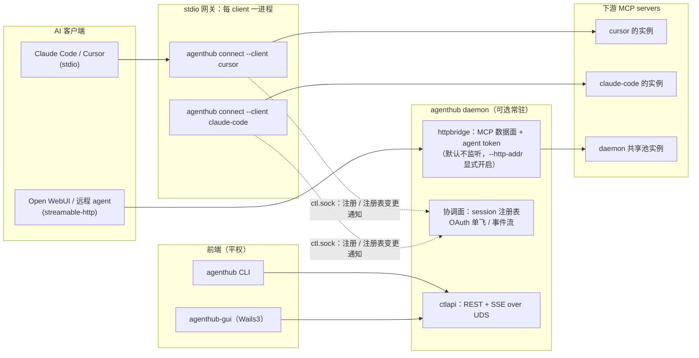
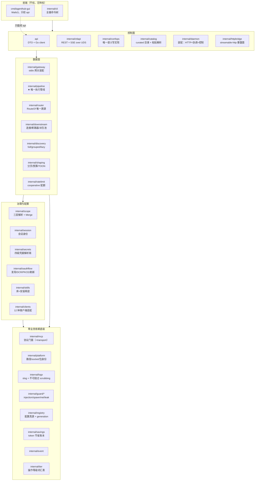
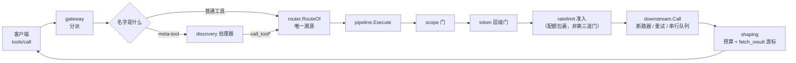
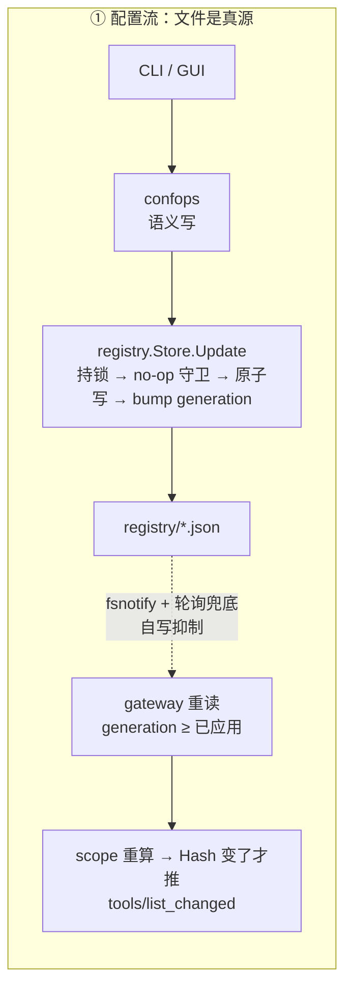
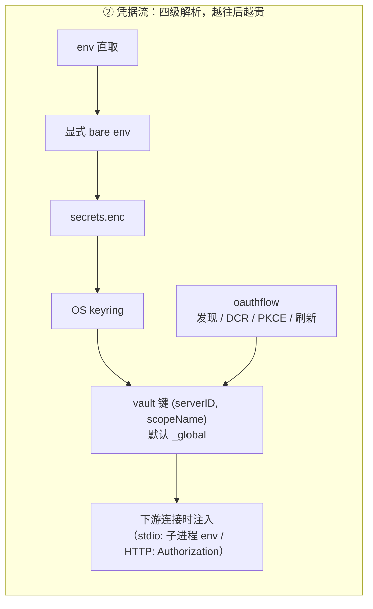
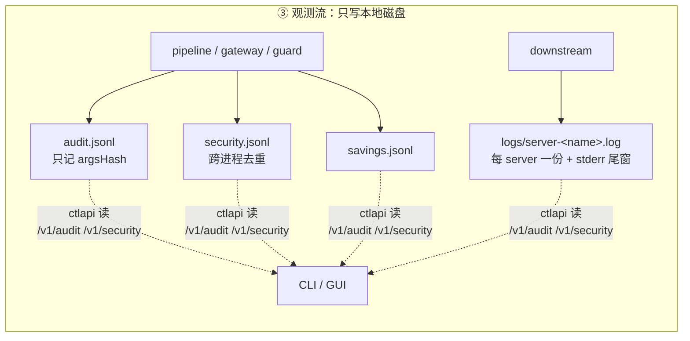
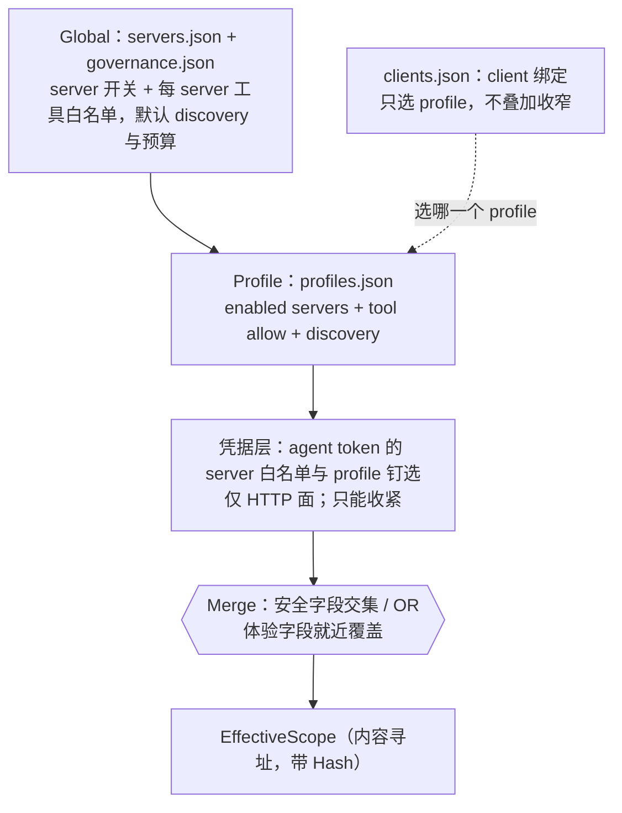

# 架构总览

AgentHub 是本地的 Agent 服务枢纽：一份配置、一套凭据、一条治理管线，供全部 AI 客户端
（Claude Code、Cursor、Codex、Open WebUI 等）共享。本文说明**系统怎么切分、进程怎么摆、
数据往哪流**；每个包的细节在 [modules/](../modules/)，关键流程的时序在 [flows.md](../flows.md)，
不能随手改的约定在 [canonical.md](../canonical.md)。

**这几篇只有英文。** 它们跟着代码一起变，一份中文镜像就是每次改行为都要记得同步的第二个文件，
而被忘掉的那一份和最新的那一份长得一模一样——`canonical.md` 里写的是「不许改的规则」，
只在一边更新过的规则不像过期翻译，像一条从没做过的裁决。中文覆盖的是讲产品的那一层：
本文与 [guide.md](guide.md)。

---

## 1. 一句话模型

客户端以为自己连的是一个 MCP server，实际连的是 AgentHub 的网关；网关按当前会话的
**有效作用域**决定它能看见哪些工具，每次调用都穿过**同一条执行管线**（门禁 → 下游 → 防护与整形），
再把结果交回去。配置与凭据都收敛在这一层，客户端侧只剩一行 `command`。

---

## 2. 进程模型：双模网关



**stdio 接入 = 每个 client 一个独立网关进程。** `agenthub connect --client <id>` 不是转发壳，
它是完整网关：自己读 registry、自己按本 client 的作用域连下游、自己注入凭据、自己跑安全管线。
这样天然拿到四种隔离——凭据按 client 分化、连接参数（`${ROOT}`/cwd）按 client 分化、
一个客户端的慢调用不会阻塞另一个、下游崩溃只影响一个客户端。

**daemon 是可选的增值层，不是必需品。** 它承担三件事：HTTP 接入面（共享下游连接池）、
控制面（CLI 与 GUI 的管理 API）、协调面（会话注册表、OAuth 刷新单飞）。
网关**永不自动拉起 daemon**——stdio 数据面对 daemon 零依赖是这个模型的核心卖点，
自动拉起会把「可选」变成事实上的必选。daemon 不在时的降级如今在数据面上几乎观察不到：
stdio 网关的 scope 完全来自注册表文件，杀掉 daemon 不改变任何客户端看到的东西；
失去的是 `session ls` / `session kill`、事件流和共享 HTTP 池，OAuth 刷新退回文件锁。

代价是多进程共写磁盘的纪律必须做对：日志每行一次 `O_APPEND` 写、指纹与隔离集用跨进程文件锁、
安全事件跨进程去重。这些不是保险，是并发正确性依赖。

**HTTP 数据面默认不存在。** `internal/httpbridge` 的 MCP 暴露面由 `agenthub daemon start
--http-addr <host:port>` 显式开启；**没有地址就没有监听器**（不是「有个默认端口」）。非 loopback
地址还要再加 `--http-allow-remote`，否则 daemon **启动失败**而不是悄悄退回 loopback——配置声称的
暴露面必须兑现或报错。绑定本身还要过 `AuthorizeBind`：既无 admin token、又无活跃 agent token、
又无注册客户端的监听器会被拒绝。

**HTTP 面复用的是同一套网关，不是第二套装配。** daemon 把一个认证过的凭据映射到一个
`gateway.Conn`——即 `agenthub connect` 的那个网关体，只是接在内存管道上而不是 stdin/stdout。
请求写进的是同一个 frame reader，因而穿过同一个 discovery surface、同一个 router、同一个
`pipeline.Execute` 调用点。凭据只从两个既有入口进入治理链：`Caller.Tier` →
`pipeline.CallRequest.CallerTier`（token 层级门），`Caller.Servers` / `Caller.Profile` →
`scope.Sources.Extra` 的额外层（与持久化三层同一个 `Merge` 取交集，只能收窄）。
连接按**凭据**复用并在空闲后回收，所以下游连接是按凭据共享的，而不是按 HTTP session 复制的。

**「服务器现在什么状态」这个问题也顺着同一条线走。** daemon 在数据面关闭时不连下游，所以它也不该为了
在 `/v1/servers` 上点亮一个状态灯而去重开一份连接（那意味着每台 stdio server 多一个常驻子进程、
远程 server 的 OAuth 与限额翻倍）。真正持有连接的是网关，于是由网关经控制连接**上报**——
`POST /v1/gateway/{sid}/servers`，全量快照，随会话生死。daemon 只负责把 N 个客户端对同一台
服务器的 N 份状态折成一份：连接状态取最差、工具数取最大、detail 里写清是**谁**看到的。
没有任何网关持有某台服务器时，它的状态是 `unknown / "not observed"`——一句关于观察者的话，
不是一张健康证明。

---

## 3. 核心模块地图

包按层归属，逐包细节见 [modules/](../modules/)。这张表回答的是「我要改的东西在哪个包」。



最值得先认识的九个包：

| 包 | 一句话职责 | 为什么它重要 |
|---|---|---|
| `internal/mcp` | MCP 协议唯一门面，只依赖标准库 | 全仓唯一允许触碰协议实现的地方；有界读、取消转发、反向 RPC 都在这里 |
| `internal/registry` | 配置真源：多文档 + 原子写 + generation + watch | 「配置真源是文件而不是 daemon 内存」由它兑现 |
| `internal/confops` | **唯一**的语义写实现（加 server、改 profile、翻治理开关） | CLI 与控制面是同一套规则的两个前端，规则只有一份 |
| `internal/scope` | 三层解析链 + `Merge` 纯函数 + 内容寻址 `EffectiveScope` | 「谁能看见什么」的全部判定；安全字段只能越收越紧 |
| `internal/router` | 命名空间聚合与 `RouteOf` 唯一溯源 | 暴露名 → `(server, tool)` 的唯一合法还原方式 |
| `internal/pipeline` | ★ 唯一执行管线：两道门 + 整形 | 所有调用路径都在这里汇合，门禁不可能分叉 |
| `internal/downstream` | 下游连接生命周期、串行队列、断路器、派生实例池 | 下游的不稳定被挡在这一层，不外溢到调用方 |
| `internal/gateway` | stdio 网关装配与生命周期（`connect` 的实现体） | 数据面的组装点；HTTP 面复用的也是它 |
| `internal/guard/*` | spawn 反走私 / SSRF | 零业务依赖，可被任何层安全复用 |

---

## 4. 分层与依赖方向

四条依赖约束不是评审口头约定，而是 **CI 失败条件**，并且每一条都有一个「能证明它真的会拦」的
失败用例（`internal/depguardtest` 往真实包里注入违规探针，断言 golangci-lint 报错）：

| # | 约束 | 为什么 |
|---|---|---|
| 1 | `cmd/agenthub-gui` 与 `api` 不得 import 任何 `internal/*` | 「GUI 非必须、无特权」是编译期约束，不是口号 |
| 2 | `internal/mcp` 只依赖标准库；其余包不得 import 任何第三方 MCP 库 | 协议门面唯一，且协议层不变量要自己保证 |
| 3 | `internal/pipeline` 不得 import `internal/ctlapi` | 数据面不依赖控制面 |
| 4 | `internal/mcp`、`internal/platform`、`internal/logx`、`internal/guard/*` 零业务依赖 | 底座可被任何层安全复用 |

配置写了但没生效的 lint 规则比没有更危险，所以第 5 条隐含约束是：**规则必须有失败用例**。

`internal/tier`（read / write / destructive 三级词汇表）单独作为叶子包存在，正是这套约束的产物：
五个包都要说「read」这个词，谁也不该为此 import 别人。它曾经住在 `pipeline` 里，
结果控制面要说 tier 就得 import 数据面的执行包——而那条 import 让「pipeline 不得 import ctlapi」
的失败用例产生的是**编译环，不是 lint 报错**，规则因此不可证明。

---

## 5. 一次工具调用穿过什么



这条链上有三个不可动摇的性质：

**门禁链顺序是冻结的**（`scope → token 层级`，见 `internal/pipeline`），顺序由测试钉死。
两道门都只依据配置判定，都 fail-closed。链子里没有任何一环会读调用的参数或改写它：
调用方发出什么，下游就收到什么；下游答了什么，调用方就读到什么。

**只有一条执行路径。** 直接调用与 lazy 模式的 `call_tool` 走的是同一个 `pipeline.Execute`。
这不是靠约定维持的：测试断言两条路径把每个门的计数器推进得完全一致——门禁不可能分叉。
任何**新增**执行路径都必须自带同样的计数断言，不能以「已经有测试了」为由免除。

**成功与错误分支走同一条出口。** 整形对两个分支都生效，并且**只跑一次**——跑两次会重复消耗
游标，还可能留下一个指向没人会收到的字节的截断提示。

---

## 6. 三条数据流向

调用链之外，还有三条流向决定了系统的行为。它们的共同点是：**真源都在磁盘上，内存只是投影。**







三条流各有一个不能忘的性质：

- **配置流**：`generation` 判据是「读到的 ≥ 已应用的」，不是「等于事件里的 Rev」。
  事件只是通知、不带快照，多次快速连续写时按相等判定会卡在旧版本等一个永远不会再来的事件。
- **凭据流**：vault 键从第一天就是复合键 `(serverID, scopeName)`。事后再改要动 token store、
  回调 server 与刷新协调器的全部单例，所以它不是可以「先简单做」的东西。
- **观测流**：**审计永不记 args**——类型层面就没有那个字段，只有 `argsHash`。
  参数原文只在内存与 SSE 通道里流动。

---

## 7. 作用域：可见性与连接是两个平面

三层解析链（最具体的胜出）：



**client 不是一层。** `clients.json` 只回答「这个客户端跟哪个 profile」，绝不在 profile 之上再叠一层
收窄。它曾经有自己的 servers / tools / discovery / 预算字段，结果是「这个 client 绑了哪个
profile」不再是「这个 client 能看见什么」的完整答案——而后者正是整个模型存在的理由：操作者得翻两处
再自己手算交集。收窄现在只有一个家（profile），需要不同面的 client 就绑到不同的 profile 上。

**per-project 层已经退役。** 它按客户端上报的 MCP root 做最长前缀匹配，可以换 profile、可以再收窄。
它的代价是同一个问题有了第二个答案，而这个答案还取决于客户端到底实现不实现 roots 能力——一个不报
root 的客户端静默落回更宽的那一层。`clients.json` 里遗留的 `projects` 块会被 registry 的未知字段
透传原样保留（看起来仍然权威），所以 `agenthub doctor` 的 `scope:projects` 会**告警**：那个块原本是
用来收窄的，失效的方向是**放宽**。

合并规则由字段性质决定，不是逐字段拍脑袋：**安全字段**（server 可见性、tool allow）逐层取交集，
——只能越来越紧，而且任何地方都没有 deny 列表：deny 对「下游明天新增的工具」给出的答案与 allow 相反，
一份配置不能有两个答案；**体验字段**（discovery 模式、结果预算）最具体层胜出。
两条不变量：交集永远以**原始工具名**为键（否则改名或后缀消歧就能绕过收窄），
悬垂的 profile 引用解析为**空集**而不是全放行，并且 doctor 会显式告警而不是静默。

**可见性平面与连接平面是分开的。** 网关连接的是本 client 的静态水位（它绑定的 profile），
而每个会话看见什么是查询期投影。所以收窄一个会话的作用域不会重建 router、不会重启下游进程——
要改变一份面只能改配置——profile 的成员与工具白名单、server 自己的白名单、client 的绑定。
活着的会话没有可以被改动的东西。

---

## 8. 三种发现模式

工具目录怎么暴露给 agent，由 `EffectiveScope.Discovery` 决定：

| 模式 | 暴露什么 | 适用 |
|---|---|---|
| `full` | 作用域内全部工具 | 工具少，或客户端自己会做筛选 |
| `grouped` | 每个 server 一个聚合工具 + 通用调用入口 | 工具多但仍想免搜索 |
| `lazy` | 五件套 meta-tool：`status` / `search_tools` / `describe_tool` / `call_tool` / `fetch_result` | 工具很多，用 token 预算换覆盖面。**`discovery.DefaultMode`** —— 没有任何一层设过模式时就是它 |

lazy 模式下 `call_tool` 可按治理开关拆成 `call_tool_read` / `call_tool_write` /
`call_tool_destructive` 三个变体，好让 IDE 的工具白名单分别放行；等级由下游 annotations 推导，
**完全没有 annotations 即视为 destructive**（fail-closed），变体与实际等级冲突即拒绝并提示正确变体。

**但这个开关目前还没有人去读。** 上面这些 `internal/discovery` 都实现了、也有测试，可是 stdio 网关
从来不会拿 `intentVariants` 去设 `discovery.Options.IntentVariants`——所以今天在治理里打开这个字段，
什么都不会发生，详见 [modules/dataplane.md](../modules/dataplane.md) 里那份「已实现但尚未接线」的附录。
这句话写在这里而不是只写在那边，是因为决定要不要打开它的人是在这一节里做这个决定的。

搜索结果携带的是**紧凑签名**而不是完整 schema，agent 需要细节时再调 `describe_tool`。
凡是不能展示的工具 id——不存在、作用域外、被隔离、被禁用——返回同一段文案，
因为差异化的错误会把 `describe_tool` 变成一个枚举 oracle。

---

## 9. 两道防线如何叠加


| 防线 | 粒度 | 判定者 | 挡什么 |
|---|---|---|---|
| scope | server / 工具可见性 | 机器（各层取交集，全部来自配置） | 不该看见的能力 |
| agent token 层级 + 意图变体 | 操作等级 | 机器（token × annotations） | 只读凭据发起写/毁灭操作 |

两道都在调用发生之前判定，依据的是运维事先写下的东西。两道都不读参数，也都不读结果：更早的设计
在这两道防线和下游之间还塞过参数预校验、人工审批队列、提示注入扫描和泄漏脱敏，四样全部删除了。
留下来的要么直接拒绝一次调用，要么原样放行。

`internal/ratelimit` **刻意不在门禁链里**：这条链是冻结且 fail-closed 的，
而限流在状态文件损坏时必须 fail-open（限流不是安全边界），把一个 fail-open 的东西放进
fail-closed 的链里就是一个绕过形状。它包在调用本身外面——所有门之后、真正打下游之前。

---

## 10. 数据布局

```
<data>/
├── registry/                 # 配置真源：按变更频率拆多文档，共用一个单调 generation
│   ├── meta.json  servers.json  profiles.json  clients.json  governance.json
│   └── *.lock  backups/      # sibling 跨进程锁 + 5 代滚动备份
├── state/                    # ratelimits.json / run 标记
├── skills/                   # 内容寻址的技能库 + 安装索引
├── cache/tools/<server>.json # 「缓存先答」用的工具目录快照
├── logs/                     # savings.jsonl + server-<name>.log + daemon.log
├── tokens.json  .token_key   # agent token（只存 HMAC）
└── run/                      # Linux 未设 AGENTHUB_DATA_DIR 时优先 $XDG_RUNTIME_DIR/AgentHub
    ├── ctl.sock  daemon.json # 控制 socket + 就绪握手（bind 成功后才写）
```

`<data>` 按**构建渠道**分成两个互不相干的目录：

| 渠道 | macOS | Linux |
|---|---|---|
| release | `~/Library/Application Support/AgentHub` | `${XDG_DATA_HOME:-~/.local/share}/AgentHub` |
| dev（默认） | `~/Library/Application Support/AgentHubDev` | `${XDG_DATA_HOME:-~/.local/share}/AgentHubDev` |

两者是**兄弟目录而非父子**：dev 跑的进程不能靠往上走一级去改已安装副本的 registry，
对一边的 `rm -rf` 也不会带走另一边。选哪个由二进制入口的 `channel` 决定
（`main.channel` 默认 `"dev"`，只有显式按 release 构建的才解析到安装位置），
`internal/platform` 本身不做这个选择——它只负责「给定环境，解析出路径」。
**失败方向：忘了声明渠道的构建拿到 dev 目录，永远不会拿到 release 目录。**
猜错这个方向的代价是多一个沙箱；猜错另一个方向会花掉用户真实安装里那个一次性的 OAuth refresh token，
而那不可恢复。显式 `AGENTHUB_DATA_DIR` 仍然优先于两者（CI、e2e 与同时调两个沙箱的人都靠它）。

配置真源始终是文件，**不是 daemon 的内存**。CLI 在 daemon 离线时直接写文件（持锁 + 原子写），
在线时经 daemon 写——两条路径用同一套锁与 no-op 守卫，所以互不丢更新。变更传播走
generation 单调计数 + 事件推送，mtime 不参与语义。

---

## 11. 平台现状

| 平台 | 状态 |
|---|---|
| macOS | 完整支持，CI 覆盖 |
| Linux | 完整支持，CI 覆盖 |
| Windows | **实验性**：平台层已补齐——文件锁（`LockFileEx`）、named pipe 监听器（SDDL 收口）、api 拨号、GUI 通道接线、便携 zip 打包——但这层之上 `daemon stop` 与 `client connect` 的用户级路径尚未实现，且**从未在真实 Windows 机器上跑过任何一行**。见 [windows.md](../windows.md) |

GUI（`cmd/agenthub-gui`）默认**不参与**构建：链接 webview 需要 GTK/WebKit 开发包，
Linux CI runner 上没有。Wails 代码全部在 `//go:build wails` 之后，用 `make gui` 单独构建。

CI 覆盖分两层：不带标签的那一半（`services` 服务体、`cmd/agenthub-gui/internal/healthgen` 的 golden）
本来就在 `make test` 的 `go test ./...` 里，双矩阵都跑；带 `wails` 标签的壳与前端由
**独立的 `gui` job** 覆盖（`make gui-frontend-ci` + `make gui-go` + `make gui-vet`），
跑在 macos runner 上——Linux 上 `-tags wails` 会在 cgo 前导（`pkg-config: gtk4
webkitgtk-6.0`）就失败，连 `go vet` 都过不去，而 macOS runner 自带 Cocoa/WebKit SDK，
不需要装任何包。这个 job 刻意**不在** `make ci` 里：「GUI 非必须」是编译期性质，
它不能成为默认构建的前置。

---

## 12. 装配现状：已实现但尚未接线的部分

包级完成度与**运行时是否真的走到**是两件事。下面这些能力代码完整、各自有测试，
但装配层还没接上——文档把它们标出来，是因为「以为在生效其实没生效」比「知道没做」危险得多。

| 能力 | 实现状态 | 装配现状 |
|---|---|---|

以下是**有意为之**的边界，不属于待办：GUI 不参与默认构建、skills 物化只到 client 粒度、
TOON 无解码器、teams 未实现。详见 [canonical.md](../canonical.md) §4「已知的能力边界」。

Windows 不属于这一类。它的平台层已实现、但从未在真机上跑过，而这层之上还有两处完全不能用——
哪些是哪些，只有 [windows.md](../windows.md) 一处在追踪。

已确认存在、已定位到行、但尚未修复的缺口，记在拥有它的那个包的 [modules/](../modules/) 文档里——
贴着它所描述的代码，而不是另立一份清单。

---

## 13. 延伸阅读

- [flows.md](../flows.md) —— 关键流程的时序图：网关启动、一次 lazy 调用、配置热更新、OAuth、派生实例。
- [modules/](../modules/) —— 逐包文档：职责、关键类型、不变量与失败方向、文件地图。
- [canonical.md](../canonical.md) —— 冻结标识符、依赖约束、命令名规则、工程约定、裁决记录。
- [windows.md](../windows.md) —— Windows 现状与验收标准。
