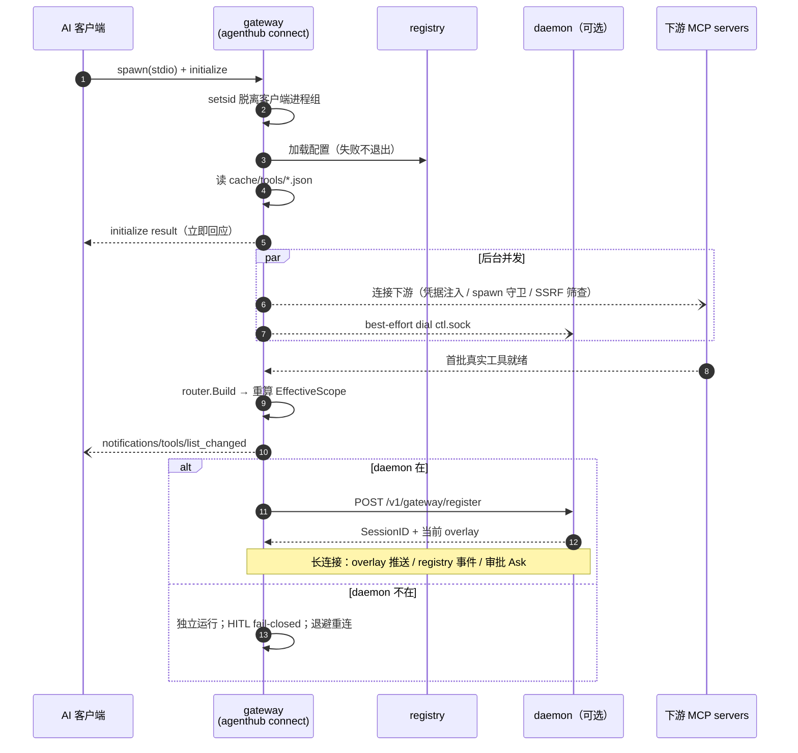
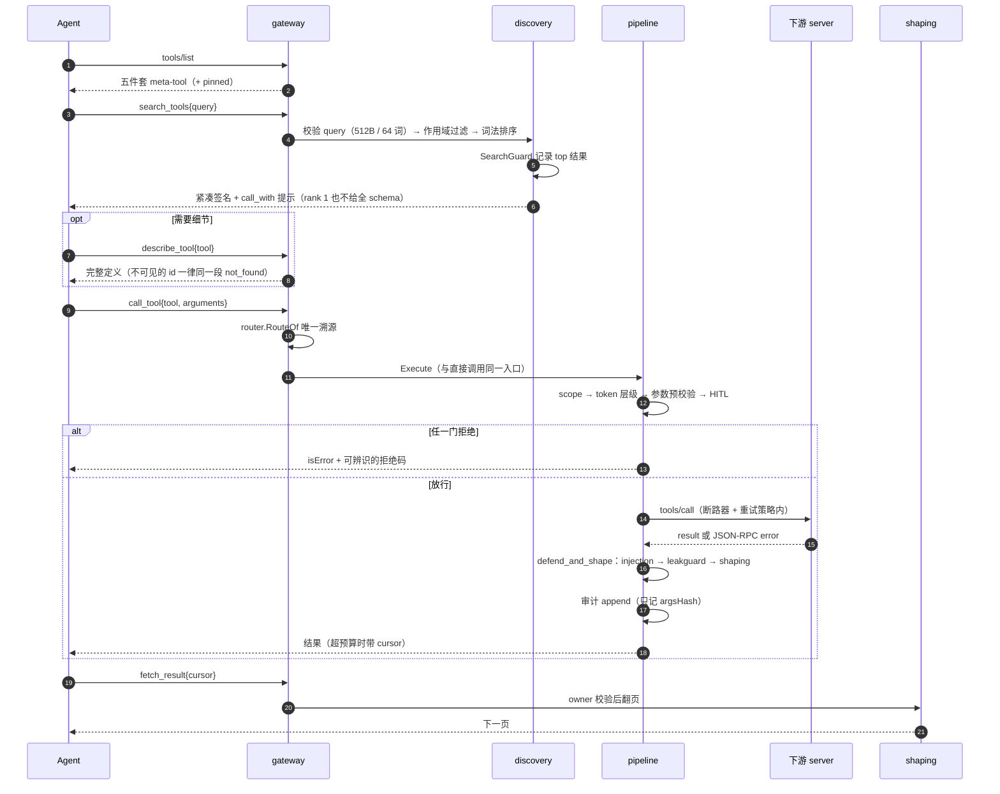
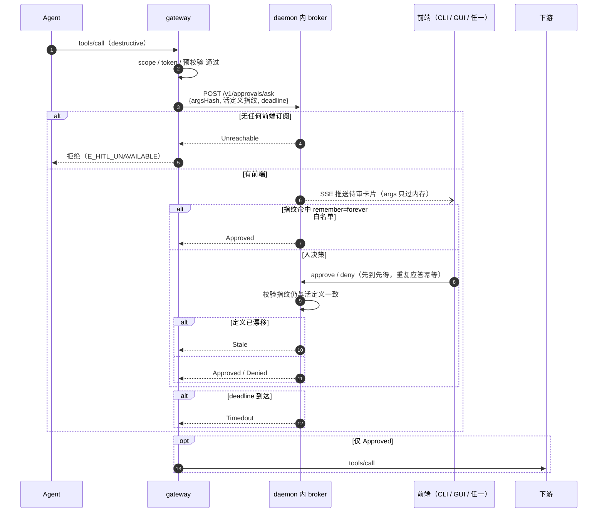
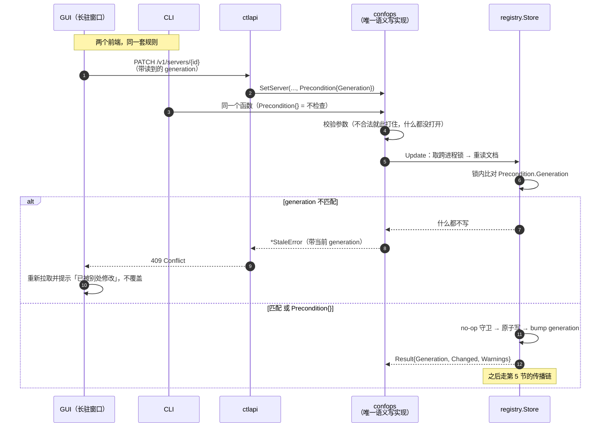
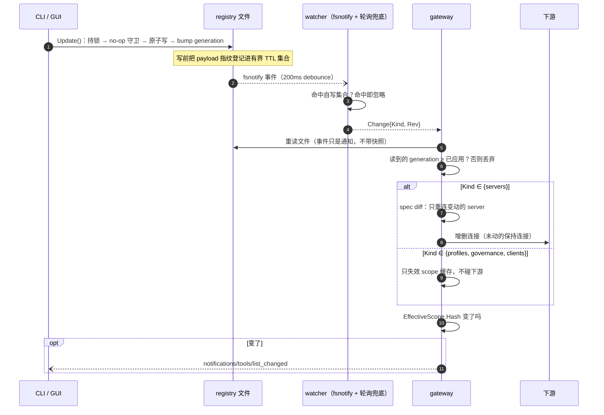
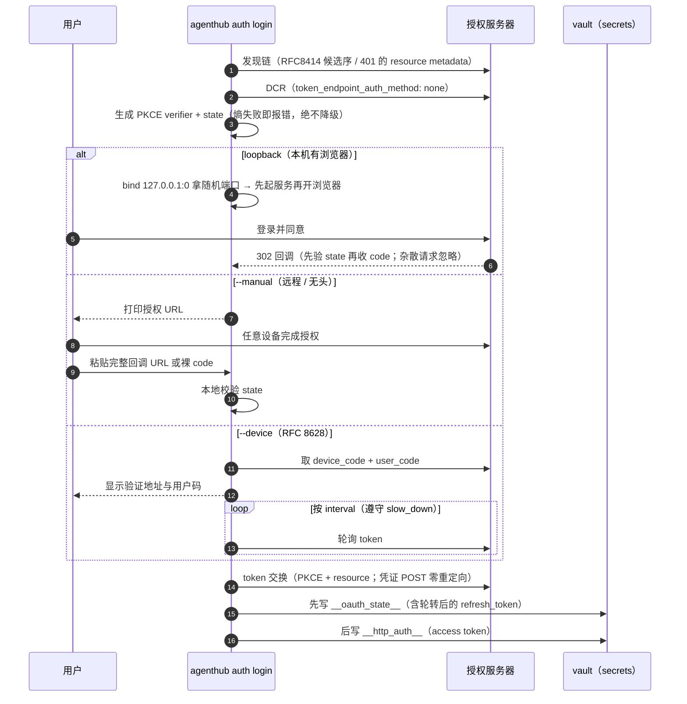
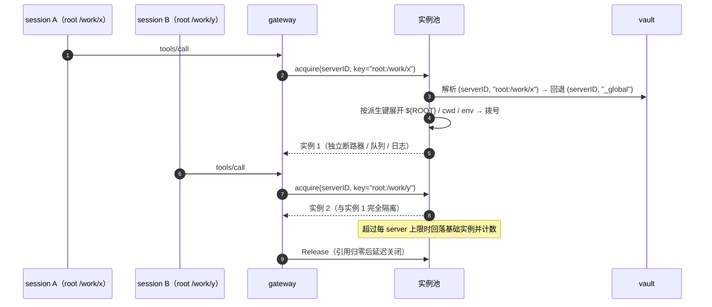

# 关键流程

本文用时序图说明七个最值得理解的运行时流程。图后的文字讲**失败分支**与**为什么这样设计**——
顺利路径看图就够了，真正难的永远是出错的时候。系统的静态切分见 [architecture.md](architecture.md)，
三条数据流向的总览在 [architecture.md §6](architecture.md#6-三条数据流向)。

| # | 流程 | 一句话 |
|---|---|---|
| 1 | [网关启动](#1-网关启动能答就先答) | 缓存先答，下游后到，`list_changed` 补推 |
| 2 | [lazy 模式的一次完整调用](#2-lazy-模式的一次完整调用) | 搜索 → describe → 调用 → 翻页 |
| 3 | [HITL 审批](#3-hitl-审批三处-fail-closed) | 除 `Approved` 外一切都不放行 |
| 4 | [配置写入](#4-配置写入五个写者与乐观锁) | 语义写只有一处实现，冲突返回 409 |
| 5 | [配置热更新](#5-配置热更新两个必须做对的点) | 事件只是通知，generation 判据是 `≥` |
| 6 | [headless OAuth 与刷新](#6-headless-oauth-与刷新) | 三种回调模式，写序先 state 后 token |
| 7 | [派生下游实例](#7-派生下游实例) | 只动连接平面，不动可见性 |

---

## 1. 网关启动：能答就先答

三个决定启动体验的取舍：

**`setsid` 脱离客户端进程组**，否则下游子进程的 `SIGTTIN`/`SIGTTOU` 会干扰 TUI 客户端的 raw mode。

**配置加载失败不退出。** 网关退回上次持久化的工具缓存来服务握手与 `tools/list`——
用户宁可看到一个"暂时用着旧目录"的枢纽，也不要一个连不上的枢纽。缓存也是慢启动的答案：
下游还在连的时候 `tools/list` 就已经能答，真实工具就绪后再推 `tools/list_changed`。

**下游还没连上时的 `tools/call` 返回可重试的忙错误（`-32000`），而不是"工具不存在"。**
谎称不存在会让 agent 放弃并改道，而它其实只需要等一秒。

---

## 2. lazy 模式的一次完整调用

**`RouteOf` 是暴露名到真实 `(server, tool)` 的唯一合法溯源，代码里禁止按 `__` 切分。**
server id 或工具名本身含 `__` 时切分会错判，而消歧后缀（`_2`）更让字符串还原无从谈起。

**SearchGuard 处理的是 agent 打转。** 连续三次搜到同一个 top 结果，就把返回截断成一条
命令式提示（"你已经找到 X 了，直接调它"）；任何非搜索动作重置计数；低置信度不升级。

**cursor 的顺序号是可猜的，owner 校验是唯一隔离。** 因此未命中、越权、过期、格式非法
四种情况返回**逐字节相同**的文案——差异化的错误会泄漏"这个 cursor 存在但不属于你"。

---

## 3. HITL 审批：三处 fail-closed

**除 `Approved` 外一切都不放行**：拒绝、超时、broker 不可达、陈旧，四种结果的语义不同但后果一致。
daemon 被 `kill -9` 后，网关侧承载审批的那条连接一断就会取消在飞请求并立即返回 Unreachable——
一个"等人决定"的调用绝不能因为无人可等而永远挂着。

**批的就是跑的。** 请求携带参数的规范化 JSON 哈希，审批与执行绑定在同一份参数上；
同时携带活工具定义的指纹，所以下游偷偷改了工具语义之后，之前的批准会 `Stale` 而不是被复用。
参数原文只在内存与 SSE 通道里流动，从不落盘。

---

## 4. 配置写入：五个写者与乐观锁

registry 有五个写者：N 个网关、daemon、CLI、GUI、以及将来的第三方。写路径的形状由此决定。

**语义写只有一处实现。** `internal/confops` 提供的是**操作**而不是字段 setter：
`RenameProfile` 会顺带重指每一个引用它的 client 绑定，因为把引用留在原地会让那些客户端
fail-close 成空作用域——那个后果属于这个操作本身，不属于调用方。如果控制面自己再写一遍
「怎么改一个 profile」，CLI 与 GUI 就会各有一套校验与副作用，两边迟早对同一个操作给出不同结果。
这类事故有过先例：`SpecFromEntry` 的注释声称自己是唯一翻译点，而网关另外手搓了一份 Spec，
结果容器隔离被静默丢掉。一个 parity 测试断言两条路径对同一操作产出**逐字节相同**的 registry 文档。

**乐观锁而不是最后写入者赢。** 文件锁保证不撕裂，但**不保证不覆盖**：两个人同时编辑同一个
profile，后写的赢，前一个人的修改无声消失。GUI 是长驻窗口、页面数据可能已经旧了几分钟，
会让这件事高频发生。所以每个操作携带 `Precondition`，比对发生在**持锁之后、修改之前**，
不一致就返回带当前 generation 的 `*StaleError`，控制面映射为 **409**。
`Precondition{}`（generation 0）表示「不检查」，CLI 的非交互路径用它，所以 CLI 行为不变。

**校验拒绝而不是归一化。** 未知的 transport、未知的 runtime、解析不了的布尔值——
每一种都让 registry 保持原样，而不是落在一个操作者没要求过的默认值上。

---

## 5. 配置热更新：两个必须做对的点

**自写抑制**：daemon 或网关自己写配置时 fsnotify 同样报事件，不抑制就会对自己的写做一轮空重载。
写前把 payload 指纹登记进一个有界、10 秒过期的多槽位集合，watcher 命中即忽略；写失败立刻撤销登记。
抑制漏判只多一次空重载（fail-open 方向安全），但它永远不可能掩盖外部变更。

**generation 判据是 `≥` 不是 `==`**：推送只是通知、不带快照，网关仍要自己重读文件。
多次快速连续写时读到的 generation 会**超过**事件里的 Rev，按相等判定会卡在旧版本，
等一个永远不会再来的事件。

**只有 servers 变更会触碰下游连接**，而且是按 spec 差异只重连变动的那些。收窄作用域这类
纯可见性变化只失效缓存——这是 per-session 动态作用域不重启进程的前提。

---

## 6. headless OAuth 与刷新

**每次授权绑定一个新的随机端口。** 用固定端口时，上一次未完成授权残留的 listener 会截获本次回调，
表现为莫名其妙的 state mismatch。并且必须**先起服务再开浏览器**——只 bind 不 accept 会把浏览器
挂在连接队列里。

**写序不变量：先 state 后 access token。** 反过来时，第二次写失败会留下"新 access + 已作废的旧
refresh"这种不可恢复状态；按正确顺序,最坏情况只是"新 refresh + 旧 access"，下次 401 就自愈了。

**刷新的并发**：daemon 在线时一律经它单飞（vault 写者只有一个）；仅当离线才取
`<server>.refresh.lock` 文件锁，且拿到锁后要重读 state——如果 `expires_at` 已被别的进程推进，
就放弃本次刷新，避免把一次性的 refresh token 花掉两次。

---

## 7. 派生下游实例

派生只发生在**连接平面**：暴露名不变，`RouteOf` 仍是唯一溯源，改变的只是这次调用落到哪个实例。
所以它不影响可见性，也不会让 `tools/list` 抖动。

凭据按 `(serverID, 派生键)` 解析、找不到再回退全局——这正是 M1 阶段就把 vault 键提升为复合键的
原因：事后再改要动 token store、回调 server 与刷新协调器的全部单例。

上限存在的意义是防进程爆炸：超过上限不是报错，而是回落到基础实例并计数告警，
因为"少一点隔离"比"拒绝服务"更可接受。
