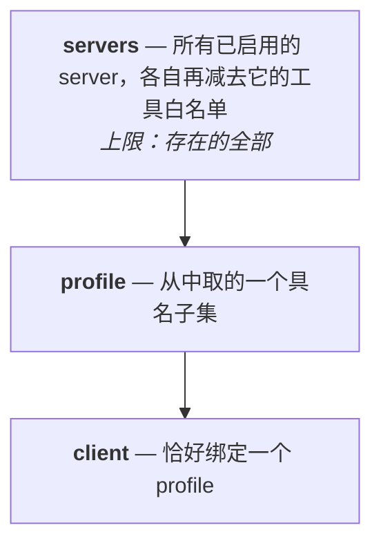
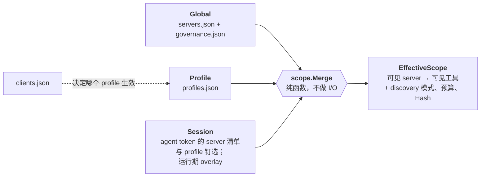
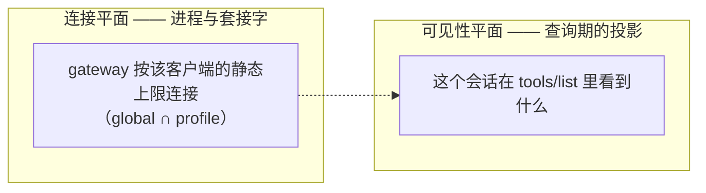

# 访问模型

> **回答** 一个客户端能够到什么，以及这是谁决定的。
> **不在这里** 写下这些规则的命令 → [guide.md](guide.md)；一次调用怎么被执行 → [architecture.md](architecture.md)。
> **由什么保证为真** `internal/scope`（`Merge`、`merge_test.go`、`converge_test.go`）与 `internal/discovery`。

客户端能够到什么，在它连上来之前就由配置文件定死了。调用进行中不做任何决定，也不检查调用带了什么内容。

## 三个名词

| 名词 | 是什么 | 写在哪 |
|---|---|---|
| **Server** | 一个下游 MCP server。登记和启用是两步：`server add` 只写下定义、保持关闭，`server enable` 才投入使用。不指定子集时，它提供自己的全部工具。 | `servers.json` |
| **Profile** | 一个子集：哪些 server、它们的哪些工具、以及这批工具怎么呈现。 | `profiles.json` |
| **Client** | 一个 AI 应用。它只**选择**一个 profile，自己不追加规则。 | `clients.json` |

没有绑定的 client 跟随全局生效的 profile；没有生效的 profile 时，它看到所有已启用的 server。

## 每一层都是相交，谁都不能放宽

规则只有这一条，你真正依赖的是它的推论：

- `server disable` 是无条件的总闸。任何 profile 都拿不回一个被禁用的 server，也拿不回被 server 自己的
  白名单挡住的工具。
- "这个 client 在哪个 profile 上"就是"它能看到什么"的完整答案。两个客户端要不同的暴露面，就给两个 profile。
- 删掉一个 profile 不会让任何人看得更多。绑到一个不存在的名字，解析结果是**空**作用域，并给出警告。

**工具选择器只能是白名单，永远不是黑名单。** 二者的差别在下游新增一个工具的那天显现：白名单会把新工具挡在
外面直到有人把它加进来，黑名单则会直接放行。

## 三种状态，空的那种是关闭

| 存的是 | 含义 |
|---|---|
| 该 server 没有选择器 | 它的全部工具 |
| `["a","b"]` | 恰好这两个 |
| `[]` | 一个都不给；server 本身仍然列出 |

`nil` 和 `[]` 在任何出现选择器的地方都是两个不同的值——JSON 里、Go 里、合并里都是。序列化一律用
`omitzero` 而不是 `omitempty`：把空列表丢掉，会把"全部拦下"变成"全部放行"。

## 各层怎么合成一个答案

字段分两类，合并方式也是两种：

| 字段类别 | 例子 | 规则 |
|---|---|---|
| **安全字段** | server 可见性、工具选择器 | 逐层相交，只会越来越紧 |
| **体验字段** | discovery 模式、结果预算 | 最具体的一层胜出；强制预算改为取最小值 |

动它之前要知道的三条不变量：

1. 相交以**原始**工具名为键。用暴露名做键，会让重命名或去重后缀绕过一次收紧。
2. 悬空的 profile 引用解析为**空集**，绝不是全放行。
3. `clients.json` 不是一层。它只回答"哪个 profile"，不回答别的。

`EffectiveScope` 是内容寻址的：它带一个 `Hash`，重算后哈希不变就不会向客户端推 `tools/list_changed`。

## 可见性与连接是两个平面

收紧一个会话不重建路由、不重启进程，它改的是一个投影。这就是按会话细分代价很低的原因。

**会话 overlay 永不持久化。** 一次能活过重启的运行期放宽是安全事故，所以 `session scope` 的修改写不进配置。

任何持久化的东西都不读会话的 MCP root。解析器的缓存键是 `(clientID, registry generation)`，root 只到达
`internal/downstream` 一个包，由它为需要的 server 派生按 root 区分的实例。

## 暴露面怎么呈现

`discovery` 决定客户端看到多少个工具名，不决定它能调用哪些。没出现在初始列表里的工具，只要在作用域内
仍然可调用；不在作用域内的工具，换哪种模式都调不到。

| 模式 | `tools/list` 返回 | 适合 |
|---|---|---|
| `full` | 每个可见工具一条 | 小暴露面，或客户端自己会过滤 |
| `grouped` | 每个 server 一条聚合入口，外加一个调用入口 | 中等规模 |
| `lazy` | 五个元工具——`status`、`search_tools`、`describe_tool`、`call_tool`、`fetch_result`——加上被钉住的工具 | 大暴露面。**没有任何一层设置模式时的默认值** |

`lazy` 之所以是默认：加到第四个 server 时没人会回头改这个设置，而 `full` 花掉的上下文与你用网关的程度成正比。

搜索结果带的是紧凑签名而不是完整 schema，细节由 agent 再调 `describe_tool` 取。任何不能展示的工具 id
——不存在、不在作用域、或被白名单挡下——返回同一段文案，否则 `describe_tool` 就成了枚举存在性的探针。

lazy 模式可以把 `call_tool` 拆成 `call_tool_read` / `call_tool_write` / `call_tool_destructive`，让 IDE
自己的白名单分别放行。等级来自下游的 annotations，完全没有 annotations 视为 destructive。**这个开关目前
还没有被读取**：stdio 网关从不根据注册表设置 `discovery.Options.IntentVariants`，所以在 governance 里
打开 `intentVariants` 今天不产生任何效果。

## 给 HTTP 面分级的东西不是权限

有三种机制在作用域模型之外，回答的是别的问题：

| 机制 | 回答的问题 | 在哪 |
|---|---|---|
| Agent token 等级 | 这个凭据可以发起写操作或破坏性操作吗？ | `internal/pipeline` 第二道闸 |
| 速率限制 | 是不是一个失控的循环在烧预算？ | `internal/ratelimit` |
| netguard / spawnguard | 这个目的地、这个进程是不是无论谁问都拒绝？ | `internal/guard/*` |

等级闸位于作用域闸之后，同属一条固定的闸链（见 [architecture.md](architecture.md) 的"一次调用穿过什么"）。
两道闸都只依据配置做判断，都向关闭方向失败。

## 这个模型没有的东西

- **没有审批队列。** 没有任何东西会暂停一次调用去问人。
- **没有运行期扩权。** 会话连上来之后，没有任何东西能放宽它能到达的范围。
- **不检查内容。** 没有参数校验器、没有提示注入扫描、没有结果脱敏。调用方发什么，下游就收到什么；下游
  答什么，调用方就读到什么。

这三样都曾经存在，后来是被删掉而不是留着半接线的（见
[decisions/](../decisions)）。一个什么都不决定的治理界面，看上去仍然像一层保护。
