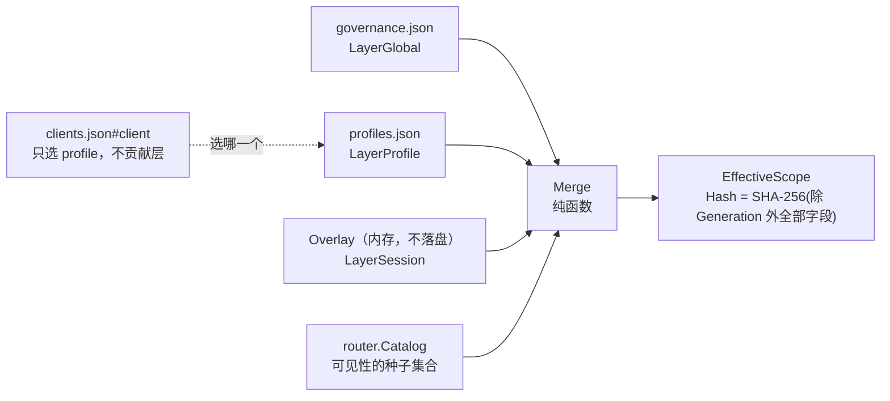
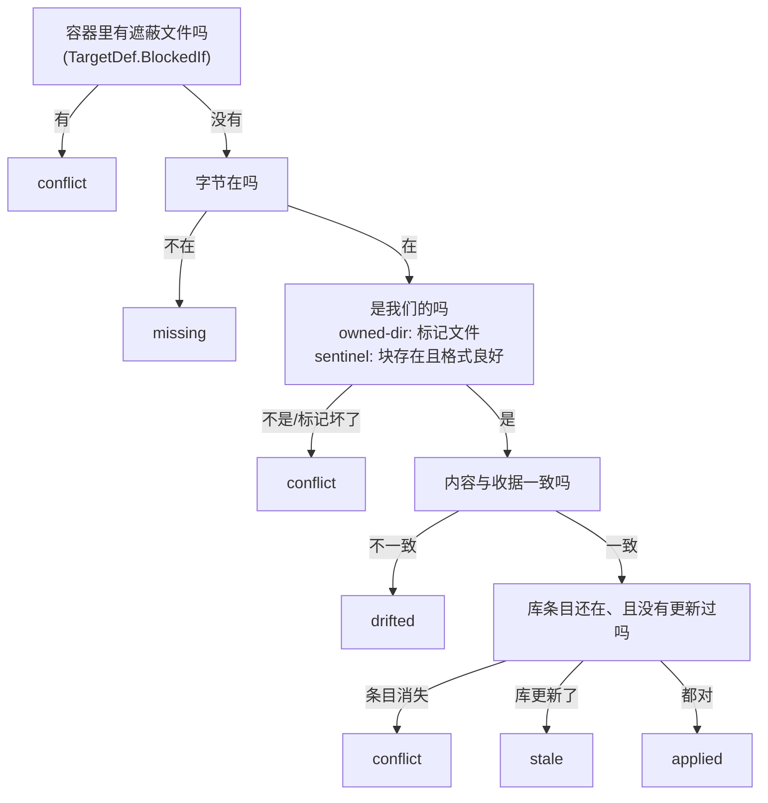

# 配置与作用域层

这一层回答两个问题：**这个 session 现在能看见什么**，以及**这些配置、凭据和文件从哪来、由谁负责改**。
七个包分工如下。

`internal/scope` 是这一层的核心计算：它把 registry 里持久化的两层配置（global、profile）加上 session 的内存 overlay，
折叠成一份内容寻址的 `EffectiveScope`。`internal/session` 提供 overlay 的所有者——session 身份、
生命周期、以及「只能收紧」的变更校验；overlay 只活在内存里，daemon 一重启就没了，这是刻意的。
`internal/event` 是这两者之间（以及整个 daemon 内部）的通知通道：session 改了 overlay 就发一条事件，
scope 的缓存据此失效。event 还提供两个合并器，把变更风暴压成一条通知。

另外四个包各自守着一类外部状态。`internal/secrets` 是凭据金库，四级解析链把环境变量、加密文件和
OS keyring 串起来，`internal/secrets/secureenv` 则负责给下游进程构造一个「白名单准入」的干净环境。
`internal/clients` 适配 12 个 AI 客户端的配置文件格式，负责把 agenthub 网关写进去、再安全地摘出来。
`internal/skills` 管理技能库与它在客户端目录里的物化副本。

这四个包之间没有互相依赖，它们只共享同一套纪律：**读不到就报错、改不动就拒绝、看不懂就别写**。
每个包的「失败方向」段落是本文最该细读的部分——它们是代码里真正的硬约束，改动时违反其中任何一条
都会把 fail-closed 变成 fail-open。

---

## internal/scope

### 一句话职责

把三层配置（Global、Profile、Session）折叠成一份确定性的、内容寻址的
`EffectiveScope`，回答「这个 session 现在能看见哪些 server、哪些 tool，要不要人工审批，结果预算多大」。

### 关键类型与入口

`Merge` 是一个**纯函数**：同样的输入永远产出同样的输出，从不修改也从不别名输入。stdio 网关与
daemon 调用的是同一份实现，这是「两种模式行为一致」这条设计目标在代码层面的落点。
`MergeWithDiagnostics` 把预先收集好的 `[]Diagnostic` 在**哈希之前**折进结果值里，因此诊断信息也
参与内容寻址。

`CachedResolver` 的缓存键是三元组 `(clientID, registryGeneration, overlayVersion)`，通过
`Invalidate(Event)` 事件驱动地失效，从不轮询。

`Sources.Extra` 是 overlay 之后追加的额外层，供**没有 registry 条目的凭据**参与同一次交集
（daemon 的 HTTP 数据面把 agent token 的 server allowlist 与 profile pin 折在这里；profile pin
用 `PinnedProfileLayer`，名字解析不到就返回 block-all 层 + `ok=false`，与 `FromRegistry` 的悬垂
处理同向）。它们是普通层，`Merge` 一视同仁——安全字段取交集、deny 取并集、审批开关取或，
所以 Extra **不存在能放宽可见性的形状**。约束：返回值必须是「session id + registry generation」
的纯函数，因为它不进缓存键。

**client 只选 profile，它自己不是一层。** `FromRegistry` 读 `clients.json` 只为了回答一件事：
这个 client 跟哪个 profile（显式 `ProfileRef` > `profile` 简写 > `followActive`）。
`registry.ClientEntry` 现在只剩 `{Profile, ProfileRef}` 两个字段。它曾经还带自己的
servers / tools / discovery / approval / resultBudget，叠在 profile 之上再收一道；那样一来
「这个 client 绑了哪个 profile」就只是「这个 client 能看见什么」的一半答案，操作者必须翻两处
再手算交集——而这恰恰是这套模型想要回答的那个问题。收窄现在只有一个家（profile），
需要另一张面的 client 就绑到另一个 profile 上。

**`discovery` 住在 profile 上。** 它描述的是**那一份工具集**该怎么呈现：收到两台 server 的
profile 与握着四十台的 profile 想要的呈现方式本来就不同，把 client 绑到一个 profile 上就该同时
定下「看得见什么」和「怎么看见」，而不是留下第二处配置。命令是
`agenthub profile discovery <profile> <lazy|grouped|full|->`（`-` 清除覆盖、回到 governance 的
全局默认）。未知模式在 `confops.SetProfileDiscovery` 里**当场拒绝**，而不是留给解析器静默退回
一个操作者没选过的默认值。

**per-project 层已退役。** 它曾按客户端上报的 MCP root 做最长前缀匹配，可以换 profile、可以再收窄，
`registry.ProjectBinding` / `ClientEntry.Projects` / `scope.LayerProject` / `registry.BindingInherit`
连同它一起删掉了。退役的理由是它给同一个问题造了第二个答案，而这个答案还取决于客户端到底实不实现
roots 能力——不报 root 的客户端静默落回更宽的那一层。

退役本身有一个**必须说出口**的失败方向：registry 的 `Doc[T]` 信封会把未知字段原样透传，所以
`clients.json` 里遗留的 `projects` 块留在磁盘上，看起来跟它还生效时一模一样，光读文件看不出它已经
不再被应用。而它写下来的目的是**收窄**一个 checkout，失效的方向因此是**放宽**。`agenthub doctor`
的 `scope:projects` 为此从 OK 改成 **WARN**（经 `Doc[T].HasUnknownField("projects")` 判定），
并给出「改绑一个更窄的 profile，然后把 `projects` 块删掉」的建议——doctor 报告、操作者决定，
它不替操作者删这个块。

`NormalizePath` 仍在用，但用途已经换了平面：它规范的是**派生实例键**
（`internal/downstream` / `internal/session` 的 `DeriveRoot`）与 `session show` 里显示的 root，
不再参与任何可见性判定。`PathIsWithin`——project 层用来做最长前缀匹配的边界比较函数——**随那一层
一起删除**：一个导出、有测试、却没有任何调用方的函数看起来仍像是受支持的入口，而下一个调用它的人
会继承一套为已经不存在的场景选定的失败方向。

**为什么 root 退出了缓存键。** 它曾经在里面，因为 project 层按它匹配；那一层退役后没有任何持久层
再读 root，留着它只会把同一个 client 的缓存按它恰好报出的每个目录切成一份份——为一个改变不了答案
的值多付缓存 miss。`EvRootChanged` 事件**保留**：清掉一个 session 的条目很便宜，而把「哪些通知值得
在意」交给调用方判断，正是将来某个东西真的依赖 root 时陈旧作用域被端上桌的方式。

### 不变量与失败方向

**合并语义分两类，改动时不可混淆。** 安全字段单调收紧：server 可见性按层取**交集**（种子是 catalog 的
server 集合），tool 的 `Allow` 按层取交集、`Deny` 按层取并集，审批开关按**布尔或**折叠。体验字段就近生效：
`Discovery` 由最具体的层胜出（同一 `LayerKind` 时后出现的层胜出），`ResultBudget` 按 key 就近取值。
唯一的例外是 `Budget.Forced`：被标记为 forced 的预算按**最小值**封顶，它只能把就近值压低，永远不能抬高。

**`LayerKind` 的数值顺序就是特异性顺序，不能重排。** `Merge` 不要求传入的 layers 已排序，特异性完全
来自 `LayerKind` 的大小比较；调换枚举值会静默改变「谁胜出」。

**三态指针 nil 的含义是「不干预」，不是 false。** `orInto` 只让 `true` 生效，一个 `false` 指针是惰性的，
永远不能把别的层设成的 `true` 关掉。这是 fail-closed 方向：任何一层要求审批就必须审批。

**`DenyDestructive` 只能由 governance.json 设置。** 代码用两个机制保证这一点，而不是靠校验：
`Overlay`（session 层的输入类型）**根本没有这个字段**，所以任何 overlay 都不可能携带它；`FromRegistry`
只在 `LayerGlobal` 上填充它，而 `registry.ApprovalPolicy`（非全局层的落盘类型）也没有建模这个字段。
换句话说这条约束是「不可表达」，而不是「被拒绝」。

**tool 选择器的键永远是原始 tool 名，绝不是暴露名。** `ToolSelector` 是 `registry.ToolSelector` 的类型
别名，落盘语义只有一处真源：选择器缺席等于不干预，`Allow == nil` 等于全量，`Allow == []` 等于全封，
`Allow == [...]` 等于收窄到子集。`cloneStrings` 刻意保留 nil 与空切片的区别——把空切片退化成 nil，
就是把「全封」静默翻转成「全放」。

**悬垂 profile 引用 fail-closed 到空集，并且绝不静默。** 引用了一个不存在的 profile（或者 named 绑定
却没有名字），`FromRegistry` 追加一个 `Servers: []` 的 profile 层（即全封），同时产出一条 `Diagnostic`。
它绝不退化成 activeProfile——那是把删除 profile 变成一次静默放宽。诊断信息是 `EffectiveScope` 的一部分，
`session show` 与 `doctor` 会把它打印出来。

**`NormalizePath` 绝不 canonicalize，绝不碰磁盘。** 它只做四件纯字符串的事：反斜杠换成 `/`、折叠重复
斜杠（UNC 的前导 `//` 保留）、去掉尾部斜杠（裸 `/` 保留）、Windows 形态的路径整体小写。客户端上报的
路径在本机可能根本不存在，做符号链接解析或存在性探测既会失败也会引入 TOCTOU。这个函数必须幂等，
因为它会被反复施加到已经规范化过的输出上。

**`EffectiveScope.Hash` 覆盖除 `Generation` 与 `Hash` 自身以外的全部字段。** `Generation` 是「这份值
从哪个 registry 状态算出来的」，不参与内容身份，由 `Resolver` 在 merge 之后盖章。哈希用长度前缀的
规范编码、map 键按序访问，因此跨进程、跨 Go 版本稳定，并且有 golden test 钉死——确定性是契约。
`Changed(prev, next)` 只比较 `Hash`：只有内容变了才值得给 session 推 `tools/list_changed`，否则
一次 registry 重建就会放大成一场通知风暴。

**缓存失效宁可过度，不可不足。** `EvOverlayChanged` 与 `EvRootChanged` 只清对应 session，
`EvRegistryChanged` 与 `EvCatalogChanged` 清空全部，**未知的事件类型也清空全部**。catalog 不在缓存键
三元组里，`EvCatalogChanged` 是唯一能让下游工具集变化被看见的通道，丢了它就会一直发陈旧作用域。
过度失效的代价是一次重算，失效不足的代价是发出错误的可见性。

**没有 registry snapshot 时拒绝解析。** `Resolve` 在 `src.Registry()` 返回 nil 时直接报错，而不是
凭空造一个「空但合法」的作用域。同理，`Catalog` 函数为 nil 或返回空目录时解析出零个可见 server，
也是关闭方向。

### followActive 是从快照里读的，不是从状态文件

`activeProfileName` 读 `snap.Governance.V.ActiveProfile`。它**曾经硬编码返回空字符串**，
而 `agenthub profile use` 把名字写进一个状态文件——标记设得上、列得出来，却没有任何会话会应用它。
把这个值挪进 registry 文档同时修好了两件事：followActive 真的会 follow，
且 `FromRegistry` 保持纯函数——值随快照到达，而不是在解析途中去读一次文件。

没有设置时返回 `""`，followActive 于是不做 profile 收窄，等价于 `agenthub profile use -`（清除）。
解析不到的名字由调用方按**悬垂引用**处理（fail-closed，block-all）——把它走命名绑定的同一条路，
正是为了拿到这个性质。

---

## internal/session

### 一句话职责

daemon 侧的 session 注册表：铸造 session 身份、持有内存 overlay、在 overlay 变更时执行「只紧不松」
校验，并把变更推送给 stdio 网关。

### 不变量与失败方向

**身份形态有两套，各自服务不同的读者。** 面向人的是短 ID `"client:seq"`（例如 `claude-code:17`），
seq 是 per-client 单调递增、在 daemon 生命周期内**永不复用**的。面向协议的是 HTTP session 的 128 位
随机令牌（`Mcp-Session-Id`）。stdio session 没有令牌（全零），`TokenHex()` 对它返回空串，`MatchToken`
对它一律返回 false。

**令牌比较必须是常数时间，且任何异常输入一律 deny。** `MatchToken` 在非 HTTP session、hex 解码失败、
长度不符三种情况下直接返回 false，只有走到最后才用 `subtle.ConstantTimeCompare`。`FindByToken`
逐个候选做常数时间比较，未知或畸形令牌返回 `(nil, false)`。

**熵不足就不许存在。** `OpenHTTP` 在 `io.ReadFull` 读令牌失败时直接返回错误，绝不铸造一个令牌不满的
session。

**重新注册的网关一定拿到新身份。** seq 单调且不复用，所以一个掉线重连的网关不会静默复用旧 ID。
旧的 overlay 权威随旧 session 一起死了，引用必须断裂，而不是悄悄重新绑定到一个空白 overlay 上。

**overlay 绝不落盘。** 这个包里没有任何地方序列化 overlay。daemon 重启就丢失它们是设计意图——
一次「复活的运行期放宽」是安全事故，而不是可用性改进。`Close` 时显式把 overlay 置 nil。

**「只紧不松」校验：一切歧义都判定为放宽并拒绝。** `loosenings(prev, next)` 逐字段比较安全字段：
`Servers` 从非 nil 变 nil 是放宽，新增任何 server 是放宽；`Tools` 里 prev 约束过的 server，
选择器被移除、`Allow` 收窄被撤销、`Allow` 新增条目、`Deny` 移除条目都是放宽；已经设成 `true` 的
审批开关被取消是放宽；`Forced` 预算被移除或抬高是放宽。体验字段（`Discovery`、非 forced 的
`ResultBudget`）自由变动。`prev == nil` 是「无 overlay」基线，此时任何新建 overlay 都算收窄。
过严的代价是调用方多要一次人工授权，过松的代价是把一次放宽交给了威胁模型的主体（agent 自己）。

需要注意这个校验守的是**哪一个方向**。merge 本身已经保证 overlay 永远不能突破静态三层的水位线
（session 层只做交集）；`loosenings` 守的是另一头：agent 撤销它自己（或操作者）刚做的运行期收窄。

**拒绝时拒绝整次变更，不做部分应用。** 一旦发现放宽项，`Mutate` 返回 `ErrLoosening` 并列出全部违规项，
`s.overlay` 完全不动。部分应用会提交一个谁也没要求过的状态。

**版本号由 `Mutate` 在 `fn` 执行之后赋值**（`next.Version = prev.Version + 1`）。 变更函数无法伪造或回退版本，因此解析器的缓存键**当且仅当**
真的提交了一次变更才会移动。

**stdio 走「先推后提交」，HTTP 直接换。** 权威在 daemon，执行在网关。stdio session 先
`Link.PushOverlay(ctx, next)`，网关应用并 ack 之后 daemon 才 `s.overlay.Store(next)`；推送失败则**什么
都不提交**，daemon 与网关因此不可能分叉。

**overlay 是 copy-on-write 的不可变快照。** `Session.Overlay()` 返回的指针**调用方绝不可修改**（scope
解析器也一样）；`Mutate` 在 per-session 互斥锁下 clone 出私有副本交给 `fn`，然后整体换上去。
per-session 锁让并发 `Mutate` 完全串行化，不会丢更新。

**只有 HTTP session 会被 TTL 回收。** stdio session 的生命周期就是网关进程的生命周期，由链路断开时
daemon 调 `Close` 清理，reaper 显式跳过它们。默认 TTL 24 小时、扫描间隔 5 分钟。

**root 是可变属性，不是身份的一部分。** `SetRoots` 随 `roots/list_changed` 更新它，但它既不参与
session ID，也（自 per-project 层退役起）不再参与 scope 解析的缓存键——它只喂派生实例键。

**派生键与 scope 分属两个平面。** `derive.go` 里不碰任何 scope 类型，`DeriveKey` 也不进入任何 scope
哈希：收窄一个 session 不该重启进程，切换到另一个实例也不该改变任何一个可见的 tool 名。
`DeriveRoot` 在 session 没有 root 时**刻意返回空键**（即用基础实例），而不是退化成用 session ID 造键——
后者会给一个无 root 的 session 一份操作者本意按项目隔离的私有状态，还会给每个无 root 的 session 各起
一个进程。多 root 的 session 取**第一个**上报的 root 而不是集合摘要，因为这个键就是操作者管理凭据时
用的 vault scope 名，必须可读。

**级联关闭只带走 session 键的派生实例。** root 键的实例按构造就是同 root 的所有 session 共享的，
在这里拆掉它会掐断邻居的连接；那类实例交给连接池的 idle TTL 回收。最坏情况是某个实例多活 30 分钟，
而不是少活一次调用。

---

## internal/event

### 一句话职责

daemon 的进程内事件总线，外加两个事件合并器：50ms 窗口的**聚合器**用于变更风暴，750ms 的
**沉降去抖器**用于扫描式的事件流。

两种合并器模式共用同一份实现：`NewCoalescer(publish, window)` 的窗口锚定在某个 key 的
**第一次** `Add`（节流，延迟有界）；`NewSettler(publish, window)` 的每次 `Add` 都**重置**窗口
（去抖，一整段生命周期塌成一条终态事件）。

### 不变量与失败方向

**`Publish` 永不阻塞——这是整个包存在的理由。** 订阅缓冲满了就丢弃并计数，绝不拖住发布者。因此
消费者必须把总线当作**变更通知通道**，而不是**变更日志**：`Dropped()` 非零（或者断线重连）时，
消费者要去重读权威状态。失去一条通知是可恢复的，阻塞发布者不是。

**取消订阅与关闭 channel 的顺序是不变量。** `Close` 先在写锁下把订阅从总线上摘掉，**然后**才关闭
channel；而 `Publish` 只在读锁下发送。这个顺序保证没有任何一次 send 能和 close 竞争。`Close` 幂等。

**payload 对所有订阅者都是同一个值，必须当作不可变。** 同一个 `Event` 值扇出给每个匹配的订阅，
任何一方修改它都会影响其他人。

**合并器的 payload 是惰性构建的，且只构建一次。** 只有**最后**一次传给 `Add` 的 builder 会被调用，
在触发时刻调用一次。K 次突发只付一次昂贵 payload 的构建成本。builder 在定时器 goroutine（或 `Flush`
的调用方）上运行，运行时**不持有** Merger 的任何锁，所以它必须按引用捕获状态或者是廉价闭包。

**沉降模式的重置竞争用 `gen` 计数解决。** 一个已经开始触发的定时器是停不掉的，所以每次重新武装
的定时器都捕获当时的 `gen`，`fire` 会忽略 `gen` 已经过期的回调。

**`Close` 丢弃待发事件，`Flush` 触发它们。** 关闭时丢一条合并通知是可接受的失败方向——总线契约
本来就要求消费者在丢失时重读状态。`Close` 之后 `Add` 是空操作。

**这个包只依赖标准库。** 它位于所有业务包之下，必须保持零依赖。

`internal/ctlapi/sse.go` 是这两个合并器的实际消费者：server 列表变更走聚合器，扫描类 topic 走沉降器。

---

## internal/secrets

### 一句话职责

agenthub 的凭据金库：一条四级解析链，串起环境变量、XChaCha20-Poly1305 加密文件与 OS keyring，
所有条目按复合键 `(ServerID, Scope) + Key` 寻址。

### 关键类型与入口

`Ref{ServerID, Scope, Key}` 是一个凭据的地址，`Scope` 为空时取 `DefaultScope`（`"_global"`）。
`Ref.StorageKey()` 产出**冻结的**存储编码 `agenthub/v1/<serverID>/<scope>/<key>`，它同时被用作 keyring
的 account 名与 secrets.enc 的 map 键；`ParseStorageKey` 是它的逆。

`Store` 接口是持久化面（`Get` / `Set` / `Delete`），`Resolver` 是注入给 `internal/downstream` 的窄接口
（只解析一个 ref，别的什么都不做）。`Chain` 是唯一实现，`NewChain(ChainConfig)` 构造，
`Chain.Resolver()` 产出窄接口，`Chain.List(ctx)` 枚举全部已存条目。

`wiring.go` 里的 `HTTPAuthRef` / `OAuthStateRef` / `UserRef` 是三个 well-known ref 的构造器。它们存在
的理由很实际：复合键的形状只在一个地方拼写，手写 `Ref` 字面量的调用方离「忘了 scope 分量、静默读到
另一条目」只差一次重构。

`Migrate(ctx, from, to, refs)` 在两个 store 之间搬运凭据。`Chain.Backend(ctx, kind)`
把两个**持久后端**（`keyring` / `enc-file`）单独取出来当 `Store` 用，就是为了喂给它——
见下面「为什么必须是后端级 store」。用户入口是 `agenthub secret migrate --from X --to Y`。

**为什么是显式命令而不是自动迁移。** 后端可用性会在操作者脚下变化（装了桌面环境后 keyring 探测
开始通过、设了 `AGENTHUB_SECRET_KEY` 后 enc 文件被激活），变化之后旧凭据仍留在旧后端。
自动搬运等于在操作者没看着的时候动他们没要求动的凭据。而**不搬也不会坏**——四级链照样从旧后端
解析得到，直到那个后端哪天不可用，凭据看起来就凭空消失了。这个「惰性方向」正是这条命令的价值。

环境变量层**没有** `Store`，也不在 `BackendKinds()` 里：它是每进程的**输入**而不是存储，
既没有东西可写也没有东西可删，所以凭据不可能迁进去或迁出来。

### 不变量与失败方向

**四级链，首命中即返回，空值与纯空白值在每一级都算「未设置」。**

| 级 | 来源 | 激活条件 |
|---|---|---|
| 1 | 环境变量 `AGENTHUB_SECRET_<KEY>` | 总是 |
| 2 | 裸环境变量 `<KEY>` | 显式 opt-in `AGENTHUB_ALLOW_BARE_SECRET_ENV=1` |
| 3 | `secrets.enc`（XChaCha20-Poly1305） | `AGENTHUB_SECRET_KEY` 已设置，或 dev 回退双文件已存在 |
| 4 | OS keyring（zalando/go-keyring） | 可用性探测通过 |

**级 2 默认关闭是 fail-closed 的：**任意环境变量都不该被当成凭据，除非用户明确要求。即便打开了，
`envValue` 也**绝不**通过裸路径解析任何 `AGENTHUB_` 开头的变量——opt-in 不能被用来读出我们自己的控制变量。

**保留冲突：名为 `key` 的条目会映射到 `AGENTHUB_SECRET_KEY`，而那是加密文件的密钥材料变量。**
`envValue` 显式跳过这个名字，密钥材料绝不能通过凭据链被读出来。

**读不到与读坏了必须区分。** 加密文件解不开（`ErrDecrypt`）、keyring 报了 not-found 以外的错误，
都作为**错误**上抛，绝不当成 miss 继续往下走。一个写错的 `AGENTHUB_SECRET_KEY` 或者坏掉的钥匙串必须
可见，而不是静默退化成「这个凭据没设置」。**唯一的例外**是可用性探测失败的 keyring：那台机器就是
没有 keyring 这一级，直接跳过且不报错（写入会按 A.6 #5 落到加密文件）。

**keyring 加固三件事，缺一不可。**
其一，可用性探测**只做读、绝不做写**：一次 `Set` 探测会触发 macOS 那个破坏性的确认弹窗。探测读的是
一个众所周知不存在的 account，成功和 `ErrKeyringNotFound` 都证明后端活着，超时或其他错误判定为不可用。
其二，探测结论**缓存整个进程生命周期**：不可用的 keyring 会把链翻到加密文件回退，不能每次调用都重新弹窗。
其三，**每次操作都有硬超时**（默认 3 秒）：超时后 worker goroutine 被**刻意抛弃**——被卡住的钥匙串
弹窗是取消不掉的，抛弃它是唯一能解开调用方的办法；结果走带缓冲的 channel，所以被抛弃的 worker
永远不会和调用方的返回值打架。

**OS keyring 无法枚举，所以有一份自管理的键注册表。** `keyring-keys.json` 只镜像**键名**、绝不存值。
不变量是：注册表**只与一次成功的 keyring 变更同步修改**，因此它既不会声称持有 keyring 已经丢掉的键，
也不会漏掉 keyring 还持着的键。

**dev 模式回退是一次明确的裁决（A.6 #5），不是偷懒。** 开发期每次 `go build` 都产出一个新的未签名
二进制，macOS 钥匙串 ACL 会每次重新弹窗。因此 keyring 探测失败、或者显式设置 `AGENTHUB_DEV_SECRETS=1`
时，写入自动落到 `secrets.enc`，密钥是自动生成并持久化在**旁边**的 `secrets.enc.key`（0600）。
文档里把话说透了：把密钥放在密文旁边是混淆，不是静态加密，能同时读到两个文件的攻击者就拿到了明文。
这只对 dev 回退可接受；生产路径走 `AGENTHUB_SECRET_KEY` 或 OS keyring。

`encForRead` 的 dev 回退判定要求 `secrets.enc` 与 `secrets.enc.key` **同时存在**——dev 后端写过的数据
必须在 keyring 探测恢复正常之后仍然读得到。

**加密文件的落盘纪律。** 整个 map 用一个随机 nonce 密封；AAD 是 `"agenthub/secrets/v1"`，把密文绑定
到格式版本上，v2 的信封不可能被当作 v1 重放；写入走原子阶梯（同目录临时文件、chmod 0600、写、fsync、
rename、父目录 fsync），绝不留下写了一半的目标文件。缺失的文件是空 map 而不是错误。

**`storageKeyPrefix = "agenthub/v1"` 是冻结的、golden-tested 的。** 改动它会孤儿化每一条已存凭据。
分量内只对 `%` 与 `/` 做百分号转义（因为只有这两个字节会破坏分隔结构），其余原样透传，好让
`secret ls` 的输出保持可读。`ParseStorageKey` 对未知前缀和畸形转义报错，而不是从枚举结果里静默丢掉
一个我们解不开的键。

**`Migrate` 的顺序是「读旧、写新、回读校验、删旧」，任何一步失败都保留两份。** 新 store 回读出的值
必须与原值完全一致才会删除旧条目；重复的凭据是可恢复的，丢掉的凭据不是。文档明确要求传入**后端级**的
store：`*Chain` 的 `Get` 会先查环境变量，那样一个环境变量就能糊弄过回读校验，而新后端其实什么都没存——
校验通过之后旧条目就被删了，正是回读这一步要防的那个结局。`Chain.Backend` 产出的就是这种 store，
`TestBackendIgnoresEnvironmentLevels` 把这条钉死。

**`Chain.Backend` 的可用性是「急切」判定的。** 后端不可用（没有 OS keyring、或没有密钥打开
`secrets.enc`）当场返回 `ErrBackendUnavailable`，而不是等第一次使用才失败：迁移到一半才发现
目标端写不了，正是「迁移了一半的 vault」的成因。所以 CLI 在搬动任何东西之前先把两端都解析出来。

**并发。** `Chain` 用一个进程内互斥锁串行化自己的加密文件读改写与注册表更新；跨进程的写协调是调用方的
事（OAuth 刷新用的 vault sibling lock 在 `oauthflow` 里）。

**测试绝不碰真实钥匙串。** keyring 藏在 `Backend` 接口后面，测试到处注入 fake；真后端的冒烟测试只在
`AGENTHUB_TEST_REAL_KEYRING=1` 下运行。

---

## internal/secrets/secureenv

### 一句话职责

为将要 spawn 的下游进程构造一个加固过的环境：白名单准入（默认拒绝）、登录 shell 的 PATH 捕获、
代理变量的 userinfo 脱敏。

### 关键类型与入口

只有纯函数。`Filter(environ []string, cfg Config) []string` 按白名单过滤 `KEY=value` 条目并保持顺序。
`Config` 允许按名字（`Allow`）和前缀（`AllowPrefixes`）扩充白名单，以及用 `ForwardProxy` 打开代理变量的
转发。`RedactProxyValue(name, val) (string, bool)` 单独可用。`CaptureLoginPATH(ctx, shell)` 与
`LoginPATH()` 负责 PATH 捕获。

### 不变量与失败方向

**默认拒绝。** 没有被显式允许的变量一律丢弃，不存在「除了黑名单都放行」的模式。

**`AGENTHUB_` 前缀是硬拒绝，`Config` 覆盖不了它。** 我们自己的控制变量绝不能泄漏进下游。这条与
`internal/downstream` 里同样的剥离叠加，两边都拒绝 `AGENTHUB_*`，所以组合是幂等的。

**代理变量默认不转发。** 代理端点经常内嵌凭据，那不是下游该知道的事，除非被要求。打开
`ForwardProxy` 之后，值要过 `RedactProxyValue`：`NO_PROXY` 是纯主机列表，原样透传；不含 `@` 的值
原样透传；含 `@` 但**无法**被确定地识别并剥离为 URL userinfo 的值（例如无 scheme 的
`user:pass@host` 会被解析成 opaque 部分）**直接丢弃**——绝不转发一个我们无法证明不含凭据的值。

**`LoginPATH` 是这一层里唯一刻意 fail-open 的地方。** launchd/systemd 拉起的进程继承的是被截断的 PATH，
登录 shell 的 PATH 才是交互式用户真正拥有的那份（这一点坑过 mcpproxy 三次）。捕获走
`shell -l -c 'echo $PATH'`，取**最后**一行非空输出（登录 profile 可能在 echo 之前打印问候语），
有 3 秒硬超时，并设 `cmd.WaitDelay = 1s` 强制关闭管道——否则登录 shell 的子进程会继承 stdout 管道，
上下文杀掉 shell 之后 `Output` 仍会阻塞到所有后代退出。任何失败都回退到当前进程的 `PATH`：一个坏掉的
登录 shell 不该阻塞 spawn，最坏情况是保留我们本来就有的那份截断 PATH，绝不会更少。捕获结果用
`sync.Once` 缓存，每进程只做一次。

### 当前接入状态

**尚未接入。** 仓库里除本包及其测试外没有任何 `secureenv` 的引用；
`internal/downstream/spec.go` 仍自己做 `AGENTHUB_*` 剥离（`envPrefix`）。

---

## internal/clients

### 一句话职责

适配 AI 客户端的配置文件格式：探测它们装在哪、把 agenthub 网关条目写进去、安全地摘出来，
以及把它们已有的 MCP server 定义导入 registry。

### 关键类型与入口

`Format` 接口是一个客户端适配器的全部行为（`Locations` / `DefaultPath` / `PathFor` / `Connect` /
`Disconnect` / `ManualSnippet`）。它有且只有两个实现：`jsonFormat` 覆盖两种 JSON 形态，
`probeFormat` 覆盖不重写的形态。

`Table` 是绑定到一套环境（GOOS、HOME、备份目录）的适配表，`New(Options)` / `Default()` 构造，
`Lookup(id)` / `IDs()` / `Formats()` 是查询入口。表本身是 `table.go` 里的 `specs` 切片。

三个动作方法直接挂在 `Table` 上：`Detect(ctx, baseDir)` 枚举本机存在的配置文件，
`Inspect(clientID, baseDir)` 读一个客户端的配置并列出它的 server 条目，
`Import(clientID, baseDir, existing)` 把这些条目转成 `registry.ServerEntry` 提案。

### 形态驱动的适配表

行为由配置的**形态**驱动，而不是每个产品一个手写分支。五种形态覆盖整个生态：

| 形态 | 含义 | 行数 | 客户端 |
|---|---|---|---|
| `ShapeServerMap` | 顶层 `{"mcpServers": {...}}` 的 JSON 文件 | 7 | claude-code、claude-desktop、cursor、windsurf、cline、roo-code、gemini-cli |
| `ShapeNested` | 同样的 name→entry map，但藏在更大文档的某条键路径下 | 2 | vscode（`servers` / `mcp.servers`）、zed（`context_servers`） |
| `ShapeTOML` | TOML 文档，**只探测不重写** | 1 | codex |
| `ShapeYAML` | YAML 文档，**只探测不重写** | 1 | continue |
| `ShapeRemote` | 本机根本没有配置文件 | 1 | open-webui |

一共 12 行。加一个客户端是 `table.go` 里加一行，不是加一条代码路径。`Shape.Writable()` 只对两种 JSON
形态返回 true。

每行的 `locs` 按 **project 优先**排列，但那是**读优先级**（`Import` 遇到同名条目时 project 级的定义胜出），
**不是写偏好**——默认写入目标由 placement 决定，见下。`locSpec.home` 是一张 GOOS 到路径的映射，
某个 GOOS 缺席就让该位置在那个平台上不可用——Windows 就是靠这个机制推迟到 M2 的，没有用 build tag。

### 不变量与失败方向

**默认写入用户级（`DefaultPlacement = User`）。** 谁都没指定 path 或 placement 时，`DefaultPath` 给出
的是 `$HOME` 下的那个文件。理由有两条：写进去的条目带着**本机 agenthub 二进制的绝对路径**，而
project 级文件（`.mcp.json`、`.cursor/mcp.json`）本来就是要提交共享的——默认写 project 等于把一条只在
自己机器上成立的路径提交给队友；而且 agenthub 本身就是「本机所有客户端共用的一个枢纽」，不是每个仓库
重新接一次的东西。**「这个客户端能看见哪些 server」由 `internal/scope` 决定，从来不由条目写在哪个文件
里决定。** 行里在本平台没有 user 位置（或 `$HOME` 解析不出来）时回落到第一个位置——Windows 的每一行
都缺 user 位置，回落让它仍然可写。

**显式指定的 placement 要么精确兑现，要么拒绝。** `PathFor` 对没有该位置的客户端返回 `""`，调用方
（CLI 的 `--placement`、控制面的 `placement` 字段）据此报错，**绝不**改写到另一个位置去：把网关条目
写进一个谁都没点名的文件，比一个当场说清楚的拒绝糟得多。`--path` 与 `--placement` 同时给出是 usage
错误，而不是静默定个优先级。

**`DisconnectDefault` 是默认写入目标搬家后的兜底。** 没指定目标的 disconnect 先看默认目标，**只有**
那里没有 agenthub 拥有的条目时，才去看同一个客户端的另一个位置——因为默认目标改到用户级之前写下的
条目还躺在 `.mcp.json` 里，而「明明条目还在，却报 not connected」是这里最不能接受的答案。它不是搜索：
只走这一个客户端自己的位置，且只在默认目标扑空之后。兜底位置若因别的原因失败（解析不了、超大、被拒），
**返回那个错误**而不是跳过——agenthub 拒绝碰的文件不能被报成「里面没东西」。指定了 path 或 placement
的调用不走这条路：明确的目标是指令，不是起点。

**macOS TCC：`Detect` 只 stat，绝不 read。** 读另一个应用的数据目录会触发系统隐私弹窗，一次批量扫描
弹十几次比不扫描更糟。内容读取只发生在 `Inspect` 与 `Import`，那是单客户端的用户动作，弹窗在那里是
预期之内且可解释的。

**「没有这个文件」与「不许你看这个文件」绝不合并。** 被拒的访问归类为 `*PermissionError`，带着可执行的
补救文案，`HTTPStatus()` 返回 403 而不是 404。这两种情况要求的用户动作是相反的：前者意味着「客户端
没装，无事可做」，后者意味着「客户端装了，你得去授权」。`classifyAccess` 只在
`errors.Is(err, fs.ErrPermission)` 时才判定为拒绝，任何模糊的 I/O 错误都不会被伪装成 TCC 弹窗。

**解析失败必须报错，绝不摧毁。** 已存在但解析不了的文件让整个操作以 `*ParseError` 中止，文件原封不动。
JSONC（带注释）算解析不了，而且错误里会带上 JSONC 的具体诊断——那是真实 `settings.json` 解析失败
最常见的原因，只说一句「invalid JSON」会被读成 bug。每个 `*ParseError` 都附带手工粘贴的片段，
用户不会被卡在原地。

**超过 `MaxConfigSize`（64 MiB）在**任何读取之前**就拒绝。** 先看 stat 的大小；`readLimited` 另外再用
`io.LimitReader` 兜一次，防止文件在 stat 与 read 之间长大。那么大的客户端配置是跑飞的日志，不是配置。

**未知字段与外来条目逐字节保留。** 从文档根到 server map 的**每一层**都存成
`map[string]json.RawMessage`，所以每一层的兄弟键和每一个不认识的字段都能原样往返。

**备份是集中的，不是就地的。** 写入前先把原内容拷到 `<data>/backups/clients/<client>-<ts>Z.json`
（0600，按 `DefaultKeepBackups = 10` 轮转），绝不在原文件旁边放 sidecar：project 级的 `.mcp.json` 活在
git 工作树里，旁边掉一个 `.mcp.json.agenthub-backup` 会让每次 connect 都弄脏 `git status`，还有把别人
的凭据提交上去的风险。0600 的理由同样实在：客户端配置的 env 块里经常有 API token，它的副本和金库一样敏感。
备份文件用 `O_EXCL` 创建，同微秒的碰撞由后缀循环解决；**轮转是尽力而为的**，删不掉旧副本绝不能让一次
已经把新备份安全落盘的 connect 失败。

**备份写不出来就整个操作失败，目标文件不动。** 在没有可恢复副本的情况下改用户的配置，比不连接更糟。

**`Disconnect` 按所有权识别，绝不按名字。** `ownedBy` 检查条目的 args 里同时含有 `connect` 子命令和
一个等于本客户端 ID 的 `--client` 值。碰巧叫 `agenthub` 的条目**不**算我们的；被用户改了名但仍指向我们
网关的条目**算**。这是从 toolport 的 repoint 继承来的「按形状识别，不按名字识别」规则。

**写入是原子的，并保留原权限。** 新建文件用 0644（project 级 `.mcp.json` 本来就是要提交和共享的，
不同于 registry 文档的 0600），已有文件保持自己的模式。渲染结果与当前内容逐字节相同时直接返回
`Changed: false`，不写——重复 connect 是幂等的。目录 fsync 是尽力而为，project 目录可能落在拒绝它的
文件系统上，而那里的 rename 本身仍是原子的。

**只重写能无损往返的文档。** TOML/YAML 的重编码器会丢注释、丢键序、丢锚点，那是一台戴着便利帽子的
配置摧毁机器。所以这类客户端只有探测加一段精确的手工片段，`Connect` 带着片段**响亮地失败**，
而不是半working。`probeFormat.Disconnect` 同样拒绝：agenthub 从没在这里写过东西，也就没有什么是它
可以安全移除的。

**`locationFor` 的匹配顺序保证 section 是确定的。** 先精确路径相等，再同 basename 相等（这是让
`--path /tmp/x/settings.json` 表现得像真的 settings.json 而不是静默挑了另一个 section 的原因），
最后回退到本客户端的主位置。失败方向是：匹配不上的路径**绝不**去猜另一个客户端的形态。

**`Import` 是提案，不是写入。** 什么都不落进 registry，由调用方决定。与既有 registry 名字冲突的条目
进 `Conflicts` 而**不**进 `Entries`，导入绝不静默重定义用户已经在治理的 server。位置按表序处理
（project 先于 user），所以同名时 project 级的定义胜出，落败的那个作为「重复」被报告而不是被丢掉。
指向 agenthub 自己网关的条目会被跳过（导入它等于让 agenthub 指向自己）。

**`toServerEntry` 的两条失败方向。** 既没有 command 也没有 url 的条目**被拒绝**，绝不给默认值——
一个到连接时才炸的半成品 server 比一个当场说清楚的导入更难诊断。导入进来的 HTTP 端点一律设成
`registry.ProvenanceRemote`：provenance 是一次信任声明，而被导入的端点没有做过这样的声明，
默认取被筛查的那个值好让 SSRF 检查保持开启，只有操作者的显式动作才能放宽它。

**`looksSecretBearing` 只是警告，不是拦截。** 名字像凭据的键上带着字面值（而不是 `${...}` 占位符）
会进 `SecretWarnings`，由调用方提示用户改用 `agenthub secret set`。

---

## internal/skills

### 一句话职责

技能子系统：一个 agenthub 拥有的内容寻址技能库，加上它在各个 AI 客户端目录里的物化副本
（以及这些副本的收据），另附一个把技能库以只读 MCP 工具形式供给上游的协议面。

### 两层模型与「诚实分级」

MCP server 是运行期中介，agenthub 在调用路径上，因此可以按 session 改变可见性。技能恰好相反：
客户端直接从文件系统读它们，agenthub **不在**读取路径上。这个差别逼出两层结构：

- **库（store）**：agenthub 拥有的规范副本，内容寻址地放在 `<skills>/store/<id>/<contentHash>/`，
  由 `skills.json` 索引。这是唯一真源。
- **安装（install）**：`installs.json` 里的一张**收据**，描述「某个技能在某个客户端的某个 scope 下被
  物化过一次」。收据会过期，所以每一张都必须可校验、可修复，**绝不盲信**。

由此得出这个包最重要的一句话，它被写进了每一个返回值的 `Granularity` 字段：
**文件物化只能达到客户端粒度，达不到 session 粒度。** 字节一旦落盘，该客户端的每个 session 都看得见，
agenthub 没法为一个 session 收回文件而为另一个保留。per-session 的技能可见性只能走 skills-over-MCP
那条路（`mcp.go`），因为那里 agenthub 才在读取路径上。`GranularityClient` 常量被回显在每个结果值里，
就是为了让 CLI 与 GUI 必须把这个限制说出来，而不是暗示一个并不存在的精度。

### 关键类型与入口

`Manager` 是这个包的全部 API 面：`Open(dir, Options)` 构造，库操作是 `Add` / `List` / `Inspect` /
`Enable` / `Disable` / `Remove` / `Update` / `Verify`，安装操作是 `Plan` / `InstallTo` / `Sync`。

`Skill` 是一个库条目，`InstallState` 是一张收据，`Pin` 是一个指纹基线。`ApplyState` 是收据的五态，
`LibraryState` 是库条目自身的健康度（`ok` / `tampered` / `unpinned` / `missing`）。

`TargetDef` 是物化目标的定义（`targets.go`），它是 `internal/clients` 的 `Format` 表在技能这一侧的
对应物——同一套方法，不同的表。`WriteStrategy` 有且只有两种：`StrategyOwnedDir` 与
`StrategySentinelBlock`。

`Provider`（`mcp.go`）是 skills-over-MCP 供给面：`NewProvider(m)` 构造，`Refresh(ctx)` 重建投影，
`Tools()` 返回快照，`Call` / `Read` 服务一次读取。

### 两种写策略

**`StrategyOwnedDir`：agenthub 拥有整个目录，可以从头重建它。** 所有权由标记文件
`.agenthub-managed.json`（`MarkerFileName`）证明，**且只由它证明**——路径约定、命名规律、收据都是用户
可能碰巧复现出来的东西，一个显式的标记文件不可能是意外产生的。没有我们标记的目录就是别人的，
一律报 `StateConflict`，**绝不吸收**。

`applyOwnedDir` 是**重建**而不是合并：目录从头到尾都是我们的，所以旧版本留下的野文件（或者上次写了
一半的残留）不能幸存。顺序是有意的——标记在删除**之前**检查、在最后才写，因此写到一半崩溃留下的是
一个校验为 `Drifted`（可修复）的目录，而不是一个看起来完整的目录。

**`StrategySentinelBlock`：agenthub 拥有别人文件里 BEGIN/END 之间的一段。** 标记串
（`<!-- agenthub:skill:<id>:start -->` / `:end -->`）是**冻结的**：改动它会孤儿化 agenthub 写过的每一个
块，而一个孤儿块与用户内容不可区分，会被永远留在那里。哨兵之外的字节逐字保留，**唯一**的例外记录在
`upsertBlock` 的注释里：向一个不以换行结尾的文件追加时会补一个换行，好让起始标记独占一行。

`findBlock` 是整个策略的安全阀：除了「恰好零个」和「恰好一对格式良好的标记」，其他一切
（不成对、倒置、重复）都返回 `*SentinelError`，调用方**必须**拒绝写入。标记坏了就意味着我们再也分不清
哪些字节是我们的、哪些是用户的，唯一安全的动作是停下来并说出来。凭猜测覆盖，正是一个「托管块」工具
吃掉别人文件的方式。`SentinelError` 满足 `errors.Is(err, ErrConflict)`，因为失败方向完全一致。

导入时还会做一次源头防护：内容里含有 agenthub 哨兵串（名字、描述或 SKILL.md 正文）的包**在门口就被拒**，
因为一个内嵌的 END 标记会截断自己的块，之后的一切会静默变成 agenthub 再也不会管理或移除的「用户内容」。

### ApplyState 与判定优先级

五个状态：`applied`、`stale`、`drifted`、`missing`、`conflict`。这条轴与 `internal/integrity` 的工具
审批状态机**正交**：`ApplyState` 回答「字节还在我们以为的地方吗」，审批回答「这段内容可信吗」。
两者存在各自的字段里，任何一方的转移都不蕴含另一方的转移。

`verifyOne` 的判定顺序是「最可行动的在前」，每一级回答一个不同的问题：

其中「库条目消失了」判 `conflict` 而不是 `missing` 是刻意的：有东西删掉了一个技能却没有删掉它的安装，
自动写入必须停下来等人来看。

### 不变量与失败方向

**一切读改写都在 `withState` 里，不存在第二条路径。** N 个网关加 daemon 加 CLI 都会改这份状态，
所以多写者纪律是必需品而不是优化。一把 `.lock` 的跨进程 flock 守着整个 skills 目录，
三个状态文件在一把锁下作为一个单元加载与保存——因为每个有意思的操作至少动其中两个（add 写索引和 pin，
remove 写索引和收据），一把锁让跨文件一致性变成结构性的，而不是一条谁也验证不了的顺序约定。
只读的调用方也拿同一把排他锁：操作都很短，这里正确性胜过并发度。

**状态文件损坏一律 fail-closed，且绝不改名挪开。** 存在但解析不了的文件是 `*CorruptError`，操作中止，
文件**原地留着**。一次 `.corrupt` 改名会让下一次读取看起来像一个合法的全新 store，而那正是静默
重新基线化给攻击者的东西。缺失的文件才是全新 store（首次运行没有技能）。不可读、解析失败、尾部有多余
数据、空文件（原子写入者从不产出空文件）、版本不支持，全部算损坏。有 4 次读重试用来吸收无锁读路径上的
rename 瞬态，重试完之后的解析失败就是真损坏。

**缺失的 `enabled` 字段读成 disabled。** 落盘拼写是 `Enabled` 而不是 `Disabled`，就是为了让一条手写或
被截断的记录在省略该字段时读作**禁用**——对「agenthub 该不该把这些字节推进客户端目录」这个问题，
那是关闭方向。`Add` 总是显式写出这个字段。

**指纹与 pin：不匹配就拒绝传播。** `Fingerprint` 是 `"v1:<sha256>"`，覆盖内容**加**元数据
（name、description、kind），比 `ContentHash` 严格更宽。description 被计入是因为它才是客户端的模型
在决定要不要调用技能时真正读的东西——文件一模一样但描述被换掉，**是**一次有意义的变更，
而且是经典的提示注入向量。`Version` 与时间戳被刻意排除：版本号变了内容没变不算内容变更，
把时间戳算进去会让同样字节的重复导入产生不稳定的指纹。

`HashSchemaVersion` 前缀是有用的：公式变了以后，用旧公式记录的 pin 必须能被识别成「算法不同」，
而不是「内容变了」。没有前缀的话一次公式升级会表现为全网告警，然后用户就学会了无视告警。
它与 `integrity.HashSchemaVersion` 刻意分开，两者快照的是不同类型的东西，必须能独立演进。

`requireTrusted` 在 `InstallTo` 与 `syncOne` 前置执行：**未 pin 的条目允许**（它早于 pin 机制），
**不匹配的条目不允许**（`TamperError`）。`Verify` 做的是全量重算——从磁盘上的字节重新算指纹，
而不是读索引里的值，因为一个被篡改者改过的索引不能给自己背书。

**pin 永不删除。** `Remove` 也不删。同一个技能被删掉又加回来时，它会与**原始基线**比较，
而不是被盲目重新 pin。这条继承自 integrity 的「merge 从不删除」规则。

**drift 拒绝覆盖，除非人明确决定。** 被 agenthub 之外的东西改过的物化副本返回 `ErrDrifted`，
调用方要传 `InstallRequest.AllowDrift` 才能覆盖。drift 是用户在告诉我们某件事，哪怕他要说的是
「我改错文件了」；静默回滚是一个同步工具教会用户不信任它自己收据的方式。

**导入是这个包最大的攻击面，每一条拒绝都不可协商。** `scanTree` 拒绝：任何形式的符号链接
（跟随它会从包外拷内容，保留它会让安装副本指向用户家目录里攻击者选定的路径）、非常规文件
（设备、套接字、fifo）、源树里出现 `MarkerFileName`（那是安装目录的所有权凭证，携带它的包可以伪造
所有权）、以及超出大小与数量上限的树（打错的路径——家目录、带 node_modules 的仓库——应当快速失败
而不是拷贝几个 G）。路径逃逸（`..`、绝对路径）在结构上不可能发生（每个路径都由 `filepath.Rel` 相对
walk root 导出），检查仍然保留，因为整个安装层都信任 `FileEntry.Path` 是包内相对路径。

`copyTree` 在拷贝时**重新哈希**每个文件并与扫描结果比对：源在扫描与拷贝之间变了就中止导入，
而不是产出一份 `ContentHash` 在撒谎的库副本（TOCTOU）。

`Options.ContentScanner` 是注入扫描器的接缝——SKILL.md 是一等的提示注入载体。
命中就**直接拒绝导入**，而不是导入后打标——一个导入进来的技能距离被物化进客户端目录只差一次 `sync`。
这个钩子留在 Options 里，是为了让本包不依赖任何 guard 包。

**`hashDir` 里不可读的条目是错误，绝不是跳过的文件。** 静默跳过会让一次权限把戏藏住 drift。
出现在技能文件位置上的符号链接或设备文件按定义就是 drift，会被赋一个永远匹配不上的哈希。

**`Sync` 的收敛语义。** 一个技能的冲突**绝不**中断整批：被遮蔽的文件或手改过的副本记成一条 failed item，
其他技能照样收敛，只有 store 级的失败才返回错误。剪枝（去掉不再被选中的技能）是默认行为，因为
「sync」的意思就是收敛；但剪枝**只在本次请求收敛的那些容器内**进行——项目 A 的一次 sync 绝不能
反物化项目 B，指向某个目录的 generic target 也不该动另一个目录，收据里的 `Container` 就是区分它们的
依据。`Disable` **不会**自己反物化任何东西：字节留在那里直到一次 `Sync`（或显式的 `Remove`）收敛目标，
在那之前收据诚实地报告它们的存在。

**库的 `Enabled` 与 scope 的 `SkillSelector` 都只收窄，从不放宽。** 被禁用的技能无论选择器怎么说都不会
被 `Sync` 物化。`SkillSelector` 的三态语义与作用域链的工具选择器完全一致。

**`Remove` 与 `Force` 的边界。** `Force` 的含义是「停止跟踪」，**永远不是**「删掉我们无法证明属于自己的
东西」：冲突目标上的文件原地保留，只有收据被丢弃。

**`CharCap` 量的是整个渲染后的文件，不是我们那一块。** 这是 Windsurf 6000 字符的教训：客户端截断的是
文件，按块计预算量错了对象。超限判 `conflict`——静默写一个客户端会截断的文件，产出的是一个「存在但
坏掉」的技能，比一个「不存在但被报告」的技能更糟。

**`BlockedIf` 遮蔽检测。** 这是 `AGENTS.override.md` 的教训：客户端更偏好的某个文件会让我们的写入
不可见，而一个不可见的写入配上一张健康的收据就是一句谎话。

**`renderSkillBody` 与 `renderSkillDocument` 都会点名未物化的附件。** 单个共享文件装不下附件，
MCP 回复也交不出一个目录；在渲染文本里明说，是「假装安装完整」的诚实替代品。两者都是确定性渲染、
有 golden test 钉死。

**SKILL.md 的 frontmatter 解析器是一个刻意受限的 YAML 子集，不是 YAML 实现。** 只认单行的
`key: value`（可带引号）。理由有两条：本包不能加依赖；一个半成品 YAML 解析器静默读错嵌套结构，
比一个承认自己看不懂某行的解析器更糟。看不懂的行**绝不丢弃**，原样存进 `Meta.Extra` 并在原位置写回，
所以用了更丰富 frontmatter 的包能够无损往返，尽管 agenthub 只读其中四个键。没有 frontmatter 的文件
是合法的（整个文件成为 Body）；**未闭合**的 frontmatter 是错误——一个开了栅栏却不关的文件不是被截断
就是被手工弄坏了，猜元数据在哪结束正是整篇文档掉进 description 字段的方式。重复的键**首次出现胜出**，
取后者会让追加的一行静默覆盖一个已被评审过的值。

**版本保留 3 份。** `pruneVersions` 保留当前内容寻址版本加最近的两个旧版本。旧版本是回滚和 drift diff
读取的对象，剪到只剩一个是靠删证据来省空间。

**skills-over-MCP 面的三条性质。** 其一，**当前是工具形状而不是资源形状**：MCP 资源在语义上更贴切，
但网关目前的上游面只有 tools，在子系统包里发明一个协议面是错的位置。工具是诚实可得的形状——
同样的内容、同样的治理、不假装能力。其二，**宿主留在闸口路径上**：这个类型从不以任何特权方式自己
应答，装配它的网关把调用路由过与下游调用完全相同的 `pipeline.Execute`，因此 scope、HITL 与注入扫描
全部适用；这条路径**刻意不**在本地再扫一遍 SKILL.md，第二个扫描器就是第二套策略。其三，
**启用状态在调用时刻实时校验**：`Tools()` 服务的是快照（它在每次 catalog 构建时被调用，不能做 I/O），
但 `Call` 会重读库，自上次 `Refresh` 以来被禁用或删除的技能会被拒绝，而不是从陈旧快照里发出去。

`NewProvider` 的快照**从空开始**：`Refresh` 成功之前什么都不暴露，一个坏掉或读不出来的 store
广播零个技能而不是一份陈旧集合。`Refresh` 失败时保留上一份快照（服务最后一份已知良好的集合，
胜过因为一把锁忙就什么都不服务）。被禁用的技能是**不可见**，而不是「列出来再拒绝」——与 scope 收窄
遵循同一条反探测规则。两个 ID sanitize 成同一个工具名时保留排序靠前的那个并跳过其余：一个被静默遮蔽
的技能比一个不存在的技能更糟。

`Annotations()` 是**载荷，不是装饰**：pipeline 的破坏性判定把**缺失的**注解当作破坏性处理（fail-closed），
所以一个没有注解的只读工具会在每次调用时弹出审批提示。

**这个包从不 shell out 到 git，也从不碰网络。** git 来源是从调用方已有的本地检出导入的，`--pin <rev>`
被**记录**下来（`Source.GitRef` / `Source.PinnedCommit`）好让产出这份库副本的修订可复现。fetch、clone
与 ref 解析是 M2；在那之前，对一个 git 技能做 `Update` 而没给新的检出路径会返回
`ErrGitFetchUnsupported`，而不是在没看过的情况下报告「已是最新」。

### 当前能力边界

`ApplyState` 落地**五个**，而不是每种失败一个值：不许我们写的目标一律是 `StateConflict`
（被别人占住只是它的成因之一），而被移除的安装根本没有收据，因此不需要一个状态值。

targets 表落地**三行**：claude-code 作为 owned-dir 的参考实现、cursor 作为 sentinel-block 的
参考实现、generic 证明这张表不改代码就能扩展。

git 来源的 skills 记录并 pin revision，但**不执行 git、不联网**；没有本地 checkout 的 update 返回
`ErrGitFetchUnsupported`，而不是在没看过的情况下报告「已是最新」。

跨进程锁只对 darwin/linux 实现（`flock_unix.go`），其他平台是编译占位（`flock_stub.go`）——
Windows 的 `LockFileEx` 见 [../windows.md](../windows.md)。
