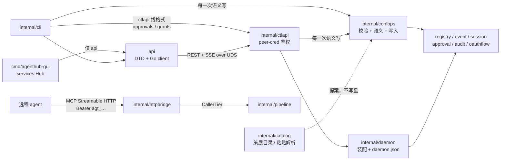

# 控制面与前端

这一层回答的是「人和 UI 怎么管这台机器」。数据面（网关、管线、下游连接）在别处；这里的包
只做三件事：把 daemon 的状态与治理动作暴露成一个稳定的本地 API，把这个 API 包装成两个平权
前端（CLI 与 GUI），以及守住「GUI 可以完全不存在」这条编译期约束。

包与包的分工是这样的。`api` 是公共契约：控制面的 DTO 与 Go client，只依赖标准库，不 import
任何 `internal/*`——GUI 和第三方集成只能走它。`internal/ctlapi` 是同一份契约的服务端：REST +
SSE 跑在一条 Unix domain socket 上，鉴权靠目录权限加 peer credential，没有 token。
`internal/confops` 是**语义写的唯一实现**：CLI 与控制面都调它，规则因此只有一份。
`internal/catalog` 回答「下一台该加什么」——策展目录与粘贴解析，两者都只产出**提案**，从不写盘。
`internal/daemon` 只做装配：把 registry、事件总线、session 管理器、审批 broker、OAuth 刷新
协调器接到 `ctlapi` 上，再写出 `run/daemon.json` 这个就绪握手文件。`internal/httpbridge` 是
另一张脸——数据面的 MCP Streamable HTTP 入口加 agent token 分级凭据层，它跟控制面共用进程但
不共用鉴权模型。`internal/cli` 是命令树，`internal/cli/output` 是它唯一的渲染层。
`cmd/agenthub` 与 `cmd/agenthub-gui` 是两个入口，后者靠构建标签把 Wails 依赖隔离在 CI 之外。
剩下三个包是地基与证明：`internal/testutil/fakemcp` 是所有测试用的可编程假下游，
`internal/depguardtest` 用失败用例证明四条依赖约束真的会拦，`test/e2e` 与 `test/concurrency`
用真进程跑端到端与跨进程并发。



有一处需要先说清楚，后面各包会重复提到：**事件是通知，不是快照**。SSE 上的每一帧都只是「有
东西变了」，消费者必须回头重读状态，并且按「读到的 generation ≥ 已应用的 generation」来决定
是否采纳，而不是「等于事件里的 Rev」。整条链上（`api.Event`、`ctlapi` 的 coalescer、GUI 的
`TopicEvent`）都写着同一句话，因为这是丢帧可容忍的前提。

---

## api

**一句话职责**：控制面的公共契约——线上 DTO、错误码、SSE 主题名，以及一个只依赖标准库的
Go client；GUI 和第三方集成通过它跟 daemon 说话。

### 关键类型与入口

`Client` 是唯一入口，用 `New(socketPath)`、`Default()` 或 `DialOrStart(ctx)` 构造。它把
`http.Client` 的 `DialContext` 换成 `unix` 拨号，URL 用一个假 host `http://agenthub`，因为
主机名永远不会被解析。所有能力挂在六个类型化的 service 上：`Servers`、`Sessions`、`Events`、
`Approvals`、`Skills`、`Audit`。**没有 raw request 逃生舱**——这是刻意的：一个前端能做的事，
必然对应一个端点，也就必然是 CLI 也能做的事，"GUI 可选"因此不是承诺而是结构。

`DialOrStart` 是「连不上就拉起来」的那条路径。它先拨一次；失败就 `exec agenthub daemon start`，
然后在一个 deadline 内轮询 `run/daemon.json` 并重拨。子进程如果先于就绪退出，返回的是它真正的
错误加 stderr 尾巴，而不是一个"超时"——这个教训来自参考实现 `desktop.rs`。

`Health`、`Server`、`SessionInfo`、`Event`、`Approval` 是 DTO；`Error`/`ErrorBody` 是错误；
`ComputeHealth` 的输入常量（`HealthLevel*`、`AdminState*`、`Action*`）在这里冻结，GUI 的
TypeScript 常量由 `healthgen` 从本包源码生成。

### 不变量与失败方向

**绝不 import `internal/*`，也绝不 `go get` 第三方。** 这是 canonical.md §2 规则 1，由
depguard 强制、由 `internal/depguardtest` 的失败用例证明。代价是 `paths.go` 必须把
`internal/platform` 的控制 socket 路径解析逻辑重写一遍；补偿是一个跨包契约测试
（`internal/ctlapi/paths_contract_test.go`，写在 ctlapi 那边因为只有它能同时 import 两边）
逐环境断言两份实现逐字节一致。

**解码失败方向是 fail-closed。** `decodeEnvelope` 只在「能被正面认定为格式良好的成功信封」时
才算成功：读满 16 MiB 上限、能反序列化、`ok:true`、状态码 < 400、`data` 非空且能解进目标。
任何一项不满足都返回 `*Error`，`Code` 为客户端合成的 `E_BAD_RESPONSE`——半截 body 永远不会被
当成成功。服务端的错误 body 原样透传，不重写。

**`X-Request-Id` 每请求生成**（可用 `WithRequestID` 覆盖以跨进程传递），随响应回显、进错误
body、进审计记录，因此 `Error.RequestID` 可以直接喂给 `agenthub audit tail --request-id`。

**审批参数有一条红线。** `Approval.Args` 只在 SSE 的 `pending` 帧上出现；REST 列表永远剥掉它，
审计记录永远只有 `ArgsHash`。前端显示完就丢，不得落盘、不得写日志。

**只有 `DecisionApproved` 允许执行。** 空值、未知值、任何其他 decision 都是拒绝。

**SSE 消费是宽容的、重连是自动的。** `EventsService.Subscribe` 同步建立首个连接（所以调用方
立刻知道 daemon 是否在线），之后由 goroutine 维持：任何流错误都指数退避重连，带
`Last-Event-ID` 续传；channel 只在 ctx 结束时关闭，所以 `range` 出来就是"订阅结束"。单帧
JSON 解析失败会跳过而不是终止——流仍可用，消费者本来就要靠重读状态对齐。

**转发契约（forward contract）。** `AuditService.Tail` 的 `/v1/audit` 已经落地；
`SkillsService.List` 的 `/v1/skills` **仍不存在**（`ctlapi` 的路由表里没有这条）。
调用会拿到 `E_NOT_FOUND`，前端应当渲染成「这个 daemon 上不可用」而不是错误。
Activity 视图的实时数据走 `activity` SSE 主题，tail 只是回填。

`sseParser` 按 WHATWG 规范实现：处理任意读切分、CRLF/LF、注释行（keep-alive）、多行 data
拼接、`id` 追踪（含 NUL 的 id 忽略）。流末尾的不完整行被丢弃，绝不当成截断事件投递。

---

## internal/ctlapi

**一句话职责**：控制面服务端——把 daemon 的状态与治理动作以 REST + SSE 暴露在一条只有本用户
能连的 Unix domain socket 上，并且把每一次写操作都记进审计。

### 关键类型与入口

`Listen(socketPath)` 负责绑定与鉴权，`NewServer(Options)` 负责组装，`Serve/Shutdown/Close`
负责生命周期。`Options` 里 `Registry`、`Sessions`、`Bus` 是必需的，其余有默认值；`Audit` 为 nil
会关闭审计（仅限测试，daemon 必须接上），`Approvals` 为 nil 会让审批端点统一返回 404。

路由是**手写的 switch**，不是 `http.ServeMux`。理由写在 `route` 的注释里：ServeMux 会自己发
405 和 301，那些响应的形状会泄露路由存在与否；手写分发让每一次 miss——未知路径、错误方法、
未知资源 id——都落进同一个 `writeNotFound`。

`ComputeHealth(HealthInput) api.Health` 是 Health 显示契约的纯函数。`gatewayLink` 实现
`session.ControlLink`，是 stdio 网关的 overlay 推送通道。`grantManager` 是易失的人类授权表。

### 路由面

命名规则是 `/v1/<资源>`，路径末段是 id；全部经过 X-Request-Id 中间件、审计（`actor="gui"|"cli"`）
与统一 404。写端点一律接受 `Precondition` 并在冲突时返回 **409 + 当前 generation**。路由表本身在 `server.go`
里（`grep '"/v1/'` 是权威来源）。

四条只写在这里、但两个前端都必须守住的规矩：

**凭据永不回显。** secrets 的读取返回 `{server, key, backend, set: true}`——
没有 value 字段，不是「不填」，是**类型里没有**。

**agent token 原文只出现一次**（创建响应里），之后所有读取只给前缀与元数据。

**危险操作要有区分度。** 删 server、清 client 绑定是可恢复的常规操作，二次确认即可；
而**把治理开关往松了调**（`denyDestructive` 从 true 改 false、`blockOnInjection` 关掉）
要单独标出并说明后果——这类开关的合并语义是「只紧不松」，唯一能放松它们的地方就是这里。

**写完之后不靠轮询。** 写入 bump generation，watcher 发事件上总线，控制面经 SSE 推给前端。
前端自己写完也走同一条回路，所以「别人改的」和「我改的」在界面上表现一致。

#### 面上唯一的长流程交换：交互式登录

`POST /v1/auth/{server}/login` → `GET /v1/logins/{id}` → `DELETE /v1/logins/{id}`
（`internal/ctlapi/nonreglogin.go`，由 `internal/oauthlogin` 驱动）。

这**推翻了原先写在 `api/auth.go` 里的一条决定**：「交互式登录不放在这个 API 上」，理由是 loopback
回调需要本地浏览器和一个随机端口，会成为「第二条易碎的代码路径」。这个理由对了一半。不成立的那一半
是代价更大的那一半——登录不在这里，图形前端面对「这台 server 需要授权」的唯一答复就是弹个对话框叫
用户去终端敲命令，而这个产品的立足点正是「客户端不碰凭据」。

让它划得来的原因是：它**不是第二条代码路径**。daemon 跑的是 CLI 跑的同一个 `oauthflow.Flow`，新增的
只有「一个长过单次 request 的流程」所需要的会话簿记。协议仍然只有一份实现，和 `internal/mcp` 同一条
规矩。

这条交换必须守住四条性质：

- **start 在还没有任何东西可展示时就返回 202。** 在 device 与 loopback 之间做选择需要授权服务器的
  metadata；把响应压到那时候才返回，等于把一次服务发现的超时塞进一次按钮点击里。首次轮询时 `mode`
  是空的，这是一个真实状态，不是字段缺失。
- **浏览器由调用方打开。** daemon 返回 `authorization_url` 而绝不自己访问它：它可能是无头的、可能由
  服务管理器拉起而没有可绘制的会话、也可能根本不在用户所在的那台机器上。前端还必须用**宿主**浏览器
  打开——把授权页渲染在应用自己的 webview 里，就是 agenthub 在一个由 agenthub 控制的窗口里索要
  provider 密码，那是钓鱼页的形状，并且拿掉了用户所有的判断依据。
- **失败的会话是 200**，带 `phase: "failed"` 和原因：读取是成功的，失败的是它所描述的那件事。hint 用
  的是 `oauthflow` 自己的建议，所以这个面和 CLI 对同一个失败给同一句话。只有「id 指向不存在的会话」
  才是 404；而已结束的会话会在一个保留窗口内继续可读，所以晚了一瞬的轮询方不会被告知它从没存在过。
- **loopback 的 SSRF 豁免跟随所存条目的 provenance**，与 `auth login` 完全一致。请求里刻意没有任何
  字段能要求这个豁免，所以没有调用方能给自己开后门。

对一台已有登录在跑的 server 再次 start，会**并入第一个会话**。两个并发流程会各自占一个 loopback
端口并抢写同一个 vault 条目，让输的那个的授权页回调到虚无——而这正是双击一次按钮本来会安排出来的
局面。

线上只传 `user_code`（人要往 provider 站点里敲的那串字符），绝不传用来轮询的 device code、绝不传
authorization code、绝不传 token。测试断言的是**键集合**，所以它在有人加字段的那天挂，而不是在有人
泄漏某个特定字符串的那天挂。

### 不变量与失败方向

**两道鉴权门，都必须过。** 第一道是文件权限：socket 所在目录 0700，socket 本身在 bind 后
chmod 0600（bind 与 chmod 之间那一瞬的窗口由 0700 目录和第二道门覆盖）。第二道是 peer
credential：Linux 用 `SO_PEERCRED`，macOS 用 `LOCAL_PEERCRED`，比对连接对端的 uid 与本进程
uid。`sameUser` 里没有特权旁路——**root（uid 0）同样被拒**。任何取凭据失败都当作敌意对端处理，
关连接、继续 accept（一个恶意拨号者不能卡死控制面）。**没有 peer-cred 实现的平台上
`Listen` 直接失败**（`peerCredSupported = false`），绝不"先监听再说"。

**陈旧 socket 只在证明无人服务后才删。** `removeStaleSocket` 先 lstat：不是 socket 的文件绝不
删除；是 socket 就拨号探活，**拨通了说明有活的 daemon，返回 `ErrAlreadyRunning`**，只有拨不通
才删。永远不会删掉一个活着的端点。

**`X-Request-Id` 在 handler 跑之前就写进响应头。** `withMiddleware` 先校验（`^[A-Za-z0-9._-]{1,128}$`，
不合规的一律替换成新生成的，绝不原样回显攻击者可控的字符串），再 `rw.Header().Set`。因为
`WriteHeader` 会给 header map 拍快照，提前设置保证成功、失败、甚至 panic 恢复后的响应都带着
这个 id。panic 恢复分两种：响应尚未开始就写 500 信封；已经开始（比如 SSE 流中途）就
`panic(http.ErrAbortHandler)` 直接掐连接——绝不在半截 body 后面追加垃圾，那会被解析成截断的成功。

**404 文案统一且逐字节冻结。** `notFoundMessage = "not found"`，未知路由、未知 session、未知
token、未知 grant 共用同一个 `(code, message, hint)`，只有 request id 不同。测试逐字节断言。

**路径匹配跑在 EscapedPath 上。** `sessionPathID`、`gatewayPath`、`approvalsToken`、
`grantsPathID` 都先在转义路径上做前后缀匹配、拒绝含 `/` 的段，再对单个 segment 做
`PathUnescape`——这样一个含 `%2F` 的 id 不能偷渡出额外路径段。

**Health 是七级优先级阶梯，首个命中即返回**：

```mermaid
flowchart TD
    A["1. AdminState<br/>disabled / quarantined"] -->|"未命中"| B["2. 缺失 secret"]
    A -->|"命中"| A1["level=healthy<br/>（故意关掉 ≠ 坏了）"]
    B -->|"未命中"| C["3. OAuth 配置错误"]
    B -->|"命中"| B1["unhealthy + set_secret"]
    C -->|"未命中"| D["4. 连接状态"]
    C -->|"命中"| C1["unhealthy + login"]
    D -->|"error / disconnected"| D1["unhealthy + restart"]
    D -->|"connecting"| D2["degraded（无动作）"]
    D -->|"未识别值"| D3["unhealthy + view_logs<br/>（暴露而非猜绿）"]
    D -->|"connected / unknown"| E["5. 调用期 OAuth 失败"]
    E -->|"命中"| E1["degraded + login"]
    E -->|"未命中"| F["6. token 状态"]
    F -->|"expired"| F1["unhealthy + login"]
    F -->|"expiring"| F2["degraded + login"]
    F -->|"ok"| G["7. healthy"]
    G -->|"conn = connected"| G1["healthy / \"ok\""]
    G -->|"conn = unknown"| G2["healthy / \"not observed\"<br/>（没人在看，不是没毛病）"]
```

四处值得单独记：`disabled`/`quarantined` **故意保持 `level=healthy`**（人为关掉不是故障）；
quarantine 在 `serverList` 里**压过 registry 的 enabled 标志**；未识别的连接状态**朝可见性
失败**（报 unhealthy + view_logs），而不是默认健康。前端只渲染，不得从其他字段重新推导状态。

第四处是 **rung 7 上 `unknown` 与 `connected` 的分岔**。状态源接上之后，`unknown` 的含义
变得精确了：**没有任何网关正持有这台服务器的连接**（没有客户端在用它，或者用它的那个还没
发出第一份报告）。这是一句关于**观察者**的话，不是关于服务器的。所以 `level` 保持 healthy
——把每台闲置服务器涂黄只是把一个误导换成一片噪音——但 `summary` 从 `"ok"` 改成
`"not observed"`：`ok` 是一个结论，而这个结论没人下过。rung 4 里 `unknown` 仍与 `connected`
同分支落下去，因为 rung 5/6 读的 secret/OAuth/token 事实与有没有人连着无关：一台没人在用、
token 却已过期的服务器照样要报 `token expired`。

**推与拉共用一份 payload。** `serverList()` 同时喂 `GET /v1/servers` 和 `servers` SSE 主题的
帧，所以两条路径逐字节相同，前端从哪边拿都是权威。

**SSE 的三种投递策略。** `servers` 主题走 50ms coalescer，payload **惰性构建**：K 次总线事件
合成一帧，全量服务器列表只 marshal 一次。扫描类主题（当前只有 `skills`）走 750ms settler，
把「started / progress / … / finished」整条生命周期压成一个 `settled` 终态帧，payload 取
burst 的最后一个事件并带上它 settle 时的 kind。其余主题逐事件直通——session 打开和 session
关闭是两件不同的事实，不能合并。每连接一个 32 帧的缓冲队列，**溢出就丢帧**（总线契约本来就
要求消费者靠重读状态恢复，绝不阻塞 coalescer 的定时器 goroutine）。

**Last-Event-ID 是尽力而为，不是可重放日志。** 帧 id 由 `Server.eventSeq` 全局单调分配（跨
连接可比）。客户端带着一个比当前序号旧的 id 回来，或者带着一个解析不了的 id，服务端**不回放
历史**，而是给每个已订阅的状态型主题（servers、sessions）各发一帧 `sync`，逼客户端重读。
未知的 `?topics=` 值是客户端错误，直接 400——不会静默地什么都不推。

**订阅 approvals 主题 = 注册成审批前端。** 这条 bridge 在写响应头**之前**就向 broker 注册，
所以一个已连上的订阅者绝不会对 broker 的 Unreachable 判定隐形。`pending` 帧带 `ArgsJSON`——
经过鉴权的 socket 是参数字节唯一允许流经的地方；`GET /v1/approvals` 列表一律剥掉。

**网关链路是 push-then-commit。** `gatewayLink.PushOverlay` 把 overlay 帧入队后**阻塞等 ack**：
链路关闭、ctx 结束、ack 超时、网关 nack——**除正向 ack 外的每一种结局都返回错误**，
`SessionManager.Mutate` 因此什么都不提交。daemon 和网关不可能各自为政。链路是单次的：第二次
attach 返回 409，重新注册会拿到全新的 session。注册后 30s 内没 attach 上链路的会话会被看门狗
判定为死亡并关闭（stdio session 不走 TTL 回收，否则 register 与 link 之间崩溃会永久泄漏一个
会话）。链路一断，会话就关——overlay 的权威随旧身份一起死。

**scope 端点只收窄。** `handleSetScope` 通过 `SessionManager.Mutate` 提交，收紧校验在
`internal/session` 里；任何放宽（包括会撤销既有收窄的 `Reset`）返回 403 `E_TIGHTEN_ONLY`。
`applyNarrow` 按构造只产生收窄编辑，`Mutate` 再兜一层——**这个函数负责塑形，Mutate 负责强制**。
`Discovery` 字段放在 `ScopeNarrowWire` 而不是公共 `api.ScopeNarrow` 里，因为它是体验字段而非
收窄，不该混进一个契约写着"narrow-only"的 DTO；未知 discovery 值**拒绝而非静默忽略**（静默
保留旧值会让操作者以为覆盖生效了）。

**grant 是唯一被批准放宽的路径，且是易失的。** `handleGrantDecide` 批准时用
`session.WithHumanGrant()` 调 `Mutate`，只有提交成功后 grant 才翻成 approved；失败则保持
pending（可重试），除非 session 已经不在了。`grantUndo` 精确记录"加了什么"，TTL 到期时按元素
回滚，而且**回滚路径不带 human-grant 标志**——即使 undo 有 bug，它也只能收紧不能放宽。整张表
纯内存（`grantManager`），daemon 重启即消失：复活的放宽是安全事故。TTL 上限 24h，默认 1h。
`tools` 必须显式列名，不支持整服务器放宽——整服务器需要"恢复上一个 selector"的语义，而那个
revert 会跟 agent 自己的收窄竞争，元素级 undo 才能被证明只收紧。

**审批决定第一个赢。** 后来者拿 409 `E_ALREADY_DECIDED`（body 里说明谁先决定的，对脚本而言
是幂等而非失败）；超时/asker 消失是 410 `E_EXPIRED`（迟到的批准永不执行）；工具定义漂移是
409 `E_STALE`。超时**不发 resolved 事件**——前端手里有 deadline，自己让卡片过期。

**每一个控制面写操作都进审计。** scope 变更、session kill、gateway register、approvals
ask/decide、grants request/decide/expire 各有一条记录，都带 `RequestID`，参数只以
`ArgsHash` 出现。哈希失败时写 `"unhashable"` 标记而不是丢掉审计行。

### handler 的两个面

**配置面（`admin*.go`）**——「一层语义、两个前端」里控制面的那一半：CLI 在进程内直调
`internal/confops`，GUI 走这些路由，两者落到同一份实现上。`GET|PUT /v1/scope/{client}` 管的是
client 的持久绑定——**只有一个字段 `profile`**，**别和 `POST /v1/sessions/{id}/scope` 搞混**，
后者改的是一次会话的易失 overlay。

**退役的收窄字段仍然被声明，而且刻意返回 400。** `servers` / `tools` / `discovery` 已经不属于
client 绑定（收窄搬到了 profile 上），但 `scopeBindingWire` 依旧保留这三个字段，只为了在
`retiredField()` 里点名报错。理由是失败方向：一个还在发 `servers` 的老调用方是想**收窄**，
如果服务端接下这个请求、绑好 profile、把另一半悄悄丢掉，它会拿到一个**比它请求的更宽**的面，
而且还收到 200。错误信息里带上具体字段名和「把规则写进 profile，再把这个 client 绑上去」的提示。

**非 registry 面（`nonreg*.go`）**——控制面里**不落在配置 registry 上**的那一半：
凭据、技能、agent token、客户端适配、OAuth 生命周期，以及活连接自检。几条只在这里能看到的规矩：
**验证凭据对不对是 `POST /v1/servers/{id}/test`，不属于 secrets 面**；`POST /v1/servers/{id}/test`
对 docker runtime 条目 **按容器探测**——dial 把 `Spec.Docker` 带进 spawner，不会在宿主机上跑那条命令
（早期 dial 还做不到，这里曾是 fail-closed 拒绝）；客户端接线的写入目标按
`path` > `placement` > 默认用户级文件解析，客户端没有该 placement 时 400 拒绝而不是改写另一个位置；
**`GET /v1/clients` 只 stat，绝不打开文件**（每次打开页面就按客户端数弹一轮 macOS 隐私窗，比没有列表更糟），
所以「agenthub 到底接进这个客户端没有」在 `GET /v1/clients/{id}/inspect`——一次一个、由调用方点名，
弹窗因此属于一次点击而不是属于打开页面。那里某个位置读不了不会让整个请求失败：它带着自己的错误和读得
好的位置一起返回，并把状态压成 `denied` 而不是 `not_connected`。
这份列表同时报出 agenthub 认识的**全部**客户端、以及其中它不亲自写入的那一批，而且是故意分开报的：
前者才是回答「我的客户端怎么不在里面」的那一份，所以不能被筛掉——而只拿到那一份的前端会给它贴上
"writable" 的标签，GUI 就是这么干的，还贴在自己带着 read-only 徽标的那些行上面。
`PATCH /v1/skills/{id}` **只有**库级粗开关。`GET /v1/audit` 与 `GET /v1/security` 的存在是为了让前端
回填两条治理流——GUI 不许自己碰数据目录。`POST /v1/parse/client-config` 只读不写（产出条目**预览**），
因此不入审计。

---

## internal/confops

**一句话职责**：针对配置 registry 的**每一次语义写**的唯一实现——加一台 server、重命名一个
profile、绑定一个 client、翻一个治理开关、禁用一个工具。

### 为什么它存在

CLI 与控制面是同一份配置的两个前端。如果各自拼出「重命名一个 profile 意味着什么」，
两边迟早对同一个操作给出不同结果。这类事故有过先例：`SpecFromEntry` 的注释声称自己是唯一翻译点，
而网关另外手搓了一份 Spec，**容器隔离于是被静默丢掉**。

所以这里的分工是刚性的：前端拥有 flag 解析、渲染与传输，**不拥有任何规则**。
一个 parity 测试断言 CLI 与控制面两条路径对同一操作产出**逐字节相同**的 registry 文档——
它们不可能漂移，因为它们是同一段代码。

### 操作，而不是 setter

API 的形状是**操作，不是字段 setter**。`RenameProfile` 顺带重指每一个引用它的 client 绑定——
把引用留在原地会让那些客户端 **fail-close 成空作用域**，那个后果属于这个操作本身，
不属于调用方。这就是「操作而非 setter」的意思。治理键表（`GovernanceKey` / `GovernanceKeys()`）
同理只住在这里：get/set/ls 的语义只有这一处。

### 不变量与失败方向

**每个操作三步走，顺序不能变**：先校验参数（拒绝发生在打开任何东西之前）→
在 `registry.Store.Update` 内部改（持跨进程锁、对着刚从磁盘重读的文档）→ 返回带提交后 generation 的 `Result`。

**前置条件比对在锁内、修改之前**，所以比对与写之间没有窗口。`Precondition{}`（generation 0）
表示不检查，CLI 的非交互路径用它，CLI 行为因此不变。

**主体不是 registry 的操作只能做弱检查。** active-profile 标记、integrity 的两个 store、
工具 override 文件各有自己的锁，registry 的 generation 可以在比对与写之间前进。
`checkSnapshot` 因此是**建议性**的：它抓的是「操作者的视图旧了」，不是「我脚下没被人动过」。
两者的区别写在类型上，别把它们当成同一个保证。

**校验拒绝而不是归一化。** 未知的 transport、未知的 runtime、解析不了的布尔值——
每一种都让 registry 保持原样，而不是落在一个操作者没要求过的默认值上。

**`Changed` 由 generation 推导，不由操作自己 diff。** registry 只在真正的状态变化时 bump
（它的 no-op 守卫比较的是解析后的 JSON 值），所以重复写入同一个值自然报 `Changed == false`。

---

## internal/catalog

**一句话职责**：回答一张配置表回答不了的问题——「下一台我可以加什么，代价是什么」。
它有两条到达「一份 server 定义提案」的路，且**两条都不写盘**。

### 两条路

| 路径 | 内容 |
|---|---|
| 策展目录（`catalog.go` + 内嵌 `seed.json`） | 一小批知名 MCP server 及其发布方文档记载的调用方式，于是「加一台」是从列表里选，而不是回忆 `npx -y @modelcontextprotocol/server-…` |
| 粘贴解析（`paste.go`） | 用户剪贴板里已有的 README 片段或别的客户端配置，转成同一种提案形状供预览 |

两者产出的都是**提案**。`internal/confops` 仍然是每一次 registry 写的唯一实现、也是条目被校验的
唯一地方——本包从不打开 registry，所以一个目录条目受到的审视与手敲的条目**一模一样**。

### 不变量与失败方向

**provenance 是来源信号，不是密码学证明。** `Entry.Provenance` 分级「定义从哪来」——
curated（写它的时候由维护者审阅过）、registry（远程索引，未实现）、user（键盘前的人敲的或粘的）。
它与 `Publisher`、`Homepage` 一起是**来源信号**：这里没有任何东西被签名，add 时没有任何东西被验证，
`npx -y <package>` 仍然会拉取那一刻仓库提供的任何内容。curated 意味着维护者相信那行命令是发布方
文档里的那行；**它不意味着最终跑起来的代码就是他们看过的代码**。真正对运行中的代码做出断言的防线
在别处：`internal/integrity` pin 工具指纹并隔离漂移，`internal/guard/spawnguard` 筛查被 spawn 的东西。
本包只给它们喂一份定义，不为它背书。

**`needsConfig` 是「能不能一键」的判据。** 条目声明了凭据、声明了参数、或命令行/URL/环境/头部里
还留着未替换的占位符——三者任一即需要配置，其余照原样即可加。

**占位符没替完就拒绝，绝不带着字面量 `{{directory}}` 写进去。** 一台 server 在连接时因为
一个没人敲过的路径而失败，比在 add 时被拒绝难解释得多。

**粘贴路径只解析，从不写入。** 这里不打开 registry、不解析密钥、不碰任何客户端的磁盘文件。
结果是一份 **preview**，调用方渲染、用户确认，之后走正常 add 路径由 `confops` 像校验任何条目那样校验它。

**同一件事在两条路上处置不同，这是有意的**：未知字段在粘贴路径上是 **warning**，
在 CLI 的 `server add --stdin` 上是**硬错误**。预览会把「将要存成什么」原样摆给用户看，
所以「这些键被忽略了」是他能据此行动的信息；而一个没有预览的写入只能拒绝，
否则用户永远不会知道自己粘进去的那个 `oauth` 块消失了。

**wrapper 键路径取自 `internal/clients`** ——决定每个客户端的 server 存在磁盘何处的同一张表。
于是新增一行客户端就免费扩展了这个解析器，而不是需要第二份会漂移的清单。

---

## internal/daemon

**一句话职责**：把控制面所需的一切装配起来并跑成一个进程——它自己没有业务逻辑，只有装配顺序、
就绪握手和优雅停止。

### 关键类型与入口

`Run(ctx, Config) error` 是唯一入口。`Config` 全部字段都有生产默认值，存在只是为了 CLI 和
测试注入（`Resolver`、`Log`、`OnReady`、各种 TTL/窗口、`Secrets`）。`Info` 镜像
`run/daemon.json`；`ReadInfo(runDir)` 是读者侧（`api.DialOrStart` 持有它的一份拷贝）。
`refresher` 是 OAuth 主动刷新循环。

### 不变量与失败方向

**`daemon.json` 只在成功 bind 之后写**，所以一份格式良好的 `daemon.json` 永远描述一个"写入时刻
活着"的端点——这取代了"先探端口再 spawn"的 TOCTOU 方案。写入走同目录临时文件 + chmod 0600 +
rename，读者只会看到旧文件或完整的新文件。

**四种依赖，四种失败方向，各有理由。** registry 打不开是致命的（daemon 就是协调面，不像网关
可以带病服务数据面），但被隔离并自愈的文档只是 warning。审计流打不开是致命的——**没有审计
就没有 daemon**。审批 allowlist 打不开只降级：**没有 allowlist 的 broker 会把每一次受门禁的
调用都送给人类，这是安全方向**；反过来拒绝启动 broker 会让每次受门禁调用都变成无从批准的
Unreachable 拒绝。日志 JSON 文件写不了就降级成纯文本——写不了日志的 daemon 仍然应该协调。
registry watch 建不起来也只降级：外部变更在下次显式 reload 时才被看见。

**优雅停止分两段。** ctx 结束后先 `srv.Shutdown(grace)`（停止 accept、排空在途请求），
grace 用完再 `srv.Close()` 强制关掉剩下的——长连的 SSE 链路永远不会自己排空。之后清理：
关 watcher、停后台 ctx、best-effort 删 socket、删 `daemon.json`。内部 goroutine（session
reaper、watch pump、grant forget、refresher）跑在**独立的 background ctx** 上，这样它们能
穿过排空阶段，在 cleanup 时才停。

**stdio 网关不依赖这里的任何东西。** 包注释把这条写死了：daemon 挂掉（哪怕 `kill -9`）只丢失
协调能力——会话列表、动态 overlay、HITL、集中刷新；网关回落到静态 scope，并带退避重新注册。

**registry watch 的采纳判据是单调的。** watch 事件只是通知；收到后重新 `Reload`，用
`registry.Applier` 按"读到的 generation ≥ 已应用的"判断是否采纳，采纳了才往总线发两条：
`ctlapi.TopicRegistry`（转发给每条网关链路）和 `server.registry`（驱动前端的 `servers`
主题，payload 在 ctlapi 侧惰性重建）。reload 失败保留旧快照。

**session 级 remember 授权随会话死。** `forgetSessionGrants` 订阅 `session.TopicClosed`，
会话一关就 `broker.ForgetSession`。失败方向：忘多了只是让人多批一次。

**OAuth 主动刷新的三个决定**（文件注释里逐条给了"看起来更明显的错误替代方案"）：

1. 走 `oauthflow.Coordinator` 的**离线路径**（`<server>.refresh.lock` 兄弟文件锁 + 取锁后
   重读 `expires_at`），不是只有进程内 singleflight 的在线路径。在线路径只在 daemon 是唯一
   vault 写者时成立，而 `agenthub auth login/refresh` 今天直接写 vault。多余加锁的代价是一次
   系统调用；漏加锁的代价是一次性 refresh token 被花两次，用户被锁在门外直到人工重新授权。
2. 在此之上仍保留进程内 singleflight，这样未来的控制面 `auth refresh` RPC 会撞到同一道闸门
   而不是跟定时器赛跑。
3. **没有过期时间的 token 永不主动刷新**。"没有 `expires_in`"意味着"永不
   过期"而非"已过期"，这类服务器由 `internal/downstream` 的 401/403 被动路径覆盖。

退避阶梯：前 3 次连续失败用 15s 平退，之后切 OAuth 慢阶梯（5m/15m/1h/4h/24h）。
`ErrNoRefreshToken`/`ErrNoState` 直接跳到最慢一级——只有 `agenthub auth login` 能修，重试没用。
`backoffState` 记录了失败时观察到的 `expires_at`：vault 里出现更新的过期时间说明有人重新登录
过，那条由旧凭据挣来的抑制窗口立即作废。退避**只在 token 确实到期时才查询**，抑制窗口只能
降低尝试频率，绝不掩盖"这个 token 需要续期"这个事实。

**crash 标记在 bind 成功后 arm，只在优雅停止那条分支 resolve**，所以突然死亡会把它留在 armed 状态，
下次启动就能把崩溃和干净退出区分开。

**非 registry 的协作者全是可选的。** 凭据、技能、agent token、客户端适配、OAuth 状态各自失败时都是
记日志后继续而不是拒绝启动：vault 打不开只损失 secrets 端点，其余照常协调。

**运行时状态源装的是谁**：`ctlapi.NewGatewayStates()` 一个对象同时作为 `Options.States`
（读）与 `Options.ServerReports`（写）注入。daemon **在数据面关闭时不连任何下游**——那时它没有数据面
（数据面未开启时 daemon 不持有任何下游），所以状态由真正持有连接的 stdio 网关经控制连接上报，
daemon 只做聚合。
为显示一个状态点而让 daemon 再起一份下游进程（每台 stdio server 一个常驻子进程、远程 server
的 OAuth 与限额翻倍、还要在 daemon 里重装一遍 secret 解析与 netguard）是不划算的交换。
聚合规则见 `internal/ctlapi/gatewaystate.go` 的文件注释。

---

## internal/httpbridge

**一句话职责**：daemon 的**数据面**暴露口——MCP Streamable HTTP 入口、守着它的 ingress 硬限额、
以及给调用者分级的 agent token 凭据层。

它刻意**不是**控制面。管理流量走 UDS 控制 socket，那里的身份是操作系统 peer credential、不存在
token；这个包只说 MCP。

### 关键类型与入口

`Server`（`New(Options)` 构造）在一条路径上只回答三个动词：POST 一进一出一条 JSON-RPC 消息、
DELETE 终止 session、**GET 回 405**。`Dispatcher` 是这个传输面与背后 MCP 逻辑之间唯一的接缝，
它的存在是为了让本包只拥有一件事——加固的 HTTP 入口与凭据层——而不会长出第二份门禁链。
`Authenticator.Authenticate` 产出 `*Caller`；`Store` 是 agent token 的持久化；
`AuthorizeBind(BindConfig)` 决定这个监听器**能不能被绑定**；`Listen`/`Serve` 是监听与生命周期。

### 不变量与失败方向

**绑定本身就是一次授权决定。** 一个既没有 admin token、也没有活跃 agent token、也没有注册
客户端的监听器，会把每一个本地进程都当成合法 agent，所以 `AuthorizeBind` **拒绝**创建它
（这条继承自 toolport 的 `http_bind_is_authorized`）。`--insecure-loopback` 是唯一的逃生舱，
而且比它的名字窄：**非 loopback 地址永远需要 token**——注册客户端也好、逃生舱也好，都不足以
授权把工具执行暴露到网络上；"注册客户端"这条路径同样只授权 loopback 绑定，因为 `clients.json`
里的条目是配置，不是凭据。`AddrIsLoopback` 朝 false 失败：空 host（`:8080`，即所有网卡）、
主机名、解析不了的地址一律**不算** loopback——这个谓词是用来授予较弱授权的，所以必须是这一对
里"证明不了就为假"的那个。

**每请求的顺序不变量：ingress 限额 → 认证 → session 绑定 → 分发。** 每一级都 fail-closed，
且每一种拒绝都是可区分的（413/401/403/404/503），这样运维读访问日志时能分清"body 太大"、
"token 被吊销"和"别人的 session"。**限流发生在认证之前**——in-flight 上限存在的意义就是限制
一个未认证调用者能引发的工作量；超限直接 503 卸载而不是排队（在饱和的下游连接池后面排队会
把一个慢服务器变成无界内存槽）。

**ingress 硬限额**（头部大小、头部读截止、body 大小、body 读截止、并发数）是 `ingress.go` 里的常量。
头部两项**无法在 handler 内部强制**（handler 跑起来时头已经读完了），所以装配方必须
用 `Server.HTTPServer()` 而不是自建 `http.Server`。body 的读截止时间通过 `ResponseController`
逐请求设置——服务器级 `ReadTimeout` 会连带限制长连接。

**只暴露 Streamable HTTP。** canonical.md §5b 冻结了传输不对称：agenthub **读**遗留的
HTTP+SSE 下游，但**永不生长新的 SSE 暴露面**，所以 GET 回 405 而不是升级成流。

**浏览器方向的两道闸。** `Sec-Fetch-Site` 由浏览器设置、页面脚本无法伪造：非浏览器客户端不带
它（不受影响），恶意跨源页面藏不住自己是页面。`Origin` 检查同时挡住 DNS rebinding——把自己
域名解析到 127.0.0.1 的攻击页面照样发自己的 Origin。**CORS 不变量：本服务器永不回显 Origin、
永不输出 `Access-Control-Allow-*`**，因为没有浏览器客户端需要启用，宽松 CORS 头唯一的效果就是
让页面读到工具结果。

**token 的形状与存储。** 前缀 `agt_` + 64 位十六进制。**分发按前缀且双向排他**：以 `agt_`
开头的一律只查 store，其余一律只跟 admin token 比对。没有这条排他性，调用者可以用 admin 形状
的候选值去探测 store；而一个恰好以 agent 前缀开头的 admin token 会变得不可用。
存的只有 `hex(HMAC-SHA256(key, plaintext))`：HMAC 而非裸 SHA-256 是为了防离线撞库——偷走
`tokens.json` 而没偷走 `.token_key` 的攻击者无法离线验证候选 token。key 文件是 dotfile 且
**挨着而非放在** token 列表里，这样把 `tokens.json` 拷进 bug report 不会连带交出验证能力。
**key 文件损坏是硬错误**：重新生成会静默作废所有已发 token，在运维眼里像一切正常、在每个
agent 眼里像服务中断。首次创建走 `O_EXCL`，输掉初始化竞争的一方读赢家的 key。

**Lookup 是一个不做预言机的认证面。** 未知、已吊销、已过期一律返回同一个 `ok=false`，上层一律
401。比对遍历整张表用 `hmac.Equal` 且**不短路**——循环耗时不能依赖匹配项在表里的位置。
`Token.Active` 把 tier 合法性也算进"活跃"里：一个本二进制不认识的 tier（手改文件、加了新 tier
后降级）必须拒绝而不是取默认值。

**nil 与空的三态。** `Token.Servers` 为 nil 表示"没配置限制，全放行"，非 nil 的空切片表示
"什么都不放行"。这就是该字段序列化时**不带 `omitempty`** 的原因，也跟 registry 的
`ToolSelector` 用同一套三态。

**store 的并发纪律。** 唯一性与 `MaxTokens` 上限在 flock 事务**内部**、对着这个事务即将写回的
那份列表检查——拿事务外读到的快照检查会让两个并发 `token create` 都赢。写回走完整加固阶梯：
同目录临时文件 → chmod 0600 → write → fsync → rename → fsync 父目录。文件缺失是空 store
（首次运行），但**文件格式错误是错误**：把损坏的凭据存储静默当成"没有 token"会让 bind 授权
fail-open。`MaxTokens = 64` 不是资源保护而是治理保护——没有上限的凭据列表是没人审计的列表。
吊销后的记录**保留**（名字继续被占用、行继续出现在 `token ls`），这样运维读到一条审计记录时
还能把名字解析回唯一一份凭据。

**session 绑定 fail-closed 且校验整体身份。** `Caller.Identity()` 把 kind、token 名、tier、
allowlist、profile 拼成指纹，session 冻结创建时的指纹并**每请求比对整体**——一个之后被收窄了
tier 或 allowlist 的 token，不能继续骑着旧 session 用旧权限。查不到、过期、他人拥有三种情况
返回同一个 false，handler 统一回那句冻结的 404 文案（防探测）。**他人拥有的 session 故意不
删除**：外来探测者不能靠猜 id 摧毁别人的会话。表满时**创建失败而不是驱逐**——为了给新连接
腾地方而悄悄丢掉别人的活会话，会把一次负载尖峰变成指向错误调用者的数据面错误。

**Listen 的双栈 loopback。** 被告知连 "localhost" 的客户端可能解析到 127.0.0.1 也可能是 ::1，
选哪个不由我们决定；只绑一个协议族会产生最糟的失败形态——在开发者机器上能跑、在用户机器上
拒绝连接。所以 "localhost" **两个都绑**，端口 0 时读回第一个监听器的实际端口给第二个用
（否则两半会落在不同端口）。第二个协议族绑不上只返回 warning 不失败（没有 IPv6 的机器不该
被拒绝启动），两个都失败才是硬错误。

**tier 只是被铸造，不在这里执行。** `Caller.Tier` 进入 `pipeline.CallRequest.CallerTier`，
真正的比对（对着工具注解推导出的 tier）发生在 `internal/pipeline` 的 token tier 门里——那是
三道防线（scope → token tier → precheck → HITL）的第二道。`Profile` 是 scope
交集的**第六个约束源**（第 4 章拥有另外五个）。

`AddrIsLoopback` 是**导出的**，因为装配方要用同一个谓词判断是否需要显式远程确认——
两份「这算不算 loopback」的实现迟早会不一致，而那个不一致会落在放行的一侧。

### 谁装配它

`internal/daemon`（`httpserve.go` + `httpdata.go`）。装配是**显式 opt-in** 的：
`daemon.Config.HTTPAddr` 为空——也就是没传 `agenthub daemon start --http-addr`——时
**根本不创建监听器**。非 loopback 地址额外要求 `--http-allow-remote`，缺了就让 daemon 启动失败，
而不是悄悄降级到 loopback（"配置声称的东西必须兑现或报错"，与 `runtime: docker` 同一条纪律）。
`AuthorizeBind` 的凭据检查在这之后，仍然是最后一道 fail-closed。

`Dispatcher` 的实现体 `httpPlane` 刻意很薄：它把一个认证过的凭据映射到一个 `gateway.Conn`
——`agenthub connect` 的同一个网关体，接在内存管道上——然后把请求帧写进去。**没有第二套装配，
因此也没有第二条执行路径**：HTTP 请求穿过的是同一个 discovery surface、同一个 router、同一个
`pipeline.Execute` 调用点。凭据只从两个既有入口进入治理链：`Caller.Tier` 变成
`gateway.Config.CallerTier` → `pipeline.CallRequest.CallerTier`；`Caller.Servers` 与
`Caller.Profile` 变成 `scope.Sources.Extra` 的额外层，由与持久化三层同一个 `Merge` 取交集
（都是安全字段，只能收窄）。连接按**整份凭据**（kind/名字/tier/allowlist/profile）键控并复用，
所以一个发出后被收窄的 token 拿到的是新网关而不是旧权限——与 session 的
`Caller.Identity()` 同一条规则；空闲 30 分钟后回收。

证明「没有分叉」的测试是 `internal/gateway/inproc_test.go` 的 `TestInProcGateCountParity`：
一次经 `Conn` 的 `tools/call` 与一次经 stdio 管道的 `tools/call` 推进的门计数**完全相同**，
与「直调 / `call_tool`」两路同一个判据。

---

## internal/cli

**一句话职责**：`agenthub` 的整棵命令树——离线的 registry 编辑、在线的控制面操作、以及把两者
统一成同一套退出码与同一套 `--json` 信封。

### 关键类型与入口

`Main(Options) int` 是唯一入口，返回进程退出码。它是**唯一**做错误分类（`ExitCodeFor`）和
错误报告（`Printer.Fail`）的地方；每个 `RunE` 只返回类型化错误，绝不自己打印错误。`App` 持有
一次调用的全部可注入状态（版本、三个流、`platform.Resolver`、锁超时、`--json` 开关），所以
测试可以完全 hermetic 地跑命令。

`Error` 是类型化 CLI 错误，同时携带稳定机器码（`Code*`）、进程退出码（`Exit*`）和给人看的
hint。四个构造器 `Usagef`/`NotFoundf`/`DaemonDownf`/`AuthFailedf`/`Deniedf` 覆盖冻结表里的
各类。`silentExitError` 给已经通过 output 层渲染完结果的命令（doctor 的逐项状态）用，避免
Main 再打印第二遍错误。

`ctlClient` 是原始控制面访问，服务于类型化 `api` client 未覆盖的两个面（approvals、grants）。
它说同样的信封、走同样的 UDS，但线格式 DTO 直接来自 `internal/ctlapi`——CLI 在模块内部，不像
公共 `api` 包那样受限。

### 不变量与失败方向

**退出码表是冻结的**，映射只存在于 `ExitCodeFor` 一个地方：

| 码 | 含义 | 触发 |
|---|---|---|
| 0 | 成功 | — |
| 1 | 通用错误 | 下游/网络/内部 |
| 2 | 用法错误 | 参数、未知 flag、未知子命令 |
| 3 | 资源不存在 | server/profile/secret/skill/session/tool |
| 4 | daemon 离线但命令需要它 | `DaemonDownf` |
| 5 | 认证/授权失败 | OAuth 流 |
| 6 | 被治理策略拒绝 | HITL deny、隔离、`E_STALE` |
| 7 | 锁争用超时，或状态文件损坏且**无法自愈** | 四把跨进程锁中的任意一把——registry、integrity、skills、HTTP bridge 的 token 存储；外加 `registry.UnreadableError`、integrity 与 skills 的损坏状态路径、以及 `confops.KindState` |

**"cobra 解析错误 = 退出 2" 是靠构造保证的，不是靠约定。** root 上设了
`SetFlagErrorFunc`，把每一个 flag 解析错误漏斗进 `Usagef`；`exactArgs`/`noArgs`/`rangeArgs`
是 cobra 同名校验器的类型化替代；每个 group 都用 `Args: cobra.ArbitraryArgs` + `groupRunE`，
让未匹配的子命令名落进类型化的 usage 错误，而不是 cobra 自己那句无类型的 "unknown command"。
`SilenceUsage`/`SilenceErrors` 都开着，因为 Main 独占错误报告。

`groupRunE` 漏了一个口子，Main 在 `Execute` 之前把它堵上。cobra 在 RunE 之前就答复 help flag，
于是 `agenthub secret get --help` 打印 `secret` 组的帮助页并退出 0——跟一个真实子命令给出的答复
一模一样，这才让根本不存在的 `secret get` 看起来像存在（凭据值压根没有读取路径，所以那一页
否定的是一条设计规则，而不只是一个事实）。`helpForUnknownSubcommand` 用 `root.Find` 解析参数，
对**有子命令**的命令上残留的非 flag token 予以拒绝。**这个口子有两道门，只堵一道等于没堵**：
一道是 help flag，另一道是 cobra 的 help *命令*——`agenthub help secret get`，它自己的实现
同样解析到最深的匹配、把剩下的丢掉，给出同一张页面和同一个 0。同一个问题的两种拼法，所以
`helpRequest` 把两者归一成一条路径，而不是查两遍。它的作用范围就精确等于这个口子——没有人
请求帮助时 RunE 本来就会答复，而叶子命令有权接收位置参数——另一个方向由
`TestHelpForEveryRealCommandStillExits0` 按三种拼法遍历整棵树守住，因为一个跑在 cobra 之前的
检查，是有能力把所有地方的 `--help` 一起弄坏的。

**"已自愈的隔离"降级成 warning，不占用退出 7。** `splitQuarantine` 把
`registry.UnreadableError`（文档读不了但已隔离 + 重置为默认，store 仍完全可用）从致命错误里
分出来，变成成功信封上的 warnings。退出 7 留给"损坏且无法自愈"。

**命令树的形状由测试钉死**（`tree_test.go`），而不是靠 review：命令树里的每条命令
必须存在且拼写一致；资源组必须是**单数正名 + 复数 cobra alias**（server/servers、
profile/profiles、client/clients、session/sessions、tool/tools、skill/skills、secret/secrets、
approval/approvals、grant/grants），而且 alias 必须真的能解析出来；列表子命令一律叫 `ls`
（`list`/`dump`/`ls-all` 全是违规）；**每条命令都必须能拿到 `--json`**（它是 root 上的
persistent flag，这条测试实际断言的是没有命令遮蔽或摘掉它）。动作/流式组（daemon、
auth、audit、activity、events、config、doctor、connect）保持原名，不加复数 alias。
不再有 `scope` 组：绑定归 `client bind` / `unbind` / `ls`，收窄归 `profile`。
同一份测试还钉住了帮助分组的成员——Setup 是 `server, auth, secret, catalog`（`catalog` 只有一小撮策展条目，
让它打头会教出一条对多数 server 以「没收录」结尾的路；`server add --url ...` 才是通用答案），
Wire up 是 `profile, client`（一份面**装了什么**和**给谁**是同一个问题的两半），
Daemon 是 `daemon, session, events, token`，Manage 是其余全部，Diagnose 只有 `doctor` 一条。

后半段按**一个可验证的问题**切分：这条命令需不需要 daemon 在跑？Daemon 组的每个成员没有 daemon
都是空转的——`session` 和 `events` 在自己的帮助文案里就写了，`token` 发的是 daemon HTTP 数据面的
凭证，没有 daemon 它就没有主语。按这个共同前提分组，「daemon 起来了吗」整节只需要回答一次，而不是
每条命令回答一次；`daemon` 打头，答案就是第一个能拿到的东西。Manage 就叫它本来的样子——剩下的部分，
不用起任何东西、对着本地状态就能跑。它替换掉的是 Govern/Operate 那种按主题切的分法，而那些主题
没能扛住自己的成员表：`token` 是 setup 不是治理，`skill` 和 `activity` 不是运维。
一个把自己成员归错的标题，教给读者的是错的工具模型——所以兜底那一组不给它一个迟早会被打破的主题。
`audit` 和 `activity` 是 `audit.jsonl` / `savings.jsonl` 的投影，是磁盘上的文件，这就是它们不进
Daemon 的原因。

`skill` 不在 Wire up：把技能包物化出来和「给 client 发 MCP 工具」是两件事，
而 shipped build 的帮助页是一条路线推荐——`profile` 和 `client` 旁边多一项会被读成第三个必做步骤。
`secret` 则相反，**在** Setup 里，紧跟 `auth`：这两条回答的是同一个问题——这台 server 怎么证明我们是谁——
一条管自己发凭证的 server，一条管你手里已经有 key 的。它曾经被藏起来，理由是凭证反正会被替操作者处理掉；
并不会。`secret set` 是唯一一条会去读凭证的命令，而 `catalog show` 本来就在给每个需要凭证的条目打印
「store it with 'agenthub secret set …'」——于是 release 在推荐一条被自己帮助页藏起来的命令。
藏起来之后剩下的路是 `--env KEY=<字面量>`，那会把 key 写进 registry，而这正是 registry 绝不能装的东西。

**Diagnose 组的存在，是为了让 shipped build 能说出「下一步做什么」。** `doctor` 原本在 Manage 里，
于是 release 教了一条线性路径——加 server、授权、建 profile、绑 client——却把唯一那条能说清「断在哪一步」
的命令藏了起来。这是 `secret` 那个毛病的另一面，而且比「推荐了一条藏起来的命令」更糟：这条日常路径
本身就有失败模式（握手不通、client 配置指向了旧二进制、launcher 缓存还是冷的），藏掉 `doctor`
等于对所有这些失败都不给回应。它单独成组而不是并进 Wire up，是因为它回答的问题种类不同——
Setup 和 Wire up 是要走的步骤，Diagnose 是步骤没走通时该跑的东西；塞进任何一组都会被读成
一条只有两步的路径里的第三个必做步骤。将来第二条诊断命令要进这一组，得过同一道门槛：
沿着日常路径走的用户，没有它就卡住。

每个 group 裸调用打印 help 且退出 0，未知子命令退出 2。

**错误文案是 golden 测试冻结的**（`errorgolden_test.go`）。canonical.md §6 要求三族 golden
测试从第一天就在 CI 跑，这是第三族（另外两族是签名语法和搜索排序，在 `internal/discovery`）。
被冻结的是整个失败契约：每一个可分类错误的机器码、退出码、message、hint 四项——agent 和脚本
四项都会用，所以静默改措辞就是契约破坏。用 `go test ./internal/cli -update` 重生成，**并且
必须审 diff**。

**在线/离线矩阵是显式的。** `session` 组全部命令都需要 daemon（session 是从不持久化的运行时
对象），离线是退出 4 而**不是**编一个离线答案。`events` 天生在线（流就是 daemon），离线退
4 而不是打印一个看起来像"什么都没发生"的空流。`audit tail -f` 同理：没有 daemon 就没有新记录
被追加，跟随会永远假装在工作。反过来，`activity` 是对 append-only 文件的纯读，**离线可用**——
数字描述的是已经发生的事，daemon 在不在线改变不了历史；`tool` 组的治理动作也全部离线可用，
因为"不用先把可疑服务器启动起来就能禁用它的工具"正是 kill switch 的全部意义。

**输赢竞态不是错误。** `approval approve|deny` 拿到 409 `E_ALREADY_DECIDED` 时返回**成功**，
只在结果里标 `AlreadyDecided: true`（幂等契约）；grant 同理。
`E_STALE` 映射到退出 6（被治理拒绝），`E_EXPIRED` 映射到退出 1。

**凭据从不被打印，且是类型级保证。** `secret` 组的结果类型里**根本没有 value 字段**，
`ls` 只渲染 key 名和后端，`auth status` 只报 issuer/过期/模式/有没有 refresh token；不存在
`--show` 逃生舱。唯一的例外是 `token create`：明文必须离开进程一次，否则这个 token 根本没法
交给 agent——所以它打印一次并附上"这是唯一一次"的警告，store 只保留 HMAC。终端读取密码走
`readNoEcho`，**非终端 fd 返回错误而不是照读**（重定向的 stdin 不能把凭据静默 echo 进日志），
恢复终端状态挂在 defer 上（中断的读不会把用户的 shell 留在 echo 关闭状态）。

**`server ls` 敢原样显示 header 值**，因为 registry 条目里从来没有凭据——值是
`${SECRET_X}` 占位符，解析发生在连接时的 `internal/downstream` 里。一个条目需要哪些
**vault 键**由 `downstream.SecretKeysIn` 给出，而不是本地再扫一遍 `${...}`：只有
`${SECRET_<KEY>}` 才是凭据，且它指向的条目是去掉前缀的 `<KEY>`——自己扫的那份列表，恰恰在它
唯一存在的用途（与 `secret ls` 对账）上失败。`server inspect` 出于同样的理由把它们印在
`configuration` 段里，但有**一个例外**：字面量的 `Authorization` 值，正是上面那条假设已经被打破
的情形——它是粘进来的 token，不是占位符——所以人类视图拒绝把它读回终端。判定用的是
`hasLiteralAuthorization` 那条窄规则，因为去猜"还有哪个 header 也在认证"就会开始隐藏普通配置；
`--json` 信封保持原样，给已经拿着那个文件的程序看。

**`server inspect` 是唯一一个描述"整台 server"的视图，它按四段排布**
（`internal/cli/serverinspect.go`）：`configuration`（目标、cwd、容器运行命令行、derive 策略、
声明为本地的 endpoint、trace 文件、env 与 headers）、`credentials`（下面那套分类、登录提示、每个
vault 键的状态）、`visibility`（见下）、`status`（daemon 的实时视图，然后是带时间戳的工具缓存）。
一段只在有话可说时才打印，所以一台普通的本地子进程仍然只占几行。其中两行的存在是因为别处根本没印过：
**`spawns` 是 spawner 真会执行的那条 `docker run` argv**——由 `confops.DockerRunLine` 渲染，也就
是 spawn guard 审查的同一个翻译器，于是"配置声称的隔离必须被兑现"变成读一眼就能核对的事，并且有测试
把打印出来的这条与真正拨号的那条对比；另一行把**"从没缓存过目录"和"0 个工具"区分开**，这是旧措辞做
不到的：两者之中只有一个是关于这台 server 的事实。标签用固定列宽而不是 `tabwriter`——明细视图在每个
段标题处都会切断列块，算出来的宽度会在段与段之间漂移。

**`visibility` 为一台 server 把 profile 与 client 绑定合到一起**
（`internal/cli/servervisibility.go`），这正是"一切都健康、可我的 client 还是看不到工具"背后那道
心算。三种状态被刻意分开，因为它们要的修法不同：**disabled** 的 server 不管 profile 怎么写都谁也够
不着（全局开关压过它们，所以那句话是*替换*掉 client 列表而不是并排放着）；**排除**了这台 server 的
profile 会被点名（只列出其余那些，回答不了"哪个 profile 漏了它"）；指向不存在 profile 的绑定
fail-close 成空作用域——从外面看，它和一次刻意的排除长得一模一样。**未绑定** client 会看到什么，是每
份报告都写出来，而不是只在它改变结论时才写：因为"我哪些 client 被绑定了"恰恰是读的人不知道的。它**只
读 registry**：不打开任何 client 配置文件（那是 `client inspect` 刻意的逐 client 动作，带着 macOS
隐私弹窗），也不需要 daemon，所以答案在坏掉的那台机器上依然拿得到。又因为作用域链只会收窄，它报告的
是上界——会话作用域仍可以在其下再拿掉工具。

**`AUTH` 列报告的是"存了什么"，绝不是"能不能用"**（`internal/cli/serverauth.go`）。这正是禁止
持久化 `needsAuth` 那条线：「这台机器上有 notion 的 OAuth token」是本地事实，所有下游都连不上时
也读得出来；而「notion 会不会接受它」是一次活的 401，属于 enable 探测和 Health 契约。所以这一列
的取值是 `oauth`、`oauth:expiring`、`oauth:expired`、`oauth:login`、`token`、`secret`、
`secret:missing`、`header`、`error`、`-`，其中没有一个可以被读成健康度。分类是**先匹配先赢的阶梯**，
前两级是排出来的而不是顺手的：缺 secret 排在最前，是为了让 CLI 和 `ComputeHealth` 不可能对同一台
server 各说各话；字面 `Authorization` header 排在已存凭据之前，是因为 `attachBearer` 遇到显式
header 就不再附加——报告它背后的 token 等于点名一个根本不会被发出去的凭据。最后一级**不猜**：一个
没有凭据也没有提示的 HTTP endpoint 就是 `-`，不是"大概需要登录"。`server inspect` 渲染同一份分类，
只是不做压缩；footer 提示在有 refresh token 时优先建议 `auth refresh` 而不是 `auth login`——两者
都能修好过期，但只有一个需要浏览器。

**读取采用索引优先，这是成本规则而不是优化。** 一次 `Chain.List`——enc 文件的 map 加 keyring 键
注册表，两个普通文件——就能回答"哪些条目存在"，全程不碰 OS 钥匙串；只有真的存了
`__oauth_state__` 的 server 才付一次读值的代价，而 `__http_auth__` 从头到尾不读值（它的值就是
token，存在与否就是全部问题）。`server ls` 是所有错误提示都在推荐的命令，doctor 的 `checkVault`
早就把后果写清楚了：一个会弹钥匙串对话框的命令，是人们会停止运行的命令。失败方向：**列表 fail-open，
单元格 fail-visible**——vault 读不了时 registry 那半张表照常打印，但单元格是 `error` 而不是 `-`，
因为"不需要凭据"正是它绝不能编造的那个答案。整列只在至少有一台 server 有凭据时出现，理由和 `TRACE`
只在有东西被 trace 时出现是同一条。

**OAuth 登录提示是配置，不是运行时状态。** `server add --oauth-issuer/--oauth-scope/
--oauth-resource-metadata` 写的是 `registry.OAuthHint` 的全部三个字段，与 `--stdin` 的
`oauth` 块同一个目标、同一套校验（`confops.ValidateOAuthHint`：https（`--local` 才准 http）、
不得是私有地址、issuer 不带 query/fragment（RFC 8414 §2）、一个 scope 值里不能塞两个
scope（RFC 6749 §3.3））。三个字段与 transport 无关（stdio 子进程也可能代理到远端授权
服务器），所以校验不挂在任一 transport 分支里。没给任何 flag 就是 `nil`，不写空的
`"oauth": {}`。`needsAuth` 永远不在这里：它是活 401 发现的运行时状态。

**`server test --tools/--schema` 渲染的是这次握手的定义，不碰缓存。** 握手拿回的
`mcp.ToolDef` 本来就带着完整的 `InputSchema`/`Description`，`--tools` 用
`internal/discovery/toolsig` 的紧凑签名把它印出来——与 agent 在 `search_tools` 里看到的
是同一个字符串，不另造格式；`--schema <tool>` 给出下游的原始字节。这与
`server inspect --schema` 读的是**两个不同的源**：后者读 gateway 的持久化工具缓存，
而那份缓存只有真跑过 gateway 会话才写，`server add` + `auth login` + `server test` 的
工作流下它根本不存在。`server test` 依然不写缓存——它是直连诊断，无持久化副作用。

**`daemon start` 的后台化。** fork `<self> daemon start --foreground` 进独立 session
（`setsid`），然后轮询 `run/daemon.json` + ping 直到就绪。子进程的原始 stderr 写**文件而不是
管道**：父进程在就绪后就退出了，往一个没有读端的管道里写会 SIGPIPE 掉 daemon。子进程先于就绪
退出时，报的是它真正的失败加 4 KiB stderr 尾巴，而不是裸超时。已有活 daemon 时幂等返回
`AlreadyRunning`。`daemon stop --force` 杀的是进程组（daemon 是 session leader），普通 pid
kill 是前台启动时的回退。`daemonAlive` 用 signal 0 探测，**任何错误（ESRCH、EPERM…）都读作
false**——stop/status 绝不向一个无法确认归属的 pid 发信号。

**`doctor` 只读不写。** 它刻意**不调用 `registry.Open`**：开 store 会创建目录、五份文档和锁
文件，那会让一个诊断工具变成写者，并且顺手"修好"它正在报告的状态。所有检查读裸文件。
`--fix` 只做安全自愈（重建缺失目录、重指陈旧客户端条目），破坏性修复**只建议不执行**。
launcher 冷缓存（npx/uvx 首次下载包）单独提示"仍在安装"而不是误报坏服务器——这是整份报告里
最常见的假阳性。只有 `fail` 影响退出码，`warn` 是信息性的。

**`registry:quarantined` 是唯一一条报告「数据被搁置」的检查，它必须单独存在。**
registry 隔离一份读不出来的文档时，会把损坏文件改名、原地写一份**空的新文档**——
于是随后 `registry:servers` 报的是「readable」。这句话完全属实，
但在「我所有 server 都不见了」的那一刻，它恰好是最不该读到的一句。
隔离当时的那条 warning 由触发它的那个命令打印一次；
**事后**跑 doctor 想弄明白配置去哪了的人，才是这条检查存在的理由。
它按 `*.unreadable-*` 找文件，并把 `backups/` 指出来——只报坏消息不给下一步，等于没报。
没有被搁置的文档时它完全沉默；这条 warning 会一直在，直到操作者处理掉那个文件，
这正是它可执行而不是长期噪音的原因。

**`approval watch` 在运行期间就是一个活的审批前端。** 它一订阅 `approvals` 主题，broker 的
`FrontendCount` 就大于 0，受门禁的调用因此会送到人面前而不是以 Unreachable 失败。它是行式
交互（`a <n> [session|forever]` / `d <n>` / `ls` / `q`），刻意不用 raw terminal 库。
SSE 重连会重放 backlog，`watchState.add` 靠 token 去重以保持编号稳定。stdin EOF 只停止读取器
——一个无终端的 headless watch（专门作为审批前端 spawn 出来的）继续订阅。`--json` 模式下它
退化成一个原始事件流（每行一个 JSON），不套信封，因为信封约定不适合无界交互流；脚本应当用
`approval approve|deny` 做决定。

**`session ls -f` 用轮询而不是 SSE**：列表很小，而轮询不会像订阅那样悄悄卡在一个半开的流上。

**registry 写走离线直连。** `registry.Store.Update` 自带跨进程 `.lock` + 原子写，所以离线
路径与未来的 daemon 中介路径不会丢彼此的更新。`tool ls` 走 `internal/router` + `internal/discovery`
读目录，**用的是网关 `search_tools` 同一个排序器**，避免出现两套排序。

**`confops.go` 是通往 `internal/confops` 的桥**：它把 confops 的 Kind + 稳定机器码翻译成 CLI 自己的
`*Error`，好让冻结的退出码表与 `--json` 失败信封在规则搬出本包之后**一个字都没变**。CLI 只管
flag 解析、渲染与退出码，不拥有任何规则。

**`ConnectSnippet` 是 `client` 组里预览与写入的唯一接缝**，所以 `client connect` 不可能给用户看一份、
往盘上写另一份。它产出的 entry 只有 `connect --client <id>`，**没有 `--profile`**：profile 绑定住在
`clients.json` 里，绝不写进客户端自己的配置文件。写进去就是造出第二个 agenthub 改不动的真源，
而换 profile 会变成「改一份客户端拥有的文件，然后让它重启」——恰恰是这套设计不肯放弃的热更新。
`setsid_unix.go` 让网关脱离调用方进程组，正是为了防 SIGTTIN/SIGTTOU。

---

## internal/cli/output

**一句话职责**：CLI 唯一的渲染层——人类可读输出与 `--json` 信封由**同一个数据值**喂出，两种
表示因此不可能在语义上漂移。

### 关键类型与入口

`Data` 接口只有一个方法 `Human(w io.Writer) error`。`Printer.Emit(data, warnings...)` 是全部：
JSON 模式下把这个值原样 marshal 成信封的 `data` 字段，人类模式下调它的 `Human`。**没有第二条
代码路径**能让两种模式渲染出不同内容——这就是「人类输出与机器输出同源」的实现方式。

`ProgressEvent` + `Printer.Progress` 是长命令（`auth login`、`server test`）的中间步骤。
`Fail(ErrorDetail)` 渲染失败信封。

### 不变量与失败方向

**JSON 模式下整个信封作为一行写到主输出（stdout）**，脚本可以逐行解析。人类模式下 warnings
和错误走次输出（stderr），stdout 只留表格和代码片段。

**信封形状是冻结的**：成功信封永远带 `data` 和 `warnings` 两个键（warnings 数组**永不为 null**），
失败信封永远带 `error`，其中至少有 `code` 和 `message`。

**进度的两条渲染规则都是刻意的**：JSON 模式下每步一行紧凑对象（`{"event":"awaiting_browser",…}`）
写 stdout，脚本能在最终信封之前看到进度，而**最终信封永远是最后一行**；人类模式下进度写
**stderr**——进度不是结果，把 stdout 留给结果本身，才能让 `agenthub auth status | jq` 和 shell
管道在两种模式下行为一致。`ProgressEvent.MarshalJSON` 会把 Fields 里名为 `event` 的键丢掉：
事件名只有一个来源。

**`Progress` 与 `Fail` 都不返回错误。** 一条进度行写不出去，命令仍然必须能跑完并报告真实结果；
报告失败这件事本身失败了，除了尽力而为没有更好的补救。

---

## cmd/agenthub

**一句话职责**：唯一必需的二进制——CLI 管理命令、stdio 网关（`connect`）、daemon 全都是它的
子命令。

`main.go` 刻意很薄——把 `os.Args[1:]` 和三个标准流交给 `cli.Main`。**所有可测试的东西都在
`internal/cli` 里**，这样命令树才能在测试里被 hermetic 地驱动。

---

## cmd/agenthub-gui

**一句话职责**：可选的 Wails3 桌面 GUI——它存在的方式必须保证它**不存在也无所谓**。

### 关键类型与入口

`services.Hub` 是被绑定的服务体：前端能调的每一个方法，加上 SSE→Wails 事件桥。
`services.HubService` 是套在 Hub 外面的薄壳（Wails 绑定提升方法），`MarshalError` 把 Go 错误
转成前端拿到的 rejection cause。`healthgen` 从 `api` 包源码生成前端的 TypeScript 常量。

### 不变量与失败方向

**编译期约束：`cmd/agenthub-gui` 下的任何东西——包括 `cmd/agenthub-gui/services` 和
`cmd/agenthub-gui/internal/healthgen`——都绝不 import 顶层的 `internal/*`**，只能通过公共 `api`
包跟 daemon 说话，跟任何第三方集成一样。它也绝不读写数据
目录、绝不说 MCP。推论是**GUI 能做的每一件事都有控制面端点，也就都是 CLI 能做的事**——
"GUI 可选"因此是编译期性质而非口头承诺。这条由 depguard 强制、由 `internal/depguardtest` 的
两个失败用例（api 一个、gui 一个）证明。

**构建标签隔离。** 默认构建（`go build ./...`、`golangci-lint run`）拿到的是 `main.go` 里的
占位程序，它打印一句"这个二进制没带 GUI，用 `make gui` 构建"然后退 1。真正的应用在
`gui_main.go` 的 `//go:build wails` 后面，因为 webview 构建需要 CI runner 上没有的
GTK/WebKit 开发包。同样的切法用在 services 包内部：**整个服务体在 `hub.go` 里、不带构建标签**，
所以它在没有图形库的 CI 上照样编译、vet、跑单测；只有约 50 行 Wails 接线在
`service_wails.go` 的标签后面。Wails3 alpha 哪天构建不了，坏掉的只有那两个文件，页面逻辑和
api 层原封不动。

**带标签的那两个文件也有 CI 覆盖，但在另一个 job 里。** `.github/workflows/ci.yml` 的
`gui` job（macos runner）跑 `make gui-frontend-ci`（`npm ci` + `tsc --noEmit` + vite）、
`make gui-go`（`-tags wails` 真编译）与 `go vet -tags wails ./cmd/agenthub-gui/...`。
放 macOS 是因为 Linux 上 `-tags wails` 在 cgo 前导（`#cgo pkg-config: gtk4 webkitgtk-6.0`）
就失败——那是**类型检查期**，不是链接期，所以裸 ubuntu runner 连 `go vet` 都过不去；
给每次 CI 装 GTK/WebKit 换来的信号，macOS runner 用它自带的 SDK 零成本就给了。
这个 job 与 `make ci` 相互独立：GUI 不能成为默认构建的前置。

**GUI 必须能在 daemon 挂掉时打开。** `ServiceStartup` 即使连不上 daemon 也返回 nil——返回非 nil
会中止应用启动，而一个因为 daemon 挂了就拒绝打开的 GUI，会让用户失去诊断它的界面。失败通过
daemon 状态事件报告，在 `Connect` 成功之前每个数据调用都以 `ErrOffline` 失败。

**离线要响亮地失败，不能悄悄返回空。** `ErrOffline` 是独立的结局：一个空的服务器列表和一个
连不上的 daemon，在 UI 里绝不能长得一样。

**只有 `Connect` 会拉起 daemon。** 其余所有方法走 `use()`，它**只拨号不启动**，这样一个反复
崩溃的 daemon 不会被"每点一次就重生一次"。

**传输失败才丢弃连接。** `dropClient` 先看错误是不是 `*api.Error`：控制面错误（一个格式良好的
错误信封）说明 daemon 答了话、只是说了不——连接保持不动；只有传输级失败才清空 client 并让下次
调用重拨。

**Health 只渲染不推导。** `ServerHealth` 是对 `ListServers` 结果的过滤，而不是调一个 per-server
端点：列表 payload 和 `servers` SSE payload 是同样的字节，所以 Health 只有一个来源、没有第二个
端点可以漂移。

**审批参数红线在这条桥上同样成立。** `pending` 帧带着调用参数穿过 pump，**只在内存里**——不写
日志、不落任何地方，卡片消失后前端就丢掉它们。

**事件桥不重试内层。** api client 自己带 `Last-Event-ID` 重连，所以 `pump` 只需要重试最初的
`Subscribe`。`EventPrefix = "agenthub:"` 给每个发往 webview 的事件加命名空间，页面代码不可能
撞上 Wails 自己的事件名。

**healthgen 用 go/ast 读 `api` 包的源码，而不是 import 它**：Go 那边新增一个常量，这边会自动
出现，而 golden 测试会在签入的 TypeScript 过期时失败。import 只能证明生成器在复读自己。
失败方向是 fail-closed：某个 group 一个常量都没收到、遇到非字符串常量、文件解析不了，都是
错误——静默生成一个更小的集合会产出把未知状态渲染成空白的前端。文件顺序按名字、声明按源码
顺序，"确定性即契约"。写文件是原子的（同目录临时文件 + rename）。

`frontend/src/generated/health.ts` 是**签入仓库**的生成物，由 golden 测试守着，所以生成器一旦漂移是
CI 变红，而不是发出一个把未知状态渲染成空白的前端。

---

## internal/testutil/fakemcp

**一句话职责**：可编程的假下游 MCP 服务器——downstream / router / pipeline / gateway 的每一条
并发与安全不变量都是对着它测出来的，所以它是整套测试的地基。

### 关键类型与入口

`Script` 是完整的行为规格，**纯数据**：`json.Marshal`/`Unmarshal` 精确往返，因此同一份故障
脚本能通过一个环境变量传给子进程。三层结构：握手配置（`ServerInfo`/`ProtocolVersion`/
`Capabilities`）、默认 `tools/list`+`tools/call` 服务的工具集、以及一组有序 `Rule`。
每条入站消息按方法名（可再按第 N 次调用）匹配规则，**首个匹配胜出**，命中规则的 `Actions`
替换默认处理。

三个驱动方式：`Serve(ctx, in, out, errOut, script)` 是解释器本体；`Connect(script)` 是进程内
驱动（一对 OS 管道，不是 `io.Pipe`——内核缓冲能保住真实传输那种非阻塞尽力而为的写，比如服务器
故意在睡觉时发出的 `notifications/cancelled`）；`MaybeServe()` + `(*Script).StdioConfig()`
是子进程驱动，把当前测试二进制重新 exec 一遍。还有一个独立的 `internal/testutil/fakemcp/cmd/fakemcp`
二进制，供那些想要专用可执行文件而非 TestMain 重入模式的 spawn 测试用。

### 不变量与失败方向

**故障注入原语**（`ActionKind`）：慢响应、永不响应、写半个帧、格式错误的帧、超过 16 MiB 的
巨帧、握手中途崩溃、`list_changed` 风暴、协议违规（响应 id 对不上、用通知代替响应）、stderr
噪声。版本不匹配通过 `Script.ProtocolVersion` 脚本化。`ActHalfFrame` 写完前半个帧后**抑制
后续所有脚本化写入**（流已经在帧中间被污染了）。

**解释器严格顺序执行**：一条消息完整处理完（含它的 sleep 和 storm）才读下一帧，所以脚本化的
写入绝不会在一个帧内部交错。

**永不因敌意输入 panic**：格式错误的入站帧被忽略。`Serve` 在客户端 EOF 或脚本化崩溃时返回
nil，ctx 在 sleep/storm 中被取消时返回 `ctx.Err()`，只有解释器误用（未知 action kind、超大的
脚本化结果）和输入流读不了才返回非 nil 错误。

**同一份脚本在两种驱动下含义相同**。`Connect` 返回的 transport 刻意镜像内部 stdio transport
的语义（内部那个没有导出的内存构造器）：按 id 分发挂起调用、流失败时 `ClassUnavailable` 且
保留 mcp sentinel 供 `errors.Is`、JSON-RPC 错误响应与超大出站帧为 `ClassFatal`、尽力而为的
取消转发、内联的 peer request 回复、`list_changed` 回调、4 KiB stderr 尾巴、幂等 Close。
`test/e2e/httpserver_test.go` 甚至把同一个解释器包成一个 MCP Streamable HTTP 前端——为 stdio
写的故障脚本在那里含义完全一样，不存在第二个需要维护的假服务器。

**跟所有说 MCP 的非 `internal/mcp` 代码一样，本包只用 `internal/mcp` 门面（加它的 transport
子包）和标准库。**

---

## internal/depguardtest

**一句话职责**：证明 canonical.md §2 的四条依赖方向约束**真的会拦**，而不只是写在文档里。
"一条配置了但静默失效的 lint 规则，比没有规则更糟。"

### 关键类型与入口

只有一个测试 `TestDepguardRulesActuallyFire`，外加一个守 `.gitignore` 的
`TestProbeNamingConventionIsIgnoredByGit`。做法是：对每条规则，往被约束的包里注入一个故意违规
的探针文件（`zz_depguard_probe_*.go`），只对那个包跑 `golangci-lint`，断言 depguard 报了违规；
每条规则还配一个对照组——不带探针地 lint 同一个包必须零 issue。

覆盖的六个用例：`api` 不得 import `internal/*`、`cmd/agenthub-gui` 不得 import `internal/*`、
`internal/mcp` 只能用标准库、`internal/pipeline` 不得 import `internal/ctlapi`、
`internal/platform` 零依赖、`internal/logx` 零依赖（后者单独列出来，因为它有自己的 depguard
规则，只测 platform 的话它会悄悄腐烂）。

### 不变量与失败方向

**探针写进 checkout 的一份一次性副本，绝不写进 checkout 自身。** `probeTree` 把整个 module
（源码与配置；跳过 `.git`、`node_modules` 和构建产物）复制到一个由真实 root 推导出来的 `$TMPDIR`
路径下，所有探针路径都以它为根。理由是这个测试跑的时候真实树正在**被构建**：`go test ./...` 并行
跑各个包的测试二进制，`test/e2e` 的 `TestMain` 会 shell 出 `go build ./cmd/agenthub`，而一个在探针
创建与删除之间列出被约束包的 build 会死在 `open internal/platform/zz_depguard_probe_rule4.go: no
such file or directory`。这不是假设——Linux CI job 就是这样被这个证明搞红的，拿 `go build` 去锤旧的
树内版本，25 次里有 6 次失败。副本路径是推导出来的而不是随机的，因为 golangci-lint 按绝对路径做
缓存：每次一个新目录就意味着每次都对每个探针做一次冷 lint。

**副本内部每个探针仍然被 `t.Cleanup` 删掉**，哪怕测试失败——正是它让每条规则的对照组能紧接着把
同一个包 lint 干净。规则 3 的测试在副本里没有 `internal/pipeline` 时会创建整个目录，并且只在自己
创建过的情况下才 `RemoveAll`。

**"真实树是只读的"是被断言的，不只是被打算的**：证明跑完后 `assertNoProbesIn` 会走一遍真实
checkout，见到任何 `zz_depguard_probe_*` 文件就失败。把探针搬回树里的改动会在这里红，并且消息直接
点名原因，而不是变成 `test/e2e` 里一个看起来毫不相干的 flake。

**每个探针 import 的包都在 `go.mod` 里且能通过类型检查**（比如 cobra），所以 lint 失败**只可能
来自 depguard，不可能来自编译器**。`assertBlocked` 除了断言失败，还断言输出里出现 "depguard"
字样，让这个证明保持诚实。

**找不到 `golangci-lint` 就 skip 并给出可执行的提示**，不 fail；CI 在 `make test` 前装好二进制，
所以证明在那里真的会跑。`AGENTHUB_GOLANGCI_LINT` 覆盖是权威的（指向不存在的路径会 skip 而非
回退），这让 skip 分支本身可被确定性地测试。

**第二道防线**：探针命名模式必须出现在 `.gitignore` 里——万一某次测试崩溃留下了探针文件，git
也不会捡起它。这条检查是纯文本比对，不依赖 git 二进制存在。

---

## test/e2e

**一句话职责**：用真进程钉住完整链路——TestMain 编译真正的 `agenthub` 与 `fakemcp` 二进制，
然后像一个 AI 客户端那样驱动它们。

### 覆盖了什么

`mcpclient_test.go` 里的 `gatewayClient` 是一个**手写的 MCP stdio 客户端**：它 spawn 真正的
`agenthub connect --client <id>` 进程，用换行分隔的 JSON-RPC 跟它说话，跟 Claude Code 的做法
一样。它**刻意只用 `encoding/json`**（不 import `internal/mcp`），这样整套用例是从外部检验线
格式的。

| 文件 | 覆盖 |
|---|---|
| `main_test.go` | 编译两个二进制、构造隔离的子进程环境、CLI 调用辅助 |
| `e2e_test.go` | 假下游全链路（register → initialize → tools/list → tools/call → 干净 EOF）；真 npx filesystem 服务器（验收标准用例） |
| `mcpclient_test.go` | 手写 stdio 客户端、反向 RPC 应答、重试语义、stderr 尾巴与 SIGQUIT 栈转储 |
| `approval_test.go` | M1-C 审批闭环：真 daemon + 真 `approval watch` 前端 + 真网关；批准后调用执行、拒绝后按 HITL 门禁码失败、**`kill -9` daemon 后受门禁调用 fail-closed（`E_HITL_UNAVAILABLE`）而非门禁调用照常工作** |
| `daemonrestart_test.go` | daemon 重启后网关按 30s 阶梯重新注册、overlay 被丢弃（易失性）；`-short` 下自跳过 |
| `httpserver_test.go` | streamable-http 下游全链路、凭据从 vault 解析后下游看到 bearer、**没有 `--local` provenance 时 loopback URL 在 add 时就被拒**（fail-closed 那一半） |
| `lazy_test.go` | lazy 模式验收路径：冻结的 meta-tool `tools/list`、`search_tools` 命中、截断 trailer、savings.jsonl 落盘 |

### 不变量与失败方向

**没有任何测试可以碰到真实用户的 registry。** `testEnv` 从环境里剔掉每一个 `AGENTHUB_*` 变量，
再加上指向本测试自己目录的 `AGENTHUB_DATA_DIR`。

`XDG_RUNTIME_DIR` 现在**故意继承而不是剔掉**。它曾经必须被剔掉：Linux 上它单独决定 run 目录，
于是无论数据目录分得多干净，所有并发的 e2e daemon 仍共享同一个
`$XDG_RUNTIME_DIR/AgentHub/ctl.sock`。这件事已经变成产品自身的性质——`AGENTHUB_DATA_DIR`
会把 run 目录一起搬走（见 [foundation.md](foundation.md) 的 `RunDir`）——所以把这个变量透传下去，
才是在 CI runner（它总是设这个变量）上端到端证明该规则的方式。继续剔掉它，
反而会把这条规则唯一吃劲的环境形态藏起来。

**"daemon 真的死了"必须被证明，而不是假定。** `killDaemonStrict` 在测试依赖 daemon 确实已死时
（fail-closed 断言就是），要求 `daemon.json` 可读，缺失或读不了就响亮失败——那种模糊性花掉过
三轮 CI。`assertSocketRefuses` 进一步证明没有东西还在服务这条控制 socket：受门禁的调用只有在
这一点成立之后才允许 fail-closed，否则它会合法地等一个决定，最终的超时会被算到错误的组件头上。

**lazy 模式的就绪信号不同。** lazy 下工具永远不出现在 `tools/list`，所以 `waitForSearchHit`
轮询 `search_tools` 而不是 `waitForTool`。

**冻结的 ABI 在这里被写死而不是 import。** lazy 模式的 meta-tool 列表和顺序直接写在
`lazy_test.go` 里，因为这套用例是从**外部**驱动网关的，meta-tool 表面正是外部客户端依赖的那类
ABI；截断 trailer 的措辞由 `internal/shaping` 冻结，这里是那份契约的读者侧、按 agent 会怎么读
的方式写的。

**只有真 npx 那一例会自跳过**（`npx` 不存在或 `AGENTHUB_E2E_SKIP_NPX=1`），其余在
`go test ./...` 下始终运行。

---

## test/concurrency

**一句话职责**：用真进程跑跨包的跨进程并发验收——这些机制横跨不止一个 internal 包，因此在任何
单个包里都没有天然归宿。

### 覆盖了什么

在当前拓扑下（N 个网关 + daemon 共享每一个状态文件），多写者纪律是
**正确性依赖**而不是保险。所以每个机制都必须有一个跑**真进程**的测试。goroutine 级测试即使
把 flock 删掉也会通过，因为每个 store 内部的 Go mutex 仍会把它们串起来——那样的测试证明不了
任何事。

各机制的"另一半"住在它们各自的包里：`internal/registry` 测并发 `Update` 下的 generation
单调性，`internal/integrity` 测并发进程下的 pin 写入（`CheckServer`），`internal/audit` 测
`O_APPEND` 单行写与安全事件去重窗口。**本包补上隔离（quarantine）文件锁，以及横跨 pins 与
quarantine 两个 store 的交错。**

### 不变量与失败方向

**helper 协议**：测试二进制通过 `AGENTHUB_CONCURRENCY_HELPER` 环境变量重新 exec **自己**，
跑指定的 helper（这套模式跟 `internal/registry` 和 `internal/audit` 一致）。每个 helper 把
观察结果一行一条写 stdout，任何错误就非零退出。

`helperQuarantine` 让每个 worker 加 n 条自己独有的条目，每次 Add 后打印观察到的条目总数：
**如果文件锁不存在，并发的读-改-写循环会丢条目，父进程最终计数会短**。
`helperQuarantineChurn` 反复 Add/Release 同一个 key：Release 必须恰好在本进程自己的 Add 还在
时报告 found——重点是**没有任何一个循环会观察到半写的文件**。

helper 的锁超时故意给得很宽（30s）：helper 之间在 flock 上串行，而重 fsync 的提交在 CI 机器上
很慢。

### 文件地图

| 文件 | 内容 |
|---|---|
| `main_test.go` | helper 重入协议与环境变量约定、包级方法论说明 |
| `quarantine_test.go` | 隔离 store 的文件锁与 churn helper，及其父进程断言 |
