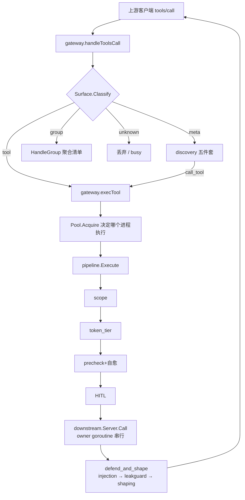

# 数据面

数据面是「一次 `tools/call` 从上游客户端进来、到下游 MCP server 回来」这条路上的全部代码。它由十个包
组成，各自只负责一层，并且层与层之间的边界是靠**类型和依赖方向**保证的，不是靠约定：

- `internal/downstream` 拥有**连接**：进程/HTTP 连接的生命周期、串行调用队列、断路器、重试、健康探测、
  派生实例池。它不知道「工具叫什么名字暴露给客户端」。
- `internal/router` 拥有**命名**：把多个 server 的工具聚合成一个带命名空间的目录，并提供唯一的反向溯源
  `RouteOf`。它不知道谁能看见什么。
- `internal/pipeline` 拥有**治理**：冻结顺序的四道门 + 调用 + `defend_and_shape` 后置钩子。整个仓库只有这
  一条执行路径，门链不可分叉。
- `internal/gateway` 只做**装配**：把上面三层、可见性（`internal/scope`）、发现面、预算面接起来，并处理
  上游 MCP 协议、启动次序、热更新、控制链路。它自己不实现任何治理判定。
- `internal/discovery`（含 `toolsig`）拥有**曝光**：同一份可见工具集在 full / grouped / lazy 三种模式下呈现
  成什么名字，以及 lazy 模式的五件套 meta-tool。它只计算和排版，从不执行。
- `internal/shaping`（含 `toonenc`）拥有**预算**：把一次结果裁到字节预算内，剩下的用 `fetch_result` 游标交
  还。它是省钱机制，不是安全边界。
- `internal/ratelimit` 是 M2 的可选面：给调用加配额。它刻意**不**新增治理接口——拿到的是 `*pipeline.Pipeline` 本
  身，ratelimit 包装的是 `CallRequest.Call` 闭包。ratelimit 已接进 stdio 网关（见本文末尾该包的「当前装配
  现状」）。

协作关系上有两条贯穿全局的纪律，读任何一个包之前都要先记住：

1. **暴露名是不透明句柄。** 暴露名由 `sanitize(serverID) + "__" + sanitize(rawTool)` 生成，但 serverID 和工具
   名本身可能含 `__`，所以按 `__` 切分是歧义的，全仓库禁止。任何「从暴露名回到 (server, tool)」都必须走
   `router.RouteOf` 的 map 查表。
2. **失败方向是分层的。** 门链（scope / token tier / precheck / HITL）一律 fail-closed；预算与省钱机制
   （shaping、toonenc、ratelimit）一律 fail-open 并且要吵（打日志、置 `Degraded` 标志）。把 fail-open 的东
   西塞进 fail-closed 的链条里，就是限流器变成旁路的方式——这正是 `ratelimit` 不做成第五道门的原因。

一次直连调用的实际数据流：



图里 `execTool` 只有一处，`pipeline.Execute` 也只有一处——直连 `tools/call`、lazy 的 `call_tool`、skills 这个
host 侧 provider 全部汇到这里。这不是风格偏好，是 canonical.md §2 的硬约束。

---

## internal/downstream

**一句话职责**：拥有一个下游 MCP server 连接的全部生命周期——拉起/拨号、握手、串行调用队列、断路
器、重试、工具表缓存、健康探测、以及「同一个 server 跑成多个实例」的派生实例池。

### 关键类型与入口

`Spec` 是一个下游连接的运行期描述，由 `SpecFromEntry` 从 `registry.ServerEntry` 唯一地翻译而来（gateway、
daemon、CLI 都走这一个函数，所以新加一种传输不可能在一个调用方落地而在另一个调用方被悄悄丢掉）。
`Deps` 是注入的协作者集合：日志、`secrets.Resolver`、`TokenSource`、拨号覆写、断路器/重试/重连参数、
ping 周期、帧级 trace 日志。

`Connect(ctx, spec, deps) (*Server, error)` 完成「拨号 + `initialize` + 首次 `tools/list`」并启动 owner
goroutine；整个首连由 `Deps.ConnectTimeout`（默认 `DefaultConnectTimeout` = 120s）兜住，这个值故意给得很
宽，因为 npx/uvx 冷缓存启动可以慢到分钟级。

`*Server` 的对外面很窄：`Call`（发起 `tools/call`）、`RefreshTools`、`Reconnect`、`Ping`、`Health`、`Tools`、
`OnListChanged`、`OnPeerRequest`、`Close`。`Pool` 与 `Lease` 是派生实例的生命周期管理器。`ServerLog` 是每
server 一份的 JSON-RPC 帧日志（默认关闭）。

### 不变量与失败方向

**owner goroutine + `calls` 通道是并发模型的全部。** 每个 `Server` 恰有一个 owner goroutine 消费容量为 1 的
`calls chan callReq`——用通信串行化，不用互斥量。调用方阻塞在 `Server.Call` 里等 `reply` 通道（buffered(1)，
所以 owner 永远不会因为写回复而阻塞）。这样一个休眠中的重试或一个慢下游，占用的是 owner 的时间，不
是调用方 goroutine 的时间。队列上跑三种 `callKind`：`kindCall`（受断路器管辖）、`kindRefresh`
（`tools/list` 重查）、`kindPing`（健康探测，断路器豁免）。

**断路器判定发生在入队之前。** `enqueue` 先调 `br.allow()` 再往 `calls` 里塞。这个顺序是硬的：冷却期内调用
方立刻失败（`ErrCircuitOpen`），绝不占用队列槽位。断路器参数：连续 `FailureThreshold`（默认 3）次健康失败
开路，`Cooldown`（默认 20s）后允许一个半开探针。半开期同时只允许一个探针在飞。已开路状态下再收到一
个「掉队者」的失败不会刷新 `openedAt`——否则一串掉队者能把停机窗口无限延长。

**只有 `transport.ClassUnavailable` 算健康失败。** 普通错误应答（`ClassFatal`）证明连接是通的，反而**重置**失
败连击；context 取消是中性的（半开探针会 `releaseProbe`，让下一个调用方立刻可以探测）。

**重试语义只覆盖两类。** `execute` 只对 `transport.ClassRetry` 重试，即「证明从未到达服务器」的错误，加上
JSON-RPC code 429（`retry.go` 的 `codeRateLimited`，M0 的自主决定：stdio 传输本身不产生 `ClassRetry`，但一
些 stdio server 会把 HTTP 式 429 包成 JSON-RPC 错误）。发送后的 I/O 错误和普通错误应答**永不重试**——
`tools/call` 不幂等。`RetryAfter` 提示会被采纳并向上抖动（只加不减）；没有提示时是指数退避 + 50–100% 抖
动，默认 3 次尝试 / 25ms 基准 / 1s 上限。

**半开探针失败会重建连接一次。** 若这次调用正是半开探针且以健康失败告终，`execute` 通过拨号工厂重建连
接并在新连接上重试一次探针。这里承认了一个残留窗口：进程恰好死在调用中途时可能双执行；这是探针语义
的既定代价。

**重连计数器跨成功重连保留。** `Server.reconnects` 是重连退避的指数，`respawn` 成功后**不清零**——一个反复
崩溃的 server 必须一路爬退避阶梯，而不是永远在基准延迟上锤启动器。只有 `Reconnect()`（人的显式动作）
把它清零，而且前后各清一次：清一次让本次尝试不等退避，事后再清一次让手动重连不被计成自动重连。重连
阶梯与调用内重试是**两套参数**：`withReconnectDefaults` 给的是 250ms 基准 / 30s 上限，因为重连的代价是一
次进程启动。第一次重连（`n == 1`）不等待，指数用 `min(n-1, 16)` 封顶。

**HTTP 410 Gone 是终局。** `ErrEndpointMoved` 既不重试也不重连（重连只会复现 410），并且带上冻结的补救
文案 `movedHint`（"update the configured URL: …"）——错误文案本身是契约，有测试断言。

**ping 探测与断路器是两回事。** 断路器管的是工具调用，探针观察的是连接；一个能被断路器拒绝的探针永远
看不到恢复，所以 `kindPing` 对断路器豁免。判定规则：**服务器给出的 JSON-RPC 错误应答算存活**（老 server
对 `ping` 回 method-not-found，往返完成了，这是活性探针唯一有资格得出的结论）。三次连续瞬时失败翻
`ConnError`；`hardConnError` 集合（ECONNREFUSED / EHOSTUNREACH / ENETUNREACH / ENETDOWN /
`ErrEndpointMoved` / `transport.ErrClosed` / `os.ErrProcessDone` / `io.ErrClosedPipe`）一次即翻。背景探测是
opt-in：`Deps.PingInterval == 0` 就没有 prober，单个短命 stdio gateway 不需要付这个成本。单次 ping 有 10s
超时，不能堆在卡死 server 的队列后面。

**`tools/list` 做 leader/waiter 合并，`tools/call` 绝不合并。** `listMerge` 让并发刷新只做一次往返；等待者继承
leader 的结果——这对刷新是正确的（两者本来会打到同一个连接），对不幂等的 `tools/call` 则是错的，所以合
并器只用于这一个方法。有一个细节：等待者若继承到的是 **leader 自己的 context 错误**（leader 的调用方按了
Ctrl-C），而自己 context 还活着，就会自我提升为 leader 重试一次，且只重试一次。

**secret 解析 fail-closed。** `${SECRET_X}` 在**拨号时**才对 vault 展开（这样轮换过的密钥在下次重连即生
效，也避免解析后的凭据长期驻留在配置值里）。未解析的占位符是**错误**，绝不是原样透传：把字面量
`${SECRET_GITHUB_TOKEN}` 发上线会产生一个和「令牌过期」一模一样的 401，运维会去调错方向的 bug；展开
成空串更糟，会把带认证的端点变成匿名端点。错误只提 KEY 名，从不提值。

**vault 复合键与 `_global` 回退。** `resolveScoped` 先查 `(serverID, spec.ScopeName, key)`，未命中再查
`(serverID, "_global", key)`。这个回退是派生实例可用的前提：运维存一次 `GITHUB_TOKEN`，所有 root 派生实
例都继承；在某个具体 scope 下存值则**覆盖**那一个派生。任一层的 vault **错误**都直接中止——坏掉的钥匙串
绝不能悄悄把 scope 凭据降级成共享凭据。

**派生实例：`Spec.ID` 永不改变。** 派生只特化连接参数（`Args` / `Env` 值 / `Cwd` 的 `${ROOT}` 展开 + 显式
`Env` 覆盖），`Spec.ID` 保持基线 server id，因此 `router.RouteOf` 仍是调用的唯一溯源、scope 交集仍按
`(serverID, rawTool)` 匹配、审计仍写运维配置的那个名字。变的只有 `Spec.ScopeName`（= derive key），让派生
能持有自己的 vault 条目。`URL` 与 `Headers` **故意不派生**——改个 header 不需要新连接，per-call 的
RoundTripper 注入就够了（"headers-only 快路径"）。`expandRoot` 在 root 为空时保留占位符原样，而不是展开
成空串：`--project ` 或 cwd `""` 会静默跑错目录，未展开的占位符则在 spawn 时大声失败。

**`Pool` 的四条性质**：LAZY（首次 `Acquire` 才拨号，且用调用方的 context、同一套 `Deps`）、引用计数 +
**延迟关闭**（`Release` 只启动闲置时钟，`Sweep` 才真关，默认 `IdleTTL` 30 分钟、扫描周期 5 分钟；在两个
root 之间来回切的 agent 不该每次切换都重启进程）、**封顶**（默认每 server 4 个派生，超限返回基线实例并置
`Lease.Fallback` + 打 warn）、**级联**（`CloseKey` 一次干掉某个 derive key 在所有 server 上的实例，连引用中的
也关——会话已经死了，等它只会为一个收不到回复的客户端吊着进程）。失败方向很明确：**派生连不上是错
误，绝不静默回落到基线实例**，因为那会用错误的 cwd/env/凭据执行调用，恰恰破坏了运维要的隔离；只有
「封顶」这个运维自设的上限才回落。

**启动崩溃必须留下证据。** 握手失败的错误里嵌入子进程 stderr 的最后 20 **行**（每行截断到 400 字节，用
` | ` 连接）。这是 `transport` 那 4KiB 字节窗口的**投影**而不是第二份捕获；窗口满时丢弃第一行，因为 4KiB
切口会落在行中间，半行比没行更糟。

**帧日志的位置。** `ServerLog` 放在这一层而不是 `internal/mcp/transport`，因为 transport 只依赖标准库、不知
道 server 身份也不知道数据目录，而这里两者都有、且帧还是完整的（params 进、raw result 出）。`callTransport`
是帧跨越下游边界的**唯一**位置，所以也是唯一喂 trace 日志的位置。日志写入用 `audit.Writer`，背压时丢弃而
非阻塞——trace 日志不能拖慢一次工具调用。nil `*ServerLog` 的方法都是空操作，调用方不需要判空。

**HTTP 侧三件事在这一层。** 因为传输门面是纯标准库、不许知道这些：SSRF 屏蔽（`netguard.DialControl` 作
用在**解析后的地址**上，只对 `ProvenanceLocal` + **字面量** loopback 开一个口子——RFC1918/CGNAT/link-local
即使对 local server 也照堵，因为云元数据服务和内网主机就住在那些段里；主机名从不解析，DNS 答案可以否
定信任但绝不能授予信任）；`${SECRET_X}` 展开；bearer 凭据的注入与 401/403 之后的**一次**刷新 + **一次**
重放。这是全仓库唯一一处重复执行不幂等调用的地方，成立的理由是：401/403 由服务器在派发调用**之前**决
定，所以拒绝本身就是「请求没有产生副作用」的证据；而且必须 `GetBody` 可重放才会重建请求。显式配置的
`Authorization` header 永远压过 vault 凭据。

### 当前装配现状

`internal/gateway` 只用 `Log` / `Dial` / `ConnectTimeout` 三个 `Deps` 字段，且 `specsFromSnapshot` 只接受 stdio
传输。因此 HTTP 传输、secret 解析、OAuth 刷新、背景 ping、帧 trace 在 gateway 路径上都**没有被装配**——它
们被 `internal/cli`（`server test`、`doctor`、`vault`）使用，也各自有单元测试覆盖。

---

## internal/router

**一句话职责**：把若干下游 server（以及 host 自供的 `Provider`）的工具聚合成一份带命名空间、确定性的目
录，并提供唯一合法的反向溯源。

### 聚合契约

活连接聚合与缓存聚合走**同一个** `build` 核心，所以缓存服务的 `tools/list` 不可能和活目录漂移。
`*Router` 是不可变快照，变更时重建并原子换指针。

`RouteOf(exposed) (Route, bool)` 是唯一合法的反向映射：纯 map 查表，零字符串解析。缓存构建的条目
`Lookup` 给出的 `*downstream.Server` 是 nil——可列可路由，**不可调用**。`LookupProvider` 只对 host
自供的条目返回 true，所以调用方不可能把真 server 的工具误当成 host 服务的。

`Provider` 是 host 自己就能服务的工具源（skills 伪 server 就是它的第一个实现）。它按**完全相同**的规则聚合——
同样的暴露名规则、同样的碰撞后缀、同样的 `RouteOf` 溯源、同样进 scope 交集、同样走
`pipeline.Execute`。差别只有一处：字节从哪来。`BuildWith` 把 providers 排在 servers **之后**追加，所以
provider id 撞上 server id 时报的是重复错误，且**配置的 server 赢**——运维能看见和编辑的那个东西优先。

`Catalog`（`catalog.go`）是给 `internal/scope` 消费的工具目录快照：server → **原始**工具名，排序去重。暴露
名绝不出现在这里——scope 交集只按原始名键控（作用域链不变量之一）。注意它和 `internal/catalog`（策展
的 server 目录）是两个东西，A.4 有裁决。

### 不变量与失败方向

**暴露名生成是确定性的三段规则。** 基名 = `sanitize(serverID) + "__" + sanitize(rawTool)`，`sanitize` 把
`[a-zA-Z0-9_-]` 之外的每个 rune 换成 `_`。碰撞时按「原始工具名升序、serverID 作次键」分配 `_2` / `_3` …；
如果生成的后缀名本身已被占用（比如组 `x` 生成了 `x_2`，而基名 `x_2` 也存在），继续向上扫。基名遍历按排
序后的顺序进行。结果：同样的 servers/tools/policy 永远产生同样的暴露名和同样的 `List` 顺序，有 golden 测试
锁死。

**禁止按 `__` 切分。** 这条写在包注释里，是全仓库规则：serverID 和工具名自身可能含 `__`，切分是歧义的。
本包内部一次都不做，所有反查都走 `build` 时建好的 map。`gateway` 里想判断「这个名字有没有路由」也是调
`routable()` → `RouteOf`，而不是解析名字；`discovery.IsBareName` 是全仓库唯一检视 `__` 的地方，而且它的结
果**只用于日志**，从不用于路由。

**`Policy` 解释 `Disabled` 与 `Quarantined`。** 两者都在聚合期把工具整个摘掉：不列出、不可搜索、不可
describe、也不可路由。键**故意不同**，各自对齐产生它的存储：`Disabled` 按 `(serverID, 原始工具名)`（审批
记录是防改名的），`Quarantined` 按**暴露名**（隔离集记录的就是 agent 真正能调的名字，#423）。因此
`Quarantined` 的过滤发生在碰撞后缀分配**之后**——隔离一个工具不能把和它撞名的兄弟重新编号。
`gateway` 在 `toolpolicy.go` 里从 integrity 的两个 store 填这份 Policy 并热重载；`cli/tool.go` 的离线列表
仍传零值（那是运维视角，见该文件注释）。`Allow` / `DenyDestructive` 与 per-client/session 的 View 层仍是接缝。

**`CatalogOf` 跳过 nil server。** 消失的 server 就是不贡献任何工具，scope 层把「不存在」当成「不可见」，这
是关闭方向。

---

## internal/pipeline

**一句话职责**：全仓库唯一的 `execute_call` 管线——冻结顺序的四道治理门、下游调用、至多一次参数自愈重
试、以及贯穿成功/错误两个分支的 `defend_and_shape` 后置钩子。

### 请求契约

`CallRequest` 的 `ServerID`/`RawTool` **必须**来自 `RouteOf`。`Annotations` 是那个**缺失本身承载信息**的
字段：无注解 = destructive，fail-closed。设置 `CallWithArgs` 就是**开启**参数自愈的开关——管线只能重发它
自己控制参数的调用，而 `CallFunc` 按构造就把参数闭包捕获了。

**`Options` 每个字段都可为零**，零值 `Options` 装出的是 M0 基线（计数 + 放行 + 透传），那是有文档记录
的「无授权装配」，不是错误状态。

`BlockedError` / `ErrBlocked` 是门拒绝的类型化载体，`Code` 是稳定的机器可读拒绝码（`E_SCOPE_DENIED`、
`E_TOKEN_TIER_DENIED`、`E_ARGS_INVALID`、`E_HITL_DENIED`、`E_HITL_TIMEOUT`、`E_HITL_UNAVAILABLE`、
`E_DESTRUCTIVE_DENIED`），一旦发出即 ABI。

### 不变量与失败方向

**门链顺序冻结：`scope → token_tier → precheck → hitl`。** 有测试把它钉死。第一个报错即短路，
调用根本不会到达下游。顺序的理由：token tier 是**机器**判定的那一半，一个只读凭据本来就不该做的调用不
值得占用一个人的注意力，所以它排在 HITL 之前（裁决 #16）。

**四道门的具体行为与失败方向：**

- `scopeGate`：`ScopeAllows(es, serverID, rawTool)`——这个函数被 gateway 的 `tools/list` 投影和本门**共用**，
  所以「能列」和「能调」不可能不一致。`nil es` / 不可见 server / 不可见工具都返回 false（fail-closed）。但
  「压根没有 scope 权威」（`Options.Scope == nil`，或它返回 nil，即 registry 不可用的缓存服务模式）是在**调
  用之前**判定的，此时放行——那个状态下根本不存在要执行的治理配置。
- `tokenTierGate`：`TierCovers(req.CallerTier, ToolTier(req.Annotations))`。覆盖按**等级**判定（write 可调 read，
  destructive 可调一切）。两个关闭方向：注解缺失/不可解析的工具算 destructive；无法识别的 `CallerTier` 字符
  串覆盖不了任何东西。空 `CallerTier` 是唯一的放行情形，且不是漏洞：它表示「本装配没有等级权威」——
  stdio gateway 服务的是人自己的会话，管道上不带凭据。只有 HTTP 面（`internal/httpbridge`）会铸 tier。
- `precheckGate`：**浅层**校验——`Args` 必须是 JSON 对象（或空）、`required` 顶层字段必须在场、在场的顶层字
  段类型必须对得上。完整的 JSON Schema 校验**故意不做**，下游服务器仍然是权威校验方。缺失或不可解析
  的 `inputSchema` 直接跳过校验（fail-open：那是我们没读懂的下游数据，因为自己的解析能力有限而否决合法
  调用是不对的）。多处违规时报的一定是同一个字段（名字排序后遍历），因为错误文案是契约。
- `hitlGate`：先做 `DenyDestructive`——这是机器可判的全局开关，**不需要 broker**，无论有没有 `Asker` 都强
  制。然后 `HumanApproval` 对剩下的每一次调用都要求人工批准。两个开关刻意分处两端；中间那档（只对破坏性
  调用发问）当初只能由 client 层设置，随该层一并删除，而不是留下一个「gate 会读、却没人能设」的字段。
  annotation 仍然决定请求以什么**分类**呈现给审批者，而不决定要不要发问。走 broker 时，broker **报错 = 阻断**
  （`E_HITL_UNAVAILABLE`），未知 decision 字符串也阻断——只有显式 approved 才开门。审批绑定
  `HashArgs(req.Args)`，一次批准只覆盖这一组参数。

**precheck 的自愈发生在拒绝之前，并且 MUTATE `req.Args`。** 这一点很关键：修好的参数会被后面每一道门
（尤其是 HITL 的 args hash）和调用本身看到，所以「批的就是跑的」仍然成立。修复必须真的能通过 precheck
（`tryHeal` 会用修好的参数重跑一次 `precheckViolation`），否则不算修复。

**自愈只做可证明安全的两类修复。** 缺失的 required 字段只能从 schema 自己的 `default` 填；类型不匹配只在
转换**逐字节往返**时才做（`"5"` → `5` → `"5"`）。明确不支持：`"5.5"` → integer（丢小数）、`"007"` → 7（不往
返）、标量 → 数组（那是形状猜测不是转换）、任何东西 → object。至多**一次**重试，没有阶梯、没有循环。每
次自愈（前置修复和后置重试都算）都进 `OnSelfHeal` 审计，事件里只有**字段名和修复种类**，从不含参数值。

**后置自愈只在下游回传了它自己的 `inputSchema` 时才发生。** 逻辑很直白：如果拒绝里没带新 schema，那么
按缓存 schema 能修的东西 precheck 门已经修过了，重试只会原样重放同一个调用。分类器
（`isInvalidParams`）接受两种形状：JSON-RPC code `-32602`，或者措辞匹配参数错误方言的 `isError` 结果；并且
有一张**否决名单** `authSmellRe`（401/403/unauthorized/rate limit/timeout/tls/…），认证或传输失败哪怕文案里提
到了 parameter 也绝不被重分类——把 401 误标成 invalid_params 会让 agent 反复重试一个永远不可能成功的调
用。修复后的重试若**没有**成功，交付的是**原始**结果：给 agent 的补救提示必须描述它真正发出的那个调
用，而不是我们的推测性改写。

**`defend_and_shape` 恰好执行一次，且作用在最终结果上。** `Execute` 里的顺序是「调用 → 自愈 → shaper」，
不是「调用 → shaper → 自愈 → shaper」。对一个即将被取代的中间 invalid_params 应答做扫描和预算，会重复
消耗 shaping 游标，还可能留下一个指向没人会收到的结果的截断横幅。

**`defend_and_shape` 内部三段顺序也是承重的：`injection → leakguard → shaping`。**

- injection 先跑，因为被 block 的结果已经没有 payload 可泄漏了；
- leakguard 必须在 shaping **之前**，因为扫描必须看到**完整**结果（否则 payload 可以躲在预算之外偷渡），而
  且 shaping 缓存里永远不能存未脱敏的密钥（7.6）；
- 两个分支都扫：恶意 server 不能靠回一个 JSON-RPC 错误来躲开扫描。被 withheld（block）的结果
  不再被 leak 扫描也不再被 shaping——它里面没有任何下游 payload 幸存，而它的 recovery trailer 必须保持是最
  后一个、未被截断的 block。

**label 模式在错误分支上是透传的。** 改写 JSON-RPC 错误会摧毁类型化的下游错误（code 透传），而 label 按
定义就是建议性的——block 模式才是执行路径。同理 `labeledResult` 在 content 不是可插入的 JSON 数组时原样
交付。

**leakguard 的两个方向相反。** 检测 fail-open（没匹配上的密钥被交付），处置 fail-closed（inline 模式下无法改
写的 payload 是**扣留**而不是不脱敏交付）。audit 模式的扫描完全跑在调用路径**之外**（自己的 goroutine +
`context.WithoutCancel`），所以裁决 #17 敢把它设成默认开——它是免费的；没有 `OnLeak` 消费者时 audit 扫描
干脆不做。非文本 content block（图片、音频、嵌入资源）不扫描，这是**刻意**留下的 fail-open 缺口，写在注释
里以确保它是一个决定而不是疏漏。

**`ToolTier` 与 `DefaultDestructive` 对 `{}` 的答案故意不同**；两道门都会跑，且顺序固定，谁也不削弱谁。
理由属于等级词汇本身，见 [foundation.md](foundation.md)。

**依赖约束**：本包不得 import `internal/ctlapi`（canonical.md §2 规则 3，depguard 强制）——数据面不依赖控
制面。

### 文件地图

| 文件 | 内容 |
|---|---|
| `pipeline.go` | 包契约、`CallRequest` / `Gate` / `Shaper` / `Options`、`New`、`Execute` 的顺序不变量 |
| `gates.go` | 冻结的阶段名与拒绝码、`ScopeAllows`、scope / token_tier / precheck 三道门、浅层 schema 校验 |
| `hitl.go` | `Decision` / `ApprovalRequest` / `Asker`、`DefaultDestructive`、`HashArgs`、HITL 门 |
| `tier.go` | 操作等级阶梯：`tierRank` / `TierCovers` / `ToolTier` 及其与 `DefaultDestructive` 的刻意不对称 |
| `selfheal.go` | 自愈规则（default 填充 + 无损强转）、invalid_params 分类器与认证否决名单、后置重试 |
| `shape.go` | `defendAndShape` 三段钩子、injection 的 label/block 处置、recovery trailer |
| `leak.go` | leakguard 段：audit 异步 / inline 改写、`leakSegments` 的来源槽位、`LeakEvent` |

---

## internal/gateway

**一句话职责**：装配并运行 per-client 的 stdio 网关（`agenthub connect --client <id>` 的实现体）——它接上游
MCP 协议、拉起下游、维护目录与可见性，但**不实现任何治理判定**。

### 关键类型与入口

`Run(ctx, Config) error` 是唯一导出的运行入口；`Config` 要求 `ClientID` / `In` / `Out`，其余都有生产默认值。
`LoadToolCache` 额外导出，给离线的 `agenthub tool ls` 读同一份缓存格式（一个写者、一个读者、一个结构
体）。`RootSource` 是 A.5 #30 冻结的迁移接缝：M0 装的是 roots 协议实现 `clientRoots`，将来 clients.json 的显式
roots 实现直接顶上，调用方消费接口本身。per-project scope 层退役后 root 只喂**连接面**（`${ROOT}` 展开与
派生实例键），不再进任何可见性判定。

内部核心是 `gateway` 结构：`rt`（当前目录）、`cat`（原始名投影）、`catGen`（每次换 router 自增，是 surface 缓
存的键）、`surface`、`lastScope`、`servers`、`pool`、`pipe`、`cursors`、`guard`、`ctl`。

### 不变量与失败方向

**启动次序：先答后连。** `initialize` 在拨任何下游之前就回答，下游在后台并发连（时序见
[flows.md](../flows.md) §1）。**registry 加载失败不中止**：空配置起、打 warn、从缓存答。
活 router 未就绪时 `tools/list` 从缓存答
（`router.BuildFromCache*`，同一套暴露名规则），`tools/call` 答**可重试的** busy 错误（`-32000`）。

**缓存目录的取舍有分支**：registry 健康时只服务「当前 enabled 的 server」的缓存工具；registry 坏了时**服务全
部缓存**——那种状态下我们无从知道谁是 enabled 的，「能答就先答」。

**关停之后不再写盘，靠的是封存资源而不是等 goroutine。** `connectAll` 每个下游起一个 goroutine，
**没有任何东西 join 它们**：`shutdown()` 等 `handlers` / watcher / policy watcher / ctl link / pool，
但不等这些。一个刚好赢了 `lifeCtx` 取消竞争的 connect 会继续走到 `persistTools`，
于是「网关已停」与「网关还在写盘」可以同时为真。对把磁盘状态当治理事实来源的产品，
这比它平时露出的那个表象（`<cache>/tools` 自己长回来导致 TempDir 清理失败）严重：
一次**因策略变更触发**的关停之后，可能落下一份按刚被撤销的策略采集的工具缓存。

修法是 `toolCache.seal()`：`shutdown()` 一开头就封存缓存，此后 `write` 一律返回 `errCacheSealed`
且不碰磁盘。`mu` 覆盖**整个** `write` 而不只是标志位检查，所以 `seal()` 会等到在飞的那次写完成——
保证是「`seal()` 返回后目录静止」，而不是「大概率静止」。

**为什么不是加 WaitGroup 等 connect goroutine。** `downstream.Connect` 由 `ConnectTimeout` 兜底
（默认 120s，是按冷启动 launcher 缓存定的）。在 `shutdown()` 里等它们，等于把「一个不理会取消的下游」
升格成「能把关停拖住两分钟」。那是拿一次有界的小竞态换一次无界的停顿，方向更差。
封存资源这条路上，等待只有一次文件写，而且不管 connect goroutine 活多久，不变量都成立。

**scope 是查询期投影，绝不触碰连接。** `scope.go` 的整个存在意义就是这条不变量：收窄 scope
（profile 编辑、会话 overlay）永远不动任何下游连接；只有 `servers.json` 的 spec 变更才会重连。
`currentScope()` 的失败方向：没有 registry store = 没有 scope 权威，返回 nil（管线的 scope 门把 nil 当成无权威
模式）；**有** store 但解析失败，返回**空** scope（零个可见 server）——错误绝不能扩大可见性。
`catalogFromRouter` 用 `RouteOf` 把 router 投影回原始名目录，同样绝不切分暴露名。

**`refreshScopeAndNotify` 只在内容哈希变动时推送。** 只有内容变化才值得一次推送，不做重
建放大。内容变化同时可能改变了发现**模式**，所以客户端看到的是另一张 surface：缓存的 surface 不需要显式
失效（它的键里带 scope 哈希），但 `SearchGuard` 需要——它的连击描述的是一张已经不存在的工具面，所以要
`Reset()`。

**surface 缓存键 = `discovery.Key{Generation, ScopeHash}`**，`catGen` 在每次换 router 时自增，scope 哈希覆盖
每个可见性相关字段。所以「陈旧的 surface」在结构上不可能被服务出去——没有显式失效逻辑，也就不存在漏
掉失效的可能。两个并发请求为同一个键各建一次 surface 是无害的（`discovery.New` 是纯函数）；建在已被换掉
的目录上的那一份会被丢弃。

**热更新：两条通道，一个漏斗。** 本地 registry watcher（fsnotify + 轮询）和 daemon 控制链路
（`LinkEventRegistry`）都汇入 `onRegistryChange`。变更通知**只是通知，不是快照**——处理器自己重读 registry，
再按 `generation >= applied` 的判据经 `Applier` 采纳。按文档种类分流影响面：`servers` 走 `syncServers`（diff
enabled spec 集合，只有新增/移除/改变的 server 才重连或关闭，其余连接保留——不要重启风
暴），`governance` 触发 skills face 的开关同步（开关翻转改变**目录**，必须重建），而 `profiles` / `clients` /
`governance` 全都是 scope 输入，只做失效 + 重算 + 按哈希变动推送，**永不触碰任何下游连接**。加载失败时保
留旧配置且**不推进 applied 状态**。

**`connectOne` 有一个陈旧定义检查。** 连接完成后要重新确认「这个 spec 现在还在，并且没变」，否则关掉刚
建好的连接——绝不把过期定义接进目录。`specEqual` 只比较连接相关字段。

**`execTool` 是网关唯一的执行路径。** host 自供的 provider（skills）在 readiness 判定**之前**解析：它们没有下
游要等，在别的 server 连接时把它们说成 busy 是撒谎。派生实例的选择（`acquire`）发生在**路由之后、门链之
前**——「哪个进程执行」是连接面的 per-call 决定，路由（因而可见性、scope、审计）无论如何都是基线
server。routed 工具的 `inputSchema` / `annotations` 从**基线** server 的工具表读，因为派生实例按构造服务同一
份目录。

**未知名字 fail-closed 丢弃，绝不重解释为 meta-tool。** 唯一的例外走得很讲究：如果名字在目录里**有路由**但
不在 surface 上，说明藏它的是 **scope**——那么调用**仍然进管线**，由 scope 门用它的稳定拒绝码来拒绝，因为
7.3 说了执行点在门那里。名字压根解析不到任何东西时才丢弃；此时若下游还在连，答的是**可重试的 busy**
而不是「无此工具」——告诉 agent 一个工具不存在会教会它别再问。

**取消语义。** `tools/call` 有独立 goroutine 和独立 cancel，`notifications/cancelled` 能到达它。被取消的请求
**不发回复**（MCP 契约：取消的接收方不应期待回复）。

**RootSource 是单飞 + 代次校验的缓存。** 并发 miss 合并成一次 `roots/list` 反向 RPC（预取和下游 peer 请求在
每次失效后都会赛跑，客户端必须只看到一次查询）。`invalidate` 自增 `gen`，让在飞的取回丢弃自己（可能已陈
旧的）结果。没声明 roots capability 的客户端得到空 root 集，且**也缓存**——去问它会违反 capability 契约。整
个 roots 协议带 `DEPRECATED-UPSTREAM` 标注，移除时只有 `RootSource` 的实现会变，调用方不动。

**HITL asker 永远接线。** `gwAsker` 无论有没有 daemon 链路都装上：没有链路时它答 Unreachable，于是触发审
批的调用被拒绝（fail-closed），而不触发审批的调用完全不受影响。审批请求携带原始参数（只走认证过的
UDS，两侧都不落盘）和**活定义**的指纹（`integrity.Fingerprint`）；无法指纹化时留空——空指纹匹配不上任何记
住的授权，所以调用照样去找人（fail-closed）。

**`shapeResult` 是管线的 `ResultShaper` 接缝，不是管线之外的一层。** 这是为什么每条执行路径都被同一条规
则预算——因为它只被应用了一处。游标 id 在 shaping **之前**铸出（`Shape` 要把它嵌进截断 trailer）；没用上的
id 只是在一个本来就可猜的序列里留个洞，不花钱。remainder 存不下时**交付完整结果**而不是交付一个续接已
经丢失的分页。

**每个日志/统计面失败都降级，不影响服务。** JSON 日志文件打不开就退化成纯文本；savings 流打不开就
`nil`；工具缓存目录不可用就跳过缓存。控制 socket 路径解析不了只损失协调功能。

**`inproc.go` 是 HTTP 面没有第二条执行路径的原因。** `Conn`/`Open` 把同一个网关体接在内存管道上，
请求写进的是与 stdio 面**同一个 frame reader**。`Counters()` 是证明它的接缝：进程内路径的门计数
必须与 stdio 完全一致。

**`statereport.go` 是下游运行时状态的来源。** 网关是唯一持有连接的进程，所以只有它能回答"这台
服务器现在怎么样"——它快照 `serverStates()` 并经 `POST /v1/gateway/{sid}/servers` 上报，daemon 只做聚合。

**凭据怎么进入这套装配。** `Config.CallerTier` 是这个网关服务的**凭据**的操作等级（HTTP 面从
agent token 铸出，stdio 恒为空——终端管道上没有凭据，所以没有 tier 可执行）；它原样进入
`pipeline.CallRequest.CallerTier`，由 token 层级门比对，本包不重新实现判定。
`Config.ScopeLayers` 是凭据的 server allowlist 与 profile pin 的入口，接到
`scope.Sources.Extra` 上——与持久化三层同一个 `Merge`，安全字段取交集，**只能收窄**。
两者都是 `agenthub connect` 用不到的字段，其零值就是 stdio 的行为。

### 当前装配现状

`pipeline.Options` 里 gateway 只填了 `Scope` / `Asker` / `Scanner` / `InjectionPolicy` / `ResultShaper`。因此
leakguard、参数自愈（`CallWithArgs` 从未设置）、TOON 输出格式、intent 变体、pin 集合在
stdio gateway 里都**未装配**，尽管这些包本身都完整实现且有测试。

限流是例外：它**已接线**，但接线点不在 `pipeline.Options` 里——配额是包在 `CallRequest.Call` 外面的准入
包裹（`ratelimit.go` + `runCall`），不是管线的一个阶段。

---

## internal/discovery

**一句话职责**：决定一个会话被展示哪些名字、一个进来的名字意味着什么——三种曝光模式（full / grouped /
lazy）、lazy 的五件套 meta-tool、词法排序器、搜索循环守卫、以及搜索审计记录。

### 关键类型与入口

`Visible(rt, es) []Tool` 把 router 目录按会话的 effective scope 投影一遍——用的是 `pipeline.ScopeAllows`，**和
管线 scope 门完全同一个谓词**。`New(Options) *Surface` 把那份可见集冻成一个不可变快照。`Surface` 的对外
面：`List()`（`tools/list` 答什么）、`Classify(name)`（进来的名字是什么）、`Search` / `HandleSearch`、
`Describe` / `HandleDescribe`、`HandleStatus`、`HandleGroup`、`ResolveCall` / `ResolveCallVariant`。

`SearchGuard` **刻意不属于** `Surface`：守卫状态是 per-session 的、必须活过目录重建，但又必须在 scope 变更
时重置。生命周期由调用方（gateway）负责。

`PinSet` / `StaticPins` 是配置钉选的接缝；`Trace` 是搜索审计记录；`Error` 是带稳定 code 的类型化 meta-tool 失
败。

### 不变量与失败方向

**一份 scope，三个执行点。** `tools/list`、`search_tools` 的候选过滤、`call_tool` 的路由校验读的是**同一个**
`*scope.EffectiveScope`，而且本包从不自己重新推导可见性——`Visible` 投影一次，`Surface` 是那次投影的不可
变快照。不在 Surface 上的工具既列不出、搜不到、也不会被推荐。`describe_tool` 也走 `Surface.byExposed` 这同
一张 map，所以它在**结构上**不可能透出 search 藏起来的工具——这是代码的性质，不是需要谁记住的规则。

**确定性即契约。** 曝光集合、排序、摘要截断、每一句用户可见文案都被 golden 测试冻结。并列一律按暴露名
升序断，绝不依赖 map 遍历顺序。分数用整数正是为了让「同分」可精确判定。

**未知名字 fail-closed。** `Classify` 的解析顺序固定：（模式允许时的）meta 名 → grouped 聚合名 → 可见工具集
→ Unknown。一个**裸名**（不含 `__`，表面上长得像 meta-tool）的未知名字和别的未知名字待遇完全一样。冷
目录下每个名字都是未知的——这是关闭方向，且是刻意的。`exposesMeta` 比 `IsMetaName` 更窄：变体开着时的
`call_tool`、变体关着时的三个变体，都只是**被保留**而没有对这个会话**列出**过，把它们判成 meta 等于开一扇
客户端看不见的门，所以它们落到 Unknown。

**三种模式的取舍**：

- **full**：每个可见工具原样列出。
- **grouped**：每个可见 server 一个 `<server>_tools` 聚合条目 + 一个 `call_tool`，共 servers+1 条。工具**数量**
  塌缩（full 昂贵的部分是 schema，grouped 一个 schema 都不发），但 agent 仍然**不需要搜索**：每个聚合条目
  的描述里**点名**了那个 server 的工具（上限 `groupNameListLimit` = 40 个，超出说明还有多少、怎么拿）。所
  以发现依然是**精确的**（一个名字要么被打印、要么不可见），只有 schema 被推迟了一个来回。`call_tool` 排
  在**最后**，让 agent 该先读的聚合条目领头。
- **lazy**：五件套 meta-tool（冻结顺序）+ 钉选工具。钉选工具的暴露名若与 meta 名冲突则丢弃——meta 面绝不
  能被遮蔽（今天 router 生成的暴露名一定含 `__`，撞不上，但规则是**强制**的而不是假定的）。

**五件套 meta-tool 的名字与 schema 都是 ABI**：`status`、`search_tools`、`describe_tool`、`call_tool`、
`fetch_result`。schema 写成字面量而不是从结构体 marshal，就是为了那串字节可评审、可 golden 测试（agent 对
措辞敏感）。所有 meta-tool 的参数用 `DisallowUnknownFields` 解码：拼错的参数必须是响亮可恢复的错误，绝
不能是被静默忽略的字段——那会让 agent 相信它要到了它其实没要到的东西。

**`call_tool` 和 `fetch_result` 在本包里没有 handler，这是设计。** 执行必须走 `internal/pipeline`，分页必须走
`internal/shaping`，所以本包停在 `Resolve` / `Parse`。

**intent 变体（裁决 #18）。** lazy 模式的单个 `call_tool` 可以拆成 `call_tool_read` / `call_tool_write` /
`call_tool_destructive` 三个独立 meta-tool。它买到的东西恰好一件，而且值那几个额外名字：权限 UI 只能整
「工具」允许或拒绝的客户端（Claude Code 的 allowlist 之类），可以放行 `call_tool_read` 而让写操作仍需确
认。校验用的是**相等**而不是覆盖（`TierCovers`）：如果 destructive 变体也接受 read 工具，每个变体就是下面
那些的超集，放行最上面那个就等于静默授予一切——那正是拆分本该让人看见的性质。所以每个工具**恰有一
扇正确的门**，拒绝文案会点名该用哪一扇，agent 下一次尝试不必再搜一遍。`callWithFor` 是**唯一**做这个选择
的地方，`ResolveCallVariant` 在入口用同一个推导执行，所以给 agent 的指针和它必须通过的检查不可能不一
致。无注解的工具落到 destructive 变体（fail-closed）。变体开关进 `Key.Variants`，因为它改变 `tools/list` 输出和
`call_with` 的指向，却不动 generation 也不动 scope 哈希——不进键的话 governance 翻转后还会继续服务旧的门。

**`SearchGuard` 的状态机与两处刻意的不对称。** 新 top 名字 → 连击 = 1；相同 top → 连击 ++；无结果 → 清
零；任何**非搜索**动作（`ObserveOther`）→ 清零；scope 变更（`Reset`）→ 清零。连击 ≥ `EscalateAfter`（3）
**且**分数 ≥ `ConfidenceThreshold`（30）才升级成一句祈使文案。不对称一：低置信度的 top **仍然推进连击但
从不升级**——逼 agent 去调一个排序器自己都不太信的工具，等于把一个弱猜测变成一条指令；如果后来某次相
同搜索分数过线，攒下的连击会立刻升级。不对称二：**升级不清连击**——agent 被告知去调之后又搜，就再被告
知一次；只有做点别的事才清。守卫追踪的是一个循环，循环结束才算结束。

**词法排序器的权重与校准。** `weightName` 10 / `weightServer` 4 / `weightDesc` 2，乘以 `exactFactor` 3 或
`prefixFactor` 1，再加 `coverageBonus` 5（奖励覆盖更多**不同**查询词，所以「read file」两词各命中一次的工具
胜过被「read」命中两次的）。每个查询词在每个字段最多贡献一次，出现次数被忽略——往描述里堆重复词买不
到任何东西。`minPrefixLen` 2 防止单字母查询词匹配一切。`ConfidenceThreshold` = 30 的校准：一次精确的工具
名词匹配得 `10*3 + 5 = 35`，纯描述精确匹配得 11，纯名字前缀匹配得 15——所以「confident」的含义是「查询
字面上点了这个工具的名」。零分候选被丢弃：搜索不该推荐它没有理由相信的东西。

**查询验证与隐私。** `MaxQueryBytes` 512、`MaxQueryWords` 64、索引侧 `MaxDescriptionTokens` 256（恶意 server
不能靠一兆字节的描述让每次搜索都变贵）。检查顺序固定（空 → 字节 → 词数），保证同时违反两条限制的查询
永远报同一个 code。`Query` **故意不保留原文**。`Trace` 只记录查询的**度量**（字节数、词数），一个字节的内容
都不记——搜索查询是 agent 撰写的自由文本，可能带密钥、路径或被注入的 payload。工具名和分数是安全的
（它们来自目录不来自调用方）。给这个结构体加字段是一个隐私决定，golden 测试会在有人加内容字段的那一
刻失败。

**describe_tool 的「一个错误，没有 oracle」。** 可以想见的四种 per-id 错误（not_found / invisible /
quarantined / disabled），实现只发**一种**：`not_found`。不存在的、被 scope 藏的、被完整性隔离的、被运维禁用
的，在回复里不可区分——区分开来就等于把 describe_tool 变成一台枚举「这个会话被刻意不展示的那部分目
录」的 oracle。这是 `fetch_result` 对游标、`ResolveCall` 对名字遵循的同一条规则。`MaxDescribeTools` = 5，超
限是**错误而不是静默截断**——截断会让 agent 以为它看到了它要的全部。全部 id 都没解析出来的调用仍返回
**非错误**回复（调用本身是良构的，变成协议错误会让 agent 拿不到补救文案）。

**搜索结果的预算投影（M1.5 改过形状）。** 现在**没有任何** hit 携带 schema：每个 hit 带一行紧凑签名
（`toolsig`），需要 schema 的 agent 去问 `describe_tool`。rank 1 额外带完整描述，其余 rank 带
`SummaryMaxBytes` = 140 字节的摘要（字节界而非 rune 数，因为要防的是 token 预算，字节界是唯一对 CJK 也成
立的界；截断落在 rune 边界上）。`hit.lossy` 标志就是「这一趟 describe 会告诉你新东西」的指针。

---

## internal/discovery/toolsig

**一句话职责**：把下游工具的 JSON Schema 渲染成**一行**紧凑签名，让一条搜索结果的成本从「一份 schema」
降到「一行文字」。

### 关键类型与入口

`Signature` 是渲染结果（`Text` + 是否有损等信息）；`Options.MaxBytes` 是长度预算。`Cache` 按输入指纹
memoize，`Shared()` 是进程级实例——目录索引期（`Surface.buildIndex`）会把整个目录 `Warm` 进去，所以一个会
话的第一次搜索付的是 map 查表而不是 N 次 schema 遍历。第二个实例是合法的，但会静默浪费那次预热，所以
除非测试要隔离，都该用 `Shared()`。

签名长这样：

```
read_file(path:str, encoding?:str="utf8", limit?:int) -> str
```

### 不变量与失败方向

**文法是冻结的**（`testdata/signatures.golden` 锁死）：

```
signature := name "(" [param {", " param}] ")" " -> " type
param     := pname ["?"] ["~"] ":" type ["=" default]
type      := str | int | num | bool | null | any | obj | obj{k,k} | arr | arr<type> | enum{a|b}
```

**`?` 标注的是可选参数，不是必填参数。** 反过来（在必填参数上打标记）也说得通，
裁决用 `?` 标可选是因为实践中可选参数是少数，标记更稀有、行更短。

**`~` 是诚实标记。** 它表示签名**说不全**这个参数：折叠掉的嵌套对象、被截断的枚举、过大的默认值、联合类
型、幸存的 `$ref`、或者列在 `required` 里却没有任何 schema 的名字。它就是那个「describe_tool 会告诉你更
多」的指针。

**参数顺序是唯一的确定性选择。** 先是 `required` 数组**原样顺序**里的必填参数，然后是按字节升序排的可选参
数。JSON 对象成员顺序解码进 Go map 后不复存在，`required` 是 schema 真正携带的唯一顺序信号；别的一切必
须排序，否则就不是确定性的。

**嵌套只展开一层。** 顶层对象参数渲染成 `obj{key,key}`（直接键名，排序，`MaxObjectKeys` 封顶），更深的一
律 `obj`；对象数组是 `arr<obj>`。两种折叠都置 `~`。

**`$ref` 不解析。** `internal/router` 在定义到达本包之前就内联了 ref；万一还有幸存的，渲染成 `any~` 而不去追
——追它意味着本包要持有一个 schema store。

**失败方向：宁可少说，不可多说。** 每个读不懂或不支持的构造都变成 `TypeAny` + `lossy=true`。签名说得比它
知道的少，可以通过 `describe_tool` 恢复；说得比它知道的多则无法恢复。不解析的 schema、或不是对象
schema 的 schema，统一渲染成 `name(~) -> type`——一种形状，不猜。

**长度预算的截断方向是必填优先。** 超过 `MaxBytes` 时参数表被切断并用 `…+N more` 收尾。因为可选参数排在
后面，从尾部丢弃就是先丢可选的；确实必须丢弃必填参数时，用同样的方式声明出来。后置条件：只要骨架
（`name + "(…+N more) -> type"`）放得下，`len(Signature.Text) <= MaxBytes`。**工具名永不截断**——它是 agent 用
来调用的键，一个被截断的键比一行长文更糟。

**缓存策略是满则整体清空，不是 LRU。** 访问模式是「同样的几百个指纹反复命中，直到目录变化」：LRU 的
簿记开销比偶尔一次清空后重渲染更贵，而且清空不可能像次序错乱的 LRU 那样漏出陈旧条目。指纹按
`(name, inputSchema, outputSchema, MaxBytes)` 长度前缀后哈希，所以不同输入元组不可能撞出同一个字节流。

---

## internal/shaping

**一句话职责**：把一次工具结果裁到字节预算内，把余下的部分通过 `fetch_result` 游标交还——这是省 token 的
机制，不是安全边界。

### 两个 Store 实现

`Store` 有两个实现：`MemStore`（stdio gateway 用——**进程就是会话**，游标寿命按构造与客户端连接对齐，没有
东西需要活过重启）和 `FileStore`（daemon 的 HTTP 面用——游标要在会话 TTL 内活过 daemon 重启）。

`Savings` / `EstimateSavings` 提供 token 节省估算，字段与 `audit.SavingsRecord` 一一对应，但本包**故意不
import** `internal/audit`（shaping 在数据路径上，不能把审计写入器一起拖进来），由调用方抄字段。

### 不变量与失败方向

**三条设计裁决定死了功能形状：**

1. 截断在**文本** content block 的字符（rune）偏移处切。结构化 block **绝不切开**，整块推迟。第 1 页保留原始
   block 结构；第 2 页起是被保留 payload 的纯文本切片。
2. 恢复 trailer 作为**最后**一个 content block 追加，且**豁免预算**——它既不被截断也不被包裹。规则与 pipeline
   的注入 trailer 相同：agent 读不到的恢复提示不是恢复提示。因此一页可以超出 `Budget.Bytes` 恰好一个 trailer
   block。
3. `fetch_result` 的游标 id 是一个**按设计可猜**的普通序列（`rc-%06d`，进程全局，不是 per-owner）。**owner
   （会话）校验是唯一的隔离**，而且未知 id、过期 id、别人的 id 全都返回 `notFoundText` 这**一条**消息——可
   区分的答案会把一个可猜的 id 变成探测 oracle。

**owner 比较是常数时间的**（`subtle.ConstantTimeCompare`），因为这是隔离边界，不能在第一个不同字节处短
路。而且 `Fetch` 在 `Store.Get` 之后**再查一次** owner：接口契约要求实现校验，但这是隔离边界，两侧都查。

**预算是经济机制，全面 fail-open。** 每一种意外输入——无法解析的 content 数组、缺失的游标 id、缺席的
owner、存不下的 remainder——都交付**未截断**的结果而不是毁掉它。关闭方向属于 `internal/pipeline` 的门；为
省 token 而丢失调用方的数据，比多花 token 是更坏的失败。

**never-larger 保证。** trailer 不是免费的，所以对一个刚刚超预算一点点的结果，裁过的页可能比原结果**更
贵**。`shape` 在最后比一次：`actualBytes >= baselineBytes` 就退回原结果——每个维度都更好（字节更少 **且**没
扣数据）。

**分页的行走规则。** `paginate` 按顺序填预算，在**第一个装不下的段**停下，之后的段全部推迟。顺序保持不变
正是「线性化后的 rune 偏移」有意义的前提。结构化段是全有或全无；文本段可切，但切片小于
`minPartialBytes`（16 字节）时整块推迟——两个字符的一页加一个 trailer，付出比交付多。

**字节账算得很准。** `escapedRuneLen` 精确复刻 `encoding/json` 的字符串转义开销（含默认开启的 HTML 转
义），有不变量测试与标准库对齐，所以发出的 block 大小是**可预测的**而不是估的。所有切片都落在 rune 边界
上，任何一页都不可能劈开一个 UTF-8 序列。

**`Fetch` 的边界行为。** 负 offset 夹到 0；offset 到达或超过末尾服务一个**空页**（这是成功，不是 miss）——没有
剩余内容时给恢复提示就是撒谎。`page` 里有一个「至少交付一个 rune」的兜底，防止一个永远推进不了的
livelock。

**耐久缓存是普通文件，不是嵌入式数据库（附录 A.6 #2 的裁决）。** 路径
`<data>/cache/shaping/<sha256(owner)>/<cursor>.json`，原子写（同目录临时文件 → chmod 0600 → fsync →
rename），构造时和按需扫 TTL。理由：M0–M1 是零新第三方依赖的房规；访问模式是单键点查，没有查询、没有
事务、没有跨键一致性要求；损坏的条目必须退化成「丢一个游标」，per-file 存储白送这个性质（跳过该文
件），单文件数据库则需要一整套恢复机制才能做到。owner 哈希目录只是把一个会话的游标挪出另一个会话的路
径，它**不是**隔离——`Entry.Owner` 每次读都要校验。

**`validID` 既是形状检查也是路径安全检查**：`FileStore` 会把 id 变成文件名，任何带分隔符、点段或意外字节的
东西必须在到达文件系统之前被拒绝。

**格式重编码的顺序不变量。** `Reformat` 跑在**交付路径**上，也就是在管线的防御已经扫过下游文本**之后**
（7.6 的时序：leakguard 和注入扫描读的是**编码前**的文本）。把它挪早会把一种扫描器没见过的记法交给扫描
器。重写范围也是划死的：只碰 `text` block，且只碰其 payload 是单个 JSON 文档的；`structuredContent` **永不**
重编码（那是机器可读通道，客户端可能会解析，而 TOON 不可往返）；契约标记 `toonenc.HeaderLine` 每个结果
最多发一次，发在第一个真正被重编码的 block 上。

---

## internal/shaping/toonenc

**一句话职责**：把 JSON 投影成 TOON（Token-Oriented Object Notation）这种紧凑的**显示**编码，并且只在真
的省了字节时才交出去。

### 不变量与失败方向

**首要裁决（canonical.md §7 #4）：TOON 是一条单向投影。** 编码后的文档是给语言模型**读**的显示投影，
**不可往返，也不提供解码器**。往返需要给每个标量打类型标签（裸 `1` 和 `"1"` 无从区分，裸 `true` 和 `"true"`
同理），而那些标签恰好是这套编码存在的意义所要省下的 token。所以编码器只在读者可能被误导的地方加引
号，调用方用 `HeaderLine` 把契约就地说清楚：结果是 TOON，参数**仍然是** JSON。需要往返的东西——
`structuredContent`、工具参数、游标——保持 JSON，永远不进这个包。

**两条构造性保证：**

1. **永不更大。** `Consider` 重编码后比较，没有按 `MinSavingsPct`（默认 10%）跑赢 JSON 形式的文档原样返
   回，并附一个说明原因的 `Decision`。所以调用方永远可以直接用返回值，不需要自己做尺寸检查。10% 这个
   线的理由：赢 1% 不值得在对话中途教模型第二种记法，10% 值得。比较全用整数算术——浮点比较会让接受/
   拒绝的边界依赖舍入，而那条边界是 golden 测试的对象。
2. **数字保真。** 解码用 `json.Decoder.UseNumber`，超过 2^53 的整数按字面文本旅行、按字节原样输出。没有
   任何值走过 `float64`。

**表格形式是整套编码的重点。** 一个列表够格用表格的条件是：至少 `MinTableRows`（2）个元素、每个元素都
是非空对象、所有元素**键集完全相同**、每个值都是标量、列数不超过 `MaxTableCols`（32）。列是排序后的键
集，表头写出行数，所以被截断的表格仍然自描述。行是按列序用 `,` 连接的值——分隔符是**固定的，从不推
断**。不够格的列表用 `- ` 逐元素；非标量元素写成深一层的块，其首行缩进被 `- ` 覆盖，就是读者已经熟悉的
YAML 形状。

**对象键按字节升序排序。** 没有任何 Go 解码器保留 JSON 对象顺序，排序是唯一的确定性选择，而确定性是契
约。

**引号规则。** 字符串默认裸写，只有在可能被误读时才加引号（`strconv.Quote`）：空串、首尾有空格、含
`, : " \ #` 或控制字符、以 `[` `{` 或列表短横开头、或者会被读回成数字/true/false/null。键和列名额外在含内部
空白时加引号。其他一切——普通散文、路径、URL——都是裸的，省字节就来自这里。

**预算截断落在行边界上**，并追加冻结的 `TruncationMarker`（`…truncated by agenthub: %d of %d lines`）。截断是
诚实且可见的，绝不切在行中间，所以被截断的表格肉眼仍可解析。

**`MaxDepth`（12）之外的值渲染成一行紧凑 JSON**：恶意输入不能驱动无界递归，而一个病态深的文档本来也
没人会读。

**失败方向全开。** 不是单个 JSON 文档、编码器报错、空白输入——全部原样返回输入。重编码是省钱机制，为
省 token 而弄乱一个工具结果远比多花 token 糟糕。

**本包只依赖标准库**，只报字节数，把字节→token 的换算留给 `internal/shaping`——父包 import 本包，估算器不
可能反向下来（会成环）。

---

## internal/ratelimit

**一句话职责**：跨进程共享一个计数文件的协作式调用配额——它是**资源治理**，不是安全控制。

### 配额维度

`Key{Client, Server, Tool}` 用的是**路由后**的值（`RouteOf` 溯源），绝不是暴露名——改名不该改变一次
调用花的是哪份配额。

### 不变量与失败方向

**为什么它不是第五道门。** 冻结的 7.3 门链（scope → token tier → precheck → HITL）决定的是一次调用**到底允
不允许**，四道门全部 fail-closed。配额决定的是一次已被允许的调用**现在发生还是几秒后发生**，而且它
fail-open。把两者混在一起，等于把一个 fail-open 的阶段塞进 fail-closed 的链条里——那就是限流器变成旁路的
方式。所以 `StageName` 刻意**不是** `pipeline.Gate*` 里的任何一个。

**它的位置是结构性达成的，不是新增阶段。** 通过包装 `CallRequest.Call`（以及自愈孪生体 `CallWithArgs`）实
现「在**每一道门之后**、紧挨着下游调用之前」。两个后果都是承重的：

- HITL 拒掉的调用**永不消耗令牌**。把人的一声「不」记到 agent 的配额上，会让被拒的调用饿死被批准的调
  用。
- 7.2 的参数自愈重试只收**一次**费：两个 wrapper 共享同一个 `Admission`，令牌只在首次准入时花掉。一次
  agent 意图 = 一个令牌。

**`ExceededError` 同时 unwrap 成两个错误**（Go 1.20 多重 unwrap）：`*pipeline.BlockedError`（于是
`errors.Is(err, pipeline.ErrBlocked)` 对任何分类门拒绝的调用方继续成立）和 `*mcp.Error`（于是网关既有的
`errors.As(*mcp.Error)` 路径直接把带 `data.retryAfterMs` 的 JSON-RPC 错误答给客户端，网关一行都不用改）。
JSON-RPC code 是 `-32001`（`-32000` 已经是网关的 busy）。

**多进程正确性是本包存在的全部理由。** N 个网关进程（每客户端一个）加上 daemon 共享
`<data>/state/ratelimits.json`。参考实现（toolport 的 `rate_limits.rs`）读文件、判定、把自己的内存副本写回
去——两个进程竞争时各自写下一个从未见过对方增量的状态，配额静默翻倍。这里的修法有三条：

1. **专用锁文件** `<data>/state/ratelimits.lock`，在整个 read-decide-write 周期上排他 flock。之所以是**另一个
   文件**：数据文件是靠 rename 替换的，锁住一个即将被并发写者换掉的 inode 什么也保护不了。
2. 状态在锁内**每次都从磁盘重读**。任何判定都不针对缓存副本做，所以合并是 read-modify-write，绝不是
   last-writer-wins。
3. 数据文件原子写（同目录临时文件、fsync、rename、父目录 fsync），锁外的读者——或者写到一半的崩溃——
   永远看不到半个文件。

计数器是整数**毫令牌**（`tokenScale` = 1000），从不是浮点：这样磁盘字节在每个平台上都一致、文件可
golden 测试，多进程的 read-modify-write 合并也不会因浮点舍入而漂移。

**规则求值是全有或全无的。** `Allow` 分两趟：第一趟对着刚从磁盘读到的状态判定所有匹配规则，任何一条没
令牌就直接返回、**什么都不写**；第二趟才统一扣减。理由：若规则 A 有令牌而 B 没有，花掉 A 的令牌等于给一
次没发生的调用记账，足够长的拒绝流会把 A 永久饿死。

**所有匹配规则都执行（逻辑与），没有「最具体的赢」。** 配额集合与本仓库其他每一个治理字段同向合并：单
调收紧。窄规则只能进一步限制，绝不能解锁宽规则禁止的东西。维度匹配只有「精确」与 `Wildcard`，没有前缀
和 glob——半懂的模式语言正是配额最后什么都没管住的方式。

**桶是令牌桶，不是固定窗口。** 容量 `Limit`、按每 `Window` 补满 `Limit` 的速率回填，所以允许一次 `Limit` 的
突发然后平滑限速；固定窗口会在窗口边界上放过 `2*Limit`。`retryAfter` 向上取整到毫秒且**永不为 0**——告诉
agent「0 毫秒后重试」它就立刻重试并再次被拒，那是一个热循环。

**`Duration` 只接受字符串。** 配置里的裸数字 `60` 在秒/毫秒/纳秒之间是歧义的，而这个歧义会以「配额差
1000 倍」的形式在生产里被发现。

**失败方向按时机分成两半。**

*装配期 fail-closed*——`New` 在**配置了规则**时拒绝三种情况：规则集不合法（`Validate`）；本次构建没有跨进程
文件锁（`flock_stub.go`，计数会随网关进程数静默翻倍）；计数文件当场锁不上/读不了/换不掉（`probe` 一次
性探测，而不是留给每次调用去发现）。三条是同一条规则：**声称了配额就必须兑现或报错**，绝不静默忽略。
没有规则时三条都不触发——空规则集是个连文件系统都不碰的 no-op。

*调用期 fail-open，但要吵*——运行中变损坏/读不了/写不了的计数文件放行调用并置 `Decision.Degraded`、打
warn、发 `Event`、（损坏时）把坏文件隔离一次。理由：限流器不是安全边界，凌晨三点坏掉的计数器不能变成整
机每个 agent 的停机。版本号未知的计数文件和损坏文件同等对待：隔离、从空重启，绝不半解释。

**「要吵」不是修辞，它是 fail-open 能成立的全部前提。** 攻击者想从限流器身上拿到的正是一次**静默放行**：
计数文件读不了、调用照跑、任何地方都没有记录说配额已经不生效了。所以每一次未计数的放行**既打日志又发
`Event`**，装配方必须同时接 `Logger` 与 `OnEvent`——「配额没触发」和「配额没在运行」绝不能长得一样。

**`Event` 只在 DENIED 或 DEGRADED 时上报。** 每次调用都发事件的配额会把审计日志淹没在非事件里。事件里
只有标识符，没有参数、没有 payload。

**文件大小自我约束**：闲置超过 `idleTTL`（1 小时）的桶被丢弃（那么久没动的桶反正已经回满，丢掉等价于留
着），总数超过 `maxBuckets`（4096）时丢弃**最久未更新**的——丢陈旧桶是安全的（它会以满桶身份重新出
现），丢热桶则等于赦免一个活跃的滥用者。

**`ConfigFromGovernance` 是 governance.json → 规则集的唯一翻译，且一条坏规则否决整份文档**——
一份只应用了一半的配额集，是没人能推理的配额集。

### 当前装配现状

**已接线**（stdio 网关）。三处：

1. `internal/gateway/ratelimit.go` —— 从 `governance.json` 的 `rateLimits` 经 `ConfigFromGovernance` 建限流器
   （`<data>/state` 的 `Store` 跨重建复用），治理文档变更时热重载。
2. `internal/gateway/upstream.go` 的 `runCall` —— 唯一的 `CallRequest` 构造点，`Guard` 在这里包裹调用闭包。
   直连 `tools/call` 与 lazy 的 `call_tool` 都落在这里，所以只有一个执行点。
3. `Event` 接到网关 logger：拒绝打 warn，**degraded（未计数放行）打 error**——限流器读不到计数文件时放行
   是有意的（它不是安全边界），但那次放行必须留下证据，否则「配额没在执行」与「配额没触发」长得一样。

失败方向按时机分成两半：**装配期 fail-closed**（规则集不可解析、构建没有跨进程锁、计数文件当场不可用
→ `New` 报错 → 网关拒绝启动），**调用期 fail-open 但要吵**（运行中文件坏掉 → 放行 + `Degraded` + 日志 +
`Event`）。运行期的治理编辑出错则保留上一份可用规则集：拒绝服务会让一次无关的配置手误变成在跑的 agent
的停机，而降级成「无配额」正是本包拒绝的静默放宽。

规则集只放在 **global 一层**，不进三层 scope 链——理由见 `registry.GovernanceDoc.RateLimits` 的注释（规则模式
本身已经带 client/server/tool 维度；计数桶按规则模式键控，同一模式出现在多层会把一份配额裂成每层一份）。

---

## 附：本层已实现但尚未接线的面

包级完成度与运行时是否真的走到是两件事。以下都**代码完整、各自有测试**，但装配层没接上。
列在这里是因为「以为在生效其实没生效」比「知道没做」危险得多。

1. **`router.Policy` 还差 `Allow` / `DenyDestructive` 与 per-client View 层。**
   `Disabled` 与 `Quarantined` 已由 `gateway/toolpolicy.go` 从 integrity 的两个 store 填充并热重载
   （读不到时 fail-closed：整个目录为空），其余字段仍是接缝。审批状态（`Status == approved`）
   **刻意没有**进数据面——见 `integrity` 的 `DisabledTools` 注释。

2. ~~**HITL 门在 `asker == nil` 时仍然放行。**~~ **已翻。** `pipeline/hitl.go` 的
   `asker == nil` 现在 fail-closed（`CodeHITLUnavailable`）。生产路径本来就是关闭的
   （gateway 永远接线 `gwAsker`，无链路时答 Unreachable → 阻断），所以这次翻的是**默认值**：
   旧默认的代价落在**下一个**装配点身上——类型系统不要求 `Asker`，忘了接的那个 pipeline
   会把 scope 明明要求人看一眼的调用全部静默放行。翻转只影响没接 broker 的装配，
   scope 不要求审批的调用照样直接通过（两条都有用例钉住）。

3. **`fetch_result` 的 `limit` 参数被接受但不生效。** 冻结 schema 里有这个字段，
   `gateway/handleFetchResult` 显式不采纳它——页大小由塑形第 1 页的预算决定，
   那个预算随 entry 一起存着。保留字段是为了将来它落地时线上形状不变。

4. **一批尚未装配的开关。** `internal/shaping` 的 `FileStore` 与 `Reformat`（TOON 输出）没有调用方；
   `pipeline.Options` 的 `LeakScanner` / `LeakPolicy` / `OnLeak` / `OnSelfHeal` / `Destructive`
   与 `CallRequest.CallWithArgs`（参数自愈的开关）在 stdio gateway 里都未设置；
   `discovery.Options.IntentVariants` 与 `Pins` 同样未接（registry 已有 `intentVariants` 字段与
   `IntentVariantsEnabled()`，只是 gateway 没读）。
