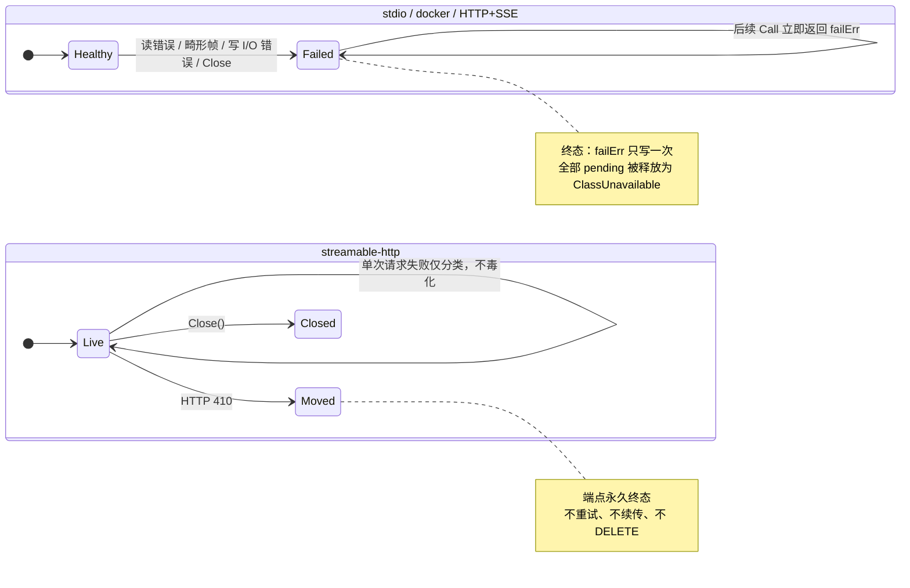
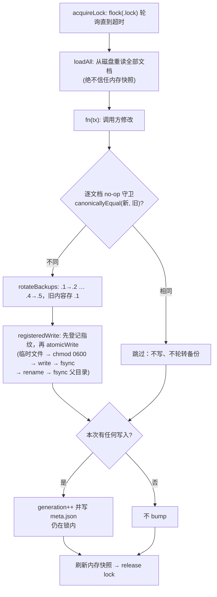

# 底座与协议层

这一层是 AgentHub 里「所有人都依赖、但它谁也不依赖」的部分：六个包合起来回答五个问题——
**文件放在哪**（`internal/platform`）、**说了什么怎么记**（`internal/logx`）、
**「读 / 写 / 毁灭」这三个词谁定义**（`internal/tier`）、
**跟下游怎么说话**（`internal/mcp` 与 `internal/mcp/transport`）、
**配置以什么形态存在于磁盘并被多个进程共享**（`internal/registry`）。

它们的协作关系是单向的、扁平的：

- `platform` 解析出 registry 目录、logs 目录、run 目录与控制端点路径，`registry` 拿目录去开库，
  `logx` 拿 logs 目录去开 JSON 日志文件；
- `registry` 的 `ServerEntry` 描述一个下游 server 长什么样，`mcp/transport` 负责把这份描述变成
  一条真的连接（spawn 子进程 / 起 HTTP 会话），`mcp` 提供这条连接上的协议语法；
- 三个业务无关的包（`platform`、`logx`、`mcp`）被 depguard 锁死为**只允许 `$gostd`**，
  谁都不能往里塞第三方依赖；`registry` 是唯一例外，它为了 watch 引入了 `fsnotify`。

依赖方向的约束不是风格问题，而是 CI 的失败条件（`.golangci.yml` 的 `depguard` 段，
每条规则都有 `internal/depguardtest` 里的测试证明它真的会触发）。

---

## internal/platform

### 一句话职责

把「agenthub 的数据/registry/日志/缓存/状态/运行时目录与控制端点在这台机器上是哪个路径」
这个问题集中在一个包里回答，顺带把所有 Windows 特有的怪异之处（MSIX 容器重定向、命名管道、
SDDL）收敛到同一处接缝。

### 关键类型与入口

核心是 `Resolver`：一个把 `runtime.GOOS`、`os.LookupEnv`、`os.UserHomeDir`
以及三个 Windows 专用钩子（`PackageIdentity`、`ProbePath`、`UserSID`）全部做成可注入字段的结构体。
它的零值等价于 `Default()`，也就是走真实进程环境；而测试可以在 macOS 上完整地解析一条
Windows 路径，不需要真的有 Windows。包级函数 `DataDir()` / `RegistryDir()` / `LogsDir()` /
`CacheDir()` / `StateDir()` / `RunDir()` / `CtlSocketPath()` 只是 `Default()` 的薄包装，
需要可测性的代码应当自己持有一个 `*Resolver`。

目录解析链本身是分层的：`DataDir` 是唯一做平台判断的函数，其余目录都是它的子目录，
只有 `RegistryDir` 和 `CtlSocketPath` 各自还有一个独立的环境变量出口。

| 函数 | 解析顺序 |
|---|---|
| `DataDir` | `AGENTHUB_DATA_DIR`（任何平台，非空即胜） → darwin `~/Library/Application Support/agenthub` → linux `${XDG_DATA_HOME}/agenthub`（仅当 XDG_DATA_HOME 是绝对路径）否则 `~/.local/share/agenthub` → windows `%APPDATA%\agenthub`（再叠加 MSIX 逃逸） → 其余平台 `ErrUnsupportedPlatform` |
| `RegistryDir` | `AGENTHUB_REGISTRY` → `<data>/registry` |
| `LogsDir` / `CacheDir` / `StateDir` | `<data>/logs`、`<data>/cache`、`<data>/state` |
| `RunDir` | linux `${XDG_RUNTIME_DIR}/AgentHub`（仅当它是绝对路径**且 `AGENTHUB_DATA_DIR` 未设**；tmpfs、每用户 0700）否则 `<data>/run`；darwin/windows 一律 `<data>/run` |
| `CtlSocketPath` | `AGENTHUB_SOCKET` → windows 命名管道 `\\.\pipe\agenthub-ctl-<sha8(SID)>` → `<run>/ctl.sock` |

`EnsureDir` / `EnsureDirs` 负责建目录：`MkdirAll(0700)`，并且当叶子目录已存在但权限更松时
主动 `chmod` 收紧回 0700——run 与 state 目录里放的是 socket 和凭据，不能是组/世界可读的。

### 不变量与失败方向

**冻结标识符。** 目录名 `agenthub` 与三个 `AGENTHUB_*` 环境变量名（`AGENTHUB_DATA_DIR`、
`AGENTHUB_REGISTRY`、`AGENTHUB_SOCKET`）自 v1 起是 ABI。产品改名也不能改它们，
因为用户的现有配置和其它客户端的启动脚本都写死了这些名字。

**显式覆盖永远优先。** `AGENTHUB_DATA_DIR` 在每个平台上都被逐字采纳，包括在 MSIX 容器里，
理由是「用户明确指定了一个路径」这件事不需要任何平台知识来解释。

**数据目录搬走，socket 必须跟着搬。** `XDG_RUNTIME_DIR` 是**每用户一个**目录，
所以一旦把 run 目录钉死在它下面，机器上所有 agenthub 就共用同一个 `ctl.sock`——
不管各自被指向了哪个数据目录。dev 构建与已安装的 release、两个并发的沙箱测试，
都会解析到同一个端点：先 bind 的那个占住它，其余的去跟一个不是自己的 daemon 说话、
读一份不是自己的 registry。因此 `RunDir` 只在数据目录仍是平台默认位置时才走
`XDG_RUNTIME_DIR` 分支（`dataDirRelocated()`）。

这条规则是**环境的性质，不是二进制的性质**：dev 构建 spawn 出来的 release 渠道 agenthub
（两者共享 PATH）会算出和父进程相同的 run 目录，因为两者读的是同一个被搬走的数据目录。
若改为按构建渠道判定，恰好在一方 exec 另一方时两者会分歧。

`DevResolver` 正是通过**回答 `AGENTHUB_DATA_DIR` 这次查找**（而不是另存一个字段）
来让渠道隔离延伸到 run 目录的——这两件事共用同一个判定。

**不支持的平台是硬失败，不是猜测。** darwin/linux/windows 之外返回 `ErrUnsupportedPlatform`，
调用方必须用 `errors.Is` 判定，不能靠字符串匹配。

**MSIX 探测的失败方向是「宁可当作已打包」。** 这是这个包里最值得记住的一条。
被 MSIX 打包的客户端 spawn 出来的 agenthub 网关会继承那个客户端的 app container，
此后一切对 `%APPDATA%` 的写入都被静默重定向到该包的私有影子目录——用户的配置会按客户端悄悄分叉，
而且没有任何征兆。检测手段是 `kernel32!GetCurrentPackageFamilyName`，
**只有返回码 `APPMODEL_ERROR_NO_PACKAGE`(15700) 才代表「没有包身份」**；
其余任何结果（包括老系统上根本没有这个导出之外的意外错误码、长度异常）一律按「已打包」处理。
两种猜错的代价不对称：在容器里猜「没打包」是静默的数据分叉，
不在容器里猜「已打包」只是多做一次 UNC 探活，探活会成功且孪生路径指向同一个目录，无损失。
唯一的例外是 `proc.Find()` 失败（Windows 8 之前根本没有 app model），那种情况按「未打包」返回。

**逃逸路径先探活再采用，探活失败必须大声。**
重定向过滤器只对本地路径生效，所以同一个目录经由环回 UNC（`\\127.0.0.1\C$\Users\...`）访问到的
是真身。但管理共享可能被关掉，所以孪生路径在被采用前要先 `Stat`（`defaultProbePath` 会向上最多
走 8 层父目录，因为首次运行时数据目录通常还不存在，要测的是「这条 UNC 路线通不通」而不是
「这个目录在不在」）。探活失败时**回落到本地路径并打印一条警告**，绝不静默回落——
警告写 **stderr 而不是 stdout**，因为 stdio 网关的 stdout 是 JSON-RPC 帧流，多一行就破坏协议。
`defaultWarn` 按消息去重，同一条只打一次。

**Windows 路径用显式反斜杠拼，不用 `filepath.Join`。**
`winJoin` 存在的唯一理由是跨平台测试：在 macOS 上解析一条 Windows 路径时，
`filepath.Join` 会用 `/` 连接，于是同一份配置在不同宿主上算出不同的字符串。
一个随宿主变化的路径拼写不成其为路径拼写。

**控制端点在 Windows 上不是文件。** `CtlSocketPath` 在 Windows 返回的是命名管道名，
调用方在建父目录或改权限之前必须先用 `IsPipePath` 判断。管道名里的 `sha8(SID)` 不是混淆：
管道名活在机器全局命名空间里，两个用户否则会抢同一个名字，输的那个会连上赢的那个用户的 daemon。
真正的访问控制是 `CtlPipeSDDL` 返回的 `D:P(A;;GA;;;<SID>)`——**只给属主，不给 Administrators、
不给 SYSTEM**，比 Windows 惯例更严，因为控制面负责发放全部下游凭据并审批工具调用，
「管理员也能连」不是一个值得拥有的性质。

**Windows 上 `EnsureDir` 不收紧权限。** Go 的 0700 与 Windows ACL 不是一回事
（`os.Chmod` 在那里只切换只读属性），所以那条分支直接返回。`%APPDATA%` 本身已是每用户目录，
控制端点的保护来自管道 SDDL 而非目录 mode。显式收紧数据目录 ACL 是 `docs/windows.md` 里的待办。

**整个 Windows 分支未在真实硬件上验证过。** 它能交叉编译、在 macOS/Linux 上通过注入钩子被单测覆盖，
但没有一行在 Windows 上跑过，更没有在 MSIX 容器里跑过。这一点写在包注释和 `windows.go` 的
文件头注释里，也写在 `docs/windows.md`：遇到与描述不符的行为，视为预期内的未知，不是回归。

---

## internal/logx

### 一句话职责

在 `log/slog` 之上给出全仓库统一的日志初始化（stderr 文本 + 文件 JSON 双 handler）、
强制字段规约，以及**无法被绕过的**密钥脱敏。

两个 handler 同时存在时由内部的 `multiHandler` 扇出，各 handler 的 `Handle` 错误用 `errors.Join`
汇总，**一个 sink 失败不会让另一个静默**。`Setup` 把 `ScrubHandler` 包在**最外层**，因此一次
脱敏遍历同时覆盖所有 sink 与所有 `WithAttrs` 绑定的属性。

凡涉及下游 server、工具调用、客户端或会话的日志都必须用 `fields.go` 里的字段常量，
这样网关、daemon、CLI 三方的日志流才能 join 到一起。**不要发明同义词**（`srv`、`toolName`…）。

### 不变量与失败方向

**脱敏不可关闭。** 这是本包最硬的一条：没有配置开关，没有环境变量能绕过它。
`AGENTHUB_DEBUG=1`（`EnvDebug`）只把级别下调到 Debug，对脱敏毫无影响；
`ScrubString` 本身不读任何环境。密钥、token、凭据在任何级别下都不得抵达任何 sink。

**脱敏方向是 fail-closed。** 过度遮蔽（把一个无害的长随机串也打成 `[REDACTED]`）是可接受的，
泄漏一条凭据不是。四类模式按顺序作用：
含敏感词的 `key=value`/`key: value`（顺带吃掉可选的 `Bearer ` 前缀，让整行 header 塌成一个
`[REDACTED]`）、散落在正文里的裸 bearer token、已知形状的凭据
（`sk-`、`ghp_`/`gho_`/`github_pat_`、`xox[baprs]-`、`AKIA`、`ya29.`、JWT），
以及值看起来像长随机串的通用 `key=value`（≥32 字符的 base64-ish 字母表，且 `looksRandom`
要求同时含字母与数字，以免把一长串纯字母的标识符误伤）。**不要为了日志好看去收窄这些模式。**

**敏感键名整体遮蔽，与值的类型无关。** `SensitiveKey` 把键名小写化并去掉 `-`/`_` 之后做子串匹配
（`secret`/`token`/`password`/`passwd`/`authorization`/`apikey`/`credential`/`accesskey`/`bearer`），
命中的属性无论是字符串、数字还是结构体，一律被替换成字符串 `[REDACTED]`。

**`LogValuer` 先 Resolve 再脱敏。** `scrubAttr` 第一步就是 `a.Value.Resolve()`，
保证脱敏看到的是最终值而不是一个惰性包装；group 递归下钻；`KindAny` 里的 `string` 与 `error`
也会被脱敏（错误经常裹着请求/头部转储）。

**`WithAttrs` 是急切脱敏的。** 绑定属性在绑定时就被洗一遍，
于是它们无论之后附着到哪条记录上都已经是干净的，不必每条记录重洗。

**日志文件权限是 0600，追加写。** 一行一个 JSON 对象。

---

## internal/tier

### 一句话职责

`read | write | destructive` 三级操作等级的词汇表——全仓库唯一的那把梯子。只依赖标准库。

### 为什么它是一个独立的叶子包

五个包都需要说这三个词，而没有一个包拥有它：`pipeline` 按它设门、`httpbridge` 把它存在
agent token 上、`ctlapi` 铸造那些 token、`discovery` 用它命名意图变体、`cli` 从用户输入里解析它。

它曾经住在 `internal/pipeline` 里，后果是控制面为了说出「read」这个词必须 import 数据面的执行包。
那条 import 除了违背分层，还让「pipeline 不得 import ctlapi」这条规则**不可证明**——
depguard 的违规探针产生的是 import 环，不是 lint 报错，规则于是失去了它的失败用例。
把词汇表抽成叶子包同时修好了分层和证明。

「一个引入依赖的词汇表不是词汇表」——所以它只依赖标准库，这是构造性的。

### 不变量与失败方向

**`Covers(caller, tool)` 按秩而非相等判定**：write 凭据可调 read 工具，destructive 可调一切。

**空串是「无等级权限」，不是「最低等级」。** stdio 调用方是人自己的会话、不带 agent token，
等级门对他们无可执行。这与「一个无法识别的等级」是两件不同的事——后者秩为 0，`Covers` **什么都不覆盖**
（fail-closed：存储的 token 里出现拼写错误应当拒绝，而不是升权）。

**`ToolTier` 的第一行和最后一行是两种不同的情况，别合并。**

| annotations | 等级 | 为什么 |
|---|---|---|
| 完全没有 / null / 解析不了 | `destructive` | 服务器**什么都没说**。fail-closed：未标注的工具绝不能被只读凭据够到 |
| `readOnlyHint == true` | `read` | |
| `destructiveHint == true` | `destructive` | |
| `destructiveHint == false` | `write` | |
| 有 annotations 对象，但两个 hint 都没设 | `write` | 服务器**确实描述了自己**，只是对这一项保持沉默 |

**与 `DefaultDestructive` 的不对称是刻意的。** 对 `{}` 这份 annotations，`ToolTier` 答 write，
而 `DefaultDestructive` 答 true（destructive，MCP 规范对该 hint 的默认值）。两者回答的是不同的问题：
`ToolTier` 喂的是粗粒度的凭据分离与意图变体，把每个「有标注但沉默」的工具都当 destructive
会把整条梯子塌成一级；`DefaultDestructive` 喂的是 `denyDestructive` 与 HITL 触发，
一个必须保持钝的全局否决。**两者互不削弱**：等级门与 HITL 门都会跑，且顺序固定。

**意图变体用的是相等而不是覆盖。** `call_tool_read` 只接受 read 工具，不接受更低等级——
因为变体表达的是「我打算做什么」，而凭据表达的是「我被允许做到哪」。

---

## internal/mcp

### 一句话职责

全仓库**唯一**触碰 MCP/JSON-RPC 协议实现的地方：线格式、帧、域类型、版本协商，全部自研，只用标准库。

### 为什么只依赖标准库

`.golangci.yml` 的 `mcp-stdlib-only` 规则把 `internal/mcp/**` 的 import 白名单限制为
`$gostd` 加它自己；另一条 `no-third-party-mcp-libs` 规则在**全仓库**范围内禁掉
`modelcontextprotocol/go-sdk`、`mark3labs/mcp-go`、`metoro-io/mcp-golang`。

理由不是「不信任第三方」，而是这一层的几条不变量必须能精确控制：
16 MiB 有界读、`notifications/cancelled` 转发、反向 RPC 内联答复、stdio stderr 尾窗。
JSON-RPC 编解码本身工作量不大，为它绑上一条外部演进节奏不划算。
门面存在的意义恰恰是让这个选择**将来可逆**——真要换实现，改动被封在一个包里。
这条约束的直接后果之一：SSRF 筛查不能在这里 import `internal/guard/netguard`，
只能由调用方注入一个 dialer（见 transport 一节）。

`MaxFrameSize = 16 << 20` 是读写两侧共同的硬上限。帧格式是换行分隔的 JSON——不是 LSP 那种
`Content-Length` 头，那是刻意不支持的。`ProtocolVersion = "2025-11-25"` 是本客户端声明的版本，
`SupportedVersions`（`2025-11-25`、`2025-06-18`、`2025-03-26`）是可接受的降级集合。

### 不变量与失败方向

**有界读，且超限即毒化读端。** `readLine` 在累加过程中就检查上限，
所以超大帧在被完整缓冲之前就失败，而不是先吃进内存再报错。一旦命中 `ErrFrameTooLarge`，
流位置停在帧中间、语义未定义，因此**错误是粘性的**——`FrameReader` 的任何错误都会被记住，
之后每次 `Next` 都返回同一个错误。连接必须被视为不可用。

**写侧超限反而是可恢复的。** `WriteFrame` 在写出任何字节**之前**就拒绝超大帧，
所以流本身没被污染，连接仍然健康——这个非对称性是 transport 层把出站超限判成 `ClassFatal`
而不是 `ClassUnavailable` 的依据。

**帧写是原子的。** 每帧一次 `Write` 调用，加上 `FrameWriter` 的互斥锁，
保证 Call/Notify 协程与读循环（回复对端请求）共用一个 writer 时帧不会交错。
`json.Marshal` 会转义字符串内的控制字符，所以 payload 里不会出现裸换行，追加 `'\n'` 是安全的。

**空行跳过、末帧无换行也交付。** 读端跳过空行（含 CRLF 残留），
EOF 时若还有非空的未结尾内容，先把它当作最后一帧交付，下次调用才返回 EOF。

**畸形输入产出可判定的类型化错误，绝不 panic。** `ParseMessage` 的任何形状违规
（JSON 坏、`jsonrpc` 版本不对、id 类型非法、三者皆不是）返回的错误都满足
`errors.Is(err, ErrMalformedFrame)`。**是否因此关连接是调用方的决定**，
这一层只负责让错误可判定——一帧垃圾不能让进程崩掉。

**ID 保留原始 JSON 文本。** `ID` 内部存 raw string 而非 `int64`/`string`，
于是对端发来的 id 能逐字节原样回送，包括超出 float64 精度的数字写法。
`Key()` 直接用 raw 文本做 map 键，字符串 id 带着引号所以永不与数字 id 冲突；
未设置的 ID 序列化成 `null`，只用于无法指明请求的协议级错误响应。

**带 method 但 id 为 null 的消息按通知处理**，这是 `ParseMessage` 的显式取舍。

**下游 JSON 一律 raw 透传。** `ToolDef.InputSchema`/`OutputSchema`/`Annotations`、
`InitializeResult.Capabilities`、`CallToolParams.Arguments`、`CallResult.Content` 全是
`json.RawMessage`。这一层**从不重塑下游 JSON**——不重编码 JSON Schema，
不丢弃服务端声明过的任何能力。

**取消是有竞态的，接收方必须容忍迟到的回复。** `CancelledParams` 的注释写明了这一点，
transport 层的实现与之对应：未匹配上的响应被直接丢弃。

**`roots` 相关类型带 `DEPRECATED-UPSTREAM` 标记**（`roots`，最早移除日期 2027-07-28），
按 canonical.md §5b 保留，未来上游移除时由网关的 `RootSource` 接缝吸收。

---

## internal/mcp/transport

### 一句话职责

把「一个下游 MCP server 的描述」变成一条能收发 JSON-RPC 的活连接，
并把每一次失败**分类**成上层熔断器能用的三种类别之一。

### 关键类型与入口

`Transport` 接口是全部实现的公约数：`Call` / `Notify` / `OnPeerRequest` / `OnListChanged` /
`Stderr` / `Close`。四个入口分别构造它：

| 入口 | 得到什么 |
|---|---|
| `SpawnStdio(StdioConfig)` | 子进程 stdio 连接；`cfg.Docker != nil` 时自动转交 `SpawnDocker` |
| `SpawnDocker(StdioConfig)` | 同上，但宿主进程是 `docker run -i --rm ...` |
| `DialStreamableHTTP(HTTPConfig)` | MCP 2025-11-25 Streamable HTTP（此处不建连，首个 `Call` 才建） |
| `DialHTTPSSE(ctx, HTTPConfig)` | 传统 HTTP+SSE（阻塞到收到 endpoint 事件或 ctx 超时） |

拿到 `Transport` 之后由 `Initialize(ctx, t, clientInfo)` 完成握手：
发 `initialize`（声明 `mcp.ProtocolVersion`、`roots.listChanged`）、
校验服务端返回的版本、成功后发 `notifications/initialized`。
**握手失败一律是 `ClassFatal`**——同样的握手重试不会成功，所以它不该消耗熔断预算。

错误模型是 `*Error{Class, StatusCode, RetryAfter, Err}`，`Unwrap` 暴露原因以便对 `mcp` 的哨兵做
`errors.Is`。三个类别的判据是「`tools/call` 不幂等」：

- `ClassFatal`：一次普通的错误应答，或者是对配置本身的判决（坏 URL、spawn guard 拒绝、
  出站帧超限、docker CLI 缺失）。**不计入熔断器**，因为它不说明下游健康与否。
- `ClassUnavailable`：连接级故障。**计入熔断器**。
- `ClassRetry`：请求**可证明从未抵达服务端**（DNS 解析失败、dial 失败），或服务端明确回了 429。
  只有这两类可以重放一个非幂等调用。

`StatusCode` 是产生这个错误的 HTTP 状态码（非 HTTP 来源为 0），配套 `StatusOf(err)` 与
`IsAuthStatus(err)` 两个会 unwrap 的判定函数。**它存在的理由是别让调用方去 grep 错误文本**：
消息里拼了响应体片段，所以「在 `Error()` 里找 `http 401`」这种写法，会把一个
「502，body 里写着上游返回 http 401」的代理错误判成「你的凭据被拒了」——
把操作者支去重跑 `auth login`，而那个故障根本不是凭据能修的。
`internal/cli` 与 `internal/ctlapi` 曾各自独立写过一份这样的子串匹配，现在都改成按状态码判定。

`ChangeMask`（`ChangeTools|ChangeResources|ChangePrompts`）是 list_changed 通知的位掩码，
经 `OnListChanged` 回调；`PeerHandler` 处理服务端发起的反向 RPC（roots/sampling/elicitation）。

### 四种实现的差异

四个实现里，只有前两个共享同一套代码（`conn`），docker 是 stdio 的一个变体而不是第四种 `Kind`——
`Kind` 只有 `stdio`/`http`/`sse` 三个值，容器化由 registry 的 `runtime` 字段表达。

| 维度 | stdio / docker | streamable-http | 传统 HTTP+SSE |
|---|---|---|---|
| 底层 | 子进程 stdin/stdout，换行分隔帧 | 每条消息一个 POST，应答是 JSON 或 SSE 流 | 长连 GET 收，POST 发，两个通道 |
| 失败模型 | **终态**：任何读侧错误或写侧 I/O 错误设 `failErr`（一次写定），释放全部 pending，之后所有调用立即返回它 | **非终态**：单次请求坏掉不毒化 transport，每次调用各自分类；只有 `Close` 和 410 是终态 | **终态**，与 stdio 同构：只有一条长流，流断即全挂 |
| 反向 RPC | **在读循环上内联答复**，因此 handler 不得回调同一 transport、必须尽快返回 | 独立 goroutine 处理，答复用 POST 送回端点，handler **可以**回调本 transport | 独立 goroutine + POST（答复走另一条通道），并发上限同样是 `maxPeerWorkers`(8) |
| 会话 | 无 | `Mcp-Session-Id`（初始化后回显于每个请求，`Close` 时 DELETE） | 无 |
| 断点续传 | 不适用 | `Last-Event-ID` 尽力续一次（可用 `DisableResume` 关；410 后永不续） | **没有**：传统绑定没定义续传，静默重放非幂等调用比让 `internal/downstream` 干净重连更糟 |
| `Stderr()` | 子进程 stderr 尾 4 KiB（docker 还会附加诊断行） | `""` | `""` |

### 不变量与失败方向

**有界读贯穿两种线格式。** stdio 用 `mcp.FrameReader`；SSE 用 `sseScanner`，
后者是前者的类比物：单个事件的累计 data 超过上限即 `mcp.ErrFrameTooLarge`（而不是先缓冲完），
错误粘性，EOF 时未完成的事件按 SSE 分发规则丢弃，注释行（`:` 心跳）与未知字段忽略而非致命。
`readBounded` / `encodeMessage` 把同一个上限套到 HTTP body 上。

**反向 RPC 的响应 id 由 transport 强制覆盖为请求 id**，不管 handler 设了什么。
没注册 handler 时回 method-not-found；handler 报错或返回 nil 时回 internal-error；
答复本身超帧时，用一条 in-band 的 internal-error 顶替（流仍完好，服务端不会干等）。

**取消一律尽力转发。** 三种实现的 `Call` 在 ctx 结束时都会先发 `notifications/cancelled`
再返回 ctx 错误。它是**尽力而为**的：写失败被吞掉（管道已经死了的话读循环马上会报），
且 HTTP 侧跑在 **transport 生命周期 ctx** 上而不是那个已经死掉的调用 ctx 上，
超时 5s（`cancelForwardTimeout`）。

**未匹配的响应被丢弃，未知通知被忽略。** 两者都不是致命错误——
前者是取消的调用撞上迟到的回复，后者是服务端发了我们不认识的通知。

**畸形帧关连接，但进程绝不崩。** stdio 与 HTTP+SSE 的读循环在 `ParseMessage` 失败时
`fail(ClassUnavailable)`：一个吐垃圾的对端没法被信任还能维持帧边界。
streamable-http 的 GET 通知流遇到同样情况则只是结束这条流（下次重连）。

**HTTP 状态码的分类是刻意的**（`httpError`）：

```
410 Gone         → ErrEndpointMoved, ClassUnavailable, 永不重试、永不续传, 端点被永久毒化
404 Not Found    → ErrSessionExpired, ClassUnavailable, 清掉 session id（是否重新 initialize 由上层决定）
429 Too Many     → ClassRetry + Retry-After 提示（delta-seconds 或 HTTP-date，解析不出就是 0 = 用调用方自己的退避）
5xx              → ClassUnavailable：请求确实到了服务端，非幂等调用不得重放，计熔断
其余 4xx          → ClassFatal：我们的请求被就事论事地拒绝了，这不说明服务端健康与否，不该触发熔断
```

**410 是 transport 的终态。** `noteTerminalStatus` 把 `moved` 置位后，
`stateErr()` 让后续每个 `Call`/`Notify` 立即失败，通知流循环退出，
`Close` 甚至不再发 DELETE。含义是「配置里的 URL 必须由人改」。

**跨源 endpoint 事件 fail-closed。** 传统 HTTP+SSE 的 POST 地址来自服务端发的 endpoint 事件，
而调用方的 header（`Authorization`）会跟着每个 POST 走。因此 `setPostURL` 用 `sameOrigin`
（scheme + host 含端口全等）校验，不同源直接把 transport 判失败——
一个指向别处的 endpoint 事件就是伪装成协议事件的凭据外泄。
同理，通知流的 GET 在拿到非 SSE content-type 时永久放弃。

**SSRF 筛查是注入的，且没注入就是没有。** `HTTPConfig.DialContext` 与 `HTTPConfig.Client`
**互斥**（同时给会在 `newHTTPBase` 里 `ClassFatal` 拒绝），这样一个带防护的 dialer 不可能被
悄悄丢弃。两者都不给时**完全没有地址筛查**——那个组合只留给测试和明确可信的 loopback 端点。
注入的 dialer 被拒时表现为 dial 失败，因而分类成 `ClassRetry`；这是诚实的（什么都没发出去）
也是无害的（guard fail-closed，每次有界重试都会被同样拒绝）。

**协议头总是压过调用方的头。** `newRequest` 先铺调用方 header，
之后由各调用点设置 `Accept`/`Content-Type`/`Mcp-Session-Id`/`MCP-Protocol-Version`。
注意 `net/http` 会规范化头名，所以实际发出的是 `Mcp-Protocol-Version`
（RFC 9110 §5.1 头名大小写不敏感，golden 文件钉的是规范化形式）。

**错误消息里的 body 片段有界且被压成一行。** `drainSnippet` 只读 1 KiB，
把 `\n\r\t` 换成空格并剔除其它控制字符——错误串会进审计记录与日志，
内嵌换行等于允许伪造一条记录。

**并发的反向 RPC 有背压而不是无限扇出。** `maxPeerWorkers = 8` 的信号量在满时会**阻塞流读取**，
让洪泛的对端自己减速。`wg.Add` 一律在发布 `closed` 的同一把锁内完成，
所以 `Close` 的 `Wait` 不会等到一个即将被加一的计数器。

**stdio 的进程回收有严格顺序。** `os/exec` 的管道契约要求 `cmd.Wait` 不得早于 stdout 读完，
所以回收是挂在读循环结束上的（进程一死 stdout 就 EOF，读循环必然结束）。
`Close` 先失败掉全部 pending，再关 stdin（对守规矩的子进程就是 EOF），
然后等 `killGrace = 3s`，超时就 `Kill`，最后跑 cleanup。**进程总是被 reap。**

### docker spawner 的额外规矩

定位很明确：spawn guard 是**反走私**，不是沙箱；docker 这一半才是资源与命名空间隔离。
它用 `os/exec` 驱动 docker CLI 而不引 SDK——一方面 `internal/mcp` 只能用标准库，
另一方面 shell out 让 `DOCKER_HOST`、docker context、凭据 helper 全都自动生效。

- **默认全关**：`--network none`、只挂显式声明的目录且默认只读（`Mount.Write` 才 `:rw`）、
  绝不生成 `--privileged`、宿主命名空间或 capability 授予。
- **`ExtraRunArgs` 不能重复指定本文件自己发的 flag**（`ownedRunFlags`）。
  docker 的 last-wins 语义会让一个多余的 `--network host` 悄悄抹掉隔离默认值；
  自相矛盾的配置是 bug，不是 override。
- **密钥不进 argv**：容器环境变量以 `-e NAME`（无值）形式传，值由 docker CLI 自身的环境继承。
  `ps(1)` 能看到 argv，看不到 CLI 的环境。
- **`BuildDockerRunArgs` 是纯函数且全序**：mounts 按 (target, source) 排序、env 按 name 排序，
  同一份配置永远产出同一条 argv，被 `testdata/docker_run_args.txt` golden 钉住。
- **配置校验在启动任何进程之前**：镜像不得以 `-` 开头或含空白，容器名必须以 `agenthub-` 开头
  且符合 docker 命名，mount 路径必须绝对且不含 `:`（否则就是从值位走私出第二个 flag），
  内存/CPU/网络名各有正则。
- **容器名每次 spawn 唯一**：agenthub 每个 client 一个网关进程，多个进程合法地同时跑同一个 server，
  固定名会撞车。这是 mcpproxy 的「按固定名幂等预清理」配方**不适用**的一处，注释里写明了原因。
- **清理是双保险**：`--rm` 覆盖正常退出，`removeContainer`（读 cidfile 拿 id，拿不到就用名字）
  覆盖「CLI 先死了」的情况，失败一律忽略——容器可能本来就没了，而关停不能因此失败。
- **失败诊断被塞进 stderr 尾窗**：`diagnoseDocker` 在 stderr tail 后追加一行 `agenthub: ...`，
  把「镜像不存在」「daemon 没起来」从一个裸的 deadline exceeded 里救出来。
  匹配顺序上 daemon 类先于 image 类，因为 daemon 挂了也会吐出像镜像问题的措辞。
- **`DockerBinary` 有兜底路径表**：launchd/systemd 拉起的网关 PATH 是被截断的，
  而 Docker Desktop 的 CLI 藏在 app bundle 里；找到后取绝对路径，
  再把它所在目录 prepend 进子进程 PATH（凭据 helper 就在它旁边）。
- `DockerVersion` 与 `StrayContainers` 是 doctor 面的探针：前者证明 daemon 应答，
  后者按 `agenthub.managed=true` 标签列出所有残留容器（正常路径不该有，有就是网关被 kill -9 过）。

### 一张图：两种失败模型



### 文件地图

| 文件 | 内容 |
|---|---|
| `transport.go` | `Transport` 接口、`Kind`、`ChangeMask`、`PeerHandler`、`Class` 三态与 `*Error`、`ErrClosed` |
| `conn.go` | 字节流上的通用实现：单读循环、pending 表、终态 `fail`、内联反向 RPC、取消转发、`Close` |
| `stdio.go` | `StdioConfig`、`SpawnStdio`、注入式 spawn 屏蔽 `screen`、`launch`（管道接线、stderr 环、进程回收与 kill 升级） |
| `docker.go` | `DockerConfig`/`Mount`、`SpawnDocker`、`BuildDockerRunArgs`、配置校验、`DockerBinary`/`DockerVersion`/`StrayContainers`、stderr 诊断 |
| `httpcommon.go` | 两个 HTTP transport 共用的一切：header 常量、`HTTPConfig`、`DialContextFunc`、`httpError`/`requestError` 分类、`readBounded`/`encodeMessage`/`decodeMessages`、`sameOrigin`、退避 |
| `streamablehttp.go` | Streamable HTTP：POST 主路径、JSON/SSE 两种应答、会话头、`Last-Event-ID` 续传、可选 GET 通知流与重连循环、`Close` 时 DELETE |
| `httpsse.go` | 传统 HTTP+SSE：GET 长流 + endpoint 事件解析（跨源 fail-closed）、POST 发送、终态失败模型 |
| `ssescan.go` | `sseScanner`：有界、粘性、按 SSE 规范分发事件，忽略注释与未知字段 |
| `initialize.go` | `Initialize`：握手 + 版本协商 + `notifications/initialized`，失败恒为 `ClassFatal` |
| `tailbuf.go` | `tailBuffer`：并发安全的尾 N 字节环形写入器，撑起 `Stderr()` |
| `testdata/*.txt,*.json` | golden：docker argv 与两种 HTTP transport 的线上字节。`wiregolden_test.go -update` 重写它们；**修代码，别改 golden** |

---

## internal/registry

### 一句话职责

CLI、各网关进程与 daemon 共享的**磁盘配置真源**：多文档、未知字段保真、跨进程原子写、
单调 generation、变更感知与自写抑制。

### 目录布局

```
meta.json          单调 generation（只在锁内、且确有写入时 +1）
servers.json       下游 MCP server
profiles.json      profile（层）：servers + tools + discovery
clients.json       客户端绑定：这个 client 跟哪个 profile，仅此而已
governance.json    全局治理策略
.lock              兄弟锁文件，flock，保护以上全部
.runstate.json     crash 标记（不是文档，故意用点前缀避开 <kind>.json 命名空间）
backups/           每文档 5 代滚动备份 <name>.json.1 .. .5
```

### 关键类型与入口

**`Doc[T]` 信封**是整个包的地基：一个类型化视图 `V T` 加一张 `extra map[string]json.RawMessage`。
`UnmarshalJSON` 先把所有顶层字段收进 extra，再解出 `V`，然后把 T 已知的字段名从 extra 里删掉；
`MarshalJSON` 反向合并，**已知字段在键冲突时胜出**。效果是：新版 agenthub（或手工）写下的字段
经过老版本的 load-modify-save 之后仍然存在。这个保真是**逐层**的——
`ServersDoc.Servers` 的值类型是 `Doc[ServerEntry]` 而不是 `ServerEntry`，
所以单个 server 条目内部的未知字段同样活得下来。
已知字段名集合按 `reflect.Type` 缓存，且正确处理 json tag 与匿名嵌入的字段提升。

**`HasUnknownField(name)` 是这份透传的解毒剂，只为一件事存在：让诊断能发现一个已经退役、
却还留在磁盘上的字段。** 透传本身正是退役危险的原因——被类型系统删掉的字段照样逐字 round-trip，
于是操作者当年写下的规则**看起来**依旧生效，而对一条收窄规则来说，「不再生效」就等于「放宽」。
所以这个方法刻意**只暴露读键名**：调用方可以问某个名字是否还在，不能伸进 `extra` 里按它行事。
现役用户只有 `agenthub doctor` 的 `scope:projects`（per-project 层退役后遗留的 `projects` 块）。

**`Store`** 是对一个 registry 目录的句柄。三个入口：

- `Open(dir)` / `OpenOptions(dir, opts)`：建目录、持锁加载全部文档、生成快照。
  **有文档被隔离时仍返回可用的 `*Store`**，同时返回一个 join 了 `*UnreadableError` 的非 nil error——
  是否致命由调用方判断。
- `Reload(ctx)`：持锁重读全部文档并替换内存快照。watch 消费者收到 `Change` 后调用它——
  事件只是通知，状态来自这次重读。
- `Update(ctx, fn)`：`lock → load → modify → commit → bump` 的完整事务，见下。

**`Tx`** 是 `Update` 回调看到的可变视图（`Servers`/`Profiles`/`Clients`/`Governance` 四个
`*Doc[T]`，加只读的 `Generation()`）。指针只在回调期间有效。
**`meta.json` 不暴露**——generation 由 store 管。

**`Snapshot`** 是不可变视图（`Generation` + 四个 `Doc[T]` 的深拷贝，经 JSON round-trip 保证与
回调可能仍持有的 map 无关）。

**`Watcher`**（`Store.Watch()` / `WatchWith(opts)`）产出 `Change{Kind, Rev}` 事件流。
**`Applier`** 实现采纳判据。

**crash 标记**由三个函数构成，**写者是 daemon**：`daemon.Run` 在 `ctlapi.Listen` **成功之后**
调 `ArmRunMarker`（bind 成功才 arm，抢 socket 失败的第二个 daemon 就不会覆盖赢家的标记），
只在**优雅停止**那条分支上调 `RunMarker.Resolve`；被 `kill -9`、panic、断电的进程压根不会 resolve，
**那个「没 resolve」本身就是信号**。`agenthub doctor` 用只读的 `PreviousShutdown` 报告结果。

失败方向：标记写不下去只让**下一次**启动失去诊断能力，所以降级成一条 warn 而不是拒绝服务——
为了一个诊断功能不肯提供服务是更差的取舍。

这个「写者」曾经不存在：读者半边（doctor → `PreviousShutdown`）一直是通的，
但产品里没有任何地方 arm 过标记（`daemon.go` 那处留着 `TODO(M1-H)`），
于是 doctor 永远只会答 "unknown (no marker yet)"——**包括刚崩完那一刻**，
而那正是这个功能唯一存在的理由。

领域类型在 `types.go`：`ServerEntry`（含 `Transport`/`Runtime`/`Docker`/`Provenance`/`Derive`
等字段与 `ValidateRuntime`）、`Profile`（`servers` + `tools` + `discovery`）、`ToolSelector`、
`ClientEntry`、`ProfileBinding`、`GovernanceDoc`（含 `RateLimitRule` 规则集），
以及把「显式 `ProfileRef` > `profile` 简写 > 层默认值」这条优先级固化下来的 `Binding()` 方法。

**`ClientEntry` 只剩 `{Profile, ProfileRef}` 两个字段。** 它曾经还带自己的 servers / tools /
discovery / approval / resultBudget，叠在 profile 之上再收一道；那让「这个 client 绑了哪个 profile」
只是「这个 client 能看见什么」的一半答案。收窄现在只有 profile 一个家。同一次收敛里
`ProjectBinding`、`ClientEntry.Projects` 与 `BindingInherit`（per-project 层）一起删除；
`Profile` 则新增 `discovery`，因为呈现方式描述的是**那一份工具集**——绑一次 profile 就该同时定下
「看得见什么」与「怎么看见」。遗留在 `clients.json` 里的 `projects` 块会被 `Doc[T]` 原样透传，
`Doc[T].HasUnknownField` 就是为这一种情况存在的（见下）。

`GovernanceDoc.RateLimits`（`rateLimits`）是调用配额规则集，**只在 global 一层**，不进三层 scope 链：
规则模式自己就带 (client, server, tool) 维度，而跨进程计数桶按规则模式键控——同一模式出现在多层，
要么把一份配额裂成每层一份（层数 = 倍数限额，与「只紧不松」反向），要么需要一套本仓库别处都没有的
按模式取 min 的合并语义。registry 只**逐字存储**（`window` 是时长字符串，不解析）；解析、校验与执行
在 `internal/ratelimit`，它宁可整份规则集报错也不静默丢掉一条读不懂的规则。

### 写路径的加固梯子



### 不变量与失败方向

**单把目录锁，不是每文档一把。** 因为 `meta.json` 的 generation 必须与它所覆盖的那批文档写入
原子地一起完成。锁是 `<dir>/.lock` 上的 flock，非阻塞尝试 + 5ms 轮询直到超时；
超时返回 `*LockTimeoutError`，满足 `errors.Is(err, ErrLockTimeout)`（CLI 映射成退出码 7）；
轮询间隙尊重 ctx 取消。

**`Update` 从不信任内存快照。** 每次都在锁内重新从磁盘加载，
所以一个过期的 `Snapshot` 永远不可能覆盖掉别的进程刚写的东西。

**generation 只在真的写了东西时 +1，且只在锁内。** no-op 守卫按**解析后的 JSON 值**比较
（`canonicalize` 用 `json.Number` 保数字原貌、对象键排序、去空白），
所以键序抖动或格式化差异不会触发假更新，也就不会有幽灵 bump。
反过来，`canonicalize` 失败的输入被判为「不相等」——强制重写，这是持久化层的安全方向。

**读不可解析的文件不会毁掉它。** 解析失败先按 `readRetries = 4` × `readRetryDelay = 75ms`
重读，用来骑过一个非原子的外部写入者；仍失败才把文件 rename 成
`<name>.json.unreadable-<时间戳>`（**隔离，绝不销毁**），写入一份默认文档，
并把 `*UnreadableError` 报出去。**一个文档被隔离不阻塞其它文档的更新**——
错误被 join 进返回值，事务照常提交。

**文件缺失时写入默认值，但不算变更。** 首次接触即落盘，所以文件从第一刻起就存在，
但这不触发 bump。

**滚动备份只在真写时轮转**，因此 5 个槽位里永远是 5 个**不同的**代。

**`atomicWrite` 从不留下半个目标文件**：同目录临时文件 → `chmod 0600` → 写 → `fsync` →
`rename` 覆盖 → `fsync` 父目录。父目录 fsync 在不支持的文件系统上（EINVAL/ENOTSUP）被容忍——
那里 rename 本身仍然是原子的。

**registry 文档里绝不存凭据。** `ServerEntry.Env` / `Headers` 里的 `${SECRET_X}` 占位符
**逐字存盘**，对 vault 的解析发生在 `internal/downstream` 的连接时刻。
同理 `OAuthHint` 里刻意**没有** `needsAuth`：某个 server 当前是否需要授权是运行时状态，
持久化它会造出第二个真源，而一个过期的 `"needsAuth": false` 恰好会让一个每次调用都 401 的 server
挂着 Ready 徽章。

**三态字段的 `omitzero` 是承重的。** `ToolSelector.Allow` 与 `Profile.Servers` 的
nil（不干预）与 `[]`（全封）语义不同，用 `omitempty` 会把空列表从磁盘上抹掉，
于是「全封」静默变成「全放」——fail-open。`omitzero` 让空列表 round-trip，全封保持关闭。

**未知 runtime 名被拒绝，不当作 host。** `ValidateRuntime` 里 `"dcoker"` 这样的拼写错误
必须报错，不能悄悄丢掉操作者要的隔离。同理 docker runtime 只适用于 stdio transport 且必须有镜像。

### generation 判据、自写抑制与 watch 双通道

这三件事经常被一起提起，因为它们回答的是三个不同的问题：
generation 回答「**变没变**」，自写抑制回答「**是不是我自己写的**」，
Applier 回答「**读到的这份该不该采纳**」。

**Applier 的判据是「读到的 generation ≥ 已应用 generation」，不是「等于事件里的 Rev」。**
这是 canonical.md §5c #2 的裁决，理由写在 `applier.go` 的注释里：
推送只是通知、不带快照，消费者仍要自己重读文件；快速连续多次写入时，
读到的 generation 会**超过**手上这个事件的 Rev，按相等判定会拒绝它，
然后永远等一个不会再来的、恰好等于已读值的事件——卡死在旧版本上。
`>=` 则采纳任何不比现状旧的状态，而重复应用同一代按构造是幂等的。
`MarkApplied` 只增不减，迟到的乱序 apply 无法把判据推回去；
`Apply(gen, fn)` 把「判据检查」与「应用状态」放在同一把锁内，
避免两个并发 reload 交错后以旧状态收尾；**apply 失败不记录**，下次触发再试。

**自写抑制的失败方向是 fail-open（朝重载开）。** `selfWriteSet` 是有界 TTL 集合：
64 个槽位、10s 过期、写前登记、写失败即撤回、观察到外部变更即整体清空。
TTL 过期、槽位被挤掉或指纹不匹配的代价，最多是**一次多余的空重载**（读到的就是自己刚写的内容）。
它**不可能掩盖一次外部变更**：指纹不在集合里的内容变化一律按外部处理。
撤回那一步是必要的——一份从未落盘的内容的指纹，不该去抑制未来一次**内容恰好相同的外部写入**。
清空那一步同理：别人动过 registry 之后，手上这些待消费的指纹已经不描述磁盘上的血缘了。
指纹是 canonicalize 之后的 SHA-256，所以「写出去的字节」与「读回来的字节」之间的格式差异不影响命中；
canonicalize 失败就退化成对原始字节哈希（同样只损失一次空重载）。

**watch 是双通道的，两条都常开。** `fsnotify` 事件 + 200ms debounce 是主信号，
2s 轮询是安全网——fsnotify 在 SMB/网络挂载上不可靠，甚至可能根本初始化不了。
`WatchWith` 里 fsnotify 的任何初始化失败都**只是降级成纯轮询**而不是让 `Watch` 失败
（fail-open：一个只是有点滞后的 watcher 严格优于没有 watcher）；
运行中 fsnotify 通道关闭也是同样处理（把它置 nil，继续轮询）；fsnotify 的 error 通道非致命。

`scan()` 是全部判断发生的地方，它**不持跨进程锁**：自己人的写入是原子 rename，
外部非原子写入者造成的撕裂状态会 canonicalize 失败，下次触发再试。逐条不变量：

- 先读 `meta.json` 取 generation，**读不出就整轮放弃**（多半正在写），什么都不推进；
- 对四个内容文档逐个比较 canonical 内容与**本 Watcher 上次应用的基线**——
  因此事件带精确的 `DocKind`，不是笼统的「有东西变了」；
- 读失败或 canonicalize 失败一律 `continue`：**加载失败绝不推进基线**，
  半写文件的状态不会被误当成新状态，旧基线保持权威直到出现一份可读状态；
- 命中自写指纹：**静默推进基线，不发事件**；
- 判为外部变更：先 `selfWrites.clear()`，再推进基线并发事件；
- 事件投递**永不阻塞扫描循环**：通道满时按 kind park 住（保留最新的 Rev），
  下次触发由 `flushPending` 重投。按 kind 合并是安全的，因为消费者本来就要重读，不信任 Rev。

Watcher 创建时会用 Store 当前快照**播种基线**，所以本进程已经应用过的状态不会被重复上报。
`meta.json` 只提供 `Change.Rev`，它自己不是一个 `Kind`。

### crash 标记

`ArmRunMarker(dir)` 在进程启动早期原子地做两件事：读出**上一次**运行的结局并返回它，
同时为本次运行 arm 一个新标记；`Resolve()` 在优雅关停的最后一步把它标成 clean。
被 SIGKILL、panic 或断电的进程根本走不到 resolve，这正是信号本身。

两个设计取舍值得记住：**resolve 是重写而不是删除**——一个「不存在的标记」必须与
「已 resolve 的标记」可区分，删除会让「第一次运行」和「干净关停」变成同一个观测，
于是首次运行会被无凭无据地报成 clean。**一切歧义都倒向 `ShutdownUnknown`**：
读不到、解析不了、或者版本号不认识的标记都是 unknown，诊断不能凭空开出一张健康证明。
标记里的 pid 与时间戳纯属诊断信息，crash 判定**不依赖那个 pid 是否还存在**
（pid 会复用，跨机器或重启后这个检查毫无意义）。

### 文件地图

| 文件 | 内容 |
|---|---|
| `store.go` | 包文档、`Store`/`Tx`、`Open`/`OpenOptions`/`Reload`/`Update`、`loadAll`/`loadDocFile`（重试+隔离）、`commitDoc`（no-op 守卫）、`registeredWrite`、快照深拷贝 |
| `envelope.go` | `Doc[T]` 与它的 Marshal/Unmarshal、已知字段名反射与缓存、`HasUnknownField`（只读退役字段名） |
| `types.go` | `DocKind` 五个文档、`MetaDoc`、`ServerEntry`（transport/runtime/docker/provenance/derive）、`DockerRuntime`/`DockerMount`、`OAuthHint`、`ToolSelector`、`Profile`（servers/tools/discovery）、`ClientEntry`（只有 profile 绑定）/`ProfileBinding`、`GovernanceDoc`、`Snapshot`、各默认文档 |
| `fileio.go` | `atomicWrite` 梯子、`syncDir`、`rotateBackups`、`quarantine`、`canonicalize`/`canonicallyEqual`、`encodeDoc` |
| `lock.go` | 兄弟锁文件路径、`acquireLock` 轮询与超时、`release` |
| `flock_unix.go` / `flock_stub.go` | darwin/linux 用 `syscall.Flock`；其它平台返回 `errors.ErrUnsupported` 的编译占位 |
| `errors.go` | `ErrLockTimeout`/`LockTimeoutError`、`UnreadableError` |
| `watch.go` | `Change`、`WatchOptions`、`Watcher` 与它的单 goroutine 扫描循环、debounce/poll 双通道、park/flush 投递 |
| `selfwrite.go` | `selfWriteSet`（register/withdraw/consume/clear）与 `fingerprint` |
| `applier.go` | `Applier`：`ShouldApply`/`MarkApplied`/`Applied`/`Apply` 与 `>=` 判据的推导 |
| `runmarker.go` | `ShutdownState` 三态、`ArmRunMarker`/`Resolve`/`PreviousShutdown` |

---

## 附：一处容易读混的量

**stderr 尾窗在两层各有一个，大小不同。** 本层 `transport` 保留 **4 KiB 字节**尾窗
（`stderrTailSize`），上层 `internal/downstream` 另有一个**按行**的环形缓冲。
两者服务不同的呈现场景，不是同一个东西——读到其中一个时别以为改了另一个。

Windows 上 registry 的跨进程锁仍是返回 `errors.ErrUnsupported` 的占位实现
（`flock_stub.go`），因此 `Open` / `Update` / `Reload` 全部失败。
现状与补齐做法见 [../windows.md](../windows.md#registry-的跨进程锁)。
