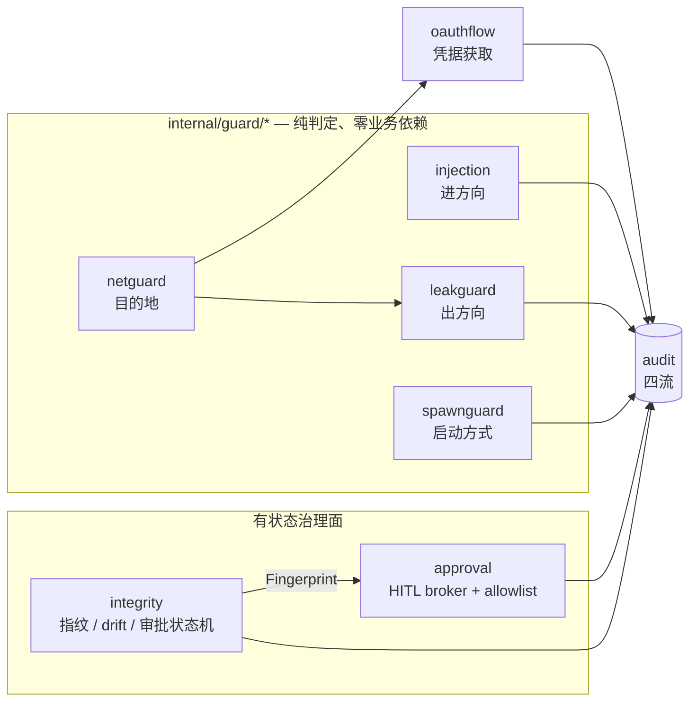
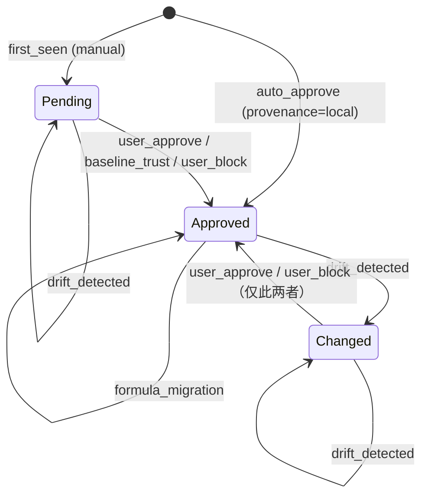

# 安全与治理层

这一层是 AgentHub 的「不信任下游」实现。它假定下游 MCP server 可能是敌意的、被劫持的或仅仅是
草率的，于是在数据面的每一个方向上都放一道独立的检查：进来的内容（提示注入）、出去的内容（凭据
泄漏）、进程的启动方式（命令走私）、出网的目的地（SSRF）、工具定义的变化（rug-pull）、需要人
点头的调用（HITL 审批），以及所有这些事件的留痕（审计四流）。`internal/oauthflow` 属于同一层是
因为它是唯一一个主动把凭据发到公网的组件，它的每一条约束都是安全约束而不是协议约束。

各包的协作关系是分层而不是并列的：

- `internal/guard/*` 是零业务依赖的底座（canonical.md §2 规则 4：只允许标准库 + `internal/guard`
  本身，depguard 强制）。它们不认识 server、session、pipeline，只做纯函数式的判定，判定结果交给
  上层去执行。
- `internal/integrity` 与 `internal/approval` 是有状态的治理面：前者管「这个工具定义还是我认识的
  那个吗」，后者管「这一次调用人类同不同意」。两者刻意正交，互不写对方的存储。
- `internal/audit` 是所有人的出口。四条流的写盘纪律（O_APPEND 单行写、跨进程去重窗）是并发正确性
  依赖，不是保险措施。
- `internal/oauthflow` 是唯一的凭据获取路径，它反过来消费 `internal/guard/netguard` 的谓词。



失败方向的写法在本层是统一约定，每个导出符号的文档注释里都写明「Failure direction:」，读代码时
应当把它当成签名的一部分：

| 方向 | 含义 | 典型例子 |
|---|---|---|
| fail-open | 判定不出来就放行 | 所有检测器（injection / leakguard / spawnguard 形状检查）、audit 去重 |
| fail-closed | 判定不出来就拒绝 | `netguard.HostIsPrivate`、integrity 存储损坏、approval 的一切非 Approved |
| fail-to-false | 判定不出来就不授予信任 | `netguard.HostIsDefinitelyPrivate`、leakguard 的校验器 |

这三者的区别不是风格问题：同一个「不确定」在「用来拒绝」和「用来授信」两种用途下必须给出相反的
答案，netguard 的双向谓词就是把这件事编码进了类型系统之外的 API 形状里。

---

## internal/guard

**一句话职责**：为整个 guard 层提供唯一一个可判定的拒绝哨兵，让调用方不必 import 每个子包就能识别
「这是不是一次 guard 拒绝」。

包里只有 25 行，导出一个 `var ErrBlocked = errors.New("guard: blocked")`。约定是：子包里每一个带类型
的拒绝错误——目前是 `*spawnguard.Blocked` 和 `*netguard.BlockedError`——都实现
`Unwrap() error { return guard.ErrBlocked }`，于是 `errors.Is(err, guard.ErrBlocked)` 在任何地方都
成立。机器可读的 code 与人类可读的 reason 留在子包的具体类型上，哨兵只回答「是不是 guard 挡的」。

需要注意的是并非所有子包都产生 error：`injection` 与 `leakguard` 是检测器，它们在扫描期永不返回
错误，只返回 `Action`，因此不参与 `ErrBlocked` 体系。`guard.ErrBlocked` 覆盖的是「拒绝一次动作」
（启动一个进程、拨一个连接），不是「给一段内容打标签」。

---

## internal/guard/injection

**一句话职责**：在下游工具结果进入 agent 上下文之前，用规则表检测提示注入载荷，并按策略决定是打标签
还是拒绝。

### 不变量与失败方向

- **成功与错误两条分支都必须过 `ScanResult`（#421）**。API 之所以收一个扁平的 `[]string` 而不是
  `mcp.CallResult`，就是为了让「工具成功返回的文本」和「工具返回的 JSON-RPC 错误消息」共用一个形状，
  堵死「敌意 server 用 error 分支夹带注入」这条路。
- **fail-open 是明写的取舍**。扫描本身不会失败；解不出来的 base64、绕过规则表的措辞、以及超过窗口的
  内容都会原样通过。内容超过 `2*WindowBytes`（默认 32 KiB）时只扫首尾两个窗口，中间那段被明确放弃，
  换取有界的工作量。
- **零值策略绝不阻断**。`ModeLabel` 是 `Mode` 的零值，一份没人配置过的 `Policy` 只会打标签；豁免必须
  是显式配置的 server ID 列表，扫描器从不自行推断。`Severity` 的零值非法，未初始化的 `Rule` 会在
  `compileRules` 阶段报错，而不是被当成 low 静默扫描。
- **规则匹配在归一化文本上，base64 发现在原文上**。`normalizeContent` 做的是标准库能达到的 NFKC 近似：
  剥离零宽/双向控制/变体选择符/软连字符、剥离组合标记（Mn）、全角 ASCII 折叠、
  **西里尔/希腊同形字折叠回 ASCII**、空白串折叠成单个空格、全部小写。
  因此自定义规则必须写成小写单空格形式。base64 扫描必须在归一化之前跑，因为 base64 大小写
  敏感——`scanChunk` 里的这个顺序不能调换。
- **同形字折叠补的是最后一种「伪装 ASCII 载荷」的手法**。零宽穿插、变音符伪装、全角变体本来都挡住了，
  但把一个拉丁 `o` 换成西里尔 `U+043E` 就能整段绕过——**攻击者按一个键，所有短语规则同时失明**。
  这和已经覆盖的那几种是同一类，不属于文档里明说 fail-open 的「规则表不认识的措辞」那一档。
  折叠在**小写之后**做，所以表里只放小写条目就同时覆盖大小写（西里尔 `В` 先小写成 `в` 再进表）——
  这也是 `в→b`、`н→h` 这种看着别扭的条目的由来：像的是**大写**形态（В/B、Н/H），
  而那正是攻击者会用的那一对。不是完整的 Unicode confusables（TR39 是一张大表，
  `x/text` 对零依赖底座来说够不着），只取能映射到 ASCII 字母的那个子集，英文短语规则只需要这些。
  误报不只是「不太可能」而是**构造不出来**：规则都是多词英文短语，外文文本得刻意拼成一句才会命中；
  CJK 与 ASCII 没有同形字，完全不受影响。
- **`normText` 的偏移映射有硬不变量**：`len(offs) == len(text)+1`，`offs[len(text)] == len(original)`。
  匹配 `[s,e)` 映射回原文 `[offs[s], offs[e])` 是近似的（被剥离的字符会被吸收进 span），这被明确接受：
  span 用来定位载荷，不用来切出精确引文。
- **嵌套 base64 有深度上限**（默认 3，负值禁用），解码结果必须是有效 UTF-8 且 ≥90% 可打印才继续扫；
  深层命中的 span 一律锚定到最外层 blob 的原文区间。
- **输出确定性是契约**：`dedupSort` 按 `(segment, start, end, depth, rule)` 排序并去重，golden 测试
  依赖这个顺序；规则 ID 一旦写进审计记录就当作 ABI。

| 文件 | 内容 |
|---|---|
| `injection.go` | `Scanner`/`Finding`/`Config`、窗口切分、规则匹配、嵌套 base64 扫描、去重排序 |
| `policy.go` | `Mode`/`Action`/`Policy`/`Result` 与唯一入口 `ScanResult` |
| `rules.go` | `Severity`、`Rule` 编译、内置规则表 `DefaultRules` |
| `normalize.go` | 归一化与偏移映射 `normText`、不可见字符表、rune 边界工具 |

---

## internal/guard/spawnguard

**一句话职责**：在启动下游进程之前扫描命令行与环境变量，拦住那些把任意代码执行伪装成普通 server
入口的「走私形状」。

### 定位：反走私，不是沙箱

包注释把这件事说得很直白，读代码前必须先接受这个定位：`spawnguard` 做的是命令行上的模式匹配，不是
执行边界。用户自己写进配置、本来就要跑代码的 server 会照跑不误；`npx`、`uvx`、带普通项目挂载的
`docker run` 都原样通过。它拦的是「一个看起来无害的入口里藏着 `sh -c`、`LD_PRELOAD` 或
`--privileged`」这种形状。真正的隔离故事在别处（M2 的 Docker Spawner）。

### 不变量与失败方向

- **检查顺序是固定的**：环境变量（确定性检查，永远先跑且永远适用）→ denylist → allowlist → wrapper
  解包 → inline eval → 容器逃逸。
- **allowlist 只旁路形状检查，不旁路 env 检查**。这条区分是刻意的：危险环境变量颠覆的正是那个被信任
  的二进制本身，把 `LD_PRELOAD` 放进一个 allowlisted 的命令里是最有价值的攻击，不是最安全的。
- **确定性检查永远 block，形状检查 fail-open**。denylist 命中和危险 env 名命中一律拒绝；而一条
  `Check` 解析不了的命令行会被放行——把每一个不常见但合法的 launcher 变成故障，代价高于漏检。
- **危险 env 的判定细节**：值为空视为惰性（显式 unset）放行；`AllowEnv` 精确匹配且优先于内置表和
  前缀表。
- **wrapper 解包最多 4 层**（`maxWrapperDepth`），超过就停止解包，剩下的外层 wrapper 按原样过后续
  检查（fail-open）。支持的 wrapper 有 `env`/`busybox`/`nohup`/`setsid`/`nice`/`stdbuf`/`timeout`/
  `sudo`/`doas`。
- **每个 wrapper 都登记两张表：取值的 flag 与不取值的 flag；两张都不认识的 flag 一律拒绝解包。**
  只登记取值 flag 是不够的——漏掉一个，它的值就会被当成命令，而**真正的命令根本不会被检查**：

  ```
  sudo --prompt x sh -c 'evil'     曾经放行
  timeout -d x 10 sh -c 'evil'     曾经放行
  stdbuf --input L sh -c 'evil'    曾经放行
  ```

  这里和 `docker run` 的处理刻意不同：coreutils 与 sudo 的选项集是**封闭且有文档的**，
  所以两张表能列全，列不全的那些就当作「本 build 看不懂的形状」直接拒。
  之所以不像容器那边「猜它取值」，是因为在这一层**猜错哪个方向都会移动命令的位置**，
  没有安全的默认可选。漏登记一个 flag 的代价是响亮地拒掉一条不常见但合法的命令行——
  操作者看得见、改得掉；而静默绕过两样都不是。
- **`env -S` 直接拒绝而不是猜**。split-string 把一个不透明字符串重新切分成命令行，这正是本包存在的
  理由，所以 `-S`、`-S…`、`--split-string`、`--split-string=…` 一律 `CodeEnvSmuggling`。`env` 里的
  `NAME=VALUE` 赋值走的是与直接 env 切片同一个 `checkEnvEntry`。
  `env` 自己的选项同样按「取值 / 不取值」两张表登记，认不出来的一律拒——
  GNU env 与 BSD env 的选项集本来就不一样（BSD 有 `-P`，GNU 有那组信号选项），
  任何一张表都不可能对两者同时列全，所以**拒绝**是唯一不依赖「装的是哪个 env」的答案。
- **docker 的全局 flag（子命令之前那些）也要两张表**，理由比 run flag 更硬：
  读错全局 flag 会让**子命令**的位置错位，`sub` 不是 `run|create|exec` 时整个容器检查直接跳过——
  `docker --tlscacert /tmp/ca run -v /:/host img` 曾经因此完全没被检查。
- **inline eval 的扫描在第一个 operand 处停止**。脚本路径之后的 flag 属于脚本，拦它们是误报。
  `python -m` 同样终止扫描（按模块名运行不是行内文本）。node 家族除 `-e/--eval/-p/--print` 外，
  `-r/--require/--import/--experimental-loader` 这类预加载 flag 也算 inline eval，
  因为它们在脚本之前加载任意模块。
- **每个解释器家族都有一张「值是下一个参数」的 flag 表**，理由和容器那条**完全一样**：
  flag 的值也不像 flag，不跳过它，扫描就会在它那里当成 operand 停下，
  **后面的 eval flag 根本不会被看到**。这条以前只在容器分支想明白了，解释器分支没有，
  于是下面这些一路畅通——

  ```
  bash --rcfile /tmp/x -c 'evil'     perl -I /tmp -e 'evil'
  node --title svc -e 'evil'         php  -d k=v  -r 'evil'
  ```

  每一条都只是经典的 `sh -c` 前面加了一个无害 flag。
  shell / perl / ruby / php / python 的取值 flag 是**封闭集**，已经列全；
  **node 不是**——它每个版本都在加新选项，所以 `node --某个新flag value -e ...` 仍有残留可能。
  彻底封死要求扫描越过 operand 继续走，代价是脚本自己带 `-e`/`-c` 时误报，
  那属于**改策略**而不是修 bug，没有在这轮里做。
- **容器检查只覆盖 `run|create|exec`**（含 `docker container run` 的二级子命令），扫描同样停在第一个
  operand——也就是镜像名——以免容器内命令的参数造成误报。
- **容器这边的取值表是「反着列」的：`containerBoolFlags` 列的是不取值的 flag。**
  这不是风格选择。`docker run` 有上百个 flag 且每个版本还在加，正着列取值 flag 永远列不全，
  而**漏一个就是一次静默的容器逃逸**——漏掉的那个 flag 的值会被当成镜像、扫描就地停止，
  它后面所有带策略的 flag 一个都不会被判：

  ```
  docker run --sysctl net.ipv4.ip_forward=1 -v /:/host img   曾经放行
  docker run --storage-opt size=1G --privileged img          曾经放行
  ```

  反着列之后，**不认识的 flag 一律假设它取值**：跳过一个参数继续扫，
  所以后面的 `-v` 照样被判。猜错的代价是最多多走进容器自己的命令行、
  对一个本不属于 docker 的参数误报一次——**误报是响亮且可修的，绕过两样都不是**。
  这就是把不完备性挪到安全的那一侧。
- **绑定挂载只挡整棵树**：`/`、`/etc`、`/root`、`/boot`、`/dev`、`/var`、`/usr`、`/home`、`/proc` 与
  `/sys` 的任意子路径、以及以 `docker.sock`/`podman.sock`/`containerd.sock` 结尾的路径。`/etc` 的子
  目录是放行的——目标是整树暴露，不是穷举每一个可能的秘密。具名卷与匿名卷不算 host bind。

| 文件 | 内容 |
|---|---|
| `spawnguard.go` | `Guard`/`Config`/`Blocked`、检查顺序、危险 env 表与 `checkEnvEntry`、basename 提取 |
| `shapes.go` | wrapper 解包（含 `env -S`）、各解释器家族的 inline-eval 形状、容器逃逸形状与敏感路径判定 |

---

## internal/guard/netguard

**一句话职责**：回答「这个目的地是不是私有/不可公开路由的」，并在拨号那一刻用实际解析出的 IP 再筛
一次，堵住 DNS rebinding 的 TOCTOU 窗口。

### 关键类型与入口：为什么是两个谓词

这是本包唯一需要记住的设计：「这个 host 是私有的吗」在两种用途下是**两个失败方向相反的问题**，所以
导出两个谓词，绝不能互相替换。

- `HostIsPrivate(host) bool` 用来**拒绝**（拒绝一个 OAuth 重定向目标、一个远程 server URL）。
  **fail-closed**：空 host、DNS 失败或超时（5s）、空应答，一律返回 `true`；主机名解析出的任意一条
  记录是私有地址就返回 `true`——一条攻击者可控的 A 记录必须足以触发拒绝。
- `HostIsDefinitelyPrivate(host) bool` 用来**授信**（把某个目标当作本地、放宽 localhost-only 规则）。
  **fail-to-false**：只有字面 IP 或 localhost 名字才返回 `true`，**从不解析 DNS**——DNS 应答是区所有者
  随时可改的声明，它可以否定信任，但永远不能授予信任。它的范围还比 `AddrIsPrivate` 更窄：只认
  loopback、RFC1918、link-local unicast 和 unspecified，把 CGNAT、文档段、benchmark 段排除在外——那些
  地址不可路由，但并不「本地私有」，不该解锁本地信任。

`AddrIsPrivate(netip.Addr) bool` 是两者共用的地址分类器，对无效的零值 `Addr` 返回 `true`
（fail-closed），先 `Unmap()` 再判定，所以 `::ffff:10.0.0.1` 会按 `10.0.0.1` 分类；除标准库自带的
分类外还额外覆盖 `0.0.0.0/8`、CGNAT `100.64.0.0/10`、三段 TEST-NET、benchmark `198.18.0.0/15`、
`240.0.0.0/4`、v6 文档段。

**三段「v6 里裹着 v4」的前缀要单独覆盖**：`64:ff9b::/96`（NAT64）、`::/96`（IPv4-compatible，
RFC 4291 已废弃）、`2002::/16`（6to4，RFC 7526 已废弃）。它们都是把一个 IPv4 地址写成 IPv6 的写法，
所以**按 v6 形态本身去判定回答的是错问题**——`::127.0.0.1`、`2002:7f00:1::`、`64:ff9b::7f00:1`
指的都是 127.0.0.1，而这三个在 `IsLoopback()` 眼里都不是环回。
（曾经只覆盖了 NAT64 一段，另外两段连 `DialControl` 都放行。）

整段拒绝而不是解出里面的 v4 再分类：两段废弃写法**存在的唯一意义就是拼写一个 IPv4 地址**，
没有值得保留的用途，整段拒的代价是零，而且不需要一个解码器正确才成立。

`DialControl(network, address string, _ syscall.RawConn) error` 是本包的真正防线，装到
`net.Dialer.Control` 上即可：

```go
d := &net.Dialer{Control: netguard.DialControl}
```

它看到的地址是 socket 即将连接的、**已经解析完的**地址，所以任何主机名层面的预检留下的 rebind 窗口
在这里被关掉。它也是 fail-closed 的：解析不出 IP 字面量就直接拒绝而不是猜，拒绝时返回
`*BlockedError`，满足 `errors.Is(err, guard.ErrBlocked)`。

### 不变量与失败方向

- 「私有」在本包统一定义为「不可公开路由」，而不是「RFC1918」。改动这个表时要同步想清楚它会同时影响
  拒绝方向和授信方向。
- `lookupNetIP` 是包级变量，仅供测试替换；生产路径固定走 `net.DefaultResolver`。
- 主机名预检**必然不充分**，文档里明写了必须与 `DialControl` 配对使用。`oauthflow.Client` 就是这么用
  的：`checkURL` 在请求前筛一次 URL 的 host，transport 上的 `dialControl` 在拨号时再筛一次实际 IP。
- `HostIsDefinitelyPrivate` 的调用方目前是 `leakguard.isInternalHost`，用来在
  `credential-url` 与 `internal-credential-url` 两条同 severity 的规则之间做选择——这是全包唯一一处
  「不确定性不产生安全代价」的用法。

| 文件 | 内容 |
|---|---|
| `netguard.go` | `AddrIsPrivate`/`HostIsPrivate`/`HostIsDefinitelyPrivate`/`DialControl`、非公开前缀表、`BlockedError` |

---

## internal/guard/leakguard

**一句话职责**：检测下游工具结果里往外流的敏感数据（凭据、私钥、个人信息），按治理档位决定是只记
审计还是在调用路径上就地打码。

### 两种处置与信心分层

`injection` 守的是进的方向，`leakguard` 守的是出的方向。按裁决 #17 只有两种处置：

- **AUDIT（默认开）**：扫描在调用路径之外跑，只有脱敏后的记录——规则 ID、severity、位置、长度——进入
  审计流，**匹配到的内容永不进入**。调用延迟为零。
- **INLINE（默认关，必须显式配置）**：扫描在调用路径上跑，每个符合条件的 span 在结果到达 agent 之前
  被替换成 `[REDACTED:<ruleID>]`。改写结果有语义风险，所以它必须被选择，不能被继承。

规则表的组织原则是信心：高信心规则依据凭据自身的结构（PEM 头、`ghp_` 前缀、能解码出 `alg` 的 JWT
头、Luhn 校验通过的卡号），可以就地打码；熵启发式是低信心信号，自带 `SeverityLow` 且
`Redaction` 恒为 `RedactNone`，无论策略怎么配都不可能改写结果。

**agenthub 自己的 agent token 必须有一条具名规则（`agenthub-agent-token`），
因为熵启发式在结构上就看不见它**：token 体是 64 个十六进制字符，而十六进制的信息量上限是
4.0 bits/char，低于 4.5 的阈值。那条排除本身是对的（摘要不是秘密，把每个 SHA 都报出来会让信号失效），
但它对**十六进制编码的凭据**是盲的——而 agenthub 的 token 恰好就是十六进制。

泄漏路径不是 agenthub 自己打印它，而是**下游工具把它交回来**：一个读文件、grep 仓库或 dump 环境变量的
工具，会原样吐出操作者存在 `.env` 或 shell profile 里的任何东西。

`agt_` 前缀在 leakguard 里是**第二份拷贝**（`internal/guard/*` 是零业务依赖底座，
import 不了 `internal/httpbridge`）。两份由 `TestMintedTokenIsDetectedAsALeak` 钉住：
它在 httpbridge 侧**真的 mint 一个 token** 再交给 leakguard 扫，
所以改了 `mint()` 而忘了改规则会当场失败，而不是让守卫继续通过自己的测试、
却认不出它存在的理由。这与 `api.DefaultSocketPath` ≡ `platform.CtlSocketPath` 是同一种安排。

### 不变量与失败方向

- **`Preview` 只由 `(rule, length)` 计算，这是本包的中心红线**。证据字段会被渲染进终端、GUI、日志和
  审计记录，只要它可能携带匹配到的字节，那些界面就统统变成秘密落地的地方。`newFinding` 是唯一的
  `Finding` 构造函数，任何新规则、新校验器、新调用方都无法绕过它泄漏内容；格式由 golden 测试钉住，
  不变量由 property 测试钉住。
- **`AuditRecord` 里没有内容、没有 preview、没有摘录**，只有规则、severity、段号、起止与长度。异步
  审计钩子存在的意义就是让泄漏可被调查，而审计链本身不会变成泄漏的第二份副本。
- **`Mode` 的零值是 `ModeAudit`**，`ParseMode("")` 也返回 audit 而不是 off；无法识别的取值返回**错误**
  但同时仍返回 `ModeAudit`——配置里的一个拼写错误绝不能静默关掉守卫，忽略了错误的调用方仍在审计。
- **两条独立理由挡住熵启发式改写结果**：`RedactNone` 策略，以及 `MinRedactSeverity` 默认 medium 把
  `SeverityLow` 挡在改写路径之外。这是有意的冗余，任一条单独出错都不会让启发式变成变更。
- **匹配在原始文本上，不做归一化**。与 injection 相反：秘密是大小写与字母表敏感的，归一化会摧毁高信心
  规则赖以判定的结构。
- **重叠解析跑在完整匹配区间（`fullStart`/`fullEnd`）上，不是打码区间上**。两个不同的秘密在文本上不会
  重叠，所以重叠只可能意味着两条规则描述了同一段字节（`authorization-header` 与 `bearer-token`、熵
  信号与厂商规则、连接串尾部与 email/password 规则）。保留规则是「severity 高者胜，其次更长、更早、
  规则 ID 字典序」，最后按 `(segment, start, end, rule)` 输出——顺序是契约，而且因为完整区间互不重叠，
  打码区间也必然互不重叠，这恰好是 `Redact` 的前置条件。
- **`Redact` 不信任传进来的 span**：起点回退、越界或空区间一律跳过而不是相信。一个在敌意载荷面前会
  panic 的守卫就是一个拒绝服务入口。
- **校验器一律 fail-to-false**：解不出、算不出、分不清类的输入不上报。唯一的例外是 `isInternalHost`，
  它只在两条同 severity 同 redaction 的规则之间选一个审计标签，不确定性没有代价。
- **`compileRules` 在构造期而不是生产期失败**：ID 为空、ID 重复、ID 占用保留的 `EntropyRuleID`、
  severity/redaction 越界、缺 Regex、以及 `RedactSecret` 却没有 `(?P<secret>…)` 捕获组——最后一条如果
  放过去，规则会静默地打掉整个匹配而不是只打掉秘密。
- **工作量有界**：默认 32 KiB 首尾双窗口（中间放弃是明写的 fail-open，也是「inline 是缓解不是保证」
  的原因）、单次 `Scan` 最多报 50 条、单规则原始匹配上限是 `4 × MaxFindings`、单个熵候选最长 512 字节。
  `Result.Truncated` 只表示报告被截断，**改写不会被截断**：每一段仍然被完整重写。
- **熵启发式的三道闸门缺一不可**：长度 ≥ `EntropyMinLen`（默认 32）、香农熵 ≥ 阈值（默认 4.5 bits/char，
  十六进制摘要的上限是 4.0，因此被结构性排除——摘要不是秘密）、字符类 ≥ 3 类。

| 文件 | 内容 |
|---|---|
| `leakguard.go` | `Scanner`/`Finding`/`Config`、窗口切分、匹配求值、重叠解析与输出排序 |
| `policy.go` | `Mode`/`ParseMode`/`Policy`/`Action`/`Result`、入口 `ScanResult`、`AuditRecord` 与 `Records` |
| `rules.go` | `Severity`/`Redaction`/`Match`/`Rule` 编译、内置高信心规则表 `DefaultRules` |
| `validate.go` | 假阳性闸门：占位符识别、密码形状、JWT 头解码、Luhn 与发卡行前缀、内网 host 分类 |
| `entropy.go` | 保留规则 ID `EntropyRuleID`、候选切分、香农熵与字符类计数 |
| `redact.go` | `Label`、纯函数 `preview`、`Redact` 及其前置条件校验 |

---

## internal/integrity

**一句话职责**：给每个下游工具定义打指纹并 pin 成基线，把后续变化分级成 drift，用 quarantine 管可见性、
用审批状态机管调用许可——两者正交。

### 不变量与失败方向

这一节里的每一条都是事故驱动的继承（toolport `integrity.rs` / mcpproxy），注释里明确写着「不要
简化掉」。

- **Corrupt ≠ Fresh**。文件不存在 = 全新（首次运行没有 pin，合法）；文件存在但读不出来 = `CorruptError`，
  所有操作大声失败（fail-closed），并且**永不改名、永不截断**。改名成 `.corrupt` 会让下一次读取看起来
  像一个合法的空集，静默 re-baseline 正是篡改者想要的。`ErrStoreCorrupt` 与 `ErrNotFound` 必须严格
  区分：把瞬时解码错误当成「记录不存在」，会让自动批准路径覆盖掉一条 Pending 记录。
- **读取有短重试**：`loadStore` 最多重试 `readRetries`（4）次、每次间隔 `readRetryDelay`（75ms），用来
  吸收 rename 瞬态，然后才判定损坏。未来版本号的文件同样算损坏——猜测性解读会静默丢掉承载安全状态的
  字段。
- **新增工具永不隔离**。目录增长不是 rug-pull，调用时的 HITL/确认已经覆盖首次使用。
- **merge 永不删除**。目录里消失的工具保留其 pin 并报 `DriftRemoved`，这样它再出现时是对着**原始基线**
  检查，而不是被盲目重新 pin。
- **公式迁移绝不表现为假 rug-pull**。pin 里记着产出它的 `HashSchemaVersion`；版本不一致时先用当前公式
  重算**被 pin 的那份快照**，内容一致就原地迁移哈希并报 `DriftUnchanged`。mcpproxy 大约一半的 quarantine
  代码是在给这一个错误擦屁股。
- **quarantine 以客户端可见的 exposed name 为键，且必须是应用完 per-scope override 之后的名字（#423）**。
  按原始名做键曾让一次 rename 把工具整个搬出 integrity 的管辖。`QuarantineEntry` 里同时保留原始
  `Server`/`Tool` 路由，release 之后才能 re-baseline 到正确的 pin 上。计算 exposed name 是调用方的
  责任，本包只负责按它存取。
- **`IsQuarantined` 的错误比它的 bool 重要**：出错时 bool 是 `false` 但 error 非 nil，调用方必须把任何
  错误当成「已隔离/已阻断」，绝不能只看布尔值。
- **审批状态机只有一条安全属性，但被写了两遍**。`allowedTransitions` 表规定
  `Changed → Approved` 只允许 `ReasonUserApprove` / `ReasonUserBlock`；`assertTransition` 在查表之前
  又硬编码复核了一次同样的属性，目的是让未来一次错误的表编辑无法悄悄削弱它。任何被禁止的转移返回
  `*TransitionError`，记录保持不动、工具保持阻断。
- **`Block` 是一次写入完成的原子拉黑**：同一次记录写入里既设 `Status=Approved`（钉在当前哈希上）又设
  `Disabled=true`，因此不存在一个「已批准且已启用的 rug-pull 工具」的崩溃窗口。
- **`BaselineTrust` 只提升 Pending**，`Changed` 记录被刻意跳过——重新信任服务器不能清掉 rug-pull 标记，
  那只能靠逐工具的 `Approve`/`Block`。
- **`Observe` 里 auto 模式不豁免 drift**：批准之后的漂移一律进 `Changed`，与 provenance 无关。
  `DefaultModeFor` 只对 `ProvenanceLocal` 返回 `ModeAuto`，其余（含未知值）一律 `ModeManual`
  （fail-closed）；`newRecord` 里也只有显式的 `ModeAuto` 会自批。
- **`CallAllowed()` 是唯一的调用门**：只有 `StateApproved && !Disabled` 放行，零值记录、Pending、
  Changed、Disabled 全部阻断。索引/搜索面与调用面必须读同一份存储状态（7.5 的「双门一致」）。
- **quarantine 与 approval 正交**：解除隔离不等于批准，批准也不解除隔离，两个存储互不写对方。
- **跨进程纪律**：N 个网关 + daemon 会对同一批文件做 integrity 检查，因此每一次读-改-写循环全程持有
  sibling flock（`<file>.lock`，默认 10s 超时、5ms 轮询、支持 ctx 取消），代码里任何地方都不做单写者
  假设。写盘走 `atomicWrite` 阶梯：同目录临时文件 → chmod 0600 → 写 → fsync → rename → fsync 父目录。
  目录由 `platform.EnsureDir` 保证 0700。
- **依赖预算**：标准库 + `internal/platform`。文件锁与原子写阶梯是对 `internal/registry` 同类代码的
  **刻意独立重实现**，不是复用——integrity 不能把 registry 的文档模型拖进数据面。
- **三个文件名是冻结的**（`tool-pins.json` / `quarantine.json` / `tool-approvals.json`），改名会孤儿化
  所有既有基线；`storeVersion` 当前为 1。



`Disabled` 不是状态而是与 `Status` 正交的一个布尔开关，由 `SetDisabled` 或 `Block` 设置。

### 当前接线状况

gateway 通过 `internal/gateway/toolpolicy.go` 消费两个 store：`ApprovalStore.DisabledTools` 与
`QuarantineStore.Snapshot` 投影成 `router.Policy`，在**聚合期**把被禁用/被隔离的工具整个摘出目录
（不列出、不可路由），并用 fsnotify + 轮询热重载。**失败方向是拒绝**：从未成功读到时目录为空，
重载失败时保留已生效的 deny 集，绝不因为读失败而放宽。gateway 还用 `integrity.Fingerprint` 给 HITL
审批做活定义绑定（`internal/gateway/asker.go`）。

`DisabledTools` **只投影 `Disabled` 标志，不投影 `Status`**——把 `CallAllowed()` 整体搬进数据面会让
ModeManual 下所有未审批工具从目录里消失，那是产品默认行为的变更，不是存储细节。

仍然没有非测试调用方的是：`CheckServer`、`IsQuarantined`、`BaselineTrust`、`QuarantineStore.Add`。
`internal/cli/toolgov.go` 驱动 `Observe`/`Approve`/`Block`/`Rebaseline`/`Pins`/`quarantine ls|release`，
而 `agenthub tool pins` 的 drift 列是 CLI 自己用 `Fingerprint` 与 pin 逐条比对算出来的，没有走
`CheckServer`。也就是说**自动**漂移分级与自动隔离这条链路在存储层已完整实现并有跨进程测试，但尚未接入
网关的目录刷新路径；隔离集当前只能由 CLI/daemon 写入，写入后网关会立即兑现。

---

## internal/approval

**一句话职责**：实现 HITL 审批——daemon 里常驻的 `Broker` 把被拦下的调用排队交给人类决定，网关侧通过
`Asker` 面访问它，并用按指纹键控的 allowlist 记住「永久批准」。

`Asker` 只有 `Ask`，是数据面需要的全部；`MemBroker` 在 daemon 内进程直连实现完整的 `Broker`，
`RemoteAsker` 是 stdio 网关侧通过 UDS 控制连接的实现。

### 不变量与失败方向：fail-closed 全家桶

- **只有 `Approved` 允许执行**。`Denied`、`Timedout`、`Unreachable`、`Stale` 都是终态拒绝；分不清它们的
  调用方仍然必须阻断。`Decision` 零值是 `Denied`，`ParseDecision` 对未知字符串返回
  `(Unreachable, false)`，`RemoteAsker` 对越界的 `Decision` 值也返回 `Unreachable`——没有任何一条路径能
  把损坏的数据变成批准。
- **没有订阅者就立刻 `Unreachable`**（继承自 toolport 的 headless 语义）。不能让 agent 干等到 deadline
  去等一个根本看不到请求的人。
- **deadline 由 broker 盖章**（缺省 `DefaultTTL` 120s），于是 UI 倒计时与自动拒绝落在同一个瞬间。
  过期后到达的答复得到 `ErrExpired`；`AnswerAs` 里还有一处补充：如果 deadline 已过但 `Ask` 的定时器
  尚未触发，就地记为 `Timedout`——迟到的批准永不执行。
- **`RemoteAsker` 把一切失败折叠成 `Unreachable`**：nil receiver、未接线的 `Send`、传输错误、越界的
  decision。网关连不上 daemon 就必须拒绝被拦下的调用，不能放行。
- **答复以第一次为准**。`finish`/`setTerminalLocked` 保证 `terminal` 在 `MemBroker.mu` 下只写一次，
  `done` 是 buffered(1) 因此发送不会阻塞；后到的答复拿到 `ErrAlreadyDecided`（消息里带上第一个决策者
  的身份，ctlapi 映射成 409），或者在终态是 `Timedout`/`Unreachable` 时拿到 `ErrExpired`。
- **`LiveCheck` 把漂移变成 `Stale`**。批准路径上先在锁外跑注入的 `LiveCheck`（它可能要查 router），
  回来再确认没有人抢先；定义变了就把等待者置为 `Stale` 并返回 `ErrStale`，**不记录任何 remember 授权**。
  `LiveCheck` 为 nil 只关掉答复时的复核，pipeline 在执行前独立重算 args_hash 的那一道仍在。
- **`ArgsJSON` 只在内存和已认证的控制通道上存在**。allowlist 不存它、审计记录不存它、`Entry` 里只有
  哈希。参数绑定靠 `ArgsHash`（`audit.ArgsHash` 的规范 JSON SHA-256）——「批的就是跑的」。
  `RequestStatus` 里嵌的 `Request` 仍带着 `ArgsJSON`，消费方（ctlapi）必须自行从非 SSE/控制通道的响应
  里剥掉它。
- **allowlist 以指纹为键，调用方传的是活定义的指纹**。工具定义漂移会产生不同的指纹，于是错过 allowlist
  并被重新送去人工。空指纹**永不命中任何条目**（`Entry.matches` 与 `allowHit` 各挡一次），因此无法
  指纹化的工具永远走人工。`Server`/`Tool`/`ArgsHash` 是可选的附加绑定：设了就必须也匹配。
- **注意 remember 的粒度**：`grantEntry` 只写 `Fingerprint`+`Server`+`Tool`+`GateReason`，**不写
  `ArgsHash`**——「记住」的语义是「这个确切的工具定义，任意后续参数」。`Entry` 支持 `ArgsHash` 绑定
  是为了让更窄的授权可以被别处写入，而不是 broker 的默认行为。
- **remember 失败不撤销这一次批准**：`ErrRememberFailed`（缺指纹、缺 session、没配 allowlist、写盘失败）
  返回给调用方，但单次批准照样成立。
- **allowlist 的读写纪律**：daemon 是单写者，所以只有进程内 mutex + 原子写阶梯，**没有跨进程锁**
  （这一点与 integrity 不同，改动前先确认这个前提还成立）。文件缺失 = 空表；损坏或未来版本 = 错误且
  **不覆盖**文件，调用方随后在没有 allowlist 的情况下运行，也就是每一次都问人——这是安全方向。
  `Add`/`Remove` 在保存失败时回滚内存，避免磁盘说失败而内存里悄悄留了一条。
- **广播是非阻塞的**：`Ask` 在持锁状态下向每个订阅者 channel 做 select-default 发送，满了就跳过。丢一条
  通知会退化成 `Timedout`，绝不会退化成阻塞数据面或批准任何东西。`Subscribe` 会把当前所有未决请求重放
  给新接入的前端，返回的 cancel 是幂等的。

图中除 `Approved` 外的所有终态都禁止执行。

---

## internal/audit

**一句话职责**：实现四条治理流（audit / security / savings / inspect），并承担多进程并发追加同一批
JSONL 文件时的写盘纪律。

`ArgsHash(raw)`/`CanonicalJSON(raw)` 是审批与审计共用的参数绑定原语。

### 不变量与失败方向

- **审计记录在类型层面就不可能带上参数或结果**。`Record` 根本没有这样的字段，只有
  `ArgsHash`；`SecurityEvent.Detail` 是简短的原因码/摘要，不是内容。这是类型级保证，不是运行时过滤器。
  `Record` 的字段顺序是冻结的：golden 测试断言序列化后的字节布局，`agenthub audit export --csv` 的列
  也从它派生，而且所有字段都不带 `omitempty`，保证每一行形状一致。
- **多写者纪律（并发正确性依赖，不是保险）**：文件以 `O_APPEND|O_CREATE|O_WRONLY` 0600 打开；一条记录
  正好是一次 `write(2)`、一整行、以 `\n` 结尾；行长受 `MaxLineBytes` 限制（默认 4096 = Linux 的
  `PIPE_BUF`），在这个界内并发追加只会交错行、不会撕裂行。
- **超长记录换成有界的 oversize marker**，而不是写出去撕裂整条流：
  `{"ts":…,"oversize":true,"origBytes":N,"prefix":"…"}`，prefix 预算是 `maxLine/8` 原始字节（JSON 转义
  最多膨胀 6 倍），原记录不写。
- **轮转靠 rename，绝不回读+截断**。`maybeRotate` 把活动文件重命名成带时间戳与 pid 的段文件（pid 后缀
  让不同进程同一瞬间的轮转不撞名），输掉 rename 竞争（ENOENT）是可接受的；其他进程持有被改名的段
  继续追加不会丢数据，下一次写时 `ensureCurrent` 用 `os.SameFile` 发现 inode 变了就重新挂到新的活动
  文件上。写失败时做**一次**重开重试，第二次失败计数并丢弃该行。
- **`AppendLine` 永不阻塞**。进程内所有追加走一个 writer goroutine 加一个带缓冲 channel（默认 1024），
  溢出就丢弃并计数（`Dropped()`）——审计压力绝不能拖住数据面。`Sync` 是屏障，只用于测试和关闭。
  `Close` 之后的追加同样计入丢弃，`Close` 幂等。
- **security 去重 fail-open**。每个去重键在 `security-dedup/` 下有一个标记文件，mtime 是上次发出的时间，
  检查-刷新整体在 `security-dedup/lock` 的排他 flock 下完成。**任何**锁或文件系统错误都返回「发出」，
  即可能重复但绝不吞掉——去重是降噪器，不是闸门。**severity 是去重键的一部分**：同一事件升级到更高
  severity 是一个新信号，不能被之前的低 severity 记录压掉。mtime 在未来（时钟回拨、恢复备份）的标记会
  被刷新并照常发出，避免无限期抑制。标记超过 2 倍窗口会在锁内被清理。
- **CSV 导出 fail-closed**。以 `=`、`+`、`-`、`@`、制表符或回车开头的单元格一律前缀单引号
  （`SanitizeCSVCell`），表头也不例外。误加引号的代价是负数显示成 `'-5`（观感问题），漏掉一个的代价是
  在用户的表格软件里执行代码。
- **inspect 环对数据留存 fail-closed**：默认关闭，禁用状态下 `Add` 是 no-op，**关闭时立即清空缓冲**，
  没有任何 payload 能活过一次 inspect 会话。容量 50，单体超过 4096 字节按字节截断后用
  `strings.ToValidUTF8` 修复成合法 UTF-8 并打标记。`Seq` 单调递增且跨环淘汰保留，让 ctlapi 的轮询能
  发现缺口。它是本包里唯一带 body 的类型，也正因如此它永不落盘。
- **`CanonicalJSON` 规范的是排布不是数值**：对象键按字节序排序、无多余空白、数字用 `json.Number`
  逐字保留（`1`、`1.0`、`1e0` 保持相异）、字符串由 `encoding/json` 重新转义。空输入规范化成 `null`，
  于是「无参数调用」有一个确定的哈希常量；文档之后有非空白内容是错误。
- **依赖预算**：标准库加零依赖底座 `internal/platform` 与 `internal/logx`。
- 非 darwin/linux 平台上 `flock` 是空实现，去重退化为尽力而为——只可能重复，不会误抑制，方向与
  `shouldEmit` 一致。

---

## internal/oauthflow

**一句话职责**：实现 headless 的 OAuth 2.1 客户端——发现链、动态注册、PKCE、三种交互模式、令牌交换、
写入凭据保险库以及刷新协调——并在每一步上守住「凭据不外流、不降级、不双花」。

> 本节讲**包的内部结构**。要查「对着哪版规范写的 / 哪些 provider 部署形态能跑通 / 已知差距」，
> 看 [oauth.md](oauth.md)。接不上某个下游 OAuth server 时先读那篇。

### 关键类型与入口

一次登录是一条流水线，每一段都是可独立使用的值，好让 CLI 在段与段之间发 NDJSON 进度事件、让 daemon
从「令牌交换」这一段重新进入做刷新：

```
discovery ──► registration ──► authorization ──► token exchange ──► persist
(RFC 8414/9728)  (RFC 7591)   (loopback|manual|device)   (PKCE)      (vault)
```

- `Client`（`NewClient(Config)`）是 HTTP 面，内部持有**两个** `http.Client`（见下）。
- `Discoverer`（`DiscoverFromIssuer` / `DiscoverFromResource`）走 RFC 9728 → RFC 8414 链，
  `MetadataCandidates`/`ProtectedResourceCandidates` 是顺序即契约的候选 URL 生成器，
  `DefaultEndpoints` 是最后的合成兜底，`ResourceMetadataURL` 是 `WWW-Authenticate` 的专用扫描器。
  RFC 9728 全部候选都空时，`fetchResourceOriginMetadata` 会最后去 **resource server 自己的
  origin** 上找 RFC 8414 文档（真实存在这种部署：per-resource 的 `authorization_endpoint`
  只发布在 RS 域名上，issuer 域名上那份是通用默认值）。这一跳故意越出规范，因此被三重收窄：
  只在 PRM 链全空后跑、**不合成端点**（不调 `DefaultEndpoints`，否则会把浏览器送到没人声明过的
  URL）、结果记为 `DiscoveryResourceOrigin` 而非 `DiscoveryOK`——文档来自规范未指定的发布者，
  其 `issuer` 未被来源位置验证，而这正是 mix-up 攻击的形状。
- `ClientRegistrar` 是注册机制的迁移缝，三个实现：`NewDCRRegistrar`（RFC 7591，上游已标记弃用）、
  `NewClientIDMetadataRegistrar`（继任机制，M1 只有缝、`Register` 返回 `ErrNotImplemented`）、
  `NewStaticRegistrar`（操作员预配的 client_id）。
- `PKCE`/`NewPKCE`/`NewState`/`SupportsS256` 是证明密钥层；`BuildAuthorizeURL`、`Client.Exchange`、
  `Client.Refresh`、`TokenResponse` 是协议层。
- 三种模式：`LoopbackListener`/`LoopbackFlow`（绑定→注册→serve→开浏览器→等待）、
  `ParseManualCallback`/`NewManualInstructions`（粘贴回调）、`Client.StartDevice`/`DevicePoller`
  （RFC 8628）。`SelectMode` 做自动选择。
- `Store`（`Load`/`LoadState`/`LoadAccessToken`/`Save`/`SaveFromToken`/`Clear`/
  `ClearClientRegistration`）是保险库面，`State` 是 `__oauth_state__` 条目的结构。
- `Coordinator`（实现 `Refresher`）加泛型 `Group[T]` 单飞是刷新协调层，`Flow.Login` 是把上面全部串起来
  的顶层。
- `FlowError` 是贯穿日志、ctlapi 与 CLI 的结构化错误，带 `Type`/`Discovery`/`Registration`/
  `Suggestion`/`CorrelationID`，且总是 wrap 一个哨兵，`errors.Is` 始终可用。

### 不变量与失败方向

- **凭据永不发往私有地址，每个出站请求筛两次**：请求前用 `netguard.HostIsPrivate` 筛 URL 的 host
  （fail-closed，解析不了也算私有），拨号时用 `netguard.DialControl` 筛实际解析出的 IP（关闭 DNS
  rebind 的 TOCTOU 窗口）。`AllowLoopback` 是逐次调用的显式开关，而且即便打开也**只**放行字面 loopback
  地址和 RFC 6761 的 `localhost` 名字树——`isLiteralLoopbackHost` 比
  `netguard.HostIsDefinitelyPrivate` 更窄，RFC1918 与 link-local 不在豁免之内，也没有任何主机名的 DNS
  应答能解锁这个例外。连接池的 `IdleConnTimeout` 压到 30s，避免复用一条筛查时还是公网地址的连接。
- **PKCE 永不降级**。`ChallengeMethodS256` 是唯一会被发出的方法，包里没有 `plain` 的代码路径。
  `randRead` 是包级变量而非配置项——把熵源做成可配置就等于造出这条降级路径。`newRandomToken` 用
  `io.ReadFull` 保证不会因短读悄悄缩短 verifier，失败返回 `ErrEntropy` 而不是退到 `math/rand`。
  `BuildAuthorizeURL` 在 `PKCE` 为 nil、challenge 为空或 method 不是 S256 时直接报错；
  `Client.Exchange` 在没有 verifier 时拒绝交换。唯一允许降级的随机值是 `correlationID()`——诊断 ID
  取不到就用固定占位符，绝不让它把一次能成功的登录变成失败。
- **携带凭据的 POST 走零重定向**。`credential` 客户端的 `CheckRedirect` 返回
  `http.ErrUseLastResponse`，`postForm`/`postJSON` 随后把任何 3xx 判为 `ErrRedirect` 错误。
  一个带着 code_verifier、refresh token 或 client secret 的请求上的 302 是外泄原语，不是路由细节。
  日志里的 `Location` 只保留 scheme+host+path（`redactLocation`）。相对地，`discovery` 客户端允许最多
  3 跳，**每一跳都重新过 `checkURL`**——元数据文档是公开的，而且提供商确实会搬家。
- **持久化的写序：先 state 后 access token**。`Store.Save` 先写 `__oauth_state__`（其中带着**已轮转的**
  refresh token），再写 `__http_auth__`。两个崩溃窗口不对称：这个顺序下崩溃留下「新 refresh token +
  旧 access token」，下一次刷新自愈；反过来会留下「新 access token + 已失效的 refresh token」，
  除非人工重新 `auth login` 否则不可恢复。所以 `Save` 从不并行这两次写，也从不越过失败的第一次写。
  `Clear` 是镜像顺序（先删 token 后删 state）。
- **`SaveFromToken` 的两条继承规则**：响应里没有 refresh_token **不清空**已存的（不轮转的提供商每次
  刷新都省略它，清掉就等于第二次刷新变成重新登录）；省略 scope 按 RFC 6749 §5.1 表示「不变」。
- **过期语义**：`ExpiresAt == 0` 表示**永不过期**而不是「已过期」（Atlassian 等提供商确实不发
  `expires_in`）。60s 的 `RefreshGrace` 只从生命周期超过 5 分钟的令牌上扣——从一个 60s 的令牌上扣会让
  每个令牌一出生就过期，网关陷入无限刷新。`lenientNumber` 永不失败，解不出来就是 0，负数在
  `parseTokenResponse` 里也归零——因为一个解析不了的字段不该丢掉一个完全可用的 access token。
- **刷新是单写者，分两档**。在线（daemon 在场）时全部刷新走进程内 `Group` 单飞，因为 daemon 是保险库
  的唯一写者。离线时取 `<server>.refresh.lock` sibling 文件锁，**并且在拿到锁之后重读 state**：锁只
  负责串行化，不会告诉第二个获取者活已经干完了。如果重读发现 `expires_at` 已经越过排队前观察到的值，
  就放弃自己的刷新并返回 `ErrRefreshSuperseded` 加上新鲜的凭据——继续刷新会烧掉对方刚存进去的那个
  一次性 refresh token。`CoordinatorConfig.Online` 为 nil 时默认**离线**：多取一次锁只值一次系统调用，
  该取没取的代价是用户的 refresh token。
- **`ErrNoToken` 必须与 `ErrNoState` 和空 token 区分**。只有 DCR 凭据没有 access token 的记录返回
  `ErrNoToken`，绝不返回 `(state, "", nil)`——拿到空 token 的调用方会挂一个空 Authorization 头、
  收 401、去「刷新」，然后无限循环。`EnsureFresh` 正是靠这个区分决定哪种错误可刷新。
- **`ShouldRefreshOnStatus` 把 403 与 401 同等对待**：好几家提供商用 403 回应过期令牌。把 403 当成
  「权限不足，不要刷新」会让那些 server 永久坏掉却还挂着 Ready 徽章。
- **scope 逐字发送，绝不自作主张加 `offline_access`**。加它看着像便利，实则是同意范围的提升：在一些
  提供商上把会话级授权变成长期授权，在另一些上直接让整个授权失败。
- **注册端固定 `token_endpoint_auth_method: "none"`**，从不从元数据里协商：agenthub 是公共客户端，跑在
  用户机器上，任何它持有的 "client secret" 都能被能读保险库的人读到，真正保护 code 交换的是 PKCE。
- **loopback 模式的顺序不可调换**：bind → build（注册）→ **Serve** → 开浏览器 → 等待。先绑定是因为
  redirect_uri 里的端口必须先存在（要进授权请求也要进注册），先 serve 是因为一个只在 accept backlog
  里躺着的 socket 会让极快的重定向卡住而不是被应答。**每次都用新的随机端口**（`127.0.0.1:0`）：固定
  端口的经典 bug 是用户放弃的上一次授权留着监听器，由它而不是新流程接走新回调，于是新流程超时、旧的
  报 state 不匹配，最后被怪罪并关掉的是正在正常工作的 state 校验。需要精确预注册 redirect_uri 的提供商
  才用 `State.CallbackPort` + `ListenOnPort` 复用端口，端口被占时调用方应当丢弃 DCR 凭据重新注册而不是
  静默换端口。`Wait` 无论如何都会在返回前关掉服务器并释放端口。
- **回调的接受规则**：带 `error` 的请求按 AS 自己的错误码失败；带 `code` 且 `state` 匹配的成功；带
  `code` 但 `state` 缺失或不符的**大声失败**（`ErrStateMismatch`）——随机端口下这没有良性解释；其余
  一切（favicon、探测、裸 `GET /`）答 204 并忽略，不结束流程。回调页面是静态的，查询串里的任何东西都
  不回显，因此它不会变成反射型 XSS 或令牌展示面。
- **`ParseManualCallback` 的 state 规则按输入形状分叉**：凡是（含）查询串的输入**必须**带 state 且必须
  匹配，缺 state 按不匹配处理（每个 AS 在收到 state 时都会回显，没有就说明这不是本流程的回调）；裸 code
  无从校验，仍然接受——粘贴裸 code 的用户通常是自己把 URL 剪干净了，而 PKCE 仍在：被截获的 code 没有
  留在本进程里的 verifier 毫无用处。手工模式的 redirect_uri 指向**用户**机器的 loopback，headless 主机
  从不绑定它。
- **设备流的循环规则**：`authorization_pending` 保持当前间隔继续轮询；`slow_down` **永久**把间隔加
  `SlowDownIncrement`（5s，上限 60s），不是一次性延迟；`access_denied`/`expired_token` 终止；其他任何
  错误（含传输错误）都终止而不是重试——一个吞掉传输错误的轮询循环会把断网变成静默的 15 分钟挂起。
  device code 自身的过期时间独立于间隔封顶整个循环，所以敌意的 `interval` 无法延长它。
- **发现链的中止条件**：候选返回非 2xx 或解不出 JSON 就跳到下一个（提供商会 404 掉自己没实现的形式）；
  但被 SSRF 屏蔽或非 HTTPS 的候选**立刻中止整条链**——那是安全决定，不是「试下一个」的条件，继续下去
  只会再探测更多私有 URL。文档能解析但缺 `token_endpoint` 或两个 authorization endpoint 都没有时，
  同样直接报错而不是静默尝试下一个候选：那是坏掉的提供商，操作员需要看见。
  `WWW-Authenticate` 里的 `resource_metadata` 是**提示不是指令**：它来自未认证的 401 响应，因此照样过
  `checkURL`，取不到时仍回落到由 resource URL 推出的候选。
- **OAuth 用专属的慢退避 `SlowBackoffLadder`**（5min/15min/1h/4h/24h）：连接期的 OAuth 失败在等一个
  **人**，普通的指数退避每隔几秒重试一次，只会不停地弹浏览器窗口或者捶打提供商的授权端点。
- **依赖预算**：标准库 + `internal/secrets` + `internal/guard/netguard`。不 import 控制面、pipeline 或
  任何日志包——它返回结构化的 `*FlowError`，由调用方决定怎么渲染。
- 非 darwin/linux 平台上文件锁是 `errors.ErrUnsupported` 桩，于是**离线刷新路径宁可拒绝运行也不无序
  运行**：两个进程抢一个一次性 refresh token 比一次「不支持」的刷新失败更糟。
